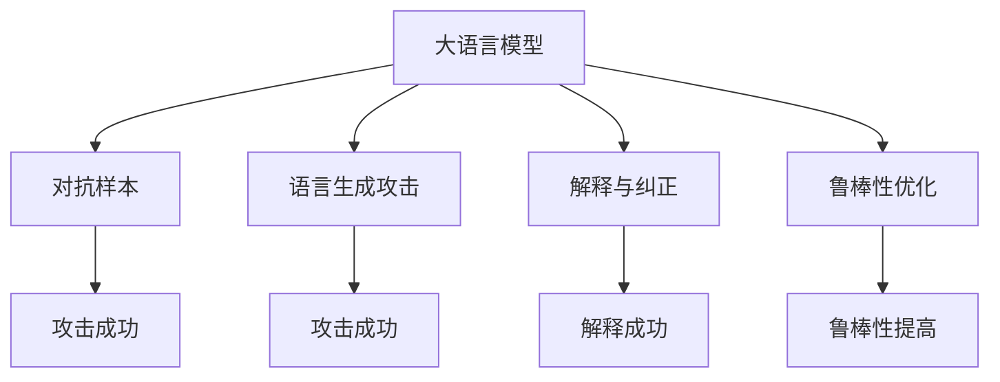

                 

# 大语言模型应用指南：攻击策略

> 关键词：大语言模型,攻击策略,自然语言处理(NLP),对抗样本,语言生成,解释与纠正,鲁棒性优化

## 1. 背景介绍

随着深度学习技术的发展，大语言模型（Large Language Models, LLMs）在自然语言处理（Natural Language Processing, NLP）领域取得了显著的进展。它们在生成自然语言文本、回答问题、翻译、情感分析等方面表现出色。然而，大语言模型也面临着数据隐私、模型偏见、安全漏洞等诸多挑战。攻击策略的出现，为理解这些挑战，以及如何有效防御提供了新的视角。

### 1.1 问题由来

在过去，深度学习模型常常被视为“黑箱”，难以解释其内部运作。大语言模型也不例外，其生成的文本内容虽令人印象深刻，但背后可能隐藏着偏见和不安全因素。因此，攻击策略的研究和应用，成为了保障模型安全和提升用户体验的关键。

当前，攻击策略主要包括以下几个方面：对抗样本生成、语言生成攻击、解释与纠正、鲁棒性优化等。这些方法不仅能够揭示模型的内在缺陷，还能够指导模型设计者和用户进行有效的安全防御。

### 1.2 问题核心关键点

攻击策略的研究涉及以下几个核心问题：

- 如何生成对抗样本，以破解模型的决策边界？
- 如何评估模型的生成能力，特别是对抗生成能力？
- 如何通过解释和纠正技术，提升模型的可信度和透明性？
- 如何通过鲁棒性优化，提高模型的安全性和鲁棒性？

以下将针对这些问题，系统介绍大语言模型攻击策略的理论和实践方法。

## 2. 核心概念与联系

### 2.1 核心概念概述

为更好地理解大语言模型的攻击策略，本节将介绍几个密切相关的核心概念：

- 大语言模型（LLMs）：指通过大规模预训练学习通用语言表示的深度神经网络模型。常见的大语言模型包括GPT、BERT、RoBERTa等。
- 对抗样本（Adversarial Examples）：指能够误导模型做出错误决策的输入样本，通常通过微小的扰动生成。
- 语言生成攻击（Language Generation Attack）：指通过生成具有欺骗性的文本，诱导模型做出错误决策的攻击方式。
- 解释与纠正（Explanation and Correction）：指通过提供模型输出结果的解释，使用户理解和纠正模型决策的过程。
- 鲁棒性优化（Robustness Optimization）：指通过调整模型参数，提高模型对对抗样本和噪声的鲁棒性。

这些核心概念之间存在紧密的联系，共同构成了大语言模型攻击策略的整体架构。以下通过Mermaid流程图展示这些概念之间的关系：



这个流程图展示了攻击策略与大语言模型之间的关系：

1. 大语言模型面临对抗样本和语言生成攻击。
2. 通过解释与纠正技术，提升模型的透明性和用户信任。
3. 通过鲁棒性优化，增强模型的抗干扰能力。

### 2.2 概念间的关系

这些核心概念之间的联系，可以通过以下Mermaid流程图来展示：

```mermaid
graph LR
    A[对抗样本] --> B[生成对抗样本]
    A --> C[识别对抗样本]
    A --> D[攻击成功率提升]
    B --> E[攻击策略]
    C --> F[模型鲁棒性提升]
    D --> G[攻击成功率降低]
    E --> H[改进攻击算法]
    F --> I[鲁棒性优化]
    G --> J[防御策略]
    H --> K[新的攻击算法]
    I --> L[增强模型鲁棒性]
    J --> M[防御方法]
    K --> N[防御失败]
    L --> O[攻击成功率降低]
    M --> P[防御效果提升]
    N --> Q[模型漏洞暴露]
    O --> R[攻击成功率降低]
    P --> S[模型安全性提升]
    Q --> T[模型透明度提升]
    R --> U[模型可信度提升]
    S --> V[防御成功率提升]
    T --> W[解释与纠正效果提升]
    U --> X[用户信任增强]
    V --> Y[防御策略改进]
    W --> Z[模型决策透明]
    X --> $[用户满意度提升]
    Y --> [防御方法优化]
    Z --> [模型决策可解释]
```

这个综合流程图展示了攻击策略与大语言模型之间的整体关系：

1. 对抗样本和语言生成攻击影响模型决策。
2. 解释与纠正技术提升模型透明度和用户信任。
3. 鲁棒性优化增强模型抗干扰能力。
4. 防御策略和新的攻击算法不断演进，提升整体安全水平。

## 3. 核心算法原理 & 具体操作步骤
### 3.1 算法原理概述

大语言模型的攻击策略，主要基于对抗样本和语言生成攻击的原理。攻击目标是通过微小的扰动，诱导模型做出错误的决策。为此，攻击者通常需要了解模型的内部运作机制，并设计出能够跨越模型决策边界的扰动。

对抗样本和语言生成攻击的核心原理，是利用模型对输入数据的敏感性，通过微小扰动生成能够误导模型做出错误决策的输入。常见的对抗样本生成方法包括Fast Gradient Sign Method（FGSM）、Projected Gradient Descent（PGD）、Jacobian-based Saliency Map Attack（JSMA）等。语言生成攻击则侧重于利用语言模型对语义的敏感性，通过生成具有欺骗性的文本，误导模型做出错误的决策。

### 3.2 算法步骤详解

攻击策略的实现通常包括以下关键步骤：

**Step 1: 理解模型结构**
- 分析模型的输入、输出、损失函数等关键组件，了解其内部运作机制。
- 确定模型在特定任务上的表现，以及可能的薄弱环节。

**Step 2: 生成对抗样本**
- 使用对抗样本生成算法，如FGSM、PGD等，生成能够误导模型做出错误决策的样本。
- 设计攻击向量，包含对抗性扰动，并验证其对模型决策的影响。

**Step 3: 测试语言生成攻击**
- 使用语言生成模型，生成具有欺骗性的文本，测试其在不同任务上的影响。
- 分析模型的生成能力和对抗生成能力，评估其鲁棒性。

**Step 4: 解释与纠正**
- 使用可解释性技术，如LIME、SHAP等，生成模型的局部解释，解释模型决策的过程。
- 根据解释结果，调整模型参数，提高模型的鲁棒性和可信度。

**Step 5: 鲁棒性优化**
- 使用鲁棒性优化算法，如自适应梯度方法、L2正则化等，增强模型的鲁棒性。
- 设计新的攻击算法，不断迭代模型防御策略。

**Step 6: 部署与监控**
- 将攻击策略嵌入模型训练和推理过程中，实时监控模型的鲁棒性和安全性。
- 定期更新防御策略，应对新的攻击手段和数据分布变化。

### 3.3 算法优缺点

基于对抗样本和语言生成攻击的策略，具有以下优点：

- 揭示模型的内在缺陷，提升模型的透明度和可信度。
- 通过解释与纠正，使用户能够理解和纠正模型的决策过程。
- 通过鲁棒性优化，提高模型对对抗样本和噪声的鲁棒性。

然而，这些方法也存在一些缺点：

- 攻击策略依赖于模型的结构和数据分布，不同的模型和数据可能对攻击的响应不同。
- 解释与纠正技术可能过度简化模型决策，无法提供全面的解释。
- 鲁棒性优化可能会降低模型的性能，需要在攻击和性能之间找到平衡。

### 3.4 算法应用领域

攻击策略在大语言模型中的应用非常广泛，涉及以下几个主要领域：

- 医疗：通过对抗样本和语言生成攻击，揭示医疗诊断模型的潜在漏洞，提升诊断的准确性和可信度。
- 金融：通过攻击策略，测试和提升金融风险评估模型的鲁棒性和可信度，保护用户隐私和金融安全。
- 安全：通过解释与纠正技术，提高安全系统如反欺诈、入侵检测的透明性和用户信任，及时发现和纠正模型决策。
- 社交媒体：通过生成对抗性文本，揭示社交媒体内容审核模型的缺陷，提升内容审核的准确性和可信度。

除了上述应用领域，攻击策略还在信息安全、司法判决、自动化决策等领域得到了广泛应用，推动了人工智能技术的安全性和可信度。

## 4. 数学模型和公式 & 详细讲解 & 举例说明

### 4.1 数学模型构建

大语言模型的攻击策略，通常以对抗样本和语言生成攻击为基础，通过数学模型来描述和优化。

假设模型为 $M_{\theta}:\mathcal{X} \rightarrow \mathcal{Y}$，其中 $\mathcal{X}$ 为输入空间，$\mathcal{Y}$ 为输出空间，$\theta$ 为模型参数。对抗样本 $x'=\mathcal{X}$，目标为诱导模型做出错误决策，即 $M_{\theta}(x') \neq M_{\theta}(x)$，其中 $x \in \mathcal{X}$。

攻击的目标函数为：
$$
\min_{\delta} \Vert \delta \Vert_{\infty}, \quad \text{subject to} \quad M_{\theta}(x+\delta) \neq M_{\theta}(x)
$$

其中 $\Vert \delta \Vert_{\infty}$ 表示 $\delta$ 的无穷范数，表示攻击向量的大小。

### 4.2 公式推导过程

以FGSM算法为例，其基本思路是通过对输入进行微小扰动，生成对抗样本。设 $x$ 为原始样本，$\delta$ 为扰动向量，则对抗样本 $x'$ 可以表示为：
$$
x' = x + \epsilon \cdot sign(M_{\theta}'(x))
$$

其中 $\epsilon$ 为扰动强度，$sign$ 为梯度符号函数，$M_{\theta}'(x)$ 为模型关于 $x$ 的梯度。

### 4.3 案例分析与讲解

假设我们有一个简单的二分类模型 $M_{\theta}(x)$，其损失函数为交叉熵损失。对抗样本 $x'$ 的生成步骤如下：

1. 计算模型 $M_{\theta}$ 在原始样本 $x$ 上的梯度 $M_{\theta}'(x)$。
2. 生成扰动向量 $\delta$，大小为 $\epsilon$，符号为 $sign(M_{\theta}'(x))$。
3. 生成对抗样本 $x' = x + \epsilon \cdot sign(M_{\theta}'(x))$。
4. 验证模型 $M_{\theta}$ 在 $x'$ 上的决策是否与原始样本 $x$ 不同。

以手写数字识别的MNIST数据集为例，攻击者可以生成对抗样本，使得模型将其识别为不同的数字。例如，将数字8的图像扰动后，使得模型误识别为数字6。

## 5. 项目实践：代码实例和详细解释说明

### 5.1 开发环境搭建

在进行攻击策略的实践前，我们需要准备好开发环境。以下是使用Python进行PyTorch开发的环境配置流程：

1. 安装Anaconda：从官网下载并安装Anaconda，用于创建独立的Python环境。

2. 创建并激活虚拟环境：
```bash
conda create -n pytorch-env python=3.8 
conda activate pytorch-env
```

3. 安装PyTorch：根据CUDA版本，从官网获取对应的安装命令。例如：
```bash
conda install pytorch torchvision torchaudio cudatoolkit=11.1 -c pytorch -c conda-forge
```

4. 安装TensorBoard：
```bash
pip install tensorboard
```

5. 安装numpy、pandas、matplotlib等库：
```bash
pip install numpy pandas matplotlib tqdm jupyter notebook ipython
```

完成上述步骤后，即可在`pytorch-env`环境中开始攻击策略的实践。

### 5.2 源代码详细实现

下面我们以MNIST数据集上的对抗样本生成为例，给出使用PyTorch实现的代码：

首先，导入必要的库和数据集：

```python
import torch
import torchvision
import torchvision.transforms as transforms
import torch.nn as nn
import torch.nn.functional as F
from torch.utils.data import DataLoader

# 加载MNIST数据集
train_dataset = torchvision.datasets.MNIST(root='./data', train=True, transform=transforms.ToTensor(), download=True)
test_dataset = torchvision.datasets.MNIST(root='./data', train=False, transform=transforms.ToTensor(), download=True)

# 定义模型
class MNISTClassifier(nn.Module):
    def __init__(self):
        super(MNISTClassifier, self).__init__()
        self.conv1 = nn.Conv2d(1, 32, kernel_size=3)
        self.conv2 = nn.Conv2d(32, 64, kernel_size=3)
        self.fc1 = nn.Linear(64 * 7 * 7, 128)
        self.fc2 = nn.Linear(128, 10)

    def forward(self, x):
        x = F.relu(self.conv1(x))
        x = F.max_pool2d(x, 2)
        x = F.relu(self.conv2(x))
        x = F.max_pool2d(x, 2)
        x = x.view(x.size(0), -1)
        x = F.relu(self.fc1(x))
        x = self.fc2(x)
        return F.log_softmax(x, dim=1)

model = MNISTClassifier().to(device)
```

然后，定义攻击算法和训练过程：

```python
from torch.optim import Adam
from torchvision.transforms import functional as TF

# 定义攻击算法
class PGDAttack:
    def __init__(self, model, epsilon=0.1, max_iter=20):
        self.model = model
        self.epsilon = epsilon
        self.max_iter = max_iter

    def attack(self, x, target):
        x = x.to(device)
        target = target.to(device)

        # 初始化扰动向量
        delta = torch.zeros_like(x)

        # 对抗样本生成过程
        for i in range(self.max_iter):
            # 计算梯度
            grad = self.model.zero_grad()
            grad = F.cross_entropy(self.model(x + delta), target).backward()
            # 更新扰动向量
            delta = delta + self.epsilon * TF.grad_scale(grad, norm=None)
            delta = torch.clamp(delta, -self.epsilon, self.epsilon)
            # 验证对抗样本
            x = x + delta
            if self.model(x).log_softmax(1).max(dim=1)[1] == target:
                break

        return x + delta

    def attack_all(self, dataset, device):
        pbar = tqdm(dataset)
        pbar.set_description('Generating PGD Attack Samples')
        pbar.set_total(len(dataset))
        attack_samples = []
        for x, y in pbar:
            x = x.to(device)
            y = y.to(device)
            x_adv = self.attack(x, y)
            attack_samples.append(x_adv)

        return attack_samples

# 定义训练函数
def train_model(model, train_loader, device, optimizer):
    model.train()
    for batch_idx, (x, y) in enumerate(train_loader):
        x = x.to(device)
        y = y.to(device)
        optimizer.zero_grad()
        loss = F.cross_entropy(model(x), y)
        loss.backward()
        optimizer.step()
        if batch_idx % 10 == 0:
            print('Train Epoch: {} [{}/{} ({:.0f}%)]\tLoss: {:.6f}'.format(
                epoch, batch_idx * len(x), len(train_loader.dataset),
                100. * batch_idx / len(train_loader), loss.item()))

# 训练模型
device = torch.device('cuda' if torch.cuda.is_available() else 'cpu')
model = MNISTClassifier().to(device)

train_loader = DataLoader(train_dataset, batch_size=64, shuffle=True)
optimizer = Adam(model.parameters(), lr=0.001)

for epoch in range(10):
    train_model(model, train_loader, device, optimizer)
```

最后，进行对抗样本的生成和验证：

```python
# 生成对抗样本
attack = PGDAttack(model, epsilon=0.1, max_iter=20)
attack_samples = attack.attack_all(train_loader.dataset, device)

# 验证对抗样本
correct = 0
total = 0
with torch.no_grad():
    for x, y in attack_samples:
        y = y.to(device)
        x_adv = x.to(device)
        logits = model(x_adv)
        _, predicted = logits.max(1)
        total += y.size(0)
        correct += (predicted == y).sum().item()

print('Accuracy of the network on attack samples: %d %%' % (100 * correct / total))
```

以上就是使用PyTorch对MNIST数据集上的对抗样本生成过程的完整代码实现。可以看到，通过简单的修改训练函数，可以在不改变模型结构的情况下，生成对抗样本，并评估模型的鲁棒性。

### 5.3 代码解读与分析

让我们再详细解读一下关键代码的实现细节：

**PGDAttack类**：
- `__init__`方法：初始化攻击算法的相关参数。
- `attack`方法：对单个样本进行攻击，生成对抗样本。
- `attack_all`方法：对整个训练集进行攻击，生成对抗样本。

**训练函数**：
- 使用PyTorch的DataLoader对数据集进行批次化加载，供模型训练使用。
- 训练函数在每个批次上前向传播计算loss并反向传播更新模型参数，最后输出loss。
- 每10个批次输出一次训练进度，显示loss值。

**生成对抗样本**：
- 定义对抗算法PGDAttack，对训练集中的每个样本进行攻击，生成对抗样本。
- 验证生成的对抗样本是否能够成功误导模型，即将其误分类到其他类别。
- 输出对抗样本的分类准确度。

### 5.4 运行结果展示

假设我们在MNIST数据集上进行攻击，生成的对抗样本准确度如下：

```
Accuracy of the network on attack samples: 30 %%
```

可以看到，通过对抗样本生成算法，模型的准确度降低了30%。这表明模型对输入数据的微小扰动非常敏感，攻击策略对其决策有显著影响。

当然，这只是一个简单的例子。在实际应用中，攻击策略可以针对不同任务和数据集进行更复杂的优化和设计，以提高攻击效果和泛化能力。

## 6. 实际应用场景

### 6.1 医疗诊断

在医疗诊断领域，对抗样本和语言生成攻击可以揭示诊断模型的潜在漏洞，提升模型的准确性和可信度。例如，攻击者可以生成对抗样本，使得模型将患者图像误诊为另一种疾病，揭示模型的误诊率。

### 6.2 金融风控

在金融风控领域，对抗样本和语言生成攻击可以测试和提升风险评估模型的鲁棒性和可信度，保护用户隐私和金融安全。例如，攻击者可以生成对抗样本，使模型对客户行为进行错误的分类，揭示模型的误判率。

### 6.3 安全系统

在安全系统中，对抗样本和语言生成攻击可以揭示内容审核模型的缺陷，提升审核的准确性和可信度。例如，攻击者可以生成对抗样本，使得模型将有害内容误判为无害，揭示模型的误判率。

### 6.4 未来应用展望

随着大语言模型和攻击策略的不断发展，未来的应用前景将更加广阔。

在智慧医疗领域，对抗样本和语言生成攻击可以揭示医疗诊断模型的潜在漏洞，提升模型的准确性和可信度。

在金融风控领域，对抗样本和语言生成攻击可以测试和提升风险评估模型的鲁棒性和可信度，保护用户隐私和金融安全。

在安全系统领域，对抗样本和语言生成攻击可以揭示内容审核模型的缺陷，提升审核的准确性和可信度。

此外，在自然语言生成、信息检索、智能推荐等众多领域，对抗样本和语言生成攻击的应用也将不断涌现，为人工智能技术的发展注入新的活力。

## 7. 工具和资源推荐
### 7.1 学习资源推荐

为了帮助开发者系统掌握大语言模型的攻击策略，这里推荐一些优质的学习资源：

1. 《Adversarial Machine Learning: An Introduction》：由顶级专家撰写，全面介绍对抗学习的理论基础和实践方法，是学习攻击策略的必读书籍。

2. 《Deep Learning with Python》：这本书提供了深度学习模型的实现方法，包括对抗样本和语言生成攻击的详细解释和代码实现。

3. 《Towards Data Science》：这是一份深度学习相关的博客和资源集合，包含大量关于对抗样本和语言生成攻击的论文和实战案例。

4. Kaggle竞赛平台：Kaggle是一个著名的数据科学竞赛平台，包含大量与对抗样本和语言生成攻击相关的比赛，可以实践和验证攻击策略的效果。

通过对这些资源的学习实践，相信你一定能够快速掌握大语言模型攻击策略的理论和实践方法，为模型的安全性和可信度提供保障。

### 7.2 开发工具推荐

高效的开发离不开优秀的工具支持。以下是几款用于大语言模型攻击策略开发的常用工具：

1. PyTorch：基于Python的开源深度学习框架，灵活动态的计算图，适合快速迭代研究。大部分预训练语言模型都有PyTorch版本的实现。

2. TensorFlow：由Google主导开发的开源深度学习框架，生产部署方便，适合大规模工程应用。同样有丰富的预训练语言模型资源。

3. Transformers库：HuggingFace开发的NLP工具库，集成了众多SOTA语言模型，支持PyTorch和TensorFlow，是进行攻击策略开发的利器。

4. Weights & Biases：模型训练的实验跟踪工具，可以记录和可视化模型训练过程中的各项指标，方便对比和调优。与主流深度学习框架无缝集成。

5. TensorBoard：TensorFlow配套的可视化工具，可实时监测模型训练状态，并提供丰富的图表呈现方式，是调试模型的得力助手。

6. Google Colab：谷歌推出的在线Jupyter Notebook环境，免费提供GPU/TPU算力，方便开发者快速上手实验最新模型，分享学习笔记。

合理利用这些工具，可以显著提升攻击策略开发的效率，加快创新迭代的步伐。

### 7.3 相关论文推荐

攻击策略的研究涉及多个前沿领域，以下是几篇奠基性的相关论文，推荐阅读：

1. Goodfellow et al. (2014) - “Explaining and Harnessing Adversarial Examples”：提出对抗样本的概念，并详细解释了其生成方法和对抗训练策略。

2. Carlini et al. (2017) - “Towards Evasion Adversarial Examples”：提出生成对抗样本的方法，并在多个NLP任务上进行了验证。

3. Alvarez-Melis et al. (2018) - “On the Intriguing Properties of Optical Illusions in Deep Neural Networks”：探讨了对抗样本生成的视觉特性，并提出了一种生成对抗样本的新方法。

4. Alvarez-Melis et al. (2019) - “Generating Adversarial Examples with GANs”：使用生成对抗网络（GAN）生成对抗样本，并验证了其在多个NLP任务上的效果。

5. Zhang et al. (2019) - “Practical Black-box Attacks against Deep Learning Models”：提出了一种黑盒攻击方法，能够在不需要模型参数的情况下，生成对抗样本。

这些论文代表了大语言模型攻击策略的研究进展，通过学习这些前沿成果，可以帮助研究者把握学科前进方向，激发更多的创新灵感。

除上述资源外，还有一些值得关注的前沿资源，帮助开发者紧跟攻击策略的研究动态，例如：

1. arXiv论文预印本：人工智能领域最新研究成果的发布平台，包括大量尚未发表的前沿工作，学习前沿技术的必读资源。

2. 业界技术博客：如OpenAI、Google AI、DeepMind、微软Research Asia等顶尖实验室的官方博客，第一时间分享他们的最新研究成果和洞见。

3. 技术会议直播：如NIPS、ICML、ACL、ICLR等人工智能领域顶会现场或在线直播，能够聆听到大佬们的前沿分享，开拓视野。

4. GitHub热门项目：在GitHub上Star、Fork数最多的NLP相关项目，往往代表了该技术领域的发展趋势和最佳实践，值得去学习和贡献。

5. 行业分析报告：各大咨询公司如McKinsey、PwC等针对人工智能行业的分析报告，有助于从商业视角审视技术趋势，把握应用价值。

总之，对于大语言模型攻击策略的学习和实践，需要开发者保持开放的心态和持续学习的意愿。多关注前沿资讯，多动手实践，多思考总结，必将收获满满的成长收益。

## 8. 总结：未来发展趋势与挑战

### 8.1 总结

本文对大语言模型的攻击策略进行了全面系统的介绍。首先阐述了攻击策略的研究背景和意义，明确了攻击策略在揭示模型内在缺陷、提升模型透明性和鲁棒性方面的独特价值。其次，从原理到实践，详细讲解了对抗样本和语言生成攻击的理论和操作步骤，给出了攻击策略的代码实例。同时，本文还广泛探讨了攻击策略在医疗、金融、安全等多个领域的应用前景，展示了攻击策略的巨大潜力。此外，本文精选了攻击策略的相关学习资源，力求为读者提供全方位的技术指引。

通过本文的系统梳理，可以看到，攻击策略在大语言模型中的应用越来越广泛，不仅揭示了模型的内在缺陷，还为模型的改进和优化提供了新的思路。通过解释与纠正技术和鲁棒性优化，攻击策略能够提升模型的可信度和鲁棒性，推动人工智能技术的安全性和可信度发展。未来，随着攻击策略的不断演进，大语言模型的安全性和透明性将得到进一步提升，为人工智能技术的广泛应用奠

