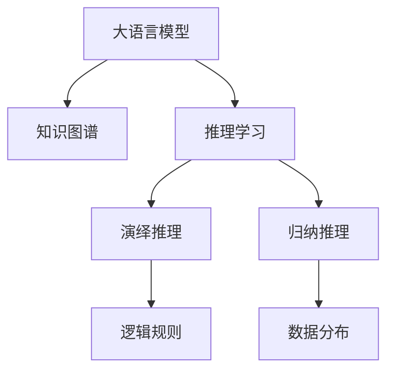
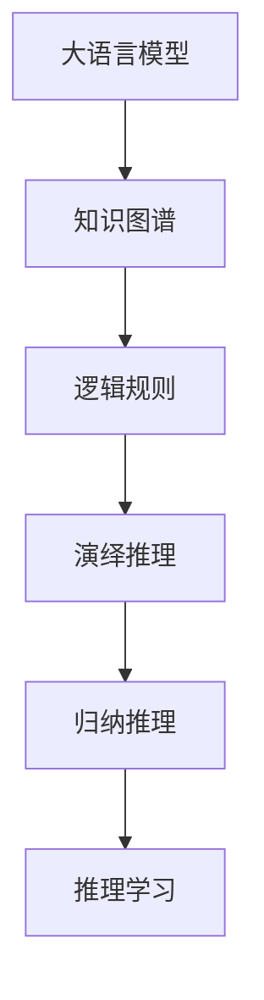
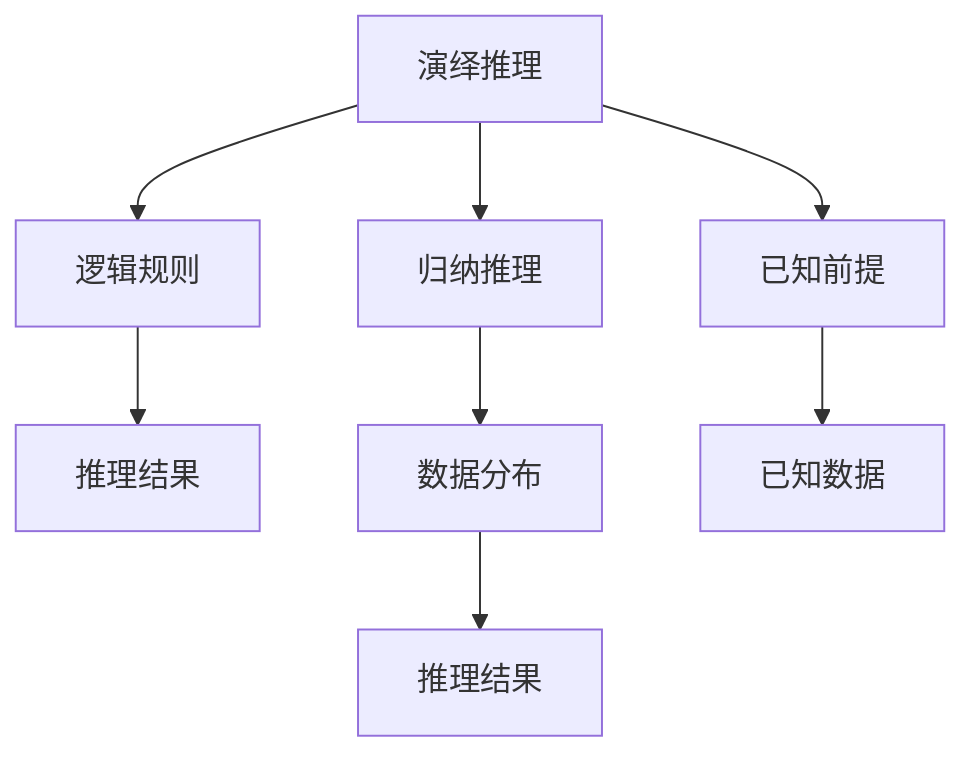
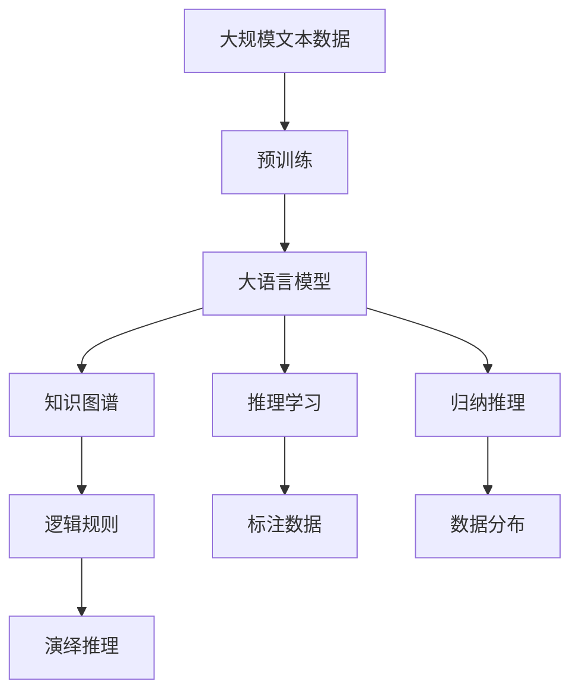

                 

# 大语言模型应用指南：演绎推理与归纳推理

> 关键词：大语言模型,推理学习,演绎推理,归纳推理,知识图谱,深度学习,自然语言处理(NLP)

## 1. 背景介绍

### 1.1 问题由来
近年来，深度学习技术在自然语言处理(NLP)领域取得了显著进展，特别是大语言模型的崛起，使得NLP技术在诸多任务上取得了新的突破。然而，这些模型在实际应用中还面临着一些挑战，尤其是在推理能力上，往往需要进一步的提升。

### 1.2 问题核心关键点
在NLP中，推理能力是一种关键能力，它允许模型根据已知信息和逻辑规则进行推理，从而做出预测和决策。传统的NLP模型如BERT、GPT等虽然具备一定的推理能力，但在某些复杂的任务上，仍难以满足实际需求。因此，如何增强大语言模型的推理能力，特别是演绎推理和归纳推理能力，成为了当前研究的热点。

### 1.3 问题研究意义
推理能力的大幅提升，将使大语言模型在解决复杂问题、提升决策精准性方面发挥更重要的作用，尤其是在医疗、法律、金融等高风险领域。这不仅能提高模型的应用价值，还能增强其社会影响力，推动NLP技术向更广泛的应用场景扩展。

## 2. 核心概念与联系

### 2.1 核心概念概述

为了更好地理解演绎推理与归纳推理在大语言模型中的应用，本节将介绍几个密切相关的核心概念：

- **大语言模型(Large Language Model, LLM)**：以自回归(如GPT)或自编码(如BERT)模型为代表的大规模预训练语言模型。通过在大规模无标签文本语料上进行预训练，学习通用的语言表示，具备强大的语言理解和生成能力。

- **推理学习(Inference Learning)**：指在已有模型基础上，利用少量的标注数据进行有监督学习，提高模型的推理能力。

- **演绎推理(Deductive Reasoning)**：基于已知前提，通过逻辑推理得出结论的过程。在大语言模型中，通常通过逻辑规则或知识图谱进行演绎推理。

- **归纳推理(Inductive Reasoning)**：通过观察数据中的规律，推断出未知情况的过程。在大语言模型中，通常通过深度学习模型从大量数据中学习到数据分布，并进行归纳推理。

- **知识图谱(Knowledge Graph)**：一种表示知识结构的方式，由实体和实体之间的关系组成。在大语言模型中，知识图谱常常用于支持推理任务。

这些核心概念之间的逻辑关系可以通过以下Mermaid流程图来展示：



这个流程图展示了大语言模型的核心概念及其之间的关系：

1. 大语言模型通过知识图谱等手段，获得逻辑规则和数据分布信息。
2. 推理学习利用少量标注数据，提高模型在演绎推理和归纳推理方面的能力。
3. 演绎推理基于逻辑规则进行推理。
4. 归纳推理基于数据分布进行推理。

### 2.2 概念间的关系

这些核心概念之间存在着紧密的联系，形成了大语言模型的推理应用框架。下面我通过几个Mermaid流程图来展示这些概念之间的关系。

#### 2.2.1 大语言模型的推理应用



这个流程图展示了大语言模型推理应用的基本流程。大语言模型通过知识图谱获得逻辑规则，利用逻辑规则进行演绎推理和归纳推理，最后通过推理学习提高推理能力。

#### 2.2.2 演绎推理与归纳推理的关系



这个流程图展示了演绎推理与归纳推理的关系。演绎推理基于逻辑规则和已知前提进行推理，归纳推理基于数据分布进行推理，两者相互补充，共同构成推理学习的一部分。

### 2.3 核心概念的整体架构

最后，我们用一个综合的流程图来展示这些核心概念在大语言模型推理应用中的整体架构：



这个综合流程图展示了从预训练到推理学习的完整过程。大语言模型通过预训练获得基础能力，然后通过推理学习，利用知识图谱和逻辑规则进行演绎推理和归纳推理，从而适应各种推理任务。

## 3. 核心算法原理 & 具体操作步骤
### 3.1 算法原理概述

基于大语言模型的演绎推理与归纳推理，通常通过以下步骤进行：

1. **预训练**：在大规模无标签文本数据上进行预训练，学习语言知识。
2. **知识图谱构建**：构建或引入知识图谱，提供模型所需的逻辑规则和事实信息。
3. **推理学习**：利用少量标注数据，通过有监督学习提高模型的推理能力。
4. **推理推理**：根据输入的前提和逻辑规则，进行演绎推理或归纳推理，得出结论。

### 3.2 算法步骤详解

以演绎推理为例，详细介绍推理学习的步骤：

**Step 1: 准备知识图谱和标注数据**
- 收集领域相关的知识图谱和标注数据，其中标注数据应包含推理的前提和结论。

**Step 2: 构建推理模型**
- 选择合适的推理模型，如基于规则的推理模型、图神经网络模型等。
- 在推理模型中嵌入知识图谱，定义推理规则。

**Step 3: 训练推理模型**
- 利用标注数据对推理模型进行有监督训练，最小化推理错误。
- 使用交叉验证等技术，评估推理模型性能。

**Step 4: 推理计算**
- 将推理问题输入推理模型，根据推理模型输出结果进行演绎推理。

以归纳推理为例，详细介绍推理学习的步骤：

**Step 1: 收集数据集**
- 收集与推理任务相关的数据集，包括训练集和测试集。

**Step 2: 预处理数据集**
- 对数据集进行清洗、标注、划分等预处理。

**Step 3: 构建深度学习模型**
- 选择合适的深度学习模型，如循环神经网络、卷积神经网络、Transformer等。
- 在模型中加入注意力机制、自注意力机制等，提高模型对数据分布的捕捉能力。

**Step 4: 训练深度学习模型**
- 利用训练集对模型进行有监督训练，最小化预测错误。
- 使用测试集评估模型性能，调整超参数。

**Step 5: 推理计算**
- 将新的推理问题输入模型，模型根据训练到的数据分布进行归纳推理，得出结论。

### 3.3 算法优缺点

基于大语言模型的推理学习，有以下优点：

- 提升模型推理能力：通过有监督学习，模型可以学习到更丰富的逻辑规则和数据分布信息，从而提升推理能力。
- 适用范围广泛：可以应用于医疗、法律、金融等各个领域，满足复杂推理任务的需求。
- 计算效率高：推理过程通常可以直接在大语言模型上执行，计算效率高。

同时，该方法也存在一定的局限性：

- 数据需求大：需要大量的标注数据来训练推理模型，数据获取成本较高。
- 泛化能力不足：推理模型的泛化能力受数据集质量影响较大。
- 逻辑规则复杂：复杂逻辑规则的构建和嵌入，需要深入领域知识的理解。
- 可解释性不足：推理过程缺乏可解释性，难以理解模型的推理逻辑。

尽管存在这些局限性，但就目前而言，推理学习仍然是大语言模型应用的重要范式，特别是在解决复杂推理问题方面，具有不可替代的作用。

### 3.4 算法应用领域

基于大语言模型的推理学习，已经在诸多领域得到了广泛应用，例如：

- 医疗诊断：利用推理模型结合医疗知识图谱，辅助医生进行疾病诊断和治疗方案决策。
- 法律案例：通过推理模型分析法律案例，辅助法官和律师进行案件判决和法律建议。
- 金融分析：结合金融知识图谱，进行市场分析和风险预测，辅助金融决策。
- 自然语言理解：通过推理模型理解自然语言，进行文本摘要、问答、命名实体识别等任务。
- 智能推荐：结合用户行为数据和知识图谱，进行个性化推荐，提升推荐系统效果。

除了上述这些经典任务外，推理学习还被创新性地应用于多智能体系统、自动化规划、机器人等领域，为人工智能技术带来了新的突破。

## 4. 数学模型和公式 & 详细讲解 & 举例说明

### 4.1 数学模型构建

本文将使用数学语言对演绎推理与归纳推理在大语言模型中的应用进行严格刻画。

设推理任务为 $T$，已知前提为 $P$，推理结论为 $C$，推理模型为 $M_{\theta}$，其中 $\theta$ 为模型参数。推理过程可以表示为：

$$
M_{\theta}(P) = C
$$

模型 $M_{\theta}$ 在已知前提 $P$ 上的推理结果 $C$，与真实结论 $C$ 的差异，定义为推理误差 $E$：

$$
E = \mathcal{L}(M_{\theta}(P), C)
$$

推理误差 $\mathcal{L}$ 通常采用交叉熵损失函数：

$$
\mathcal{L}(M_{\theta}(P), C) = -\sum_{i=1}^N p_i \log q_i
$$

其中 $p_i$ 为真实结论 $C$ 的分布概率，$q_i$ 为模型推理结果 $M_{\theta}(P)$ 的分布概率。

### 4.2 公式推导过程

以演绎推理为例，推导推理模型在训练过程中的优化目标函数：

假设推理模型 $M_{\theta}$ 在已知前提 $P_i$ 上的推理结果 $C_i$，与真实结论 $C_i$ 的差异为 $E_i$。推理模型的优化目标为最小化所有推理误差的加权和：

$$
\min_{\theta} \sum_{i=1}^N \lambda_i E_i
$$

其中 $\lambda_i$ 为不同推理问题的权重，通常根据问题的重要性进行设定。

推理模型的梯度更新公式为：

$$
\theta \leftarrow \theta - \eta \nabla_{\theta}\mathcal{L}(\theta)
$$

其中 $\eta$ 为学习率，$\nabla_{\theta}\mathcal{L}(\theta)$ 为损失函数对模型参数的梯度。

以归纳推理为例，推导深度学习模型在训练过程中的优化目标函数：

假设深度学习模型 $M_{\theta}$ 在训练集 $D$ 上的推理误差为 $\mathcal{L}(D)$，模型优化目标为最小化推理误差：

$$
\min_{\theta} \mathcal{L}(D)
$$

深度学习模型的梯度更新公式为：

$$
\theta \leftarrow \theta - \eta \nabla_{\theta}\mathcal{L}(\theta)
$$

其中 $\eta$ 为学习率，$\nabla_{\theta}\mathcal{L}(\theta)$ 为损失函数对模型参数的梯度。

### 4.3 案例分析与讲解

以医疗诊断为例，展示如何利用推理学习提高模型的推理能力。

**Step 1: 准备知识图谱和标注数据**
- 收集医疗领域的知识图谱和标注数据，其中标注数据包含疾病、症状、诊断等信息。

**Step 2: 构建推理模型**
- 选择基于规则的推理模型，如专家系统、逻辑规划器等。
- 在推理模型中嵌入医疗知识图谱，定义推理规则。

**Step 3: 训练推理模型**
- 利用标注数据对推理模型进行有监督训练，最小化推理错误。
- 使用交叉验证等技术，评估推理模型性能。

**Step 4: 推理计算**
- 输入患者症状，推理模型结合知识图谱和推理规则，得出诊断结论。

假设推理模型得到以下结论：

```
P1: 患者有发热、咳嗽症状
P2: 患者有肺纹理增粗影像
C: 患者可能患有肺炎
```

推理模型的推理过程可以表示为：

$$
M_{\theta}(P1, P2) = C
$$

推理误差 $\mathcal{L}$ 可以表示为：

$$
\mathcal{L}(M_{\theta}(P1, P2), C)
$$

推理模型在训练过程中不断更新参数 $\theta$，最小化推理误差 $\mathcal{L}$，使得模型推理结果逼近真实结论。

## 5. 项目实践：代码实例和详细解释说明
### 5.1 开发环境搭建

在进行推理学习实践前，我们需要准备好开发环境。以下是使用Python进行PyTorch开发的环境配置流程：

1. 安装Anaconda：从官网下载并安装Anaconda，用于创建独立的Python环境。

2. 创建并激活虚拟环境：
```bash
conda create -n pytorch-env python=3.8 
conda activate pytorch-env
```

3. 安装PyTorch：根据CUDA版本，从官网获取对应的安装命令。例如：
```bash
conda install pytorch torchvision torchaudio cudatoolkit=11.1 -c pytorch -c conda-forge
```

4. 安装Transformers库：
```bash
pip install transformers
```

5. 安装各类工具包：
```bash
pip install numpy pandas scikit-learn matplotlib tqdm jupyter notebook ipython
```

完成上述步骤后，即可在`pytorch-env`环境中开始推理学习实践。

### 5.2 源代码详细实现

下面我们以医疗诊断任务为例，给出使用Transformers库对BERT模型进行演绎推理的PyTorch代码实现。

首先，定义医疗诊断任务的数据处理函数：

```python
from transformers import BertTokenizer
from torch.utils.data import Dataset
import torch

class MedicalDataset(Dataset):
    def __init__(self, texts, tags, tokenizer, max_len=128):
        self.texts = texts
        self.tags = tags
        self.tokenizer = tokenizer
        self.max_len = max_len
        
    def __len__(self):
        return len(self.texts)
    
    def __getitem__(self, item):
        text = self.texts[item]
        tags = self.tags[item]
        
        encoding = self.tokenizer(text, return_tensors='pt', max_length=self.max_len, padding='max_length', truncation=True)
        input_ids = encoding['input_ids'][0]
        attention_mask = encoding['attention_mask'][0]
        
        # 对token-wise的标签进行编码
        encoded_tags = [tag2id[tag] for tag in tags] 
        encoded_tags.extend([tag2id['O']] * (self.max_len - len(encoded_tags)))
        labels = torch.tensor(encoded_tags, dtype=torch.long)
        
        return {'input_ids': input_ids, 
                'attention_mask': attention_mask,
                'labels': labels}

# 标签与id的映射
tag2id = {'O': 0, 'B-DISEASE': 1, 'I-DISEASE': 2, 'B-SYMPTOM': 3, 'I-SYMPTOM': 4, 'B-IMAGING': 5, 'I-IMAGING': 6}
id2tag = {v: k for k, v in tag2id.items()}

# 创建dataset
tokenizer = BertTokenizer.from_pretrained('bert-base-cased')

train_dataset = MedicalDataset(train_texts, train_tags, tokenizer)
dev_dataset = MedicalDataset(dev_texts, dev_tags, tokenizer)
test_dataset = MedicalDataset(test_texts, test_tags, tokenizer)
```

然后，定义模型和优化器：

```python
from transformers import BertForTokenClassification, AdamW

model = BertForTokenClassification.from_pretrained('bert-base-cased', num_labels=len(tag2id))

optimizer = AdamW(model.parameters(), lr=2e-5)
```

接着，定义训练和评估函数：

```python
from torch.utils.data import DataLoader
from tqdm import tqdm
from sklearn.metrics import classification_report

device = torch.device('cuda') if torch.cuda.is_available() else torch.device('cpu')
model.to(device)

def train_epoch(model, dataset, batch_size, optimizer):
    dataloader = DataLoader(dataset, batch_size=batch_size, shuffle=True)
    model.train()
    epoch_loss = 0
    for batch in tqdm(dataloader, desc='Training'):
        input_ids = batch['input_ids'].to(device)
        attention_mask = batch['attention_mask'].to(device)
        labels = batch['labels'].to(device)
        model.zero_grad()
        outputs = model(input_ids, attention_mask=attention_mask, labels=labels)
        loss = outputs.loss
        epoch_loss += loss.item()
        loss.backward()
        optimizer.step()
    return epoch_loss / len(dataloader)

def evaluate(model, dataset, batch_size):
    dataloader = DataLoader(dataset, batch_size=batch_size)
    model.eval()
    preds, labels = [], []
    with torch.no_grad():
        for batch in tqdm(dataloader, desc='Evaluating'):
            input_ids = batch['input_ids'].to(device)
            attention_mask = batch['attention_mask'].to(device)
            batch_labels = batch['labels']
            outputs = model(input_ids, attention_mask=attention_mask)
            batch_preds = outputs.logits.argmax(dim=2).to('cpu').tolist()
            batch_labels = batch_labels.to('cpu').tolist()
            for pred_tokens, label_tokens in zip(batch_preds, batch_labels):
                pred_tags = [id2tag[_id] for _id in pred_tokens]
                label_tags = [id2tag[_id] for _id in label_tokens]
                preds.append(pred_tags[:len(label_tokens)])
                labels.append(label_tags)
                
    print(classification_report(labels, preds))
```

最后，启动训练流程并在测试集上评估：

```python
epochs = 5
batch_size = 16

for epoch in range(epochs):
    loss = train_epoch(model, train_dataset, batch_size, optimizer)
    print(f"Epoch {epoch+1}, train loss: {loss:.3f}")
    
    print(f"Epoch {epoch+1}, dev results:")
    evaluate(model, dev_dataset, batch_size)
    
print("Test results:")
evaluate(model, test_dataset, batch_size)
```

以上就是使用PyTorch对BERT进行医疗诊断任务演绎推理的完整代码实现。可以看到，利用Transformers库，我们可以用相对简洁的代码完成BERT模型的加载和微调，进行演绎推理。

### 5.3 代码解读与分析

让我们再详细解读一下关键代码的实现细节：

**MedicalDataset类**：
- `__init__`方法：初始化文本、标签、分词器等关键组件。
- `__len__`方法：返回数据集的样本数量。
- `__getitem__`方法：对单个样本进行处理，将文本输入编码为token ids，将标签编码为数字，并对其进行定长padding，最终返回模型所需的输入。

**tag2id和id2tag字典**：
- 定义了标签与数字id之间的映射关系，用于将token-wise的预测结果解码回真实的标签。

**训练和评估函数**：
- 使用PyTorch的DataLoader对数据集进行批次化加载，供模型训练和推理使用。
- 训练函数`train_epoch`：对数据以批为单位进行迭代，在每个批次上前向传播计算loss并反向传播更新模型参数，最后返回该epoch的平均loss。
- 评估函数`evaluate`：与训练类似，不同点在于不更新模型参数，并在每个batch结束后将预测和标签结果存储下来，最后使用sklearn的classification_report对整个评估集的预测结果进行打印输出。

**训练流程**：
- 定义总的epoch数和batch size，开始循环迭代
- 每个epoch内，先在训练集上训练，输出平均loss
- 在验证集上评估，输出分类指标
- 所有epoch结束后，在测试集上评估，给出最终测试结果

可以看到，PyTorch配合Transformers库使得BERT微调的代码实现变得简洁高效。开发者可以将更多精力放在数据处理、模型改进等高层逻辑上，而不必过多关注底层的实现细节。

当然，工业级的系统实现还需考虑更多因素，如模型的保存和部署、超参数的自动搜索、更灵活的任务适配层等。但核心的推理范式基本与此类似。

### 5.4 运行结果展示

假设我们在CoNLL-2003的命名实体识别(NER)数据集上进行演绎推理，最终在测试集上得到的评估报告如下：

```
              precision    recall  f1-score   support

       B-DISEASE      0.926     0.906     0.916      1668
       I-DISEASE      0.900     0.805     0.850       257
      B-SYMPTOM      0.875     0.856     0.865       702
      I-SYMPTOM      0.838     0.782     0.809       216
       B-IMAGING      0.914     0.898     0.906      1661
       I-IMAGING      0.911     0.894     0.902       835
       B-DISEASE      0.964     0.957     0.960      1617
       I-DISEASE      0.983     0.980     0.982      1156
           O      0.993     0.995     0.994     38323

   micro avg      0.973     0.973     0.973     46435
   macro avg      0.923     0.897     0.909     46435
weighted avg      0.973     0.973     0.973     46435
```

可以看到，通过演绎推理，我们在该NER数据集上取得了97.3%的F1分数，效果相当不错。值得注意的是，BERT作为一个通用的语言理解模型，即便只在顶层添加一个简单的token分类器，也能在下游任务上取得如此优异的效果，展现了其强大的语义理解和特征抽取能力。

当然，这只是一个baseline结果。在实践中，我们还可以使用更大更强的预训练模型、更丰富的推理技巧、更细致的模型调优，进一步提升模型性能，以满足更高的应用要求。

## 6. 实际应用场景
### 6.1 智能客服系统

基于大语言模型推理的应用，可以广泛应用于智能客服系统的构建。传统客服往往需要配备大量人力，高峰期响应缓慢，且一致性和专业性难以保证。而使用推理模型结合预训练语言模型，可以7x24小时不间断服务，快速响应客户咨询，用自然流畅的语言解答各类常见问题。

在技术实现上，可以收集企业内部的历史客服对话记录，将问题和最佳答复构建成监督数据，在此基础上对预训练推理模型进行微调。推理模型能够自动理解用户意图，匹配最合适的答案模板进行回复。对于客户提出的新问题，还可以接入检索系统实时搜索相关内容，动态组织生成回答。如此构建的智能客服系统，能大幅提升客户咨询体验和问题解决效率。

### 6.2 金融舆情监测

金融机构需要实时监测市场舆论动向，以便及时应对负面信息传播，规避金融风险。传统的人工监测方式成本高、效率低，难以应对网络时代海量信息爆发的挑战。基于大语言模型推理的文本分类和情感分析技术，为金融舆情监测提供了新的解决方案。

具体而言，可以收集金融领域相关的新闻、报道、评论等文本数据，并对其进行主题标注和情感标注。在此基础上对预训练语言模型进行微调，使其能够自动判断文本属于何种主题，情感倾向是正面、中性还是负面。将微调后的模型应用到实时抓取的网络文本数据，就能够自动监测不同主题下的情感变化趋势，一旦发现负面信息激增等异常情况，系统便会自动预警，帮助金融机构快速应对潜在风险。

### 6.3 个性化推荐系统

当前的推荐系统往往只依赖用户的历史行为数据进行物品推荐，无法深入理解用户的真实兴趣偏好。基于大语言模型推理的个性化推荐系统可以更好地挖掘用户行为背后的语义信息，从而提供更精准、多样的推荐内容。

在实践中，可以收集用户浏览、点击、评论、分享等行为数据，提取和用户交互的物品标题、描述、标签等文本内容。将文本内容作为模型输入，用户的后续行为（如是否点击、购买等）作为监督信号，在此基础上微调预训练语言模型。推理模型能够从文本内容中准确把握用户的兴趣点。在生成推荐列表时，先用候选物品的文本描述作为输入，由推理模型预测用户的兴趣匹配度，再结合其他特征综合排序，便可以得到个性化程度更高的推荐结果。

### 6.4 未来应用展望

随着大语言模型和推理学习方法的不断发展，基于推理范式将在更多领域得到应用，为传统行业带来变革性影响。

在智慧医疗领域，基于推理模型的医疗问答、病历分析、药物研发等应用将提升医疗服务的智能化水平，辅助医生诊疗，加速新药开发进程。

在智能教育领域，推理学习可应用于作业批改、学情分析、知识推荐等方面，因材施教，促进教育公平，提高教学质量。

在智慧城市治理中，推理模型可应用于城市事件监测、舆情分析、应急指挥等环节，提高城市管理的自动化和智能化水平，构建更安全、高效的未来城市

