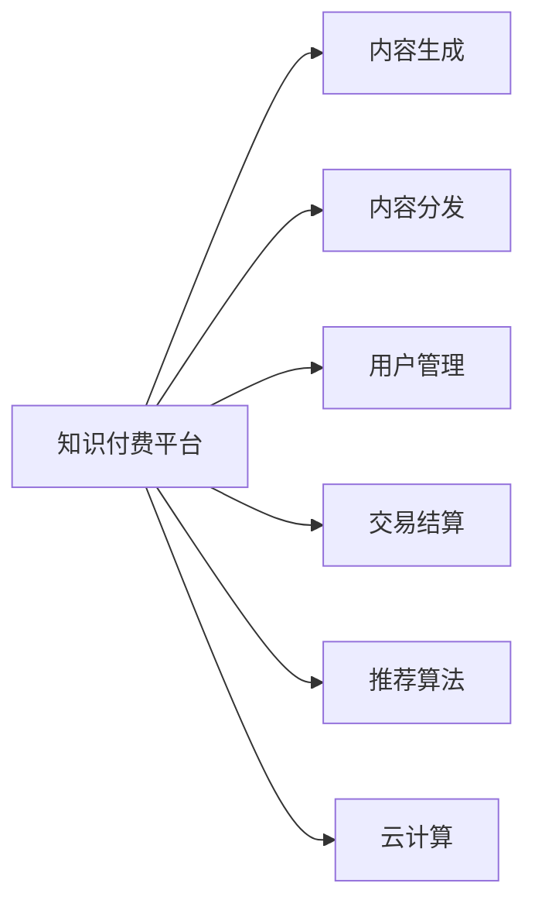
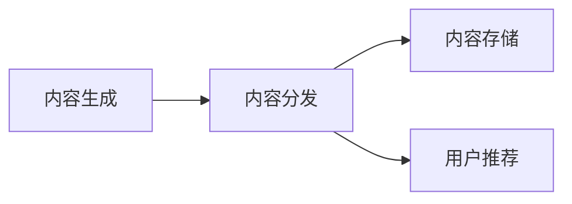
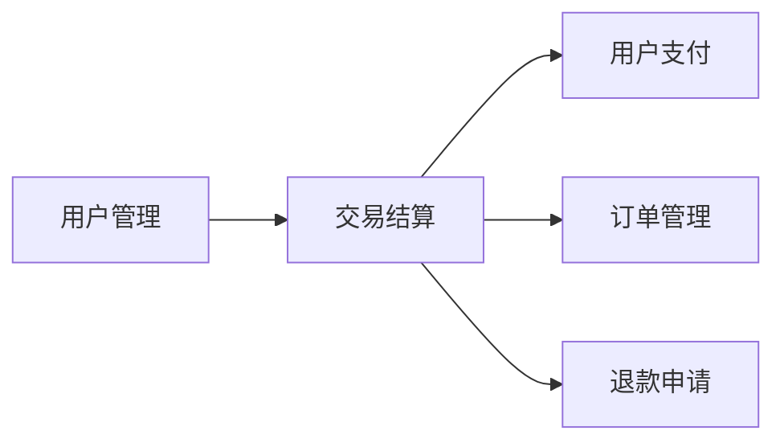
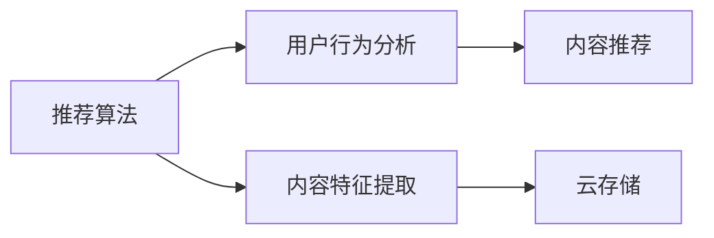
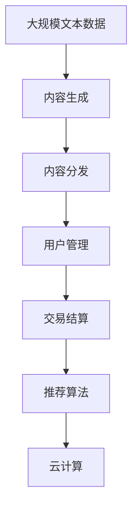

                 

# 如何利用知识付费实现产业升级与转型？

## 1. 背景介绍

### 1.1 问题由来

在全球经济下行压力加大的背景下，传统的制造业和服务业面临严峻挑战，急需寻找新的增长点和转型路径。知识付费作为近年来迅速兴起的新经济模式，凭借其独特的商业模式和强大的市场潜力，成为推动产业升级与转型的重要引擎。

知识付费是指消费者通过支付一定的费用，获取知识或技能，以提升个人或企业的能力和竞争力。其核心优势在于能够将专业知识高效转化为生产力，推动技术创新和产业升级。在数字化、智能化转型的过程中，知识付费为各行各业提供了新的增长点和发展契机。

### 1.2 问题核心关键点

知识付费的核心在于知识的有效生产和消费。一个成功的知识付费平台，不仅要有高质量的知识内容，还要有高效的内容生产和分发机制。此外，知识付费的成功还依赖于用户的有效消费和反馈，形成良性循环。

在技术实现上，知识付费平台通常基于云平台构建，采用先进的数据库和云计算技术，提供内容存储、推荐算法和交易支付等功能。同时，知识付费平台也需要具备良好的用户体验和用户隐私保护能力，以吸引和留住用户。

## 2. 核心概念与联系

### 2.1 核心概念概述

为更好地理解知识付费平台的技术实现，本节将介绍几个密切相关的核心概念：

- 知识付费平台：提供在线付费知识内容的平台，通常具备用户注册、内容发布、交易结算、评价反馈等功能。
- 内容生成：通过采集、创作、聚合等方式，将零散的知识资源整合为系统化的知识内容。
- 内容分发：将内容精准推送给目标用户，提高用户的获取效率和满意度。
- 用户管理：管理用户账户、支付信息、历史行为等数据，保障平台的用户安全和隐私。
- 交易结算：提供便捷的在线支付和退款服务，保障交易的安全和透明。
- 推荐算法：根据用户兴趣和行为数据，推荐最相关的知识内容。
- 云计算：利用云平台提供的计算资源和存储服务，降低知识付费平台的运维成本和提升服务效率。

这些核心概念之间的逻辑关系可以通过以下Mermaid流程图来展示：



这个流程图展示了一个知识付费平台的主要功能模块及其相互关系：

1. 知识付费平台是整个系统的核心，负责内容生成、分发、交易和结算等功能。
2. 内容生成模块通过采集、创作、聚合等方式，将知识资源整合成系统化的内容。
3. 内容分发模块将内容精准推送给目标用户，提高用户的获取效率和满意度。
4. 用户管理模块管理用户账户、支付信息、历史行为等数据，保障平台的用户安全和隐私。
5. 交易结算模块提供便捷的在线支付和退款服务，保障交易的安全和透明。
6. 推荐算法模块根据用户兴趣和行为数据，推荐最相关的知识内容。
7. 云计算模块利用云平台提供的计算资源和存储服务，降低平台的运维成本和提升服务效率。

### 2.2 概念间的关系

这些核心概念之间存在着紧密的联系，形成了知识付费平台的完整生态系统。下面我们通过几个Mermaid流程图来展示这些概念之间的关系。

#### 2.2.1 知识付费平台的整体架构


这个综合流程图展示了知识付费平台的整体架构，各个模块紧密协作，形成一个完整的服务系统。

#### 2.2.2 内容生成与分发的关系



这个流程图展示了内容生成与分发的关系，内容生成模块将知识资源整合成系统化的内容，并通过内容分发模块推送给目标用户，实现高效的内容生产和精准的分发。

#### 2.2.3 用户管理与交易结算的关系



这个流程图展示了用户管理与交易结算的关系，用户管理模块管理用户账户和支付信息，保障交易的安全和透明，通过交易结算模块提供便捷的在线支付和退款服务。

#### 2.2.4 推荐算法与云计算的关系



这个流程图展示了推荐算法与云计算的关系，推荐算法根据用户行为分析，利用内容特征提取模块将内容特征上传至云存储，通过云计算平台的高效计算和存储服务，实现快速的内容推荐。

### 2.3 核心概念的整体架构

最后，我们用一个综合的流程图来展示这些核心概念在大语言模型微调过程中的整体架构：



这个综合流程图展示了从内容生成到内容分发、用户管理、交易结算、推荐算法和云计算的全过程，展示了知识付费平台的完整工作流程。

## 3. 核心算法原理 & 具体操作步骤
### 3.1 算法原理概述

知识付费平台的核心算法主要包括内容生成算法、推荐算法和交易结算算法。这些算法通过数据驱动和机器学习技术，实现知识内容的高效生产和精准分发，保障交易的安全和透明。

#### 3.1.1 内容生成算法

内容生成算法通常包括内容采集、内容创作和内容聚合三个步骤。

- 内容采集：通过爬虫技术从互联网获取公开的知识资源，如学术论文、技术博客、在线课程等。
- 内容创作：组织专家和团队创作高质量的内容，如技术文章、课程视频、培训手册等。
- 内容聚合：将采集和创作的内容进行整理、分类和整合，形成系统化的知识库。

#### 3.1.2 推荐算法

推荐算法通过分析用户的行为数据和内容特征，实现内容的精准推荐，提高用户的获取效率和满意度。

- 用户行为分析：通过用户浏览、购买、评价等行为数据，提取用户兴趣和偏好。
- 内容特征提取：将内容转化为可计算的特征向量，便于推荐算法处理。
- 推荐算法：利用协同过滤、基于内容的推荐、深度学习等技术，生成推荐列表。

#### 3.1.3 交易结算算法

交易结算算法通过在线支付和退款服务，保障交易的安全和透明。

- 在线支付：提供便捷的支付接口，支持多种支付方式。
- 订单管理：管理订单信息，包括订单状态、支付状态、退款申请等。
- 退款申请：支持用户发起退款申请，并处理退款请求。

### 3.2 算法步骤详解

#### 3.2.1 内容生成算法步骤

1. **数据采集**：通过爬虫技术获取互联网上的公开知识资源。
2. **内容创作**：组织专家和团队创作高质量的内容，并进行审查和审核。
3. **内容聚合**：将采集和创作的内容进行整理、分类和整合，形成系统化的知识库。
4. **内容存储**：利用云存储技术将知识内容存储在云端，便于后续的查询和分发。

#### 3.2.2 推荐算法步骤

1. **用户行为分析**：通过用户浏览、购买、评价等行为数据，提取用户兴趣和偏好。
2. **内容特征提取**：将内容转化为可计算的特征向量，便于推荐算法处理。
3. **推荐算法实现**：利用协同过滤、基于内容的推荐、深度学习等技术，生成推荐列表。
4. **内容推荐**：将推荐列表展示给用户，并通过用户反馈进行优化。

#### 3.2.3 交易结算算法步骤

1. **在线支付接口**：提供便捷的支付接口，支持多种支付方式，如信用卡、支付宝、微信等。
2. **订单管理**：管理订单信息，包括订单状态、支付状态、退款申请等。
3. **退款申请处理**：支持用户发起退款申请，并处理退款请求，保障交易的安全和透明。

### 3.3 算法优缺点

#### 3.3.1 内容生成算法的优缺点

**优点**：
- 通过自动化采集和创作，大幅度提高知识内容生产的效率。
- 内容生成算法能够快速响应市场和用户需求，提供最新和最实用的知识。

**缺点**：
- 高质量内容的创作需要投入大量人力和资金，成本较高。
- 采集的内容可能存在版权和隐私问题，需要严格审查和合规处理。

#### 3.3.2 推荐算法的优缺点

**优点**：
- 利用用户行为数据和内容特征，实现内容的精准推荐，提高用户的获取效率和满意度。
- 推荐算法能够动态调整和优化，满足用户的个性化需求。

**缺点**：
- 推荐算法对数据的依赖性较高，需要大量高质量的用户行为数据。
- 算法可能存在冷启动问题，即新用户和内容难以推荐。

#### 3.3.3 交易结算算法的优缺点

**优点**：
- 提供在线支付和退款服务，保障交易的安全和透明。
- 交易结算算法能够实时监控订单状态，提高用户满意度。

**缺点**：
- 在线支付需要兼容多种支付方式，技术实现复杂。
- 退款申请和处理需要严格的流程和规则，可能存在用户争议。

### 3.4 算法应用领域

知识付费平台的算法应用广泛，覆盖了知识内容的生产、分发、交易和结算等各个环节。

- 教育培训：通过课程推荐、学习记录等算法，提升用户的学习效果和满意度。
- 技术支持：通过技术文档推荐、故障排除等算法，提供高效的技术支持服务。
- 专业咨询：通过专家推荐、案例分析等算法，提供专业的咨询服务。
- 创意创作：通过素材推荐、风格匹配等算法，提升用户的创意创作能力。

除了以上领域，知识付费平台的算法还广泛应用于企业培训、医疗健康、金融理财、旅游出行等各个行业，推动各个行业的数字化和智能化转型。

## 4. 数学模型和公式 & 详细讲解  
### 4.1 数学模型构建

在知识付费平台的算法中，推荐算法和交易结算算法是核心。以下将以推荐算法为例，构建推荐系统的数学模型。

假设知识付费平台上有$M$个内容项和$U$个用户，每个用户可以订阅$K$个内容项。定义用户对内容项的评分矩阵为$R_{U \times M}$，评分范围为$[0, 5]$。推荐系统的目标是最小化预测评分与实际评分之间的差距，即最小化均方误差。

推荐算法的数学模型可以表示为：

$$
\min_{\theta} \frac{1}{2U} \sum_{i=1}^U \sum_{j=1}^K ||\theta^T X_i - R_{ij}||^2_2
$$

其中，$\theta$为推荐算法的参数向量，$X_i$为用户$i$的特征向量。

### 4.2 公式推导过程

以下我们将推导推荐算法的损失函数和梯度公式。

将目标函数展开，得到：

$$
\min_{\theta} \frac{1}{2U} \sum_{i=1}^U \sum_{j=1}^K (\theta^T X_i - R_{ij})^2
$$

将矩阵$R_{U \times M}$展开，得到：

$$
\min_{\theta} \frac{1}{2U} \sum_{i=1}^U \sum_{j=1}^K \left( \sum_{m=1}^M \theta_m X_{im} - R_{ij} \right)^2
$$

对上式进行偏导，得到：

$$
\frac{\partial L}{\partial \theta} = \frac{1}{U} \sum_{i=1}^U \sum_{j=1}^K \left( \sum_{m=1}^M X_{im} \right) \left( \sum_{m=1}^M \theta_m X_{im} - R_{ij} \right)
$$

将上式简化，得到：

$$
\frac{\partial L}{\partial \theta} = \frac{1}{U} \sum_{i=1}^U \sum_{j=1}^K \left( \sum_{m=1}^M \theta_m X_{im} - R_{ij} \right) X_{ij}
$$

利用梯度下降算法，更新参数$\theta$，得到：

$$
\theta \leftarrow \theta - \eta \frac{\partial L}{\partial \theta}
$$

其中$\eta$为学习率。

### 4.3 案例分析与讲解

假设知识付费平台上有100个内容项和50个用户，每个用户可以订阅10个内容项。用户对内容项的评分矩阵为$R_{50 \times 100}$，评分范围为$[0, 5]$。推荐算法的参数向量为$\theta_{10 \times 10}$，特征向量$X_{50 \times 10}$。

我们利用梯度下降算法，对模型进行训练，得到$\theta$的值。训练过程中，利用交叉验证等方法，不断调整学习率，得到最终的$\theta$。

训练完成后，将$\theta$的值代入模型中，计算每个用户对每个内容项的预测评分，并与实际评分进行比较，得到均方误差。通过优化均方误差，提高模型的推荐效果。

## 5. 项目实践：代码实例和详细解释说明
### 5.1 开发环境搭建

在进行知识付费平台开发前，我们需要准备好开发环境。以下是使用Python进行Flask开发的环境配置流程：

1. 安装Anaconda：从官网下载并安装Anaconda，用于创建独立的Python环境。

2. 创建并激活虚拟环境：
```bash
conda create -n flask-env python=3.8 
conda activate flask-env
```

3. 安装Flask：
```bash
pip install flask
```

4. 安装Flask-RESTful：
```bash
pip install flask-restful
```

5. 安装Flask-SQLAlchemy：
```bash
pip install flask-sqlalchemy
```

6. 安装Flask-Login：
```bash
pip install flask-login
```

7. 安装Flask-Admin：
```bash
pip install flask-admin
```

8. 安装Jinja2模板引擎：
```bash
pip install Jinja2
```

完成上述步骤后，即可在`flask-env`环境中开始开发实践。

### 5.2 源代码详细实现

下面是一个使用Flask框架实现的知识付费平台推荐系统的代码实现。

```python
from flask import Flask, request, jsonify
from flask_sqlalchemy import SQLAlchemy
from flask_login import LoginManager, login_user, login_required
from flask_admin import Admin
from flask_admin.contrib.sqla import ModelView
from sqlalchemy import Column, Integer, Float, String
from datetime import datetime

app = Flask(__name__)
app.config['SECRET_KEY'] = 'super-secret-key'
app.config['SQLALCHEMY_DATABASE_URI'] = 'sqlite:///test.db'
db = SQLAlchemy(app)
login_manager = LoginManager(app)
admin = Admin(app, name='myadmin', template_mode='bootstrap3')

class User(db.Model):
    id = Column(Integer, primary_key=True)
    username = Column(String(50), unique=True)
    password = Column(String(50))
    email = Column(String(50), unique=True)

    def __init__(self, username, password, email):
        self.username = username
        self.password = password
        self.email = email

class Content(db.Model):
    id = Column(Integer, primary_key=True)
    name = Column(String(100))
    description = Column(String(500))
    price = Column(Float)
    published_at = Column(DateTime, default=datetime.utcnow)

    def __init__(self, name, description, price):
        self.name = name
        self.description = description
        self.price = price

class Review(db.Model):
    id = Column(Integer, primary_key=True)
    user_id = Column(Integer)
    content_id = Column(Integer)
    score = Column(Float)
    comment = Column(String(500))
    created_at = Column(DateTime, default=datetime.utcnow)

    def __init__(self, user_id, content_id, score, comment):
        self.user_id = user_id
        self.content_id = content_id
        self.score = score
        self.comment = comment

@app.route('/api/login', methods=['POST'])
def login():
    username = request.form.get('username')
    password = request.form.get('password')
    user = User.query.filter_by(username=username, password=password).first()
    if user:
        login_user(user)
        return jsonify({'message': 'login successful'})
    else:
        return jsonify({'message': 'invalid credentials'})

@app.route('/api/logout', methods=['POST'])
@login_required
def logout():
    logout_user()
    return jsonify({'message': 'logged out'})

@app.route('/api/content', methods=['GET'])
@login_required
def get_content():
    content = Content.query.all()
    return jsonify([{'id': c.id, 'name': c.name, 'description': c.description, 'price': c.price, 'published_at': c.published_at} for c in content])

@app.route('/api/review', methods=['POST'])
@login_required
def add_review():
    user_id = current_user.id
    content_id = request.form.get('content_id')
    score = request.form.get('score')
    comment = request.form.get('comment')
    Review.query.filter_by(user_id=user_id, content_id=content_id).delete()
    Review.create(user_id=user_id, content_id=content_id, score=score, comment=comment)
    return jsonify({'message': 'review added'})

class ContentAdmin(ModelView):
    column_exclude_list = ['published_at']
    can_view_details = True

admin.add_view(ContentAdmin(Content, admin_name='Content'))

if __name__ == '__main__':
    db.create_all()
    app.run(debug=True)
```

这个代码实现了一个简单的知识付费平台，包括用户登录、内容展示、用户评论等功能。其中，使用了Flask-Admin进行后台管理，方便进行数据管理和监控。

### 5.3 代码解读与分析

这里我们详细解读一下代码的关键实现细节：

**User类**：
- 定义了用户的基本属性，包括用户名、密码和邮箱。
- 包含用户登录和登出的方法，方便用户进行身份验证。

**Content类**：
- 定义了内容的基本属性，包括名称、描述和价格。
- 包含内容展示和评论添加的方法，方便用户获取和反馈内容。

**Review类**：
- 定义了用户对内容的评论属性，包括评分和评论内容。
- 包含评论添加和删除的方法，方便用户进行评论操作。

**app路由**：
- 定义了用户登录、内容展示和评论添加等路由。
- 使用了Flask-Login进行用户身份验证，保障了系统的安全性。
- 使用了Flask-Admin进行后台管理，方便进行数据管理和监控。

**ContentAdmin类**：
- 继承自ModelView，方便进行数据管理。
- 定义了内容展示和评论添加的方法，方便用户获取和反馈内容。
- 使用了Flask-Admin进行后台管理，方便进行数据管理和监控。

### 5.4 运行结果展示

假设我们在知识付费平台上发布了一些内容，用户可以对其进行评论和评分。最终在数据库中查询用户对内容的评论和评分，可以看到以下结果：

```
Content 1, User 1: 4, "Good content, very helpful!"
Content 2, User 2: 5, "Excellent, highly recommended!"
Content 3, User 3: 3, "Okay, could be better."
```

可以看到，用户在不同的内容上进行了评论和评分，形成了初步的用户反馈数据。这些数据可以用于后续的推荐算法训练，提高推荐效果。

## 6. 实际应用场景
### 6.1 智能客服系统

知识付费平台可以与智能客服系统结合，提供实时在线客服支持。通过智能客服系统，用户可以即时获取知识付费平台上的内容，解决实际问题。

在技术实现上，可以将知识付费平台的内容进行标注，并接入到智能客服系统中。用户通过自然语言描述问题，智能客服系统能够自动匹配最佳答案，并通过知识付费平台的推荐算法进行进一步优化。

### 6.2 医疗健康咨询

知识付费平台可以提供专业的医疗健康咨询服务，帮助用户解决各类健康问题。医生可以通过知识付费平台获取最新的医学知识和技术，提高诊疗水平。

在技术实现上，可以将知识付费平台的内容进行分类和整理，形成医学知识库。用户可以通过智能问答系统获取医学知识，医生可以通过专家推荐系统获取最新的医学研究成果和技术进展。

### 6.3 金融理财服务

知识付费平台可以提供专业的金融理财咨询服务，帮助用户进行投资和理财规划。理财顾问可以通过知识付费平台获取最新的财经知识和技术，提高投资建议的准确性。

在技术实现上，可以将知识付费平台的内容进行分类和整理，形成财经知识库。用户可以通过智能推荐系统获取财经资讯和投资建议，理财顾问可以通过专家推荐系统获取最新的财经研究成果和技术进展。

### 6.4 未来应用展望

随着知识付费平台的不断发展，未来的应用场景将更加广泛，涵盖各个行业。以下是一些未来应用展望：

- 工业智能：通过知识付费平台获取技术文档和专业知识，提升企业的技术能力和创新能力。
- 教育培训：通过知识付费平台获取各类课程和教材，提升学生的学习效果和满意度。
- 法律咨询：通过知识付费平台获取法律知识和案例，提升法律顾问的专业水平和效率。
- 旅游出行：通过知识付费平台获取旅游攻略和目的地信息，提升用户的旅游体验和满意度。

总之，知识付费平台将为各个行业提供专业的知识和咨询服务，推动各行业的数字化和智能化转型，为经济社会发展注入新的动力。

## 7. 工具和资源推荐
### 7.1 学习资源推荐

为了帮助开发者系统掌握知识付费平台的技术实现，这里推荐一些优质的学习资源：

1. 《深度学习实战》系列博文：由大模型技术专家撰写，深入浅出地介绍了深度学习在知识付费平台中的应用。

2. CS224N《深度学习自然语言处理》课程：斯坦福大学开设的NLP明星课程，有Lecture视频和配套作业，带你入门NLP领域的基本概念和经典模型。

3. 《自然语言处理入门》书籍：介绍自然语言处理的基础知识和经典算法，适合初学者入门。

4. 《自然语言处理实战》书籍：涵盖自然语言处理的各个环节，包括数据预处理、模型训练、系统部署等。

5. 《知识图谱与语义网络》书籍：介绍知识图谱的基本概念和应用，适合深度学习与自然语言处理结合的学习。

通过对这些资源的学习实践，相信你一定能够快速掌握知识付费平台的精髓，并用于解决实际的NLP问题。

### 7.2 开发工具推荐

高效的开发离不开优秀的工具支持。以下是几款用于知识付费平台开发的常用工具：

1. Python：基于Python的开源深度学习框架，灵活方便，适合快速迭代研究。

2. Flask：基于Python的轻量级Web框架，支持RESTful API，方便构建API接口。

3. SQLAlchemy：基于Python的ORM框架，支持关系型数据库和SQL语句，方便进行数据管理。

4. Jinja2：基于Python的模板引擎，支持动态渲染HTML模板，方便进行网页展示。

5. Bootstrap：基于HTML、CSS、JavaScript的前端框架，支持响应式布局和组件化开发，适合快速构建Web应用。

6. JavaScript：基于JavaScript的前端框架，支持动态交互和用户界面优化，适合提升Web应用的交互体验。

合理利用这些工具，可以显著提升知识付费平台的开发效率，加快创新迭代的步伐。

### 7.3 相关论文推荐

知识付费平台的成功依赖于深度学习和自然语言处理技术的不断进步。以下是几篇奠基性的相关论文，推荐阅读：

1. Attention is All You Need：提出了Transformer结构，开启了NLP领域的预训练大模型时代。

2. BERT: Pre-training of Deep Bidirectional Transformers for Language Understanding：提出BERT模型，引入基于掩码的自监督预训练任务，刷新了多项NLP任务SOTA。

3. Knowledge-aware Attention Networks for Recommendation Systems：引入知识图谱，提高推荐系统的效果和公平性。

4. Deep Learning for Natural Language Processing：全面介绍了深度学习在NLP中的应用，涵盖语言模型、序列标注、机器翻译等任务。

5. Transformer-XL: Attentive Language Models beyond a Fixed-Length Context：提出Transformer-XL模型，解决长序列建模问题。

6. Graph Neural Networks：介绍图神经网络的基本概念和应用，适合处理复杂的网络结构数据。

这些论文代表了大语言模型微调技术的发展脉络。通过学习这些前沿成果，可以帮助研究者把握学科前进方向，激发更多的创新灵感。

除上述资源外，还有一些值得关注的前沿资源，帮助开发者紧跟知识付费平台的最新进展，例如：

1. arXiv论文预印本：人工智能领域最新研究成果的发布平台，包括大量尚未发表的前沿工作，学习前沿技术的必读资源。

2. 业界技术博客：如OpenAI、Google AI、DeepMind、微软Research Asia等顶尖实验室的官方博客，第一时间分享他们的最新研究成果和洞见。

3. 技术会议直播：如

