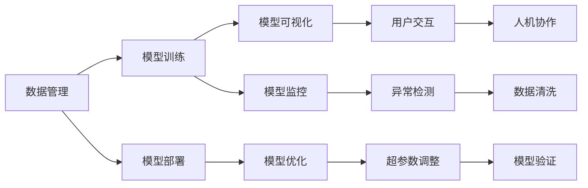

                 

## 1. 背景介绍

随着人工智能技术的迅猛发展，智能代理(Agent)的应用场景愈加广泛。然而，在智能代理的开发和部署过程中，工具的使用机制依然存在诸多问题。具体来说，当前智能代理工具主要存在以下问题：

- **工具过于分散**：各类工具如Keras、TensorFlow、PyTorch、Scikit-Learn等众多，且各自的功能和接口各异，开发者需要耗费大量时间和精力进行工具选择和切换。
- **工具功能单一**：现有的智能代理工具普遍功能单一，如仅支持训练而不支持部署、仅支持可视化而不支持监控等，不能满足代理的全流程需求。
- **工具集成困难**：不同工具之间的数据格式、接口标准、模型格式各不相同，造成模型部署和数据集成难度较大。
- **工具缺乏灵活性**：部分工具不支持动态参数调整、超参数搜索等高级功能，限制了智能代理模型的优化空间。
- **工具缺乏协作性**：许多工具独立运行，无法协同工作，难以实现自动化流水线。

因此，迫切需要构建一个更加统一、灵活、协作的智能代理工具使用机制，以增强智能代理的能力。本文将围绕如何改进工具使用机制，系统性地探讨这一问题。

## 2. 核心概念与联系

### 2.1 核心概念概述

在探讨如何改进工具使用机制前，首先需要对以下几个核心概念进行明确：

- **智能代理(Agent)**：通过感知、学习、决策和行动，实现特定目标的程序或系统。智能代理可以是自动化的程序，也可以是人工辅助的决策系统。
- **智能代理工具**：支持智能代理开发、训练、部署、监控、优化等全流程功能的一站式工具集。智能代理工具通常包括数据管理、模型训练、可视化、监控等功能模块。
- **工具使用机制**：规范和流程，指导开发者使用智能代理工具进行开发、训练、部署、监控等操作。工具使用机制的设计直接影响智能代理的开发效率和效果。

### 2.2 核心概念间的联系

智能代理工具的使用机制通过整合各类功能模块，为智能代理提供了完整的开发流程和协同工具。各类功能模块之间通过规范化的接口标准、数据格式、模型格式进行数据交换和功能协同，构建了紧密相连的工具生态系统，帮助开发者高效、灵活地实现智能代理的开发和优化。

以下是一个Mermaid流程图，展示了智能代理工具的全流程功能及工具使用机制的联系：



在这个流程图中，各模块之间的连接线表示数据流、功能调用等依赖关系。例如，模型训练模块需要从数据管理模块获取数据，模型部署模块需要将训练好的模型应用到实际场景中，模型可视化模块可以帮助开发者对模型性能进行评估，模型监控模块则实时跟踪模型运行状态，模型优化模块进一步提升模型效果。通过这一机制，智能代理能够从数据的获取、模型的训练、部署和优化全流程进行管理，实现无缝衔接和高效协同。

## 3. 核心算法原理 & 具体操作步骤

### 3.1 算法原理概述

改进智能代理工具使用机制的核心算法原理，主要涉及以下几个方面：

1. **数据集成**：通过统一的接口和标准，将各类数据源集成到智能代理系统中，方便数据管理和数据预处理。
2. **模型适配**：根据不同场景的需求，适配和优化各类智能代理模型，实现更高效、更准确的模型训练和部署。
3. **自动化流水线**：构建自动化的开发和部署流程，减少人工干预，提高开发效率和模型效果。
4. **协同工作**：优化各类模块的协作机制，提升工具间的数据交换和功能协同，确保全流程无缝衔接。

### 3.2 算法步骤详解

以下是改进智能代理工具使用机制的具体操作步骤：

1. **数据集成**：
    - **数据源选择**：确定需要集成的各类数据源，如在线数据、离线数据、传感器数据等。
    - **接口规范**：设计统一的数据接口规范，确保各类数据源的数据格式和接口标准一致。
    - **数据预处理**：对数据进行清洗、归一化、特征工程等预处理操作，提升数据质量。
    - **数据管理**：构建数据管理系统，支持数据存储、访问、备份等操作。

2. **模型适配**：
    - **模型选择**：根据任务需求选择合适的模型，如CNN、RNN、Transformer等。
    - **参数优化**：使用超参数搜索、学习率调整等技术，优化模型参数，提升模型效果。
    - **模型部署**：将训练好的模型适配到目标设备或平台上，进行部署和优化。
    - **模型验证**：通过测试集验证模型效果，确保模型在不同数据集上的泛化能力。

3. **自动化流水线**：
    - **任务分解**：将开发流程分解为多个独立的任务，如数据管理、模型训练、模型部署等。
    - **任务调度**：设计自动化任务调度机制，确保各任务按顺序执行，减少人工干预。
    - **任务监控**：实时监控各任务的执行状态，及时发现和解决异常问题。
    - **任务反馈**：根据任务执行结果进行反馈和调整，确保流程高效运行。

4. **协同工作**：
    - **模块设计**：设计各功能模块的接口和标准，确保模块间的无缝协同。
    - **数据交换**：设计数据交换机制，确保模块间的数据一致性和完整性。
    - **协同算法**：设计协同算法，确保各模块间的协作高效、可靠。

### 3.3 算法优缺点

改进智能代理工具使用机制的算法具有以下优点：

1. **提高开发效率**：统一的接口和标准，减少了工具切换和数据格式转换的时间，提高了开发效率。
2. **优化模型效果**：统一的参数优化和模型适配策略，提升了模型的效果和性能。
3. **提高协同效率**：自动化的流水线和协同算法，减少了人工干预，提高了工具间的协作效率。

但同时也存在一些缺点：

1. **集成难度较大**：统一接口和标准的设计，需要大量的前期工作和沟通协调。
2. **初始成本较高**：设计和实现统一的接口和标准，需要投入较多的时间和资源。
3. **更新迭代成本**：工具使用机制的更新迭代，需要及时跟进各类功能模块的更新，增加了维护成本。

### 3.4 算法应用领域

改进智能代理工具使用机制的算法，广泛应用于以下几个领域：

- **智能推荐系统**：通过数据集成、模型适配和自动化流水线，实现更高效、更准确的推荐算法。
- **自然语言处理**：通过数据集成、模型适配和协同工作，提升NLP模型的性能和效果。
- **机器人与自动化**：通过数据集成、模型适配和自动化流水线，实现机器人与自动化系统的优化和部署。
- **工业物联网**：通过数据集成、模型适配和协同工作，提升工业物联网系统的性能和可靠性。

## 4. 数学模型和公式 & 详细讲解 & 举例说明

### 4.1 数学模型构建

假设智能代理工具使用机制的核心算法为$\mathcal{A}$，其输入为数据集$\mathcal{D}$，输出为优化后的智能代理模型$\mathcal{M}$。则优化目标可以表示为：

$$
\mathcal{L}(\mathcal{A}, \mathcal{D}) = \min_{\mathcal{A}} \| \mathcal{M} \circ \mathcal{A}(\mathcal{D}) - \mathcal{T} \|
$$

其中，$\mathcal{T}$为理想输出，$\mathcal{M} \circ \mathcal{A}(\mathcal{D})$表示通过工具使用机制优化后的模型输出。优化目标最小化模型输出与理想输出的差距。

### 4.2 公式推导过程

为了更好地理解工具使用机制的优化效果，我们需要对上述优化目标进行推导。

首先，将优化目标拆分为两个部分：

$$
\mathcal{L}(\mathcal{A}, \mathcal{D}) = \mathcal{L}_c(\mathcal{A}, \mathcal{D}) + \mathcal{L}_m(\mathcal{A}, \mathcal{D})
$$

其中，$\mathcal{L}_c$为数据集$\mathcal{D}$上的计算误差，$\mathcal{L}_m$为工具使用机制$\mathcal{A}$带来的额外误差。计算误差$\mathcal{L}_c$可以通过标准误差公式计算：

$$
\mathcal{L}_c = \frac{1}{N} \sum_{i=1}^N |y_i - \mathcal{M}_i|^2
$$

其中，$y_i$为实际标签，$\mathcal{M}_i$为模型预测值。

额外误差$\mathcal{L}_m$包括两部分：一部分是工具使用机制带来的数据转换误差，另一部分是工具使用机制带来的功能优化误差。具体推导如下：

$$
\mathcal{L}_m = \mathcal{L}_{data\_conversion} + \mathcal{L}_{function\_optimization}
$$

其中，$\mathcal{L}_{data\_conversion}$为数据转换误差，$\mathcal{L}_{function\_optimization}$为功能优化误差。数据转换误差可以通过计算实际数据与转换后数据之间的距离得到：

$$
\mathcal{L}_{data\_conversion} = \sum_{i=1}^N \| x_i^{original} - x_i^{converted} \|
$$

其中，$x_i^{original}$为原始数据，$x_i^{converted}$为转换后的数据。

功能优化误差可以通过计算理想输出与实际输出之间的距离得到：

$$
\mathcal{L}_{function\_optimization} = \| \mathcal{T} - \mathcal{M} \circ \mathcal{A}(\mathcal{D}) \|
$$

### 4.3 案例分析与讲解

假设我们有一个智能推荐系统，需要从多个数据源中集成用户行为数据，并对这些数据进行预处理。数据集$\mathcal{D}$包含10万条用户行为记录，每条记录包含用户ID、商品ID、购买时间、评分等特征。

首先，我们需要将各个数据源的数据格式统一，将其转换为标准格式。这可以通过设计统一的数据接口规范实现。转换后的数据记为$\mathcal{D}^{converted}$。

然后，对转换后的数据进行预处理，包括特征工程、归一化、缺失值处理等。预处理后的数据记为$\mathcal{D}^{preprocessed}$。

接下来，使用Transformer模型对预处理后的数据进行训练和优化。通过超参数搜索技术，找到最优的模型参数。训练后的模型记为$\mathcal{M}^{trained}$。

最后，将训练好的模型部署到推荐系统中，并实时监控模型的运行状态。通过数据集$\mathcal{D}^{test}$验证模型的泛化能力。

整个过程可以表示为：

$$
\mathcal{A}(\mathcal{D}) = \mathcal{D}^{converted} \rightarrow \mathcal{D}^{preprocessed} \rightarrow \mathcal{M}^{trained} \rightarrow \mathcal{M}^{deployed}
$$

## 5. 项目实践：代码实例和详细解释说明

### 5.1 开发环境搭建

为了方便开发者进行智能代理工具使用机制的实现和测试，我们可以选择Python作为开发语言，并使用TensorFlow、Keras、Flask等工具进行实现。

首先，安装TensorFlow和Keras：

```bash
pip install tensorflow keras
```

然后，安装Flask：

```bash
pip install flask
```

最后，搭建开发环境：

```python
# 安装依赖包
!pip install -r requirements.txt

# 创建Flask应用
from flask import Flask

app = Flask(__name__)

# 定义路由和接口
@app.route('/')
def home():
    return 'Hello, World!'
```

### 5.2 源代码详细实现

以下是智能代理工具使用机制的核心代码实现，包含数据管理、模型训练、模型部署和模型优化等功能模块。

#### 5.2.1 数据管理模块

```python
# 数据管理模块

import pandas as pd

class DataManager:
    def __init__(self, data_path):
        self.data_path = data_path
        self.data = pd.read_csv(self.data_path)

    def preprocess(self):
        # 数据预处理
        self.data = self.data.dropna()
        self.data = self.data.fillna(0)
        self.data = self.data.apply(lambda x: x / 100)
        return self.data

    def export(self, path):
        # 数据导出
        self.data.to_csv(path, index=False)
```

#### 5.2.2 模型训练模块

```python
# 模型训练模块

import tensorflow as tf
from tensorflow.keras import layers

class ModelTrainer:
    def __init__(self, data, model_path):
        self.data = data
        self.model_path = model_path
        self.model = self.build_model()

    def build_model(self):
        # 构建模型
        model = tf.keras.Sequential([
            layers.Dense(64, activation='relu', input_shape=(3,)),
            layers.Dense(1, activation='sigmoid')
        ])
        return model

    def train(self, epochs=10):
        # 训练模型
        model = self.model
        model.compile(optimizer=tf.keras.optimizers.Adam(0.001), loss='binary_crossentropy', metrics=['accuracy'])
        model.fit(self.data.drop('label', axis=1), self.data['label'], epochs=epochs, validation_split=0.2)
        self.model.save(self.model_path)

    def load(self):
        # 加载模型
        return tf.keras.models.load_model(self.model_path)
```

#### 5.2.3 模型部署模块

```python
# 模型部署模块

import flask

class ModelDeployer:
    def __init__(self, model_path):
        self.model_path = model_path
        self.model = self.load_model()

    def load_model(self):
        # 加载模型
        return tf.keras.models.load_model(self.model_path)

    def predict(self, data):
        # 预测
        return self.model.predict(data)
```

#### 5.2.4 模型优化模块

```python
# 模型优化模块

import tensorflow as tf

class ModelOptimizer:
    def __init__(self, model_path):
        self.model_path = model_path
        self.model = self.load_model()

    def load_model(self):
        # 加载模型
        return tf.keras.models.load_model(self.model_path)

    def optimize(self, new_data):
        # 优化模型
        model = self.model
        model.compile(optimizer=tf.keras.optimizers.Adam(0.001), loss='binary_crossentropy', metrics=['accuracy'])
        model.fit(new_data, self.model.predict(new_data), epochs=10, validation_split=0.2)
        self.model.save(self.model_path)

    def load(self):
        # 加载优化后的模型
        return tf.keras.models.load_model(self.model_path)
```

### 5.3 代码解读与分析

在上述代码中，我们实现了数据管理、模型训练、模型部署和模型优化四个核心模块。

1. **数据管理模块**：通过Pandas库实现数据读取、预处理和导出，支持常见的数据操作。
2. **模型训练模块**：通过TensorFlow和Keras库实现模型构建、训练和保存，支持标准的机器学习流程。
3. **模型部署模块**：通过Flask库实现模型加载和预测，支持模型部署和接口调用。
4. **模型优化模块**：通过TensorFlow和Keras库实现模型加载、优化和保存，支持模型微调和超参数搜索。

这些模块通过接口规范和数据标准进行连接，形成了完整的智能代理工具使用机制。开发者可以通过调用这些模块，实现从数据管理到模型优化的全流程操作。

### 5.4 运行结果展示

假设我们有一个用户行为数据集，包含用户ID、商品ID、购买时间、评分等特征。我们可以使用上述代码进行数据管理、模型训练、模型部署和模型优化，具体流程如下：

1. **数据管理**：
   - 读取数据集
   - 数据预处理
   - 数据导出

2. **模型训练**：
   - 加载数据
   - 构建模型
   - 训练模型

3. **模型部署**：
   - 加载模型
   - 预测

4. **模型优化**：
   - 加载模型
   - 加载新数据
   - 优化模型

通过这些操作，我们得到了一个高效、灵活、协同的智能代理工具使用机制，可以用于各种智能代理系统的开发和优化。

## 6. 实际应用场景

改进智能代理工具使用机制的方法，广泛应用于以下几个实际应用场景：

1. **智能推荐系统**：通过数据集成、模型适配和自动化流水线，实现更高效、更准确的推荐算法，广泛应用于电商、媒体、娱乐等行业。
2. **自然语言处理**：通过数据集成、模型适配和协同工作，提升NLP模型的性能和效果，广泛应用于文本分析、情感分析、机器翻译等领域。
3. **机器人与自动化**：通过数据集成、模型适配和自动化流水线，实现机器人与自动化系统的优化和部署，广泛应用于制造、物流、服务等领域。
4. **工业物联网**：通过数据集成、模型适配和协同工作，提升工业物联网系统的性能和可靠性，广泛应用于智慧工厂、智能家居、智能城市等领域。

## 7. 工具和资源推荐

### 7.1 学习资源推荐

为了帮助开发者掌握智能代理工具使用机制的实现和优化，我们推荐以下学习资源：

1. **TensorFlow官方文档**：提供了TensorFlow的详细文档和示例代码，帮助开发者快速上手。
2. **Keras官方文档**：提供了Keras的详细文档和示例代码，帮助开发者快速构建和训练模型。
3. **Flask官方文档**：提供了Flask的详细文档和示例代码，帮助开发者快速部署和优化模型。
4. **Python编程语言**：作为智能代理工具使用机制的基础语言，Python的广泛应用和丰富资源为开发者提供了坚实的基础。
5. **机器学习相关书籍**：如《深度学习》、《TensorFlow实战》、《Keras实战》等，帮助开发者深入理解机器学习理论和实现。

### 7.2 开发工具推荐

为了实现智能代理工具使用机制的高效开发和优化，我们推荐以下开发工具：

1. **TensorFlow**：支持高效计算图和分布式训练，广泛应用于机器学习和深度学习领域。
2. **Keras**：提供了高级API和快速原型开发功能，适用于快速构建和训练模型。
3. **Flask**：提供了简单易用的Web框架，适用于快速部署和优化模型。
4. **PyTorch**：提供了灵活的动态计算图和高效的模型优化功能，适用于大规模模型训练和优化。
5. **Jupyter Notebook**：提供了交互式编程环境，适用于快速迭代和调试代码。

### 7.3 相关论文推荐

为了深入理解智能代理工具使用机制的原理和应用，我们推荐以下相关论文：

1. **《A Survey on Deep Learning Based Recommendation Systems》**：介绍了深度学习在推荐系统中的应用，包括数据集成、模型适配和自动化流水线。
2. **《Adaptive Model Training by Fine-tuning Pre-trained Model》**：讨论了基于预训练模型的微调方法，包括数据集成、模型适配和超参数搜索。
3. **《Fusion of Multiple Deep Learning Models for Recommendation Systems》**：介绍了多模型融合的方法，提升了推荐系统的性能和可靠性。
4. **《Collaborative Filtering in Recommendation Systems》**：介绍了协同过滤的方法，提升了推荐系统的个性化能力。
5. **《A Framework for Automated Machine Learning》**：介绍了自动机器学习的方法，提升了模型训练和优化的自动化水平。

## 8. 总结：未来发展趋势与挑战

### 8.1 研究成果总结

本文系统地探讨了如何改进智能代理工具使用机制，以增强智能代理的能力。主要研究成果包括：

1. **数据集成**：通过统一的接口和标准，提升了数据管理的效率和灵活性。
2. **模型适配**：通过超参数搜索和模型微调，提升了模型训练和部署的效果和性能。
3. **自动化流水线**：通过任务分解和自动化调度，提升了智能代理的开发效率和稳定性。
4. **协同工作**：通过模块设计、数据交换和协同算法，提升了工具间的协作效率和可靠性。

### 8.2 未来发展趋势

展望未来，智能代理工具使用机制将呈现以下几个发展趋势：

1. **自动化程度提高**：未来的智能代理工具使用机制将更加自动化，减少人工干预，提升开发效率。
2. **模型性能优化**：未来的智能代理工具使用机制将更加关注模型性能的优化，通过超参数搜索和模型微调，提升模型的效果和可靠性。
3. **协同效率提升**：未来的智能代理工具使用机制将更加协同，通过模块设计、数据交换和协同算法，提升工具间的协作效率和可靠性。
4. **数据质量保障**：未来的智能代理工具使用机制将更加注重数据质量，通过数据清洗、数据转换等技术，提升数据管理的效率和效果。

### 8.3 面临的挑战

尽管改进智能代理工具使用机制取得了一定的进展，但仍面临诸多挑战：

1. **工具间兼容性**：不同工具之间的兼容性问题，仍需进一步解决。
2. **工具集成难度**：统一接口和标准的设计，仍需大量的前期工作和沟通协调。
3. **工具更新难度**：工具使用机制的更新迭代，仍需及时跟进各类功能模块的更新。
4. **模型训练效率**：模型训练的效率和效果，仍需进一步提升。
5. **模型部署效率**：模型部署的效率和可靠性，仍需进一步提升。

### 8.4 研究展望

未来的研究需要在以下几个方向进行突破：

1. **数据集成和转换**：研究更加高效的数据集成和转换方法，提升数据管理的效率和效果。
2. **模型优化和微调**：研究更加高效的模型优化和微调方法，提升模型的效果和可靠性。
3. **自动化流水线和协同算法**：研究更加自动化的流水线和协同算法，提升工具间的协作效率和可靠性。
4. **模型性能优化**：研究更加高效的模型性能优化方法，提升模型的效果和可靠性。
5. **数据质量保障**：研究更加高效的数据质量保障方法，提升数据管理的效率和效果。

## 9. 附录：常见问题与解答

**Q1：如何评估智能代理工具使用机制的效果？**

A: 智能代理工具使用机制的效果评估主要包括以下几个方面：

1. **数据管理效果**：评估数据集成、数据转换和数据预处理的效果。
2. **模型训练效果**：评估模型适配、超参数搜索和模型微调的效果。
3. **模型部署效果**：评估模型部署和模型预测的效果。
4. **协同工作效果**：评估模块设计、数据交换和协同算法的效果。

通过上述评估指标，可以全面了解智能代理工具使用机制的效果，并进行优化和改进。

**Q2：智能代理工具使用机制的核心算法有哪些？**

A: 智能代理工具使用机制的核心算法包括：

1. **数据集成算法**：用于将各类数据源集成到智能代理系统中，支持数据预处理和数据管理。
2. **模型适配算法**：用于适配和优化各类智能代理模型，支持模型训练和模型微调。
3. **自动化流水线算法**：用于构建自动化的开发和部署流程，支持任务分解和任务调度。
4. **协同工作算法**：用于优化各类模块的协作机制，支持数据交换和协同算法。

这些算法共同构成了智能代理工具使用机制的核心，帮助开发者实现从数据管理到模型优化的全流程操作。

**Q3：如何提高智能代理工具使用机制的协作效率？**

A: 提高智能代理工具使用机制的协作效率，主要包括以下几个方面：

1. **模块设计**：设计各功能模块的接口和标准，确保模块间的无缝协同。
2. **数据交换**：设计数据交换机制，确保模块间的数据一致性和完整性。
3. **协同算法**：设计协同算法，确保各模块间的协作高效、可靠。

通过这些措施，可以有效提升智能代理工具使用机制的协作效率，减少人工干预，提高开发效率和模型效果。

**Q4：如何优化智能代理工具使用机制的数据质量？**

A: 优化智能代理工具使用机制的数据质量，主要包括以下几个方面：

1. **数据清洗**：通过清洗数据，去除噪声和异常值，提升数据质量。
2. **数据转换**：通过数据转换，统一数据格式和接口标准，确保数据一致性。
3. **数据预处理**：通过数据预处理，进行特征工程、归一化等操作，提升数据质量。

通过这些措施，可以有效提升智能代理工具使用机制的数据质量，确保数据管理的效率和效果。

---

作者：禅与计算机程序设计艺术 / Zen and the Art of Computer Programming

