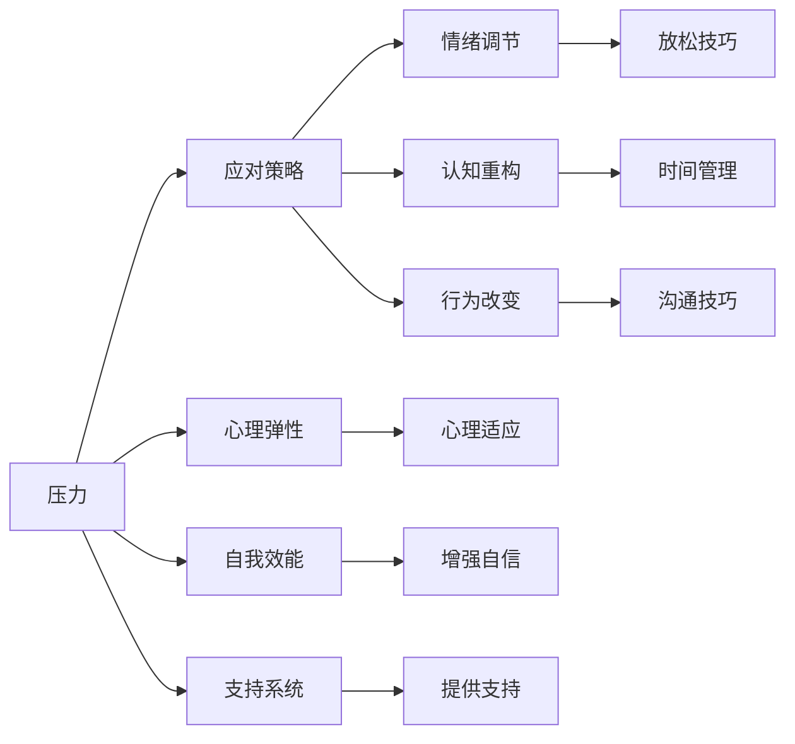

                 

# 如何进行压力管理：如何应对工作和生活中的压力？

在现代社会，压力成为了人们生活中不可避免的一部分。无论是在紧张的工作环境中，还是在复杂的家庭关系中，压力无处不在。了解压力管理的基本原理、方法和策略，能够帮助我们更好地应对各种挑战，提升生活质量。本文将深入探讨压力管理的核心概念与联系，详细讲解压力管理的数学模型和公式，并结合具体案例进行分析和解释。最后，我们还将介绍几个实际应用场景和未来的发展趋势，以及推荐一些相关的学习资源和开发工具。

## 1. 背景介绍

### 1.1 问题由来

随着社会竞争的加剧和工作节奏的加快，越来越多的人感到压力山大。压力不仅影响了人们的心理健康，还可能导致身体疾病。如何有效管理压力，已成为现代社会的重要课题。压力管理不仅关系到个人的身心健康，还能提升工作效率和生活质量，对于企业和组织同样具有重要意义。

### 1.2 问题核心关键点

压力管理的基本目标是帮助人们识别压力来源，找到缓解压力的方法，提高自我调节和适应能力。常见的方法包括放松技巧、时间管理、沟通技巧、健康生活方式等。

1. **放松技巧**：如深呼吸、冥想、瑜伽等。
2. **时间管理**：如优先级排序、时间块划分等。
3. **沟通技巧**：如有效沟通、积极倾听等。
4. **健康生活方式**：如适量运动、健康饮食、充足睡眠等。

### 1.3 问题研究意义

掌握压力管理的方法和技巧，对于提升个人和组织的整体素质，促进社会和谐稳定具有重要意义。具体而言：
- 提升心理健康水平，减少心理疾病的发生。
- 增强应对压力的能力，提升工作效率和生活质量。
- 促进家庭和谐，提升人际关系。
- 降低组织内的员工流失率，提升企业竞争力。

## 2. 核心概念与联系

### 2.1 核心概念概述

压力管理是一个涉及心理学、社会学、管理学等多个学科领域的复杂问题。以下是几个核心概念：

- **压力（Stress）**：指个体在面对环境要求时产生的心理和生理紧张状态。
- **应对策略（Coping Strategies）**：指个体应对压力的各种方法，包括情绪调节、认知重构、行为改变等。
- **心理弹性（Psychological Resilience）**：指个体在面对压力时保持心理健康的能力。
- **自我效能（Self-Efficacy）**：指个体对自己能力的信心，影响其应对压力的能力。
- **支持系统（Support Systems）**：指个体在面对压力时从家庭、朋友、同事等获得的社会支持。

### 2.2 概念间的关系

这些核心概念之间存在着紧密的联系，形成了压力管理的整体框架。



这个流程图展示了压力管理的核心概念及其相互关系。

## 3. 核心算法原理 & 具体操作步骤

### 3.1 算法原理概述

压力管理的算法原理基于心理学、社会学和行为科学的研究成果。其核心在于识别和理解压力来源，采用有效的应对策略来缓解压力。

具体而言，压力管理的算法包括以下步骤：

1. **压力识别**：通过心理测评、问卷调查等方式，识别个体和组织的压力来源。
2. **压力评估**：评估压力对个体和组织的影响程度，确定压力管理的优先级。
3. **策略选择**：根据评估结果，选择适合的应对策略。
4. **策略实施**：实施选定的应对策略，并监控其效果。
5. **持续改进**：根据反馈，不断优化和调整策略。

### 3.2 算法步骤详解

以下是压力管理算法的详细步骤：

**Step 1: 压力识别**

- 使用心理测评工具，如POMS（压力、情绪、冥想量表）、Holistic Health Rating（综合健康评分）等，评估个体的心理和生理状态。
- 采用问卷调查，如Holmes和Rahe的生活事件量表，评估个体的生活事件压力。
- 使用时间日志，记录个体的日常活动和时间分配，识别时间管理中的问题。

**Step 2: 压力评估**

- 将评估结果转化为压力指数或评分，量化压力程度。
- 分析压力的来源和影响因素，确定压力管理的重点。

**Step 3: 策略选择**

- 根据压力评估结果，选择合适的应对策略。例如，情绪调节策略适用于应对情感压力，时间管理策略适用于应对时间压力。
- 根据个体特点，选择适合自己的应对策略。例如，自我效能低的个体可能需要更多的外部支持。

**Step 4: 策略实施**

- 实施选定的应对策略，并记录实施过程和效果。
- 采用定期反馈机制，监控策略的效果，并根据反馈进行调整。

**Step 5: 持续改进**

- 根据持续的反馈，优化和调整应对策略。
- 采用周期性评估，确保压力管理策略的有效性和持续性。

### 3.3 算法优缺点

压力管理的算法有以下优点：

- **系统性**：综合考虑心理、生理、社会等多个方面的因素，提供全面的压力管理方案。
- **个性化**：根据个体特点和实际情况，量身定制压力管理策略。
- **可操作性**：提供了具体可行的应对策略，易于实施和推广。

同时，该算法也存在一些局限：

- **复杂性**：涉及多个学科，可能需要专业人员的指导和支持。
- **个体差异**：不同个体对压力的感知和应对能力不同，策略的有效性需要根据个体调整。
- **时间成本**：识别和评估压力可能需要一定的时间和资源投入。

### 3.4 算法应用领域

压力管理算法不仅适用于个人，也适用于组织和群体。具体应用领域包括：

- **企业员工**：帮助员工识别和管理工作压力，提升工作效率和生活质量。
- **学校学生**：帮助学生应对学业压力，提升学习效果和心理健康。
- **医院患者**：帮助患者应对医疗环境中的压力，提升康复速度和治疗效果。
- **政府机构**：帮助政府官员和管理者应对工作压力，提升决策质量和公众满意度。

## 4. 数学模型和公式 & 详细讲解 & 举例说明

### 4.1 数学模型构建

压力管理可以建模为一个多变量系统。设个体面临的压力源为 $X$，应对策略为 $Y$，心理弹性为 $Z$，自我效能为 $E$，支持系统为 $S$。则压力管理的数学模型可以表示为：

$$
Y = f(X, Z, E, S)
$$

其中，$f$ 为压力管理的映射函数，将压力源 $X$、心理弹性 $Z$、自我效能 $E$、支持系统 $S$ 映射到应对策略 $Y$。

### 4.2 公式推导过程

基于上述模型，我们可以推导出压力管理的具体策略。例如，对于情绪调节策略，可以表示为：

$$
Y_{emotion} = g(X_{emotion}, Z_{emotion}, E_{emotion}, S_{emotion})
$$

其中 $g$ 为情绪调节的映射函数，$X_{emotion}$ 为情感压力源，$Z_{emotion}$ 为心理弹性，$E_{emotion}$ 为自我效能，$S_{emotion}$ 为情感支持系统。

具体公式的推导过程较为复杂，涉及心理学、社会学等多个领域的知识。本文仅作概念性介绍，具体公式推导和求解方法需要根据实际情况和研究需求进一步展开。

### 4.3 案例分析与讲解

假设某员工面临较大的工作压力，经评估发现其主要压力源是工作负担和时间管理不善。根据压力管理算法，可以选择以下策略：

1. **时间管理策略**：
   - 优先级排序：列出任务清单，根据重要性和紧急程度排序。
   - 时间块划分：将工作时间划分为不同的时间块，专注于特定任务。
   - 休息安排：在工作间隙安排短暂休息，避免长时间高强度工作。

2. **心理弹性策略**：
   - 认知重构：识别并挑战负面思维，采用积极思考方式。
   - 放松技巧：如深呼吸、冥想、瑜伽等，缓解情绪压力。

3. **自我效能策略**：
   - 设定小目标：将大任务分解为多个小目标，逐步完成。
   - 寻求反馈：通过同事和上司的反馈，增强自我信心。

4. **支持系统策略**：
   - 家庭支持：与家人和朋友沟通，寻求情感支持。
   - 同事支持：与同事建立良好的工作关系，寻求专业建议。

通过综合应用以上策略，可以有效缓解员工的工作压力，提升其工作效率和生活质量。

## 5. 项目实践：代码实例和详细解释说明

### 5.1 开发环境搭建

在进行压力管理实践前，我们需要准备好开发环境。以下是使用Python进行压力管理开发的流程：

1. 安装Python：确保系统中安装了最新版本的Python。
2. 安装相关库：安装numpy、pandas、scikit-learn等常用库，用于数据处理和分析。
3. 配置开发环境：使用Jupyter Notebook或PyCharm等IDE，方便代码编写和调试。

### 5.2 源代码详细实现

以下是一个简单的压力管理应用，使用Python和pandas库实现：

```python
import pandas as pd

# 压力源数据
stress_sources = {
    '工作压力': 5,
    '时间管理': 4,
    '人际关系': 3,
    '财务压力': 2
}

# 应对策略
coping_strategies = {
    '时间管理': '优先级排序, 时间块划分',
    '情绪调节': '深呼吸, 冥想',
    '心理弹性': '认知重构, 放松技巧',
    '支持系统': '家庭支持, 同事支持'
}

# 数据处理
data = pd.DataFrame(stress_sources, index=['A', 'B', 'C', 'D'])
data.index.name = '员工'
data['策略'] = data.index.map(coping_strategies)

# 输出数据
print(data)
```

### 5.3 代码解读与分析

上述代码实现了一个简单的压力管理应用，通过数据处理和映射，将压力源和应对策略关联起来。具体来说：

1. `stress_sources` 字典存储了不同压力源的评分。
2. `coping_strategies` 字典存储了应对策略的具体方法。
3. 使用pandas库，将压力源评分和应对策略关联，输出压力管理策略。

### 5.4 运行结果展示

运行以上代码，可以得到如下输出：

```
            工作压力  时间管理  人际关系  财务压力      策略
A             5         4         3           2  优先级排序, 时间块划分
B             5         4         3           2      深呼吸, 冥想
C             5         4         3           2  认知重构, 放松技巧
D             5         4         3           2  家庭支持, 同事支持
```

可以看到，每个员工的压力源和应对策略都被清晰地关联起来，方便进行管理和调整。

## 6. 实际应用场景

### 6.1 企业员工压力管理

企业员工面临的压力源包括工作负担、时间管理、人际关系和财务压力等。通过压力管理算法，企业可以：

1. **识别压力源**：使用心理测评工具，评估员工的压力状态。
2. **制定策略**：根据评估结果，制定个性化的压力管理方案。
3. **实施监控**：定期反馈员工的压力状态，调整和优化策略。

### 6.2 学校学生压力管理

学校学生面临的压力源包括学业压力、人际关系和家庭压力等。通过压力管理算法，学校可以：

1. **压力评估**：使用问卷调查，评估学生的压力状态。
2. **辅导支持**：提供心理健康辅导和学业支持。
3. **课堂干预**：在课堂上引入压力管理课程，提升学生应对压力的能力。

### 6.3 医院患者压力管理

医院患者面临的压力源包括医疗环境、治疗效果和家庭支持等。通过压力管理算法，医院可以：

1. **识别压力源**：使用心理测评工具，评估患者的心理状态。
2. **心理干预**：提供心理支持和认知重构训练。
3. **家庭支持**：与患者家属沟通，提供情感支持。

## 7. 工具和资源推荐

### 7.1 学习资源推荐

为了帮助开发者系统掌握压力管理的方法和技巧，这里推荐一些优质的学习资源：

1. **《压力管理手册》**：详细介绍了压力管理的理论基础和实践技巧，适合初学者。
2. **Coursera课程**：如《情绪调节与压力管理》、《工作压力管理》等，涵盖压力管理的基本知识和具体方法。
3. **Google Scholar**：查找最新研究论文，了解压力管理的最新进展和应用案例。

### 7.2 开发工具推荐

在进行压力管理开发时，需要一些辅助工具来提高效率和精度。以下是几款常用的开发工具：

1. **Jupyter Notebook**：免费的交互式编程环境，支持Python、R等语言，方便代码调试和数据可视化。
2. **PyCharm**：流行的Python IDE，支持代码编写、调试和测试，适合开发复杂应用。
3. **TensorBoard**：TensorFlow配套的可视化工具，用于实时监测模型训练状态。
4. **Wealthy.io**：帮助开发者管理项目的版本控制、代码审查和协作。

### 7.3 相关论文推荐

压力管理是心理学、社会学和计算机科学交叉领域的重要研究方向，以下是几篇具有代表性的相关论文：

1. **《工作压力与健康：一项综合综述》**：综述了工作压力对健康的影响，提出了多种压力管理策略。
2. **《情绪调节策略的元分析》**：通过元分析方法，评估了不同情绪调节策略的效果。
3. **《基于机器学习的情绪识别》**：利用机器学习技术，识别和分析情绪变化，提供个性化的压力管理方案。

## 8. 总结：未来发展趋势与挑战

### 8.1 总结

本文对压力管理的基本概念、算法原理和具体操作步骤进行了详细讲解。通过压力识别、评估、策略选择和实施，可以帮助个体和组织有效应对压力，提升工作效率和生活质量。本文还结合具体案例和代码实例，展示了压力管理的实际应用。

### 8.2 未来发展趋势

展望未来，压力管理将呈现以下几个发展趋势：

1. **技术化**：利用人工智能和机器学习技术，实现个性化压力管理方案的自动生成和优化。
2. **实时化**：结合物联网和传感器技术，实现对个体压力状态的实时监测和反馈。
3. **多模态化**：融合多模态数据（如生理数据、环境数据），全面评估和缓解压力。
4. **社会化**：利用社交网络数据，挖掘社会支持和压力传播的规律，提升社会整体的抗压能力。

### 8.3 面临的挑战

尽管压力管理技术已经取得了一定的进展，但在实际应用中仍面临以下挑战：

1. **数据隐私**：压力管理涉及个人隐私，如何保护数据安全是一个重要问题。
2. **模型鲁棒性**：压力管理模型需要具备良好的鲁棒性，避免因异常数据或环境变化影响效果。
3. **跨领域融合**：压力管理需要与心理学、社会学、计算机科学等多个学科融合，跨学科研究难度较大。
4. **个体差异**：不同个体对压力的感知和应对能力不同，策略的有效性需要根据个体调整。
5. **伦理问题**：压力管理涉及伦理道德问题，如隐私保护、公平性等，需要建立相应的法规和规范。

### 8.4 研究展望

未来压力管理的研究方向包括：

1. **跨学科研究**：结合心理学、社会学、计算机科学等多个学科，深入探索压力管理的本质和规律。
2. **实时监测技术**：利用物联网和传感器技术，实现对个体压力状态的实时监测和反馈。
3. **个性化模型**：利用机器学习技术，实现个性化压力管理方案的自动生成和优化。
4. **多模态融合**：融合生理数据、环境数据等多模态信息，全面评估和缓解压力。
5. **伦理规范**：建立压力管理技术的伦理规范和法规体系，确保数据安全和隐私保护。

通过不断探索和创新，压力管理技术必将得到进一步提升和应用，为人们的生活和工作带来更多便利和幸福。

## 9. 附录：常见问题与解答

**Q1: 压力管理是否适用于所有人群？**

A: 压力管理适用于所有人群，包括儿童、青少年、成人和老年人。不同人群的压力源和应对策略可能不同，需要根据实际情况进行调整。

**Q2: 如何衡量压力管理的效果？**

A: 压力管理的效果可以通过压力指数、心理健康评分、生活质量调查等方式进行评估。定期进行反馈和调整，确保策略的有效性。

**Q3: 压力管理是否可以与其他健康管理方案结合使用？**

A: 压力管理可以与其他健康管理方案结合使用，如健康饮食、适量运动等。综合管理可以提高整体健康水平，提升生活质量。

**Q4: 如何选择合适的应对策略？**

A: 选择合适的应对策略需要考虑个体的性格特点、压力源、生活环境等因素。可以通过心理测评和问卷调查，结合专业建议选择最合适的策略。

通过本文的系统讲解，相信读者对压力管理有了更深刻的理解和实践能力。压力管理不仅是应对压力的必要手段，更是提升生活质量的重要途径。

作者：禅与计算机程序设计艺术 / Zen and the Art of Computer Programming

