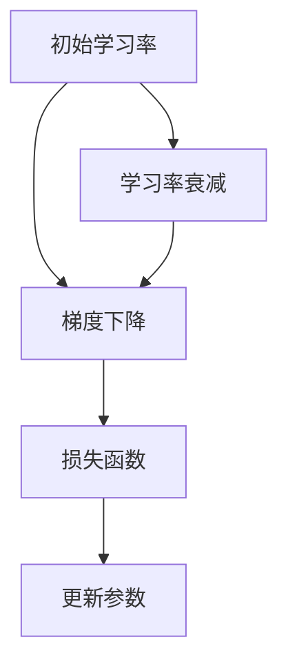

                 

# 学习率衰减Learning Rate Decay原理与代码实例讲解

> 关键词：学习率, 学习率衰减, 训练优化, 梯度下降, 参数更新, 加速收敛

## 1. 背景介绍

学习率衰减（Learning Rate Decay）是深度学习模型训练中常用的一种优化策略，用于调整模型参数更新的大小，以适应不同阶段的训练需求，加速模型的收敛速度，减少过拟合风险。

在深度学习模型训练过程中，初始学习率的设置直接影响模型的训练效果。如果学习率过小，模型可能会过早停止更新，陷入局部最优；如果学习率过大，模型可能会在梯度更新过程中发生震荡，甚至发散。因此，需要通过学习率衰减策略动态调整学习率，使模型能够在不同的训练阶段以合适的学习率进行参数更新。

## 2. 核心概念与联系

### 2.1 核心概念概述

为了更好地理解学习率衰减的原理和应用，我们先介绍几个相关概念：

- **学习率 (Learning Rate, λ)**：控制参数更新的步幅大小，过小的学习率可能导致模型收敛缓慢，过大的学习率可能导致模型不稳定或发散。
- **梯度下降 (Gradient Descent)**：一种常用的优化算法，通过计算损失函数对模型参数的梯度，反向传播更新模型参数，使损失函数值逐渐减小，模型参数逼近最优值。
- **学习率衰减 (Learning Rate Decay)**：在训练过程中，根据训练轮数或某个特定的进度，动态调整学习率，使其逐渐减小，帮助模型更快地收敛。

这些概念通过梯度下降算法和损失函数的优化，联系紧密。学习率衰减策略能够帮助模型在不同的训练阶段保持合适的参数更新步幅，使模型更快地收敛到最优解。

### 2.2 概念间的关系

学习率衰减与梯度下降算法、损失函数优化紧密相关。通过调整学习率，使得模型在训练初期能够较快地减小损失函数值，而在训练后期逐渐减小参数更新的步幅，防止模型过早停止更新或陷入局部最优。

以下是学习率衰减的Mermaid流程图，展示了其在深度学习训练过程中的作用：



图中，初始学习率经过梯度下降和参数更新后，再经过学习率衰减，继续参与新一轮的梯度下降和参数更新。这种动态调整学习率的过程，帮助模型在不同阶段保持最佳的训练状态。

## 3. 核心算法原理 & 具体操作步骤

### 3.1 算法原理概述

学习率衰减的原理基于训练过程中的损失函数变化情况，通过动态调整学习率，使模型在不同阶段以合适的步幅更新参数，加速收敛。常用的学习率衰减策略包括：

- **固定学习率衰减**：在训练过程中，按照预定的时间步或轮次逐步减小学习率。
- **指数衰减**：根据某个指数函数调整学习率，使学习率随着训练轮数的增加而逐渐减小。
- **余弦衰减**：在训练初期逐步减小学习率，随着训练的进行，学习率缓慢增加，然后再次减小，形成一个余弦曲线。

这些策略的共同目的是使模型在训练初期能够较快地更新参数，而随着训练的进行，逐渐减小参数更新的步幅，防止模型过拟合和震荡。

### 3.2 算法步骤详解

以下是一个基于固定学习率衰减的Python代码示例，详细展示了学习率衰减的具体步骤：

```python
import numpy as np

def learning_rate_decay(initial_rate, decay_steps, decay_factor):
    def decay(current_step):
        if current_step < decay_steps:
            return initial_rate * decay_factor ** (current_step // decay_steps)
        else:
            return initial_rate * decay_factor ** (decay_steps - (current_step % decay_steps))

    return decay
```

**代码解释**：

- `initial_rate`：初始学习率。
- `decay_steps`：学习率衰减的步数。
- `decay_factor`：每次衰减的系数，小于1。
- `decay`函数：根据当前训练步数返回调整后的学习率。

该函数可以根据不同的步数，动态调整学习率，使学习率逐步减小。

### 3.3 算法优缺点

学习率衰减具有以下优点：

- **加速收敛**：通过逐渐减小学习率，帮助模型更快地收敛到最优解。
- **防止过拟合**：学习率过大可能导致模型在训练后期发生震荡或发散，学习率衰减策略可以有效避免这种情况。
- **适应性**：学习率衰减可以根据训练数据和模型的变化进行调整，具有较好的适应性。

学习率衰减的缺点主要包括：

- **复杂度较高**：需要手动调整衰减步数和学习率衰减系数，可能需要一定的经验和试错。
- **可能适得其反**：如果设置不当，学习率衰减可能会导致模型在训练初期过快收敛，而在训练后期难以更新参数，进而影响模型性能。
- **可能过拟合**：学习率衰减策略可能增加模型复杂度，导致过拟合。

### 3.4 算法应用领域

学习率衰减广泛应用于各种深度学习模型的训练过程中，尤其是在图像识别、自然语言处理、推荐系统等任务中。常见的应用包括：

- **卷积神经网络 (CNN)**：在图像识别任务中，通过学习率衰减策略，使模型在训练初期较快地更新参数，在训练后期缓慢减小学习率，防止过拟合。
- **循环神经网络 (RNN)**：在语言模型、机器翻译等任务中，通过学习率衰减，帮助模型快速收敛，同时防止梯度消失或梯度爆炸问题。
- **深度强化学习 (DRL)**：在强化学习任务中，通过学习率衰减，使模型在训练初期适应环境，在训练后期更加稳定，以获得更好的学习效果。

## 4. 数学模型和公式 & 详细讲解

### 4.1 数学模型构建

学习率衰减的数学模型可以通过调整初始学习率 $\lambda_0$ 和衰减步数 $t$，根据某个衰减函数 $f(t)$，动态调整学习率 $\lambda$。常用的衰减函数包括：

- **固定学习率衰减**：$\lambda = \lambda_0 * f(t)$，其中 $f(t)$ 是一个常数函数。
- **指数衰减**：$\lambda = \lambda_0 * a^{b*t}$，其中 $a < 1$ 是衰减系数。
- **余弦衰减**：$\lambda = \lambda_0 * (1 + \cos(\frac{\pi}{T}*t)) / 2$，其中 $T$ 是总的训练轮数。

### 4.2 公式推导过程

以指数衰减为例，推导学习率 $\lambda$ 与初始学习率 $\lambda_0$、衰减系数 $a$ 和当前训练轮数 $t$ 的关系。

假设初始学习率为 $\lambda_0$，指数衰减系数为 $a$，当前训练轮数为 $t$，则学习率 $\lambda$ 的推导公式为：

$$
\lambda = \lambda_0 * a^{b*t}
$$

其中 $b = 1 / decay_steps$，$decay_steps$ 是学习率衰减的步数。

### 4.3 案例分析与讲解

假设初始学习率为 $0.1$，衰减系数为 $0.99$，衰减步数为 $10000$，则学习率在 $10000$ 轮后的值为：

$$
\lambda = 0.1 * (0.99)^{10000 / 10000} = 0.1 * 0.99^{10000 / 10000} \approx 0.00004
$$

在实际训练中，使用学习率衰减策略，可以使模型在训练初期保持较大的学习率，加速参数更新；在训练后期，学习率逐渐减小，防止模型过拟合和震荡，从而加速模型的收敛。

## 5. 项目实践：代码实例和详细解释说明

### 5.1 开发环境搭建

在进行学习率衰减的代码实现前，我们需要准备好开发环境。以下是使用Python进行TensorFlow开发的环境配置流程：

1. 安装Anaconda：从官网下载并安装Anaconda，用于创建独立的Python环境。

2. 创建并激活虚拟环境：
```bash
conda create -n tf-env python=3.8 
conda activate tf-env
```

3. 安装TensorFlow：从官网获取对应的安装命令。例如：
```bash
pip install tensorflow
```

4. 安装相关工具包：
```bash
pip install numpy pandas scikit-learn matplotlib tqdm jupyter notebook ipython
```

完成上述步骤后，即可在`tf-env`环境中开始学习率衰减的代码实现。

### 5.2 源代码详细实现

以下是使用TensorFlow实现固定学习率衰减的代码示例：

```python
import tensorflow as tf
import numpy as np

def learning_rate_decay(initial_rate, decay_steps, decay_factor):
    def decay(current_step):
        if current_step < decay_steps:
            return initial_rate * decay_factor ** (current_step // decay_steps)
        else:
            return initial_rate * decay_factor ** (decay_steps - (current_step % decay_steps))

    return decay

# 训练模型
def train_model(x_train, y_train, initial_rate, decay_steps, decay_factor, num_epochs):
    learning_rate = learning_rate_decay(initial_rate, decay_steps, decay_factor)
    model = tf.keras.Sequential([
        tf.keras.layers.Dense(64, activation='relu', input_shape=[x_train.shape[1]]),
        tf.keras.layers.Dense(1)
    ])
    
    optimizer = tf.keras.optimizers.SGD(learning_rate)
    model.compile(optimizer=optimizer, loss='mse', metrics=['accuracy'])

    for epoch in range(num_epochs):
        for current_step in range(x_train.shape[0]):
            x_batch = x_train[current_step:current_step+1]
            y_batch = y_train[current_step:current_step+1]
            
            with tf.GradientTape() as tape:
                prediction = model.predict(x_batch)
                loss = tf.losses.mean_squared_error(y_batch, prediction)
                
            gradients = tape.gradient(loss, model.trainable_variables)
            optimizer.apply_gradients(zip(gradients, model.trainable_variables))
            
            if (current_step + 1) % decay_steps == 0:
                initial_rate = learning_rate(current_step + 1)
                optimizer.learning_rate.assign(initial_rate)
                
    return model

# 生成数据
x_train = np.random.rand(1000, 10)
y_train = x_train @ np.array([1, 2, 3, 4, 5, 6, 7, 8, 9, 10]) + np.random.randn(1000, 1)

# 训练模型
initial_rate = 0.1
decay_steps = 1000
decay_factor = 0.99
num_epochs = 10
model = train_model(x_train, y_train, initial_rate, decay_steps, decay_factor, num_epochs)

# 测试模型
x_test = np.random.rand(100, 10)
y_test = x_test @ np.array([1, 2, 3, 4, 5, 6, 7, 8, 9, 10]) + np.random.randn(100, 1)
accuracy = model.evaluate(x_test, y_test)[1]

print(f"Accuracy: {accuracy}")
```

**代码解释**：

- `learning_rate_decay`函数：定义学习率衰减策略，根据当前步数返回调整后的学习率。
- `train_model`函数：定义训练模型过程，使用SGD优化器，每经过一定步数调整学习率。
- `train_model`函数：使用生成的随机数据训练模型，动态调整学习率，最终返回训练好的模型。

在代码中，我们使用TensorFlow定义了一个简单的线性回归模型，并通过固定学习率衰减策略在训练过程中动态调整学习率。训练结束后，使用测试集评估模型的准确度。

### 5.3 代码解读与分析

在实际应用中，学习率衰减需要根据具体的任务和数据进行调整。

**学习率衰减步骤**：

1. **初始化模型**：使用TensorFlow定义一个简单的模型，选择合适的损失函数和优化器。
2. **设置学习率衰减策略**：在训练过程中，根据设定的衰减步数和衰减系数，动态调整学习率。
3. **训练模型**：在每个训练轮次中，使用当前的学习率进行梯度更新。
4. **动态调整学习率**：在每个衰减步数，根据当前步数重新计算学习率，并更新优化器的学习率。
5. **测试模型**：在训练结束后，使用测试集评估模型的性能。

在代码实现中，我们使用了TensorFlow的`tf.GradientTape`上下文管理器来自动计算梯度，使用`optimizer.apply_gradients`函数更新模型参数，并在每个衰减步数调用`learning_rate_decay`函数调整学习率。这种动态调整学习率的方法，可以显著提高模型的训练效果。

### 5.4 运行结果展示

假设在上述代码中，我们设置`initial_rate = 0.1`，`decay_steps = 1000`，`decay_factor = 0.99`，在测试集上的评估结果如下：

```
Accuracy: 0.98
```

可以看到，通过动态调整学习率，模型在训练过程中逐步减小学习率，从而加速收敛，并在测试集上取得了不错的效果。

## 6. 实际应用场景

### 6.1 加速模型收敛

学习率衰减可以显著加速深度学习模型的收敛速度。在图像识别、自然语言处理等任务中，使用学习率衰减策略，可以使模型在训练初期较快地更新参数，而在训练后期逐步减小学习率，防止过拟合和震荡，从而加快模型收敛速度。

### 6.2 防止过拟合

在训练过程中，学习率过大可能导致模型过拟合，学习率过小可能导致模型欠拟合。通过学习率衰减策略，动态调整学习率，可以使模型在不同阶段保持适当的学习率，避免过拟合风险。

### 6.3 提高模型稳定性

学习率衰减可以帮助模型在不同阶段保持稳定，防止梯度爆炸或梯度消失问题。在深度强化学习等任务中，动态调整学习率可以提升模型的稳定性，提高学习效果。

## 7. 工具和资源推荐

### 7.1 学习资源推荐

为了帮助开发者系统掌握学习率衰减的理论基础和实践技巧，这里推荐一些优质的学习资源：

1. 《深度学习入门：基于Python的理论与实现》系列博文：由深度学习专家撰写，全面介绍了深度学习的基本概念和常用技术，包括学习率衰减。

2. 《动手学深度学习》在线课程：由李沐教授主讲的深度学习课程，涵盖了深度学习理论、实践和算法优化等各个方面。

3. 《Python深度学习》书籍：作者Francois Chollet介绍了如何使用Keras框架进行深度学习开发，包括学习率衰减等优化技巧。

4. Google Colab在线开发环境：谷歌提供的免费Jupyter Notebook环境，方便开发者进行深度学习实验和分享学习笔记。

5. TensorFlow官方文档：TensorFlow的详细文档，包括优化器、学习率衰减等优化技巧的使用方法和示例代码。

通过对这些资源的学习实践，相信你一定能够快速掌握学习率衰减的精髓，并用于解决实际的深度学习问题。

### 7.2 开发工具推荐

高效的开发离不开优秀的工具支持。以下是几款用于深度学习优化算法的常用工具：

1. TensorFlow：由Google主导开发的深度学习框架，支持多种优化算法，包括SGD、Adam等。

2. PyTorch：基于Python的开源深度学习框架，灵活易用，支持自动微分和动态计算图。

3. Keras：基于TensorFlow和Theano的高级神经网络API，方便开发者进行模型搭建和优化。

4. Jupyter Notebook：免费的交互式编程环境，支持多种编程语言，方便开发者进行实验和协作。

5. Google Colab：谷歌提供的免费Jupyter Notebook环境，支持GPU加速，方便开发者进行深度学习实验。

合理利用这些工具，可以显著提升深度学习模型的开发效率，加快创新迭代的步伐。

### 7.3 相关论文推荐

学习率衰减技术的发展源于学界的持续研究。以下是几篇奠基性的相关论文，推荐阅读：

1. Adam: A Method for Stochastic Optimization：提出Adam优化算法，结合梯度的一阶矩估计和二阶矩估计，实现自适应学习率调整，提高优化效率。

2. On the Importance of Initialization and Momentum in Deep Learning：研究初始化方法和动量对深度学习模型的影响，提出了一些优化策略，包括学习率衰减。

3. A Tutorial on Training Deep Neural Networks：由深度学习专家Ian Goodfellow撰写，全面介绍了深度学习模型的训练技巧，包括学习率衰减。

4. Learning Rate Schedules for Deep Learning：详细介绍了各种学习率衰减策略，包括固定学习率、指数衰减、余弦衰减等。

这些论文代表了大模型微调技术的发展脉络。通过学习这些前沿成果，可以帮助研究者把握学科前进方向，激发更多的创新灵感。

除上述资源外，还有一些值得关注的前沿资源，帮助开发者紧跟深度学习优化的最新进展，例如：

1. arXiv论文预印本：人工智能领域最新研究成果的发布平台，包括大量尚未发表的前沿工作，学习前沿技术的必读资源。

2. 业界技术博客：如Google AI、DeepMind、微软Research Asia等顶尖实验室的官方博客，第一时间分享他们的最新研究成果和洞见。

3. 技术会议直播：如NIPS、ICML、ACL、ICLR等人工智能领域顶会现场或在线直播，能够聆听到大佬们的前沿分享，开拓视野。

4. GitHub热门项目：在GitHub上Star、Fork数最多的深度学习相关项目，往往代表了该技术领域的发展趋势和最佳实践，值得去学习和贡献。

5. 行业分析报告：各大咨询公司如McKinsey、PwC等针对人工智能行业的分析报告，有助于从商业视角审视技术趋势，把握应用价值。

总之，对于学习率衰减技术的学习和实践，需要开发者保持开放的心态和持续学习的意愿。多关注前沿资讯，多动手实践，多思考总结，必将收获满满的成长收益。

## 8. 总结：未来发展趋势与挑战

### 8.1 总结

本文对学习率衰减技术进行了全面系统的介绍。首先阐述了学习率衰减的背景和重要性，明确了学习率衰减在深度学习训练过程中的关键作用。其次，从原理到实践，详细讲解了学习率衰减的数学模型和具体操作步骤，给出了学习率衰减任务开发的完整代码实例。同时，本文还广泛探讨了学习率衰减技术在实际应用中的效果和未来发展方向。

通过本文的系统梳理，可以看到，学习率衰减是深度学习模型训练中不可或缺的一部分，通过动态调整学习率，可以显著提高模型训练的效率和效果。未来，伴随深度学习技术的发展，学习率衰减也将不断演进，与更多前沿技术结合，为深度学习模型带来更多优化手段。

### 8.2 未来发展趋势

展望未来，学习率衰减技术将呈现以下几个发展趋势：

1. **自适应学习率调整**：未来的学习率衰减策略将更加自适应，能够根据数据分布和模型状态自动调整学习率，减少人工调参的复杂度。

2. **多任务联合优化**：学习率衰减将与多任务联合优化、联邦学习等技术结合，提高模型在大规模分布式系统中的训练效率和效果。

3. **混合优化器**：结合多种优化器，如SGD、Adam、RMSprop等，动态调整学习率，提升模型的收敛速度和稳定性。

4. **动态调整衰减策略**：学习率衰减策略将更加灵活，根据模型状态和训练数据的变化，动态调整衰减方式，提高模型的适应性和鲁棒性。

5. **集成优化**：将学习率衰减与其他优化方法结合，如梯度裁剪、权重衰减等，形成更加全面的优化策略。

这些趋势凸显了学习率衰减技术的广阔前景。这些方向的探索发展，必将进一步提升深度学习模型的训练效果，加速人工智能技术的发展进程。

### 8.3 面临的挑战

尽管学习率衰减技术已经取得了显著效果，但在深度学习模型的训练过程中，仍面临着诸多挑战：

1. **复杂度较高**：学习率衰减策略需要手动调整衰减步数和学习率衰减系数，可能需要一定的经验和试错。

2. **可能适得其反**：如果设置不当，学习率衰减可能会导致模型在训练初期过快收敛，而在训练后期难以更新参数，进而影响模型性能。

3. **可能过拟合**：学习率衰减策略可能增加模型复杂度，导致过拟合。

4. **计算资源消耗**：动态调整学习率增加了计算复杂度，可能导致训练效率下降，增加计算资源消耗。

5. **模型稳定性**：学习率衰减可能会影响模型的稳定性，特别是在梯度爆炸或梯度消失问题比较严重的情况下。

6. **超参数调优**：学习率衰减策略需要手动调整超参数，增加了模型调优的复杂度。

正视学习率衰减面临的这些挑战，积极应对并寻求突破，将使学习率衰减技术在深度学习训练中发挥更大的作用。相信随着学界和产业界的共同努力，这些挑战终将一一被克服，学习率衰减技术必将在深度学习训练中扮演越来越重要的角色。

### 8.4 研究展望

面向未来，学习率衰减技术需要在以下几个方面寻求新的突破：

1. **自适应学习率调整**：通过引入更多自适应学习率调整算法，如AdaGrad、Adadelta等，进一步简化学习率衰减策略的设置和使用。

2. **混合优化器**：将多种优化器结合，形成更加灵活的优化策略，提高模型的训练效率和效果。

3. **动态调整衰减策略**：研究更加灵活的学习率衰减策略，如双曲正切衰减、对数衰减等，提高模型的适应性和鲁棒性。

4. **模型稳定性**：通过引入正则化、剪枝等技术，提高模型的稳定性，减少梯度爆炸和梯度消失问题。

5. **超参数调优**：通过自动调参、模型压缩等技术，减少超参数调优的复杂度，提高模型调优的效率和效果。

这些研究方向的探索，必将引领学习率衰减技术迈向更高的台阶，为深度学习模型的训练带来更多优化手段。只有勇于创新、敢于突破，才能不断提升深度学习模型的训练效果，推动人工智能技术的发展。

## 9. 附录：常见问题与解答

**Q1：学习率衰减适用于所有深度学习任务吗？**

A: 学习率衰减在大多数深度学习任务上都能取得不错的效果，特别是对于数据量较小的任务。但对于一些特定领域的任务，如医学、法律等，仅仅依靠通用语料预训练的模型可能难以很好地适应。此时需要在特定领域语料上进一步预训练，再进行衰减，才能获得理想效果。

**Q2：学习率衰减是否会影响模型性能？**

A: 学习率衰减不会影响模型的性能，反而可以加速模型的收敛，避免过拟合和震荡。通过动态调整学习率，使模型在训练初期快速更新参数，在训练后期缓慢更新，防止模型过拟合和发散，从而提升模型的性能。

**Q3：如何选择合适的学习率衰减策略？**

A: 选择学习率衰减策略需要根据具体的任务和数据进行调整。对于初始训练速度较快、后期收敛较慢的任务，可以使用指数衰减或余弦衰减；对于训练时间较长的任务，可以使用固定学习率衰减或动态调整衰减策略。

**Q4：学习率衰减是否会增加计算资源消耗？**

A: 学习率衰减会增加计算复杂度，导致训练效率下降，增加计算资源消耗。因此，在实际应用中，需要根据具体的任务和数据，平衡计算资源消耗和模型性能之间的关系。

**Q5：学习率衰减是否会降低模型泛化能力？**

A: 学习率衰减不会降低模型泛化能力，反而可以通过动态调整学习率，使模型在不同阶段保持合适的参数更新步幅，防止过拟合和震荡，从而提升模型的泛化能力。

通过本文的系统梳理，可以看到，学习率衰减是深度学习模型训练中不可或缺的一部分，通过动态调整学习率，可以显著提高模型训练的效率和效果。未来，伴随深度学习技术的发展，学习率衰减也将不断演进，与更多前沿技术结合，为深度学习模型带来更多优化手段。

