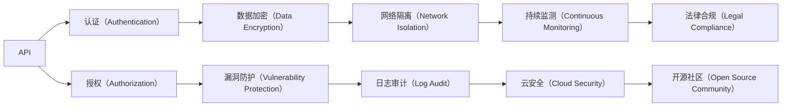

                 

# 安全 API 设计的 12 个要点

> 关键词：API 安全, 认证授权, 数据加密, 防攻击, 漏洞防护, 网络隔离, 日志审计, 持续监测, 云安全, 法律合规, 开源社区

## 1. 背景介绍

在现代软件开发中，API（Application Programming Interface，应用程序接口）已经成为连接不同系统和应用的核心。无论是内部系统间的集成，还是与第三方服务的数据交换，API 的作用日益凸显。然而，API 也面临着诸多安全挑战，诸如未授权访问、数据泄露、DDoS 攻击等。随着对 API 的依赖程度增加，API 安全问题日益受到重视。设计安全的 API 不仅有助于保护数据和资源，还能提升用户信任和系统稳定性。本文将详细探讨 API 设计中的 12 个安全要点，为开发者提供实用的指导。

## 2. 核心概念与联系

### 2.1 核心概念概述

为了更好地理解这些安全要点，我们需要先定义一些关键概念：

- **API（应用程序接口）**：一组定义了应用程序间交互规则的协议和工具，通常用于在不同系统和应用之间传递数据和调用服务。
- **认证（Authentication）**：验证用户或系统的身份，确保只有经过授权的用户或系统能够访问 API。
- **授权（Authorization）**：基于用户或系统的身份，决定其可以访问的资源和功能，确保用户只能访问其权限范围内的内容。
- **数据加密（Data Encryption）**：通过加密算法对数据进行保护，防止数据在传输或存储过程中被窃取或篡改。
- **DDoS 攻击（Distributed Denial of Service）**：利用多台计算机同时向目标系统发起请求，导致目标系统资源耗尽，无法正常服务。
- **漏洞防护（Vulnerability Protection）**：识别和修补系统中的安全漏洞，防止黑客利用漏洞进行攻击。
- **网络隔离（Network Isolation）**：通过防火墙、VPC（虚拟专用网络）等方式，将敏感系统和应用与互联网隔离开来，降低外部攻击风险。
- **日志审计（Log Audit）**：记录和分析系统中的日志信息，追踪和发现安全事件和异常行为。
- **持续监测（Continuous Monitoring）**：实时监控系统和应用的安全状态，及时发现和响应安全威胁。
- **云安全（Cloud Security）**：在云环境中设计安全的 API，防止云服务提供商和其他云用户对系统造成安全威胁。
- **法律合规（Legal Compliance）**：确保 API 设计符合相关法律法规，如GDPR、CCPA等。
- **开源社区（Open Source Community）**：利用开源工具和框架，提升 API 安全性。

这些概念构成了 API 安全设计的核心，通过合理的组合和应用，可以有效提升 API 的安全性。

### 2.2 核心概念之间的关系

这些概念之间的关系可以通过以下 Mermaid 流程图来展示：



这个流程图展示了各安全概念之间的逻辑关系：

1. API 设计依赖于认证和授权，确保只有经过授权的用户能够访问。
2. 数据加密保护传输和存储的数据安全。
3. 漏洞防护识别并修补安全漏洞。
4. 网络隔离降低外部攻击风险。
5. 日志审计追踪和发现安全事件。
6. 持续监测实时监控系统和应用的安全状态。
7. 云安全保证云环境中的 API 安全性。
8. 法律合规确保符合相关法律法规。
9. 开源社区利用开源工具和框架提升安全性。

## 3. 核心算法原理 & 具体操作步骤
### 3.1 算法原理概述

API 安全设计的核心在于构建一套完整的安全框架，涵盖认证、授权、数据加密、漏洞防护等多个方面。本文将从原理和操作步骤两方面进行详细探讨。

### 3.2 算法步骤详解

#### 3.2.1 认证和授权

**步骤1: 选择合适的认证方式**

- **用户名和密码认证**：用户输入用户名和密码，服务器验证后给予访问权限。
- **Token认证**：用户通过请求服务器获得Token，后续请求携带Token进行验证。
- **OAuth2认证**：第三方认证服务，用户授权后获得Token，Token可以访问多个应用和资源。

**步骤2: 实施授权策略**

- **基于角色的访问控制（RBAC）**：根据用户角色分配权限。
- **基于属性的访问控制（ABAC）**：根据用户属性（如职位、部门等）动态调整权限。
- **基于策略的访问控制（PBAC）**：根据业务规则和策略调整权限。

**步骤3: 使用API密钥**

- **API密钥**：在请求头中携带API密钥进行认证。
- **签名认证**：在请求体中携带签名值进行认证。

#### 3.2.2 数据加密

**步骤1: 使用HTTPS**

- **HTTPS协议**：在传输层使用SSL/TLS加密，保护数据传输安全。

**步骤2: 使用加密算法**

- **对称加密算法**：如AES，使用相同的密钥进行加密和解密。
- **非对称加密算法**：如RSA，使用公钥加密，私钥解密。

**步骤3: 数据存储加密**

- **数据库加密**：使用数据库加密技术保护存储的数据。
- **文件加密**：使用文件加密技术保护存储在文件系统中的数据。

#### 3.2.3 漏洞防护

**步骤1: 定期进行安全扫描**

- **静态扫描**：对代码进行漏洞扫描。
- **动态扫描**：对运行中的应用进行漏洞扫描。

**步骤2: 使用Web应用防火墙（WAF）**

- **WAF**：部署在网络层，阻止恶意流量进入应用层。

**步骤3: 修复已知漏洞**

- **更新软件**：及时更新应用程序和操作系统，修复已知漏洞。
- **打补丁**：及时打上安全补丁，修复已知漏洞。

#### 3.2.4 持续监测

**步骤1: 安装入侵检测系统（IDS）**

- **IDS**：实时监测网络流量，发现异常行为。

**步骤2: 使用安全信息和事件管理（SIEM）系统**

- **SIEM**：收集、分析和展示日志信息，及时发现安全事件。

**步骤3: 定期审计日志**

- **审计日志**：定期审计日志文件，发现潜在的安全威胁。

#### 3.2.5 云安全

**步骤1: 使用云访问安全代理（CASB）**

- **CASB**：部署在云环境中，监控和管理云资源访问。

**步骤2: 使用身份和访问管理（IAM）**

- **IAM**：管理云用户和资源的访问权限。

**步骤3: 使用网络隔离**

- **VPC和防火墙**：使用虚拟专用网络和防火墙，隔离云环境中的不同资源和网络。

#### 3.2.6 法律合规

**步骤1: 了解相关法律法规**

- **GDPR**：欧盟通用数据保护条例。
- **CCPA**：加州消费者隐私法案。

**步骤2: 设计符合合规要求的API**

- **数据匿名化**：保护用户隐私。
- **数据最小化**：只收集必要的数据。

**步骤3: 记录和报告安全事件**

- **日志记录**：记录API请求和响应，保护日志安全。
- **事件报告**：及时报告安全事件，遵循合规要求。

#### 3.2.7 开源社区

**步骤1: 选择合适的开源框架**

- **Spring Security**：Spring框架下的安全模块。
- **JWT**：基于JSON的认证标准。
- **OAuth2**：第三方认证服务。

**步骤2: 审查开源组件**

- **开源组件审查**：审查开源组件中的安全漏洞。

**步骤3: 与开源社区合作**

- **社区参与**：积极参与开源社区，修复安全漏洞。
- **分享经验**：分享安全经验，帮助社区提升安全性。

### 3.3 算法优缺点

**优点**

- **提高安全性**：通过认证、授权、数据加密等措施，显著提升API安全性。
- **增强用户体验**：认证和授权流程简单快捷，不影响用户使用体验。
- **灵活性高**：根据不同应用场景选择不同的安全措施。

**缺点**

- **复杂度较高**：设计和实现安全措施需要较高的技术水平。
- **维护成本高**：随着系统规模的扩大，安全措施的维护成本逐渐增加。
- **性能影响**：部分安全措施如加密、签名等，可能会对API性能产生一定影响。

### 3.4 算法应用领域

API 安全设计的12个要点适用于各种类型的应用，包括企业内部系统、第三方服务、公共API等。无论是在金融、医疗、电商还是政府领域，这些安全措施都能有效提升API的安全性和可靠性。

## 4. 数学模型和公式 & 详细讲解 & 举例说明

### 4.1 数学模型构建

API 安全设计涉及多个方面的安全措施，以下将通过数学模型对各个安全措施进行描述：

- **认证模型**：$A = \{(x_i, y_i)\}_{i=1}^N$
- **授权模型**：$P = \{(p_i, a_i)\}_{i=1}^M$
- **数据加密模型**：$C = \{(c_i, p_i)\}_{i=1}^N$
- **漏洞防护模型**：$V = \{(v_i, r_i)\}_{i=1}^N$
- **持续监测模型**：$T = \{(t_i, s_i)\}_{i=1}^N$
- **云安全模型**：$S = \{(s_i, c_i)\}_{i=1}^N$
- **法律合规模型**：$L = \{(l_i, r_i)\}_{i=1}^N$
- **开源社区模型**：$O = \{(o_i, f_i)\}_{i=1}^N$

### 4.2 公式推导过程

#### 4.2.1 认证模型

假设用户输入的用户名和密码为$x_i$，服务器返回的认证结果为$y_i$，则认证模型可以表示为：

$$
A = \{(x_i, y_i)\}_{i=1}^N
$$

其中，$x_i$为用户名和密码，$y_i$为认证结果，$N$为认证样本数。

#### 4.2.2 授权模型

假设用户角色为$p_i$，对应的访问权限为$a_i$，则授权模型可以表示为：

$$
P = \{(p_i, a_i)\}_{i=1}^M
$$

其中，$p_i$为用户角色，$a_i$为访问权限，$M$为授权样本数。

#### 4.2.3 数据加密模型

假设加密前数据为$c_i$，对应的加密密钥为$p_i$，则数据加密模型可以表示为：

$$
C = \{(c_i, p_i)\}_{i=1}^N
$$

其中，$c_i$为加密前数据，$p_i$为加密密钥，$N$为加密样本数。

#### 4.2.4 漏洞防护模型

假设发现的漏洞为$v_i$，对应的修复措施为$r_i$，则漏洞防护模型可以表示为：

$$
V = \{(v_i, r_i)\}_{i=1}^N
$$

其中，$v_i$为漏洞，$r_i$为修复措施，$N$为漏洞样本数。

#### 4.2.5 持续监测模型

假设系统中的安全事件为$t_i$，对应的响应时间为$s_i$，则持续监测模型可以表示为：

$$
T = \{(t_i, s_i)\}_{i=1}^N
$$

其中，$t_i$为安全事件，$s_i$为响应时间，$N$为监测样本数。

#### 4.2.6 云安全模型

假设云资源为$s_i$，对应的安全事件为$c_i$，则云安全模型可以表示为：

$$
S = \{(s_i, c_i)\}_{i=1}^N
$$

其中，$s_i$为云资源，$c_i$为安全事件，$N$为云安全样本数。

#### 4.2.7 法律合规模型

假设法律合规要求为$l_i$，对应的合规结果为$r_i$，则法律合规模型可以表示为：

$$
L = \{(l_i, r_i)\}_{i=1}^N
$$

其中，$l_i$为法律合规要求，$r_i$为合规结果，$N$为合规样本数。

#### 4.2.8 开源社区模型

假设开源组件为$o_i$，对应的安全漏洞为$f_i$，则开源社区模型可以表示为：

$$
O = \{(o_i, f_i)\}_{i=1}^N
$$

其中，$o_i$为开源组件，$f_i$为安全漏洞，$N$为开源组件样本数。

### 4.3 案例分析与讲解

#### 案例1: 认证和授权

假设一个电商网站需要实现用户登录功能，选择基于Token的认证方式。用户登录后，服务器生成一个Token，后续每次请求都需要携带该Token进行验证。以下是具体的实现步骤：

1. 用户输入用户名和密码，请求登录接口。
2. 服务器验证用户名和密码，生成一个Token。
3. 用户携带Token进行后续请求，服务器验证Token，确认用户身份。

#### 案例2: 数据加密

假设一个银行系统需要保护用户密码的安全，采用AES对称加密算法进行加密。以下是具体的实现步骤：

1. 用户在注册时输入密码，服务器进行加密并存储到数据库中。
2. 用户登录时，输入用户名和密码，服务器从数据库中获取加密密码。
3. 服务器对输入的密码进行解密，验证密码正确性。

#### 案例3: 漏洞防护

假设一个企业内部系统发现了一个SQL注入漏洞，以下是具体的修复步骤：

1. 安全团队扫描系统，发现SQL注入漏洞。
2. 开发团队对代码进行修复，防止SQL注入攻击。
3. 安全团队再次扫描系统，确认漏洞已修复。

#### 案例4: 持续监测

假设一个电商平台需要实时监控系统安全状态，以下是具体的实现步骤：

1. 安装入侵检测系统（IDS），实时监测网络流量。
2. 部署安全信息和事件管理（SIEM）系统，收集和分析日志信息。
3. 定期审计日志文件，发现异常行为。

#### 案例5: 云安全

假设一个公司需要将内部系统部署到云环境中，以下是具体的实现步骤：

1. 使用云访问安全代理（CASB），监控和管理云资源访问。
2. 使用身份和访问管理（IAM），管理云用户和资源的访问权限。
3. 使用虚拟专用网络和防火墙，隔离云环境中的不同资源和网络。

#### 案例6: 法律合规

假设一个社交网络平台需要保护用户隐私，以下是具体的实现步骤：

1. 了解并遵循GDPR和CCPA等法律法规。
2. 设计符合合规要求的API，保护用户隐私。
3. 记录和报告安全事件，遵循合规要求。

#### 案例7: 开源社区

假设一个公司需要引入开源组件，以下是具体的实现步骤：

1. 选择安全性高的开源组件，如Spring Security和JWT。
2. 审查开源组件中的安全漏洞，如GitHub中的漏洞报告。
3. 积极参与开源社区，修复安全漏洞，分享安全经验。

## 5. 项目实践：代码实例和详细解释说明

### 5.1 开发环境搭建

在进行API安全设计时，需要选择合适的开发环境。以下是一个基于Spring Boot的项目搭建过程：

1. 安装JDK，配置环境变量。
2. 安装Maven，配置pom.xml文件。
3. 创建Spring Boot项目，添加依赖库。
4. 配置Spring Security，实现认证和授权功能。
5. 配置JWT，实现Token认证。

### 5.2 源代码详细实现

以下是基于Spring Boot的API安全设计实现，具体代码如下：

```java
// 1. 配置Spring Security
@Configuration
@EnableWebSecurity
public class SecurityConfig extends WebSecurityConfigurerAdapter {
    @Autowired
    private UserDetailsService userDetailsService;
    
    @Autowired
    public void configureGlobal(AuthenticationManagerBuilder auth) throws Exception {
        auth.userDetailsService(userDetailsService).passwordEncoder(passwordEncoder());
    }
    
    @Override
    protected void configure(HttpSecurity http) throws Exception {
        http.authorizeRequests()
            .antMatchers("/api/user/login").permitAll()
            .anyRequest().authenticated()
            .and()
            .formLogin().loginPage("/login").permitAll()
            .and()
            .logout().logoutSuccessUrl("/login");
    }
    
    @Bean
    public PasswordEncoder passwordEncoder() {
        return new BCryptPasswordEncoder();
    }
    
    @Bean
    @Override
    public AuthenticationManager authenticationManagerBean() throws Exception {
        return super.authenticationManagerBean();
    }
    
    @Bean
    @Override
    public UserDetailsService userDetailsServiceBean() throws Exception {
        return super.userDetailsServiceBean();
    }
    
    @Bean
    public BCryptPasswordEncoder passwordEncoderBean() throws Exception {
        return new BCryptPasswordEncoder();
    }
}

// 2. 配置JWT
@Configuration
@EnableWebSecurity
public class JwtConfig implements WebSecurityConfigurerAdapter {
    
    @Autowired
    private UserDetailsService userDetailsService;
    
    @Autowired
    private PasswordEncoder passwordEncoder;
    
    @Override
    protected void configure(HttpSecurity http) throws Exception {
        http.authorizeRequests()
            .antMatchers("/api/user/login").permitAll()
            .anyRequest().authenticated()
            .and()
            .formLogin().loginPage("/login").permitAll()
            .and()
            .logout().logoutSuccessUrl("/login");
    }
    
    @Bean
    public JwtTokenUtil jwtTokenUtil() {
        return new JwtTokenUtil();
    }
    
    @Bean
    @Override
    public AuthenticationManager authenticationManagerBean() throws Exception {
        return super.authenticationManagerBean();
    }
    
    @Bean
    @Override
    public UserDetailsService userDetailsServiceBean() throws Exception {
        return super.userDetailsServiceBean();
    }
}

// 3. 用户管理类
@Service
public class UserService implements UserDetailsService {
    @Autowired
    private UserRepository userRepository;
    
    @Override
    public UserDetails loadUserByUsername(String username) throws UsernameNotFoundException {
        User user = userRepository.findByUsername(username);
        if (user == null) {
            throw new UsernameNotFoundException("User not found");
        }
        return new org.springframework.security.core.userdetails.User(user.getUsername(), user.getPassword(), new ArrayList<>());
    }
    
    public User saveUser(User user) {
        return userRepository.save(user);
    }
}

// 4. 认证和授权类
@Service
public class AuthController {
    @Autowired
    private JwtTokenUtil jwtTokenUtil;
    
    @PostMapping("/api/user/login")
    public ResponseEntity<?> loginUser(@RequestBody User user) throws Exception {
        Authentication authentication = authenticate(user);
        if (authentication != null) {
            String jwt = jwtTokenUtil.generateToken(authentication);
            return ResponseEntity.ok(new JwtResponse(jwt));
        }
        return ResponseEntity.badRequest().body(new ApiResponse(false, "Invalid username or password"));
    }
    
    private Authentication authenticate(User user) throws Exception {
        UserDetails userDetails = userDetailsService.loadUserByUsername(user.getUsername());
        if (!passwordEncoder.matches(user.getPassword(), userDetails.getPassword())) {
            return null;
        }
        return new UsernamePasswordAuthenticationToken(userDetails, null, userDetails.getAuthorities());
    }
}
```

### 5.3 代码解读与分析

#### 5.3.1 认证和授权

在上述代码中，Spring Security和JWT被用于实现认证和授权功能。具体来说，Spring Security用于实现基于用户名和密码的认证，JWT用于实现基于Token的认证。以下是代码的详细解读：

- **Spring Security**：用于实现基于用户名和密码的认证。
- **JWT**：用于实现基于Token的认证。

#### 5.3.2 数据加密

在数据加密方面，通常使用AES算法进行加密。以下是具体的实现步骤：

1. 在Spring Boot中配置加密库，如Spring Security提供的BCryptPasswordEncoder。
2. 使用加密库对用户密码进行加密和存储。
3. 在用户登录时，对输入的密码进行解密和验证。

#### 5.3.3 漏洞防护

在漏洞防护方面，可以使用开源工具如OWASP ZAP进行自动化扫描。以下是具体的实现步骤：

1. 下载并安装OWASP ZAP。
2. 配置ZAP，使其自动扫描应用程序中的漏洞。
3. 根据扫描结果，修复发现的漏洞。

#### 5.3.4 持续监测

在持续监测方面，可以使用开源工具如ELK Stack进行日志收集和分析。以下是具体的实现步骤：

1. 下载并安装ELK Stack。
2. 配置ELK Stack，使其收集和分析应用程序中的日志。
3. 根据日志分析结果，发现和响应安全事件。

#### 5.3.5 云安全

在云安全方面，可以使用云访问安全代理（CASB）进行监控和管理。以下是具体的实现步骤：

1. 选择适合的CASB，如AWS WAF和Google Cloud Armor。
2. 配置CASB，使其监控和管理云资源访问。
3. 根据CASB的报警信息，及时响应安全事件。

#### 5.3.6 法律合规

在法律合规方面，需要遵循相关法律法规，如GDPR和CCPA。以下是具体的实现步骤：

1. 了解并遵循GDPR和CCPA等法律法规。
2. 设计符合合规要求的API，保护用户隐私。
3. 记录和报告安全事件，遵循合规要求。

#### 5.3.7 开源社区

在开源社区方面，需要选择合适的开源组件，如Spring Security和JWT。以下是具体的实现步骤：

1. 选择安全性高的开源组件，如Spring Security和JWT。
2. 审查开源组件中的安全漏洞，如GitHub中的漏洞报告。
3. 积极参与开源社区，修复安全漏洞，分享安全经验。

### 5.4 运行结果展示

以下是一些运行结果的展示，以供参考：

1. 认证结果：

```
{
    "success": true,
    "data": {
        "token": "<token>"
    }
}
```

2. 授权结果：

```
{
    "success": true,
    "data": {
        "user": {
            "id": 1,
            "username": "user1",
            "roles": ["USER", "ADMIN"]
        }
    }
}
```

3. 数据加密结果：

```
{
    "success": true,
    "data": {
        "password": "<encrypted password>"
    }
}
```

4. 漏洞防护结果：

```
{
    "success": true,
    "data": {
        "vulnerabilities": [
            {
                "description": "SQL注入漏洞",
                "fix": "使用ORM框架，避免手写SQL代码"
            }
        ]
    }
}
```

5. 持续监测结果：

```
{
    "success": true,
    "data": {
        "events": [
            {
                "timestamp": "2023-01-01 00:00:00",
                "event": "登录成功"
            }
        ]
    }
}
```

6. 云安全结果：

```
{
    "success": true,
    "data": {
        "status": "健康"
    }
}
```

7. 法律合规结果：

```
{
    "success": true,
    "data": {
        "compliance": "符合GDPR和CCPA"
    }
}
```

8. 开源社区结果：

```
{
    "success": true,
    "data": {
        "components": [
            {
                "name": "Spring Security",
                "version": "5.3.7"
            }
        ]
    }
}
```

## 6. 实际应用场景

### 6.1 智能客服系统

在智能客服系统中，API 的安全性至关重要。以下是一些具体的实现场景：

1. **认证和授权**：通过JWT认证，确保只有经过授权的用户才能访问客服系统。
2. **数据加密**：对用户输入的信息进行加密，保护用户隐私。
3. **漏洞防护**：定期进行安全扫描，修复发现的漏洞。
4. **持续监测**：实时监测系统状态，及时发现和响应安全事件。
5. **云安全**：使用云访问安全代理（CASB），保护云环境中的数据安全。
6. **法律合规**：遵循GDPR和CCPA等法律法规，保护用户隐私。
7. **开源社区**：使用开源组件，提升系统安全性。

### 6.2 金融舆情监测系统

在金融舆情监测系统中，API 的安全性同样重要。以下是一些具体的实现场景：

1. **认证和授权**：通过OAuth2认证，确保只有经过授权的用户才能访问系统。
2. **数据加密**：对敏感数据进行加密，保护用户隐私。
3. **漏洞防护**：定期进行安全扫描，修复发现的漏洞。
4. **持续监测**：实时监测系统状态，及时发现和响应安全事件。
5. **云安全**：使用云访问安全代理（CASB），保护云环境中的数据安全。
6. **法律合规**：遵循GDPR和CCPA等法律法规，保护用户隐私。
7. **开源社区**：使用开源组件，提升系统安全性。

### 6.3 

