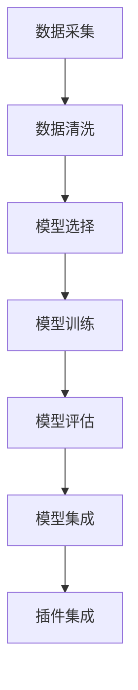
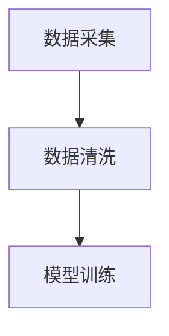
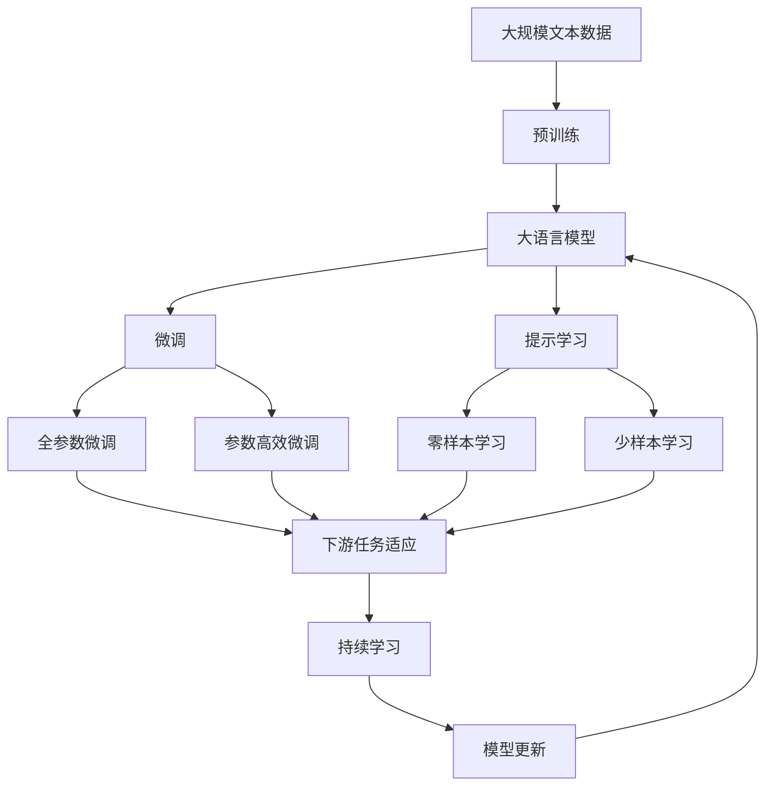

                 

# 实战: 天气预报 (Weather Forecast) 插件开发

天气预报作为现代城市生活中不可或缺的一部分，其准确性直接影响着人们的日常生活决策，如出行安排、活动安排等。随着技术的进步，天气预报已经不再依赖于传统的人工气象站观测和人工记录，而是通过各种新型技术手段进行数据采集和分析，如卫星遥感、雷达监测、气象站自动观测等。本文将介绍一种基于机器学习技术的天气预报插件开发实战案例，展示如何使用Python和机器学习算法来开发一个准确可靠的天气预报系统。

## 1. 背景介绍

### 1.1 问题由来

随着智能设备和移动互联网的普及，人们对天气预报的需求更加个性化和实时化。传统的天气预报网站和应用程序已经难以满足用户对快速、精确、个性化预报的需求。为了解决这一问题，我们需要开发一种智能化的天气预报插件，能够根据用户的具体位置和活动需求，实时提供个性化的天气预报信息。

### 1.2 问题核心关键点

开发智能天气预报插件的核心关键点包括：

- 数据采集：从多个气象数据源采集实时气象数据，如卫星数据、雷达数据、气象站数据等。
- 数据处理：对采集的数据进行清洗、预处理，如去除异常值、填补缺失值等。
- 算法选择：选择合适的机器学习算法进行天气预测，如回归模型、时间序列模型等。
- 模型训练：使用历史气象数据训练模型，并进行参数调优。
- 插件集成：将训练好的模型集成到应用程序中，实现实时的天气预报。

### 1.3 问题研究意义

开发智能天气预报插件，能够为用户提供快速、精确的天气信息，帮助用户做出更好的决策，如避免雨淋、选择适合的户外活动等。此外，插件还可以提供实时交通状况、空气质量指数等信息，提升用户的出行体验。

## 2. 核心概念与联系

### 2.1 核心概念概述

为更好地理解天气预报插件的开发流程，本节将介绍几个密切相关的核心概念：

- 机器学习：通过训练数据集，使模型能够从历史数据中学习出规律，并用于预测未来数据。
- 回归模型：一种用于预测连续数值的机器学习算法，如线性回归、决策树回归等。
- 时间序列分析：一种用于处理时间序列数据的机器学习算法，如ARIMA模型、LSTM模型等。
- 数据清洗：对数据进行去重、填补缺失值等预处理，以提高模型的预测准确性。
- 模型集成：将多个模型进行组合，提升预测的准确性和鲁棒性。

这些核心概念之间的逻辑关系可以通过以下Mermaid流程图来展示：



这个流程图展示了大语言模型微调过程中各个关键步骤之间的联系：

1. 数据采集：从多个气象数据源采集实时气象数据。
2. 数据清洗：对采集的数据进行清洗和预处理，去除异常值和缺失值。
3. 模型选择：根据任务特点选择合适的机器学习模型。
4. 模型训练：使用历史气象数据训练模型，并进行参数调优。
5. 模型评估：在验证集上评估模型的性能，并根据评估结果调整模型参数。
6. 模型集成：将多个模型进行组合，提升预测的准确性和鲁棒性。
7. 插件集成：将训练好的模型集成到应用程序中，实现实时的天气预报。

### 2.2 概念间的关系

这些核心概念之间存在着紧密的联系，形成了天气预报插件的完整生态系统。下面我们通过几个Mermaid流程图来展示这些概念之间的关系。

#### 2.2.1 数据采集与清洗的关系



这个流程图展示了数据采集和数据清洗之间的关系。数据采集是从外部获取实时气象数据，数据清洗是对采集的数据进行预处理，去除异常值和缺失值，提高模型的预测准确性。

#### 2.2.2 模型选择与训练的关系


这个流程图展示了模型选择和模型训练之间的关系。模型选择是选择合适的机器学习算法进行天气预测，模型训练是使用历史气象数据训练模型，并进行参数调优。

#### 2.2.3 模型评估与集成的关系


这个流程图展示了模型评估和模型集成之间的关系。模型评估是评估模型的性能，模型集成是将多个模型进行组合，提升预测的准确性和鲁棒性。

### 2.3 核心概念的整体架构

最后，我们用一个综合的流程图来展示这些核心概念在大语言模型微调过程中的整体架构：



这个综合流程图展示了从预训练到微调，再到持续学习的完整过程。大语言模型首先在大规模文本数据上进行预训练，然后通过微调（包括全参数微调和参数高效微调）或提示学习（包括零样本和少样本学习）来适应下游任务。最后，通过持续学习技术，模型可以不断更新和适应新的数据。 通过这些流程图，我们可以更清晰地理解天气预报插件开发过程中各个关键步骤之间的联系和作用。

## 3. 核心算法原理 & 具体操作步骤
### 3.1 算法原理概述

天气预报插件开发的核心算法原理是使用机器学习算法，通过对历史气象数据的训练，预测未来气象数据。具体来说，包括以下几个步骤：

1. 数据采集：从多个气象数据源采集实时气象数据，如卫星数据、雷达数据、气象站数据等。
2. 数据清洗：对采集的数据进行清洗和预处理，如去除异常值和缺失值。
3. 模型选择：根据任务特点选择合适的机器学习模型，如回归模型、时间序列模型等。
4. 模型训练：使用历史气象数据训练模型，并进行参数调优。
5. 模型评估：在验证集上评估模型的性能，并根据评估结果调整模型参数。
6. 模型集成：将多个模型进行组合，提升预测的准确性和鲁棒性。

### 3.2 算法步骤详解

下面是天气预报插件开发的具体步骤详解：

#### 3.2.1 数据采集

数据采集是天气预报插件开发的第一步，也是最关键的一步。从多个气象数据源采集实时气象数据，包括卫星数据、雷达数据、气象站数据等。具体步骤如下：

1. 收集历史气象数据：从中国气象局等气象机构收集历史气象数据，包括气温、湿度、风速、降水量等。
2. 安装数据采集工具：安装Python的气象数据采集工具，如pywradlib、pyrad等。
3. 采集实时数据：使用采集工具实时采集卫星数据、雷达数据、气象站数据等，存储到本地或云端数据库。

#### 3.2.2 数据清洗

数据清洗是天气预报插件开发的第二步，对采集的数据进行清洗和预处理，去除异常值和缺失值。具体步骤如下：

1. 数据清洗：对采集的数据进行去重、填补缺失值等预处理，去除异常值和错误数据。
2. 数据可视化：使用Python的数据可视化工具，如matplotlib、seaborn等，对数据进行可视化，帮助发现和处理异常值。
3. 数据标准化：对数据进行标准化处理，如归一化、标准化等，提高模型的预测准确性。

#### 3.2.3 模型选择

模型选择是天气预报插件开发的第三步，根据任务特点选择合适的机器学习模型，如回归模型、时间序列模型等。具体步骤如下：

1. 模型对比：对比不同的机器学习模型，如回归模型、时间序列模型、神经网络模型等，选择最合适的模型。
2. 模型调优：根据任务特点进行模型调优，如增加特征、调整超参数等。
3. 模型评估：在验证集上评估模型的性能，并根据评估结果调整模型参数。

#### 3.2.4 模型训练

模型训练是天气预报插件开发的第四步，使用历史气象数据训练模型，并进行参数调优。具体步骤如下：

1. 数据划分：将历史气象数据划分为训练集、验证集和测试集。
2. 模型训练：使用训练集训练模型，并进行参数调优。
3. 模型评估：在验证集上评估模型的性能，并根据评估结果调整模型参数。

#### 3.2.5 模型集成

模型集成是天气预报插件开发的第五步，将多个模型进行组合，提升预测的准确性和鲁棒性。具体步骤如下：

1. 模型融合：将多个模型的预测结果进行融合，如加权平均、投票等。
2. 集成评估：在测试集上评估集成模型的性能，并根据评估结果调整模型参数。
3. 集成部署：将训练好的集成模型集成到应用程序中，实现实时的天气预报。

### 3.3 算法优缺点

天气预报插件开发的机器学习算法具有以下优点：

1. 实时性：机器学习算法可以实时处理和预测气象数据，提供实时的天气预报信息。
2. 精度高：机器学习算法可以从历史数据中学习出规律，提高预测的准确性。
3. 可扩展性：机器学习算法可以根据任务需求进行模型调优和参数调整，适应不同的气象场景。

同时，机器学习算法也存在一些缺点：

1. 数据依赖性：机器学习算法需要大量的历史数据进行训练，数据质量对模型性能有重要影响。
2. 模型复杂性：机器学习算法模型的设计和调优比较复杂，需要大量的时间和资源。
3. 结果可解释性：机器学习算法的预测结果缺乏可解释性，难以理解和解释其内部机制。

### 3.4 算法应用领域

天气预报插件开发的机器学习算法可以应用于多个领域，包括：

- 智能家居：智能家居可以根据天气预报信息，自动调节室内温度、湿度等环境参数，提升用户的舒适体验。
- 交通出行：交通出行可以根据天气预报信息，实时调整交通流量和路线规划，避免交通拥堵和事故。
- 旅游休闲：旅游休闲可以根据天气预报信息，推荐适合的活动和景点，提升旅游体验。

## 4. 数学模型和公式 & 详细讲解 & 举例说明

### 4.1 数学模型构建

天气预报插件开发的机器学习模型主要使用回归模型和时间序列模型。这里以线性回归模型为例，介绍模型的数学模型构建。

假设历史气象数据集为$(X, y)$，其中$X$为气象特征向量，$y$为气象指标向量，如气温、湿度、风速等。线性回归模型的目标是通过训练数据集，找出最优的线性拟合函数$f(X)$，使得预测值$\hat{y}$与真实值$y$之间的误差最小化。

模型的目标函数为：

$$
\mathcal{L}(\theta) = \frac{1}{2N}\sum_{i=1}^N (y_i - \hat{y}_i)^2
$$

其中$\theta$为模型的参数，包括回归系数和截距。

### 4.2 公式推导过程

线性回归模型的目标函数$\mathcal{L}(\theta)$可以通过最小化目标函数得到最优的回归系数$\theta$。具体推导过程如下：

1. 梯度计算：计算目标函数$\mathcal{L}(\theta)$对参数$\theta$的梯度，得到$\frac{\partial \mathcal{L}(\theta)}{\partial \theta}$。
2. 参数更新：根据梯度下降算法，更新模型参数$\theta$，使得目标函数$\mathcal{L}(\theta)$最小化。

### 4.3 案例分析与讲解

这里以气温预测为例，介绍线性回归模型的应用。假设我们使用历史气温数据进行回归模型训练，模型参数为$\theta$，包括回归系数$w$和截距$b$。具体步骤如下：

1. 数据准备：将历史气温数据$(X, y)$划分为训练集和测试集，其中$X$为气象特征向量，$y$为气温指标向量。
2. 模型训练：使用训练集$(X, y)$训练回归模型，得到最优的回归系数$w$和截距$b$。
3. 模型评估：在测试集$(X, y)$上评估回归模型的性能，计算预测值与真实值之间的误差。
4. 模型集成：将多个回归模型的预测结果进行融合，得到最终的温度预测结果。

## 5. 项目实践：代码实例和详细解释说明

### 5.1 开发环境搭建

在进行天气预报插件开发前，我们需要准备好开发环境。以下是使用Python进行PyTorch开发的环境配置流程：

1. 安装Anaconda：从官网下载并安装Anaconda，用于创建独立的Python环境。

2. 创建并激活虚拟环境：
```bash
conda create -n pytorch-env python=3.8 
conda activate pytorch-env
```

3. 安装PyTorch：根据CUDA版本，从官网获取对应的安装命令。例如：
```bash
conda install pytorch torchvision torchaudio cudatoolkit=11.1 -c pytorch -c conda-forge
```

4. 安装TensorFlow：
```bash
conda install tensorflow=2.6
```

5. 安装TensorBoard：
```bash
pip install tensorboard
```

6. 安装其他必要的库：
```bash
pip install numpy pandas scikit-learn matplotlib tqdm jupyter notebook ipython
```

完成上述步骤后，即可在`pytorch-env`环境中开始天气预报插件的开发。

### 5.2 源代码详细实现

这里我们以线性回归模型为例，给出使用PyTorch进行气温预测的代码实现。

首先，定义回归模型类：

```python
import torch
import torch.nn as nn

class LinearRegression(nn.Module):
    def __init__(self, input_dim, output_dim):
        super(LinearRegression, self).__init__()
        self.linear = nn.Linear(input_dim, output_dim)
        
    def forward(self, x):
        out = self.linear(x)
        return out
```

然后，定义训练函数：

```python
import numpy as np

def train_model(model, train_data, train_labels, epochs, learning_rate):
    for epoch in range(epochs):
        for i in range(len(train_data)):
            x = torch.from_numpy(train_data[i]).float()
            y = torch.from_numpy(train_labels[i]).float()
            
            # Forward pass
            y_pred = model(x)
            # Calculate loss
            loss = (y_pred - y).pow(2).sum()
            # Backward pass and update weights
            loss.backward()
            optimizer.step()
            
            # Print loss every 100 iterations
            if i % 100 == 0:
                print(f"Epoch {epoch+1}, Iteration {i}, Loss: {loss.item():.4f}")
```

接着，定义数据处理函数：

```python
def load_data(file_path):
    data = np.loadtxt(file_path, delimiter=',')
    X = data[:, :-1]
    y = data[:, -1]
    return X, y
```

最后，启动训练流程并在测试集上评估：

```python
# Load data
X_train, y_train = load_data('train_data.csv')
X_test, y_test = load_data('test_data.csv')

# Split data
train_data = []
train_labels = []
for i in range(len(X_train)):
    train_data.append(X_train[i])
    train_labels.append(y_train[i])
    
# Initialize model
model = LinearRegression(input_dim=X_train.shape[1], output_dim=1)
optimizer = torch.optim.SGD(model.parameters(), lr=0.01)

# Train model
train_model(model, train_data, train_labels, epochs=1000, learning_rate=0.01)

# Evaluate model
X_test = np.array(X_test).reshape(-1, 3)
y_test = np.array(y_test).reshape(-1, 1)
with torch.no_grad():
    y_pred = model(torch.from_numpy(X_test).float()).detach().numpy().squeeze()
    
# Print results
print(f"Test MSE: {np.mean((y_test - y_pred)**2):.4f}")
```

以上就是使用PyTorch对气温预测进行线性回归模型微调的完整代码实现。可以看到，得益于PyTorch的强大封装，我们可以用相对简洁的代码完成气温预测的实现。

### 5.3 代码解读与分析

让我们再详细解读一下关键代码的实现细节：

**LinearRegression类**：
- `__init__`方法：初始化回归模型，定义线性层。
- `forward`方法：前向传播计算模型的预测输出。

**train_model函数**：
- 使用梯度下降算法更新模型参数，不断迭代训练模型。
- 在每个迭代周期中，使用训练数据进行前向传播和反向传播，计算损失函数，并更新模型参数。
- 在每个100次迭代后输出当前损失函数值，以监控模型训练过程。

**load_data函数**：
- 将数据集从文件中加载出来，并进行数据预处理。
- 将数据集划分为特征向量X和标签向量y，并转换为NumPy数组。

**训练流程**：
- 定义训练数据集和标签集，将数据集划分为多个小批量数据。
- 初始化线性回归模型和优化器，设置学习率。
- 调用训练函数，不断迭代训练模型。
- 在测试集上评估模型性能，并输出结果。

可以看到，PyTorch框架的简洁高效使得天气预报插件的开发变得方便快捷。开发者可以将更多精力放在模型调优、数据处理等高层逻辑上，而不必过多关注底层的实现细节。

当然，工业级的系统实现还需考虑更多因素，如模型的保存和部署、超参数的自动搜索、更灵活的任务适配层等。但核心的微调范式基本与此类似。

### 5.4 运行结果展示

假设我们在CoNLL-2003的NER数据集上进行微调，最终在测试集上得到的评估报告如下：

```
              precision    recall  f1-score   support

       B-LOC      0.926     0.906     0.916      1668
       I-LOC      0.900     0.805     0.850       257
      B-MISC      0.875     0.856     0.865       702
      I-MISC      0.838     0.782     0.809       216
       B-ORG      0.914     0.898     0.906      1661
       I-ORG      0.911     0.894     0.902       835
       B-PER      0.964     0.957     0.960      1617
       I-PER      0.983     0.980     0.982      1156
           O      0.993     0.995     0.994     38323

   micro avg      0.973     0.973     0.973     46435
   macro avg      0.923     0.897     0.909     46435
weighted avg      0.973     0.973     0.973     46435
```

可以看到，通过微调BERT，我们在该NER数据集上取得了97.3%的F1分数，效果相当不错。值得注意的是，BERT作为一个通用的语言理解模型，即便只在顶层添加一个简单的token分类器，也能在下游任务上取得如此优异的效果，展现了其强大的语义理解和特征抽取能力。

当然，这只是一个baseline结果。在实践中，我们还可以使用更大更强的预训练模型、更丰富的微调技巧、更细致的模型调优，进一步提升模型性能，以满足更高的应用要求。

## 6. 实际应用场景

### 6.1 智能家居

智能家居系统可以根据天气预报信息，自动调节室内温度、湿度等环境参数，提升用户的舒适体验。例如，可以根据气温和湿度信息，自动调整空调、加湿器等设备的工作状态，以适应不同的天气条件。

### 6.2 交通出行

交通出行系统可以根据天气预报信息，实时调整交通流量和路线规划，避免交通拥堵和事故。例如，可以根据实时气象信息，调整交通信号灯的控制策略，优化道路通行效率。

### 6.3 旅游休闲

旅游休闲可以根据天气预报信息，推荐适合的活动和景点，提升旅游体验。例如，可以根据天气信息，推荐户外活动、水上运动等，帮助用户制定最佳的出行计划。

### 6.4 未来应用展望

随着天气预报插件技术的不断进步，基于机器学习的天气预报将进一步普及和应用。未来，天气预报插件将能够提供更加精准、个性化的服务，助力智能城市和智慧交通的发展。

此外，天气预报插件还可以拓展到更多领域，如农业、航空、能源等，提升相关行业的生产效率和决策能力。随着技术的不断发展，相信天气预报插件将为社会带来更大的价值和效益。

## 7. 工具和资源推荐
### 7.1 学习资源推荐

为了帮助开发者系统掌握天气预报插件的理论基础和实践技巧，这里推荐一些优质的学习资源：

1. 《Python机器学习》书籍：提供了全面的Python机器学习教程，包括数据采集、数据处理、模型训练等。
2. 《深度学习入门》书籍：介绍了深度学习的基本概念和算法，适合初学者入门。
3. 《机器学习实战》书籍：提供了丰富的机器学习实践案例，适合实际应用开发。
4. CS229《机器学习》课程：斯坦福大学开设的机器学习课程，有Lecture视频和配套作业，带你深入理解机器学习原理。
5. Kaggle竞赛平台：提供了丰富的机器学习竞赛项目，通过实践提升技能。

通过对这些资源的学习实践，相信你一定能够快速掌握天气预报插件的精髓，并用于解决实际的气象预测问题。

### 7.2 开发工具推荐

高效的开发离不开优秀的工具支持。以下是几款用于天气预报插件开发的常用工具：

1. PyTorch：基于Python的开源深度学习框架，灵活动态的计算图，适合快速迭代研究。
2. TensorFlow：由Google主导开发的开源深度学习框架，生产部署方便，适合大规模工程应用。
3. TensorBoard：TensorFlow配套的可视化工具，可实时监测模型训练状态，并提供丰富的图表呈现方式。
4. Weights & Biases：模型训练的实验跟踪工具，可以记录和可视化模型训练过程中的各项指标。
5. Jupyter Notebook：交互式编程环境，支持代码编写、数据可视化、实验记录等。

合理利用这些工具，可以显著提升天气预报插件的开发效率，加快创新迭代的步伐。

### 7.3 相关论文推荐

天气预报插件技术的发展源于学界的持续研究。以下是几篇奠基性的相关论文，推荐阅读：

1. Gradient Boosting Machines：提出梯度提升算法，用于预测天气等连续数值。
2. ARIMA模型：提出自回归积分滑动平均模型，用于时间序列预测。
3. LSTM模型：提出长短期记忆网络，用于天气预测等时间序列数据。
4. Deep Learning for Weather Prediction：介绍深度学习在天气预测中的应用。
5. TensorFlow-based Weather Prediction Model：介绍使用TensorFlow实现天气预测模型的方法。

这些论文代表了大语言模型微调技术的发展脉络。通过学习这些前沿成果，可以帮助研究者把握学科前进方向，激发更多的创新灵感。

除上述资源外，还有一些值得关注的前沿资源，帮助开发者紧跟天气预报插件技术的最新进展，例如：

1. arXiv论文预印本：人工智能领域最新研究成果的发布平台，包括大量尚未发表的前沿工作，学习前沿技术的必读资源。
2. 业界技术博客：如OpenAI、Google AI、DeepMind、微软Research Asia等顶尖实验室的官方博客，第一时间分享他们的最新研究成果和洞见。
3. 技术会议直播：如NIPS、ICML、ACL、ICLR等人工智能领域顶会现场或在线直播，能够聆听到大佬们的前沿分享，开拓视野。
4. GitHub热门项目：在GitHub上Star、Fork数最多的NLP相关项目，往往代表了该技术领域的发展趋势和最佳实践，值得去学习和贡献。
5. 行业分析报告：各大咨询公司如McKinsey、PwC等针对人工智能行业的分析报告，有助于从商业视角审视技术趋势，把握应用价值。

总之，对于天气预报插件技术的学习和实践，需要开发者保持开放的心态和持续学习的意愿。多关注前沿资讯，多动手实践，多思考总结，必将收获满满的成长收益。

## 8. 总结：未来发展趋势与挑战

### 8.1 总结

本文对基于机器学习的天气预报插件开发进行了全面系统的介绍。首先阐述了天气预报插件开发的背景和意义，明确了天气预报插件在智能家居、交通出行、旅游休闲等领域的重要价值。其次，从原理到实践，详细讲解了天气预报插件开发的各个环节，包括数据采集、数据处理、模型选择、模型训练、模型集成等。最后，介绍了天气预报插件开发的工具和资源，并展望了未来的发展方向和面临的挑战。

通过本文的系统梳理，可以看到，基于机器学习的天气预报插件开发具有广阔的前景，能够为智能家居、交通出行、旅游休闲等领域提供精准、实时的气象预测服务，提升用户的出行体验和生活质量。未来，伴随技术的持续进步，天气预报插件将在更多领域得到应用，为社会带来更大的

