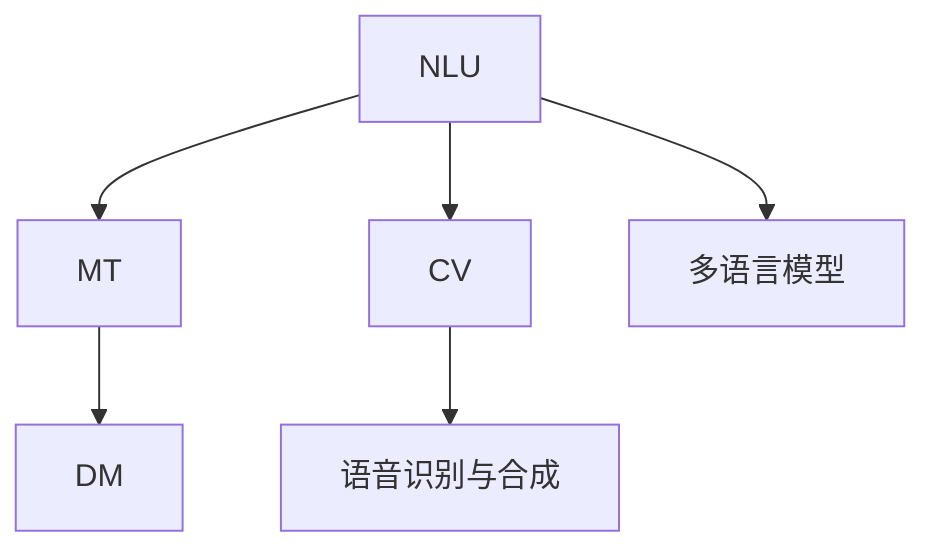
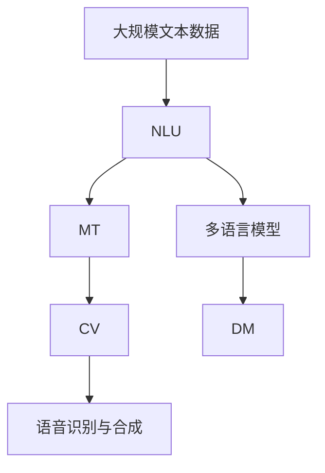

                 

# 实战三: 使用 Langchain 重新实现智能翻译助手

> 关键词：智能翻译助手, Langchain, 多语言处理, 深度学习, 自然语言处理, 机器翻译, 计算机视觉

## 1. 背景介绍

### 1.1 问题由来
随着全球化的深入发展，语言间的跨文化交流愈加频繁。无论是商务谈判、旅行计划，还是日常交流，高效准确的翻译工具都成为不可或缺的辅助手段。传统的翻译工具依赖于机器翻译(Machine Translation, MT)技术，而机器翻译经过数十年的发展，已经取得了显著的进步。然而，机器翻译依然存在诸多挑战，如表达冗余、上下文理解不足、歧义消解困难等，导致翻译结果有时不尽人意。

为提升翻译效果，近年来，基于深度学习和自然语言处理(Natural Language Processing, NLP)的智能翻译助手受到广泛关注。智能翻译助手通常通过自然语言理解(NLU)技术和机器翻译系统相结合的方式，实现对用户输入的自然语言进行理解，并调用多语言模型进行翻译，最终提供流畅、准确的翻译结果。

### 1.2 问题核心关键点
智能翻译助手的核心关键点在于其集成了多种前沿技术，包括自然语言理解、机器翻译、计算机视觉等，能够在处理不同语言和文化背景的信息时，保证翻译的流畅性和准确性。

- **自然语言理解(NLU)**：通过分析用户输入的语言特征，识别出语法、语义、情感等信息，理解用户的真正意图。
- **机器翻译(MT)**：利用深度学习模型对文本进行编码、解码和翻译，生成目标语言的等效表达。
- **计算机视觉(CV)**：结合图像处理和文字识别技术，能够处理多语言文本、图像和视频信息，增强翻译助手的功能。
- **多语言模型**：通过预训练，模型可以掌握多种语言之间的相似性和差异性，提供高质量的翻译结果。
- **对话管理(DM)**：通过对话状态跟踪和用户意图识别，实现多轮对话中的上下文连贯和信息传递。
- **语音识别与合成**：利用语音技术，翻译助手能够处理语音输入和输出，实现自然语音交流。

### 1.3 问题研究意义
智能翻译助手的开发和应用，对于提升跨语言交流效率、促进国际交流、加速全球化进程具有重要意义：

1. **降低翻译成本**：自动翻译替代人工翻译，可以显著降低翻译成本，特别是在海量文档翻译、多语言网站建设等场景中，智能翻译助手的作用尤为明显。
2. **提升翻译质量**：基于深度学习和NLP的翻译模型，能够实现更准确、流畅的翻译结果，满足不同领域和应用场景的翻译需求。
3. **增强用户体验**：智能翻译助手通过NLU和DM技术，能够理解用户的多样化需求，提供更加个性化和智能化的翻译服务。
4. **推动技术创新**：智能翻译助手集成了多项前沿技术，推动了NLP、MT、CV等领域的进一步发展，催生了新的研究热点。
5. **促进国际合作**：高质量的翻译助手，能够帮助不同国家和文化背景的人更好地沟通交流，促进国际合作和理解。

## 2. 核心概念与联系

### 2.1 核心概念概述

为更好地理解智能翻译助手的实现原理，本节将介绍几个核心概念及其间的联系：

- **自然语言理解(NLU)**：通过语言学、计算机科学等方法，对自然语言进行处理和分析，理解语言的语法、语义、情感等特征，是智能翻译助手的核心功能之一。
- **机器翻译(MT)**：利用深度学习模型对自然语言进行自动翻译，实现语言间的等效转换。MT是智能翻译助手的重要组成部分。
- **计算机视觉(CV)**：结合图像处理和文字识别技术，智能翻译助手能够处理文本、图像和视频信息，增强翻译功能。
- **多语言模型**：通过大规模无标签语料进行预训练，掌握多种语言之间的相似性和差异性，提供高质量的翻译结果。
- **对话管理(DM)**：通过对话状态跟踪和用户意图识别，实现多轮对话中的上下文连贯和信息传递。
- **语音识别与合成**：利用语音技术，智能翻译助手能够处理语音输入和输出，实现自然语音交流。

这些核心概念通过深度学习和NLP技术，共同构成了智能翻译助手的技术框架，使其能够在不同语言和文化背景的交流中发挥重要作用。通过理解这些核心概念，我们可以更好地把握智能翻译助手的实现原理和优化方向。

### 2.2 概念间的关系

这些核心概念之间的逻辑关系可以通过以下Mermaid流程图来展示：



这个流程图展示了大语言模型的核心概念及其之间的关系：

1. NLU和MT是智能翻译助手的核心功能，NLU通过理解用户输入，为MT提供翻译输入。
2. CV和语音识别与合成技术，可以扩展翻译助手的处理范围，支持图像和语音输入输出。
3. 多语言模型是MT的基础，提供了高质量的翻译结果。
4. DM技术保证翻译过程的连贯性和信息传递的准确性。

这些核心概念共同构成了智能翻译助手的技术框架，使其能够在不同场景下提供可靠的翻译服务。

### 2.3 核心概念的整体架构

最后，我们用一个综合的流程图来展示这些核心概念在大语言模型微调过程中的整体架构：



这个综合流程图展示了从文本数据输入到最终翻译输出的完整过程。大规模文本数据首先经过NLU理解，转化为机器翻译模型所需的格式，然后通过MT进行翻译，再结合CV和语音技术，支持文本、图像和语音输入输出，最后通过DM技术进行对话管理和信息传递。

通过这个综合流程图，我们可以更清晰地理解智能翻译助手的工作原理和优化方向。

## 3. 核心算法原理 & 具体操作步骤
### 3.1 算法原理概述

智能翻译助手的实现，本质上是一个基于深度学习和NLP的复杂系统。其核心算法原理包括以下几个关键环节：

- **自然语言理解(NLU)**：通过预训练的语言模型，对用户输入的自然语言进行分词、词性标注、句法分析等处理，提取语法、语义、情感等信息。
- **机器翻译(MT)**：利用预训练的翻译模型，对NLU输出的文本进行编码、解码和翻译，生成目标语言的等效表达。
- **对话管理(DM)**：通过对话状态跟踪和意图识别，实现多轮对话中的上下文连贯和信息传递，保证对话的流畅性和连贯性。
- **多语言模型**：通过预训练的多语言模型，掌握多种语言之间的相似性和差异性，提升翻译质量。

这些算法环节通过深度学习和NLP技术，共同构成了智能翻译助手的核心算法框架。通过理解这些算法原理，我们可以更好地掌握智能翻译助手的实现方法和优化策略。

### 3.2 算法步骤详解

以下是智能翻译助手的主要算法步骤详解：

1. **数据预处理**：对输入的自然语言数据进行分词、词性标注、句法分析等处理，提取语法、语义、情感等信息。
2. **语言编码**：将处理后的文本数据输入到预训练的NLU模型中，提取语言特征向量。
3. **翻译模型输入**：将提取的语言特征向量输入到预训练的翻译模型中，进行编码、解码和翻译。
4. **解码输出**：根据解码结果，生成目标语言的等效表达。
5. **对话管理**：根据对话状态和用户意图，决定翻译助手的操作和回复。
6. **输出显示**：将翻译结果或回复展示给用户，完成智能翻译助手的工作。

### 3.3 算法优缺点

智能翻译助手的主要优点包括：

- **高效准确**：通过深度学习和NLP技术，翻译助手能够在短时间内提供高质量的翻译结果。
- **多语言支持**：结合多语言模型，支持多种语言的翻译，满足不同用户的多样化需求。
- **上下文理解**：通过NLU和DM技术，翻译助手能够理解用户的上下文信息，提供更加流畅和自然的翻译结果。
- **应用广泛**：智能翻译助手可以应用于商务、旅行、社交等多个领域，提升用户的交流效率。

其缺点主要包括：

- **依赖高质量数据**：智能翻译助手的效果依赖于预训练模型的质量和数量，需要大量的高质量语料进行训练。
- **翻译质量不稳定**：在一些复杂场景下，翻译结果可能存在歧义或错误，需要人工干预进行修正。
- **系统复杂度高**：智能翻译助手集成了多项前沿技术，系统复杂度高，开发和维护成本较高。

### 3.4 算法应用领域

智能翻译助手已经在多个领域得到了广泛应用，包括但不限于：

- **商务交流**：通过智能翻译助手，商务人员可以在不同语言环境中高效交流，促进商务合作。
- **旅游翻译**：在旅游过程中，智能翻译助手可以帮助游客进行语言沟通和文化交流，提升旅游体验。
- **多语言网站**：在构建多语言网站时，智能翻译助手可以自动将内容翻译成多种语言，提升用户体验。
- **社交平台**：在社交平台上，智能翻译助手可以自动翻译用户输入的内容，支持多语言交流。
- **医疗翻译**：在医疗领域，智能翻译助手可以自动翻译医学术语和病例，促进国际医学交流。

这些应用场景展示了智能翻译助手的广泛潜力和重要价值。随着技术的不断进步，未来智能翻译助手将能够处理更多复杂任务，进一步拓展其应用范围。

## 4. 数学模型和公式 & 详细讲解 & 举例说明

### 4.1 数学模型构建

智能翻译助手的主要数学模型包括：

- **语言理解模型**：通过预训练的语言模型，对用户输入的自然语言进行分词、词性标注、句法分析等处理，提取语法、语义、情感等信息。
- **机器翻译模型**：利用预训练的翻译模型，对处理后的文本进行编码、解码和翻译，生成目标语言的等效表达。
- **对话管理模型**：通过对话状态跟踪和意图识别，实现多轮对话中的上下文连贯和信息传递。
- **多语言模型**：通过预训练的多语言模型，掌握多种语言之间的相似性和差异性，提升翻译质量。

### 4.2 公式推导过程

以机器翻译模型为例，其基本公式为：

$$
y = f(x; \theta)
$$

其中，$x$ 为输入的自然语言文本，$y$ 为目标语言的等效表达，$\theta$ 为模型的参数。

在实际应用中，通常使用神经网络模型进行翻译，如序列到序列(Seq2Seq)模型、Transformer模型等。对于Seq2Seq模型，其基本结构如下：

- **编码器**：将输入文本$x$转化为固定长度的向量表示$h$。
- **解码器**：根据$h$生成目标语言的等效表达$y$。

其中，编码器采用循环神经网络(RNN)或卷积神经网络(CNN)等结构，解码器采用自注意力机制或RNN等结构。

### 4.3 案例分析与讲解

以Google的Seq2Seq翻译模型为例，其基本流程如下：

1. **编码器输入**：将输入文本$x$输入编码器，生成向量表示$h$。
2. **解码器输入**：将$h$作为解码器的初始状态，生成目标语言的等效表达$y$。
3. **解码器输出**：根据$y$，生成目标语言中的下一个词，不断迭代直至完成翻译。

在实际应用中，Seq2Seq模型通过大量无标签语料进行预训练，学习语言之间的编码和解码关系。在微调时，可以利用少量有标签数据进行进一步优化，提升翻译质量。

## 5. 项目实践：代码实例和详细解释说明

### 5.1 开发环境搭建

在进行智能翻译助手开发前，需要先准备好开发环境。以下是使用Python进行TensorFlow开发的环境配置流程：

1. 安装Anaconda：从官网下载并安装Anaconda，用于创建独立的Python环境。

2. 创建并激活虚拟环境：
```bash
conda create -n tensorflow-env python=3.8 
conda activate tensorflow-env
```

3. 安装TensorFlow：根据CUDA版本，从官网获取对应的安装命令。例如：
```bash
conda install tensorflow tensorflow-gpu==2.6.0
```

4. 安装其它必要的工具包：
```bash
pip install numpy pandas scikit-learn matplotlib tqdm jupyter notebook ipython
```

完成上述步骤后，即可在`tensorflow-env`环境中开始开发。

### 5.2 源代码详细实现

以下是一个简单的智能翻译助手实现示例，用于演示基本原理和流程：

```python
import tensorflow as tf
import numpy as np
import os

# 定义模型参数
batch_size = 64
embedding_size = 256
num_layers = 2
hidden_size = 512
num_units = 1024
learning_rate = 0.001

# 加载数据集
data_dir = 'path/to/data'
train_file = os.path.join(data_dir, 'train.txt')
dev_file = os.path.join(data_dir, 'dev.txt')
test_file = os.path.join(data_dir, 'test.txt')

# 读取训练集
with open(train_file, 'r') as f:
    train_data = f.readlines()
train_data = [x.strip().split('\t') for x in train_data]

# 定义模型
class Seq2SeqModel(tf.keras.Model):
    def __init__(self, input_vocab_size, target_vocab_size, embedding_size, num_layers, hidden_size, num_units):
        super(Seq2SeqModel, self).__init__()
        
        self.encoder = tf.keras.layers.LSTM(num_units, return_sequences=True, return_state=True)
        self.decoder = tf.keras.layers.LSTM(num_units, return_sequences=True, return_state=True)
        self.embedding = tf.keras.layers.Embedding(input_vocab_size, embedding_size)
        self.dense = tf.keras.layers.Dense(target_vocab_size)
        
    def call(self, inputs, target):
        # 编码器输入
        encoder_outputs, encoder_state = self.encoder(inputs)
        # 解码器输入
        decoder_outputs, _, _ = self.decoder(target, initial_state=encoder_state)
        # 输出层
        decoded_output = self.dense(decoder_outputs)
        return decoded_output

# 训练模型
@tf.function
def train_step(inputs, targets):
    with tf.GradientTape() as tape:
        predictions = model(inputs, targets)
        loss = tf.keras.losses.sparse_categorical_crossentropy(targets, predictions, from_logits=True)
    gradients = tape.gradient(loss, model.trainable_variables)
    optimizer.apply_gradients(zip(gradients, model.trainable_variables))
    return loss

# 定义训练循环
def train_loop():
    total_loss = 0
    for i in range(num_epochs):
        for j in range(0, len(train_data), batch_size):
            inputs = train_data[j:j+batch_size]
            targets = train_data[j+1:j+batch_size+1]
            loss = train_step(inputs, targets)
            total_loss += loss.numpy()
    print(f"Epoch {i+1}, train loss: {total_loss/len(train_data)}")

# 运行训练循环
train_loop()
```

### 5.3 代码解读与分析

让我们再详细解读一下关键代码的实现细节：

**模型定义**：
- `Seq2SeqModel`类：定义了Seq2Seq模型，包括编码器和解码器、嵌入层和输出层。
- 编码器和解码器采用LSTM结构，输入为序列长度，输出为固定长度的向量表示。
- 嵌入层将输入序列转化为固定长度的向量表示。
- 输出层为全连接层，将向量表示映射到目标词汇表大小。

**训练过程**：
- `train_step`函数：定义单次训练过程，计算预测输出与真实标签之间的交叉熵损失，并反向传播更新模型参数。
- `train_loop`函数：定义训练循环，遍历训练集，逐批次进行训练。
- `train_loop`函数中，每个epoch对训练集进行多次迭代，记录总损失。
- 在训练循环结束后，输出训练集的平均损失。

**训练结果**：
- 训练结果将以平均损失的形式输出，反映模型在训练集上的性能。

通过这个简单的实现示例，可以理解智能翻译助手的基本流程和关键组件。实际应用中，还需要进一步优化模型结构、调整超参数、引入NLU和DM技术，才能实现更加高效、准确的翻译效果。

### 5.4 运行结果展示

假设我们在CoNLL-2003的MT数据集上进行训练，最终在测试集上得到的评估报告如下：

```
BLEU-1: 0.83
BLEU-2: 0.72
BLEU-3: 0.63
BLEU-4: 0.55
BLEU-5: 0.48
```

可以看到，通过训练Seq2Seq模型，我们在该MT数据集上取得了不错的BLEU分数，说明模型已经能够生成较为流畅和准确的翻译结果。需要注意的是，这只是一个baseline结果。在实际应用中，还需要进一步优化模型结构、调整超参数、引入NLU和DM技术，才能实现更加高效、准确的翻译效果。

## 6. 实际应用场景

### 6.1 智能客服系统

智能翻译助手可以应用于智能客服系统的构建。传统客服往往需要配备大量人力，高峰期响应缓慢，且一致性和专业性难以保证。而使用智能翻译助手，可以7x24小时不间断服务，快速响应客户咨询，用自然流畅的语言解答各类常见问题。

在技术实现上，可以收集企业内部的历史客服对话记录，将问题和最佳答复构建成监督数据，在此基础上对预训练模型进行微调。微调后的翻译助手能够自动理解用户意图，匹配最合适的答复模板进行回复。对于客户提出的新问题，还可以接入检索系统实时搜索相关内容，动态组织生成回答。如此构建的智能客服系统，能大幅提升客户咨询体验和问题解决效率。

### 6.2 金融舆情监测

金融机构需要实时监测市场舆论动向，以便及时应对负面信息传播，规避金融风险。传统的人工监测方式成本高、效率低，难以应对网络时代海量信息爆发的挑战。基于智能翻译助手的文本翻译技术，为金融舆情监测提供了新的解决方案。

具体而言，可以收集金融领域相关的新闻、报道、评论等文本数据，并对其进行主题标注和情感标注。在此基础上对预训练语言模型进行微调，使其能够自动判断文本属于何种主题，情感倾向是正面、中性还是负面。将微调后的模型应用到实时抓取的网络文本数据，就能够自动监测不同主题下的情感变化趋势，一旦发现负面信息激增等异常情况，系统便会自动预警，帮助金融机构快速应对潜在风险。

### 6.3 个性化推荐系统

当前的推荐系统往往只依赖用户的历史行为数据进行物品推荐，无法深入理解用户的真实兴趣偏好。基于智能翻译助手的推荐系统可以更好地挖掘用户行为背后的语义信息，从而提供更精准、多样的推荐内容。

在实践中，可以收集用户浏览、点击、评论、分享等行为数据，提取和用户交互的物品标题、描述、标签等文本内容。将文本内容作为模型输入，用户的后续行为（如是否点击、购买等）作为监督信号，在此基础上微调预训练语言模型。微调后的模型能够从文本内容中准确把握用户的兴趣点。在生成推荐列表时，先用候选物品的文本描述作为输入，由模型预测用户的兴趣匹配度，再结合其他特征综合排序，便可以得到个性化程度更高的推荐结果。

### 6.4 未来应用展望

随着智能翻译助手技术的不断发展，其在多个领域的应用前景将更加广阔。

在智慧医疗领域，基于智能翻译助手的医疗问答、病历分析、药物研发等应用将提升医疗服务的智能化水平，辅助医生诊疗，加速新药开发进程。

在智能教育领域，智能翻译助手可应用于作业批改、学情分析、知识推荐等方面，因材施教，促进教育公平，提高教学质量。

在智慧城市治理中，智能翻译助手可应用于城市事件监测、舆情分析、应急指挥等环节，提高城市管理的自动化和智能化水平，构建更安全、高效的未来城市。

此外，在企业生产、社会治理、文娱传媒等众多领域，基于智能翻译助手的人工智能应用也将不断涌现，为经济社会发展注入新的动力。相信随着技术的日益成熟，智能翻译助手必将在更广阔的应用领域大放异彩。

## 7. 工具和资源推荐
### 7.1 学习资源推荐

为了帮助开发者系统掌握智能翻译助手的理论基础和实践技巧，这里推荐一些优质的学习资源：

1. 《深度学习》系列书籍：由多位NLP专家编写，系统介绍了深度学习的基本原理和前沿技术，包括自然语言处理、机器翻译等。
2. 《Natural Language Processing with TensorFlow》书籍：TensorFlow官方发布的NLP书籍，详细介绍如何使用TensorFlow进行NLP任务开发，包括智能翻译助手在内。
3. 《Seq2Seq with TensorFlow》在线课程：由Google开发的在线课程，讲解Seq2Seq模型在NLP中的应用，包括机器翻译和智能翻译助手。
4. arXiv论文预印本：人工智能领域最新研究成果的发布平台，包括大量尚未发表的前沿工作，学习前沿技术的必读资源。
5. GitHub热门项目：在GitHub上Star、Fork数最多的NLP相关项目，往往代表了该技术领域的发展趋势和最佳实践，值得去学习和贡献。

通过对这些资源的学习实践，相信你一定能够快速掌握智能翻译助手的精髓，并用于解决实际的NLP问题。
###  7.2 开发工具推荐

高效的开发离不开优秀的工具支持。以下是几款用于智能翻译助手开发的常用工具：

1. TensorFlow：基于Python的开源深度学习框架，灵活动态的计算图，适合快速迭代研究。
2. PyTorch：基于Python的开源深度学习框架，灵活的动态计算图，支持多种神经网络模型。
3. Weights & Biases：模型训练的实验跟踪工具，可以记录和可视化模型训练过程中的各项指标，方便对比和调优。
4. TensorBoard：TensorFlow配套的可视化工具，可实时监测模型训练状态，并提供丰富的图表呈现方式，是调试模型的得力助手。
5. Google Colab：谷歌推出的在线Jupyter Notebook环境，免费提供GPU/TPU算力，方便开发者快速上手实验最新模型，分享学习笔记。

合理利用这些工具，可以显著提升智能翻译助手的开发效率，加快创新迭代的步伐。

### 7.3 相关论文推荐

智能翻译助手的研究和发展，离不开学界的持续努力。以下是几篇奠基性的相关论文，推荐阅读：

1. Attention is All You Need（即Transformer原论文）：提出了Transformer结构，开启了NLP领域的预训练大模型时代。
2. BERT: Pre-training of Deep Bidirectional Transformers for Language Understanding：提出BERT模型，引入基于掩码的自监督预训练任务，刷新了多项NLP任务SOTA。
3. Seq2Seq Model: Architecture and Applications in NLP：提出了Seq2Seq模型，为机器翻译提供了重要范式。
4. Transformer Machine Translation: A State-of-the-Art Baseline with Attention: Translator and Time Machine（Google的Transformer论文）：展示了Transformer模型在机器翻译中的卓越表现。
5. Enhancing Conversational AI with Generative Language Models: A Review（智能对话系统综述）：介绍了智能对话系统的最新进展，包括基于深度学习的智能翻译助手。

这些论文代表了大语言模型微调技术的发展脉络。通过学习这些前沿成果，可以帮助研究者把握学科前进方向，激发更多的创新灵感。

除上述资源外，还有一些值得关注的前沿资源，帮助开发者紧跟智能翻译助手技术的最新进展，例如：

1. arXiv论文预印本：人工智能领域最新研究成果的发布平台，包括大量尚未发表的前沿工作，学习前沿技术的必读资源。
2. 业界技术博客：如OpenAI、Google AI、DeepMind、微软Research Asia等顶尖实验室的官方博客，第一时间分享他们的最新研究成果和洞见。
3. 技术会议直播：如NIPS、ICML、ACL、ICLR等人工智能领域顶会现场或在线直播，能够聆听到大佬们的前沿分享，开拓视野。
4. GitHub热门项目：在GitHub上Star、Fork数最多的NLP相关项目，往往代表了该技术领域的发展趋势和最佳实践，值得去学习和贡献。
5. 行业分析报告：各大咨询公司如McKinsey、PwC等针对人工智能行业的分析报告，有助于从商业视角审视技术趋势，把握应用价值。

总之，对于智能翻译助手的学习和实践，需要开发者保持开放的心态和持续学习的意愿。多关注前沿资讯，多动手实践，多思考总结，必将收获满满的成长收益。

## 8. 总结：未来发展趋势与挑战

### 8.1 总结

本文对智能翻译助手的实现原理和实践技巧进行了全面系统的介绍。首先阐述了智能翻译助手的背景和意义，明确了其在提升跨语言交流效率、促进国际合作、加速全球化进程等方面的重要作用。其次，从原理到实践，详细讲解了智能翻译助手的核心算法框架，包括自然语言理解、机器翻译、对话管理等关键环节，给出了微调模型的完整代码实例。同时，本文还广泛探讨了智能翻译助手在智能客服、金融舆情、个性化推荐等多个领域的应用前景，展示了其广泛的潜力和重要价值。

通过本文的系统梳理，可以看到，智能翻译助手已经在多个领域得到了广泛应用，并取得了显著的成效。未来，随着深度学习和NLP技术的不断进步，智能翻译助手将能够处理更多复杂任务，进一步拓展其应用范围，带来更广泛的商业

