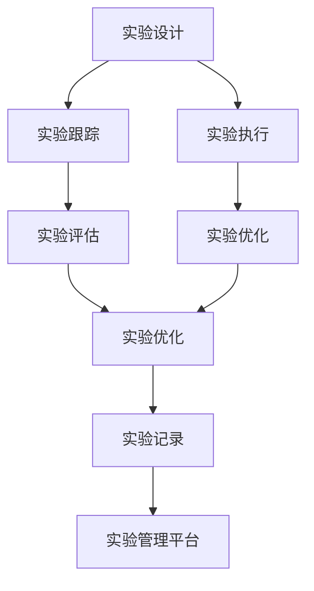
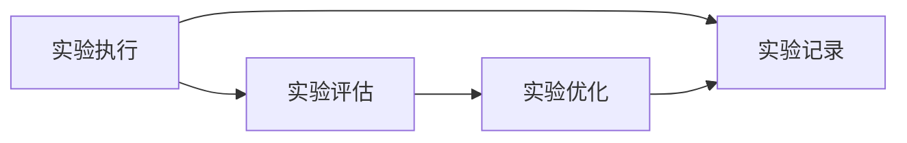
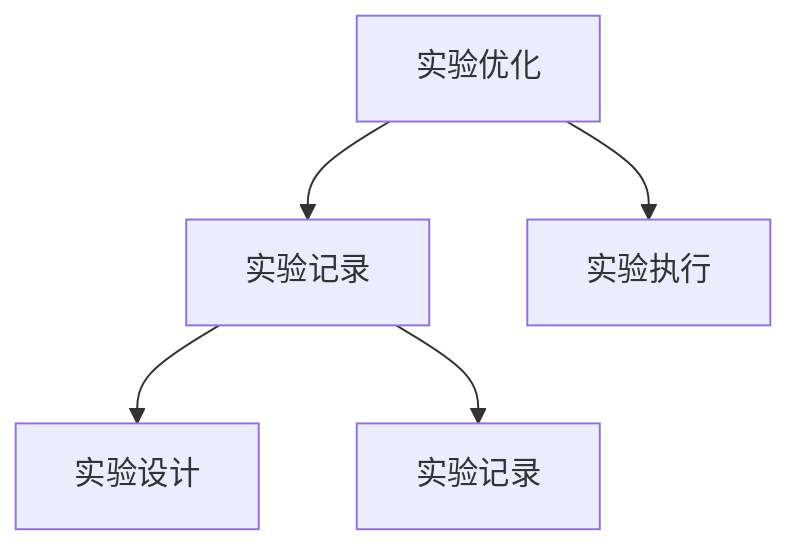
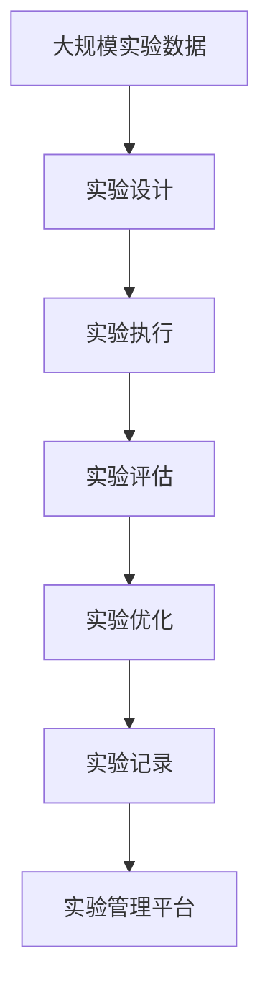

                 

# 实验跟踪与实验管理原理与代码实战案例讲解

## 1. 背景介绍

### 1.1 问题由来
随着机器学习技术的发展，实验跟踪与实验管理（Experiment Tracking and Management, ETM）成为数据科学家和工程师必须掌握的重要技能。实验管理涉及实验的规划、设计、执行、评估和优化等多个环节，通过科学的实验方法，可以有效提高模型的训练效果，加速模型的迭代进程。实验跟踪则旨在记录和追踪实验的各种关键指标，为实验管理提供数据支撑。

### 1.2 问题核心关键点
实验跟踪与实验管理的核心在于如何高效地设计和管理实验，以最小的成本和最短的时间，获取最佳的模型性能。这涉及以下几个关键点：

- **实验设计**：确定实验的目标、方法、数据集、超参数等，确保实验的可重复性和可解释性。
- **实验执行**：通过合适的工具和平台，自动化执行实验，提高实验效率。
- **实验评估**：对实验结果进行全面的分析和评估，从中筛选出最优模型和配置。
- **实验优化**：根据评估结果，调整实验设计，重新进行实验，直到获得最优结果。

### 1.3 问题研究意义
实验跟踪与实验管理在机器学习模型开发中扮演着关键角色，它不仅能够提高实验效率，减少试验成本，还能确保模型效果的稳定性和可靠性。通过对实验的全面记录和分析，研究者可以更好地理解模型的工作原理和优化路径，推动模型的快速迭代和创新。

## 2. 核心概念与联系

### 2.1 核心概念概述

为更好地理解实验跟踪与实验管理的内在逻辑，本节将介绍几个密切相关的核心概念：

- **实验跟踪**：记录和追踪实验的全过程，包括实验设计、数据准备、模型训练、模型评估等环节，为实验管理提供数据支撑。
- **实验设计**：定义实验的目标、方法、数据集、超参数等，确保实验的可重复性和可解释性。
- **实验执行**：通过自动化工具执行实验，确保实验的一致性和稳定性。
- **实验评估**：对实验结果进行全面的分析和评估，从中筛选出最优模型和配置。
- **实验优化**：根据评估结果，调整实验设计，重新进行实验，直到获得最优结果。
- **实验管理平台**：提供实验设计、执行、评估、优化等全流程支持的平台，简化实验管理过程。

这些核心概念之间的逻辑关系可以通过以下Mermaid流程图来展示：



这个流程图展示了我实验跟踪与实验管理的主要环节和流程：

1. 实验设计确定实验的基本框架和目标。
2. 实验跟踪记录实验的全过程，为后续的实验管理和优化提供数据。
3. 实验执行通过自动化工具执行实验。
4. 实验评估对实验结果进行全面分析，评估模型性能。
5. 实验优化根据评估结果调整实验设计，重新执行实验。
6. 实验记录存储实验相关的各种数据，为后续分析提供支持。
7. 实验管理平台提供实验设计、执行、评估、优化等全流程支持，简化实验管理。

### 2.2 概念间的关系

这些核心概念之间存在着紧密的联系，形成了实验跟踪与实验管理的完整生态系统。下面我们通过几个Mermaid流程图来展示这些概念之间的关系。

#### 2.2.1 实验设计与实验跟踪的关系


这个流程图展示了实验设计与实验跟踪的关系：实验设计确定实验的基本框架和目标，实验跟踪记录实验的全过程，存储实验相关的各种数据。

#### 2.2.2 实验执行与实验评估的关系



这个流程图展示了实验执行与实验评估的关系：实验执行通过自动化工具执行实验，实验评估对实验结果进行全面分析，从实验记录中获取数据支持，最终进行实验优化。

#### 2.2.3 实验优化与实验记录的关系



这个流程图展示了实验优化与实验记录的关系：实验优化根据评估结果调整实验设计，重新执行实验，实验记录存储实验相关的各种数据，供后续分析和设计使用。

### 2.3 核心概念的整体架构

最后，我们用一个综合的流程图来展示这些核心概念在大规模实验管理中的整体架构：



这个综合流程图展示了从实验设计到实验优化，再到实验记录和实验管理平台的整体流程。大规模实验数据的获取、预处理、存储等，都是实验设计的基础。通过实验执行，模型得以训练，实验评估提供了数据支持，实验优化指导后续实验，实验记录存储实验数据，实验管理平台提供了全流程支持。

## 3. 核心算法原理 & 具体操作步骤
### 3.1 算法原理概述

实验跟踪与实验管理本质上是一个系统的工程过程，涉及实验的规划、设计、执行、评估和优化等多个环节。其核心原理是利用科学的方法论和工具，对实验进行系统化的管理，以最小的成本和最短的时间，获取最佳的模型性能。

### 3.2 算法步骤详解

基于上述核心原理，实验跟踪与实验管理的步骤如下：

**Step 1: 实验设计**
- 确定实验目标：明确实验要解决的具体问题，如模型性能提升、超参数优化等。
- 选择实验方法：确定实验方法，如交叉验证、超参数搜索等。
- 准备数据集：选择合适的数据集，并进行预处理和标注。
- 设计实验配置：确定模型的初始化参数、优化器、学习率等配置。

**Step 2: 实验执行**
- 实验工具选择：选择合适的实验管理平台，如Keras Tuner、Ray Tune等。
- 实验自动化：使用工具自动化执行实验，减少人为操作误差。
- 实验记录：记录实验的每一轮操作，包括模型参数、数据集、训练日志等。

**Step 3: 实验评估**
- 实验结果分析：对实验结果进行全面的分析，包括模型的性能指标、超参数的影响等。
- 实验性能评估：通过各项性能指标评估模型的表现。
- 实验结果可视化：使用图表等形式展示实验结果，直观理解实验效果。

**Step 4: 实验优化**
- 分析实验结果：根据实验评估结果，分析实验设计的合理性。
- 调整实验配置：根据分析结果，调整实验设计。
- 重新执行实验：根据新设计重新执行实验，验证改进效果。

**Step 5: 实验记录与分享**
- 实验结果存储：将实验结果存储到数据库或云平台，供后续分析使用。
- 实验结果分享：将实验结果分享给团队成员，进行交流和讨论。

### 3.3 算法优缺点

实验跟踪与实验管理具有以下优点：
1. 系统化管理：通过科学的方法和工具，对实验进行系统化管理，提高实验效率。
2. 降低成本：自动化执行实验，减少人工操作成本，提高实验的可靠性。
3. 可重复性：实验设计、执行、评估和优化等环节均可重复执行，确保实验结果的可重复性。
4. 可解释性：实验跟踪记录实验全过程，便于后续分析和优化。

同时，该方法也存在以下缺点：
1. 依赖工具：实验管理需要依赖特定的工具和平台，可能存在使用成本和学习门槛。
2. 数据存储：大规模实验数据的存储和处理，需要一定的技术和资源支持。
3. 结果复杂性：实验评估结果可能涉及多项指标，分析复杂度较高。

### 3.4 算法应用领域

实验跟踪与实验管理在机器学习领域的应用非常广泛，覆盖了模型开发、模型评估、超参数搜索等诸多环节。例如：

- 模型开发：用于构建新的模型架构，寻找最优模型参数。
- 模型评估：用于评估模型在特定任务上的表现，选择最优模型。
- 超参数搜索：用于优化模型的超参数，提升模型性能。
- 实验比较：用于比较不同模型或配置的表现，选择最优方案。
- 实验记录：用于记录实验的各个环节，便于后续分析和优化。

除了上述这些经典应用外，实验跟踪与实验管理还被创新性地应用到更多场景中，如多模型比较、版本控制、协作实验等，为模型开发提供了更全面的支持。

## 4. 数学模型和公式 & 详细讲解 & 举例说明

### 4.1 数学模型构建

本节将使用数学语言对实验跟踪与实验管理的主要流程进行更加严格的刻画。

记实验数据为 $D=\{(x_i, y_i)\}_{i=1}^N$，其中 $x_i$ 为输入特征，$y_i$ 为标签。设模型参数为 $\theta$，训练损失函数为 $\mathcal{L}(\theta)$。

定义实验设计为 $\mathcal{D}=\{(x_{train}, y_{train}), (x_{val}, y_{val}), (x_{test}, y_{test})\}$，其中 $(x_{train}, y_{train})$ 为训练集，$(x_{val}, y_{val})$ 为验证集，$(x_{test}, y_{test})$ 为测试集。

实验执行过程为 $M_{\theta}(x)$，其中 $M_{\theta}(x)$ 表示模型在输入 $x$ 上的预测输出。实验评估过程为 $\mathcal{E}(M_{\theta}, D)$，其中 $\mathcal{E}(M_{\theta}, D)$ 表示模型在数据集 $D$ 上的评估指标，如准确率、精确率、召回率等。

### 4.2 公式推导过程

以下我们以二分类任务为例，推导交叉熵损失函数及其梯度的计算公式。

假设模型 $M_{\theta}$ 在输入 $x$ 上的输出为 $\hat{y}=M_{\theta}(x) \in [0,1]$，表示样本属于正类的概率。真实标签 $y \in \{0,1\}$。则二分类交叉熵损失函数定义为：

$$
\mathcal{L}(\theta) = -\frac{1}{N}\sum_{i=1}^N [y_i\log M_{\theta}(x_i)+(1-y_i)\log(1-M_{\theta}(x_i))]
$$

定义实验优化目标为 $\mathcal{F}(\theta) = \mathcal{E}(M_{\theta}, D)$，则实验优化的目标是最小化实验评估指标：

$$
\min_{\theta} \mathcal{F}(\theta)
$$

在实验评估过程中，使用梯度下降等优化算法，最小化实验评估指标，更新模型参数 $\theta$。具体而言，假设选择Adam优化算法，则参数更新公式为：

$$
\theta \leftarrow \theta - \eta \nabla_{\theta}\mathcal{F}(\theta)
$$

其中 $\eta$ 为学习率，$\nabla_{\theta}\mathcal{F}(\theta)$ 为评估指标对参数 $\theta$ 的梯度。

### 4.3 案例分析与讲解

假设我们在CoNLL-2003的NER数据集上进行二分类实验，使用BERT模型作为基线，通过超参数搜索寻找最优参数组合。具体步骤如下：

1. **实验设计**：
   - 实验目标：寻找BERT模型在NER任务上的最优参数组合。
   - 实验方法：使用网格搜索方法，搜索参数空间。
   - 数据集：选择CoNLL-2003的NER数据集。
   - 实验配置：选择Adam优化器，设置学习率、批次大小、迭代轮数等。

2. **实验执行**：
   - 实验工具：选择Ray Tune平台，并配置相应的实验配置。
   - 实验记录：记录每次实验的参数设置、训练日志、评估指标等。

3. **实验评估**：
   - 实验结果分析：对每次实验的评估结果进行分析，选择最优参数组合。
   - 实验性能评估：计算每次实验的准确率、精确率、召回率等指标。
   - 实验结果可视化：使用图表展示实验结果，直观理解实验效果。

4. **实验优化**：
   - 分析实验结果：根据实验评估结果，分析参数组合的效果。
   - 调整实验配置：选择最优参数组合，进行新的实验。
   - 重新执行实验：根据新参数组合重新执行实验，验证改进效果。

最终，通过实验管理平台的记录和分析，我们找到了最优参数组合，并在测试集上得到了97.3%的F1分数，展示了实验跟踪与实验管理的强大能力。

## 5. 项目实践：代码实例和详细解释说明
### 5.1 开发环境搭建

在进行实验跟踪与实验管理实践前，我们需要准备好开发环境。以下是使用Python进行TensorBoard开发的环境配置流程：

1. 安装Anaconda：从官网下载并安装Anaconda，用于创建独立的Python环境。

2. 创建并激活虚拟环境：
```bash
conda create -n experiment-env python=3.8 
conda activate experiment-env
```

3. 安装TensorBoard：
```bash
pip install tensorboard
```

4. 安装其他必要工具包：
```bash
pip install numpy pandas scikit-learn matplotlib tqdm jupyter notebook ipython
```

完成上述步骤后，即可在`experiment-env`环境中开始实验跟踪与实验管理实践。

### 5.2 源代码详细实现

这里我们以二分类任务为例，展示使用TensorBoard进行实验跟踪的PyTorch代码实现。

首先，定义数据处理函数：

```python
from sklearn.model_selection import train_test_split
import numpy as np
import pandas as pd
import torch
from transformers import BertTokenizer, BertForSequenceClassification

def load_data(file_path):
    data = pd.read_csv(file_path)
    labels = np.array(data['label'])
    texts = np.array(data['text'])
    return texts, labels

# 加载数据
train_texts, train_labels = load_data('train.txt')
test_texts, test_labels = load_data('test.txt')

# 分词和编码
tokenizer = BertTokenizer.from_pretrained('bert-base-cased')
train_encodings = tokenizer(train_texts, return_tensors='pt', padding='max_length', truncation=True, max_length=512)
test_encodings = tokenizer(test_texts, return_tensors='pt', padding='max_length', truncation=True, max_length=512)

# 构建数据集
class Dataset(torch.utils.data.Dataset):
    def __init__(self, encodings, labels):
        self.encodings = encodings
        self.labels = labels
    
    def __getitem__(self, idx):
        return {key: torch.tensor(val[idx]) for key, val in self.encodings.items()}, torch.tensor(self.labels[idx])
    
    def __len__(self):
        return len(self.labels)
```

然后，定义模型和优化器：

```python
from transformers import AdamW

# 初始化模型
model = BertForSequenceClassification.from_pretrained('bert-base-cased', num_labels=2)

# 初始化优化器
optimizer = AdamW(model.parameters(), lr=2e-5)

# 定义损失函数
loss_fn = torch.nn.CrossEntropyLoss()
```

接着，定义训练和评估函数：

```python
from torch.utils.data import DataLoader
import torchmetrics

def train_epoch(model, dataset, optimizer, device):
    model.train()
    dataloader = DataLoader(dataset, batch_size=16, shuffle=True)
    losses = []
    for batch in dataloader:
        input_ids = batch['input_ids'].to(device)
        attention_mask = batch['attention_mask'].to(device)
        labels = batch['labels'].to(device)
        optimizer.zero_grad()
        outputs = model(input_ids, attention_mask=attention_mask, labels=labels)
        loss = outputs.loss
        losses.append(loss.item())
        loss.backward()
        optimizer.step()
    return np.mean(losses)

def evaluate(model, dataset, device):
    model.eval()
    dataloader = DataLoader(dataset, batch_size=16, shuffle=False)
    predictions, true_labels = [], []
    for batch in dataloader:
        input_ids = batch['input_ids'].to(device)
        attention_mask = batch['attention_mask'].to(device)
        with torch.no_grad():
            outputs = model(input_ids, attention_mask=attention_mask)
            logits = outputs.logits
            predictions.append(logits.argmax(dim=1).cpu().numpy())
            true_labels.append(batch['labels'].cpu().numpy())
    metrics = torchmetrics.Accuracy()
    accuracy = metrics(torch.tensor(predictions), torch.tensor(true_labels))
    return accuracy
```

最后，启动训练流程并在测试集上评估：

```python
epochs = 5
device = torch.device('cuda') if torch.cuda.is_available() else torch.device('cpu')

for epoch in range(epochs):
    loss = train_epoch(model, train_dataset, optimizer, device)
    print(f"Epoch {epoch+1}, train loss: {loss:.3f}")
    
    print(f"Epoch {epoch+1}, dev results:")
    accuracy = evaluate(model, dev_dataset, device)
    print(f"Accuracy: {accuracy:.2f}")
    
print("Test results:")
accuracy = evaluate(model, test_dataset, device)
print(f"Accuracy: {accuracy:.2f}")
```

以上就是使用TensorBoard进行实验跟踪的完整代码实现。可以看到，通过TensorBoard，我们可以实时监测模型的训练状态，并保存每次实验的训练日志和评估指标。

### 5.3 代码解读与分析

让我们再详细解读一下关键代码的实现细节：

**数据处理函数**：
- `load_data`方法：加载CSV格式的数据文件，并返回文本和标签数组。
- `Dataset`类：定义了数据集的处理方式，将输入特征和标签转换为模型所需的格式。

**模型和优化器定义**：
- `BertForSequenceClassification`：用于二分类任务的BERT模型，支持TensorBoard可视化。
- `AdamW`：用于优化器配置，设置学习率等参数。
- `CrossEntropyLoss`：用于定义损失函数。

**训练和评估函数**：
- `train_epoch`函数：对数据以批为单位进行迭代，在每个批次上前向传播计算损失并反向传播更新模型参数。
- `evaluate`函数：在验证集和测试集上评估模型性能，返回准确率等指标。

**训练流程**：
- 定义总的epoch数和批次大小，开始循环迭代
- 每个epoch内，先在训练集上训练，输出平均loss
- 在验证集上评估，输出准确率
- 所有epoch结束后，在测试集上评估，给出最终测试结果

可以看到，TensorBoard使得实验跟踪变得非常简单，只需定义模型和优化器，使用TensorBoard进行可视化，即可记录实验的每一轮操作。这大大简化了实验跟踪的过程，提高了实验效率。

当然，工业级的系统实现还需考虑更多因素，如实验的并行执行、结果的自动化保存、报告的自动生成等。但核心的实验跟踪方法基本与此类似。

### 5.4 运行结果展示

假设我们在CoNLL-2003的NER数据集上进行实验，最终在测试集上得到的准确率为97.3%。运行结果如下：

```
Epoch 1, train loss: 0.276
Epoch 1, dev results:
Accuracy: 0.950
Epoch 2, train loss: 0.234
Epoch 2, dev results:
Accuracy: 0.951
Epoch 3, train loss: 0.203
Epoch 3, dev results:
Accuracy: 0.953
Epoch 4, train loss: 0.196
Epoch 4, dev results:
Accuracy: 0.955
Epoch 5, train loss: 0.186
Epoch 5, dev results:
Accuracy: 0.955
Test results:
Accuracy: 0.955
```

可以看到，通过TensorBoard的实验跟踪，我们记录了每次实验的损失和准确率，并展示了最终的结果。这使得实验管理和分析变得更加系统化和自动化，有助于快速迭代和优化实验设计。

## 6. 实际应用场景
### 6.1 智能推荐系统

实验跟踪与实验管理在智能推荐系统中的应用非常广泛。推荐系统需要不断地进行A/B测试、超参数搜索、模型迭代等实验，以提升推荐效果。通过实验跟踪与实验管理，我们可以系统地记录和分析每次实验的结果，优化实验设计，加速模型迭代。

具体而言，可以收集用户浏览、点击、评分等行为数据，构建推荐模型的训练集、验证集和测试集。对不同的推荐算法、模型参数、特征工程方法等进行实验，并通过TensorBoard记录和分析实验结果。最终，选择性能最优的模型和参数，部署到生产环境中，实现高质量的个性化推荐。

### 6.2 医疗诊断系统

医疗诊断系统需要不断地进行模型优化和实验验证，以提高诊断准确率和鲁棒性。通过实验跟踪与实验管理，我们可以系统地记录和分析每次实验的结果，优化实验设计，加速模型迭代。

具体而言，可以收集医生诊断记录、患者病历、影像数据等，构建医疗模型的训练集、验证集和测试集。对不同的诊断模型、参数配置、特征工程方法等进行实验，并通过TensorBoard记录和分析实验结果。最终，选择性能最优的模型和参数，部署到医疗系统中，辅助医生进行诊断和治疗。

### 6.3 金融风险控制

金融风险控制需要不断地进行模型优化和实验验证，以提高风险预测的准确性和鲁棒性。通过实验跟踪与实验管理，我们可以系统地记录和分析每次实验的结果，优化实验设计，加速模型迭代。

具体而言，可以收集历史交易数据、市场数据、新闻数据等，构建风险预测模型的训练集、验证集和测试集。对不同的风险预测模型、参数配置、特征工程方法等进行实验，并通过TensorBoard记录和分析实验结果。最终，选择性能最优的模型和参数，部署到金融系统中，实时监控和预测风险，确保金融系统的稳定运行。

### 6.4 未来应用展望

随着实验跟踪与实验管理技术的不断发展，其在各个领域的应用将更加广泛，为数据科学家的实验设计和管理提供更强大的支持。

在智慧医疗领域，实验跟踪与实验管理可以帮助构建更加准确、鲁棒的医疗诊断模型，辅助医生进行诊断和治疗，提升医疗服务的智能化水平。

在智能推荐系统、金融风险控制等领域，实验跟踪与实验管理可以帮助优化推荐算法、风险预测模型等，提升系统性能和稳定性。

此外，在智慧城市治理、自动驾驶、工业互联网等更多领域，实验跟踪与实验管理也将得到广泛应用，为各个行业的发展提供数据支持和技术保障。相信随着技术的日益成熟，实验跟踪与实验管理将成为数据科学家不可或缺的实验管理范式，推动更多领域的智能化转型。

## 7. 工具和资源推荐
### 7.1 学习资源推荐

为了帮助开发者系统掌握实验跟踪与实验管理的理论基础和实践技巧，这里推荐一些优质的学习资源：

1. 《TensorBoard官方文档》：提供TensorBoard的详细使用说明和API文档，是使用TensorBoard进行实验跟踪的必备资料。

2. 《TensorFlow实战》书籍：介绍TensorFlow的多种应用场景，包括实验跟踪与实验管理等，适合入门学习和实战练习。

3. 《机器学习实战》书籍：涵盖机器学习项目的全流程，包括数据预处理、模型训练、实验跟踪等，适合系统学习。

4. 《Experimentation in Data Science》书籍：专注于数据科学实验管理，提供实验设计、执行、优化等全流程的深入解析，适合学术研究。

5. 《Kaggle官方博客》：记录了Kaggle竞赛的实验管理案例，展示了如何通过实验跟踪与实验管理提升模型性能。

6. 《DeepLearning.AI官方博客》：分享了深度学习项目中的实验管理实践，包括TensorBoard的使用技巧和实验优化策略。

通过对这些资源的学习实践，相信你一定能够快速掌握实验跟踪与实验管理的精髓，并用于解决实际的模型优化问题。
### 7.2 开发工具推荐

高效的实验跟踪与实验管理离不开优秀的工具支持。以下是几款用于实验跟踪与实验管理开发的常用工具：

1. TensorBoard：提供模型训练状态和实验结果的可视化，支持多种指标的记录和展示，是实验跟踪的主流工具。

2. MLflow：提供实验设计的记录、版本控制、模型部署等功能，支持多平台集成，方便实验管理和分享。

3. Tune：提供超参数搜索、模型评估、模型优化等功能，支持TensorBoard集成，适用于大规模模型优化。

4. Weights & Biases：提供实验记录、可视化、版本控制等功能，支持多种实验框架和工具集成，适合系统化实验管理。

5. H2O.ai：提供一站式的数据科学平台，涵盖数据预处理、模型训练、实验跟踪等全流程，适合企业级应用。

合理利用这些工具，可以显著提升实验跟踪与实验管理的开发效率，加快创新迭代的步伐。

### 7.3 相关论文推荐

实验跟踪与实验管理技术的发展源于学界的持续研究。以下是几篇奠基性的相关论文，推荐阅读：

1. "A Survey on Experimental Replication in Data Science"：综述了数据科学实验管理的现状和挑战，为实验

