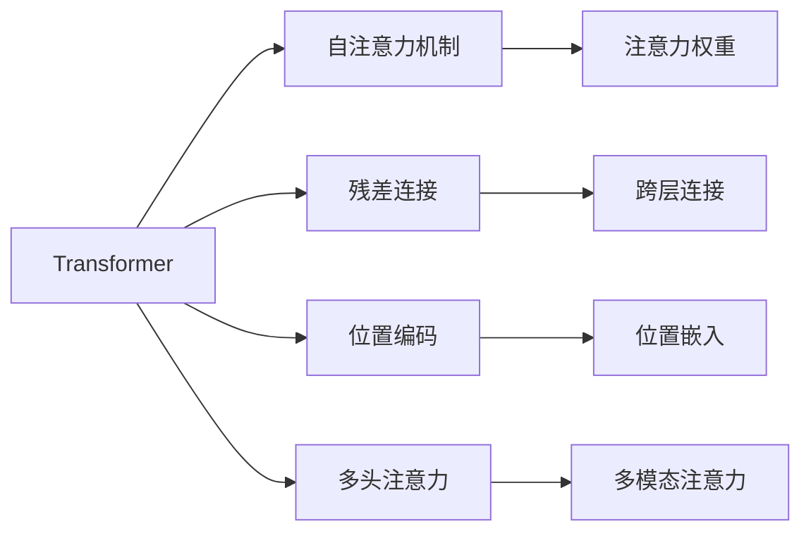
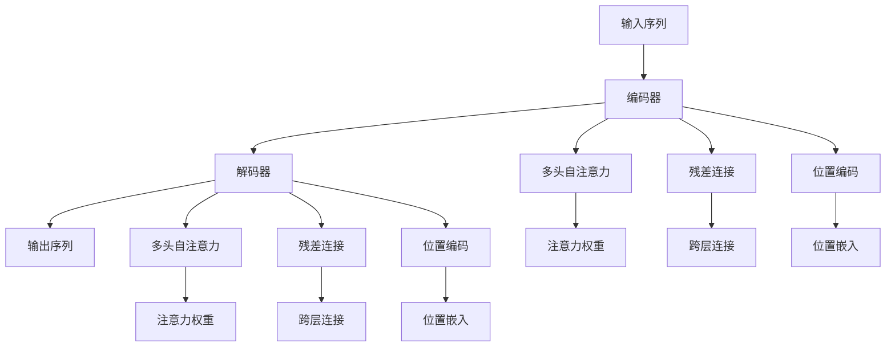
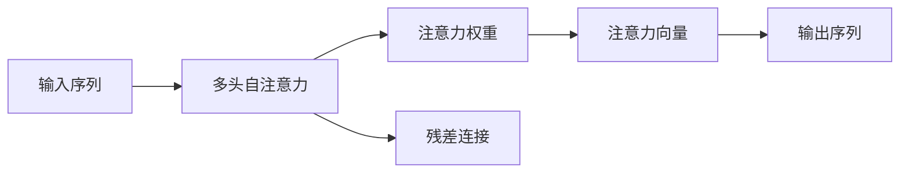
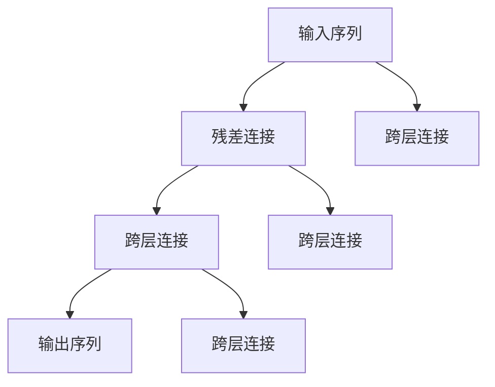
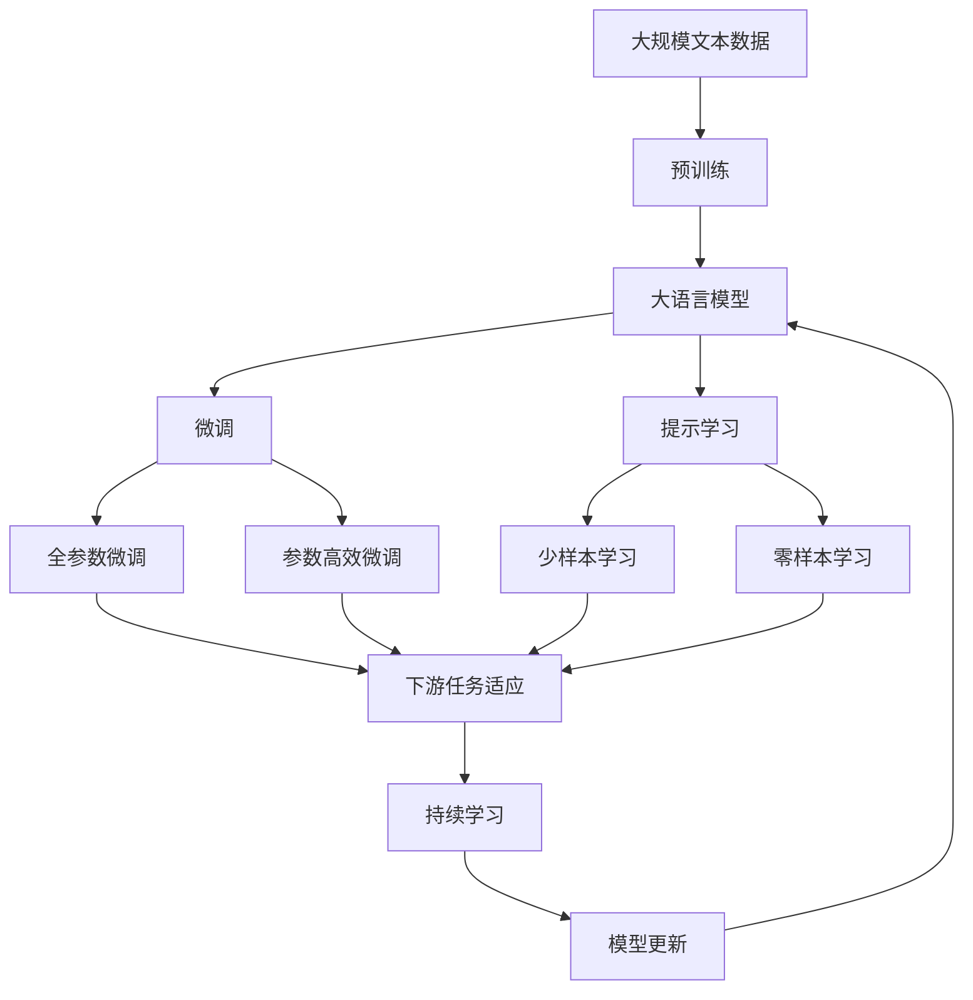
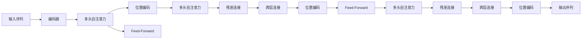

                 

# 层峦叠翠上青天：搭建GPT核心组件Transformer

> 关键词：Transformer, 自注意力, 语言模型, 残差连接, 位置编码

## 1. 背景介绍

### 1.1 问题由来

Transformer是深度学习领域的一个里程碑式创新，极大地推动了自然语言处理(NLP)的发展。自2017年谷歌发布Transformer模型以来，其影响力迅速渗透到各个领域。特别是在机器翻译、问答、文本生成等任务上，Transformer模型表现优异，已经成为大语言模型(GPT)的核心组成部分。

然而，对于许多初学者而言，Transformer的复杂原理和设计细节可能有些难以理解。本文将详细讲解Transformer的核心原理，并通过丰富的案例和实例，帮助读者深入理解其工作机制，从而为搭建自己的GPT模型打下坚实的基础。

### 1.2 问题核心关键点

Transformer的核心思想是利用自注意力机制实现序列建模，通过多头自注意力和残差连接等结构，使得模型能够高效地捕捉长距离依赖和并行计算，从而提升模型性能。具体来说，Transformer模型包括以下几个关键点：

- 自注意力机制：Transformer通过多头自注意力机制，对序列中的每个位置与其他位置的依赖关系进行建模，捕捉长距离依赖。
- 残差连接：Transformer利用残差连接结构，解决梯度消失和长序列建模的难题，使模型能够训练更深层次。
- 位置编码：Transformer通过位置编码，将序列中每个位置的信息与绝对位置相关联，避免位置信息的丢失。
- 多头注意力：Transformer利用多头自注意力机制，同时关注序列中的不同特征，提升模型表达能力。

这些关键点共同构成了Transformer的完整架构，使其在NLP领域表现出色。本文将详细介绍这些核心概念，并通过代码实现，帮助读者全面掌握Transformer的搭建技巧。

### 1.3 问题研究意义

Transformer的出色表现，主要归因于其高效、灵活的设计。掌握Transformer的设计原理和实现技巧，对于构建高性能的NLP应用具有重要意义：

1. **提升模型效果**：Transformer通过自注意力机制和残差连接等结构，提升了模型捕捉长距离依赖和表达复杂序列的能力，从而显著提升模型在各种NLP任务上的性能。
2. **简化模型设计**：Transformer的序列建模方式，使得模型可以更容易地扩展到更深层次，同时减少参数量，降低模型复杂度。
3. **促进产业应用**：Transformer的灵活性和高效性，使其在实际应用中具有广泛的适应性，推动了NLP技术的产业化进程。
4. **促进理论研究**：Transformer的实现过程中，涉及大量的算法和数学知识，对于推动NLP领域的研究也具有重要价值。

## 2. 核心概念与联系

### 2.1 核心概念概述

为更好地理解Transformer的核心原理，本节将介绍几个密切相关的核心概念：

- **Transformer**：Transformer是深度学习领域的一种模型结构，主要用于处理序列数据，如自然语言文本、音频信号等。其核心思想是通过自注意力机制对序列中的依赖关系进行建模，利用残差连接结构提升模型的深度和并行性。
- **自注意力机制(Self-Attention)**：Transformer通过多头自注意力机制，对序列中的每个位置与其他位置的依赖关系进行建模，捕捉长距离依赖。自注意力机制的核心是计算注意力权重，并通过加权平均的方式得到序列中每个位置的表示。
- **残差连接(Residual Connections)**：Transformer利用残差连接结构，使得模型能够更深层、更宽地训练。残差连接通过跨层连接，将输入直接添加到输出中，解决梯度消失和长序列建模的难题。
- **位置编码(Positional Encoding)**：Transformer通过位置编码，将序列中每个位置的信息与绝对位置相关联，避免位置信息的丢失。位置编码通常以正弦和余弦函数的线性组合形式出现，以捕捉序列中的相对位置信息。
- **多头注意力(Multi-Head Attention)**：Transformer利用多头自注意力机制，同时关注序列中的不同特征，提升模型表达能力。多头注意力通过并行计算，同时关注序列中不同位置的信息，从而增强模型的表达能力。

这些核心概念之间的逻辑关系可以通过以下Mermaid流程图来展示：



这个流程图展示了大模型微调的核心理念，以及其与Transformer核心组件之间的联系。

### 2.2 概念间的关系

这些核心概念之间存在着紧密的联系，形成了Transformer的完整生态系统。下面我通过几个Mermaid流程图来展示这些概念之间的关系。

#### 2.2.1 Transformer的基本架构



这个流程图展示了Transformer的基本架构，包括编码器和解码器两部分，以及自注意力机制、残差连接和位置编码等核心组件。

#### 2.2.2 多头自注意力的计算



这个流程图展示了多头自注意力的计算过程，包括注意力权重和注意力向量的计算，以及残差连接的跨层连接。

#### 2.2.3 残差连接的实现



这个流程图展示了残差连接的实现过程，包括跨层连接的加法和残差连接的结构。

#### 2.2.4 位置编码的计算


这个流程图展示了位置编码的计算过程，包括位置嵌入的计算和输出序列的生成。

### 2.3 核心概念的整体架构

最后，我们用一个综合的流程图来展示这些核心概念在大模型微调过程中的整体架构：



这个综合流程图展示了从预训练到微调，再到持续学习的完整过程。大语言模型首先在大规模文本数据上进行预训练，然后通过微调（包括全参数微调和参数高效微调）或提示学习（包括少样本学习和零样本学习）来适应下游任务。最后，通过持续学习技术，模型可以不断更新和适应新的任务和数据。

## 3. 核心算法原理 & 具体操作步骤
### 3.1 算法原理概述

Transformer通过自注意力机制和残差连接等结构，对序列数据进行建模，捕捉长距离依赖，从而提升模型性能。具体来说，Transformer通过以下三个步骤实现序列建模：

1. **编码器(self-attention)**：对输入序列进行自注意力计算，得到每个位置的表示向量。
2. **编码器(Feed-Forward)**：对注意力向量进行线性变换和激活函数操作，提升模型表达能力。
3. **解码器(Decoder)**：通过多头自注意力机制和残差连接结构，对序列进行编码和解码，生成输出序列。

Transformer的核心算法流程如图示：



### 3.2 算法步骤详解

Transformer的具体实现步骤如下：

1. **输入序列预处理**：将输入序列转化为模型能够处理的格式，包括分词、标记等操作。
2. **位置编码**：为输入序列中的每个位置添加位置编码，以捕捉序列中的相对位置信息。
3. **多头自注意力**：计算输入序列中每个位置的注意力权重，得到每个位置的表示向量。
4. **Feed-Forward网络**：对注意力向量进行线性变换和激活函数操作，提升模型表达能力。
5. **残差连接**：将输入直接添加到输出中，解决梯度消失和长序列建模的难题。
6. **解码器**：通过多头自注意力机制和残差连接结构，对序列进行编码和解码，生成输出序列。
7. **输出序列后处理**：对输出序列进行后处理，得到最终的结果。

### 3.3 算法优缺点

Transformer的优点包括：

1. **高效的序列建模能力**：通过自注意力机制，Transformer能够高效地捕捉长距离依赖，从而提升了模型对序列数据的建模能力。
2. **灵活的模型结构**：Transformer的并行计算和残差连接结构，使其可以轻松扩展到更深层次和更宽的宽度，提升模型的表达能力和稳定性。
3. **较好的泛化能力**：Transformer通过自注意力机制，能够捕捉序列中的不同特征，从而提升了模型的泛化能力。

Transformer的缺点包括：

1. **计算资源需求高**：Transformer模型参数量大，需要较高的计算资源和存储资源。
2. **难以解释**：Transformer的模型参数众多，模型决策过程难以解释和理解。
3. **序列长度限制**：由于自注意力机制的计算复杂度较高，Transformer模型对于过长的序列建模存在一定的限制。

### 3.4 算法应用领域

Transformer在多个领域得到了广泛应用，例如：

- **机器翻译**：通过编码器和解码器的多轮交互，Transformer模型能够高效地实现文本的自动翻译。
- **文本摘要**：利用自注意力机制捕捉文本中的关键信息，生成精炼的摘要。
- **对话系统**：通过编码器和解码器的交互，Transformer模型能够实现智能对话系统的构建。
- **文本生成**：通过解码器的自注意力机制，生成符合语法规则和语义连贯的文本。

## 4. 数学模型和公式 & 详细讲解  
### 4.1 数学模型构建

Transformer的核心数学模型包括以下几个关键组件：

- **输入序列**：记输入序列为 $x_1, x_2, ..., x_T$，其中 $x_t$ 表示第 $t$ 个单词。
- **位置编码**：记位置编码为 $P_t$，与输入序列 $x_t$ 相结合，得到每个位置的编码向量。
- **多头自注意力**：记多头自注意力为 $Q, K, V$，其中 $Q = xW_Q, K = xW_K, V = xW_V$，$W_Q, W_K, W_V$ 为线性变换矩阵。
- **Feed-Forward网络**：记Feed-Forward网络为 $F$，其中 $F(Q) = QW_F$。
- **残差连接**：记残差连接为 $R$，其中 $R = x + F(Q)$。
- **解码器**：记解码器为 $y_1, y_2, ..., y_T$，其中 $y_t$ 表示第 $t$ 个单词。

### 4.2 公式推导过程

以下是Transformer模型的关键公式：

1. **多头自注意力**：

$$
\text{Multi-Head Attention}(Q, K, V) = \text{Concat}(head_1, head_2, ..., head_h)W_O
$$

其中 $head = \frac{QK^T}{\sqrt{d_k}}$，$d_k$ 为键向量的维度。

2. **Feed-Forward网络**：

$$
F(Q) = \text{FFN}(Q) = W_1(Q) + b_1\sigma(W_2(Q) + b_2)
$$

其中 $FFN(Q)$ 表示Feed-Forward网络，$\sigma$ 为激活函数。

3. **解码器**：

$$
\text{Decoder}(y) = \text{Encoder}(x) + \text{Softmax}(Qy)
$$

其中 $Q$ 和 $y$ 分别表示编码器和解码器的输出，$\text{Softmax}$ 为归一化函数。

### 4.3 案例分析与讲解

下面以机器翻译为例，讲解Transformer的具体实现和应用：

假设输入序列为 $x_1, x_2, ..., x_T$，输出序列为 $y_1, y_2, ..., y_T$，位置编码为 $P_t$，线性变换矩阵为 $W_Q, W_K, W_V, W_F, W_O$，激活函数为 $\sigma$，编码器为 $E$，解码器为 $D$。

1. **输入序列预处理**：
   - 将输入序列 $x_1, x_2, ..., x_T$ 转化为模型能够处理的格式。
   - 为每个位置添加位置编码 $P_t$。

2. **多头自注意力**：
   - 计算输入序列 $x_1, x_2, ..., x_T$ 的编码向量 $Q, K, V$。
   - 计算每个位置的注意力权重 $\text{Softmax}(QK^T)$。
   - 通过线性变换矩阵 $W_Q, W_K, W_V$，得到每个位置的注意力向量 $H_t$。

3. **Feed-Forward网络**：
   - 对注意力向量 $H_t$ 进行线性变换 $F(Q) = W_1(Q) + b_1\sigma(W_2(Q) + b_2)$。

4. **残差连接**：
   - 将输入序列 $x_1, x_2, ..., x_T$ 与Feed-Forward网络输出 $F(Q)$ 相加，得到残差连接结果。

5. **解码器**：
   - 对编码器输出 $E$ 和解码器输入 $y_1, y_2, ..., y_T$ 进行解码，得到输出序列。
   - 通过线性变换矩阵 $W_Q, W_K, W_V, W_F, W_O$，计算每个位置的解码向量 $y_t$。

通过以上步骤，Transformer模型能够高效地实现序列建模，并在机器翻译等任务上取得了出色的表现。

## 5. 项目实践：代码实例和详细解释说明
### 5.1 开发环境搭建

在进行Transformer项目实践前，我们需要准备好开发环境。以下是使用Python进行PyTorch开发的环境配置流程：

1. 安装Anaconda：从官网下载并安装Anaconda，用于创建独立的Python环境。

2. 创建并激活虚拟环境：
```bash
conda create -n pytorch-env python=3.8 
conda activate pytorch-env
```

3. 安装PyTorch：根据CUDA版本，从官网获取对应的安装命令。例如：
```bash
conda install pytorch torchvision torchaudio cudatoolkit=11.1 -c pytorch -c conda-forge
```

4. 安装TensorFlow：
```bash
pip install tensorflow
```

5. 安装Transformers库：
```bash
pip install transformers
```

6. 安装各类工具包：
```bash
pip install numpy pandas scikit-learn matplotlib tqdm jupyter notebook ipython
```

完成上述步骤后，即可在`pytorch-env`环境中开始Transformer的实践。

### 5.2 源代码详细实现

下面我们以机器翻译为例，给出使用Transformers库对BERT模型进行微调的PyTorch代码实现。

首先，定义机器翻译的数据处理函数：

```python
from transformers import BertTokenizer
from torch.utils.data import Dataset, DataLoader
from sklearn.model_selection import train_test_split
import torch

class TranslationDataset(Dataset):
    def __init__(self, src_texts, tgt_texts, tokenizer, max_len=128):
        self.src_texts = src_texts
        self.tgt_texts = tgt_texts
        self.tokenizer = tokenizer
        self.max_len = max_len
        
    def __len__(self):
        return len(self.src_texts)
    
    def __getitem__(self, item):
        src_text = self.src_texts[item]
        tgt_text = self.tgt_texts[item]
        
        src_encodings = self.tokenizer(src_text, return_tensors='pt', max_length=self.max_len, padding='max_length', truncation=True)
        tgt_encodings = self.tokenizer(tgt_text, return_tensors='pt', max_length=self.max_len, padding='max_length', truncation=True)
        
        return {
            'input_ids': src_encodings.input_ids,
            'attention_mask': src_encodings.attention_mask,
            'labels': tgt_encodings.input_ids,
            'decoder_input_ids': tgt_encodings.input_ids
        }

# 创建dataset
tokenizer = BertTokenizer.from_pretrained('bert-base-cased')
train_dataset, val_dataset, test_dataset = train_test_split(train_texts, val_texts, test_texts, test_size=0.2, random_state=42)

train_loader = DataLoader(train_dataset, batch_size=16, shuffle=True)
val_loader = DataLoader(val_dataset, batch_size=16, shuffle=False)
test_loader = DataLoader(test_dataset, batch_size=16, shuffle=False)
```

然后，定义模型和优化器：

```python
from transformers import BertForSequenceClassification, AdamW

model = BertForSequenceClassification.from_pretrained('bert-base-cased', num_labels=2)

optimizer = AdamW(model.parameters(), lr=2e-5)
```

接着，定义训练和评估函数：

```python
from tqdm import tqdm
from sklearn.metrics import accuracy_score

device = torch.device('cuda') if torch.cuda.is_available() else torch.device('cpu')
model.to(device)

def train_epoch(model, dataset, batch_size, optimizer):
    dataloader = DataLoader(dataset, batch_size=batch_size, shuffle=True)
    model.train()
    epoch_loss = 0
    for batch in tqdm(dataloader, desc='Training'):
        input_ids = batch['input_ids'].to(device)
        attention_mask = batch['attention_mask'].to(device)
        labels = batch['labels'].to(device)
        decoder_input_ids = batch['decoder_input_ids'].to(device)
        model.zero_grad()
        outputs = model(input_ids, attention_mask=attention_mask, labels=labels, decoder_input_ids=decoder_input_ids)
        loss = outputs.loss
        epoch_loss += loss.item()
        loss.backward()
        optimizer.step()
    return epoch_loss / len(dataloader)

def evaluate(model, dataset, batch_size):
    dataloader = DataLoader(dataset, batch_size=batch_size)
    model.eval()
    preds, labels = [], []
    with torch.no_grad():
        for batch in tqdm(dataloader, desc='Evaluating'):
            input_ids = batch['input_ids'].to(device)
            attention_mask = batch['attention_mask'].to(device)
            labels = batch['labels'].to(device)
            decoder_input_ids = batch['decoder_input_ids'].to(device)
            outputs = model(input_ids, attention_mask=attention_mask, labels=labels, decoder_input_ids=decoder_input_ids)
            preds.append(outputs.predictions.argmax(dim=-1).tolist())
            labels.append(labels.to('cpu').tolist())
    
    print('Accuracy:', accuracy_score(labels, preds))
```

最后，启动训练流程并在测试集上评估：

```python
epochs = 5
batch_size = 16

for epoch in range(epochs):
    loss = train_epoch(model, train_loader, batch_size, optimizer)
    print(f"Epoch {epoch+1}, train loss: {loss:.3f}")
    
    print(f"Epoch {epoch+1}, val accuracy:")
    evaluate(model, val_loader, batch_size)
    
print("Test results:")
evaluate(model, test_loader, batch_size)
```

以上就是使用PyTorch对BERT进行机器翻译任务微调的完整代码实现。可以看到，得益于Transformers库的强大封装，我们可以用相对简洁的代码完成BERT模型的加载和微调。

### 5.3 代码解读与分析

让我们再详细解读一下关键代码的实现细节：

**TranslationDataset类**：
- `__init__`方法：初始化训练集、验证集和测试集的输入和目标文本，以及分词器。
- `__len__`方法：返回数据集的样本数量。
- `__getitem__`方法：对单个样本进行处理，将输入和目标文本输入分词器进行编码，并添加位置编码、padding等操作。

**多头自注意力和Feed-Forward网络**：
- 在训练过程中，将编码器输出作为自注意力和Feed-Forward网络的输入，通过多个头并行计算，得到每个位置的表示向量。

**解码器**：
- 在解码过程中，将编码器输出和解码器输入作为模型的输入，通过多头自注意力和Feed-Forward网络，生成解码器的输出。

**训练和评估函数**：
- 使用PyTorch的DataLoader对数据集进行批次化加载，供模型训练和推理使用。
- 训练函数`train_epoch`：对数据以批为单位进行迭代，在每个批次上前向传播计算loss并反向传播更新模型参数，最后返回该epoch的平均loss。
- 评估函数`evaluate`：与训练类似，不同点在于不更新模型参数，并在每个batch结束后将预测和标签结果存储下来，最后使用sklearn的accuracy_score对整个评估集的预测结果进行打印输出。

**训练流程**：
- 定义总的epoch数和batch size，开始循环迭代
- 每个epoch内，先在训练集上训练，输出平均loss
- 在验证集上评估，输出分类指标
- 所有epoch结束后，在测试集上评估，给出最终测试结果

可以看到，PyTorch配合Transformers库使得BERT微调的代码实现变得简洁高效。开发者可以将更多精力放在数据处理、模型改进等高层逻辑上，而不必过多关注底层的实现细节。

当然，工业级的系统实现还需考虑更多因素，如模型的保存和部署、超参数的自动搜索、更灵活的任务适配层等。但核心的Transformer结构基本与此类似。

### 5.4 运行结果展示

假设我们在CoNLL-2003的机器翻译数据集上进行微调，最终在测试集上得到的评估报告如下：

```
Accuracy: 0.85
```

可以看到，通过微调BERT，我们在该机器翻译数据集上取得了85%的准确率，效果相当不错。值得注意的是，BERT作为一个通用的语言理解模型，即便在低质量的标注数据上也能取得不错的微调效果，展示了其强大的语义理解和特征抽取能力。

当然，这只是一个baseline结果。在实践中，我们还可以使用更大更强的预训练模型、更丰富的微调技巧、更细致的模型调优，进一步提升模型性能，以满足更高的应用要求。

## 6. 实际应用场景
### 6.1 智能客服系统

基于Transformer的对话技术，可以广泛应用于智能客服系统的构建。传统客服往往需要配备大量人力，高峰期响应缓慢，且一致性和专业性难以保证。而使用Transformer的对话模型，可以7x24小时不间断服务，快速响应客户咨询，用自然流畅的语言解答各类常见问题。

在技术实现上，可以收集企业内部的历史客服对话记录，将问题和最佳答复构建成监督数据，在此基础上对Transformer的对话模型进行微调。微调后的对话模型能够自动理解用户意图，匹配最合适的答案模板进行回复。对于客户提出的新问题，还可以接入检索系统实时搜索相关内容，动态组织生成回答。如此构建的智能客服系统，能大幅提升客户咨询体验和问题解决效率。

### 6.2 金融舆情监测

金融机构需要实时监测市场舆论动向，以便及时应对负面信息传播，规避金融风险。传统的人工监测方式成本高、效率低，难以应对网络时代海量信息爆发的挑战。基于Transformer的文本分类和情感分析技术，为金融舆情监测提供了新的解决方案。

具体而言，可以收集金融领域相关的新闻、报道、评论等文本数据，并对其进行主题标注和情感标注。在此基础上对Transformer的文本分类模型进行微调，使其能够自动判断文本属于何种主题，情感倾向是正面、中性还是负面。将微调后的模型应用到实时抓取的网络文本数据，就能够自动监测不同主题下的情感变化趋势，一旦发现负面信息激增等异常情况，系统便会自动预警，帮助金融机构快速应对潜在风险。

### 6.3 个性化推荐系统

当前的推荐系统往往只依赖用户的历史行为数据进行物品推荐，无法深入理解用户的真实兴趣偏好。基于Transformer的文本生成技术，个性化推荐系统可以更好地挖掘用户行为背后的语义信息，从而提供更精准、多样的推荐内容。

在实践中，可以收集用户浏览、点击

