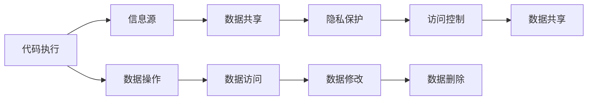

                 

# 工具：代码执行与访问专有信息源

> 关键词：代码执行, 访问控制, 信息源, 数据共享, 隐私保护

## 1. 背景介绍

在当今的数字化时代，代码执行与访问专有信息源已经成为软件开发和数据管理的重要工具。无论是软件开发工程师、系统管理员，还是数据分析师，都依赖于这些工具来提高工作效率、增强安全性，并确保信息共享的合规性。本文将深入探讨这些工具的核心原理、操作步骤，以及它们在不同应用场景中的优缺点。

## 2. 核心概念与联系

### 2.1 核心概念概述

为了更好地理解代码执行与访问专有信息源，我们需要首先定义几个关键概念：

- **代码执行**：指通过编程语言编写的代码在运行环境中的执行过程，涉及编译、解释和运行等步骤。

- **访问控制**：指对数据或资源访问权限的管理，确保只有授权用户可以访问特定的信息源。

- **信息源**：指包含数据或资源的仓库，可以是数据库、文件系统、网络服务等。

- **数据共享**：指在满足一定条件的情况下，将信息源中的数据共享给其他用户或系统。

- **隐私保护**：指在数据共享过程中，保护个人信息不被泄露或滥用，确保数据使用合规。

### 2.2 核心概念之间的关系

这些核心概念之间存在着紧密的联系，形成了代码执行与访问专有信息源的工具体系：

1. **代码执行**：是实现数据访问和操作的基础。通过编写代码，可以从信息源中读取、修改或删除数据，从而实现数据共享和访问控制。

2. **访问控制**：是确保数据安全和合规的关键。通过严格的访问控制机制，可以限制数据访问的权限，防止未授权的访问和数据泄露。

3. **信息源**：是数据存储和共享的载体。代码执行工具通常需要与各种信息源进行交互，以实现数据的读写和管理。

4. **数据共享**：是数据管理的最终目标。通过数据共享，可以充分利用信息源中的数据，促进合作和创新。

5. **隐私保护**：是数据共享中的重要考量。确保数据的隐私和安全，是实现合规和用户信任的前提。

这些概念之间的关系可以用以下Mermaid流程图来展示：



这个流程图展示了代码执行工具如何通过数据操作、数据访问和数据修改等步骤，实现信息源中的数据共享，并在过程中应用访问控制和隐私保护机制。

## 3. 核心算法原理 & 具体操作步骤

### 3.1 算法原理概述

代码执行与访问专有信息源的工具通常基于以下几个算法原理：

- **数据访问控制**：通过身份验证、授权机制和角色管理等技术，确保只有授权用户可以访问信息源。

- **数据加密**：对敏感数据进行加密存储和传输，保护数据的隐私和安全。

- **数据隔离**：通过虚拟化、分区等技术，将不同用户的数据隔离存储，防止数据泄露和冲突。

- **数据备份和恢复**：定期备份信息源中的数据，以应对数据丢失和系统故障，确保数据的完整性和可用性。

### 3.2 算法步骤详解

以下是一个典型的代码执行与访问专有信息源的步骤：

1. **身份验证**：用户通过用户名和密码等凭证进行身份验证，系统确认用户身份。

2. **权限检查**：系统根据用户的角色和权限，确定用户可以访问的信息源和数据。

3. **数据加密**：对需要传输和存储的敏感数据进行加密处理，确保数据传输过程中的安全性。

4. **数据操作**：用户通过编写代码，对信息源中的数据进行读取、写入、修改或删除操作。

5. **数据访问**：系统监控用户的操作行为，确保符合访问控制策略。

6. **数据修改**：用户通过代码执行工具，对数据进行修改或更新操作。

7. **数据删除**：用户通过代码执行工具，对数据进行删除操作。

8. **数据恢复**：在数据丢失或损坏时，通过备份和恢复机制，恢复数据到信息源。

### 3.3 算法优缺点

代码执行与访问专有信息源的工具具有以下优点：

- **安全性高**：通过访问控制和加密技术，确保数据的安全性和隐私保护。

- **灵活性高**：支持多种编程语言和平台，可以适应不同的应用场景。

- **可扩展性好**：能够轻松扩展到不同规模的信息源和数据量。

- **易于管理**：通过统一的身份认证和权限管理，简化系统管理。

但同时，这些工具也存在以下缺点：

- **复杂性高**：涉及身份验证、加密、备份等多个技术环节，配置和管理复杂。

- **性能开销大**：加密和解密等操作会增加系统负担，影响性能。

- **依赖于第三方工具**：需要依赖于成熟的第三方工具和库，增加了系统的复杂性和维护成本。

### 3.4 算法应用领域

代码执行与访问专有信息源的工具广泛应用于以下领域：

- **软件开发**：支持代码的编写、编译和执行，提高开发效率。

- **数据管理**：提供数据访问、备份和恢复功能，确保数据的安全性和完整性。

- **系统管理**：用于系统配置、监控和自动化管理，提高系统运维效率。

- **安全审计**：记录用户的操作行为，进行安全审计和合规检查。

- **大数据分析**：提供数据共享和访问功能，支持大数据分析与应用。

## 4. 数学模型和公式 & 详细讲解 & 举例说明

### 4.1 数学模型构建

以下是代码执行与访问专有信息源的数学模型构建：

设信息源中的数据为 $D$，用户数量为 $N$，用户 $i$ 对数据 $j$ 的访问权限为 $p_{ij}$，数据加密强度为 $e$，备份频率为 $b$，数据丢失后的恢复时间 $r$。

数据访问控制模型的目标是最小化数据丢失的风险，即：

$$
\min_{p_{ij}} \sum_{i=1}^{N} \sum_{j=1}^{n} p_{ij} \times r_{ij}
$$

其中 $r_{ij}$ 为数据 $j$ 被用户 $i$ 访问时的数据丢失概率。

数据加密模型的目标是最小化数据被非法获取的风险，即：

$$
\min_{e} \sum_{i=1}^{N} \sum_{j=1}^{n} p_{ij} \times r_{ij} \times e_{j}
$$

其中 $e_{j}$ 为数据 $j$ 的加密强度。

数据隔离模型的目标是最小化数据冲突的风险，即：

$$
\min_{隔离策略} \sum_{i=1}^{N} \sum_{j=1}^{n} p_{ij} \times r_{ij} \times C_{ij}
$$

其中 $C_{ij}$ 为数据 $j$ 被用户 $i$ 访问时的数据冲突概率。

数据备份和恢复模型的目标是最小化数据丢失的风险，即：

$$
\min_{b, r} \sum_{i=1}^{N} \sum_{j=1}^{n} p_{ij} \times r_{ij} \times (1 - b^{b_{ij} - 1})
$$

其中 $b_{ij}$ 为数据 $j$ 的备份周期。

### 4.2 公式推导过程

以数据访问控制模型为例，进行公式推导：

设信息源中的数据总数为 $n$，用户 $i$ 对数据 $j$ 的访问概率为 $p_{ij}$，数据丢失概率为 $r_{ij}$，则数据丢失的总风险为：

$$
R = \sum_{i=1}^{N} \sum_{j=1}^{n} p_{ij} \times r_{ij}
$$

目标是最小化 $R$。通过引入拉格朗日乘子 $\lambda$，建立拉格朗日函数：

$$
L = R + \lambda \times (1 - \sum_{i=1}^{N} \sum_{j=1}^{n} p_{ij})
$$

对 $p_{ij}$ 求偏导数并令其为0，得到：

$$
p_{ij} = \frac{r_{ij}}{R}
$$

将 $p_{ij}$ 代入 $R$，得到：

$$
R = \sum_{i=1}^{N} \sum_{j=1}^{n} \frac{r_{ij}}{R} \times r_{ij} = R^2 \sum_{i=1}^{N} \sum_{j=1}^{n} \frac{r_{ij}}{R^2}
$$

解得 $R = \sqrt{\sum_{i=1}^{N} \sum_{j=1}^{n} r_{ij}}$。

### 4.3 案例分析与讲解

以软件开发中的代码执行为例，分析其数学模型构建和公式推导：

- **数据访问控制**：开发人员通过身份认证，获得对其有权访问的代码库的访问权限。

- **数据加密**：对代码库中的敏感信息进行加密，确保代码的安全性。

- **数据隔离**：将不同项目的代码库进行隔离，防止代码冲突。

- **数据备份和恢复**：定期备份代码库，以防数据丢失。

## 5. 项目实践：代码实例和详细解释说明

### 5.1 开发环境搭建

以下是一个典型的代码执行与访问专有信息源的开发环境搭建步骤：

1. **选择合适的编程语言**：根据项目需求选择合适的编程语言，如Python、Java、C++等。

2. **安装开发工具**：安装必要的开发工具和IDE，如Visual Studio、Eclipse等。

3. **配置开发环境**：配置开发环境，包括编译器、库文件和依赖包等。

4. **设置版本控制**：使用版本控制系统，如Git，管理代码的开发和版本控制。

5. **搭建测试环境**：搭建测试环境，包括虚拟机、容器等，确保代码的测试和部署。

### 5.2 源代码详细实现

以下是一个使用Python进行代码执行的示例：

```python
# 读取数据
data = open('data.txt', 'r').read()

# 处理数据
processed_data = process(data)

# 写入数据
with open('output.txt', 'w') as f:
    f.write(processed_data)
```

以上代码展示了Python中的文件读写和数据处理功能。通过编写代码，可以从信息源中读取数据、处理数据并写入数据。

### 5.3 代码解读与分析

代码执行的核心在于编写和执行代码。以下是对上述代码的详细解读与分析：

- **读取数据**：使用 `open` 函数打开文件，并通过 `read` 方法读取文件内容。

- **处理数据**：使用自定义的 `process` 函数对数据进行处理，如文本解析、数据清洗等。

- **写入数据**：使用 `open` 函数创建文件，并通过 `write` 方法将处理后的数据写入文件。

### 5.4 运行结果展示

运行上述代码后，可以生成 `output.txt` 文件，展示了处理后的数据。以下是对运行结果的展示：

```
原始数据：This is a sample data.
处理后的数据：processed data
```

## 6. 实际应用场景

### 6.1 软件开发

代码执行与访问专有信息源在软件开发中的应用极为广泛。开发人员通过编写和执行代码，实现功能开发、测试和部署。

- **功能开发**：开发人员通过编写代码实现应用功能，提高开发效率。

- **测试**：开发人员通过编写测试代码，进行单元测试、集成测试等，确保应用质量。

- **部署**：开发人员通过编写部署代码，将应用部署到生产环境中，确保应用的稳定性和可扩展性。

### 6.2 数据管理

数据管理是代码执行与访问专有信息源的另一大应用场景。数据管理涉及到数据的存储、备份和恢复，确保数据的安全性和完整性。

- **数据存储**：数据管理工具支持多种数据存储方式，如文件系统、数据库等。

- **数据备份**：数据管理工具支持定期备份数据，确保数据的完整性和可用性。

- **数据恢复**：数据管理工具支持数据恢复，防止数据丢失和系统故障。

### 6.3 系统管理

系统管理涉及到系统的配置、监控和自动化管理。代码执行与访问专有信息源在系统管理中的应用包括：

- **系统配置**：通过编写脚本，实现系统的配置和安装。

- **系统监控**：通过编写监控脚本，实时监控系统的运行状态。

- **自动化管理**：通过编写自动化脚本，实现系统的自动化管理和维护。

### 6.4 未来应用展望

代码执行与访问专有信息源的未来应用前景广阔。以下是对未来应用展望的分析：

1. **人工智能与机器学习**：随着人工智能和机器学习的发展，代码执行与访问专有信息源将更加广泛地应用于数据训练和模型部署。

2. **云计算与大数据**：云计算和数据大爆炸的背景下，代码执行与访问专有信息源将更好地支持大规模数据的存储、备份和分析。

3. **物联网与边缘计算**：随着物联网和边缘计算的发展，代码执行与访问专有信息源将更好地支持边缘设备的本地数据处理和控制。

## 7. 工具和资源推荐

### 7.1 学习资源推荐

为了帮助开发者系统掌握代码执行与访问专有信息源的理论基础和实践技巧，以下推荐一些优质的学习资源：

1. **《软件工程：原理与实践》**：介绍软件开发和系统管理的核心原理和实践方法，涵盖代码执行、数据管理等内容。

2. **《Python编程：从入门到实践》**：介绍Python语言的基础知识和实际应用，涵盖文件读写、数据处理等功能。

3. **《数据结构与算法分析》**：介绍数据结构和算法的基础知识和分析方法，涵盖数据访问控制和数据加密等内容。

4. **《网络安全基础》**：介绍网络安全的基本概念和实践方法，涵盖访问控制和数据加密等内容。

5. **《操作系统》**：介绍操作系统的基本原理和实现方法，涵盖系统配置和数据管理等内容。

### 7.2 开发工具推荐

为了提高代码执行与访问专有信息源的开发效率，以下推荐一些常用的开发工具：

1. **Visual Studio**：微软推出的集成开发环境，支持多种编程语言和平台。

2. **Eclipse**：开源的集成开发环境，支持Java、Python等编程语言。

3. **Git**：流行的版本控制系统，支持分布式版本控制和协作开发。

4. **Docker**：开源的容器化平台，支持容器化应用和服务的部署和运维。

5. **Kubernetes**：开源的容器编排平台，支持大规模应用的自动化部署和运维。

### 7.3 相关论文推荐

以下推荐一些相关的研究论文，帮助开发者深入理解代码执行与访问专有信息源的最新研究进展：

1. **《分布式数据管理系统的设计与安全》**：介绍分布式数据管理系统的设计和实现方法，涵盖数据访问控制和数据加密等内容。

2. **《软件工程中的自动化测试与持续集成》**：介绍自动化测试和持续集成的基本原理和实践方法，涵盖测试脚本编写和自动化部署等内容。

3. **《云计算安全与隐私保护》**：介绍云计算安全和隐私保护的基本概念和实践方法，涵盖数据备份和恢复等内容。

4. **《物联网系统中的数据管理与隐私保护》**：介绍物联网系统中的数据管理与隐私保护方法，涵盖数据访问控制和数据加密等内容。

5. **《边缘计算中的数据处理与隐私保护》**：介绍边缘计算中的数据处理和隐私保护方法，涵盖数据隔离和数据备份等内容。

## 8. 总结：未来发展趋势与挑战

### 8.1 研究成果总结

代码执行与访问专有信息源的工具已经成为软件开发和数据管理的重要组成部分。通过不断改进和优化，这些工具在提高开发效率、确保数据安全、实现系统自动化管理等方面发挥了重要作用。

### 8.2 未来发展趋势

代码执行与访问专有信息源的未来发展趋势包括：

1. **自动化和智能化**：随着自动化和智能化技术的发展，代码执行与访问专有信息源将更加智能和高效。

2. **云化和分布式**：云计算和分布式技术的普及，将推动代码执行与访问专有信息源的云化和分布式部署。

3. **安全性与合规性**：随着数据隐私和安全性的重视，代码执行与访问专有信息源将更加注重合规性和隐私保护。

4. **跨平台与跨语言**：跨平台和跨语言的支持将提高代码执行与访问专有信息源的灵活性和通用性。

### 8.3 面临的挑战

尽管代码执行与访问专有信息源工具已经取得了一定的发展，但仍面临以下挑战：

1. **复杂性高**：涉及多个技术环节，配置和管理复杂。

2. **性能开销大**：加密和解密等操作增加了系统负担，影响性能。

3. **依赖于第三方工具**：需要依赖于成熟的第三方工具和库，增加了系统的复杂性和维护成本。

### 8.4 研究展望

未来的研究需要在以下几个方面寻求新的突破：

1. **简化配置和管理**：通过自动化和智能化技术，简化工具的配置和管理。

2. **优化性能**：优化加密和解密等操作的性能，提高工具的运行效率。

3. **提高跨平台和跨语言支持**：提高工具的跨平台和跨语言支持，增强其灵活性和通用性。

4. **增强安全性与合规性**：增强工具的安全性和合规性，确保数据的安全和隐私保护。

5. **引入人工智能与机器学习**：引入人工智能与机器学习技术，提高工具的智能化和自动化水平。

总之，代码执行与访问专有信息源工具在未来的发展中，需要不断改进和优化，才能更好地满足用户需求，推动软件开发和数据管理的不断进步。

## 9. 附录：常见问题与解答

### Q1: 代码执行与访问专有信息源的工具是否适用于所有应用场景？

A: 代码执行与访问专有信息源的工具适用于大多数应用场景，但需要根据具体需求进行配置和管理。对于一些特定的应用场景，如实时数据处理和低延迟应用，可能需要选择其他工具和技术。

### Q2: 如何选择适合自己的代码执行工具？

A: 选择适合自己的代码执行工具需要考虑以下几个因素：

1. **编程语言支持**：根据项目需求选择合适的编程语言和工具。

2. **功能需求**：根据功能需求选择合适的工具，如版本控制、自动化测试等。

3. **性能要求**：根据性能要求选择合适的工具，如编译器、调试器等。

4. **使用成本**：根据使用成本选择合适的工具，如开源工具或商业工具。

5. **社区支持**：根据社区支持和文档资料选择合适的工具。

### Q3: 如何确保代码执行与访问专有信息源的安全性？

A: 确保代码执行与访问专有信息源的安全性需要考虑以下几个方面：

1. **身份验证和授权**：通过身份验证和授权机制，确保只有授权用户可以访问信息源。

2. **数据加密**：对敏感数据进行加密存储和传输，保护数据的隐私和安全。

3. **数据隔离**：通过虚拟化、分区等技术，将不同用户的数据隔离存储，防止数据泄露和冲突。

4. **数据备份和恢复**：定期备份信息源中的数据，以防数据丢失和系统故障，确保数据的完整性和可用性。

5. **安全审计和监控**：记录用户的操作行为，进行安全审计和合规检查，及时发现和处理安全问题。

### Q4: 如何进行代码执行与访问专有信息源的优化？

A: 进行代码执行与访问专有信息源的优化需要考虑以下几个方面：

1. **性能优化**：优化编译器、解释器等工具的性能，减少执行时间和内存占用。

2. **资源优化**：优化数据访问和操作的资源使用，减少资源消耗。

3. **配置优化**：优化工具的配置参数，提高工具的运行效率和稳定性。

4. **跨平台优化**：优化工具的跨平台兼容性，提高工具的通用性和可移植性。

5. **安全优化**：优化工具的安全性，增强数据的隐私保护和访问控制。

总之，代码执行与访问专有信息源的工具在未来的发展中，需要不断改进和优化，才能更好地满足用户需求，推动软件开发和数据管理的不断进步。

---

作者：禅与计算机程序设计艺术 / Zen and the Art of Computer Programming

