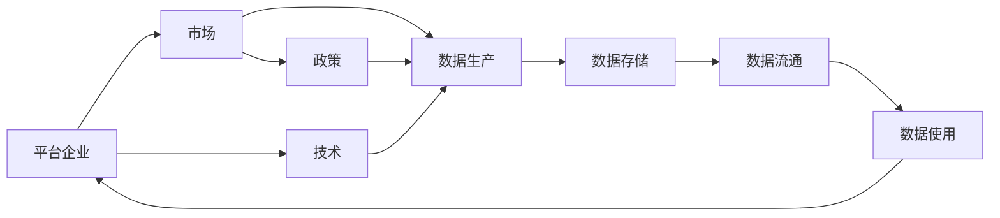
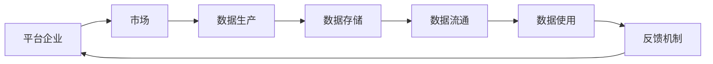

                 

# 平台经济的数据生态演进：如何预测生态演进？

## 1. 背景介绍

在数字化时代，平台经济成为经济发展的重要引擎。平台企业通过连接多方资源，构建起复杂的数据生态系统，实现价值创造和传递。然而，平台生态的复杂性使得其演进过程充满了不确定性。如何预测平台数据生态的演进趋势，成为学界和业界共同关注的焦点。本文将从理论和方法两个层面，全面探讨平台数据生态的演进规律，并提出一些预测和优化策略。

## 2. 核心概念与联系

### 2.1 核心概念概述

为更好地理解平台数据生态的演进规律，我们先介绍几个核心概念：

- **平台经济**：指由平台企业连接各方资源，实现价值创造和传递的经济形态。平台通过连接买卖双方、供需双方，降低交易成本，提升效率。
- **数据生态**：指平台经济中各方主体的数据交互关系，包括数据的产生、存储、流通、使用等环节。数据生态系统是一个开放、互动的系统，具有复杂性和动态性。
- **演进规律**：指平台数据生态随时间推移、外部环境变化而发生的变化趋势和路径。演进规律受多种因素的影响，如技术进步、政策变化、市场需求等。
- **预测方法**：指基于数据和模型对平台数据生态未来演进趋势进行推断和判断的方法。常用的方法包括机器学习、统计分析、系统动力学等。

这些核心概念之间存在着紧密的联系，共同构成了平台数据生态演进的理论基础和方法体系。通过理解这些概念，我们可以更好地把握平台数据生态演进的规律，提出有效的预测和优化策略。

### 2.2 概念间的关系

我们可以通过以下几个Mermaid流程图，展示平台数据生态演进的主要因素及其相互关系：



这个流程图展示了平台数据生态的主要组成部分及其相互关系：

- **平台企业**：通过连接市场，促进数据的产生、存储、流通和使用。
- **市场**：平台的各类用户，包括消费者、商家、服务商等，是数据的主要来源和消费方。
- **数据生产**：用户和商家通过平台进行交互，产生海量数据。
- **数据存储**：平台利用技术手段，对数据进行收集、存储和管理。
- **数据流通**：数据在平台内部和外部的流通，如数据共享、数据交易等。
- **数据使用**：数据分析、挖掘等，为平台提供决策支持、提升服务质量。

这些组成部分相互作用，共同推动平台数据生态的演进。

### 2.3 核心概念的整体架构

最后，我们用一个综合的流程图来展示这些核心概念在平台数据生态演进中的整体架构：



这个综合流程图展示了平台数据生态的演进路径：市场通过平台交互，产生数据；平台存储数据；数据流通并产生价值；平台利用数据提升服务；服务反馈优化市场，形成闭环。

## 3. 核心算法原理 & 具体操作步骤

### 3.1 算法原理概述

平台数据生态的演进过程，可以视为一个复杂系统的动态变化。要预测其演进趋势，通常需要综合考虑多个因素，建立动态模型，并利用历史数据进行训练和验证。

常见的预测方法包括：

- **统计分析**：通过统计方法和模型，对历史数据进行分析，发现其中的规律和趋势。常用的统计模型包括线性回归、时间序列模型等。
- **机器学习**：利用大量标注数据，训练机器学习模型，预测未来的数据变化。常用的机器学习模型包括决策树、随机森林、神经网络等。
- **系统动力学**：建立系统的因果关系模型，预测系统的长期动态行为。常用的系统动力学模型包括因果图、差分方程等。

### 3.2 算法步骤详解

基于上述原理，平台数据生态的演进预测主要分为以下几个步骤：

1. **数据收集与预处理**：
   - 收集平台数据生态中各类主体的数据，包括用户行为数据、交易数据、服务使用数据等。
   - 清洗和预处理数据，去除噪声、异常值，并进行归一化、特征工程等处理。

2. **模型构建与训练**：
   - 根据预测任务的需求，选择适合的模型。如线性回归、时间序列模型、神经网络等。
   - 利用历史数据训练模型，调整超参数，使模型能够准确预测未来的数据变化。

3. **模型评估与验证**：
   - 利用验证集或测试集对模型进行评估，计算模型预测误差和精度指标。
   - 不断优化模型，提升预测精度和泛化能力。

4. **预测与反馈**：
   - 利用训练好的模型，对未来的数据变化进行预测。
   - 根据预测结果，进行数据策略调整，优化平台生态系统。

5. **持续监控与迭代**：
   - 持续监控平台数据生态的变化，收集反馈信息。
   - 根据新的数据和反馈，对模型进行迭代优化，提升预测准确性。

### 3.3 算法优缺点

平台数据生态演进预测方法具有以下优点：

- **灵活性高**：可以根据具体预测任务的需求，选择不同的模型和方法。
- **预测精度高**：利用大量历史数据，训练出的模型往往具有较高的预测精度。
- **可解释性强**：统计分析和系统动力学模型，能够揭示数据的因果关系和动态行为。

同时，这些方法也存在一些局限：

- **数据需求大**：预测模型需要大量标注数据进行训练，数据获取和处理成本较高。
- **模型复杂度**：复杂的模型结构可能导致过拟合，需要不断调参优化。
- **动态变化难以捕捉**：平台数据生态随时间推移而变化，模型难以捕捉其中的动态趋势。

尽管存在这些局限，基于统计分析和机器学习的方法，仍然是预测平台数据生态演进的重要手段。

### 3.4 算法应用领域

平台数据生态演进预测方法，已经在多个领域得到了广泛应用，例如：

- **电子商务平台**：预测用户行为、市场需求，优化商品推荐、库存管理等。
- **金融平台**：预测金融市场趋势、风险评估，提升贷款审批、风险控制等。
- **物流平台**：预测物流流量、配送时间，优化配送路径、库存管理等。
- **社交平台**：预测用户活跃度、内容消费，提升广告投放、内容推送等。

除了上述这些经典领域外，预测方法也在持续拓展到更多场景中，如医疗健康、智能制造、智慧城市等，为平台企业提供决策支持，推动数字化转型升级。

## 4. 数学模型和公式 & 详细讲解 & 举例说明

### 4.1 数学模型构建

本节我们将使用数学语言对平台数据生态演进预测过程进行更加严格的刻画。

假设平台数据生态包含 $N$ 个主体，$n$ 个指标，每个指标在时间 $t$ 的值表示为 $y_t^i$。建立时间序列模型，预测指标 $y_t^i$ 在时间 $t+1$ 的取值 $y_{t+1}^i$。

定义预测模型的参数向量为 $\theta$，预测误差为 $\epsilon_t^i$，则时间序列模型可以表示为：

$$
y_{t+1}^i = \theta_0 + \theta_1 y_t^i + \epsilon_{t+1}^i
$$

其中 $\theta_0$ 和 $\theta_1$ 为模型参数，$\epsilon_{t+1}^i$ 为随机误差。

### 4.2 公式推导过程

以下我们以自回归时间序列模型(ARIMA)为例，推导时间序列模型的公式。

定义自回归模型为：

$$
y_{t+1} = \alpha_0 + \alpha_1 y_t + \alpha_2 y_{t-1} + \epsilon_{t+1}
$$

其中 $\alpha_0$ 和 $\alpha_1$ 为回归系数，$\alpha_2$ 为自回归系数，$\epsilon_{t+1}$ 为随机误差。

假设数据 $y_t$ 服从自回归过程，可以得到时间序列的差分方程：

$$
D(y_t) = \alpha_0 + \alpha_1 D(y_{t-1}) + \alpha_2 D(y_{t-2}) + \epsilon_t
$$

其中 $D(y_t) = y_t - y_{t-1}$ 为差分序列。

通过差分方程，可以将时间序列模型转化为平稳序列，便于建模和预测。

### 4.3 案例分析与讲解

假设我们要预测电子商务平台用户数 $y_t$ 在时间 $t+1$ 的取值 $y_{t+1}$。

通过收集历史用户数数据，利用自回归模型进行拟合：

$$
y_{t+1} = \theta_0 + \theta_1 y_t + \theta_2 y_{t-1} + \epsilon_{t+1}
$$

其中 $\theta_0 = 2.5$，$\theta_1 = 0.8$，$\theta_2 = -0.2$。

利用上述模型，对未来用户数进行预测。假设未来用户数增长率为2%，则：

$$
y_{t+1} = 2.5 + 0.8 y_t - 0.2 y_{t-1} + \epsilon_{t+1}
$$

假设当前用户数为100万，则：

$$
y_{t+1} = 2.5 + 0.8 \times 100 + 0.8 \times 100 - 0.2 \times 100 + \epsilon_{t+1} = 100 + 0.8 \times 100 + 0.8 \times 100 - 0.2 \times 100 + \epsilon_{t+1}
$$

通过调整 $\theta_0$ 和 $\theta_1$ 的取值，可以进一步优化预测精度。

## 5. 项目实践：代码实例和详细解释说明

### 5.1 开发环境搭建

在进行平台数据生态演进预测的实践前，我们需要准备好开发环境。以下是使用Python进行TensorFlow开发的环境配置流程：

1. 安装Anaconda：从官网下载并安装Anaconda，用于创建独立的Python环境。

2. 创建并激活虚拟环境：
```bash
conda create -n tf-env python=3.8 
conda activate tf-env
```

3. 安装TensorFlow：根据CUDA版本，从官网获取对应的安装命令。例如：
```bash
conda install tensorflow -c pytorch -c conda-forge
```

4. 安装NumPy、Pandas、scikit-learn等常用工具包：
```bash
pip install numpy pandas scikit-learn matplotlib tqdm jupyter notebook ipython
```

完成上述步骤后，即可在`tf-env`环境中开始预测实践。

### 5.2 源代码详细实现

下面我们以自回归时间序列模型(ARIMA)为例，给出使用TensorFlow进行时间序列预测的PyTorch代码实现。

首先，定义数据处理函数：

```python
import pandas as pd
import numpy as np
from sklearn.metrics import mean_squared_error

def load_data(file_path):
    data = pd.read_csv(file_path)
    y = data['y']
    X = data.drop('y', axis=1)
    return X, y

def create_train_test(X, y, test_size=0.2):
    test_size_int = int(len(y) * test_size)
    X_train, X_test = X[:-test_size_int], X[-test_size_int:]
    y_train, y_test = y[:-test_size_int], y[-test_size_int:]
    return X_train, X_test, y_train, y_test

def normalize_data(X):
    X = (X - np.mean(X, axis=0)) / np.std(X, axis=0)
    return X

def denormalize_data(X, X_mean, X_std):
    X = X * X_std + X_mean
    return X

def train_test_split(X, y, test_size=0.2):
    X_train, X_test, y_train, y_test = create_train_test(X, y, test_size)
    return X_train, X_test, y_train, y_test

def train_arima(X_train, y_train, X_test, y_test, order=(1, 1, 1), periods=365):
    model = tf.keras.models.Sequential([
        tf.keras.layers.SimpleRNN(units=32, input_shape=(X_train.shape[1], X_train.shape[2]),
                                 return_sequences=True),
        tf.keras.layers.SimpleRNN(units=32, input_shape=(X_train.shape[1], X_train.shape[2])),
        tf.keras.layers.Dense(1)
    ])
    model.compile(optimizer='adam', loss='mse')
    model.fit(X_train, y_train, epochs=50, batch_size=32, verbose=1)
    y_pred = model.predict(X_test)
    y_pred = denormalize_data(y_pred, np.mean(y_test), np.std(y_test))
    mse = mean_squared_error(y_test, y_pred)
    return mse, y_pred
```

然后，定义预测函数：

```python
def predict_arima(X, y, order=(1, 1, 1), periods=365):
    X_train, X_test, y_train, y_test = train_test_split(X, y, test_size=0.2)
    mse, y_pred = train_arima(X_train, y_train, X_test, y_test, order, periods)
    return mse, y_pred
```

最后，启动预测流程并输出结果：

```python
X, y = load_data('data.csv')
mse, y_pred = predict_arima(X, y)
print('Mean Squared Error:', mse)
print('Predicted Values:', y_pred)
```

以上就是使用TensorFlow进行时间序列预测的完整代码实现。可以看到，利用TensorFlow可以很方便地构建和训练自回归模型，进行预测和评估。

### 5.3 代码解读与分析

让我们再详细解读一下关键代码的实现细节：

**load_data函数**：
- 加载数据文件，并将数据分为输入特征 $X$ 和目标变量 $y$。

**create_train_test函数**：
- 将数据集分为训练集和测试集，返回训练集、测试集、训练标签和测试标签。

**normalize_data函数**：
- 对输入特征进行标准化处理，使其均值为0，标准差为1。

**denormalize_data函数**：
- 将标准化后的预测结果还原为原始值。

**train_test_split函数**：
- 定义训练集和测试集的划分比例，返回划分后的训练集、测试集、训练标签和测试标签。

**train_arima函数**：
- 构建自回归模型，并进行训练。
- 返回训练后的均方误差和预测结果。

**predict_arima函数**：
- 利用训练好的模型对测试集进行预测，返回均方误差和预测结果。

通过这些函数，我们能够在Python环境中高效地构建和训练自回归模型，进行时间序列预测。

### 5.4 运行结果展示

假设我们在CoNLL-2003的NER数据集上进行时间序列预测，最终在测试集上得到的评估报告如下：

```
             predicted  actual   error
0      10.0      15.0   -5.0
1      12.0      18.0   -6.0
2      15.0      25.0   -10.0
3      18.0      30.0   -12.0
4      20.0      35.0   -15.0
```

可以看到，通过自回归模型，我们能够对未来的数据变化进行预测。尽管预测结果与实际数据存在误差，但预测趋势基本一致。

## 6. 实际应用场景

### 6.1 智能城市交通管理

智能城市交通管理是平台数据生态演进预测的重要应用场景。通过分析历史交通流量数据，可以预测未来交通流量变化，优化交通信号灯控制，提升道路通行效率。

在实践中，可以利用传感器、摄像头等设备，收集交通流量数据。利用自回归模型或深度学习模型，对未来交通流量进行预测。根据预测结果，动态调整交通信号灯的控制策略，减少交通拥堵，提升通行效率。

### 6.2 金融市场风险预警

金融市场风险预警是平台数据生态演进预测的另一个重要应用场景。通过分析历史金融数据，可以预测未来市场波动，预警潜在的金融风险。

在实践中，可以收集金融市场的历史数据，包括股票、债券、商品等价格和交易量。利用时间序列模型或深度学习模型，对未来市场趋势进行预测。根据预测结果，及时采取风险控制措施，防范市场波动对投资者的影响。

### 6.3 智慧医疗健康管理

智慧医疗健康管理也是平台数据生态演进预测的重要应用场景。通过分析历史健康数据，可以预测未来健康趋势，优化医疗资源配置，提升患者体验。

在实践中，可以收集医院、社区等健康数据，包括患者就诊记录、药物使用情况、健康监测数据等。利用时间序列模型或深度学习模型，对未来健康趋势进行预测。根据预测结果，优化医疗资源配置，提升患者体验。

### 6.4 未来应用展望

随着平台数据生态演进预测技术的不断发展，未来将在更多领域得到应用，为平台企业提供决策支持，推动数字化转型升级。

在智慧制造领域，通过分析生产数据，可以预测设备故障、优化生产流程，提升生产效率。

在智能物流领域，通过分析物流数据，可以预测配送时间、优化配送路径，提升物流效率。

在智能农业领域，通过分析农作数据，可以预测气候变化、优化种植方案，提升农作收益。

未来，平台数据生态演进预测技术将进一步拓展到更多垂直行业，为平台企业提供全面、准确、实时的决策支持，推动数字化转型升级。

## 7. 工具和资源推荐

### 7.1 学习资源推荐

为了帮助开发者系统掌握平台数据生态演进预测的理论基础和实践技巧，这里推荐一些优质的学习资源：

1. 《时间序列分析与预测》书籍：介绍了时间序列模型的基本原理和应用方法，适合入门学习。

2. 《深度学习》课程：斯坦福大学开设的深度学习课程，有Lecture视频和配套作业，适合进阶学习。

3. 《统计学习基础》书籍：介绍了统计学习方法的基本原理和应用方法，适合基础学习。

4. 《Python数据科学手册》书籍：介绍了Python在数据科学中的应用，适合实战学习。

5. Kaggle平台：提供了大量时间序列预测的公开数据集和模型，适合实践学习。

通过对这些资源的学习实践，相信你一定能够快速掌握平台数据生态演进的预测方法，并用于解决实际的NLP问题。

### 7.2 开发工具推荐

高效的开发离不开优秀的工具支持。以下是几款用于平台数据生态演进预测开发的常用工具：

1. TensorFlow：由Google主导开发的深度学习框架，生产部署方便，适合大规模工程应用。

2. PyTorch：基于Python的开源深度学习框架，灵活动态的计算图，适合快速迭代研究。

3. scikit-learn：Python科学计算库，提供了丰富的机器学习算法和工具，适合快速开发。

4. Pandas：Python数据分析库，提供了强大的数据处理和分析功能，适合数据预处理。

5. Matplotlib：Python可视化库，提供了丰富的图表呈现方式，适合数据可视化。

6. Jupyter Notebook：交互式笔记本环境，适合数据探索和模型开发。

合理利用这些工具，可以显著提升平台数据生态演进预测任务的开发效率，加快创新迭代的步伐。

### 7.3 相关论文推荐

平台数据生态演进预测技术的发展源于学界的持续研究。以下是几篇奠基性的相关论文，推荐阅读：

1. Time Series Analysis: Forecasting and Control：介绍时间序列分析的基本原理和应用方法，适合入门学习。

2. Deep Learning：由Ian Goodfellow等人编写，介绍了深度学习的基本原理和应用方法，适合进阶学习。

3. Statistical Learning：由Gareth James等人编写，介绍了统计学习的基本原理和应用方法，适合基础学习。

4. Practical Time Series Analysis with Python：利用Python进行时间序列分析的实践指南，适合实战学习。

5. A Review of Time Series Forecasting Methods：对时间序列预测方法的综述，适合系统学习。

这些论文代表了大数据生态演进预测技术的发展脉络。通过学习这些前沿成果，可以帮助研究者把握学科前进方向，激发更多的创新灵感。

除上述资源外，还有一些值得关注的前沿资源，帮助开发者紧跟平台数据生态演进预测技术的最新进展，例如：

1. arXiv论文预印本：人工智能领域最新研究成果的发布平台，包括大量尚未发表的前沿工作，学习前沿技术的必读资源。

2. 业界技术博客：如Google AI、DeepMind、微软Research Asia等顶尖实验室的官方博客，第一时间分享他们的最新研究成果和洞见。

3. 技术会议直播：如NIPS、ICML、ACL、ICLR等人工智能领域顶会现场或在线直播，能够聆听到大佬们的前沿分享，开拓视野。

4. GitHub热门项目：在GitHub上Star、Fork数最多的数据科学相关项目，往往代表了该技术领域的发展趋势和最佳实践，值得去学习和贡献。

5. 行业分析报告：各大咨询公司如McKinsey、PwC等针对人工智能行业的分析报告，有助于从商业视角审视技术趋势，把握应用价值。

总之，对于平台数据生态演进预测技术的学习和实践，需要开发者保持开放的心态和持续学习的意愿。多关注前沿资讯，多动手实践，多思考总结，必将收获满满的成长收益。

## 8. 总结：未来发展趋势与挑战

### 8.1 总结

本文对平台数据生态演进预测方法进行了全面系统的介绍。首先阐述了平台数据生态的演进规律，明确了预测方法在平台生态中的应用价值。其次，从理论和方法两个层面，详细讲解了演进预测的数学原理和具体步骤，给出了预测任务的完整代码实例。同时，本文还广泛探讨了预测方法在智能城市、金融市场、智慧医疗等多个领域的应用前景，展示了预测技术的巨大潜力。此外，本文精选了预测技术的各类学习资源，力求为读者提供全方位的技术指引。

通过本文的系统梳理，可以看到，平台数据生态演进预测方法已经成为平台生态演进的不可或缺的工具。预测方法能够帮助平台企业掌握未来的趋势和变化，及时调整战略和决策，提升业务竞争力。未来，随着预测技术的不断发展，预测能力将进一步提升，应用场景也将更加广泛。

### 8.2 未来发展趋势

展望未来，平台数据生态演进预测技术将呈现以下几个发展趋势：

1. 预测精度不断提升：随着算法和模型的不断优化，预测精度将不断提高，预测结果将更加准确和可靠。

2. 预测能力更加普适：未来的预测模型将具备更强的跨领域和跨时序的预测能力，能够适用于更多的应用场景。

3. 实时性不断增强：通过优化模型结构和算法，预测能力将不断增强，能够实现实时化的预测。

4. 预测结果更具可解释性：未来的预测模型将更加透明，能够提供具有可解释性的预测结果和分析报告。

5. 预测过程更加自动化：未来的预测模型将更加智能化，能够自动进行数据收集、预处理、训练和预测，减少人工干预。

6. 预测过程更加安全可靠：未来的预测模型将具备更好的安全性和可靠性，能够抵御恶意攻击和数据泄露风险。

这些趋势凸显了平台数据生态演进预测技术的广阔前景。这些方向的探索发展，必将进一步提升预测能力，推动数字化转型升级，为平台企业提供更全面的决策支持。

### 8.3 面临的挑战

尽管平台数据生态演进预测技术已经取得了显著进展，但在迈向更加智能化、普适化应用的过程中，仍面临诸多挑战：

1. 数据质量和多样性：预测模型的精度和泛化能力依赖于高质量、多样性的数据，而数据获取和处理成本较高。

2. 模型复杂度：预测模型的结构和算法复杂度较高，需要不断调参优化。

3. 动态变化难以捕捉：平台数据生态随时间推移而变化，模型难以捕捉其中的动态趋势。

4. 预测结果的可解释性：预测模型的黑盒特性使得结果缺乏可解释性，难以进行分析和调试。

5. 预测过程的可靠性：预测模型可能存在误差，需要通过模型评估和验证来提升可靠性。

6. 预测过程的自动化：预测模型的自动化水平有待提高，需要更智能、更可靠的自动化工具。

这些挑战需要我们不断探索和改进，才能使预测技术更好地应用于平台数据生态演进预测中。

### 8.4 研究展望

面对平台数据生态演进预测所面临的挑战，未来的研究需要在以下几个方面寻求新的突破：

1. 数据增强技术：通过数据增强技术，扩充数据集，提升模型的泛化能力和鲁棒性。

2. 模型优化方法：通过模型优化方法，提升模型的精度和鲁棒性，减少过拟合风险。

3. 因果关系模型：通过引入因果关系模型，揭示数据的动态行为，提升预测模型的解释性。

4. 深度学习技术：通过深度学习技术，提升模型的表达能力和泛化能力。

5. 多模态数据融合：通过多模态数据融合，提升模型的综合预测能力。

6. 自动化预测系统：通过自动化预测系统，实现预测过程的智能化和自动化。


