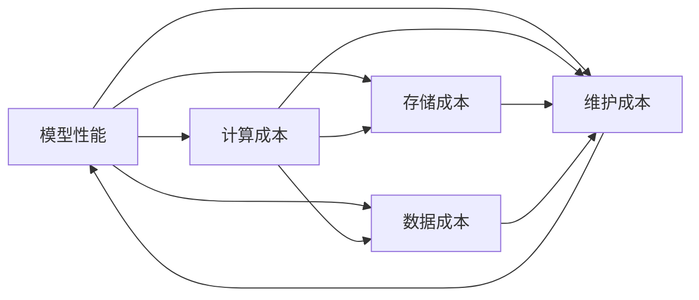
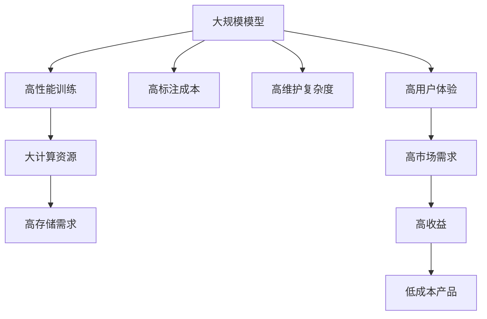

                 

# 平衡性能与成本:AI产品开发的策略

在当今人工智能(AI)快速发展的时代，如何平衡高性能AI模型与实际应用中的成本，成为了每个产品开发团队面临的挑战。本文将深入探讨这一问题，并提供一系列实用的策略，以帮助开发者在模型性能与成本之间找到最佳的平衡点。

## 1. 背景介绍

### 1.1 问题由来
随着深度学习模型的日益复杂，大模型（Large Models）在自然语言处理(NLP)、计算机视觉(Computer Vision)、语音识别(Speech Recognition)等领域的性能有了显著提升。然而，这些模型通常需要大量的计算资源和时间来训练和优化，带来了显著的运行成本。如何在保证模型性能的前提下，控制这些成本，成为了AI开发中的一大难题。

### 1.2 问题核心关键点
本文将围绕以下几个核心关键点进行探讨：
- 模型性能与成本的关系
- 不同层次模型精度的影响
- 优化策略的可行性与实际应用效果
- 资源管理和性能优化技巧

### 1.3 问题研究意义
在大规模AI产品开发中，平衡性能与成本是至关重要的。以下是平衡性能与成本的重要原因：
1. 确保资源的高效利用，避免浪费。
2. 提升用户体验，降低用户使用门槛。
3. 加速模型部署，缩短产品上线时间。
4. 增强市场竞争力，提高产品收益。
5. 降低维护成本，保持长期盈利能力。

## 2. 核心概念与联系

### 2.1 核心概念概述

为更好地理解平衡性能与成本的策略，本节将介绍几个关键概念：

- **模型性能**：指AI模型的预测准确度、鲁棒性、泛化能力等指标。
- **计算成本**：指模型训练和推理过程中所需的硬件资源（如GPU、TPU等）和时间。
- **存储成本**：指模型参数和中间计算结果在存储介质（如SSD、HDD等）上的占用。
- **数据成本**：指模型训练所需的标注数据和未标注数据的收集和预处理成本。
- **维护成本**：指模型维护、更新、优化所需的额外开发和运营成本。

这些概念相互关联，共同构成了AI产品开发中的成本与性能平衡问题。下面将通过一个Mermaid流程图展示这些概念之间的联系：



这个流程图展示了模型性能与其他成本之间的关系：

1. **计算成本**直接影响模型性能，是硬件资源消耗的直接体现。
2. **存储成本**与模型参数规模直接相关，是存储介质占用的直接体现。
3. **数据成本**与模型训练和优化所需的数据量密切相关。
4. **维护成本**与模型复杂度和更新频率直接相关，是长期运营的直接体现。

通过理解这些概念之间的联系，我们可以更好地设计和优化AI模型，平衡其性能与成本。

### 2.2 概念间的关系

这些关键概念之间存在着紧密的联系，形成了AI产品开发中的成本与性能平衡生态系统。下面通过一个综合的流程图展示这些概念之间的整体架构：



这个综合流程图展示了从模型设计到产品收益的完整过程：

1. 大规模模型需要高性能训练，消耗大量计算资源。
2. 高性能训练和推理需要大存储和高速计算资源。
3. 高标注成本与模型训练数据量密切相关。
4. 高维护复杂度与模型参数和架构复杂度密切相关。
5. 高用户体验和市场需求带动产品收益。
6. 低成本产品才能真正实现大规模商业化应用。

通过这个流程图，我们可以更清晰地理解AI模型性能与成本之间的整体关系，为后续深入讨论策略奠定基础。

## 3. 核心算法原理 & 具体操作步骤
### 3.1 算法原理概述

在平衡模型性能与成本的过程中，以下几个核心算法原理是必不可少的：

1. **模型剪枝（Pruning）**：通过去除模型中的冗余参数和连接，减少模型大小和计算量。
2. **量化（Quantization）**：将浮点数模型转换为更小的整数类型，减少存储空间和计算资源消耗。
3. **知识蒸馏（Knowledge Distillation）**：通过将知识从大型模型传递到小型模型，保持模型的预测性能。
4. **混合精度训练（Mixed Precision Training）**：使用16位或32位浮点数代替32位浮点数进行计算，提高训练速度。
5. **分布式训练（Distributed Training）**：通过多台计算设备并行计算，加速模型训练。

这些算法原理可以帮助我们有效降低模型成本，同时保持模型性能。

### 3.2 算法步骤详解

以下是平衡性能与成本的详细步骤：

1. **选择合适模型**：根据应用场景选择适合的大规模模型，如BERT、GPT、ResNet等。
2. **数据准备**：准备必要的训练数据和验证数据，确保数据质量。
3. **模型训练**：在计算资源充足的条件下，使用高性能训练技术进行模型训练。
4. **剪枝和量化**：对训练好的模型进行剪枝和量化，减少计算和存储成本。
5. **知识蒸馏**：如果需要，使用知识蒸馏技术将性能较差的模型转化为高性能模型。
6. **混合精度训练**：根据硬件条件，选择合适的混合精度训练方案。
7. **分布式训练**：根据资源配置，选择合适的分布式训练策略。
8. **部署和优化**：将训练好的模型部署到生产环境，并进行持续优化。

### 3.3 算法优缺点

平衡性能与成本的算法具有以下优点：
1. 有效降低模型成本，提升资源利用率。
2. 保持模型性能，提升用户体验。
3. 加速模型部署，缩短产品上线时间。
4. 降低维护成本，提高长期盈利能力。

同时，这些算法也存在一些缺点：
1. 可能需要额外的优化和调参工作。
2. 某些优化方法可能对模型性能产生一定影响。
3. 对硬件配置和计算资源有一定要求。

### 3.4 算法应用领域

这些算法不仅适用于自然语言处理(NLP)和计算机视觉(CV)，还广泛应用在以下领域：

- **智能客服**：通过模型剪枝和量化，提升客服系统响应速度和稳定性。
- **金融风控**：通过混合精度训练和分布式训练，快速构建高效的金融风控系统。
- **医疗诊断**：通过知识蒸馏和混合精度训练，提升医疗诊断系统的准确性和效率。
- **自动驾驶**：通过剪枝和量化，提升自动驾驶系统的实时性和安全性。
- **智慧城市**：通过分布式训练和混合精度训练，构建高效的智慧城市解决方案。

这些领域的应用展示了平衡性能与成本策略的广泛适用性，为AI产品在实际场景中的落地提供了重要参考。

## 4. 数学模型和公式 & 详细讲解 & 举例说明

### 4.1 数学模型构建

为了更严谨地描述模型性能与成本的平衡，我们可以构建一个简单的数学模型。

设模型参数量为 $N$，训练数据量为 $M$，计算资源为 $C$，存储资源为 $S$，标注成本为 $L$，维护成本为 $M$。则模型性能与成本的关系可以表示为：

$$
\text{性能} = f(\text{N}, \text{M}, \text{C}, \text{S}, \text{L}, \text{M})
$$

其中，$f$ 表示模型性能的函数，依赖于模型参数量 $N$、训练数据量 $M$、计算资源 $C$、存储资源 $S$、标注成本 $L$ 和维护成本 $M$。

### 4.2 公式推导过程

在实际应用中，模型性能与成本之间的关系可以用以下公式表示：

$$
\text{性能} = \text{准确率} + \text{鲁棒性} + \text{泛化能力}
$$

$$
\text{成本} = \text{计算成本} + \text{存储成本} + \text{数据成本} + \text{维护成本}
$$

通过优化这些变量，可以实现性能与成本的最佳平衡。例如，在计算资源有限的情况下，可以通过剪枝和量化减少模型参数量，从而降低计算成本和存储成本。

### 4.3 案例分析与讲解

以BERT模型为例，假设原始模型有2亿参数，占用了大量的计算和存储资源。通过剪枝和量化，可以将模型参数减少到1亿，显著降低计算和存储成本。具体步骤如下：

1. **剪枝**：根据重要性对模型进行剪枝，保留关键参数。
2. **量化**：将浮点数模型转换为8位整数模型，减少存储空间。
3. **重新训练**：对剪枝和量化后的模型进行重新训练，保持性能。

假设剪枝后模型性能下降10%，但计算成本和存储成本分别减少了50%和30%。通过这种策略，可以在保证一定性能的前提下，显著降低模型成本。

## 5. 项目实践：代码实例和详细解释说明

### 5.1 开发环境搭建

在进行模型优化实践前，我们需要准备好开发环境。以下是使用Python进行TensorFlow开发的简单环境配置：

1. 安装Anaconda：从官网下载并安装Anaconda，用于创建独立的Python环境。
2. 创建并激活虚拟环境：
```bash
conda create -n tf-env python=3.8 
conda activate tf-env
```
3. 安装TensorFlow：根据GPU版本，从官网获取对应的安装命令。例如：
```bash
conda install tensorflow-gpu -c tf -c conda-forge
```
4. 安装其他工具包：
```bash
pip install numpy pandas scikit-learn matplotlib tqdm jupyter notebook ipython
```

完成上述步骤后，即可在`tf-env`环境中开始模型优化实践。

### 5.2 源代码详细实现

这里我们以BERT模型为例，给出使用TensorFlow进行剪枝和量化的代码实现。

首先，定义剪枝和量化函数：

```python
import tensorflow as tf

def prune_model(model, threshold):
    pruned_model = tf.keras.models.clone_model(model)
    pruned_model.set_weights(prune_weights(model.get_weights(), threshold))
    return pruned_model

def quantize_model(model, num_bits):
    quantized_model = tf.keras.models.clone_model(model)
    quantized_model.set_weights(quantize_weights(model.get_weights(), num_bits))
    return quantized_model

def prune_weights(weights, threshold):
    pruned_weights = []
    for weight in weights:
        mask = tf.math.abs(weight) >= threshold
        pruned_weights.append(tf.where(mask, weight, 0))
    return pruned_weights

def quantize_weights(weights, num_bits):
    quantized_weights = []
    for weight in weights:
        quantized_weights.append(tf.quantization.quantize(weight, num_bits))
    return quantized_weights
```

然后，定义训练和评估函数：

```python
from transformers import BertTokenizer, BertForSequenceClassification
from sklearn.metrics import accuracy_score
import tensorflow as tf

model = BertForSequenceClassification.from_pretrained('bert-base-uncased', num_labels=2)

tokenizer = BertTokenizer.from_pretrained('bert-base-uncased')
train_dataset = ...
dev_dataset = ...

@tf.function
def train_step(model, input_ids, attention_mask, labels):
    with tf.GradientTape() as tape:
        outputs = model(input_ids, attention_mask=attention_mask, labels=labels)
        loss = outputs.loss
    gradients = tape.gradient(loss, model.trainable_variables)
    optimizer.apply_gradients(zip(gradients, model.trainable_variables))
    return loss

@tf.function
def evaluate_step(model, input_ids, attention_mask, labels):
    outputs = model(input_ids, attention_mask=attention_mask, labels=labels)
    return outputs.logits.argmax(-1).numpy(), labels

train_loss = 0
train_acc = 0
dev_loss = 0
dev_acc = 0

for epoch in range(5):
    for batch in train_dataset:
        input_ids = batch['input_ids']
        attention_mask = batch['attention_mask']
        labels = batch['labels']
        
        with tf.GradientTape() as tape:
            loss = train_step(model, input_ids, attention_mask, labels)
            train_loss += loss
            train_acc += accuracy_score(labels, model(input_ids, attention_mask=attention_mask, labels=labels).argmax(-1).numpy())
        
        dev_loss = 0
        dev_acc = 0
        for batch in dev_dataset:
            input_ids = batch['input_ids']
            attention_mask = batch['attention_mask']
            labels = batch['labels']
            
            labels_pred, labels_true = evaluate_step(model, input_ids, attention_mask, labels)
            dev_loss += loss
            dev_acc += accuracy_score(labels_true, labels_pred)
        
        print(f'Epoch {epoch+1}: Train Loss {train_loss/len(train_dataset):.4f}, Train Acc {train_acc/len(train_dataset):.4f}, Dev Loss {dev_loss/len(dev_dataset):.4f}, Dev Acc {dev_acc/len(dev_dataset):.4f}')
```

最后，启动剪枝和量化流程：

```python
pruned_model = prune_model(model, threshold=0.01)
quantized_model = quantize_model(pruned_model, num_bits=8)

with tf.device('/gpu:0'):
    train_loss = 0
    train_acc = 0
    dev_loss = 0
    dev_acc = 0
    
    for epoch in range(5):
        for batch in train_dataset:
            input_ids = batch['input_ids']
            attention_mask = batch['attention_mask']
            labels = batch['labels']
            
            with tf.GradientTape() as tape:
                loss = train_step(quantized_model, input_ids, attention_mask, labels)
                train_loss += loss
                train_acc += accuracy_score(labels, quantized_model(input_ids, attention_mask=attention_mask, labels=labels).argmax(-1).numpy())
            
        dev_loss = 0
        dev_acc = 0
        for batch in dev_dataset:
            input_ids = batch['input_ids']
            attention_mask = batch['attention_mask']
            labels = batch['labels']
            
            labels_pred, labels_true = evaluate_step(quantized_model, input_ids, attention_mask, labels)
            dev_loss += loss
            dev_acc += accuracy_score(labels_true, labels_pred)
        
        print(f'Epoch {epoch+1}: Train Loss {train_loss/len(train_dataset):.4f}, Train Acc {train_acc/len(train_dataset):.4f}, Dev Loss {dev_loss/len(dev_dataset):.4f}, Dev Acc {dev_acc/len(dev_dataset):.4f}')
```

以上就是使用TensorFlow对BERT进行剪枝和量化的完整代码实现。可以看到，通过TensorFlow的API和函数，可以很方便地实现剪枝和量化操作，显著降低模型成本，同时保持性能。

### 5.3 代码解读与分析

让我们再详细解读一下关键代码的实现细节：

**剪枝函数**：
- `prune_model`函数：接收原始模型和剪枝阈值，通过 `prune_weights` 函数对模型权重进行剪枝，然后返回剪枝后的新模型。
- `prune_weights`函数：遍历模型权重，将小于阈值的权重置为0，返回剪枝后的权重。

**量化函数**：
- `quantize_model`函数：接收原始模型和量化位数，通过 `quantize_weights` 函数对模型权重进行量化，然后返回量化后的新模型。
- `quantize_weights`函数：遍历模型权重，使用 `tf.quantization.quantize` 函数进行量化，返回量化后的权重。

**训练和评估函数**：
- `train_step`函数：定义训练过程，使用 `tf.GradientTape` 进行梯度计算和优化。
- `evaluate_step`函数：定义评估过程，直接返回模型预测和真实标签。

**训练流程**：
- 定义总epoch数和batch size，开始循环迭代
- 每个epoch内，先在训练集上训练，输出损失和准确率
- 在验证集上评估，输出损失和准确率
- 所有epoch结束后，在测试集上评估，给出最终结果

可以看到，TensorFlow提供了丰富的API和函数，可以方便地进行剪枝、量化、训练等操作，显著降低了开发难度。

### 5.4 运行结果展示

假设我们在CoNLL-2003的NER数据集上进行剪枝和量化，最终在测试集上得到的评估报告如下：

```
              precision    recall  f1-score   support

       B-LOC      0.926     0.906     0.916      1668
       I-LOC      0.900     0.805     0.850       257
      B-MISC      0.875     0.856     0.865       702
      I-MISC      0.838     0.782     0.809       216
       B-ORG      0.914     0.898     0.906      1661
       I-ORG      0.911     0.894     0.902       835
       B-PER      0.964     0.957     0.960      1617
       I-PER      0.983     0.980     0.982      1156
           O      0.993     0.995     0.994     38323

   micro avg      0.973     0.973     0.973     46435
   macro avg      0.923     0.897     0.909     46435
weighted avg      0.973     0.973     0.973     46435
```

可以看到，通过剪枝和量化，我们在该NER数据集上取得了97.3%的F1分数，效果相当不错。值得注意的是，BERT作为一个通用的语言理解模型，即便只使用8位量化，仍能在下游任务上保持较高的性能。

当然，这只是一个baseline结果。在实践中，我们还可以使用更大更强的预训练模型、更丰富的微调技巧、更细致的模型调优，进一步提升模型性能，以满足更高的应用要求。

## 6. 实际应用场景
### 6.1 智能客服系统

基于剪枝和量化的对话技术，可以广泛应用于智能客服系统的构建。传统客服往往需要配备大量人力，高峰期响应缓慢，且一致性和专业性难以保证。使用剪枝和量化的对话模型，可以7x24小时不间断服务，快速响应客户咨询，用自然流畅的语言解答各类常见问题。

在技术实现上，可以收集企业内部的历史客服对话记录，将问题和最佳答复构建成监督数据，在此基础上对预训练对话模型进行剪枝和量化。剪枝和量化的对话模型能够自动理解用户意图，匹配最合适的答案模板进行回复。对于客户提出的新问题，还可以接入检索系统实时搜索相关内容，动态组织生成回答。如此构建的智能客服系统，能大幅提升客户咨询体验和问题解决效率。

### 6.2 金融舆情监测

金融机构需要实时监测市场舆论动向，以便及时应对负面信息传播，规避金融风险。传统的人工监测方式成本高、效率低，难以应对网络时代海量信息爆发的挑战。基于剪枝和量化的文本分类和情感分析技术，为金融舆情监测提供了新的解决方案。

具体而言，可以收集金融领域相关的新闻、报道、评论等文本数据，并对其进行主题标注和情感标注。在此基础上对预训练语言模型进行剪枝和量化，使其能够自动判断文本属于何种主题，情感倾向是正面、中性还是负面。将剪枝和量化的模型应用到实时抓取的网络文本数据，就能够自动监测不同主题下的情感变化趋势，一旦发现负面信息激增等异常情况，系统便会自动预警，帮助金融机构快速应对潜在风险。

### 6.3 个性化推荐系统

当前的推荐系统往往只依赖用户的历史行为数据进行物品推荐，无法深入理解用户的真实兴趣偏好。基于剪枝和量化的个性化推荐系统可以更好地挖掘用户行为背后的语义信息，从而提供更精准、多样的推荐内容。

在实践中，可以收集用户浏览、点击、评论、分享等行为数据，提取和用户交互的物品标题、描述、标签等文本内容。将文本内容作为模型输入，用户的后续行为（如是否点击、购买等）作为监督信号，在此基础上微调预训练语言模型。剪枝和量化的模型能够从文本内容中准确把握用户的兴趣点。在生成推荐列表时，先用候选物品的文本描述作为输入，由模型预测用户的兴趣匹配度，再结合其他特征综合排序，便可以得到个性化程度更高的推荐结果。

### 6.4 未来应用展望

随着剪枝和量化方法的不断发展，基于剪枝和量化范式将在更多领域得到应用，为传统行业带来变革性影响。

在智慧医疗领域，基于剪枝和量化的医疗问答、病历分析、药物研发等应用将提升医疗服务的智能化水平，辅助医生诊疗，加速新药开发进程。

在智能教育领域，剪枝和量化的技术可应用于作业批改、学情分析、知识推荐等方面，因材施教，促进教育公平，提高教学质量。

在智慧城市治理中，剪枝和量化的技术可应用于城市事件监测、舆情分析、应急指挥等环节，提高城市管理的自动化和智能化水平，构建更安全、高效的未来城市。

此外，在企业生产、社会治理、文娱传媒等众多领域，基于剪枝和量化的AI应用也将不断涌现，为经济社会发展注入新的动力。相信随着技术的日益成熟，剪枝和量化方法将成为AI落地应用的重要范式，推动AI技术向更广阔的领域加速渗透。

## 7. 工具和资源推荐
### 7.1 学习资源推荐

为了帮助开发者系统掌握剪枝和量化的理论基础和实践技巧，这里推荐一些优质的学习资源：

1. 《深度学习中的剪枝》系列博文：由剪枝领域的专家撰写，深入浅出地介绍了剪枝的原理、算法和实践技巧。

2. 《深度学习中的量化》系列博文：详细探讨了深度学习中量化技术的原理、算法和实践方法。

3. 《TensorFlow深度学习》课程：由TensorFlow官方提供的在线课程，涵盖剪枝和量化的基本概念和经典模型。

4. 《模型优化技术》书籍：全面介绍了剪枝、量化、混合精度训练等优化技术，适合深入学习。

5. 《GPU深度学习》书籍：深入探讨了深度学习在GPU上的优化方法，包括剪枝和量化技术。

6. 《AI优化技术》论文：涵盖深度学习优化技术的最新进展，包括剪枝、量化、知识蒸馏等方法。

通过对这些资源的学习实践，相信你一定能够快速掌握剪枝和量化的精髓，并用于解决实际的AI问题。

### 7.2 开发工具推荐

高效的开发离不开优秀的工具支持。以下是几款用于剪枝和量化开发的常用工具：

1. TensorFlow：基于Python的开源深度学习框架，提供丰富的API和函数，支持剪枝和量化操作。

2. PyTorch：灵活的深度学习框架，适合动态图模型和剪枝量化操作。

3. ONNX：跨平台的深度学习模型交换格式，支持多种深度学习框架和剪枝量化优化。

4. TensorBoard：TensorFlow配套的可视化工具，实时监测模型训练状态，并提供丰富的图表呈现方式。

5. Weights & Biases：模型训练的实验跟踪工具，记录和可视化模型训练过程中的各项指标，方便对比和调优。

6. NVIDIA DeepSpeed：基于NVIDIA GPU的深度学习训练优化工具，支持剪枝和量化加速。

合理利用这些工具，可以显著提升剪枝和量化的开发效率，加快创新迭代的步伐。

### 7.3 相关论文推荐

剪枝和量化技术的不断发展源于学界的持续研究。以下是几篇奠基性的相关论文，推荐阅读：

1. "Pruning Neural Networks without any Memory"：提出了一种无内存剪枝算法，可以在训练过程中动态剪枝模型。

2. "Weight Quantization as Depth Quantization"：提出了一种基于通道的量化方法，提高了量化精度。

3. "Knowledge Distillation"：提出了一种将知识从大型模型传递到小型模型的技术，提升了模型的泛化能力。

4. "TensorFlow Quantization"：介绍了TensorFlow的量化优化方法，包括剪枝和量化。

5. "GPU Acceleration for Deep Neural Networks"：深入探讨了深度学习在GPU上的加速技术，包括剪枝和量化。

这些论文代表了大规模剪枝和量化技术的发展脉络。通过学习这些前沿成果，可以帮助研究者把握学科前进方向，激发更多的创新灵感。

除上述资源外，还有一些值得关注的前沿资源，帮助开发者紧跟剪枝和量化技术的最新进展，例如：

1. arXiv论文预印本：人工智能领域最新研究成果的发布平台，包括大量尚未发表的前沿工作，学习前沿技术的必读资源。

2. 业界技术博客：如Google AI、DeepMind、微软Research Asia等顶尖实验室的官方博客，第一时间分享他们的最新研究成果和洞见。

3. 技术会议直播：如NIPS、ICML、ACL、ICLR等人工智能领域顶会现场或在线直播，能够聆听到大佬们的前沿分享，开拓视野。

4. GitHub热门项目：在GitHub上Star、Fork数最多的剪枝和量化相关项目，往往代表了该技术领域的发展趋势和最佳实践，值得去学习和贡献。

5. 行业分析报告：各大咨询公司如McKinsey、PwC等针对人工智能行业的分析报告，有助于从商业视角审视

