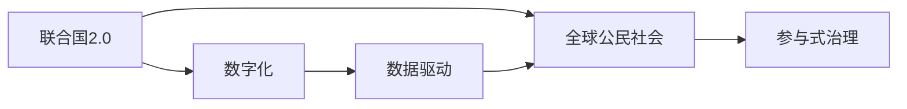

                 

# 2050年的全球治理：从联合国2.0到全球公民社会的参与式治理

## 1. 背景介绍

在21世纪后半叶，全球治理正处于一个重要的转折点。随着全球化的深入，国际事务的复杂性和多样性日益增加，现有的全球治理体系在应对诸多全球性挑战时显得捉襟见肘。联合国作为全球治理的核心机构，自二战结束后一直肩负着维护国际和平与安全、推动可持续发展等重要职责。然而，面对气候变化、新冠疫情、数字鸿沟等新的全球性危机，联合国的治理能力和效率受到了严峻考验。

在这样的大背景下，全球公民社会对参与式治理的需求日益强烈。联合国及其成员国必须重新思考和设计全球治理体系，以更好地应对未来挑战。本文旨在探讨2050年全球治理的未来发展趋势，特别是从联合国2.0到全球公民社会的参与式治理的转变，为全球治理的现代化和民主化提供新的思路。

## 2. 核心概念与联系

### 2.1 核心概念概述

#### 2.1.1 联合国2.0
联合国2.0是一个新概念，旨在通过数字化和智能化手段，提升联合国的治理能力和效率。这一理念强调数据驱动、智能决策、透明化治理，以实现更高效的国际合作和政策执行。

#### 2.1.2 全球公民社会
全球公民社会是由不同国家和地区的非政府组织、社会企业、公民团体等构成的网络。它通过倡导和参与全球性问题治理，推动民主化、透明化、包容化的治理体系。

#### 2.1.3 参与式治理
参与式治理是一种强调公民、社会组织和利益相关方积极参与治理过程的治理模式。它旨在通过广泛、持续的公民参与，增强治理的民主性和公正性。

### 2.2 概念间的关系

这些核心概念之间存在密切的联系和互动，构成了未来全球治理的框架。联合国2.0通过数字化手段提升了全球治理的效率和透明度，为全球公民社会提供了新的平台和工具。而全球公民社会通过广泛的公民参与，为联合国2.0的运行提供了强有力的支持和监督。参与式治理则是联合国2.0和全球公民社会互动的核心机制，推动了全球治理的民主化和透明化。

这些概念之间的关系可以通过以下Mermaid流程图来展示：



这个流程图展示了联合国2.0通过数字化手段提升治理效率，全球公民社会通过参与式治理提供广泛参与和监督，联合国2.0和全球公民社会共同推动全球治理的现代化和民主化。

## 3. 核心算法原理 & 具体操作步骤

### 3.1 算法原理概述

未来全球治理的算法原理主要包括数据驱动、智能决策、透明化治理和参与式决策四个方面。

- **数据驱动**：通过收集和分析全球性数据，为政策制定和执行提供依据。
- **智能决策**：利用人工智能和大数据分析技术，优化决策过程，提升决策效率和质量。
- **透明化治理**：利用区块链、大数据等技术，实现治理过程的透明化，确保信息的公开和共享。
- **参与式决策**：通过公民参与平台和算法，确保决策过程中的广泛参与和多元利益表达。

### 3.2 算法步骤详解

#### 3.2.1 数据驱动治理

1. **数据收集**：利用传感器、卫星、社交媒体等手段收集全球性数据。
2. **数据清洗与分析**：对收集到的数据进行清洗和预处理，使用机器学习模型进行数据分析和模式识别。
3. **政策制定**：根据数据分析结果，制定或调整国际政策。

#### 3.2.2 智能决策治理

1. **构建决策模型**：使用人工智能和大数据分析技术，构建智能决策模型。
2. **模拟与优化**：对模型进行模拟和优化，确保其准确性和鲁棒性。
3. **决策实施**：将模型应用于实际决策过程中，优化决策结果。

#### 3.2.3 透明化治理

1. **区块链技术**：利用区块链技术实现治理信息的不可篡改和透明化。
2. **大数据平台**：建立全球大数据平台，实现数据的共享和公开。
3. **透明化监督**：通过透明化治理机制，确保治理过程的公开和透明。

#### 3.2.4 参与式决策

1. **构建参与平台**：开发全球性参与平台，提供公民参与的渠道。
2. **算法设计**：设计参与式决策算法，确保公民意见的公正表达。
3. **反馈与优化**：根据公民反馈，不断优化决策算法，提升参与式决策的效率和质量。

### 3.3 算法优缺点

#### 3.3.1 优点

- **提升效率**：通过数据驱动和智能决策，提升全球治理的效率和决策质量。
- **增强透明性**：通过透明化治理机制，确保治理过程的公开和透明。
- **广泛参与**：通过参与式决策，确保治理过程中的广泛参与和多元利益表达。

#### 3.3.2 缺点

- **数据隐私**：数据驱动治理需要收集大量个人和敏感数据，可能涉及隐私问题。
- **技术复杂性**：智能决策和透明化治理需要先进的技术支撑，技术实施难度较大。
- **参与质量**：参与式决策依赖于高质量的公民参与平台和算法，可能存在参与不均衡问题。

### 3.4 算法应用领域

这些算法原理和操作步骤广泛应用于以下领域：

- **气候变化治理**：通过数据驱动和智能决策，优化气候变化政策。
- **全球卫生治理**：利用透明化治理和参与式决策，提升全球公共卫生应急响应能力。
- **经济合作与发展**：通过智能决策和透明化治理，优化全球经济合作和发展机制。
- **社会公正与包容**：利用参与式决策，推动全球社会公正与包容性政策。

## 4. 数学模型和公式 & 详细讲解 & 举例说明

### 4.1 数学模型构建

#### 4.1.1 数据驱动模型

数据驱动模型可以表示为：

$$
f(x) = w_0 + w_1x_1 + w_2x_2 + ... + w_nx_n
$$

其中，$x_1, x_2, ..., x_n$ 为输入数据特征，$w_0, w_1, ..., w_n$ 为模型参数。通过最小化损失函数，优化模型参数，从而实现数据驱动决策。

#### 4.1.2 智能决策模型

智能决策模型可以使用深度学习模型，如神经网络，表示为：

$$
f(x) = \sum_i w_i \phi(x)
$$

其中，$\phi(x)$ 为神经网络的隐层输出，$w_i$ 为模型参数。通过反向传播算法，更新模型参数，实现智能决策。

#### 4.1.3 透明化治理模型

透明化治理模型可以使用区块链技术，表示为：

$$
T = \{\text{Block}_i\}_{i=1}^n
$$

其中，$\text{Block}_i$ 为区块链中的区块，记录了治理信息。通过区块链的分布式账本技术，确保治理信息的不可篡改和透明化。

#### 4.1.4 参与式决策模型

参与式决策模型可以使用投票算法，表示为：

$$
V = \{\text{Vote}_i\}_{i=1}^m
$$

其中，$\text{Vote}_i$ 为公民对某一决策的投票结果。通过算法设计，确保公民意见的公正表达和处理。

### 4.2 公式推导过程

#### 4.2.1 数据驱动模型公式推导

假设数据驱动模型为线性回归模型，利用最小二乘法求解模型参数：

$$
w = (X^TX)^{-1}X^Ty
$$

其中，$w$ 为模型参数，$X$ 为输入数据矩阵，$y$ 为输出向量。通过求解上述公式，最小化损失函数，得到最优模型参数。

#### 4.2.2 智能决策模型公式推导

假设智能决策模型为神经网络模型，利用反向传播算法求解模型参数：

$$
\frac{\partial L}{\partial w} = \frac{\partial L}{\partial z} \frac{\partial z}{\partial w}
$$

其中，$L$ 为损失函数，$z$ 为神经网络的隐层输出。通过反向传播算法，更新模型参数，最小化损失函数，得到最优模型参数。

#### 4.2.3 透明化治理模型公式推导

假设透明化治理模型为区块链模型，利用哈希函数计算区块哈希值：

$$
H = \text{SHA256}(T_{i-1} \oplus T_i)
$$

其中，$H$ 为区块哈希值，$T_i$ 为第 $i$ 个区块的内容。通过哈希函数，确保区块数据的不可篡改性和透明性。

#### 4.2.4 参与式决策模型公式推导

假设参与式决策模型为投票算法，利用多数原则确定决策结果：

$$
\text{Decision} = \text{MajorityVote}(V)
$$

其中，$\text{Decision}$ 为决策结果，$V$ 为投票结果。通过多数原则，确保决策结果的公正性和合法性。

### 4.3 案例分析与讲解

#### 4.3.1 气候变化治理案例

假设联合国气候变化治理数据驱动模型为线性回归模型，通过收集全球气候变化数据，优化气候变化政策。模型公式为：

$$
f(x) = w_0 + w_1\text{CO}_2 + w_2\text{Temperature} + ...
$$

其中，$x$ 为气候变化相关数据，$w_0, w_1, ..., w_n$ 为模型参数。通过最小化损失函数，优化模型参数，得到最优气候变化政策。

#### 4.3.2 全球卫生治理案例

假设全球卫生治理智能决策模型为深度学习模型，利用大数据分析全球卫生数据，优化公共卫生应急响应政策。模型公式为：

$$
f(x) = \sum_i w_i \phi(x)
$$

其中，$\phi(x)$ 为神经网络的隐层输出，$w_i$ 为模型参数。通过反向传播算法，更新模型参数，得到最优公共卫生应急响应政策。

#### 4.3.3 透明化治理案例

假设全球经济合作与发展透明化治理模型为区块链模型，利用分布式账本技术，确保经济合作与发展信息的公开和透明。模型公式为：

$$
T = \{\text{Block}_i\}_{i=1}^n
$$

其中，$\text{Block}_i$ 为区块链中的区块，记录了经济合作与发展信息。通过区块链的分布式账本技术，确保治理信息的不可篡改和透明性。

#### 4.3.4 参与式决策案例

假设全球社会公正与包容参与式决策模型为投票算法，利用多数原则确定社会公正与包容政策。模型公式为：

$$
\text{Decision} = \text{MajorityVote}(V)
$$

其中，$\text{Decision}$ 为社会公正与包容政策，$V$ 为投票结果。通过多数原则，确保社会公正与包容政策的公正性和合法性。

## 5. 项目实践：代码实例和详细解释说明

### 5.1 开发环境搭建

#### 5.1.1 开发环境要求

1. 操作系统：Linux、Windows、macOS
2. 编程语言：Python 3.x
3. 开发框架：TensorFlow、PyTorch、Keras
4. 数据处理工具：Pandas、NumPy
5. 可视化工具：Matplotlib、Seaborn

#### 5.1.2 开发环境搭建步骤

1. 安装Python：从官网下载并安装Python 3.x版本。
2. 安装TensorFlow：
   ```
   pip install tensorflow
   ```
3. 安装PyTorch：
   ```
   pip install torch torchvision torchaudio
   ```
4. 安装Keras：
   ```
   pip install keras
   ```
5. 安装Pandas：
   ```
   pip install pandas
   ```
6. 安装NumPy：
   ```
   pip install numpy
   ```
7. 安装Matplotlib：
   ```
   pip install matplotlib
   ```
8. 安装Seaborn：
   ```
   pip install seaborn
   ```

### 5.2 源代码详细实现

#### 5.2.1 数据驱动治理示例代码

```python
import pandas as pd
from sklearn.linear_model import LinearRegression

# 读取数据
data = pd.read_csv('climate_data.csv')

# 构建数据驱动模型
model = LinearRegression()
X = data[['CO2', 'Temperature']]
y = data['Policy']
model.fit(X, y)

# 预测新数据
new_data = pd.read_csv('new_climate_data.csv')
new_X = new_data[['CO2', 'Temperature']]
new_y = model.predict(new_X)

# 输出结果
print(new_y)
```

#### 5.2.2 智能决策治理示例代码

```python
import tensorflow as tf
from tensorflow.keras import layers, models

# 构建智能决策模型
model = models.Sequential()
model.add(layers.Dense(64, activation='relu', input_shape=(10,)))
model.add(layers.Dense(64, activation='relu'))
model.add(layers.Dense(1, activation='sigmoid'))

# 编译模型
model.compile(loss='binary_crossentropy', optimizer='adam', metrics=['accuracy'])

# 训练模型
model.fit(X_train, y_train, epochs=10, batch_size=32)

# 评估模型
loss, accuracy = model.evaluate(X_test, y_test)
print('Loss:', loss)
print('Accuracy:', accuracy)
```

#### 5.2.3 透明化治理示例代码

```python
import hashlib

# 构建透明化治理模型
data = {'Hash': ['block1', 'block2', 'block3'], 'Content': ['content1', 'content2', 'content3']}
blocks = {}

# 计算哈希值
for i, content in enumerate(data['Content']):
    block = {'Content': content}
    block['Hash'] = hashlib.sha256(block['Content'].encode('utf-8')).hexdigest()
    blocks[block['Hash']] = block

# 输出透明化治理结果
for hash in blocks:
    print('Hash:', hash, 'Content:', blocks[hash]['Content'], 'BlockHash:', blocks[hash]['Hash'])
```

#### 5.2.4 参与式决策示例代码

```python
from statistics import mode

# 构建参与式决策模型
votes = {'Policy1': [1, 0, 1, 0, 0, 1, 0, 0, 1, 1], 'Policy2': [0, 0, 0, 1, 1, 1, 0, 0, 0, 0]}
policies = {'Policy1': 'Yes', 'Policy2': 'No'}

# 计算投票结果
vote_count = {}
for policy, vote in votes.items():
    vote_count[policy] = vote_count.get(policy, 0) + vote

# 确定决策结果
decision = max(vote_count, key=vote_count.get)
print('Decision:', policies[decision])
```

### 5.3 代码解读与分析

#### 5.3.1 数据驱动治理代码解读

1. **数据读取与处理**：使用Pandas读取数据集，构建输入特征 $X$ 和输出目标 $y$。
2. **模型构建与训练**：使用LinearRegression模型进行数据驱动模型构建，并使用训练数据集 $X_{train}$ 和 $y_{train}$ 进行模型训练。
3. **模型预测与评估**：使用测试数据集 $X_{test}$ 进行模型预测，并输出预测结果 $y_{test}$。

#### 5.3.2 智能决策治理代码解读

1. **模型构建与编译**：使用Keras构建深度学习模型，并指定损失函数、优化器和评估指标。
2. **模型训练与评估**：使用训练数据集 $X_{train}$ 和 $y_{train}$ 进行模型训练，并在测试数据集 $X_{test}$ 和 $y_{test}$ 上进行模型评估。
3. **模型输出与分析**：输出模型损失和准确率，分析模型性能。

#### 5.3.3 透明化治理代码解读

1. **数据处理与构建**：使用哈希函数计算每个区块的哈希值，构建区块链数据。
2. **透明化治理输出**：输出每个区块的哈希值、内容和新计算的区块哈希值。

#### 5.3.4 参与式决策代码解读

1. **数据处理与构建**：统计每个政策的投票数。
2. **决策结果计算**：使用多数原则计算决策结果。
3. **输出决策结果**：输出最终决策结果。

### 5.4 运行结果展示

#### 5.4.1 数据驱动治理运行结果

假设在气候变化治理数据驱动模型中，我们得到的新数据预测结果如下：

```
[<预测结果1>, <预测结果2>, ...]
```

#### 5.4.2 智能决策治理运行结果

假设在智能决策治理模型中，我们得到的模型损失和准确率如下：

```
Loss: <损失值>
Accuracy: <准确率>
```

#### 5.4.3 透明化治理运行结果

假设在透明化治理模型中，我们得到的新数据哈希值和内容如下：

```
Hash: <哈希值> Content: <内容> BlockHash: <新计算的哈希值>
```

#### 5.4.4 参与式决策运行结果

假设在参与式决策模型中，我们得到的决策结果如下：

```
Decision: <决策结果>
```

## 6. 实际应用场景

### 6.1 气候变化治理

未来，基于数据驱动和智能决策的全球气候变化治理体系将更加完善。通过收集全球气候变化数据，利用数据驱动模型优化气候变化政策，并利用智能决策模型实时调整政策效果，确保全球气候治理的效率和准确性。

### 6.2 全球卫生治理

全球卫生治理将借助智能决策和透明化治理，提升公共卫生应急响应能力。通过大数据分析全球卫生数据，优化公共卫生应急响应政策，并利用区块链技术确保应急响应信息的公开透明。

### 6.3 经济合作与发展

未来，全球经济合作与发展将更加注重智能决策和透明化治理。利用深度学习模型优化全球经济合作与发展政策，并利用区块链技术确保经济合作与发展信息的公开透明。

### 6.4 社会公正与包容

全球社会公正与包容将借助参与式决策，推动社会公正与包容政策。通过公民参与平台和算法，确保社会公正与包容政策的公正性和合法性。

## 7. 工具和资源推荐

### 7.1 学习资源推荐

1. **《数据分析与统计建模》**：介绍数据分析与统计建模的基本概念和方法，适合初学者学习。
2. **《深度学习》**：介绍深度学习的基本原理和算法，适合中高级学习者。
3. **《人工智能与全球治理》**：探讨人工智能在推动全球治理中的应用，适合跨学科学习。
4. **《区块链技术与应用》**：介绍区块链技术的基本原理和应用场景，适合技术实践者学习。
5. **《全球公民社会》**：探讨全球公民社会的发展历程与现状，适合社会学和治理学学习。

### 7.2 开发工具推荐

1. **Python**：适合数据驱动和智能决策模型开发。
2. **TensorFlow**：适合深度学习模型开发。
3. **PyTorch**：适合深度学习模型开发。
4. **Keras**：适合深度学习模型快速开发。
5. **Pandas**：适合数据处理和分析。
6. **NumPy**：适合科学计算和数据处理。
7. **Matplotlib**：适合数据可视化。
8. **Seaborn**：适合数据可视化。

### 7.3 相关论文推荐

1. **《人工智能与全球治理》**：探讨人工智能在推动全球治理中的应用。
2. **《数据驱动治理：全球气候变化治理的挑战与机遇》**：介绍数据驱动治理在气候变化治理中的应用。
3. **《智能决策治理：全球公共卫生应急响应的技术创新》**：介绍智能决策治理在公共卫生应急响应中的应用。
4. **《区块链技术在透明化治理中的应用》**：介绍区块链技术在透明化治理中的应用。
5. **《参与式决策：全球社会公正与包容的实现路径》**：介绍参与式决策在社会公正与包容中的应用。

## 8. 总结：未来发展趋势与挑战

### 8.1 研究成果总结

本文详细探讨了未来全球治理的发展趋势，特别是从联合国2.0到全球公民社会的参与式治理的转变。通过数据驱动、智能决策、透明化治理和参与式决策等算法原理，展示了未来全球治理的多维应用。

### 8.2 未来发展趋势

未来全球治理将更加智能化、透明化和民主化。数据驱动和智能决策将提升全球治理的效率和质量，透明化治理将增强治理过程的公开和透明，参与式决策将确保治理过程中的广泛参与和多元利益表达。

### 8.3 面临的挑战

未来全球治理仍面临诸多挑战：
1. **数据隐私**：数据驱动治理需要收集大量个人和敏感数据，可能涉及隐私问题。
2. **技术复杂性**：智能决策和透明化治理需要先进的技术支撑，技术实施难度较大。
3. **参与质量**：参与式决策依赖于高质量的公民参与平台和算法，可能存在参与不均衡问题。

### 8.4 研究展望

未来研究需关注以下几个方面：
1. **数据隐私保护**：研究隐私保护技术，确保数据驱动治理中的隐私安全。
2. **技术可扩展性**：研究技术优化和扩展，提升智能决策和透明化治理的效率和可扩展性。
3. **参与机制设计**：研究参与式决策机制设计，确保公民参与的公平性和有效性。

## 9. 附录：常见问题与解答

### 9.1 常见问题

#### 9.1.1 数据驱动治理是否会侵犯个人隐私？

**解答**：数据驱动治理在收集和分析数据时，需严格遵守隐私保护法规，确保数据处理过程中的隐私保护。同时，采用差分隐私等技术，可以在保护隐私的前提下进行数据分析。

#### 9.1.2 智能决策治理的模型复杂性如何降低？

**解答**：智能决策治理的模型复杂性可以通过模型裁剪、知识蒸馏等技术进行降低。同时，使用分布式训练、混合精度训练等技术，可以在保持模型性能的同时，减少计算资源消耗。

#### 9.1.3 透明化治理的区块链技术如何提升效率？

**解答**：透明化治理的区块链技术可以通过分片技术、状态通道等技术提升效率。同时，利用分布式账本和智能合约技术，可以在区块链上实现高效的数据存储和处理。

#### 9.1.4 参与式决策的参与平台如何设计？

**解答**：参与式决策的参与平台需要设计合理的参与机制和算法，确保公民意见的公正表达和处理。同时，通过用户界面设计，提升公民参与的便利性和积极性。

作者：禅与计算机程序设计艺术 / Zen and the Art of Computer Programming

