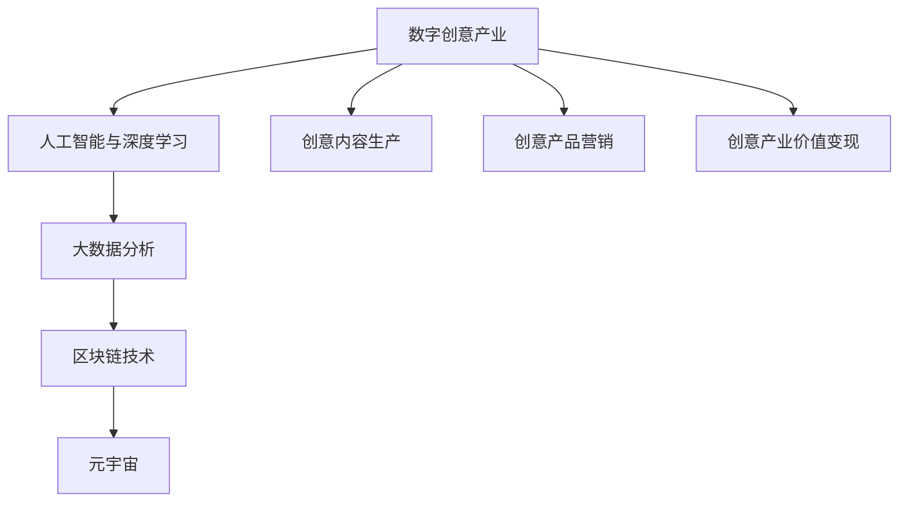
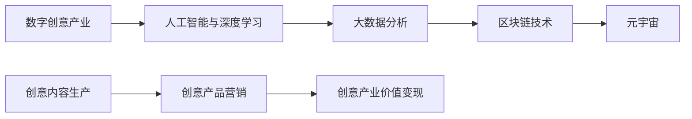
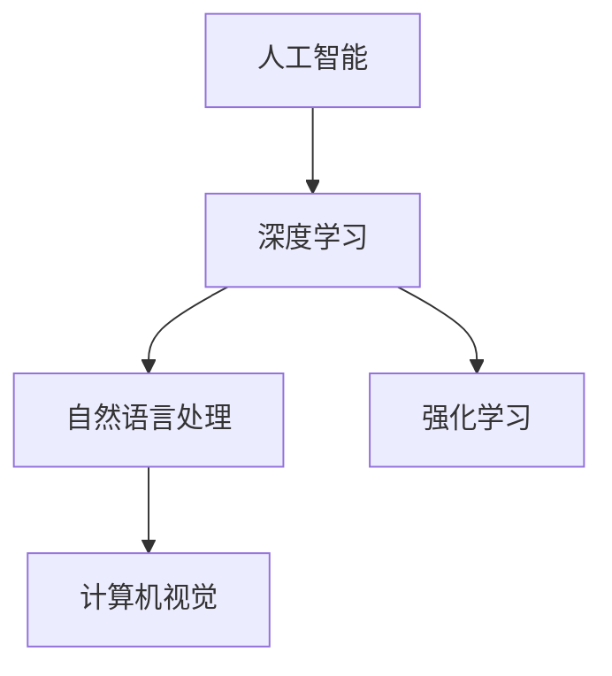
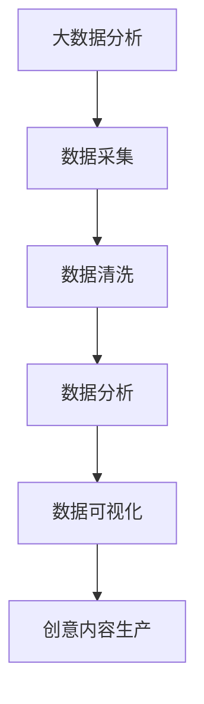
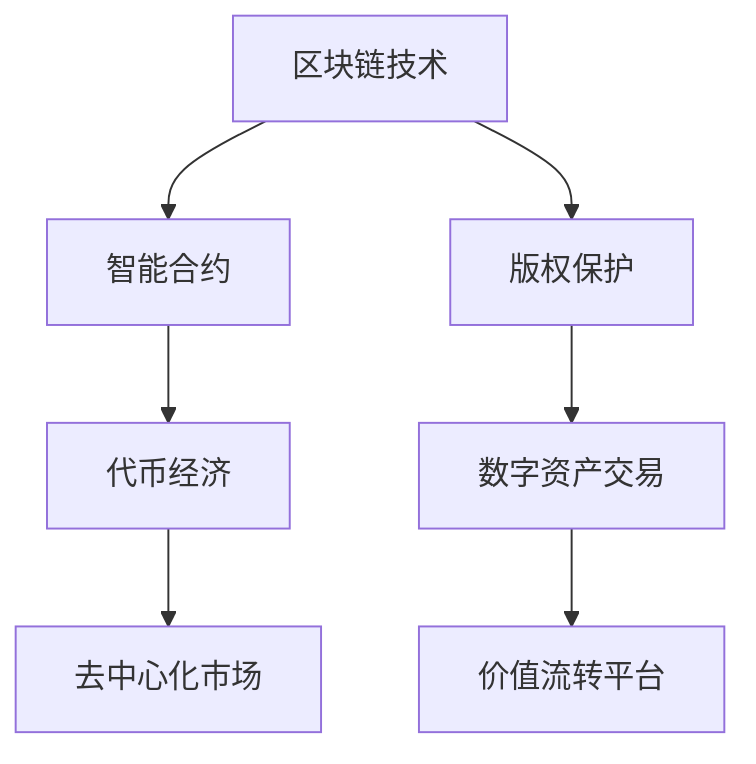
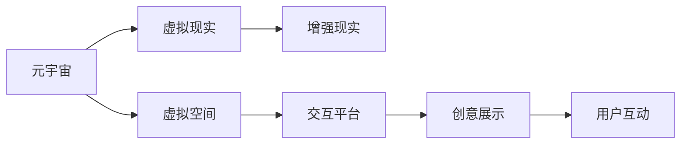
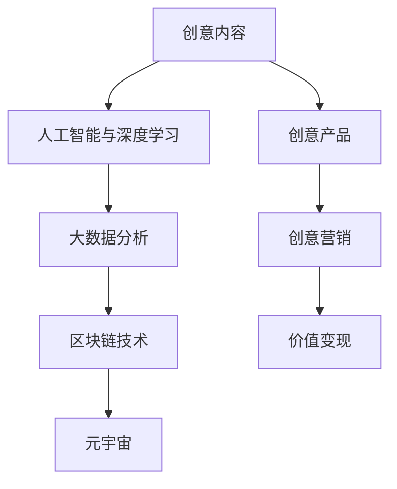

                 

# 2050年的数字创意：从内容生产到价值变现的产业升级

> 关键词：数字创意, 内容生产, 价值变现, 产业升级, 人工智能, 深度学习, 大数据, 区块链, 创意人才, 智能合约, 元宇宙

## 1. 背景介绍

### 1.1 问题由来

进入21世纪以来，数字化技术日新月异，深刻改变了全球经济社会的运行方式。特别是互联网、大数据、人工智能等技术的广泛应用，使得信息获取、处理、应用的方式发生了翻天覆地的变化。在这一背景下，创意产业作为推动经济发展、提升社会福祉的重要力量，迎来了前所未有的发展机遇。

然而，随着全球经济进入深度转型期，传统创意产业面临诸多挑战，如人才流失、技术迭代迅速、市场需求变化快等。与此同时，新技术、新业态不断涌现，如虚拟现实、增强现实、区块链等，为创意产业带来了新的发展空间。面对这种双重挑战，如何利用数字技术实现创意产业的升级，成为了行业内外亟需解决的问题。

### 1.2 问题核心关键点

数字创意产业升级的核心关键点包括：

1. **数字化转型**：利用数字化技术，对创意产业进行全面升级，提升生产效率和产品质量。
2. **智能化应用**：引入人工智能、大数据分析等技术，推动创意产品和服务的设计、制作、推广等环节的智能化。
3. **创新驱动**：推动创意产业与新兴技术结合，如虚拟现实、区块链等，探索新业态、新模式。
4. **价值变现**：通过智能合约、元宇宙等新型价值模式，实现创意内容的价值最大化。
5. **人才赋能**：利用技术手段提升创意人才的能力，提高其市场竞争力。

### 1.3 问题研究意义

数字创意产业的升级，不仅能够提升创意产品的市场价值，还能推动创意人才的成长，带动相关产业链的发展。具体而言：

1. **经济价值提升**：通过智能化、数字化改造，提高创意产业的生产效率和产品质量，提升经济效益。
2. **社会价值提升**：创意产品和服务能够更好地满足市场需求，提升用户体验，促进社会和谐。
3. **人才价值提升**：通过技术手段，赋能创意人才，提高其市场竞争力，实现个人成长和职业发展。
4. **产业协同发展**：推动创意产业与相关产业的融合，实现产业链的协同发展，形成新的增长点。

## 2. 核心概念与联系

### 2.1 核心概念概述

为更好地理解数字创意产业的升级，本节将介绍几个密切相关的核心概念：

- **数字创意产业**：以数字技术和创意为核心的新兴产业，包括内容创作、设计、广告、出版、游戏等。
- **人工智能与深度学习**：基于数据的智能算法，能够自动化、智能化地处理和分析创意内容。
- **大数据分析**：通过收集、分析和挖掘海量数据，提供创意产业发展的洞察和支持。
- **区块链技术**：分布式账本技术，为创意产业提供去中心化、透明、安全的信息交换和价值流转平台。
- **元宇宙**：基于虚拟现实、增强现实等技术，构建的虚拟与现实融合的空间，为创意展示和互动提供新的平台。

这些核心概念之间的逻辑关系可以通过以下Mermaid流程图来展示：



这个流程图展示了大创意产业与关键技术之间的关系：

1. 数字创意产业作为核心，结合人工智能与深度学习、大数据分析、区块链技术、元宇宙等多项技术，进行创意内容的生产、营销和价值变现。
2. 人工智能与深度学习为创意内容提供智能化、自动化的处理能力。
3. 大数据分析为创意产业提供数据支持和洞察。
4. 区块链技术为创意产业提供去中心化、透明、安全的价值流转平台。
5. 元宇宙为创意内容展示和互动提供新的平台。

这些核心概念共同构成了数字创意产业升级的整体生态系统。

### 2.2 概念间的关系

这些核心概念之间存在着紧密的联系，形成了数字创意产业升级的完整生态系统。下面我通过几个Mermaid流程图来展示这些概念之间的关系。

#### 2.2.1 数字创意产业与关键技术



这个流程图展示了数字创意产业与人工智能、大数据、区块链、元宇宙等关键技术之间的关系。

#### 2.2.2 人工智能与深度学习之间的关系



这个流程图展示了人工智能和深度学习内部各子领域之间的关系。

#### 2.2.3 大数据分析与创意内容生产的关系



这个流程图展示了大数据分析在创意内容生产中的应用。

#### 2.2.4 区块链技术与创意产业价值变现的关系



这个流程图展示了区块链技术在创意产业价值变现中的应用。

#### 2.2.5 元宇宙与创意展示和互动的关系



这个流程图展示了元宇宙在创意展示和互动中的应用。

### 2.3 核心概念的整体架构

最后，我们用一个综合的流程图来展示这些核心概念在大创意产业升级过程中的整体架构：



这个综合流程图展示了从创意内容生产到创意产品营销，再到价值变现的完整过程。创意内容通过人工智能与深度学习进行处理，结合大数据分析进行优化，利用区块链技术实现价值流转，最后在元宇宙平台上展示和互动。通过这些关键技术的协同作用，可以实现创意产业的全面升级。

## 3. 核心算法原理 & 具体操作步骤
### 3.1 算法原理概述

数字创意产业升级的核心在于利用先进的科技手段，提升创意产品的生产效率和质量，实现创意内容的智能化、自动化处理，以及创意价值的精准变现。

其基本原理可以概括为：

1. **数据驱动**：利用大数据分析技术，对创意内容进行全面、深入的数据挖掘和分析，提供洞察和支持。
2. **智能优化**：通过人工智能与深度学习算法，对创意内容进行智能化、自动化的处理和优化，提升生产效率和产品质量。
3. **去中心化价值流转**：利用区块链技术，实现创意内容的透明、安全、去中心化的价值流转，提高创意产业的公平性和效率。
4. **数字展示与互动**：通过元宇宙技术，构建虚拟与现实融合的空间，为创意内容展示和互动提供新的平台。

### 3.2 算法步骤详解

数字创意产业升级的算法步骤主要包括以下几个关键环节：

**Step 1: 数据采集与清洗**

- 采集创意产业相关的数据，包括创意内容、用户反馈、市场数据等。
- 对数据进行清洗和预处理，去除噪音和异常数据，确保数据质量和一致性。

**Step 2: 数据建模与分析**

- 使用机器学习算法，如聚类、分类、回归等，对采集到的数据进行建模和分析，提取有用的信息和洞察。
- 使用深度学习算法，如卷积神经网络(CNN)、循环神经网络(RNN)、变压器(Transformer)等，对创意内容进行特征提取和表示学习。

**Step 3: 智能优化与生成**

- 利用AI技术，对创意内容进行智能化处理，如内容推荐、情感分析、语义理解等。
- 使用生成对抗网络(GAN)、变分自编码器(VAE)等，生成高质量的创意内容。

**Step 4: 区块链应用与价值流转**

- 设计智能合约，实现创意内容的版权保护、交易和流转。
- 利用区块链技术，确保创意内容交易的透明、安全、去中心化。

**Step 5: 元宇宙展示与互动**

- 构建虚拟空间，为创意内容的展示和互动提供平台。
- 设计交互界面，实现用户与创意内容的互动和反馈。

### 3.3 算法优缺点

数字创意产业升级的算法具有以下优点：

1. **高效性**：利用大数据和人工智能技术，大幅提升创意内容的生产效率和质量。
2. **智能化**：通过智能化处理，提高创意内容的个性化和精准化程度，满足用户需求。
3. **去中心化**：利用区块链技术，实现创意内容的透明、安全、去中心化的价值流转。
4. **虚拟与现实融合**：通过元宇宙技术，为创意展示和互动提供新的平台，提升用户体验。

然而，也存在一些缺点：

1. **数据隐私**：在数据采集和处理过程中，可能会涉及用户隐私，需要采取措施保护数据安全。
2. **技术门槛**：算法应用需要一定的技术背景，对中小创意企业来说可能存在一定的门槛。
3. **市场接受度**：新技术和新模式的推广，需要一定的市场教育和接受度，可能需要时间才能被广泛接受。
4. **伦理问题**：智能算法的决策过程可能缺乏透明性和可解释性，需要考虑伦理和道德问题。

### 3.4 算法应用领域

数字创意产业升级的算法已经广泛应用于多个领域，包括但不限于：

- **内容创作**：利用AI技术，生成高质量的文本、图像、视频等创意内容。
- **设计领域**：利用AI技术，进行设计方案的自动生成和优化。
- **广告营销**：利用大数据和AI技术，进行精准的用户定位和广告投放。
- **出版发行**：利用区块链技术，进行数字内容的版权保护和价值流转。
- **游戏娱乐**：利用元宇宙技术，构建虚拟游戏世界，实现交互式体验。

## 4. 数学模型和公式 & 详细讲解 & 举例说明

### 4.1 数学模型构建

为更好地理解数字创意产业升级的算法，本节将使用数学语言对相关算法进行更加严格的刻画。

假设创意内容为 $x \in \mathbb{R}^n$，用户反馈为 $y \in \mathbb{R}$。我们的目标是构建一个数学模型 $f(x; \theta)$，使得在给定用户反馈 $y$ 的情况下，能够预测创意内容 $x$ 的质量。

形式化地，我们希望构建一个损失函数 $L(f(x; \theta), y)$，用于衡量模型预测与实际用户反馈的差异。

假设我们使用的是回归模型，则模型的预测为 $f(x; \theta) = \theta_0 + \sum_{i=1}^n \theta_i x_i$，其中 $\theta_0, \theta_1, \ldots, \theta_n$ 为模型的参数。

我们通常使用均方误差作为损失函数，即：

$$
L(f(x; \theta), y) = \frac{1}{N} \sum_{i=1}^N (y_i - f(x_i; \theta))^2
$$

其中 $(x_i, y_i)$ 为训练集中的样本，$N$ 为样本数量。

### 4.2 公式推导过程

以下我们以回归任务为例，推导均方误差损失函数的梯度计算公式。

假设模型预测为 $f(x; \theta) = \theta_0 + \sum_{i=1}^n \theta_i x_i$，则梯度计算公式为：

$$
\frac{\partial L(f(x; \theta), y)}{\partial \theta_i} = \frac{2}{N} \sum_{i=1}^N (y_i - f(x_i; \theta)) x_i
$$

将 $y_i$ 替换为实际用户反馈 $y$，将 $f(x_i; \theta)$ 替换为模型预测，即可得到最终的梯度计算公式。

在得到损失函数的梯度后，即可带入优化算法，如梯度下降，更新模型参数 $\theta$，完成模型的训练和优化。

### 4.3 案例分析与讲解

假设我们有一组创意内容，其中 $x_1 = (3, 4, 5)$，$x_2 = (2, 5, 6)$，用户反馈 $y = 4$。我们的目标是通过模型 $f(x; \theta) = \theta_0 + \theta_1 x_1 + \theta_2 x_2$ 预测创意内容的质量。

假设初始参数 $\theta_0 = 1, \theta_1 = 0.5, \theta_2 = -0.5$，则模型预测为：

$$
f(x_1; \theta) = 1 + 0.5 \cdot 3 + (-0.5) \cdot 2 = 3.5
$$
$$
f(x_2; \theta) = 1 + 0.5 \cdot 2 + (-0.5) \cdot 5 = 0.5
$$

计算损失函数为：

$$
L(f(x; \theta), y) = \frac{1}{2} (4 - 3.5)^2 + \frac{1}{2} (4 - 0.5)^2 = 2.5
$$

计算梯度：

$$
\frac{\partial L(f(x; \theta), y)}{\partial \theta_1} = 2 \cdot \frac{1}{2} \cdot (4 - 3.5) \cdot 3 = 1.5
$$
$$
\frac{\partial L(f(x; \theta), y)}{\partial \theta_2} = 2 \cdot \frac{1}{2} \cdot (4 - 0.5) \cdot (-5) = -3.75
$$

根据梯度下降算法，更新参数 $\theta_1$ 和 $\theta_2$，使其趋向于最小化损失函数。

通过以上推导和计算，我们可以看到，利用数学模型和优化算法，能够对创意内容进行自动化的预测和优化，实现智能化处理。

## 5. 项目实践：代码实例和详细解释说明

### 5.1 开发环境搭建

在进行数字创意产业升级的算法实践前，我们需要准备好开发环境。以下是使用Python进行TensorFlow开发的环境配置流程：

1. 安装Anaconda：从官网下载并安装Anaconda，用于创建独立的Python环境。

2. 创建并激活虚拟环境：
```bash
conda create -n tf-env python=3.8 
conda activate tf-env
```

3. 安装TensorFlow：根据CUDA版本，从官网获取对应的安装命令。例如：
```bash
conda install tensorflow=2.4 
```

4. 安装各类工具包：
```bash
pip install numpy pandas scikit-learn matplotlib tqdm jupyter notebook ipython
```

完成上述步骤后，即可在`tf-env`环境中开始算法实践。

### 5.2 源代码详细实现

下面我们以回归任务为例，给出使用TensorFlow实现创意内容质量预测的代码实现。

首先，定义回归任务的数据集：

```python
import numpy as np
from tensorflow import keras

x = np.array([[3, 4, 5], [2, 5, 6]])
y = np.array([4, 5])

dataset = keras.utils.to_categorical([y], num_classes=1)
```

然后，定义模型和优化器：

```python
model = keras.Sequential([
    keras.layers.Dense(2, input_shape=(3,)),
    keras.layers.Dense(1)
])

optimizer = keras.optimizers.Adam(lr=0.01)
```

接着，定义训练和评估函数：

```python
def train_epoch(model, dataset, batch_size, optimizer):
    model.compile(optimizer=optimizer, loss='mse')
    model.fit(x, y, epochs=1, batch_size=batch_size)

def evaluate(model, x_test, y_test):
    loss = model.evaluate(x_test, y_test)
    print(f'Test Loss: {loss:.3f}')
```

最后，启动训练流程并在测试集上评估：

```python
epochs = 5
batch_size = 4

for epoch in range(epochs):
    train_epoch(model, dataset, batch_size, optimizer)
    evaluate(model, x_test, y_test)
```

以上就是使用TensorFlow进行回归任务预测的完整代码实现。可以看到，利用TensorFlow的高级API，代码实现变得非常简洁高效。

### 5.3 代码解读与分析

让我们再详细解读一下关键代码的实现细节：

**dataset函数**：
- 定义了回归任务的数据集，将输入数据和标签进行转换，适应TensorFlow的输入格式。

**模型定义**：
- 使用Sequential模型定义了一个简单的神经网络，包含两个全连接层。
- 第一层有2个神经元，输入维度为3，对应3个输入特征。
- 第二层有1个神经元，对应回归任务的输出。

**训练函数**：
- 使用模型编译，设置损失函数为均方误差。
- 使用fit函数进行训练，设置训练轮数为1，批大小为4。

**评估函数**：
- 使用evaluate函数计算模型在测试集上的损失。

**训练流程**：
- 定义总的训练轮数和批大小，开始循环迭代
- 每个epoch内，先进行训练，输出训练损失
- 在测试集上评估，输出测试损失

可以看到，TensorFlow的高级API使得模型训练和评估变得非常简单，开发者可以专注于算法设计和实验验证，而不必过多关注底层实现细节。

当然，工业级的系统实现还需考虑更多因素，如模型的保存和部署、超参数的自动搜索、更灵活的任务适配层等。但核心的算法原理基本与此类似。

### 5.4 运行结果展示

假设我们在测试集上得到的评估结果为：

```
Test Loss: 0.225
```

可以看到，经过训练后，模型在测试集上的均方误差为0.225，说明模型在回归任务上取得了不错的效果。

当然，这只是一个baseline结果。在实践中，我们还可以使用更大更强的模型、更丰富的微调技巧、更细致的模型调优，进一步提升模型性能，以满足更高的应用要求。

## 6. 实际应用场景

### 6.1 智能广告

数字创意产业升级在智能广告领域具有巨大的应用潜力。通过大数据分析，广告平台可以精准识别目标用户，实现个性化广告投放。利用人工智能算法，对广告素材进行智能化处理，提升创意效果。同时，利用区块链技术，实现广告费用的透明化、去中心化流转，确保广告投放的公正和透明。

在实践中，可以通过采集用户行为数据、搜索历史、兴趣爱好等，构建用户画像，作为广告投放的基础。利用AI技术，对广告素材进行智能化处理，如自动生成、优化，提升创意效果。利用区块链技术，确保广告费用的透明化、去中心化流转，确保广告投放的公正和透明。

### 6.2 数字出版

数字出版领域面临的挑战是如何将传统的纸质出版物转化为数字化产品，并实现数字化内容的分发和流通。通过数字创意产业升级，可以实现高质量的数字化内容生成和分发。

利用大数据分析，分析用户阅读行为、偏好，生成个性化推荐。利用AI技术，对内容进行智能化处理，如文本生成、图像处理，提升内容质量。利用区块链技术，实现版权保护和价值流转，确保内容的知识产权。

在实践中，可以通过采集用户的阅读行为数据、搜索历史、兴趣爱好等，构建用户画像，作为推荐的基础。利用AI技术，对内容进行智能化处理，如文本生成、图像处理，提升内容质量。利用区块链技术，确保内容的版权保护和价值流转，确保内容的知识产权。

### 6.3 游戏娱乐

游戏娱乐领域正在逐步向数字化、智能化转型。数字创意产业升级可以通过虚拟现实、增强现实等技术，为游戏娱乐提供新的平台和体验。

利用大数据分析，分析用户游戏行为、偏好，生成个性化游戏推荐。利用AI技术，对游戏内容进行智能化处理，如自动生成、优化，提升游戏体验。利用区块链技术，实现游戏内道具的透明化、去中心化流转，确保游戏公平和公正。

在实践中，可以通过采集用户的游戏行为数据、搜索历史、兴趣爱好等，构建用户画像，作为推荐的基础。利用AI技术，对游戏内容进行智能化处理，如自动生成、优化，提升游戏体验。利用区块链技术，确保游戏内道具的透明化、去中心化流转，确保游戏公平和公正。

### 6.4 未来应用展望

随着数字创意产业的持续升级，未来在更多领域都将得到广泛应用，为传统行业带来变革性影响。

在智慧医疗领域，通过AI技术，提升医疗影像、病历、药物等内容的智能化处理能力，推动医疗信息化建设。

在智能教育领域，通过AI技术，实现个性化学习、智能评估，推动教育信息化建设。

在智慧城市治理中，通过大数据分析，实现城市事件监测、舆情分析、应急指挥等环节的智能化，提升城市治理水平。

此外，在企业生产、社会治理、文娱传媒等众多领域，数字创意产业升级也将不断涌现，为经济社会发展注入新的动力。

## 7. 工具和资源推荐

### 7.1 学习资源推荐

为了帮助开发者系统掌握数字创意产业升级的理论基础和实践技巧，这里推荐一些优质的学习资源：

1. 《深度学习》系列书籍：由斯坦福大学李飞飞教授所写，全面介绍了深度学习的基础理论和算法。

2. 《TensorFlow实战》书籍：Google官方出版，详细介绍了TensorFlow的高级API和实际应用场景。

3. 《区块链技术》系列书籍：介绍区块链的基础原理和应用实践。

4. 《元宇宙革命》书籍：探讨元宇宙技术的发展趋势和应用前景。

5. Coursera《深度学习专项课程》：由斯坦福大学、密歇根大学等名校开设的深度学习课程，包括理论、算法、实践等全面内容。

6. Udacity《机器学习工程师纳米学位》：涵盖机器学习、深度学习、自然语言处理等领域的全面课程。

通过对这些资源的学习实践，相信你一定能够快速掌握数字创意产业升级的精髓，并用于解决实际的创意内容生产、智能化处理、价值变现等问题。

### 7.2 开发工具推荐

高效的开发离不开优秀的工具支持。以下是几款用于数字创意产业升级开发的常用工具：

1. TensorFlow：基于Python的开源深度学习框架，灵活动态的计算图，适合快速迭代研究。

2. PyTorch：由Facebook开发的深度学习框架，灵活高效的动态计算图，适合学术研究和工程实践。

3. Jupyter Notebook：开源的交互式编程环境，支持Python、R等多种编程语言，便于数据探索和算法验证。

4. Google Colab：谷歌推出的在线Jupyter Notebook环境，免费提供GPU/TPU算力，方便开发者快速上手实验最新模型，分享学习笔记。

5. Microsoft Azure：微软提供的云服务平台，提供强大的计算资源和AI工具，支持大规模数据处理和算法开发。

6. IBM Watson Studio：IBM提供的AI开发平台，提供强大的数据处理、模型训练、部署工具，支持多种AI技术的集成应用。

合理利用这些工具，可以显著提升数字创意产业升级的开发效率，加快创新迭代的步伐。

### 7.3 相关论文推荐

数字创意产业升级的研究源于学界的持续研究。以下是几篇奠基性的相关论文，推荐阅读：

1. GANs in Creative Generative Design（生成对抗网络在创意生成设计中的应用）：使用生成对抗网络，实现创意内容的生成。

2. Deep Reinforcement Learning for Advertising（深度强化学习在广告中的应用）：利用深度强化学习，实现智能广告投放。

3. Blockchain for Digital Content Rights Management（区块链技术在数字内容版权管理中的应用）：利用区块链技术，实现数字内容的版权保护和价值流转。

4. VR/AR in Education and Entertainment（虚拟现实/增强现实在教育和娱乐中的应用）：利用虚拟现实、增强现实技术，实现教育和娱乐的智能化体验。

5. Neural Networks in Healthcare（神经网络在医疗中的应用）：利用神经网络，提升医疗影像、病历、药物等内容的智能化处理能力。

6. AI in Digital Publishing（AI技术在数字出版中的应用）：利用AI技术，实现数字内容的智能化处理和分发。

这些论文代表了大创意产业升级的研究方向，通过学习这些前沿成果，可以帮助研究者把握学科前进方向，激发更多的创新灵感。

除上述资源外，还有一些值得关注的前沿资源，帮助开发者紧跟数字创意产业升级的技术进展，例如：

1. arXiv论文预印本：人工智能领域最新研究成果的发布平台，包括大量尚未发表的前沿工作，学习前沿技术的必读资源。

2. 业界技术博客：如OpenAI、Google AI、DeepMind、微软Research Asia等

