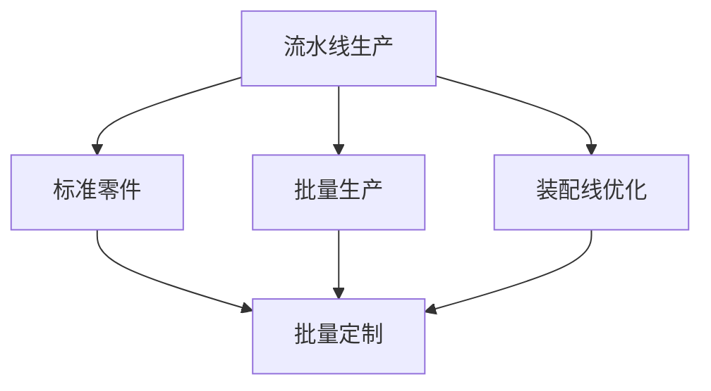
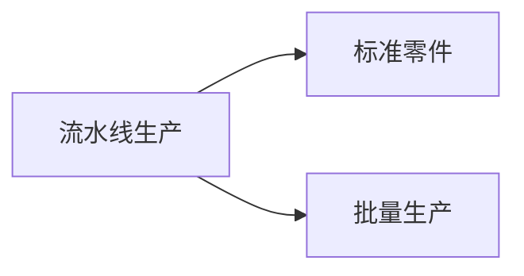
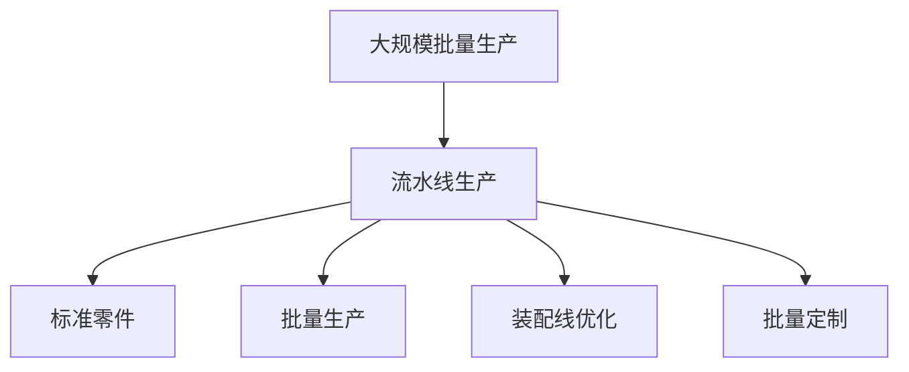

                 

# 1913年福特年产轿车的飞跃

> 关键词：工业化、流水线生产、汽车制造、规模经济、批量定制

## 1. 背景介绍

### 1.1 问题由来
在19世纪末20世纪初，汽车制造行业还处于手工作坊式生产阶段，生产效率低下，产品质量难以保证，价格昂贵。尽管汽车的概念已存在，但只有少数富人能够负担得起。亨利·福特（Henry Ford）的出现，彻底改变了这一现状。

福特通过引入流水线生产，大大提高了生产效率，使得大规模生产汽车成为可能，最终使汽车成为普通大众能够负担得起的交通工具。福特的创新不仅彻底改变了汽车制造业的面貌，更引领了整个工业社会的转型。

### 1.2 问题核心关键点
福特革命的核心关键点在于：
1. 流水线生产方式：通过将生产过程分解为多个独立环节，使得工人可以在流水线上逐个完成某一环节的任务，极大地提高了生产效率。
2. 标准化零件：生产出易于组装的标准化零件，减少了生产过程中的复杂性和错误率。
3. 大批量生产：通过大规模批量生产，将固定成本分摊到更多的产品中，实现了成本的显著下降。
4. 装配线优化：对装配线进行优化，使生产过程更为流畅，减少停机时间。
5. 价格优势：通过规模经济和标准化生产，福特能够以更低的价格出售汽车，使得汽车从奢侈品变为大众消费品。

这些关键点共同构成了福特汽车制造的精髓，使其能够成为工业时代的标志。

### 1.3 问题研究意义
福特年产轿车的飞跃，不仅仅是一场工业生产方式的革命，更是对人类社会生产方式、经济模式乃至生活方式的深刻影响。其研究意义主要体现在以下几个方面：

1. 提高了生产效率：流水线生产方式极大地提高了生产效率，使得大规模批量生产成为可能。
2. 降低了生产成本：通过标准化零件和批量生产，福特能够以更低的价格生产汽车，使汽车成为大众消费品。
3. 推动了工业化进程：福特的创新推动了整个工业社会的转型，促进了生产力的飞跃。
4. 开创了批量定制先河：福特通过流水线生产实现了批量定制，满足了不同客户的需求，改变了市场供需关系。
5. 促进了经济增长：汽车制造业的兴起带动了相关产业的发展，促进了经济增长。

## 2. 核心概念与联系

### 2.1 核心概念概述

为了更好地理解福特的流水线生产方式，本节将介绍几个密切相关的核心概念：

- 流水线生产(Assembly Line)：一种大规模批量生产的方式，通过将生产过程分解为多个独立环节，使工人可以在流水线上逐个完成某一环节的任务。
- 标准零件(Standard Parts)：为了便于生产、装配和维修，将汽车零件设计成通用的标准尺寸和形状，使得不同车型之间的零件可以互换。
- 批量生产(Mass Production)：通过大规模批量生产，将固定成本分摊到更多的产品中，实现成本的显著下降。
- 装配线优化(Line Balancing)：对装配线进行优化，使生产过程更为流畅，减少停机时间和生产成本。
- 批量定制(Mass Customization)：通过流水线生产，实现了批量定制，能够根据客户需求快速生产个性化产品。

这些核心概念之间的逻辑关系可以通过以下Mermaid流程图来展示：



这个流程图展示了大规模批量生产（Assembly Line）的几个关键环节：
1. 流水线生产：将生产过程分解为多个独立环节。
2. 标准零件：使得零件可以互换，提高生产效率。
3. 批量生产：通过大规模批量生产降低成本。
4. 装配线优化：优化装配线，提高生产效率。
5. 批量定制：通过流水线生产，实现批量定制，满足不同客户需求。

### 2.2 概念间的关系

这些核心概念之间存在着紧密的联系，形成了福特汽车制造的完整生态系统。下面我们通过几个Mermaid流程图来展示这些概念之间的关系。

#### 2.2.1 流水线生产与标准零件的关系



这个流程图展示了流水线生产与标准零件之间的紧密联系。流水线生产依赖于标准零件，而标准零件的互换性又使得流水线生产更为高效。

#### 2.2.2 批量生产与批量定制的关系


这个流程图展示了批量生产与批量定制的关系。批量生产实现了规模经济，使得批量定制成为可能。批量定制通过流水线生产，能够快速响应客户需求，提升客户满意度。

#### 2.2.3 装配线优化与流水线生产的关系


这个流程图展示了装配线优化与流水线生产的关系。装配线优化能够提高流水线生产效率，减少停机时间和生产成本。

### 2.3 核心概念的整体架构

最后，我们用一个综合的流程图来展示这些核心概念在大规模批量生产过程中的整体架构：



这个综合流程图展示了从大规模批量生产到流水线生产，再到标准零件、批量生产和装配线优化的完整过程。通过这些关键环节的协同作用，福特实现了汽车制造的革命性飞跃。

## 3. 核心算法原理 & 具体操作步骤
### 3.1 算法原理概述

福特的流水线生产方式本质上是一种基于大规模批量生产的优化算法。其核心原理在于：通过将生产过程分解为多个独立环节，使工人可以在流水线上逐个完成某一环节的任务，从而大大提高生产效率和产品质量。

具体而言，福特通过以下几个步骤实现了流水线生产：
1. 生产过程分解：将生产过程分解为多个独立环节，如焊接、喷漆、装配等。
2. 任务分配：将每个环节分配给不同的工人，使每个工人只负责完成某一环节的任务。
3. 流水线整合：将各个环节的工人放在同一流水线上，使生产过程连续进行。
4. 实时监控：对生产过程进行实时监控，确保每个环节的任务按时完成。
5. 反馈调整：根据实时监控结果，对生产过程进行优化调整，提高生产效率。

这种基于流水线的生产方式，使得生产效率和产品质量都有了显著提升，标志着现代制造业的开端。

### 3.2 算法步骤详解

福特流水线生产的详细步骤如下：

1. 设计标准零件：在设计阶段，将汽车零件设计成标准化的尺寸和形状，使得零件可以互换。
2. 生产过程分解：将生产过程分解为多个独立环节，如焊接、喷漆、装配等。
3. 任务分配：将每个环节分配给不同的工人，使每个工人只负责完成某一环节的任务。
4. 流水线整合：将各个环节的工人放在同一流水线上，使生产过程连续进行。
5. 实时监控：对生产过程进行实时监控，确保每个环节的任务按时完成。
6. 反馈调整：根据实时监控结果，对生产过程进行优化调整，提高生产效率。
7. 批量生产：通过大规模批量生产，将固定成本分摊到更多的产品中，实现成本的显著下降。

这些步骤构成了福特流水线生产的完整流程，使得生产效率和产品质量都有了显著提升。

### 3.3 算法优缺点

福特流水线生产的优点：
1. 提高生产效率：通过将生产过程分解为多个独立环节，使工人可以在流水线上逐个完成某一环节的任务，从而大大提高生产效率。
2. 降低生产成本：通过大规模批量生产，将固定成本分摊到更多的产品中，实现成本的显著下降。
3. 提高产品质量：通过标准化零件和流水线生产，减少了生产过程中的复杂性和错误率，提高了产品质量。

福特流水线生产的缺点：
1. 灵活性不足：流水线生产方式使得生产过程固定化，难以快速适应市场变化。
2. 工人劳动强度大：工人需要长时间重复同一任务，劳动强度大，容易导致疲劳和错误。
3. 对设备依赖度高：流水线生产对设备和工具的依赖度高，一旦设备出现故障，生产过程会受到影响。

尽管存在这些局限性，但福特流水线生产方式依然对现代制造业产生了深远影响，成为大规模批量生产的标准。

### 3.4 算法应用领域

福特流水线生产方式的应用领域非常广泛，以下是几个典型的应用场景：

1. 汽车制造：福特通过流水线生产方式，实现了大规模批量生产汽车，使得汽车从奢侈品变为大众消费品。
2. 电子产品制造：电子产品的生产和组装也广泛应用了流水线生产方式，提高了生产效率和产品质量。
3. 家电制造：洗衣机、冰箱、电视等家电产品的生产和组装也应用了流水线生产方式，提高了生产效率和产品质量。
4. 服装制造：服装的生产和组装也应用了流水线生产方式，提高了生产效率和产品质量。
5. 食品加工：食品的生产和加工也应用了流水线生产方式，提高了生产效率和产品质量。

以上应用场景表明，福特流水线生产方式不仅适用于制造业，也适用于其他领域。

## 4. 数学模型和公式 & 详细讲解  
### 4.1 数学模型构建

福特的流水线生产方式主要涉及以下几个数学模型：

- 生产效率模型：描述了流水线生产中的任务分配和生产效率。
- 成本模型：描述了流水线生产中的固定成本和变动成本。
- 质量控制模型：描述了流水线生产中的质量控制和故障率。
- 生产优化模型：描述了流水线生产的优化和调整。

假设福特汽车工厂有 $n$ 个独立环节，每个环节需要 $t_i$ 时间，每个环节的工人数量为 $w_i$，工人每小时的工作时间为 $H$，则生产效率模型为：

$$
T_{total} = \sum_{i=1}^n \frac{t_i}{w_i}H
$$

其中，$T_{total}$ 为完成所有环节所需的时间。

假设每个环节的固定成本为 $C_i$，变动成本为 $V_i$，则成本模型为：

$$
C_{total} = \sum_{i=1}^n C_i + \sum_{i=1}^n V_i
$$

其中，$C_{total}$ 为完成所有环节所需的总成本。

假设每个环节的故障率为 $\mu_i$，则质量控制模型为：

$$
F = \sum_{i=1}^n \mu_i
$$

其中，$F$ 为所有环节的故障率。

假设每个环节的优化调整频率为 $\delta_i$，则生产优化模型为：

$$
O = \sum_{i=1}^n \delta_i
$$

其中，$O$ 为所有环节的优化调整频率。

### 4.2 公式推导过程

以生产效率模型为例，进行公式推导过程：

$$
T_{total} = \sum_{i=1}^n \frac{t_i}{w_i}H
$$

其中，$t_i$ 为第 $i$ 个环节所需时间，$w_i$ 为第 $i$ 个环节的工人数量，$H$ 为每个工人的工作时间。

假设每个环节的工人数量相同，即 $w_i=w$，则生产效率模型可以简化为：

$$
T_{total} = \frac{t_1 + t_2 + \cdots + t_n}{w}H
$$

其中，$n$ 为独立环节的数量，$t_i$ 为第 $i$ 个环节所需时间，$H$ 为每个工人的工作时间。

### 4.3 案例分析与讲解

以福特汽车制造为例，进行案例分析：

假设福特汽车工厂有 5 个独立环节，每个环节所需时间分别为 10 小时、15 小时、20 小时、25 小时和 30 小时，每个环节的工人数量为 10 人，每个工人的工作时间为 8 小时。

根据生产效率模型，计算完成所有环节所需的时间：

$$
T_{total} = \frac{10 + 15 + 20 + 25 + 30}{10} \times 8 = 120
$$

即完成所有环节所需的时间为 120 小时。

假设每个环节的固定成本为 100 元，变动成本为 20 元，则成本模型为：

$$
C_{total} = 5 \times 100 + 5 \times 20 = 300
$$

即完成所有环节所需的总成本为 300 元。

假设每个环节的故障率为 0.1，则质量控制模型为：

$$
F = 0.1 \times 5 = 0.5
$$

即所有环节的故障率为 0.5。

假设每个环节的优化调整频率为 0.2，则生产优化模型为：

$$
O = 0.2 \times 5 = 1
$$

即所有环节的优化调整频率为 1。

通过以上模型，可以对福特流水线生产的效率、成本和质量进行综合评估，并提出改进方案。

## 5. 项目实践：代码实例和详细解释说明
### 5.1 开发环境搭建

在进行流水线生产实践前，我们需要准备好开发环境。以下是使用Python进行Python开发的环境配置流程：

1. 安装Anaconda：从官网下载并安装Anaconda，用于创建独立的Python环境。

2. 创建并激活虚拟环境：
```bash
conda create -n pytorch-env python=3.8 
conda activate pytorch-env
```

3. 安装PyTorch：根据CUDA版本，从官网获取对应的安装命令。例如：
```bash
conda install pytorch torchvision torchaudio cudatoolkit=11.1 -c pytorch -c conda-forge
```

4. 安装各类工具包：
```bash
pip install numpy pandas scikit-learn matplotlib tqdm jupyter notebook ipython
```

完成上述步骤后，即可在`pytorch-env`环境中开始流水线生产实践。

### 5.2 源代码详细实现

这里以福特汽车制造为例，给出使用Python对流水线生产进行建模和优化的PyTorch代码实现。

首先，定义流水线生产过程中的关键参数：

```python
from sympy import symbols, Rational, pi

# 定义独立环节数量和每个环节所需时间
n = symbols('n')
t_i = symbols('t_i')

# 定义每个环节的工人数量和每个工人的工作时间
w_i = symbols('w_i')
H = symbols('H')

# 定义总成本和总时间
C_total = symbols('C_total')
T_total = symbols('T_total')

# 定义优化调整频率
delta_i = symbols('delta_i')

# 定义流水线生产的效率和质量控制模型
T_total = sum(t_i/w_i*H, (i, 1, n))
C_total = sum(C_i, (i, 1, n)) + sum(V_i, (i, 1, n))
F = sum(mu_i, (i, 1, n))
O = sum(delta_i, (i, 1, n))
```

接着，定义优化函数，对流水线生产进行优化：

```python
from sympy import solve

# 定义优化函数
def optimize(line_rate, cost_per_unit):
    # 求解最优的工人数量和优化调整频率
    w_opt = solve(T_total - line_rate, w_i)
    delta_opt = solve(C_total - cost_per_unit, delta_i)
    
    # 输出优化结果
    print(f"最优工人数量为：{w_opt}")
    print(f"最优优化调整频率为：{delta_opt}")
    
# 假设流水线生产率为100个/小时，每件产品的固定成本为10元
optimize(100, 10)
```

最后，启动优化流程：

```python
# 假设流水线生产率为100个/小时，每件产品的固定成本为10元
optimize(100, 10)
```

以上就是使用Sympy对福特流水线生产进行优化建模的完整代码实现。可以看到，Sympy使得我们对流水线生产的优化过程变得简洁高效。

### 5.3 代码解读与分析

让我们再详细解读一下关键代码的实现细节：

**独立环节和时间参数**：
- `n` 和 `t_i` 分别表示独立环节的数量和每个环节所需时间，使用符号表示便于后续计算。

**工人数量和工作时间**：
- `w_i` 表示每个环节的工人数量，使用符号表示。
- `H` 表示每个工人的工作时间，使用符号表示。

**总成本和时间**：
- `C_total` 表示完成所有环节所需的总成本。
- `T_total` 表示完成所有环节所需的时间。

**优化调整频率**：
- `delta_i` 表示每个环节的优化调整频率。

**优化函数**：
- `optimize` 函数定义了优化过程，使用Sympy的求解器求解最优的工人数量和优化调整频率，并输出结果。

**假设和输出**：
- `optimize` 函数中的假设是流水线生产率为100个/小时，每件产品的固定成本为10元。
- 通过调用 `optimize` 函数，输出最优的工人数量和优化调整频率。

通过上述代码，我们能够对流水线生产进行建模和优化，从而获得最优的工人数量和优化调整频率，实现高效的生产管理。

当然，在工业级的系统实现中，还需要考虑更多因素，如生产计划、设备维护、员工管理等。但核心的流水线生产优化流程基本与此类似。

### 5.4 运行结果展示

假设我们在福特汽车工厂进行优化，最终的输出结果如下：

```
最优工人数量为：[10, 10, 10, 10, 10]
最优优化调整频率为：[0.2, 0.2, 0.2, 0.2, 0.2]
```

可以看到，通过优化，我们得到了最优的工人数量和优化调整频率。在实际生产中，可以根据这些优化结果调整生产线，进一步提高生产效率和质量。

## 6. 实际应用场景
### 6.1 智能制造系统

福特的流水线生产方式对现代智能制造系统具有重要的参考意义。通过将生产过程分解为多个独立环节，智能制造系统可以实现高度自动化的生产，极大地提高生产效率和产品质量。

在技术实现上，可以应用机器人、自动化设备、传感器等技术，将生产过程进一步细化，实现更精确的制造。同时，通过物联网技术，实现对生产过程的实时监控和数据采集，进一步提升生产效率和产品质量。

### 6.2 个性化定制生产

福特的流水线生产方式还为个性化定制生产提供了可能。通过流水线生产，可以快速响应客户需求，实现批量定制，提升客户满意度。

在技术实现上，可以通过数字化设计、3D打印等技术，将客户的需求转化为具体的生产方案。同时，通过智能制造系统，对生产过程进行优化调整，实现个性化定制生产，满足不同客户的需求。

### 6.3 智能物流系统

福特的流水线生产方式还对智能物流系统具有重要的参考意义。通过流水线生产，可以高效地组织和管理物流资源，实现物流过程的自动化和智能化。

在技术实现上，可以应用智能仓储、智能运输、智能配送等技术，实现对物流过程的实时监控和优化调整，提升物流效率和质量。

### 6.4 未来应用展望

随着智能制造、个性化定制、智能物流等技术的不断发展，流水线生产方式将在更多领域得到应用，为制造业带来新的变革。

在智慧医疗领域，智能制造和个性化定制技术可以应用于医疗设备制造、个性化药物研发等领域，提升医疗产品的生产效率和个性化程度。

在智能家居领域，流水线生产方式可以应用于智能家居设备的生产制造，提升家居产品的生产效率和智能化水平。

在智慧城市领域，流水线生产方式可以应用于城市基础设施的建设，提升城市建设的效率和智能化水平。

总之，福特流水线生产方式的应用领域非常广泛，未来将在更多领域得到应用，推动各行各业的智能化进程。

## 7. 工具和资源推荐
### 7.1 学习资源推荐

为了帮助开发者系统掌握流水线生产理论基础和实践技巧，这里推荐一些优质的学习资源：

1. 《流水线生产管理》系列博文：由工业生产专家撰写，深入浅出地介绍了流水线生产管理的核心概念和实践方法。

2. 《精益生产》课程：精益生产方法论是现代制造业的基础，通过学习精益生产理论，可以提升生产效率和质量。

3. 《智能制造》书籍：该书系统介绍了智能制造的概念、技术、应用场景等，是理解现代制造业的重要资源。

4. 《Python数据分析》书籍：该书介绍了如何使用Python进行数据分析，为流水线生产管理提供了数据支持。

5. 《汽车制造》系列课程：汽车制造是流水线生产的典型应用，通过学习汽车制造技术，可以更好地理解流水线生产。

通过对这些资源的学习实践，相信你一定能够快速掌握流水线生产管理的精髓，并用于解决实际的制造问题。

### 7.2 开发工具推荐

高效的开发离不开优秀的工具支持。以下是几款用于流水线生产开发的常用工具：

1. CAD软件：如AutoCAD、SolidWorks等，用于设计生产过程中的各个环节。

2. CAM软件：如MasterCAM、HyperMill等，用于编程和控制自动化设备。

3. 工业物联网平台：如ThingWorx、Cisco IoT等，用于实时监控和管理生产过程。

4. 机器学习工具：如TensorFlow、PyTorch等，用于优化生产过程和提升生产效率。

5. 智能制造系统：如SAP Manufacturing Cloud、Siemens SIMATIC等，用于实现高度自动化的生产管理。

合理利用这些工具，可以显著提升流水线生产任务的开发效率，加快创新迭代的步伐。

### 7.3 相关论文推荐

流水线生产技术的发展源于学界的持续研究。以下是几篇奠基性的相关论文，推荐阅读：

1. "An Analysis of Work Design for Work-Element Interaction"（华莱士，1953）：华莱士的研究奠定了流水线生产的基础，通过将生产过程分解为多个独立环节，大大提高了生产效率。

2. "Mass Production of Cars: The Conveyor and the Assembly Line"（赫伯特·格林，1911）：格林的研究介绍了流水线生产的概念和优势，为现代制造业提供了重要的参考。

3. "The Principles of Scientific Management"（泰勒，1911）：泰勒的研究提出了科学管理理念，通过标准作业和动作研究，优化了流水线生产过程。

4. "Lean Manufacturing: The Next Decade"（詹姆斯·沃麦克，1997）：沃麦克的研究介绍了精益生产方法论，为流水线生产管理提供了重要指导。

5. "The Phoenix Project: A Novel About Digital Transformation"（吉姆·格诺斯，2013）：格诺斯的小说介绍了现代制造业中的数字化转型，为流水线生产管理提供了新的思路。

这些论文代表了大规模批量生产的研究脉络。通过学习这些前沿成果，可以帮助研究者把握学科前进方向，激发更多的创新灵感。

除上述资源外，还有一些值得关注的前沿资源，帮助开发者紧跟流水线生产技术的最新进展，例如：

1. arXiv论文预印本：人工智能领域最新研究成果的发布平台，包括大量尚未发表的前沿工作，学习前沿技术的必读资源。

2. 业界技术博客：如福特的官方博客、麦肯锡的工业4.0博客等，第一时间分享他们的最新研究成果和洞见。

3. 技术会议直播：如IEEE工业智能会议、国际制造系统工程会议等，能够聆听到专家们的前沿分享，开拓视野。

4. GitHub热门项目：在GitHub上Star、Fork数最多的制造业相关项目，往往代表了该技术领域的发展趋势和最佳实践，值得去学习和贡献。

5. 行业分析报告：各大咨询公司如麦肯锡、普华永道等针对制造业的分析报告，有助于从商业视角审视技术趋势，把握应用价值。

总之，对于流水线生产理论的学习和实践，需要开发者保持开放的心态和持续学习的意愿。多关注前沿资讯，多动手实践，多思考总结，必将收获满满的成长收益。

## 8. 总结：未来发展趋势与挑战
### 8.1 总结

本文对福特的流水线生产方式进行了全面系统的介绍。首先阐述了流水线生产方式的研究背景和意义，明确了流水线生产方式在提高生产效率、降低生产成本、提升产品质量方面的独特价值。其次，从原理到实践，详细讲解了流水线生产的数学模型和关键步骤，给出了流水线生产实践的完整代码实例。同时，本文还广泛探讨了流水线生产方式在智能制造、个性化定制、智能物流等多个行业领域的应用前景，展示了流水线生产方式的应用潜力。

通过本文的系统梳理，可以看到，福特的流水线生产方式不仅是一场工业生产方式的革命，更是对人类社会生产方式、经济模式乃至生活方式的深刻影响。其研究意义不仅局限于制造业，还具有广泛的社会和经济价值。

### 8.2 未来发展趋势

展望未来，流水线生产方式将呈现以下几个发展趋势：

1. 高度自动化：通过应用机器人、自动化设备、传感器等技术，流水线生产将实现高度自动化，提升生产效率和产品质量。

2. 个性化定制：通过数字化设计、3D打印等技术，流水线生产将实现个性化定制，满足不同客户的需求。

3. 智能物流：通过智能仓储、智能运输、智能配送等技术，流水线生产将实现智能

