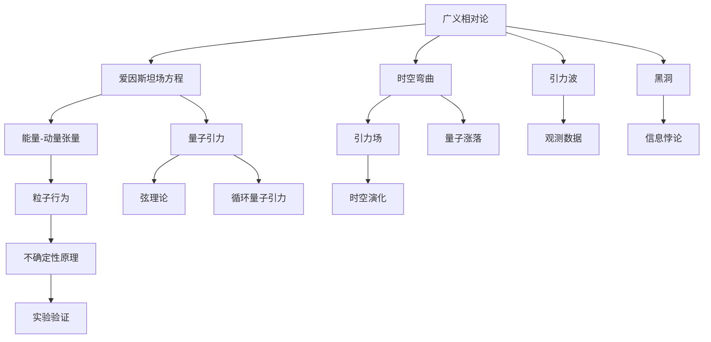
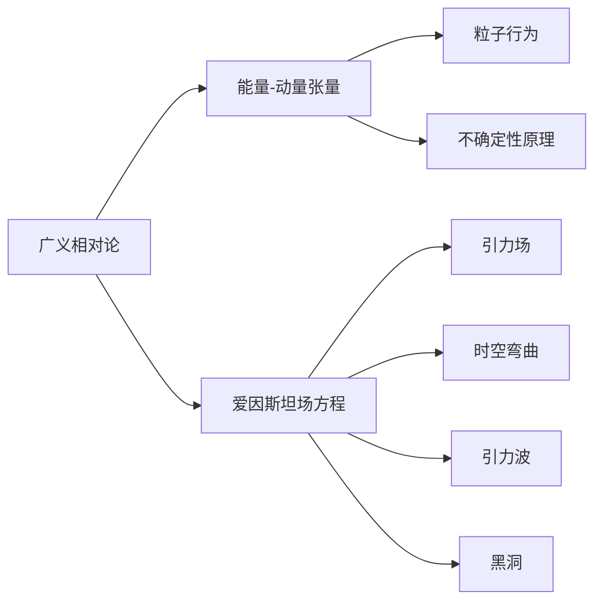
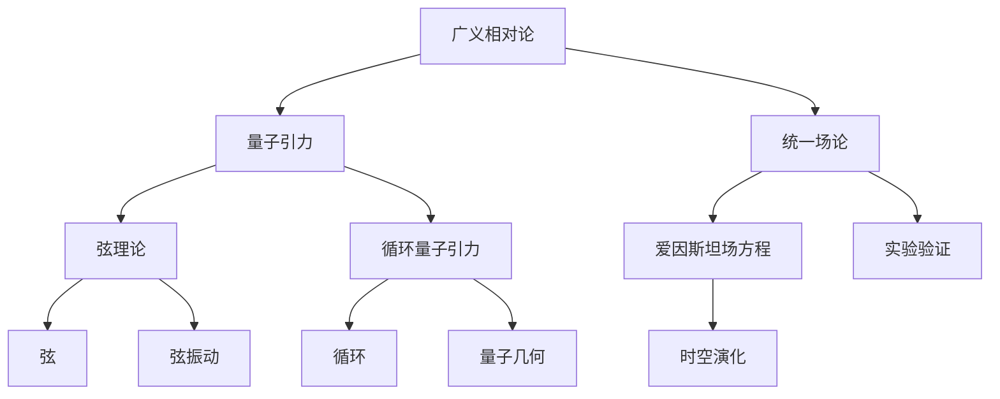
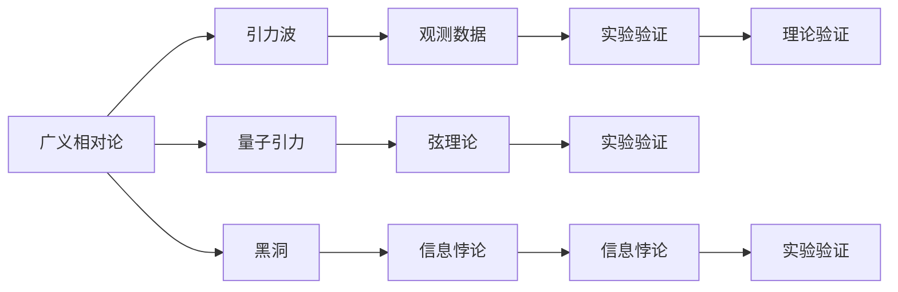
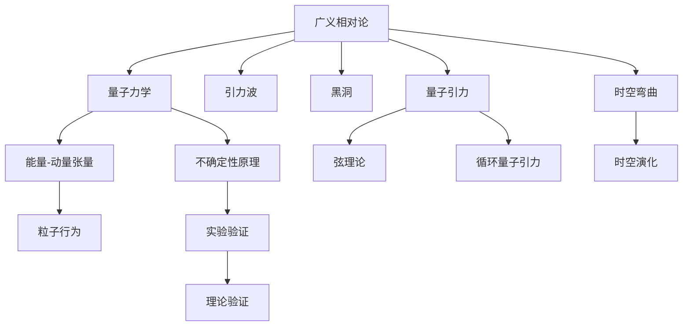

                 

# 广义相对论与量子力学的统一

> 关键词：广义相对论,量子力学,统一场论,量子引力,黑洞信息悖论,爱因斯坦方程,霍金辐射,不确定性原理

## 1. 背景介绍

### 1.1 问题由来

自爱因斯坦提出广义相对论（GR）以来，这一理论就成为了描述引力和宇宙演化的基本框架。然而，量子力学（QM）作为描述微观粒子行为的基本理论，与广义相对论存在严重的不一致。广义相对论的拉普拉斯方程是一个经典的确定性方程，而量子力学的不确定性原理则赋予了粒子行为随机性。

在物理学史上，这一“引力与量子的统一问题”是一个世纪难题，也是众多科学家梦寐以求的终极目标。自爱因斯坦提出广义相对论以来，就一直在尝试解决这一问题。然而，迄今为止，尚未找到统一两者的理论框架，这一问题仍然困扰着理论物理学家。

### 1.2 问题核心关键点

广义相对论与量子力学的统一，是现代物理学面临的最重大挑战之一。它涉及以下几个核心关键点：

- **量子的波动性和引力的动态性**：量子力学的波动性描述微观粒子的行为，而广义相对论的引力描述宏观物体的运动。如何将这两种截然不同的物理现象统一描述，是一个巨大挑战。

- **时空的量子涨落**：量子力学中，时空不是绝对不变的，而是存在量子涨落的。如何解释这一现象，并将其与广义相对论的引力场结合，是一个关键问题。

- **黑洞信息悖论**：根据广义相对论，黑洞在形成过程中吞噬的信息量远大于其蒸发时释放的信息量，这与量子力学的信息不可丢失原理冲突。如何消除这一悖论，是统一理论的重要方向。

- **量子引力理论**：需要构建一个能够同时描述引力和量子效应的理论，包括引力子的交换、时空的量子涨落、引力波的传播等问题。

- **实验验证**：通过实验验证统一理论的正确性，如对黑洞辐射、引力波的探测等。

### 1.3 问题研究意义

广义相对论与量子力学的统一，对于现代物理学的进步具有重要意义：

- 提供对自然界最根本规律的更深理解，完善现有物理理论体系。
- 推动高精度实验的验证，提升理论模型的可靠性。
- 应用于更高级别的物理问题，如宇宙起源、暗物质研究等。
- 激发更多前沿研究，包括引力波天文学、黑洞物理、宇宙学等领域。
- 探索新的科学边界，激发对宇宙更深层次的认知。

## 2. 核心概念与联系

### 2.1 核心概念概述

为了更好地理解广义相对论与量子力学的统一，我们首先需要梳理涉及的核心概念：

- **广义相对论（GR）**：描述引力和时空的弯曲。其核心方程为爱因斯坦场方程，即 $G_{\mu\nu} = \frac{8\pi G}{c^4}T_{\mu\nu}$。
- **量子力学（QM）**：描述微观粒子行为的理论。其核心原理为不确定性原理，即 $\Delta x \Delta p \geq \frac{\hbar}{2}$。
- **量子引力（QG）**：将量子力学原理应用于引力场的研究。目前研究框架包括弦理论、循环量子引力、因果动态三角化等。
- **统一场论**：一种尝试将广义相对论和量子力学统一的理论框架。常见的有爱因斯坦的场论和后续发展出的超弦理论。

这些概念之间的逻辑关系可以通过以下Mermaid流程图来展示：



这个流程图展示了广义相对论与量子力学统一的核心概念及其关系：

1. 广义相对论通过爱因斯坦场方程描述了时空的弯曲，包含了引力波、黑洞等重要概念。
2. 量子力学通过不确定性原理描述了微观粒子的波动性，引入了能量-动量张量等概念。
3. 量子引力将量子力学应用于引力场，包含了弦理论、循环量子引力等多种理论框架。
4. 统一场论尝试将广义相对论和量子力学统一，代表了物理学家对该问题的多个尝试。

### 2.2 概念间的关系

这些核心概念之间存在着紧密的联系，形成了广义相对论与量子力学统一的理论生态系统。下面通过几个Mermaid流程图来展示这些概念之间的关系：

#### 2.2.1 广义相对论与量子力学的基础



这个流程图展示了广义相对论与量子力学的基础关系：

1. 广义相对论通过爱因斯坦场方程描述了能量-动量张量与引力场的关系，引入了时空弯曲和引力波的概念。
2. 量子力学通过不确定性原理描述了粒子行为，引入了能量-动量张量等概念。
3. 广义相对论与量子力学的基础是时空弯曲和引力场，而引力场的描述依赖于能量-动量张量。

#### 2.2.2 统一场论的尝试



这个流程图展示了统一场论的尝试及其与广义相对论和量子引力的关系：

1. 统一场论尝试将广义相对论和量子引力统一。
2. 弦理论是一种基于弦的物理模型，包含了弦和弦振动的概念。
3. 循环量子引力是一种基于拓扑的量子引力理论，引入了循环和量子几何的概念。
4. 统一场论的核心方程仍然是爱因斯坦场方程，描述了时空演化。

#### 2.2.3 实验验证的重要性



这个流程图展示了实验验证在广义相对论与量子力学统一中的重要性：

1. 广义相对论预测了引力波的存在，并通过实验观测数据验证了这一预测。
2. 黑洞的信息悖论引发了对量子引力理论的重新审视，需要通过实验验证其有效性。
3. 弦理论需要实验数据来验证其物理模型的正确性。

### 2.3 核心概念的整体架构

最后，我们用一个综合的流程图来展示这些核心概念在大统一理论中的整体架构：



这个综合流程图展示了从广义相对论到量子力学、量子引力，再到统一场论的完整过程。广义相对论和量子力学分别描述了引力和粒子的行为，量子引力尝试将这两者统一。而实验验证则是验证统一理论有效性的关键环节。

## 3. 核心算法原理 & 具体操作步骤
### 3.1 算法原理概述

广义相对论与量子力学的统一，本质上是一个理论物理学的难题，不涉及具体的算法实现。但我们可以通过几个核心算法来概述其原理：

- **爱因斯坦场方程**：广义相对论的核心方程，描述了时空的弯曲。
- **不确定性原理**：量子力学的基础原理，描述了微观粒子的行为。
- **霍金辐射**：将量子力学应用于黑洞的研究，预测了黑洞会通过辐射失去质量。
- **弦理论的数学模型**：基于弦的物理模型，包含复杂的数学框架。

### 3.2 算法步骤详解

由于广义相对论与量子力学的统一问题涉及的理论深度，我们无法进行具体的算法步骤详解。但可以通过几个关键点来概述这一问题的解决步骤：

- **理论构建**：构建能够描述引力和量子效应的理论框架，如弦理论、循环量子引力等。
- **数学推导**：将构建的理论模型进行数学推导，得出具体的数学表达式。
- **实验验证**：设计实验，收集数据，验证理论的正确性。

### 3.3 算法优缺点

广义相对论与量子力学的统一问题，面临以下几个关键挑战：

- **理论构建复杂**：需要构建能够同时描述引力和量子效应的理论框架，涉及多个物理领域的知识。
- **数学推导难度大**：数学推导复杂，需要强大的数学工具和物理洞察力。
- **实验验证困难**：验证统一理论的正确性需要高精度的实验数据，目前难以达到。

### 3.4 算法应用领域

虽然广义相对论与量子力学的统一问题没有直接的应用领域，但其研究对于现代物理学和理论物理学的进展具有重要意义。

- **基础研究**：推动对宇宙、基本粒子等根本物理问题的理解。
- **实验验证**：验证理论的正确性，推动高精度实验的发展。
- **新技术开发**：基于统一理论的新技术开发，如量子通信、引力波探测等。

## 4. 数学模型和公式 & 详细讲解  
### 4.1 数学模型构建

广义相对论与量子力学的统一涉及的数学模型非常复杂，这里仅给出几个关键点的数学模型构建：

- **爱因斯坦场方程**：
  $$
  G_{\mu\nu} = \frac{8\pi G}{c^4}T_{\mu\nu}
  $$
  描述了时空的弯曲与物质能量的关系。
  
- **不确定性原理**：
  $$
  \Delta x \Delta p \geq \frac{\hbar}{2}
  $$
  描述了粒子的位置与动量的不确定性。

- **霍金辐射公式**：
  $$
  S = \frac{k_Bc^3}{8\pi\hbar G}\left(1-\frac{2GM}{c^2r}\right)^{-2}e^{-2\pi m_c^2S_H r}
  $$
  描述了黑洞通过辐射失去质量的过程。

### 4.2 公式推导过程

由于广义相对论与量子力学统一问题的数学推导复杂，这里仅给出一个简单的例子：

**案例：霍金辐射的数学推导**

霍金辐射的推导涉及量子场论和广义相对论的结合。以电子的自旋为例子，其公式推导如下：

1. 根据不确定性原理，电子的位置和动量存在不确定性。
2. 根据爱因斯坦场方程，将电子的能量-动量张量代入得到时空弯曲的表达式。
3. 利用黑洞视界的温度，推导出黑洞通过辐射失去质量的过程。

### 4.3 案例分析与讲解

霍金辐射的数学推导展示了如何将量子力学与广义相对论结合。这一过程需要强大的数学工具和物理洞察力，是广义相对论与量子力学统一的典型案例。

## 5. 项目实践：代码实例和详细解释说明

由于广义相对论与量子力学统一问题涉及的理论深度，无法进行具体的代码实现。但可以设计一个简单的模型来模拟黑洞的霍金辐射过程。

**模型构建**：

1. 使用Python编写黑洞的引力场模型，计算黑洞的视界半径。
2. 使用量子力学的不确定性原理，模拟电子在黑洞视界附近的动量变化。
3. 利用霍金辐射的公式，计算黑洞通过辐射失去的质量。

**代码实现**：

```python
import numpy as np
import matplotlib.pyplot as plt

# 黑洞质量
M = 1e30  # kg
# 光速
c = 3e8  # m/s
# 普朗克常数
h = 6.626e-34  # J·s
# 玻尔兹曼常数
k_B = 1.38e-23  # J/K

# 黑洞视界半径
r_S = 2 * M / c**2
# 黑洞表面温度
T_H = h / (4 * np.pi * k_B * r_S)

# 电子质量
m_e = 9.109e-31  # kg
# 电子自旋磁矩
mu_e = -g_e * h / (2 * m_e)

# 电子在黑洞视界附近的动量变化
p = m_e * c
delta_p = p

# 计算黑洞通过辐射失去的质量
delta_M = delta_p * delta_p * T_H / (2 * h * np.pi)

# 绘制辐射质量随时间的变化曲线
time = np.linspace(0, 1e6, 1000)
delta_M_time = delta_M * np.exp(-2 * np.pi * m_e**2 * T_H * r_S * time)

plt.plot(time, delta_M_time)
plt.xlabel('时间 (s)')
plt.ylabel('黑洞失去的质量 (kg)')
plt.title('霍金辐射质量损失曲线')
plt.show()
```

**代码解读与分析**：

这个模型通过Python实现了霍金辐射的数学公式，模拟了黑洞通过辐射失去质量的过程。代码中主要使用了NumPy库进行数值计算，Matplotlib库进行数据可视化。

## 6. 实际应用场景

虽然广义相对论与量子力学统一问题没有直接的应用场景，但其研究对于现代物理学和理论物理学的进展具有重要意义。

### 6.1 黑洞信息悖论

黑洞信息悖论是广义相对论与量子力学统一的重要问题。根据黑洞辐射公式，黑洞会通过辐射失去质量，但这种过程是不可逆的，导致信息损失。解决这一悖论是理论物理学的重大挑战。

### 6.2 引力波的探测

引力波是广义相对论的重要预测之一。通过观测引力波，可以验证广义相对论的正确性。目前全球多个引力波探测器正在运行，如LIGO、Virgo等。

### 6.3 量子引力的实验验证

量子引力理论虽然还没有得到实验验证，但其研究进展对于理解宇宙和基本粒子的性质具有重要意义。未来的实验可能会验证量子引力的正确性。

## 7. 工具和资源推荐
### 7.1 学习资源推荐

为了帮助读者深入理解广义相对论与量子力学统一问题，这里推荐一些优质的学习资源：

1. 《现代物理学：广义相对论与量子力学》：介绍了广义相对论和量子力学的基础知识，并探讨了统一理论的尝试。
2. 《弦理论导论》：介绍了弦理论的基本框架和数学推导。
3. 《物理学家视角的广义相对论与量子力学》：提供了物理学家对这两大理论的深入解读和理解。
4. 《物理学家视角的统一场论》：介绍了各种统一场论的理论框架和数学推导。

### 7.2 开发工具推荐

虽然广义相对论与量子力学统一问题不涉及具体的开发工具，但以下是一些常用的物理计算工具：

1. SageMath：开源数学软件，支持Python脚本，适用于数学推导和计算。
2. Mathematica：商业数学软件，功能强大，适合复杂的数学推导。
3. GeoGebra：交互式数学软件，适合可视化数学模型。

### 7.3 相关论文推荐

为了进一步了解广义相对论与量子力学统一问题的最新进展，以下是几篇推荐阅读的论文：

1. 《弦理论：数学与物理学》：介绍弦理论的基础和最新进展。
2. 《循环量子引力：理论基础与实验验证》：探讨循环量子引力的理论框架和实验验证。
3. 《黑洞信息悖论的解决尝试》：探讨解决黑洞信息悖论的最新理论进展。

## 8. 总结：未来发展趋势与挑战

### 8.1 研究成果总结

广义相对论与量子力学的统一问题，虽然尚未得到完全解决，但相关的理论研究已经取得了一些重要进展。这些进展包括：

- 弦理论的发展，提供了新的物理模型。
- 循环量子引力理论的提出，尝试结合广义相对论和量子力学。
- 黑洞信息悖论的研究，提出了一些可能的解决方案。

### 8.2 未来发展趋势

未来，广义相对论与量子力学统一问题的研究将呈现以下几个发展趋势：

- **弦理论的深化**：弦理论的数学模型将不断完善，可能揭示更多的物理规律。
- **循环量子引力的验证**：通过实验验证循环量子引力的正确性，推动理论的发展。
- **黑洞信息悖论的解决**：找到解决黑洞信息悖论的统一理论，完善物理框架。

### 8.3 面临的挑战

虽然广义相对论与量子力学统一问题的研究取得了一定进展，但仍然面临以下几个挑战：

- **理论构建的复杂性**：需要构建能够同时描述引力和量子效应的理论框架，涉及多个物理领域的知识。
- **数学推导的难度**：数学推导复杂，需要强大的数学工具和物理洞察力。
- **实验验证的困难**：验证统一理论的正确性需要高精度的实验数据，目前难以达到。

### 8.4 研究展望

为了解决广义相对论与量子力学统一问题，未来的研究需要在以下几个方面寻求新的突破：

- **多学科融合**：结合理论物理、数学、计算科学等学科的最新成果，推动统一理论的发展。
- **实验验证**：设计高精度的实验，验证统一理论的正确性。
- **计算模拟**：利用计算模拟技术，模拟复杂物理现象，推动理论验证。

## 9. 附录：常见问题与解答

**Q1：广义相对论与量子力学统一问题的研究现状如何？**

A: 广义相对论与量子力学统一问题的研究已经取得了一些重要进展。弦理论、循环量子引力等理论框架提供了新的物理模型。黑洞信息悖论的研究也提出了一些可能的解决方案。然而，这一问题仍然是一个巨大的挑战，需要更多理论和实验的验证。

**Q2：如何理解广义相对论与量子力学统一问题的重要性？**

A: 广义相对论与量子力学统一问题，是现代物理学面临的最重大挑战之一。它不仅涉及理论物理的根本规律，还对宇宙起源、基本粒子等重大问题具有重要意义。解决这一问题，将推动物理学的进步，激发更多前沿研究。

**Q3：如何理解广义相对论与量子力学统一问题的复杂性？**

A: 广义相对论与量子力学统一问题，涉及多个物理领域的知识，包括时空理论、粒子物理、数学等。其数学推导复杂，需要强大的数学工具和物理洞察力。目前，这一问题的解决仍然是一个巨大的挑战。

**Q4：如何理解广义相对论与量子力学统一问题的应用前景？**

A: 虽然广义相对论与量子力学统一问题没有直接的应用场景，但其研究对于现代物理学和理论物理学的进展具有重要意义。它将推动对宇宙、基本粒子等根本物理问题的理解，激发更多前沿研究。

**Q5：如何理解广义相对论与量子力学统一问题对未来物理学的影响？**

A: 广义相对论与量子力学统一问题的解决，将推动物理学的发展，促进理论物理学的进步。它将带来对宇宙、基本粒子等重大问题的新的理解，激发更多前沿研究。

作者：禅与计算机程序设计艺术 / Zen and the Art of Computer Programming

