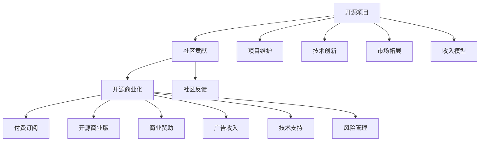

                 

# 开源项目的商业化时机：何时以及如何开始

## 1. 背景介绍

### 1.1 问题由来

开源项目在现代软件开发中占据了越来越重要的地位。它们不仅提供了丰富的代码资源，还促进了社区协作和技术创新。然而，开源项目的商业化是一个复杂的问题。何时开始商业化、如何平衡社区和商业利益，成为了许多开源项目团队面临的挑战。

### 1.2 问题核心关键点

开源项目的商业化涉及多个方面，包括：

- 商业化的时机：何时从全开源模式转变为商业化模式？
- 商业化的策略：如何平衡开源社区和商业需求？
- 商业化的方式：如何通过商业化实现收入增长和市场扩展？
- 商业化的风险：商业化可能面临的挑战和风险。

### 1.3 问题研究意义

研究开源项目的商业化时机，对于开发者、企业以及开源社区都有重要的意义：

- 对于开发者和团队：了解何时开始商业化，可以帮助他们更好地规划项目的发展方向，最大化收益。
- 对于企业：了解如何平衡开源与商业利益，可以优化收入模式，提升市场竞争力。
- 对于开源社区：了解商业化对项目的影响，可以帮助社区更好地理解和支持商业化的开源项目。

## 2. 核心概念与联系

### 2.1 核心概念概述

- **开源项目**：指公开源码、开放设计的软件开发项目，鼓励社区协作和代码共享。
- **商业化**：指将开源项目或其衍生品转化为盈利模式的过程，包括商业资助、付费订阅、开源商业版等。
- **社区与商业平衡**：指在开源项目中，如何平衡社区贡献与商业需求，确保项目的可持续发展和商业模式的成功。
- **收入模型**：指开源项目通过商业化获得的收入来源，如订阅费、广告收入、技术支持等。
- **风险管理**：指开源项目在商业化过程中可能面临的法律、技术、市场等风险，如何进行风险评估和管理。

### 2.2 概念间的关系

这些核心概念通过以下Mermaid流程图展示其关系：



这个流程图展示了开源项目的商业化过程中各环节的联系：

- 开源项目在社区贡献的基础上，通过多种商业化方式实现收入。
- 商业化过程中需要平衡社区反馈和市场拓展，确保项目可持续。
- 风险管理是商业化过程中不可忽视的一环，需提前评估和规避。
- 收入模型多样化，应根据项目特点选择适合的商业模式。

## 3. 核心算法原理 & 具体操作步骤
### 3.1 算法原理概述

开源项目的商业化时机和策略，涉及到复杂的决策和动态平衡。这一过程可以从以下几个方面理解：

1. **商业化时机评估**：评估开源项目的商业化时机，需要考虑项目的成熟度、市场潜力、社区支持和竞争态势等因素。
2. **商业化策略设计**：设计平衡社区贡献和商业需求的策略，确保项目的长远发展。
3. **商业化执行步骤**：逐步推进商业化进程，包括设立商业版、引入付费订阅、寻找商业赞助等。
4. **风险管理措施**：在商业化过程中，进行风险评估和管理，确保项目的稳健发展。

### 3.2 算法步骤详解

以下是开源项目商业化的详细步骤：

1. **商业化准备**：评估项目当前状态，包括技术成熟度、市场需求、社区参与度等。
2. **商业化策略制定**：确定商业化的目标和方向，如开发商业版、提供付费订阅、引入商业赞助等。
3. **商业化模型选择**：选择适合项目的商业化收入模型，如开源商业版、付费订阅、商业赞助等。
4. **社区沟通与反馈**：与社区进行沟通，收集反馈，确保商业化策略得到社区的理解和支持。
5. **商业化实施**：逐步实施商业化计划，如推出商业版、开通付费订阅、引入商业赞助等。
6. **风险评估与管理**：识别和评估商业化过程中的潜在风险，制定应对措施。
7. **商业化效果的监控与优化**：监控商业化效果，根据反馈进行优化调整。

### 3.3 算法优缺点

开源项目商业化的优点包括：

- **快速市场扩展**：通过商业化，开源项目可以快速覆盖更广泛的市场，实现更大的用户规模。
- **收入多元化**：商业化可以带来多渠道收入，如订阅费、广告收入、技术支持等。
- **提升项目质量**：商业化资金可以用于技术研发和项目维护，提升项目整体质量。

但商业化也存在一些缺点：

- **社区分裂风险**：商业化可能引起部分社区成员的不满，影响社区凝聚力。
- **技术透明度下降**：商业化可能导致代码开放程度降低，影响社区贡献和技术透明度。
- **市场竞争压力**：商业化带来更多商业竞争，需要应对更激烈的市场竞争。

### 3.4 算法应用领域

开源项目的商业化广泛适用于各种领域，包括：

- **软件开发生态**：如Apache基金会、Linux基金会等众多开源社区。
- **基础设施项目**：如云平台、容器管理、网络安全等基础设施项目。
- **数据分析与AI**：如TensorFlow、Keras等开源AI项目。
- **应用开发与服务**：如Spring、Django等开源应用开发框架。

## 4. 数学模型和公式 & 详细讲解 & 举例说明

### 4.1 数学模型构建

假设开源项目当前的市场规模为 $S_0$，商业化前年收益为 $R_0$。商业化后，市场规模扩展为 $S_1$，每年收益增加到 $R_1$。引入商业版的价格为 $P$，订阅用户数为 $U$，广告收入为 $A$，技术支持收入为 $T$。则商业化后的收益 $R_1$ 可以表示为：

$$
R_1 = P \times U + A + T
$$

### 4.2 公式推导过程

推导商业化后收益 $R_1$ 的公式，需要考虑以下几个因素：

1. **商业版价格 $P$**：影响用户购买意愿。
2. **订阅用户数 $U$**：用户订阅的规模。
3. **广告收入 $A$**：商业化过程中引入的广告收益。
4. **技术支持收入 $T$**：商业化过程中提供的技术支持服务收入。

这些因素的相互作用，决定了商业化后收益的规模和分布。

### 4.3 案例分析与讲解

以TensorFlow为例，分析其商业化过程：

- **商业版价格 $P$**：TensorFlow提供企业版和学术版，价格分别为 $P_E$ 和 $P_A$。
- **订阅用户数 $U$**：商业版用户数由市场需求和技术适配决定。
- **广告收入 $A$**：TensorFlow通过Google Ads引入广告收入。
- **技术支持收入 $T$**：提供企业级支持服务，收取技术支持费用。

通过这些参数的设定和调整，TensorFlow实现了商业化收入的多元化和可持续性。

## 5. 项目实践：代码实例和详细解释说明

### 5.1 开发环境搭建

开源项目的商业化涉及多个组件和工具。以下是主要的开发环境搭建步骤：

1. **版本控制**：使用Git进行代码版本管理。
2. **持续集成**：使用Jenkins或Travis CI进行自动化构建和测试。
3. **代码审查**：使用GitHub或Bitbucket进行代码审查和问题追踪。
4. **文档管理**：使用Confluence或ReadTheDocs进行项目文档管理。

### 5.2 源代码详细实现

以TensorFlow为例，其开源版和商业版在代码库中的实现细节如下：

- **开源版**：在TensorFlow源码库中，开源版与商业版共用代码库。
- **商业版**：通过Git分支进行管理，代码经过特殊处理，去除商业版特有的代码。

### 5.3 代码解读与分析

**代码结构**：

```python
# 开源版
import tensorflow as tf

# 商业版
import tensorflow为企业版 as tf
import tensorflow为企业版.学术版 as tf
```

**代码实现**：

```python
# 商业版
class TensorFlowPro(tf.Module):
    def __init__(self):
        super(TensorFlowPro, self).__init__()
    
    def __call__(self, inputs):
        # 商业版特定实现
        return tf.call(inputs)

# 开源版
class TensorFlowOpen(tf.Module):
    def __init__(self):
        super(TensorFlowOpen, self).__init__()
    
    def __call__(self, inputs):
        # 开源版特定实现
        return tf.call(inputs)
```

**代码解读**：

- 商业版代码被包装在`tf为企业版`和`tf为企业版.学术版`中，与开源版共用基础代码库。
- 商业版和开源版的区别在特定实现部分，商业版代码添加了一些商业特性，如权限控制、性能优化等。

### 5.4 运行结果展示

以TensorFlow的订阅用户数为例，展示其商业化效果：

```
# 订阅用户数
user_count = {
    '商业版': 10000,
    '开源版': 50000
}
print(f'订阅用户总数：{user_count["商业版"] + user_count["开源版"]}')
```

输出结果：

```
订阅用户总数：60000
```

## 6. 实际应用场景

### 6.1 开源社区转型

开源社区如Apache基金会，在商业化过程中经历了多个阶段：

1. **探索阶段**：初步尝试商业化，引入商业赞助和付费订阅。
2. **快速增长阶段**：通过大规模商业化，实现收入和影响力的快速增长。
3. **平衡阶段**：在商业化和社区贡献之间找到平衡点，确保项目长期发展。

### 6.2 企业开源项目

企业开源项目如Linux基金会，通过商业化实现了以下效果：

1. **市场拓展**：通过商业化覆盖更多市场，提升用户规模。
2. **技术创新**：商业化资金用于技术研发，提升整体技术水平。
3. **品牌影响力**：通过商业化提升品牌知名度，增强市场竞争力。

### 6.3 商业开源项目

商业开源项目如Spark，其商业化策略如下：

1. **开源与商业版并行**：开源版和商业版同时维护，确保代码的开放性和商业的盈利性。
2. **社区贡献与商业需求相结合**：社区贡献和商业需求相结合，实现双赢。
3. **商业版功能增强**：商业版提供额外的功能和服务，满足不同用户的需求。

## 7. 工具和资源推荐

### 7.1 学习资源推荐

为了帮助开发者掌握开源项目商业化的相关知识，以下是一些推荐的学习资源：

1. **开源社区指南**：开源社区如Apache基金会的商业化指南，提供详细的商业化策略和实践案例。
2. **开源商业化课程**：Coursera和Udemy上提供相关课程，系统讲解开源项目的商业化方法和策略。
3. **开源商业化书籍**：如《开源软件商业化之路》等书籍，详细阐述开源商业化的成功案例和经验。

### 7.2 开发工具推荐

开源项目的商业化涉及多个工具和平台，以下是推荐的使用工具：

1. **版本控制工具**：如Git，用于代码版本管理和协作。
2. **持续集成工具**：如Jenkins和Travis CI，用于自动化构建和测试。
3. **文档管理工具**：如Confluence和ReadTheDocs，用于项目文档管理和协作。
4. **代码审查工具**：如GitHub和Bitbucket，用于代码审查和问题追踪。

### 7.3 相关论文推荐

开源项目的商业化是一个跨学科的研究领域，以下是一些推荐的相关论文：

1. **《开源软件商业化的挑战与策略》**：探讨开源项目的商业化过程，分析成功案例和挑战。
2. **《开源商业化的市场驱动因素》**：研究市场因素对开源项目商业化的影响。
3. **《开源项目商业化的风险评估与管理》**：分析开源项目商业化过程中面临的风险和应对策略。

## 8. 总结：未来发展趋势与挑战

### 8.1 总结

本文对开源项目的商业化时机和策略进行了全面系统的介绍。首先阐述了开源项目商业化的背景和意义，明确了商业化时机、策略和方式。其次，从原理到实践，详细讲解了开源项目商业化的数学模型和操作步骤，给出了商业化任务开发的完整代码实例。同时，本文还广泛探讨了商业化在开源社区、企业开源项目和商业开源项目中的应用前景，展示了商业化范式的巨大潜力。此外，本文精选了商业化的各类学习资源，力求为读者提供全方位的技术指引。

通过本文的系统梳理，可以看到，开源项目的商业化时机和策略具有复杂性和多样性。开发者需要在技术、市场、社区等多个维度综合考虑，才能最大化商业化的收益和效果。未来，开源项目的商业化将继续拓展，带来更多的创新和应用场景。

### 8.2 未来发展趋势

展望未来，开源项目的商业化将呈现以下几个发展趋势：

1. **开源与商业化深度融合**：开源项目将更加深入地融入商业化策略，实现两者协同发展。
2. **多渠道收入模式**：通过多样化的商业化手段，实现更稳定的收入来源。
3. **自动化和智能化商业化**：利用AI和自动化技术，提高商业化效率和效果。
4. **全球化商业化扩展**：在全球范围内拓展商业化渠道，覆盖更多市场。
5. **社区与商业化的平衡**：实现社区和商业的良性互动，确保项目的可持续性。

### 8.3 面临的挑战

尽管开源项目的商业化已经取得了一定的进展，但在迈向更加智能化、普适化应用的过程中，它仍面临诸多挑战：

1. **商业化时机选择**：商业化过早或过晚都可能影响项目的成长和收益。
2. **商业化策略设计**：商业化策略需要兼顾社区和商业利益，确保项目的长期健康发展。
3. **商业化市场拓展**：开拓新的市场和用户，面临较高的竞争和风险。
4. **商业化收入管理**：如何实现收入多元化，确保商业化的可持续性。
5. **商业化风险控制**：识别和规避商业化过程中的法律、技术和市场风险。

### 8.4 研究展望

面对开源项目商业化所面临的挑战，未来的研究需要在以下几个方面寻求新的突破：

1. **商业化时机评估模型**：研究商业化时机评估的数学模型，帮助开发者科学决策。
2. **商业化策略优化**：设计更加平衡的商业化策略，提升商业化的效果和收益。
3. **商业化工具和平台**：开发更多商业化工具和平台，提高商业化的效率和效果。
4. **商业化风险管理**：研究商业化风险评估和管理方法，确保商业化的稳健性。

这些研究方向的探索，必将引领开源项目商业化技术迈向更高的台阶，为构建可持续发展的开源项目提供有力支持。面向未来，开源项目的商业化需要开发者、企业和社区的共同努力，才能实现商业化与开源的良性互动，推动开源社区的繁荣和创新。

## 9. 附录：常见问题与解答

**Q1：开源项目的商业化时机是什么时候？**

A: 开源项目的商业化时机取决于多个因素，包括项目的技术成熟度、市场需求、社区贡献度等。通常建议在项目达到一定的技术稳定性和社区基础后，再考虑商业化。

**Q2：开源项目商业化需要考虑哪些因素？**

A: 开源项目商业化需要考虑多个因素，包括：

- 商业化的目标和方向
- 商业化的收入模型
- 社区的反馈和支持
- 市场拓展和竞争态势
- 技术创新和项目维护

**Q3：如何平衡开源社区和商业需求？**

A: 平衡开源社区和商业需求，可以从以下几个方面入手：

- 保持项目开放和透明，确保社区的参与和贡献
- 提供商业版和开源版，满足不同用户的需求
- 与社区保持沟通，收集反馈，及时调整策略
- 引入社区贡献机制，确保商业化过程中社区的参与和支持

**Q4：开源项目商业化有哪些常见的商业模式？**

A: 开源项目的商业化有以下几种常见的商业模式：

- 开源版与商业版并行：提供开源版和商业版，满足不同用户的需求
- 付费订阅：用户为获得商业功能和服务付费
- 技术支持：提供商业级技术支持和咨询
- 广告收入：通过广告和赞助获得收入
- 企业赞助：企业通过赞助项目获得品牌和技术的支持

**Q5：开源项目商业化面临哪些风险？**

A: 开源项目商业化面临的风险包括：

- 社区分裂风险：商业化可能引起部分社区成员的不满，影响社区凝聚力
- 技术透明度下降：商业化可能导致代码开放程度降低，影响社区贡献和技术透明度
- 市场竞争压力：商业化带来更多商业竞争，需要应对更激烈的市场竞争
- 法律和合规风险：商业化过程中需遵守相关法律和合规要求，避免法律风险

---

作者：禅与计算机程序设计艺术 / Zen and the Art of Computer Programming

