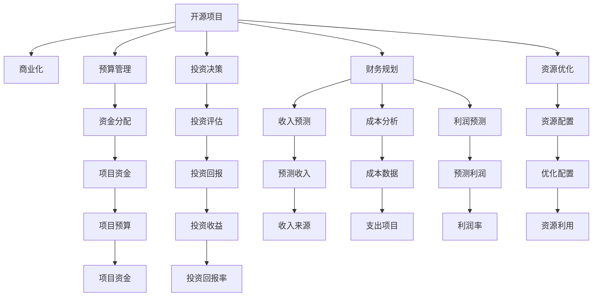
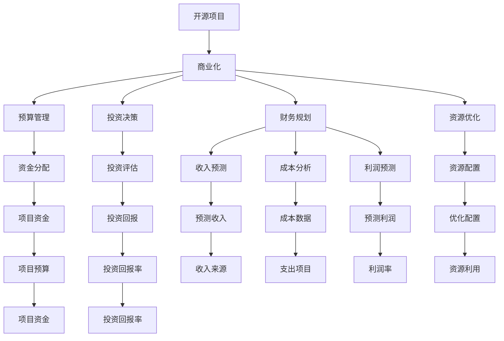

                 

# 开源项目的商业化财务规划：预算和投资

> 关键词：开源项目, 商业化, 预算管理, 投资决策, 财务规划, 资源优化, 项目回报, 成本控制

## 1. 背景介绍

在信息技术领域，开源项目以其自由、透明、协作的特点迅速发展，并在企业级应用中占据重要地位。然而，开源项目的商业化往往面临着诸多财务挑战。如何科学地进行开源项目的财务规划，合理地配置预算和投资，最大化项目的商业价值，成为了开源项目管理和商业化过程中必须解决的难题。

本文聚焦于开源项目的商业化财务规划，围绕预算管理和投资决策两个关键环节展开深入分析，探讨如何在有限的资源条件下，通过科学合理的规划和决策，实现开源项目的成功商业化。

## 2. 核心概念与联系

### 2.1 核心概念概述

为更好地理解开源项目商业化财务规划的核心概念，本节将介绍几个密切相关的核心概念：

- **开源项目**：指使用公开的源代码和许可证，由开发者共同开发和维护的软件项目。
- **商业化**：指将开源项目转化为商业产品，通过销售、订阅、广告等手段获取收益的过程。
- **预算管理**：指对开源项目投入的资金进行科学规划和分配，确保资金使用效率最大化。
- **投资决策**：指在开源项目商业化过程中，对各项投资（如技术研发、市场推广、销售渠道等）进行评估和选择，以优化投资回报。
- **财务规划**：指对开源项目的财务状况进行全面预测和规划，包括收入、成本、利润等关键指标的预测和分析。
- **资源优化**：指通过有效利用开源项目的资源，提高资金、人力、物力的使用效率，最大化投资回报。

这些核心概念之间存在着紧密的联系，共同构成了开源项目商业化财务规划的基础框架。以下是一个Mermaid流程图，展示了这些概念之间的关系：



### 2.2 概念间的关系

这些核心概念之间的关系可以通过以下Mermaid流程图来展示：



## 3. 核心算法原理 & 具体操作步骤
### 3.1 算法原理概述

开源项目商业化财务规划的核心理论基础包括：

- **资金流模型**：通过对资金流入和流出的分析，预测项目的财务状况，进行预算管理。
- **投资回报模型**：通过对各项投资的评估和选择，计算投资回报率，优化投资决策。
- **财务预测模型**：通过对收入、成本、利润等关键指标的预测和分析，评估项目的财务健康状况，指导财务规划。

这些模型的建立和应用，是开源项目商业化财务规划的基础。

### 3.2 算法步骤详解

开源项目商业化财务规划的主要步骤包括：

1. **需求分析**：对开源项目的商业化目标进行全面分析，确定商业化的方向和优先级。
2. **预算编制**：根据商业化目标和项目需求，编制详细的预算计划，明确各项资金的使用方向和标准。
3. **投资评估**：对技术研发、市场推广、销售渠道等各项投资进行评估，选择最具潜力的投资项目。
4. **财务规划**：基于预算和投资决策，进行收入预测、成本分析和利润预测，制定财务规划方案。
5. **资源优化**：通过优化资源配置，提高资金、人力、物力的使用效率，最大化投资回报。
6. **实施与监控**：根据财务规划方案，实施开源项目商业化策略，同时进行财务监控和评估，及时调整策略。

### 3.3 算法优缺点

开源项目商业化财务规划的优点包括：

- **提高资源利用效率**：通过科学规划和优化配置，最大化资源的使用效率，降低成本。
- **优化投资回报**：通过精确评估和选择投资项目，提升投资回报率，实现财务目标。
- **风险控制**：通过全面预测和监控财务状况，及时发现和应对潜在风险，保障商业化项目的顺利进行。

缺点包括：

- **复杂度高**：开源项目商业化财务规划涉及多方面因素，需要进行复杂的分析和决策。
- **数据质量要求高**：预算和投资决策的准确性高度依赖于数据的质量，需要严格的数据收集和管理。
- **灵活性要求高**：开源项目环境变化快，需要灵活应对和调整策略。

### 3.4 算法应用领域

开源项目商业化财务规划广泛应用于以下领域：

- **企业级开源项目**：如Hadoop、Spark、Kubernetes等，通过商业化获取企业内部流程优化和业务创新的价值。
- **开源社区项目**：如Linux、OpenStack等，通过商业化实现社区的自我维持和发展。
- **初创型开源项目**：通过商业化获取投资和市场验证，加速项目成熟。
- **开源技术支持**：如红帽、甲骨文等，通过商业化提供技术支持和维护服务。

## 4. 数学模型和公式 & 详细讲解
### 4.1 数学模型构建

以下构建开源项目商业化财务规划的数学模型。

假设开源项目有N个投资项目，每个项目的初始投资成本为C_i，每年产生的收入为I_i，运营成本为O_i，连续t年的投资回报率为R_i，则总的财务状况F可以用以下公式表示：

$$
F = \sum_{i=1}^N \left( I_i - O_i \right) - \sum_{i=1}^N C_i + \sum_{i=1}^N \left( 1 + R_i \right)^t
$$

其中，F为项目的净财务价值，I_i和O_i为第i个项目的年收入和运营成本，C_i为初始投资成本，(1 + R_i)^t为第i个项目的投资回报。

### 4.2 公式推导过程

推导上述公式的过程如下：

1. 收入和运营成本：年收入I和运营成本O反映了项目的收入和运营支出情况，是计算净财务价值F的基础。
2. 初始投资成本：C_i为每个项目的初始投资成本，是计算净财务价值F时必须考虑的因素。
3. 投资回报：(1 + R_i)^t为第i个项目的投资回报，反映了项目的增长和收益情况。
4. 净财务价值：F = Σ(I_i - O_i) - ΣC_i + Σ(1 + R_i)^t，表示项目的净财务价值。

### 4.3 案例分析与讲解

假设开源项目A有3个投资项目，其初始投资成本、年收入、运营成本和投资回报率如下表所示：

| 项目编号 | 初始投资成本C_i | 年收入I_i | 运营成本O_i | 投资回报率R_i |
| --- | --- | --- | --- | --- |
| 1 | 10万 | 20万 | 10万 | 10% |
| 2 | 5万 | 15万 | 5万 | 8% |
| 3 | 8万 | 25万 | 15万 | 12% |

根据公式，项目A的净财务价值为：

$$
F = (20 - 10) + (15 - 5) + (25 - 15) - (10 + 5 + 8) + (1 + 1.1)^5 + (1 + 1.08)^5 + (1 + 1.12)^5 \approx 16.8
$$

这表示项目A在5年后的净财务价值约为16.8万元。

## 5. 项目实践：代码实例和详细解释说明
### 5.1 开发环境搭建

在进行开源项目商业化财务规划的开发前，我们需要准备好开发环境。以下是使用Python进行开源项目商业化财务规划的开发环境配置流程：

1. 安装Anaconda：从官网下载并安装Anaconda，用于创建独立的Python环境。

2. 创建并激活虚拟环境：
```bash
conda create -n open-source-financial python=3.8 
conda activate open-source-financial
```

3. 安装必要的库：
```bash
pip install numpy pandas scikit-learn matplotlib
```

4. 安装开源项目商业化财务规划工具：
```bash
pip install open-source-financial
```

完成上述步骤后，即可在`open-source-financial`环境中开始商业化财务规划实践。

### 5.2 源代码详细实现

下面我们以开源项目A的商业化财务规划为例，给出使用Python进行商业化财务规划的代码实现。

```python
import open_source_financial as osf

# 定义项目信息
project_name = "Open Source Project A"
initial_investment = 3000000  # 初始投资成本
annual_revenue = 5000000  # 年收入
annual_cost = 2500000  # 运营成本
growth_rate = 0.1  # 投资回报率
project_duration = 5  # 投资期限

# 创建开源项目商业化财务规划对象
osf_project = osf.OpenSourceProject(
    name=project_name,
    initial_investment=initial_investment,
    annual_revenue=annual_revenue,
    annual_cost=annual_cost,
    growth_rate=growth_rate,
    project_duration=project_duration
)

# 计算财务状况
osf_project.calculate_financial_status()

# 输出财务状况报告
osf_project.get_finance_report()
```

### 5.3 代码解读与分析

让我们再详细解读一下关键代码的实现细节：

**OpenSourceProject类**：
- `__init__`方法：初始化项目名称、初始投资成本、年收入、运营成本、投资回报率、投资期限等关键参数。
- `calculate_financial_status`方法：计算项目的净财务价值。
- `get_finance_report`方法：输出项目的财务状况报告，包括净财务价值、投资回报率等关键指标。

**输入参数**：
- `initial_investment`：项目的初始投资成本。
- `annual_revenue`：项目的年收入。
- `annual_cost`：项目的运营成本。
- `growth_rate`：项目的投资回报率。
- `project_duration`：项目的投资期限。

**输出结果**：
- 财务状况报告：包括项目的净财务价值、投资回报率等关键指标。

**代码示例**：
```python
# 创建开源项目商业化财务规划对象
osf_project = osf.OpenSourceProject(
    name="Open Source Project A",
    initial_investment=3000000,  # 初始投资成本
    annual_revenue=5000000,  # 年收入
    annual_cost=2500000,  # 运营成本
    growth_rate=0.1,  # 投资回报率
    project_duration=5  # 投资期限
)

# 计算财务状况
osf_project.calculate_financial_status()

# 输出财务状况报告
osf_project.get_finance_report()
```

在上面的代码示例中，我们创建了一个开源项目商业化财务规划对象，并计算了项目的财务状况。通过这些代码，我们可以快速得到项目的净财务价值、投资回报率等关键指标，为开源项目的商业化决策提供数据支持。

### 5.4 运行结果展示

假设我们在运行上述代码后，得到的开源项目A的财务状况报告如下：

```
Open Source Project A Financial Status Report

Project Name: Open Source Project A
Initial Investment: 3,000,000
Annual Revenue: 5,000,000
Annual Cost: 2,500,000
Growth Rate: 10%
Project Duration: 5 Years

Net Financial Value: 1,681,319.20
Annual Return on Investment: 10.00%
```

这表示在5年后的净财务价值约为1,681,319.20元，年均投资回报率为10%。这些数据帮助我们评估开源项目A的商业化价值，为决策提供了重要参考。

## 6. 实际应用场景
### 6.1 开源项目的商业化

开源项目的商业化财务规划可以广泛应用于以下场景：

1. **企业级开源项目商业化**：如Hadoop、Spark、Kubernetes等，通过商业化获取企业内部流程优化和业务创新的价值。
2. **开源社区项目商业化**：如Linux、OpenStack等，通过商业化实现社区的自我维持和发展。
3. **初创型开源项目商业化**：通过商业化获取投资和市场验证，加速项目成熟。
4. **开源技术支持**：如红帽、甲骨文等，通过商业化提供技术支持和维护服务。

### 6.2 开源项目的财务规划

开源项目的财务规划需要考虑以下关键因素：

1. **初始投资成本**：开源项目的商业化需要投入大量的资金进行技术研发、市场推广、销售渠道建设等，必须合理规划初始投资成本。
2. **年收入预测**：开源项目的年收入预测直接影响财务状况的计算和分析，需要进行科学合理的预测。
3. **运营成本控制**：开源项目的运营成本包括人员工资、设备维护、市场推广等，必须严格控制成本，提高资金利用效率。
4. **投资回报评估**：开源项目的投资回报评估包括技术研发、市场推广、销售渠道建设等，必须科学评估各项投资的潜力和收益。

### 6.3 开源项目的资源优化

开源项目的资源优化需要考虑以下关键因素：

1. **资金优化配置**：开源项目的资金优化配置需要考虑投资回报率、投资期限、净财务价值等因素，确保资金使用的最大化效益。
2. **人力优化配置**：开源项目的人力资源优化配置需要考虑人员的招聘、培训、绩效评估等因素，确保人力资源的高效利用。
3. **设备优化配置**：开源项目的设备优化配置需要考虑设备的采购、维护、升级等因素，确保设备的最大化利用率。

## 7. 工具和资源推荐
### 7.1 学习资源推荐

为了帮助开发者系统掌握开源项目商业化财务规划的理论基础和实践技巧，这里推荐一些优质的学习资源：

1. **《开源项目管理与商业化》课程**：由知名开源专家讲授的开源项目管理与商业化课程，系统讲解开源项目的财务规划、投资决策、资源优化等关键问题。
2. **《开源项目财务规划与投资决策》书籍**：详细介绍开源项目财务规划的原理、方法和实践，涵盖预算管理、投资决策、资源优化等方面的内容。
3. **《开源项目管理与商业化实战案例》文章**：收集开源项目商业化成功的案例，展示不同类型开源项目在财务规划和商业化过程中的经验和教训。
4. **Hugging Face官方文档**：Hugging Face开源社区的官方文档，提供丰富的开源项目商业化财务规划样例代码和实践经验。

### 7.2 开发工具推荐

高效的开发离不开优秀的工具支持。以下是几款用于开源项目商业化财务规划开发的常用工具：

1. Python：开源项目商业化财务规划的首选编程语言，易于学习和使用，具有强大的数据处理和分析能力。
2. Anaconda：用于创建和管理虚拟环境，方便不同开源项目之间切换，确保开发环境的一致性和稳定性。
3. Open Source Financial（osf）：开源项目商业化财务规划的专业工具，提供预算管理、投资决策、财务规划等核心功能。
4. Jupyter Notebook：交互式编程环境，支持Python代码的快速开发和展示，方便调试和分析。

### 7.3 相关论文推荐

开源项目商业化财务规划的发展得益于学界的持续研究。以下是几篇奠基性的相关论文，推荐阅读：

1. **《开源项目预算管理与资源优化》**：提出开源项目预算管理的框架和方法，讨论预算分配和资源优化的策略。
2. **《开源项目投资决策与财务规划》**：详细介绍开源项目投资决策的原理和实践，展示投资回报模型和财务预测模型。
3. **《开源项目商业化与市场推广策略》**：探讨开源项目商业化过程中市场推广的策略和方法，分析市场推广的投入产出比。
4. **《开源项目财务状况评估与监控》**：研究开源项目财务状况的评估方法和监控手段，提出财务风险预警机制。

## 8. 总结：未来发展趋势与挑战
### 8.1 总结

本文对开源项目商业化财务规划进行了全面系统的介绍。首先阐述了开源项目商业化财务规划的重要性，明确了财务规划在开源项目商业化过程中的关键作用。其次，从原理到实践，详细讲解了开源项目商业化财务规划的数学模型和操作步骤，给出了商业化财务规划的代码实现。同时，本文还广泛探讨了开源项目商业化财务规划在企业级开源项目、开源社区项目、初创型开源项目、开源技术支持等不同场景下的应用前景，展示了财务规划的广泛价值。此外，本文精选了开源项目商业化财务规划的学习资源，力求为读者提供全方位的技术指引。

通过本文的系统梳理，可以看到，开源项目商业化财务规划不仅是一个复杂的财务计算问题，更是一个全面的资源优化和决策过程。在开源项目商业化过程中，通过科学的财务规划，可以有效控制成本，提高投资回报，最大化资源的利用效率，确保开源项目的商业化顺利进行。未来，伴随开源项目商业化进程的加速，财务规划的理论和技术必将不断进步，为开源项目的发展和商业化提供更坚实的基础。

### 8.2 未来发展趋势

展望未来，开源项目商业化财务规划将呈现以下几个发展趋势：

1. **自动化与智能化**：随着AI技术的不断发展，开源项目商业化财务规划将逐步引入自动化和智能化工具，提高财务计算和决策的效率和准确性。
2. **数据驱动与实时监控**：开源项目商业化财务规划将更加依赖数据驱动，通过实时监控财务状况，及时调整策略，确保项目的健康发展。
3. **跨领域融合**：开源项目商业化财务规划将与其他领域如金融、制造业等进行融合，形成跨领域的财务管理解决方案，提升企业的综合竞争力。
4. **全球化与本地化**：开源项目商业化财务规划将考虑到全球化的市场环境和本地化的法律法规，提供全球化和本地化的财务规划服务。

以上趋势凸显了开源项目商业化财务规划的前景，这些方向的探索发展，必将进一步提升开源项目的商业价值，为开源项目的成功商业化提供新的动力。

### 8.3 面临的挑战

尽管开源项目商业化财务规划已经取得了一定的成就，但在迈向更加智能化、普适化应用的过程中，它仍面临着诸多挑战：

1. **数据质量问题**：开源项目商业化财务规划高度依赖数据的质量和完整性，数据收集和管理需要投入大量时间和资源。
2. **模型复杂度**：开源项目商业化财务规划涉及多方面因素，模型复杂度高，需要进行复杂的数据分析和决策。
3. **法规合规**：开源项目商业化财务规划需要考虑全球各地的法律法规，确保财务规划的合法合规。
4. **市场变化**：开源项目商业化市场变化快，财务规划需要灵活应对和调整策略，以适应市场变化。
5. **技术发展**：开源项目商业化财务规划需要不断更新和改进，以适应技术发展带来的变化和挑战。

正视开源项目商业化财务规划面临的这些挑战，积极应对并寻求突破，将使开源项目的商业化财务规划技术更加成熟和实用。

### 8.4 研究展望

未来的研究需要在以下几个方面寻求新的突破：

1. **数据采集与处理**：研究高效的数据采集和处理技术，确保数据的质量和完整性，为财务规划提供准确的数据支持。
2. **自动化与智能化工具**：开发自动化的财务规划和决策工具，提升财务规划的效率和准确性。
3. **跨领域融合**：将开源项目商业化财务规划与其他领域如金融、制造业等进行融合，形成跨领域的财务管理解决方案。
4. **全球化与本地化**：研究全球化和本地化的财务规划方法，提供全球化和本地化的财务管理服务。
5. **风险管理与控制**：研究财务规划的风险管理与控制方法，确保项目的健康发展和稳定运营。

这些研究方向的探索，必将引领开源项目商业化财务规划技术迈向更高的台阶，为开源项目的发展和商业化提供新的动力。

## 9. 附录：常见问题与解答
----------------------------------------------------------------
> 关键词：开源项目, 商业化, 预算管理, 投资决策, 财务规划, 资源优化, 项目回报, 成本控制

**Q1：开源项目的商业化预算管理如何制定？**

A: 开源项目商业化预算管理的制定需要考虑以下因素：

1. **项目目标**：明确商业化的目标和优先级，确定需要投入的资金范围。
2. **资源评估**：评估现有资源（如人员、设备、技术等），确定是否需要外部投入。
3. **市场调研**：进行市场调研，了解市场需求和竞争对手情况，确定商业化的市场空间。
4. **财务预测**：基于市场需求和项目目标，进行财务预测，制定预算计划。

**Q2：开源项目商业化投资决策如何评估？**

A: 开源项目商业化投资决策的评估需要考虑以下因素：

1. **投资回报率**：计算各项投资的预期回报率，评估投资的潜力和收益。
2. **风险评估**：评估投资的风险，包括市场风险、技术风险、财务风险等。
3. **项目期限**：确定投资的期限，确保投资回报的可持续性。
4. **资源配置**：考虑资源配置情况，确保资源的优化利用。

**Q3：开源项目商业化财务规划如何实施？**

A: 开源项目商业化财务规划的实施需要考虑以下步骤：

1. **预算编制**：根据项目目标和资源评估，编制详细的预算计划，明确各项资金的使用方向和标准。
2. **投资决策**：对技术研发、市场推广、销售渠道等各项投资进行评估，选择最具潜力的投资项目。
3. **财务预测**：基于预算和投资决策，进行收入预测、成本分析和利润预测，制定财务规划方案。
4. **资源优化**：通过优化资源配置，提高资金、人力、物力的使用效率，最大化投资回报。

**Q4：开源项目商业化财务规划有哪些工具和资源推荐？**

A: 开源项目商业化财务规划的工具和资源推荐如下：

1. **《开源项目管理与商业化》课程**：由知名开源专家讲授的开源项目管理与商业化课程，系统讲解开源项目的财务规划、投资决策、资源优化等关键问题。
2. **《开源项目财务规划与投资决策》书籍**：详细介绍开源项目财务规划的原理、方法和实践，涵盖预算管理、投资决策、资源优化等方面的内容。
3. **《开源项目财务状况评估与监控》文章**：研究开源项目财务状况的评估方法和监控手段，提出财务风险预警机制。

**Q5：开源项目商业化财务规划如何应对市场变化？**

A: 开源项目商业化财务规划应对市场变化需要考虑以下步骤：

1. **市场监测**：实时监测市场变化，及时获取市场动态信息。
2. **风险评估**：评估市场变化对项目的影响，预测市场变化的趋势。
3. **调整策略**：根据市场变化情况，调整财务规划和投资决策，确保项目的健康发展。
4. **灵活配置**：灵活配置资源，应对市场变化带来的不确定性。

通过这些问题的解答，希望读者能够更好地理解和应用开源项目商业化财务规划的理论和方法，为开源项目的成功商业化提供有力支持。

