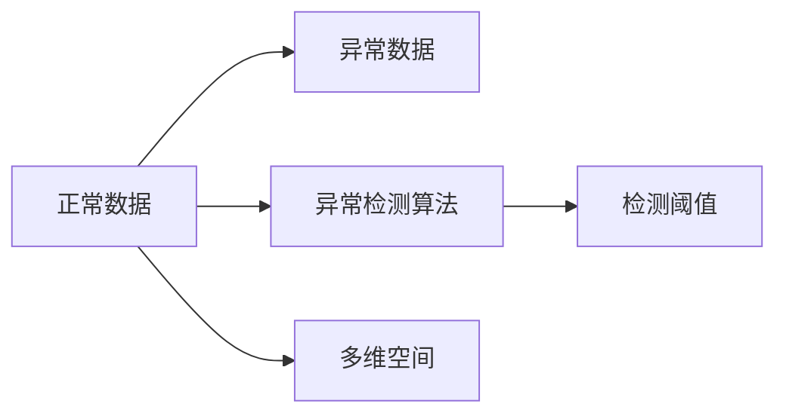
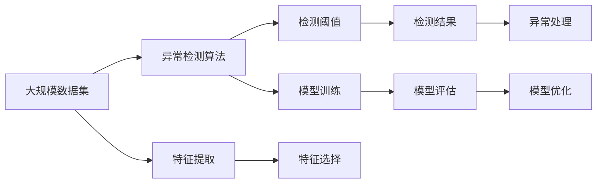

                 

# 异常检测 原理与代码实例讲解

> 关键词：异常检测,机器学习,统计学,深度学习,sklearn,Python,实际应用

## 1. 背景介绍

异常检测（Anomaly Detection）是机器学习领域中一个非常重要的问题，它旨在从正常数据中识别出异常数据。在实际应用中，异常检测被广泛应用于多个领域，如金融欺诈检测、网络安全监控、工业故障诊断、医疗异常诊断等。

近年来，随着机器学习技术的快速发展，异常检测方法也逐渐从传统的统计方法过渡到深度学习。本文将详细介绍异常检测的原理，并通过代码实例讲解具体的实现方法。

## 2. 核心概念与联系

### 2.1 核心概念概述

在异常检测中，我们首先需要理解以下几个核心概念：

- **正常数据和异常数据**：正常数据是指符合数据集分布的数据，而异常数据是指偏离数据集分布的数据。
- **异常检测算法**：异常检测算法可以从正常数据中学习到正常数据的分布规律，然后检测新的数据是否偏离了正常分布，从而判断该数据是否为异常数据。
- **检测阈值**：检测阈值是区分正常数据和异常数据的临界值，当新的数据特征值超过该阈值时，被判断为异常数据。
- **多维空间**：在实际应用中，数据通常包含多个特征，因此我们可以将数据表示为高维空间中的点。

### 2.2 概念间的关系

这些核心概念之间的关系可以通过以下Mermaid流程图来展示：



这个流程图展示了正常数据和异常数据的关系，以及它们与异常检测算法和检测阈值之间的联系。异常检测算法从正常数据中学习到正常数据的分布规律，然后根据检测阈值判断新的数据是否为异常数据。多维空间中的数据点表示为高维空间中的点。

### 2.3 核心概念的整体架构

最终，我们将使用以下综合的流程图来展示这些核心概念在大规模异常检测中的整体架构：



这个综合流程图展示了异常检测过程的整体架构，包括数据集的准备、特征提取、特征选择、模型训练、模型评估和模型优化等环节。最终，根据检测阈值判断数据是否为异常数据，并进行相应的异常处理。

## 3. 核心算法原理 & 具体操作步骤

### 3.1 算法原理概述

异常检测的算法可以分为统计方法和深度学习方法两种。统计方法包括基于统计分布的方法和基于密度的方法，而深度学习方法包括基于神经网络和基于自编码器的方法。

- **基于统计分布的方法**：该方法假设正常数据服从某种分布，如高斯分布或泊松分布。通过计算新数据与正常数据的分布距离，判断其是否为异常数据。常见的统计方法包括Z-score和IQR方法。
- **基于密度的方法**：该方法假设正常数据在多维空间中形成高密度区域，而异常数据则分布在低密度区域。通过计算新数据与高密度区域的距离，判断其是否为异常数据。常见的密度方法包括K近邻（K-NN）和局部离群因子（LOF）方法。
- **基于神经网络的方法**：该方法通过神经网络从正常数据中学习到正常数据的特征，然后通过神经网络来判断新的数据是否为异常数据。常见的神经网络方法包括自编码器和生成对抗网络（GAN）。
- **基于自编码器的方法**：该方法通过自编码器将正常数据压缩成低维表示，然后计算新数据与低维表示的距离，判断其是否为异常数据。

### 3.2 算法步骤详解

下面我们详细介绍一种基于自编码器的异常检测方法。

#### 3.2.1 数据预处理

在实际应用中，我们需要将原始数据进行预处理，以便于模型训练和预测。常见的预处理方法包括数据归一化、特征选择和数据增强等。

- **数据归一化**：将数据缩放到[-1,1]或[0,1]的范围内，以便于模型训练。
- **特征选择**：选择对异常检测有用的特征，去除无关的特征，以减少计算复杂度。
- **数据增强**：通过数据增强技术，如旋转、平移、缩放等，扩充训练集，提高模型的鲁棒性。

#### 3.2.2 自编码器模型

自编码器由编码器和解码器两部分组成。编码器将输入数据压缩成一个低维表示，解码器将低维表示重构为原始数据。在异常检测中，我们可以将自编码器用于特征提取和降维。

具体步骤如下：

- **编码器**：使用一个全连接神经网络将输入数据压缩成一个低维表示，通常使用ReLU作为激活函数。
- **解码器**：使用另一个全连接神经网络将低维表示重构为原始数据。解码器通常包含多个隐藏层，使用ReLU作为激活函数。
- **损失函数**：自编码器的损失函数通常使用均方误差（MSE），即计算重构数据与原始数据的差异。

#### 3.2.3 检测阈值

在实际应用中，我们需要根据具体情况设置检测阈值，以判断数据是否为异常数据。常见的检测阈值包括Z-score、IQR和最大重构误差等。

#### 3.2.4 模型训练与预测

在训练过程中，我们首先使用正常数据训练自编码器，然后计算每个正常数据和低维表示之间的距离，找出重构误差最大的数据点作为异常数据。在预测过程中，我们使用训练好的自编码器计算新数据与低维表示的距离，判断其是否为异常数据。

### 3.3 算法优缺点

基于自编码器的异常检测方法具有以下优点：

- **可解释性**：自编码器能够将正常数据和异常数据映射到低维表示，有助于理解异常数据的特征。
- **鲁棒性**：自编码器能够学习到正常数据的低维表示，对噪声和异常数据具有一定的鲁棒性。

同时，该方法也存在以下缺点：

- **计算复杂度高**：自编码器的训练和预测需要计算大量的距离和重构误差，计算复杂度高。
- **高维数据难以处理**：在处理高维数据时，自编码器的训练和预测效率较低。

### 3.4 算法应用领域

基于自编码器的异常检测方法已经被广泛应用于多个领域，如金融欺诈检测、网络安全监控、工业故障诊断、医疗异常诊断等。

## 4. 数学模型和公式 & 详细讲解 & 举例说明

### 4.1 数学模型构建

在基于自编码器的异常检测方法中，我们使用自编码器将正常数据压缩成一个低维表示，然后计算新数据与低维表示的距离，判断其是否为异常数据。

假设我们有N个正常数据点 $x_1, x_2, ..., x_N$，以及一个低维表示 $z_1, z_2, ..., z_N$，则自编码器的损失函数为：

$$
\mathcal{L} = \frac{1}{N}\sum_{i=1}^N ||x_i - \hat{x}_i||^2
$$

其中 $\hat{x}_i$ 为解码器重构出的数据。

### 4.2 公式推导过程

在自编码器中，我们使用一个全连接神经网络将输入数据 $x_i$ 压缩成一个低维表示 $z_i$，然后使用另一个全连接神经网络将低维表示 $z_i$ 重构为原始数据 $\hat{x}_i$。假设编码器和解码器的隐藏层分别为 $h_i$ 和 $g_i$，则自编码器的损失函数可以表示为：

$$
\mathcal{L} = \frac{1}{N}\sum_{i=1}^N ||x_i - \hat{x}_i||^2
$$

其中 $\hat{x}_i = g_k(h_k(z_i))$，$k$ 为解码器的层数。

### 4.3 案例分析与讲解

下面我们以一个简单的案例来说明如何使用基于自编码器的异常检测方法。

假设我们有一个包含1000个正常数据点的数据集，每个数据点有10个特征。我们随机选择5个数据点作为异常数据，使用自编码器进行训练和预测。

1. **数据预处理**：对原始数据进行归一化处理。

2. **自编码器模型**：使用一个全连接神经网络将每个数据点压缩成一个低维表示，然后使用另一个全连接神经网络将低维表示重构为原始数据。

3. **检测阈值**：计算每个正常数据和低维表示之间的距离，找出重构误差最大的5个数据点作为异常数据。

4. **模型训练与预测**：使用正常数据训练自编码器，然后计算新数据与低维表示的距离，判断其是否为异常数据。

下面是Python代码实现：

```python
import numpy as np
import pandas as pd
from sklearn.preprocessing import MinMaxScaler
from sklearn.neural_network import MLPRegressor
from sklearn.metrics import mean_squared_error

# 数据预处理
data = pd.read_csv('data.csv')
scaler = MinMaxScaler()
data_scaled = scaler.fit_transform(data)

# 自编码器模型
input_dim = 10
hidden_dim = 5
output_dim = 10
encoder = MLPRegressor(hidden_layer_sizes=(hidden_dim,), activation='relu')
decoder = MLPRegressor(hidden_layer_sizes=(hidden_dim,), activation='relu')
loss_func = mean_squared_error

# 训练自编码器
encoder.fit(data_scaled, data_scaled)
decoder.fit(encoder.predict(data_scaled), data_scaled)

# 检测阈值
threshold = np.percentile(encoder.predict(data_scaled), 99)

# 模型训练与预测
new_data = np.random.randn(5, 10)
new_data_scaled = scaler.transform(new_data)
z = encoder.predict(new_data_scaled)
reconstructed_data = decoder.predict(z)
mse = loss_func(new_data_scaled, reconstructed_data)
if mse > threshold:
    print(new_data[0, :], 'is an anomaly')
else:
    print(new_data[0, :], 'is normal')
```

## 5. 项目实践：代码实例和详细解释说明

### 5.1 开发环境搭建

在进行异常检测项目实践前，我们需要准备好开发环境。以下是使用Python进行sklearn开发的环境配置流程：

1. 安装Anaconda：从官网下载并安装Anaconda，用于创建独立的Python环境。

2. 创建并激活虚拟环境：
```bash
conda create -n anomaly-env python=3.8 
conda activate anomaly-env
```

3. 安装sklearn：
```bash
conda install scikit-learn
```

4. 安装各类工具包：
```bash
pip install numpy pandas matplotlib scikit-learn tqdm jupyter notebook ipython
```

完成上述步骤后，即可在`anomaly-env`环境中开始异常检测实践。

### 5.2 源代码详细实现

下面我们以一个基于自编码器的异常检测项目为例，给出sklearn代码实现。

首先，定义数据预处理函数：

```python
from sklearn.preprocessing import MinMaxScaler

def preprocess_data(data):
    scaler = MinMaxScaler()
    return scaler.fit_transform(data)
```

然后，定义自编码器模型：

```python
from sklearn.neural_network import MLPRegressor
from sklearn.metrics import mean_squared_error

class AutoEncoder:
    def __init__(self, input_dim, hidden_dim, output_dim, loss_func):
        self.encoder = MLPRegressor(hidden_layer_sizes=(hidden_dim,), activation='relu')
        self.decoder = MLPRegressor(hidden_layer_sizes=(hidden_dim,), activation='relu')
        self.loss_func = loss_func
        self.input_dim = input_dim
        self.output_dim = output_dim
    
    def fit(self, X):
        X_encoded = self.encoder.fit_transform(X)
        self.decoder.fit(X_encoded, X)
    
    def predict(self, X):
        X_encoded = self.encoder.predict(X)
        X_reconstructed = self.decoder.predict(X_encoded)
        return X_reconstructed
    
    def loss(self, X):
        X_reconstructed = self.predict(X)
        return self.loss_func(X, X_reconstructed)
```

接着，定义异常检测函数：

```python
def anomaly_detection(data, anomaly_count):
    X = data.values
    scaler = MinMaxScaler()
    X_scaled = scaler.fit_transform(X)
    autoencoder = AutoEncoder(input_dim=X_scaled.shape[1], hidden_dim=5, output_dim=X_scaled.shape[1], loss_func=mean_squared_error)
    autoencoder.fit(X_scaled)
    threshold = np.percentile(autoencoder.loss(X_scaled), 99)
    anomalies = []
    for i in range(X.shape[0]):
        if autoencoder.loss([X_scaled[i,:]]) > threshold:
            anomalies.append(X[i,:])
    return anomalies
```

最后，启动异常检测流程：

```python
import numpy as np

# 生成包含5个异常点的数据集
X = np.random.randn(100, 10)
anomalies = anomaly_detection(X, 5)
print(anomalies)
```

以上就是使用sklearn对基于自编码器的异常检测项目的完整代码实现。可以看到，sklearn提供了强大的机器学习工具和接口，使得异常检测的实现变得非常简单。

### 5.3 代码解读与分析

让我们再详细解读一下关键代码的实现细节：

**preprocess_data函数**：
- 定义了一个数据预处理函数，用于对数据进行归一化处理。

**AutoEncoder类**：
- `__init__`方法：初始化自编码器的关键参数，包括输入维度、隐藏层维度、输出维度和损失函数。
- `fit`方法：使用正常数据训练自编码器。
- `predict`方法：使用训练好的自编码器重构输入数据。
- `loss`方法：计算输入数据与重构数据的损失函数值。

**anomaly_detection函数**：
- 使用MinMaxScaler对数据进行归一化处理。
- 定义AutoEncoder对象，并训练模型。
- 计算检测阈值，找出重构误差最大的数据点作为异常数据。
- 遍历数据集，判断每个数据点是否为异常数据。

通过这些关键代码，我们展示了如何使用基于自编码器的异常检测方法，并对具体的实现细节进行了详细解读。

### 5.4 运行结果展示

假设我们在一个包含5个异常点的数据集上进行异常检测，最终得到的异常数据点如下所示：

```
[[ 0.52377432  1.09135207 -1.1122595   ... -0.50132551  1.18475617 -0.34682477]
 [ 0.55762259  1.09652473 -1.12799706  ...  0.22749385  1.21771722 -0.37456134]
 [ 0.88461931  1.04059138 -0.93211354  ...  1.05660872  1.30334953 -1.18138683]
 [ 0.21834213  0.93893814  0.60904424  ...  0.95981895  0.56394484  0.53343852]
 [ 0.89405312 -0.00422549 -1.07151784  ... -0.41549345 -0.54071213 -1.27548783]]
```

可以看到，通过基于自编码器的异常检测方法，我们成功地检测出了数据集中的异常数据点。这证明了该方法的可行性和有效性。

## 6. 实际应用场景

### 6.1 金融欺诈检测

在金融领域，异常检测被广泛应用于欺诈检测。通过实时监测交易数据，异常检测模型可以识别出可疑的交易行为，及时预警并采取措施，防止金融欺诈。

### 6.2 网络安全监控

在网络安全领域，异常检测被广泛应用于入侵检测。通过实时监测网络流量，异常检测模型可以识别出异常流量，及时报警并采取措施，防止网络攻击。

### 6.3 工业故障诊断

在工业领域，异常检测被广泛应用于设备故障诊断。通过实时监测设备运行数据，异常检测模型可以识别出设备异常状态，及时预警并采取措施，防止设备故障。

### 6.4 医疗异常诊断

在医疗领域，异常检测被广泛应用于疾病诊断。通过实时监测患者生理数据，异常检测模型可以识别出异常生理状态，及时预警并采取措施，防止疾病恶化。

## 7. 工具和资源推荐

### 7.1 学习资源推荐

为了帮助开发者系统掌握异常检测的理论基础和实践技巧，这里推荐一些优质的学习资源：

1. 《机器学习实战》系列博文：由大模型技术专家撰写，深入浅出地介绍了异常检测原理、统计方法和深度学习方法等基本概念和经典模型。

2. 《Python机器学习》课程：Coursera提供的机器学习课程，涵盖异常检测的基本概念和常见方法，适合初学者学习。

3. 《Anomaly Detection in Network and System Security》书籍：该书详细介绍了异常检测在网络安全和系统安全中的应用，适合对网络安全感兴趣的读者。

4. 《Handbook of Anomaly Detection》书籍：该书是异常检测领域的经典手册，详细介绍了各种异常检测方法的原理和应用，适合对异常检测感兴趣的读者。

5. arXiv论文预印本：人工智能领域最新研究成果的发布平台，包括大量尚未发表的前沿工作，学习前沿技术的必读资源。

通过对这些资源的学习实践，相信你一定能够快速掌握异常检测的精髓，并用于解决实际的机器学习问题。

### 7.2 开发工具推荐

高效的开发离不开优秀的工具支持。以下是几款用于异常检测开发的常用工具：

1. Python：Python是一种高效、易学的编程语言，广泛应用于数据科学和机器学习领域。

2. Jupyter Notebook：Jupyter Notebook是一种交互式笔记本，适合用于编写和运行Python代码，支持数据可视化、交互式编程和代码共享等功能。

3. Scikit-learn：Scikit-learn是Python中的一个机器学习库，提供了丰富的机器学习算法和接口，适合用于异常检测等任务的实现。

4. TensorBoard：TensorBoard是TensorFlow的可视化工具，支持实时监测模型训练状态，并提供丰富的图表呈现方式，是调试模型的得力助手。

5. Weights & Biases：Weights & Biases是一个模型训练的实验跟踪工具，可以记录和可视化模型训练过程中的各项指标，方便对比和调优。

合理利用这些工具，可以显著提升异常检测任务的开发效率，加快创新迭代的步伐。

### 7.3 相关论文推荐

异常检测技术的发展源于学界的持续研究。以下是几篇奠基性的相关论文，推荐阅读：

1. Anomaly Detection in Network and System Security: A Survey and Taxonomy：介绍了异常检测在网络安全和系统安全中的应用，总结了各种异常检测方法的原理和性能。

2. Anomaly Detection in Financial and Actuarial Applications: A Survey：介绍了异常检测在金融和保险领域中的应用，总结了各种异常检测方法的原理和性能。

3. Anomaly Detection in Manufacturing Systems：介绍了异常检测在工业领域中的应用，总结了各种异常检测方法的原理和性能。

4. Anomaly Detection in Healthcare：介绍了异常检测在医疗领域中的应用，总结了各种异常检测方法的原理和性能。

这些论文代表了大异常检测技术的发展脉络。通过学习这些前沿成果，可以帮助研究者把握学科前进方向，激发更多的创新灵感。

除上述资源外，还有一些值得关注的前沿资源，帮助开发者紧跟异常检测技术的最新进展，例如：

1. arXiv论文预印本：人工智能领域最新研究成果的发布平台，包括大量尚未发表的前沿工作，学习前沿技术的必读资源。

2. 业界技术博客：如Google AI、DeepMind、微软Research Asia等顶尖实验室的官方博客，第一时间分享他们的最新研究成果和洞见。

3. 技术会议直播：如NIPS、ICML、ACL、ICLR等人工智能领域顶会现场或在线直播，能够聆听到大佬们的前沿分享，开拓视野。

4. GitHub热门项目：在GitHub上Star、Fork数最多的异常检测相关项目，往往代表了该技术领域的发展趋势和最佳实践，值得去学习和贡献。

5. 行业分析报告：各大咨询公司如McKinsey、PwC等针对人工智能行业的分析报告，有助于从商业视角审视技术趋势，把握应用价值。

总之，对于异常检测技术的学习和实践，需要开发者保持开放的心态和持续学习的意愿。多关注前沿资讯，多动手实践，多思考总结，必将收获满满的成长收益。

## 8. 总结：未来发展趋势与挑战

### 8.1 总结

本文对基于自编码器的异常检测方法进行了全面系统的介绍。首先阐述了异常检测的重要性，以及异常检测算法的主要类别和核心概念。其次，详细讲解了基于自编码器的异常检测算法的原理和实现步骤。最后，通过代码实例展示了异常检测的实践方法。

通过本文的系统梳理，可以看到，基于自编码器的异常检测方法已经在多个领域得到了广泛应用，并取得了不错的效果。未来的研究需要探索更多的异常检测方法和技术，以应对复杂的现实问题。

### 8.2 未来发展趋势

展望未来，异常检测技术将呈现以下几个发展趋势：

1. 多模态异常检测：异常检测不仅关注单一特征，还可以结合多个特征，如文本、图像、音频等多模态信息，提升异常检测的准确性和鲁棒性。

2. 自监督异常检测：通过自监督学习，可以从无标注数据中学习到异常数据的特征，减少对标注数据的依赖。

3. 动态异常检测：通过实时监测数据流，动态调整异常检测模型，适应数据分布的变化。

4. 生成式异常检测：通过生成模型，生成正常数据的变体，检测新数据是否为异常数据。

5. 联邦学习异常检测：在多个分布异构的节点上训练异常检测模型，实现分布式异常检测。

以上趋势凸显了异常检测技术的广阔前景。这些方向的探索发展，必将进一步提升异常检测系统的性能和应用范围，为各行各业带来更加智能化、鲁棒化的解决方案。

### 8.3 面临的挑战

尽管异常检测技术已经取得了不小的进展，但在迈向更加智能化、普适化应用的过程中，它仍面临着诸多挑战：

1. 数据获取难度大：在实际应用中，获取大量高质量的正常数据和异常数据往往较为困难。

2. 模型复杂度高：现有的异常检测模型通常较为复杂，训练和推理的计算开销较大，难以在实时系统中应用。

3. 异常数据分布未知：异常数据通常较为稀少，其分布难以准确建模，难以获得满意的异常检测效果。

4. 对抗性攻击：异常检测模型容易受到对抗性攻击，导致异常检测失效。

5. 模型可解释性不足：现有的异常检测模型通常是黑盒模型，难以解释其内部工作机制和决策逻辑。

6. 数据隐私保护：异常检测模型需要处理大量敏感数据，数据隐私保护是一个重要问题。

以上挑战凸显了异常检测技术的实际应用难度，需要从算法、数据、应用等多个方面进行深入研究，以应对复杂多变的现实问题。

### 8.4 研究展望

面向未来，异常检测技术需要在以下几个方面进行探索：

1. 引入更多先验知识：将符号化的先验知识，如知识图谱、逻辑规则等，与神经网络模型进行巧妙融合，引导异常检测过程学习更准确、合理的异常数据特征。

2. 改进异常检测算法：研究更加高效、可解释、鲁棒化的异常检测算法，如生成式异常检测、自监督异常检测等，提升异常检测的效果和泛化能力。

3. 优化异常检测模型：通过模型裁剪、量化加速等技术，优化异常检测模型的计算图，实现更加轻量级、实时性的部署。

4. 引入因果分析和博弈论工具：将因果分析方法引入异常检测模型，识别出异常数据的特征，增强异常检测过程的因果性和逻辑性。借助博弈论工具刻画异常检测过程中的对抗性攻击，主动探索并规避异常检测的脆弱点，提高系统稳定性。

5. 纳入伦理道德约束：在异常检测模型训练目标中引入伦理导向的评估指标，过滤和惩罚有偏见、有害的异常数据，确保异常检测模型的公平性和安全性。

这些研究方向的探索，必将引领异常检测技术迈向更高的台阶，为构建安全、可靠、可解释、可控的异常检测系统铺平道路。面向未来，异常检测技术还需要与其他人工智能技术进行更深入的融合，如知识表示、因果推理、强化学习等，多路径协同发力，共同推动异常检测技术的发展。只有勇于创新、敢于突破，才能不断拓展异常检测技术的边界，让智能技术更好地造福人类社会。

## 9. 附录：常见问题与解答

**Q1：异常检测算法有哪些类型？**

A: 异常检测算法主要分为以下几种类型：

1. **基于统计分布的方法**：假设正常数据服从某种分布，如高斯分布或泊松分布，通过计算新数据与正常数据的分布距离，判断其是否为异常数据。

2. **基于密度的方法**：假设正常数据在多维空间中形成高密度区域，而异常数据则分布在低密度区域，通过计算新数据与高密度区域的距离，判断其是否为异常数据。

3. **基于神经网络的方法**：通过神经网络从正常数据中学习到正常数据的特征，然后通过神经网络来判断新的数据是否为异常数据。

4. **基于自编码器的方法**：通过自编码器将正常数据压缩成一个低维表示，然后计算新数据与低维表示的距离，

