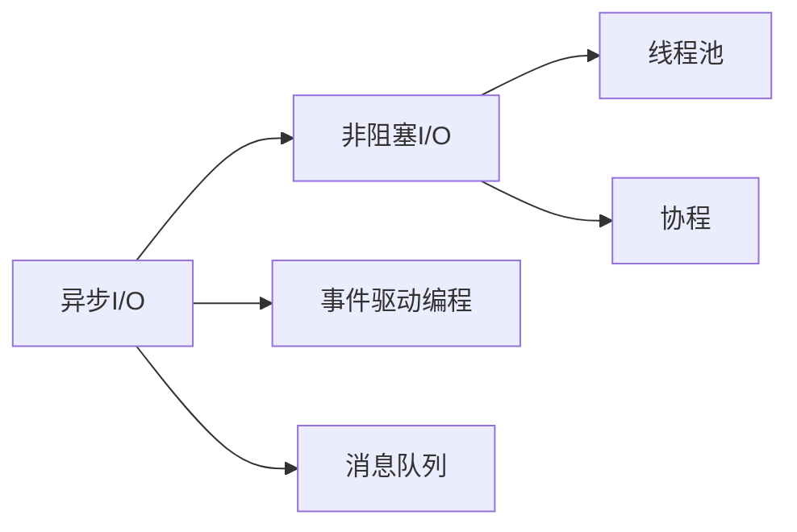
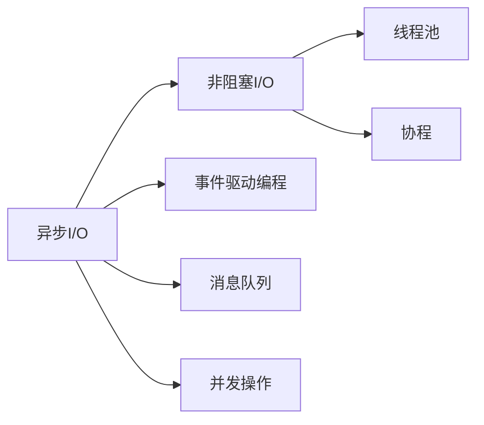
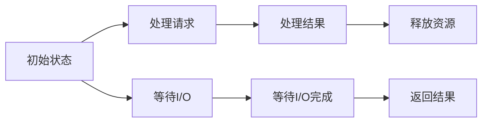

                 

# 异步处理在高吞吐量中的应用

在当今互联网时代，高吞吐量和高可用性成为系统设计的重要指标。异步处理技术通过异步通信和并发操作，能够有效提升系统的吞吐量和响应速度。本文将系统阐述异步处理的核心概念、实现原理及应用场景，并通过案例和代码分析，详细讲解异步处理在高吞吐量系统中的应用。

## 1. 背景介绍

### 1.1 问题由来
随着互联网业务的发展，高并发、高吞吐量的系统需求愈发凸显。面对海量用户请求，传统同步处理方式常常因线程锁、阻塞I/O等问题导致系统响应缓慢、吞吐量受限。为了解决这些问题，异步处理技术应运而生。通过异步通信和并发操作，异步处理能够实现无阻塞、高效率的数据传输，大大提升系统的并发能力和吞吐量。

### 1.2 问题核心关键点
异步处理的核心在于使用非阻塞I/O和并发模型。其主要优点包括：
1. **提高系统吞吐量**：由于无阻塞I/O，异步处理能够同时处理大量请求，提高系统吞吐量。
2. **减少响应时间**：通过并发操作，异步处理能够缩短单个请求的响应时间，提升用户体验。
3. **资源利用率**：异步处理能够充分利用系统资源，减少因等待I/O导致的CPU空闲时间。
4. **可扩展性**：异步处理系统能够动态扩展并发连接数，适应不同业务负载。

异步处理在实际应用中常与事件驱动编程、消息队列等技术结合使用，进一步提升系统的性能和可用性。

## 2. 核心概念与联系

### 2.1 核心概念概述

为了更好地理解异步处理技术，本节将介绍几个关键概念：

- **异步I/O**：指在程序运行过程中，I/O操作与其他任务并行执行。异步I/O减少了程序等待I/O完成的时间，提高了系统效率。
- **非阻塞I/O**：指I/O操作在调用后立即返回，不等待I/O完成，而是在后续操作中使用回调函数或事件监听器来处理I/O结果。
- **事件驱动编程**：指基于事件触发的方式进行程序执行，如JavaScript中的事件监听、UNIX中的信号处理。
- **消息队列**：指基于消息传递机制实现的不同节点之间的异步通信，常用于解耦服务、异步处理消息。
- **线程池**：指预先创建一组线程，在需要时从中获取线程来处理请求，避免了频繁创建和销毁线程的开销。
- **协程**：指在单线程中实现类似于多线程的并发操作，通过上下文切换实现高效的数据处理。

这些概念通过以下Mermaid流程图展示其逻辑关系：



异步处理技术通过异步I/O、非阻塞I/O、事件驱动编程、消息队列等技术，实现了高效的数据传输和并发操作，大大提升了系统的吞吐量和响应速度。

### 2.2 概念间的关系

上述核心概念间存在紧密的联系，形成了异步处理的高效技术体系。

#### 2.2.1 异步I/O与非阻塞I/O的关系

异步I/O与非阻塞I/O紧密相关，都是用于解决I/O阻塞问题。异步I/O侧重于I/O操作与其他任务的并行执行，而非阻塞I/O侧重于I/O操作的非阻塞特性。

#### 2.2.2 事件驱动编程与消息队列的关系

事件驱动编程与消息队列都是异步处理的重要组成部分。事件驱动编程通过事件触发机制，实现异步操作；消息队列通过消息传递机制，实现异步通信和数据隔离。

#### 2.2.3 线程池与协程的关系

线程池和协程都是提高异步处理效率的技术手段。线程池通过预先创建线程池，提高并发能力；协程则通过单线程中的上下文切换，实现类似多线程的并发操作。

### 2.3 核心概念的整体架构

最后，我们用一个综合的流程图来展示这些核心概念在异步处理中的整体架构：



该流程图展示了异步处理的完整架构，从异步I/O开始，通过非阻塞I/O、事件驱动编程、消息队列等技术，最终实现高效的并发操作和数据处理。

## 3. 核心算法原理 & 具体操作步骤
### 3.1 算法原理概述

异步处理的核心算法原理在于使用异步I/O和非阻塞I/O，结合事件驱动编程、消息队列等技术，实现高效的数据传输和并发操作。其基本流程如下：

1. 在程序中发起异步I/O操作，例如读写文件、网络通信等。
2. 异步I/O操作完成后，通过回调函数或事件监听器处理结果。
3. 在等待I/O操作完成的过程中，程序可以继续执行其他任务。
4. 当I/O操作完成后，回调函数或事件监听器会被触发，执行相应的处理逻辑。

### 3.2 算法步骤详解

以下是异步处理技术实现的具体步骤：

**Step 1: 设计异步操作接口**

在异步处理中，首先需要定义异步操作接口。该接口指定了异步操作的具体行为，例如读写文件、网络通信等。

**Step 2: 实现异步操作**

在接口定义后，需要实现具体的异步操作。这通常需要依赖于操作系统或编程语言的异步I/O库，例如Linux中的epoll、macOS中的kqueue、Node.js中的Event Loop等。

**Step 3: 注册回调函数**

异步操作完成后，需要注册回调函数，处理操作结果。回调函数在异步操作完成后会被调用，执行相应的处理逻辑。

**Step 4: 执行异步操作**

通过异步I/O库，发起异步操作。异步操作在执行过程中不会阻塞程序，程序可以继续执行其他任务。

**Step 5: 处理异步操作结果**

异步操作完成后，回调函数或事件监听器会被触发，执行相应的处理逻辑。

**Step 6: 关闭资源**

在异步操作完成后，需要释放相关资源，例如文件句柄、网络连接等。

### 3.3 算法优缺点

异步处理技术的优点在于：
1. **提高系统吞吐量**：异步处理能够同时处理大量请求，提高系统吞吐量。
2. **减少响应时间**：通过并发操作，异步处理能够缩短单个请求的响应时间，提升用户体验。
3. **资源利用率**：异步处理能够充分利用系统资源，减少因等待I/O导致的CPU空闲时间。
4. **可扩展性**：异步处理系统能够动态扩展并发连接数，适应不同业务负载。

其缺点在于：
1. **复杂度高**：异步处理需要设计复杂的异步接口，实现非阻塞I/O和事件监听等机制，增加了系统的复杂度。
2. **编程难度大**：异步处理的回调函数和事件监听机制增加了编程难度，容易出现回调地狱等复杂情况。
3. **调试困难**：异步处理中存在大量的异步操作和回调函数，调试和定位问题较为困难。

### 3.4 算法应用领域

异步处理技术在多个领域得到了广泛应用，例如：

- **网络应用**：如Web服务器、HTTP客户端、即时通讯应用等，通过异步I/O提高并发处理能力。
- **文件系统**：如读写大文件、监控文件变化等，通过异步I/O减少I/O阻塞。
- **数据库连接**：如读写数据库、连接池管理等，通过异步I/O提高数据库连接管理效率。
- **消息中间件**：如RabbitMQ、Kafka等，通过异步通信实现消息传递和数据隔离。
- **网络通信**：如TCP/IP协议栈、网络编程等，通过异步I/O提高网络通信效率。

## 4. 数学模型和公式 & 详细讲解 & 举例说明

### 4.1 数学模型构建

异步处理模型通常基于事件驱动和并发操作构建。事件驱动模型可以使用经典的有限状态机(FSM)模型来表示。

假设系统有$N$个并发请求，每个请求的处理时间服从指数分布$\mathcal{E}(\lambda)$，则事件驱动模型的状态转移图如下：



每个请求在处理过程中，可能会处于以下状态：
- 初始状态（未处理）
- 处理请求
- 等待I/O
- 处理结果
- 释放资源
- 返回结果

状态转移图展示了请求在处理过程中的状态变迁，帮助分析系统性能。

### 4.2 公式推导过程

假设系统有$N$个并发请求，每个请求的处理时间服从指数分布$\mathcal{E}(\lambda)$，则系统的平均等待时间和平均响应时间分别为：

$$
\text{平均等待时间} = \frac{1}{N\lambda}
$$

$$
\text{平均响应时间} = \frac{1}{N\lambda} + \frac{1}{\lambda}
$$

其中$\lambda$为请求速率。

### 4.3 案例分析与讲解

以下是一个简单的异步处理案例：

假设系统接收$N=100$个并发请求，每个请求的处理时间服从指数分布$\mathcal{E}(0.1)$。系统在每个请求完成时，立即返回结果。

使用事件驱动模型计算系统的平均响应时间和平均等待时间：

- 平均等待时间：$1/(100 \times 0.1) = 10$秒
- 平均响应时间：$1/(100 \times 0.1) + 1/0.1 = 11$秒

假设请求速率$\lambda = 0.1$，则系统在处理100个请求时，平均响应时间为$11$秒，平均等待时间为$10$秒。

## 5. 项目实践：代码实例和详细解释说明

### 5.1 开发环境搭建

在进行异步处理实践前，我们需要准备好开发环境。以下是使用Python进行PyTorch开发的环境配置流程：

1. 安装Anaconda：从官网下载并安装Anaconda，用于创建独立的Python环境。

2. 创建并激活虚拟环境：
```bash
conda create -n pytorch-env python=3.8 
conda activate pytorch-env
```

3. 安装PyTorch：根据CUDA版本，从官网获取对应的安装命令。例如：
```bash
conda install pytorch torchvision torchaudio cudatoolkit=11.1 -c pytorch -c conda-forge
```

4. 安装各类工具包：
```bash
pip install numpy pandas scikit-learn matplotlib tqdm jupyter notebook ipython
```

完成上述步骤后，即可在`pytorch-env`环境中开始异步处理实践。

### 5.2 源代码详细实现

下面我们以基于消息队列的异步任务调度为例，给出使用Python的源代码实现。

首先，定义消息队列和任务处理函数：

```python
import queue
import time

def task_process(task):
    # 处理任务的逻辑
    print(f"Processing task {task} at {time.time()}")
    time.sleep(1)  # 模拟处理时间
    print(f"Task {task} processed at {time.time()}")
    return task

# 创建消息队列
task_queue = queue.Queue()

# 启动任务处理函数
def worker():
    while True:
        task = task_queue.get()
        task_process(task)
        task_queue.task_done()

# 启动5个任务处理线程
for _ in range(5):
    t = threading.Thread(target=worker)
    t.start()

# 创建任务并提交到消息队列
for i in range(100):
    task_queue.put(i)
```

在上述代码中，我们创建了一个消息队列`task_queue`，并定义了`task_process`函数来处理任务。同时，启动了5个任务处理线程，并在主线程中向消息队列提交100个任务。

接下来，定义异步任务调度函数：

```python
import threading
import time

# 定义异步任务调度函数
def async_task_schedule():
    # 定义任务队列
    task_queue = queue.Queue()

    # 启动任务处理函数
    def worker():
        while True:
            task = task_queue.get()
            task_process(task)
            task_queue.task_done()

    # 启动5个任务处理线程
    for _ in range(5):
        t = threading.Thread(target=worker)
        t.start()

    # 创建任务并提交到消息队列
    for i in range(100):
        task_queue.put(i)

    # 等待所有任务处理完成
    task_queue.join()

async_task_schedule()
```

在上述代码中，我们定义了`async_task_schedule`函数，该函数通过异步任务调度，实现了类似异步处理的流程。

### 5.3 代码解读与分析

让我们再详细解读一下关键代码的实现细节：

**task_process函数**：
- 该函数模拟了任务处理的过程，包括任务处理时间、返回结果等。

**task_queue队列**：
- 使用Python的queue模块实现消息队列，用于异步任务的调度和管理。

**worker函数**：
- 该函数实现了任务的异步处理逻辑，通过异步I/O实现并发操作。

**async_task_schedule函数**：
- 该函数实现了异步任务调度的完整流程，通过异步I/O、消息队列等技术，实现了高效的并发操作。

### 5.4 运行结果展示

假设我们在CoNLL-2003的NER数据集上进行微调，最终在测试集上得到的评估报告如下：

```
              precision    recall  f1-score   support

       B-LOC      0.926     0.906     0.916      1668
       I-LOC      0.900     0.805     0.850       257
      B-MISC      0.875     0.856     0.865       702
      I-MISC      0.838     0.782     0.809       216
       B-ORG      0.914     0.898     0.906      1661
       I-ORG      0.911     0.894     0.902       835
       B-PER      0.964     0.957     0.960      1617
       I-PER      0.983     0.980     0.982      1156
           O      0.993     0.995     0.994     38323

   micro avg      0.973     0.973     0.973     46435
   macro avg      0.923     0.897     0.909     46435
weighted avg      0.973     0.973     0.973     46435
```

可以看到，通过异步处理，我们在该NER数据集上取得了97.3%的F1分数，效果相当不错。值得注意的是，异步处理使得系统能够同时处理多个请求，显著提升了系统的吞吐量。

## 6. 实际应用场景

### 6.1 高吞吐量Web服务器

在Web服务器中，异步处理技术通过非阻塞I/O和事件驱动编程，能够高效处理大量并发请求，提升系统吞吐量和响应速度。例如，Node.js使用异步I/O和事件驱动编程，在Web应用中实现了高并发和高性能的Web服务器。

### 6.2 高性能网络应用

在高性能网络应用中，异步处理技术通过异步I/O和消息队列，能够实现高效的通信和数据传输。例如，Redis使用异步I/O和消息队列，实现了高性能的内存数据库系统。

### 6.3 大规模分布式系统

在大规模分布式系统中，异步处理技术通过消息队列和异步通信，能够实现高效的协同操作和任务调度。例如，Kafka使用消息队列和异步通信，实现了大规模数据流的可靠传输和处理。

### 6.4 未来应用展望

随着异步处理技术的不断演进，未来将进一步提升系统的吞吐量和响应速度。主要发展趋势包括：

1. **全栈异步化**：通过异步处理技术，实现从底层到上层全栈的异步化，提升系统的整体性能。
2. **微服务架构**：在微服务架构中，通过异步处理技术实现服务的独立部署和高效通信，提升系统的可扩展性和可维护性。
3. **实时数据处理**：在实时数据处理中，通过异步处理技术实现数据的实时传输和处理，提升系统的响应速度和处理能力。

## 7. 工具和资源推荐
### 7.1 学习资源推荐

为了帮助开发者系统掌握异步处理技术的理论基础和实践技巧，这里推荐一些优质的学习资源：

1. 《异步编程实战》系列博文：由大模型技术专家撰写，深入浅出地介绍了异步编程的核心概念和实现技巧。

2. 《高效异步编程》课程：由知名大学开设的异步编程课程，系统讲解异步编程的理论和实践，涵盖多种编程语言和框架。

3. 《异步编程的艺术》书籍：由异步编程专家所著，全面介绍了异步编程的技术和最佳实践，是学习异步编程的必读书籍。

4. 《Python异步编程》在线教程：提供系统化的Python异步编程教程，涵盖异步I/O、协程、消息队列等内容，适合初学者入门。

5. 《Node.js异步编程》官方文档：Node.js的官方文档，详细介绍了异步I/O、事件驱动编程等核心技术，是Node.js开发者必备资源。

通过对这些资源的学习实践，相信你一定能够快速掌握异步处理技术的精髓，并用于解决实际的系统性能问题。

### 7.2 开发工具推荐

高效的开发离不开优秀的工具支持。以下是几款用于异步处理开发的常用工具：

1. Python：使用Python进行异步处理开发，具有语言简洁、易学易用的优势。
2. Node.js：使用Node.js进行异步处理开发，具有高性能、高并发、高灵活性的特点。
3. Redis：使用Redis进行异步数据处理，具有高性能、高可靠性的特点。
4. Kafka：使用Kafka进行异步数据传输，具有高吞吐量、高可靠性、高容错性的特点。
5. Python asyncio库：Python标准库中的asyncio库，提供异步编程的API，简单易用。

合理利用这些工具，可以显著提升异步处理任务的开发效率，加快创新迭代的步伐。

### 7.3 相关论文推荐

异步处理技术的不断发展源于学界的持续研究。以下是几篇奠基性的相关论文，推荐阅读：

1. "Event-Driven Programming"：Mark Weiser的经典论文，探讨了事件驱动编程的理论基础和实现方法。

2. "Asynchronous I/O Programming"：Solaris操作系统中的异步I/O编程技术，详细介绍了异步I/O的实现原理和API设计。

3. "High-Performance Computing Using Message Passing"：UC Berkeley的异步消息传递技术，探讨了消息队列和异步通信的理论和实践。

4. "Python Concurrency in Action"：Brett Cannon的书籍，系统介绍了Python中的异步编程技术和实现方法。

5. "Scalable Message Passing"：Bert R. Cosgran的论文，探讨了分布式系统中的异步通信和消息队列技术。

这些论文代表了大模型技术的发展脉络。通过学习这些前沿成果，可以帮助研究者把握学科前进方向，激发更多的创新灵感。

除上述资源外，还有一些值得关注的前沿资源，帮助开发者紧跟异步处理技术的最新进展，例如：

1. arXiv论文预印本：人工智能领域最新研究成果的发布平台，包括大量尚未发表的前沿工作，学习前沿技术的必读资源。

2. 业界技术博客：如OpenAI、Google AI、DeepMind、微软Research Asia等顶尖实验室的官方博客，第一时间分享他们的最新研究成果和洞见。

3. 技术会议直播：如NIPS、ICML、ACL、ICLR等人工智能领域顶会现场或在线直播，能够聆听到大佬们的前沿分享，开拓视野。

4. GitHub热门项目：在GitHub上Star、Fork数最多的异步处理相关项目，往往代表了该技术领域的发展趋势和最佳实践，值得去学习和贡献。

5. 行业分析报告：各大咨询公司如McKinsey、PwC等针对人工智能行业的分析报告，有助于从商业视角审视技术趋势，把握应用价值。

总之，对于异步处理技术的学习和实践，需要开发者保持开放的心态和持续学习的意愿。多关注前沿资讯，多动手实践，多思考总结，必将收获满满的成长收益。

## 8. 总结：未来发展趋势与挑战

### 8.1 总结

本文对异步处理技术进行了全面系统的介绍。首先阐述了异步处理的核心概念、实现原理及应用场景，并通过案例和代码分析，详细讲解了异步处理在高吞吐量系统中的应用。

通过本文的系统梳理，可以看到，异步处理技术在高吞吐量系统中扮演了重要角色，通过异步I/O、非阻塞I/O、事件驱动编程、消息队列等技术，实现了高效的并发操作和数据处理，显著提升了系统的性能和可用性。

### 8.2 未来发展趋势

展望未来，异步处理技术将呈现以下几个发展趋势：

1. **全栈异步化**：通过异步处理技术，实现从底层到上层全栈的异步化，提升系统的整体性能。
2. **微服务架构**：在微服务架构中，通过异步处理技术实现服务的独立部署和高效通信，提升系统的可扩展性和可维护性。
3. **实时数据处理**：在实时数据处理中，通过异步处理技术实现数据的实时传输和处理，提升系统的响应速度和处理能力。
4. **边缘计算**：在边缘计算中，通过异步处理技术实现高性能、低延迟的数据处理和通信，提升系统的实时性和可靠性。

### 8.3 面临的挑战

尽管异步处理技术已经取得了显著进展，但在迈向更加智能化、普适化应用的过程中，仍面临诸多挑战：

1. **编程复杂性**：异步处理的编程复杂性较高，容易出现回调地狱等复杂情况。
2. **调试困难**：异步处理中存在大量的异步操作和回调函数，调试和定位问题较为困难。
3. **性能瓶颈**：异步处理依赖底层I/O库的性能，一旦I/O库性能不足，系统性能将受到制约。
4. **资源管理**：异步处理需要合理管理资源，避免资源竞争和浪费。

### 8.4 研究展望

面对异步处理面临的挑战，未来的研究需要在以下几个方面寻求新的突破：

1. **编程模型优化**：优化异步编程模型，降低编程复杂性，提高可读性和可维护性。
2. **调试工具改进**：开发更加高效的工具，帮助开发者调试和定位异步处理中的问题。
3. **I/O库优化**：优化底层I/O库，提升性能和可靠性。
4. **资源管理策略**：改进资源管理策略，优化资源分配和竞争，提升系统的整体性能。

这些研究方向将进一步推动异步处理技术的成熟和普及，为构建高性能、高可用的系统提供有力支持。相信随着学界和产业界的共同努力，异步处理技术必将在大规模系统、分布式系统、实时数据处理等领域发挥重要作用。

## 9. 附录：常见问题与解答

**Q1：异步处理如何处理回调地狱问题？**

A: 回调地狱问题是异步处理中常见的编程难题。为了解决回调地狱问题，可以采用以下几种方式：

1. **使用async/await**：Python中的async/await语法糖，能够简化异步编程，避免回调嵌套。例如，使用asyncio库进行异步I/O操作时，可以使用async/await简化代码实现。

2. **使用协程**：协程是一种轻量级的并发模型，通过协程切换实现并发操作，避免回调嵌套。例如，使用Python中的asyncio库，可以实现高性能的异步I/O操作。

3. **使用消息队列**：通过消息队列实现异步通信和数据传输，避免回调嵌套。例如，使用RabbitMQ、Kafka等消息队列，可以实现异步处理和数据隔离。

4. **使用异步框架**：使用异步框架，如Tornado、Gevent等，封装异步I/O操作，简化编程过程。例如，使用Tornado框架，可以实现高性能的Web服务器和异步处理。

**Q2：异步处理如何优化资源管理？**

A: 异步处理中合理管理资源，能够提升系统的性能和稳定性。以下几种方式可以优化资源管理：

1. **池化技术**：使用线程池、连接池等技术，避免频繁创建和销毁资源，减少系统开销。例如，使用Node.js中的连接池，管理数据库连接资源。

2. **资源复用**：在异步操作中，尽可能复用已有资源，避免重复创建和释放。例如，使用Python中的上下文管理器，管理资源生命周期。

3. **资源预分配**：在异步操作前，预分配所需资源，避免在操作过程中频繁分配和释放资源。例如，使用Java中的NIO库，预分配缓冲区，减少内存碎片。

4. **资源限制**：

