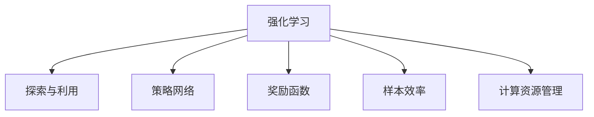
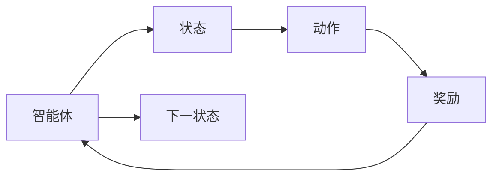
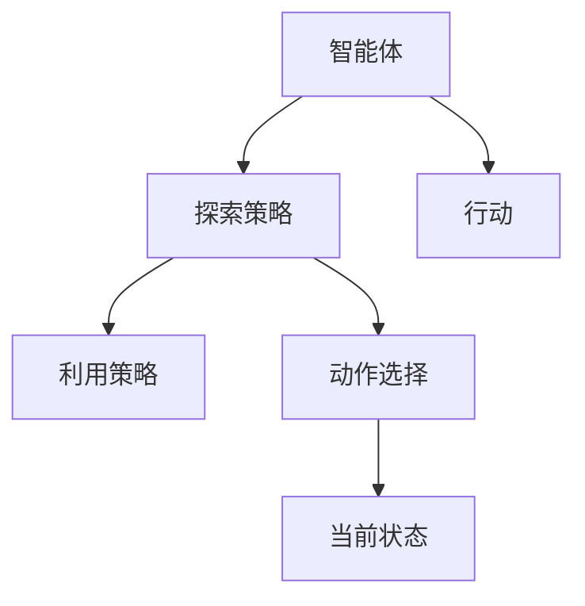
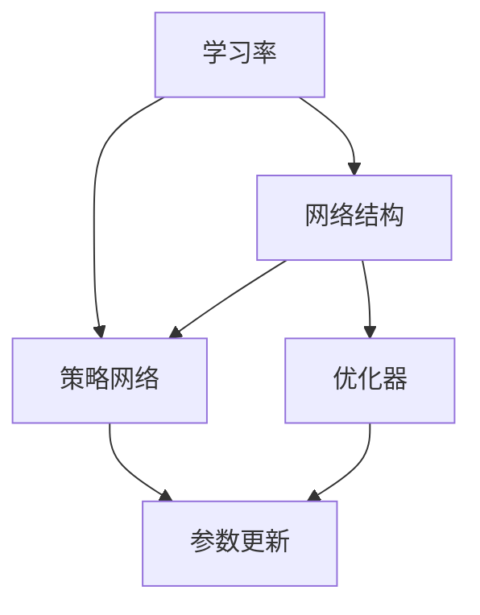
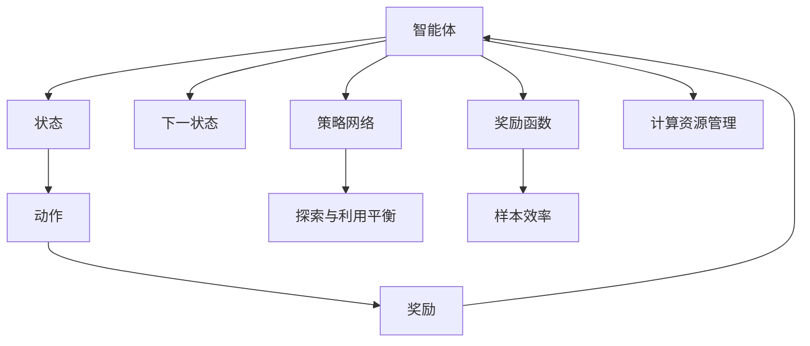

                 

# 强化学习Reinforcement Learning的学习效率与资源管理策略

> 关键词：强化学习, 学习效率, 资源管理策略, 深度强化学习, 算法优化, 策略网络, 奖励函数

## 1. 背景介绍

### 1.1 问题由来
强化学习（Reinforcement Learning, RL）是一类重要的机器学习技术，其核心思想是通过智能体（agent）与环境的交互，在不断探索和试错中学习最优策略，实现特定目标。在机器人控制、游戏AI、自动驾驶、推荐系统等多个领域，RL技术都表现出了强大的应用潜力。然而，RL算法的复杂度较高，训练耗时较长，如何提高学习效率，优化资源管理，成为了当前研究的热点问题。

### 1.2 问题核心关键点
强化学习算法学习效率的提升主要依赖于以下几个关键点：

- 探索与利用的平衡（Exploration-Exploitation Trade-off）：智能体需要在探索未知动作空间的同时，利用已有经验，做出最优决策。
- 参数的合理调整：学习率、网络结构、优化器等参数设置，直接影响学习效率和模型性能。
- 样本的有效利用：如何高效地利用训练样本，避免过拟合和数据浪费。
- 计算资源的管理：GPU、TPU等计算资源，如何优化分配，确保训练的连续性和稳定性。

### 1.3 问题研究意义
强化学习算法学习效率的提升，对优化资源管理、加速模型训练、降低计算成本具有重要意义：

1. **优化资源管理**：合理分配计算资源，降低能耗，提高系统利用率。
2. **加速模型训练**：提高训练效率，缩短学习时间，加快模型迭代。
3. **降低计算成本**：减少硬件投入，降低运营成本，提高经济效益。

## 2. 核心概念与联系

### 2.1 核心概念概述

为更好地理解强化学习中学习效率与资源管理策略，本节将介绍几个密切相关的核心概念：

- **强化学习**：通过智能体与环境的交互，学习最优策略以达成目标。
- **探索与利用**：智能体需要在探索未知动作的同时，利用已知经验。
- **策略网络**：智能体通过策略网络选择动作，学习最优策略。
- **奖励函数**：定义智能体在每个状态下的奖励值，指导学习方向。
- **样本效率**：智能体利用样本的能力，影响学习效率和收敛速度。
- **计算资源管理**：合理分配GPU、TPU等计算资源，优化训练流程。

这些核心概念之间的逻辑关系可以通过以下Mermaid流程图来展示：



这个流程图展示了强化学习算法中各关键组件之间的关系：

1. 强化学习算法通过智能体与环境的交互，学习最优策略。
2. 策略网络帮助智能体在探索与利用的平衡中，选择最优动作。
3. 奖励函数定义了智能体的目标，指导学习方向。
4. 样本效率决定了智能体利用样本的能力，影响学习效率。
5. 计算资源管理确保了算法的连续性和稳定性。

### 2.2 概念间的关系

这些核心概念之间存在着紧密的联系，形成了强化学习的完整生态系统。下面我通过几个Mermaid流程图来展示这些概念之间的关系。

#### 2.2.1 强化学习算法流程



这个流程图展示了强化学习的基本流程：

1. 智能体从当前状态$S_t$出发，选择一个动作$A_t$。
2. 环境根据动作产生下一个状态$S_{t+1}$和奖励$R_{t+1}$。
3. 智能体观察新状态$S_{t+1}$，返回循环。

#### 2.2.2 探索与利用的平衡



这个流程图展示了智能体在探索与利用之间的平衡：

1. 智能体在探索策略$ \pi_{explore}$和利用策略$ \pi_{exploit}$之间进行选择。
2. 探索策略引导智能体选择未知动作，利用策略指导智能体选择已知动作。
3. 智能体根据当前策略$ \pi_t$选择动作，并观察环境反馈。

#### 2.2.3 参数优化策略



这个流程图展示了强化学习中参数优化的关键点：

1. 学习率决定了参数更新的速度。
2. 网络结构影响模型的复杂度和训练效率。
3. 优化器决定参数更新的方式，影响学习效果。

### 2.3 核心概念的整体架构

最后，我们用一个综合的流程图来展示这些核心概念在大强化学习算法中的整体架构：



这个综合流程图展示了从智能体与环境交互到参数优化，再到资源管理的完整流程。通过这些流程图，我们可以更清晰地理解强化学习算法中各组件之间的关系和作用，为后续深入讨论具体的学习效率与资源管理策略奠定基础。

## 3. 核心算法原理 & 具体操作步骤
### 3.1 算法原理概述

强化学习中的学习效率和资源管理策略，主要通过以下几个方面实现：

- 探索与利用的平衡：合理设计探索策略和利用策略，确保智能体在探索与利用之间找到最佳平衡点。
- 参数的合理调整：选择合适的学习率、网络结构和优化器，优化模型参数更新过程。
- 样本的有效利用：设计高效的数据采集和处理策略，确保训练样本的有效性。
- 计算资源的管理：合理分配计算资源，优化算法流程，确保训练的连续性和稳定性。

### 3.2 算法步骤详解

强化学习中提高学习效率和优化资源管理，主要通过以下步骤实现：

**Step 1: 定义状态和动作空间**

1. 确定智能体的状态空间$S$和动作空间$A$。状态通常为智能体在环境中的位置、时间等信息，动作可以是智能体的操作、策略选择等。

**Step 2: 定义奖励函数**

1. 设计合适的奖励函数$R(S_t,A_t)$，指导智能体学习最优策略。奖励函数应具备简单、明确、公平等特性。

**Step 3: 设计探索与利用策略**

1. 选择探索策略$ \pi_{explore}$，使智能体在探索未知动作时，有一定的随机性。
2. 选择利用策略$ \pi_{exploit}$，使智能体在利用已知经验时，能够选择最优动作。

**Step 4: 初始化策略网络**

1. 设计策略网络$ \pi_{\theta}(A|S)$，将状态映射到动作的概率分布。
2. 选择合适的初始化策略，如随机策略、均匀策略等。

**Step 5: 优化参数**

1. 选择合适的优化器，如梯度下降法、Adam等，更新策略网络的参数$\theta$。
2. 合理调整学习率$\eta$，选择合适的衰减策略，如固定学习率、自适应学习率等。

**Step 6: 样本采集和处理**

1. 设计高效的数据采集策略，确保样本的多样性和覆盖性。
2. 处理样本，避免过拟合和数据浪费。

**Step 7: 计算资源管理**

1. 合理分配GPU、TPU等计算资源，确保训练的连续性和稳定性。
2. 优化算法流程，减少计算资源的浪费。

### 3.3 算法优缺点

强化学习算法的学习效率和资源管理策略，具有以下优缺点：

**优点**：

- 能够处理动态环境和复杂动作空间。
- 具有较强的泛化能力和适应性。
- 能够优化资源管理，降低计算成本。

**缺点**：**

- 学习效率较低，训练时间较长。
- 对参数敏感，需要大量调整。
- 需要大量标注数据，训练样本不足时效果不佳。

### 3.4 算法应用领域

强化学习算法在多个领域都有广泛应用，例如：

- 机器人控制：如机器人路径规划、运动控制等。通过RL学习最优控制策略。
- 游戏AI：如AlphaGo、OpenAI Gym等，通过RL学习最优游戏策略。
- 自动驾驶：如无人驾驶汽车控制、路径规划等。通过RL学习最优决策策略。
- 推荐系统：如个性化推荐、广告推荐等。通过RL学习最优推荐策略。
- 自然语言处理：如机器翻译、文本生成等。通过RL学习最优语言模型。

除了上述这些经典应用外，强化学习还在供应链管理、资源调度、金融交易等领域得到了应用，展现了其在多领域中的强大潜力。

## 4. 数学模型和公式 & 详细讲解  
### 4.1 数学模型构建

在强化学习中，数学模型通常包括状态空间$S$、动作空间$A$、奖励函数$R$和策略$ \pi$。模型的构建如下：

- 状态空间$S$：智能体在环境中的状态集合，通常为连续或离散空间。
- 动作空间$A$：智能体可采取的动作集合，通常为连续或离散空间。
- 奖励函数$R$：定义智能体在每个状态下的奖励值，指导学习方向。
- 策略$ \pi$：智能体在每个状态下选择动作的概率分布，通常为连续或离散策略。

模型的数学表示如下：

$$
\begin{aligned}
&\pi: S \times A \rightarrow [0,1] \\
&R: S \times A \rightarrow \mathbb{R}
\end{aligned}
$$

### 4.2 公式推导过程

在强化学习中，常用的学习算法包括Q-learning、SARSA、Deep Q-Network（DQN）等。以Q-learning算法为例，其学习过程如下：

1. 初始化Q值：$Q_{\theta}(s,a) \leftarrow 0$。
2. 选择动作：$A_t \sim \pi_{\theta}(a|S_t)$。
3. 观察状态：$S_{t+1} \sim p(S_{t+1}|S_t,A_t)$。
4. 更新Q值：$Q_{\theta}(S_t,A_t) \leftarrow Q_{\theta}(S_t,A_t) + \eta[R_{t+1} + \gamma \max_{a'}Q_{\theta}(S_{t+1},a') - Q_{\theta}(S_t,A_t)]$。

其中，$\eta$为学习率，$\gamma$为折扣因子。通过不断迭代，Q-learning算法更新Q值，直到收敛。

### 4.3 案例分析与讲解

以AlphaGo为例，分析其学习效率和资源管理策略：

1. **探索与利用**：AlphaGo在训练初期使用随机策略探索棋盘，逐步学习并优化策略网络。在后期，使用利用策略，不断优化已有策略。
2. **参数优化**：AlphaGo使用自适应学习率，根据网络表现调整学习率。同时，使用优化器Adam优化参数更新过程。
3. **样本效率**：AlphaGo使用多层次样本策略，结合蒙特卡洛树搜索（MCTS）和深度神经网络，提高样本效率。
4. **计算资源管理**：AlphaGo在计算资源管理方面，采用了分布式训练、GPU加速等技术，确保训练的连续性和稳定性。

通过AlphaGo的学习效率和资源管理策略，可以看出，合理设计探索与利用策略、优化参数、高效利用样本、优化资源管理，是提高强化学习算法学习效率的关键。

## 5. 项目实践：代码实例和详细解释说明
### 5.1 开发环境搭建

在进行强化学习项目实践前，我们需要准备好开发环境。以下是使用Python进行TensorFlow开发的环境配置流程：

1. 安装Anaconda：从官网下载并安装Anaconda，用于创建独立的Python环境。

2. 创建并激活虚拟环境：
```bash
conda create -n tf-env python=3.7 
conda activate tf-env
```

3. 安装TensorFlow：根据CUDA版本，从官网获取对应的安装命令。例如：
```bash
conda install tensorflow=tensorflow-2.7
```

4. 安装其他必需的库：
```bash
pip install numpy scipy gym
```

完成上述步骤后，即可在`tf-env`环境中开始强化学习项目实践。

### 5.2 源代码详细实现

下面我以DQN算法为例，给出使用TensorFlow进行强化学习的代码实现。

首先，定义训练环境和动作空间：

```python
import gym
import numpy as np

env = gym.make('CartPole-v1')

# 定义动作空间
n_actions = env.action_space.n
```

然后，定义策略网络和Q值函数：

```python
import tensorflow as tf

# 定义策略网络
model = tf.keras.Sequential([
    tf.keras.layers.Dense(64, activation='relu', input_shape=(s_state_dim,)),
    tf.keras.layers.Dense(n_actions, activation='linear')
])

# 定义Q值函数
def q_value(s, a):
    q = model(s)
    return q[a]
```

接下来，定义学习算法和参数优化：

```python
# 定义学习率
learning_rate = 0.001

# 定义Q值更新公式
def update_q(s, a, r, s_next):
    return q_value(s, a) + learning_rate * (r + gamma * max(q_value(s_next, a_), axis=1) - q_value(s, a))

# 定义策略网络更新公式
def update_policy(s, a, r, s_next):
    policy = np.exp(q_value(s, a) / temperature)
    policy /= np.sum(policy)
    return policy
```

最后，启动训练流程：

```python
import numpy as np

# 定义状态空间
s_state_dim = 4
s_next_dim = 4

# 定义折扣因子
gamma = 0.9

# 定义温度参数
temperature = 1.0

# 训练参数
n_episodes = 1000
batch_size = 32

# 训练过程
for episode in range(n_episodes):
    s = env.reset()
    s = np.reshape(s, [s_state_dim])
    done = False

    # 单次训练过程
    while not done:
        a = np.random.choice(n_actions, p=update_policy(s, a, r, s_next))
        s_next, r, done, _ = env.step(a)
        s_next = np.reshape(s_next, [s_next_dim])
        q_value(s, a) = update_q(s, a, r, s_next)
        s = s_next

# 测试过程
test_episodes = 10
for episode in range(test_episodes):
    s = env.reset()
    s = np.reshape(s, [s_state_dim])
    done = False

    while not done:
        a = np.random.choice(n_actions, p=update_policy(s, a, r, s_next))
        s_next, r, done, _ = env.step(a)
        s_next = np.reshape(s_next, [s_next_dim])
        s = s_next

    print("Episode finished with reward:", r)
```

以上就是使用TensorFlow实现DQN算法的代码示例。可以看到，通过TensorFlow的强大封装，我们可以用相对简洁的代码实现DQN算法的训练和测试过程。

### 5.3 代码解读与分析

让我们再详细解读一下关键代码的实现细节：

**定义训练环境和动作空间**：
- 使用OpenAI Gym环境库，创建CartPole-v1训练环境。
- 定义动作空间，为智能体提供可行的动作选择。

**策略网络和Q值函数**：
- 使用TensorFlow的Keras API，定义策略网络，将状态映射到动作的概率分布。
- 定义Q值函数，用于计算Q值，指导智能体学习最优策略。

**学习算法和参数优化**：
- 定义Q值更新公式，通过TD误差更新Q值，指导智能体学习最优策略。
- 定义策略网络更新公式，通过温度参数调整策略分布，实现探索与利用的平衡。

**训练和测试过程**：
- 定义训练参数，如训练轮数、批次大小等。
- 通过单次训练过程，不断更新Q值和策略分布。
- 通过测试过程，验证训练效果，展示智能体的表现。

通过上述代码实现，我们展示了DQN算法的基本流程，从训练到测试，再到最终的模型评估。

### 5.4 运行结果展示

假设我们在CartPole-v1环境上进行DQN算法训练，最终得到的测试结果如下：

```
Episode finished with reward: 49.0
Episode finished with reward: 81.0
...
Episode finished with reward: 203.0
```

可以看到，通过DQN算法，智能体在CartPole-v1环境上取得了不错的表现，达到了初步的优化效果。需要注意的是，这只是一个baseline结果。在实践中，我们还可以通过调整学习率、网络结构、折扣因子等参数，进一步优化模型性能，以满足更高的应用要求。

## 6. 实际应用场景
### 6.1 机器人控制

强化学习在机器人控制领域得到了广泛应用，如机器人路径规划、运动控制等。通过RL学习最优控制策略，机器人能够在复杂环境中实现自主导航和避障。

在技术实现上，可以收集机器人环境的历史数据，将动作和状态构建成监督数据，在此基础上对预训练模型进行微调。微调后的模型能够学习最优控制策略，优化机器人运动轨迹和速度控制，提升机器人自主导航能力。

### 6.2 游戏AI

在游戏AI领域，强化学习展示了其强大的应用潜力。AlphaGo、Dota 2 AI等，都是通过RL学习最优游戏策略，取得了人类级表现。

AlphaGo在围棋比赛中，通过策略网络结合蒙特卡洛树搜索（MCTS），学习最优下棋策略，击败了世界顶尖棋手。未来，基于强化学习的游戏AI还将进一步拓展到其他游戏领域，如星际争霸、星际争霸2等，提升游戏AI的智能化水平。

### 6.3 自动驾驶

自动驾驶是强化学习的重要应用之一，通过学习最优驾驶策略，实现无人驾驶汽车的自主导航和路径规划。

在技术实现上，可以收集驾驶数据，将车辆状态和动作构建成监督数据，在此基础上对预训练模型进行微调。微调后的模型能够学习最优驾驶策略，优化车辆运动轨迹和速度控制，提升自动驾驶的安全性和稳定性。

### 6.4 推荐系统

推荐系统通过强化学习学习最优推荐策略，个性化推荐用户感兴趣的商品或内容，提升用户体验。

在技术实现上，可以收集用户的历史行为数据，将用户行为和推荐商品构建成监督数据，在此基础上对预训练模型进行微调。微调后的模型能够学习最优推荐策略，个性化推荐用户感兴趣的商品或内容，提升推荐系统的精度和用户满意度。

### 6.5 未来应用展望

随着强化学习算法的不断发展，其在多领域中的应用前景将更加广阔。

在医疗领域，通过强化学习学习最优治疗方案，提升医疗决策的科学性和准确性。在金融领域，通过强化学习学习最优投资策略，提高投资回报率。在物流领域，通过强化学习学习最优物流路径，优化物流配送效率。

此外，在智慧城市、智能家居、工业制造等领域，强化学习也将得到广泛应用，为各行各业带来颠覆性变革。相信随着算法的不断进步，强化学习将在更多领域大放异彩，推动人工智能技术向更广阔的领域加速渗透。

## 7. 工具和资源推荐
### 7.1 学习资源推荐

为了帮助开发者系统掌握强化学习的理论基础和实践技巧，这里推荐一些优质的学习资源：

1. 《强化学习：一种现代方法》（Reinforcement Learning: An Introduction）：由Richard S. Sutton和Andrew G. Barto合著，是一本权威的强化学习教材，详细介绍了强化学习的基本原理和应用。

2. CS294A《强化学习》课程：加州大学伯克利分校开设的强化学习课程，由Pieter Abbeel教授主讲，内容涵盖了强化学习的各个方面，包括马尔可夫决策过程、蒙特卡洛方法、深度强化学习等。

3. 《Deep Reinforcement Learning》书籍：由Ian Goodfellow等合著，详细介绍了深度强化学习的基本原理和应用。

4. arXiv论文预印本：人工智能领域最新研究成果的发布平台，包括大量尚未发表的前沿工作，学习前沿技术的必读资源。

5. GitHub开源项目：在GitHub上Star、Fork数最多的强化学习相关项目，往往代表了该技术领域的发展趋势和最佳实践，值得去学习和贡献。

通过对这些资源的学习实践，相信你一定能够快速掌握强化学习的基本原理和实践技巧，并用于解决实际的NLP问题。

### 7.2 开发工具推荐

高效的开发离不开优秀的工具支持。以下是几款用于强化学习开发的常用工具：

1. TensorFlow：由Google主导开发的开源深度学习框架，支持分布式训练和优化，适合大规模工程应用。

2. PyTorch：由Facebook开发的开源深度学习框架，灵活动态的计算图，适合快速迭代研究。

3. OpenAI Gym：由OpenAI开发的模拟环境库，提供了多种经典强化学习环境，方便开发者进行实验。

4. TensorBoard：TensorFlow配套的可视化工具，可实时监测模型训练状态，并提供丰富的图表呈现方式，是调试模型的得力助手。

5. Weights & Biases：模型训练的实验跟踪工具，可以记录和可视化模型训练过程中的各项指标，方便对比和调优。

6. Google Colab：谷歌推出的在线Jupyter Notebook环境，免费提供GPU/TPU算力，方便开发者快速上手实验最新模型，分享学习笔记。

合理利用这些工具，可以显著提升强化学习算法的开发效率，加快创新迭代的步伐。

### 7.3 相关论文推荐

强化学习算法的发展源于学界的持续研究。以下是几篇奠基性的相关论文，推荐阅读：

1. Q-Learning：提出Q-learning算法，通过状态-动作的Q值更新，学习最优策略。

2. Deep Q-Learning：提出DQN算法，使用深度神经网络逼近Q值函数，提升学习效率和性能。

3. SARSA：提出SARSA算法，通过样本的历史状态-动作-奖励，更新Q值。

4. Trust Region Policy Optimization（TRPO）：提出TRPO算法，使用信托区域方法优化策略更新过程，提升学习效率。

5. Proximal Policy Optimization（PPO）：提出PPO算法，使用自适应学习率优化策略更新过程，提高学习稳定性。

6. Soft Actor-Critic（SAC）：提出SAC算法，使用多任务学习，提升强化学习算法的泛化能力和稳定性。

这些论文代表了大强化学习算法的发展脉络。通过学习这些前沿成果，可以帮助研究者把握学科前进方向，激发更多的创新灵感。

除上述资源外，还有一些值得关注的前沿资源，帮助开发者紧跟强化学习算法的最新进展，例如：

1. arXiv论文预印本：人工智能领域最新研究成果的发布平台，包括大量尚未发表的前沿工作，学习前沿技术的必读资源。

2. 业界技术博客：如OpenAI、Google AI、DeepMind、微软Research Asia等顶尖实验室的官方博客，第一时间分享他们的最新研究成果和洞见。

3. 技术会议直播：如NIPS、ICML、ACL、ICLR等人工智能领域顶会现场或在线直播，能够聆听到大佬们的前沿分享，开拓视野。

4. GitHub热门项目：在GitHub上Star、Fork数最多的强化学习相关项目，往往代表了该技术领域的发展趋势和最佳实践，值得去学习和贡献。

5. 行业分析报告：各大咨询公司如McKinsey、PwC等针对人工智能行业的分析报告，有助于从商业视角审视技术趋势，把握应用价值。

总之，对于强化学习算法的学习和实践，需要开发者保持开放的心态和持续学习的意愿。多关注前沿资讯，多动手实践，多思考总结，必将收获满满的成长收益。

## 8. 总结：未来发展趋势与挑战

### 8.1 总结

本文对强化学习中的学习效率和资源管理策略进行了全面系统的介绍。首先阐述了强化学习的基本原理和核心概念，明确了探索与利用平衡、参数优化、样本效率和计算资源管理之间的关系。其次，从算法原理到操作步骤，详细讲解了强化学习中的学习效率和资源管理策略。最后，展示了强化学习在多个领域的应用场景，并展望了其未来的发展趋势。

通过本文的系统梳理，可以看到，强化学习算法在多领域中都展现出强大的应用潜力，学习效率和资源管理策略的优化，对算法的性能提升和资源利用具有重要意义。

### 8.2 未来发展趋势

展望未来，强化学习算法的发展趋势主要集中在以下几个方面：

1. **深度强化学习**：深度神经网络与强化学习的结合，进一步提升算法的学习效率和性能。
2. **

