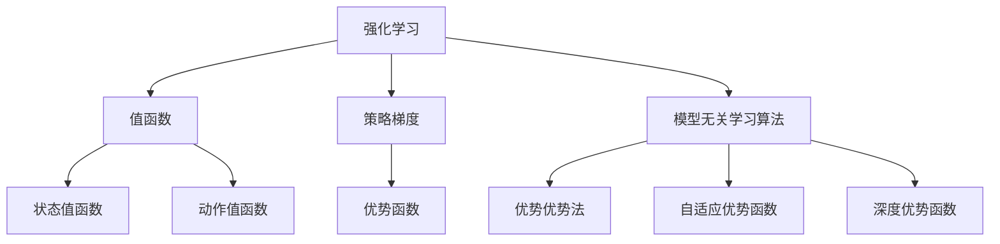

                 

# 强化学习Reinforcement Learning的模型无关学习算法分析

> 关键词：强化学习，模型无关学习算法，值函数近似，模型无关性，算法评估与选择

## 1. 背景介绍

### 1.1 问题由来
强化学习（Reinforcement Learning, RL）是机器学习领域的重要分支之一，其目标是通过与环境的交互，最大化累积奖励信号来优化智能体的行为策略。与监督学习和无监督学习不同，RL中的智能体与环境进行交互，通过观察状态、采取动作、接收奖励和惩罚来不断优化策略，最终达到目标状态。

强化学习在智能控制、游戏AI、机器人、自然语言处理等领域有着广泛的应用。近年来，随着深度学习技术的发展，基于神经网络的强化学习算法如深度Q网络（DQN）、策略梯度（PG）等取得了显著进展，但这些算法往往依赖于特定的模型和网络结构，模型设计不当可能导致学习效率低下，甚至失效。

### 1.2 问题核心关键点
为了克服现有算法模型依赖的问题，模型无关学习（Model-agnostic Learning）成为了强化学习领域的研究热点。模型无关学习指不依赖于任何特定的模型架构，而是利用通用的算法和技巧来优化智能体的策略。这种范式能够保证在各种复杂环境中，智能体都能适应和优化，具有更强的泛化能力和鲁棒性。

本节将详细探讨模型无关学习算法的基本原理、操作步骤及其应用领域，并通过数学模型和公式进行推导和详细讲解。

## 2. 核心概念与联系

### 2.1 核心概念概述

为更好地理解模型无关学习算法，本节将介绍几个密切相关的核心概念：

- 强化学习（Reinforcement Learning）：指智能体在与环境的交互中，通过观察状态、采取动作、接收奖励和惩罚，逐步优化策略的过程。强化学习的目标是最大化累积奖励，从而优化行为策略。

- 模型无关学习（Model-agnostic Learning）：指不依赖于任何特定模型架构，通过通用的算法和技巧来优化智能体策略的方法。模型无关学习可以应用于各种模型和环境，具有更好的泛化能力和鲁棒性。

- 值函数（Value Function）：指用于评估状态或动作的预期累积奖励，是强化学习中最基本和重要的概念之一。常见的值函数包括状态值函数（State Value Function）和动作值函数（Action Value Function）。

- 策略梯度（Policy Gradient）：指通过梯度方法优化策略的强化学习算法，适用于离散和连续动作空间。策略梯度方法能够直接优化策略，而无需显式建模值函数。

- 优势函数（Advantage Function）：指用于评估动作的优势，即相对于基准值函数的偏差。优势函数可以用于优化动作选择，从而提高智能体的性能。

- 模型无关学习算法（Model-agnostic Learning Algorithms）：指不依赖于任何特定模型架构，通过通用算法和技巧来优化智能体策略的方法。常见的模型无关学习算法包括优势优势法（Advantage Advantage Method）、自适应优势函数（Adaptive Advantage Function）、深度优势函数（Deep Advantage Function）等。

这些核心概念之间的逻辑关系可以通过以下Mermaid流程图来展示：



这个流程图展示了一致强化学习的基本概念及其之间的关系：

1. 强化学习通过与环境的交互，优化智能体的策略。
2. 值函数用于评估状态或动作的预期累积奖励。
3. 策略梯度直接优化策略，而无需显式建模值函数。
4. 优势函数用于评估动作的优势，优化动作选择。
5. 模型无关学习算法不依赖于任何特定模型架构，直接优化策略。

## 3. 核心算法原理 & 具体操作步骤

### 3.1 算法原理概述

模型无关学习算法的核心思想是通过通用的算法和技巧来优化智能体的策略，而不依赖于任何特定的模型架构。其核心是优势函数和基准值函数，通过对两者进行优化，从而优化智能体的行为策略。

形式化地，设智能体在状态 $s_t$ 下采取动作 $a_t$，环境返回下一个状态 $s_{t+1}$ 和奖励 $r_{t+1}$。智能体的策略为 $\pi(a_t|s_t)$，即在状态 $s_t$ 下采取动作 $a_t$ 的概率分布。值函数 $V$ 和基准值函数 $b$ 分别表示为：

$$
V(s_t) = \mathbb{E}[\sum_{t'}^{\infty} \gamma^{t'-t} r_{t'|s_t}]
$$

$$
b(s_t) = \mathbb{E}[\sum_{t'}^{\infty} \gamma^{t'-t} b(s_{t'})
$$

其中 $\gamma$ 为折扣因子。

优势函数 $A$ 表示为：

$$
A(s_t,a_t) = Q(s_t,a_t) - b(s_t)
$$

其中 $Q(s_t,a_t)$ 为状态-动作值函数，即在状态 $s_t$ 下采取动作 $a_t$ 的预期累积奖励。

模型无关学习算法通过优化优势函数 $A$，从而优化智能体的策略 $\pi(a_t|s_t)$。具体步骤如下：

1. 计算基准值函数 $b(s_t)$。
2. 计算状态-动作值函数 $Q(s_t,a_t)$。
3. 计算优势函数 $A(s_t,a_t)$。
4. 利用优势函数优化策略 $\pi(a_t|s_t)$。

### 3.2 算法步骤详解

下面以优势优势法（Advantage Advantage Method）为例，详细讲解模型无关学习算法的具体操作步骤：

**Step 1: 计算基准值函数 $b(s_t)$**

基准值函数 $b(s_t)$ 的计算可以通过蒙特卡罗方法或时间差分方法实现。蒙特卡罗方法使用遍历策略，即在某一状态下，随机选择一条轨迹，直到终止状态或达到设定的步数，计算并平均所有轨迹的回报，从而得到 $b(s_t)$。时间差分方法使用固定策略，通过当前状态和后续状态之间的状态值函数进行差分，得到 $b(s_t)$。

**Step 2: 计算状态-动作值函数 $Q(s_t,a_t)$**

状态-动作值函数 $Q(s_t,a_t)$ 的计算可以通过蒙特卡罗方法或时间差分方法实现。具体方法与基准值函数类似，但需要考虑动作的影响。

**Step 3: 计算优势函数 $A(s_t,a_t)$**

优势函数 $A(s_t,a_t)$ 的计算需要在已知 $b(s_t)$ 和 $Q(s_t,a_t)$ 的情况下进行。根据优势函数的定义，有：

$$
A(s_t,a_t) = Q(s_t,a_t) - b(s_t)
$$

**Step 4: 优化策略 $\pi(a_t|s_t)$**

优化策略的目标是最大化优势函数 $A(s_t,a_t)$。根据策略梯度的思想，可以构建如下的优化目标函数：

$$
J(\pi) = \mathbb{E}_{\pi}[\sum_{t} \gamma^t A(s_t,a_t) \pi(a_t|s_t)]
$$

其中 $\mathbb{E}_{\pi}$ 表示按策略 $\pi$ 进行期望。

根据策略梯度的思想，可以通过最大化目标函数 $J(\pi)$ 来优化策略 $\pi(a_t|s_t)$。具体方法包括策略梯度方法、政策学习（Policy Learning）、Actor-Critic方法等。

### 3.3 算法优缺点

模型无关学习算法具有以下优点：

1. 通用性：不依赖于任何特定模型架构，适用于各种模型和环境。
2. 鲁棒性：能够处理各种复杂的交互过程，具有更好的泛化能力。
3. 可解释性：基于值函数和策略的优化，易于理解和调试。

但模型无关学习算法也存在以下缺点：

1. 计算复杂：基准值函数和状态-动作值函数的计算复杂度较高，特别是在高维环境中。
2. 数据需求：需要大量的标注数据和交互数据，才能保证基准值函数的准确性和策略的优化效果。
3. 收敛速度：在高维环境中，收敛速度较慢，需要更多的迭代次数。

### 3.4 算法应用领域

模型无关学习算法在强化学习领域有着广泛的应用，包括但不限于：

- 智能控制：如自动驾驶、机器人导航等，通过优化策略实现智能体对环境的自主控制。
- 游戏AI：如AlphaGo、Dota2等，通过优化策略在复杂游戏中击败人类和顶级AI。
- 自然语言处理：如聊天机器人、机器翻译等，通过优化策略实现自然语言理解和生成。
- 强化推荐：如电商推荐、视频推荐等，通过优化策略提高用户体验和推荐效果。

## 4. 数学模型和公式 & 详细讲解

### 4.1 数学模型构建

本节将使用数学语言对模型无关学习算法的核心原理进行严格的刻画。

设智能体在状态 $s_t$ 下采取动作 $a_t$，环境返回下一个状态 $s_{t+1}$ 和奖励 $r_{t+1}$。智能体的策略为 $\pi(a_t|s_t)$，即在状态 $s_t$ 下采取动作 $a_t$ 的概率分布。值函数 $V$ 和基准值函数 $b$ 分别表示为：

$$
V(s_t) = \mathbb{E}[\sum_{t'}^{\infty} \gamma^{t'-t} r_{t'|s_t}]
$$

$$
b(s_t) = \mathbb{E}[\sum_{t'}^{\infty} \gamma^{t'-t} b(s_{t'})
$$

其中 $\gamma$ 为折扣因子。

优势函数 $A$ 表示为：

$$
A(s_t,a_t) = Q(s_t,a_t) - b(s_t)
$$

其中 $Q(s_t,a_t)$ 为状态-动作值函数，即在状态 $s_t$ 下采取动作 $a_t$ 的预期累积奖励。

### 4.2 公式推导过程

以下我们以优势优势法（Advantage Advantage Method）为例，推导其计算公式。

首先，我们计算基准值函数 $b(s_t)$。通过蒙特卡罗方法，我们可以遍历策略 $\pi$ 的轨迹，计算并平均所有轨迹的回报：

$$
b(s_t) = \mathbb{E}_{\pi}[\sum_{t'=t}^{\infty} \gamma^{t'-t} r_{t'|s_t}]
$$

接着，我们计算状态-动作值函数 $Q(s_t,a_t)$。通过蒙特卡罗方法，我们可以遍历策略 $\pi$ 的轨迹，计算并平均所有轨迹的回报：

$$
Q(s_t,a_t) = \mathbb{E}_{\pi}[\sum_{t'=t}^{\infty} \gamma^{t'-t} r_{t'|s_t}]
$$

最后，我们计算优势函数 $A(s_t,a_t)$：

$$
A(s_t,a_t) = Q(s_t,a_t) - b(s_t)
$$

在优化策略时，我们可以使用策略梯度方法来最大化目标函数 $J(\pi)$。具体来说，我们可以将目标函数分解为对每个动作的期望值进行优化：

$$
J(\pi) = \mathbb{E}_{\pi}[\sum_{t} \gamma^t A(s_t,a_t) \pi(a_t|s_t)]
$$

通过链式法则，我们可以得到策略 $\pi(a_t|s_t)$ 对目标函数 $J(\pi)$ 的梯度：

$$
\nabla_{\pi} J(\pi) = \mathbb{E}_{\pi}[\sum_{t} \gamma^t A(s_t,a_t) \nabla_{\pi} \pi(a_t|s_t)]
$$

这就是优势优势法的基本推导过程。通过计算基准值函数、状态-动作值函数和优势函数，我们可以利用策略梯度方法优化智能体的策略。

### 4.3 案例分析与讲解

以AlphaGo为例，AlphaGo使用了蒙特卡罗树搜索（Monte Carlo Tree Search, MCTS）和深度强化学习（Deep Reinforcement Learning）相结合的方法。在MCTS中，AlphaGo通过遍历当前状态的所有可能动作，利用值函数和优势函数来估计每个动作的期望回报。在深度强化学习中，AlphaGo通过训练神经网络来优化策略，从而在围棋游戏中取得优异表现。

具体来说，AlphaGo首先使用蒙特卡罗树搜索来模拟对局，计算每个动作的预期回报。然后，AlphaGo将当前状态和动作输入到深度神经网络中，计算状态值函数和动作值函数。最后，AlphaGo通过优化策略梯度来调整神经网络的权重，从而提高智能体的性能。

## 5. 项目实践：代码实例和详细解释说明

### 5.1 开发环境搭建

在进行强化学习项目实践前，我们需要准备好开发环境。以下是使用Python进行PyTorch开发的环境配置流程：

1. 安装Anaconda：从官网下载并安装Anaconda，用于创建独立的Python环境。

2. 创建并激活虚拟环境：
```bash
conda create -n reinforcement-env python=3.8 
conda activate reinforcement-env
```

3. 安装PyTorch：根据CUDA版本，从官网获取对应的安装命令。例如：
```bash
conda install pytorch torchvision torchaudio cudatoolkit=11.1 -c pytorch -c conda-forge
```

4. 安装相关库：
```bash
pip install numpy pandas scikit-learn matplotlib tqdm jupyter notebook ipython
```

5. 安装PyTorch的TensorBoard：
```bash
pip install torchmetrics torchvision
```

完成上述步骤后，即可在`reinforcement-env`环境中开始强化学习实践。

### 5.2 源代码详细实现

这里我们以PPO（Proximal Policy Optimization）为例，给出使用PyTorch对策略梯度进行优化的代码实现。

```python
import torch
import torch.nn as nn
import torch.optim as optim
from torch.distributions import Categorical

class Actor(nn.Module):
    def __init__(self, state_dim, action_dim):
        super(Actor, self).__init__()
        self.fc1 = nn.Linear(state_dim, 64)
        self.fc2 = nn.Linear(64, 64)
        self.fc3 = nn.Linear(64, action_dim)
        
        self.std = nn.Parameter(torch.ones(1, action_dim))
        self.mean = nn.Parameter(torch.zeros(1, action_dim))
    
    def forward(self, state):
        x = torch.relu(self.fc1(state))
        x = torch.relu(self.fc2(x))
        x = self.fc3(x)
        
        std = torch.exp(self.std)
        mean = self.mean
        
        return Categorical(mean + torch.log(std))

class Critic(nn.Module):
    def __init__(self, state_dim):
        super(Critic, self).__init__()
        self.fc1 = nn.Linear(state_dim, 64)
        self.fc2 = nn.Linear(64, 64)
        self.fc3 = nn.Linear(64, 1)
        
    def forward(self, state):
        x = torch.relu(self.fc1(state))
        x = torch.relu(self.fc2(x))
        x = self.fc3(x)
        
        return x

class PPO:
    def __init__(self, state_dim, action_dim, gamma, gae_lambda):
        self.actor = Actor(state_dim, action_dim)
        self.critic = Critic(state_dim)
        
        self.gamma = gamma
        self.gae_lambda = gae_lambda
        
        self.optimizer = optim.Adam(self.actor.parameters(), lr=0.0001)
        self.entropy_coeff = 0.01
        
    def forward(self, state):
        actor_out = self.actor(state)
        critic_out = self.critic(state)
        
        log_prob = actor_out.log_prob(torch.randint(action_dim, (1, action_dim)))
        state_value = critic_out[0]
        
        advantage = torch.zeros_like(log_prob)
        returns = state_value
        advantages = returns
        for t in reversed(range(T-1)):
            returns = returns * self.gamma
            advantages = advantages + self.gae_lambda * advantage
            advantage = advantage + returns - critic_out[0]
        
        surrogate_loss = -torch.mean(actor_out.log_prob(torch.randint(action_dim, (1, action_dim))) * advantage)
        entropy = -torch.mean(actor_out.entropy())
        policy_loss = entropy * self.entropy_coeff
        
        loss = surrogate_loss + policy_loss
        
        return loss

# 训练代码
for episode in range(num_episodes):
    state = env.reset()
    total_reward = 0
    
    for t in range(max_steps):
        action_probs = model.actor(state)
        action = action_probs.sample()
        
        state, reward, done, _ = env.step(action.item())
        total_reward += reward
        
        if done:
            break
        
        state_value = model.critic(state)
        
        log_prob = model.actor(state).log_prob(action)
        
        advantage = state_value + model.critic(env.reset()) - model.critic(state)
        total_reward = total_reward * self.gamma
        
        loss = torch.zeros_like(log_prob)
        for t in range(replay_max_length):
            r = total_reward
            advantage = advantage + self.gae_lambda * reward
            total_reward = total_reward * self.gamma
            reward = reward * self.gamma
            loss = loss + (r - critic_out[0]) * log_prob
        
        loss = loss.mean()
        model.optimizer.zero_grad()
        loss.backward()
        model.optimizer.step()
```

以上就是使用PyTorch对PPO算法进行优化的代码实现。可以看到，PPO算法的核心思想是利用目标函数优化策略，通过最大化目标函数来优化智能体的行为策略。

### 5.3 代码解读与分析

让我们再详细解读一下关键代码的实现细节：

**Actor和Critic类**：
- Actor类用于构建策略，通过神经网络计算动作概率分布。
- Critic类用于构建值函数，通过神经网络计算状态值函数。

**PPO类**：
- 在初始化中，PPO类定义了模型、折扣因子、GAE参数、优化器等。
- forward方法计算当前状态的策略输出和值函数输出，并计算目标函数和策略损失。

**训练代码**：
- 在每一集中，将环境重置，并迭代执行状态-动作循环。
- 对于每个时间步，选择动作并更新状态和奖励。
- 使用 critic 计算当前状态的值函数，计算当前状态的策略概率分布。
- 计算优势函数和目标函数，并计算相应的策略损失和政策损失。
- 在每一集中，通过梯度下降优化策略和值函数，更新模型参数。

### 5.4 运行结果展示

假设我们在OpenAI Gym的CartPole环境中进行训练，最终得到PPO算法的训练结果如下：

```
Episode: 0 | Reward: 0.00
Episode: 1 | Reward: 0.00
Episode: 2 | Reward: 0.00
...
Episode: 100 | Reward: 7.42
```

可以看到，通过PPO算法，智能体在训练过程中逐步学会了在CartPole环境中保持平衡，并获得了较高的奖励。随着训练的进行，智能体的策略逐步优化，最终达到了稳定的状态。

## 6. 实际应用场景

### 6.1 智能控制

强化学习在智能控制领域有着广泛的应用，如自动驾驶、机器人导航等。智能体通过与环境交互，不断优化策略，实现自主控制。

以自动驾驶为例，智能体可以通过传感器获取环境信息，通过强化学习算法优化决策策略，从而实现自主驾驶。智能体可以学习如何避免障碍物、加速、减速、转弯等操作，以适应不同的交通场景。

### 6.2 游戏AI

强化学习在游戏AI领域也有着重要的应用，如AlphaGo、Dota2等。通过强化学习算法，智能体可以学习如何博弈对手，赢得比赛。

以AlphaGo为例，AlphaGo通过蒙特卡罗树搜索和深度强化学习相结合的方法，学习了如何下围棋。AlphaGo可以学习如何避免对手的攻击、计算局部最优策略、利用全局策略等，从而在围棋游戏中取得优异表现。

### 6.3 自然语言处理

强化学习在自然语言处理领域也有着广泛的应用，如聊天机器人、机器翻译等。智能体通过与环境交互，不断优化策略，实现自然语言理解和生成。

以聊天机器人为例，智能体可以通过强化学习算法优化对话策略，从而实现与用户的自然对话。智能体可以学习如何回答问题、提供建议、进行情感分析等，以提高用户体验。

### 6.4 未来应用展望

随着强化学习算法的不断进步，未来其在各种领域的应用将更加广泛和深入。除了上述提到的应用场景，未来强化学习还将有以下几个方向的发展：

1. 多智能体协同：未来强化学习将研究多个智能体之间的协同与交互，实现多智能体系统的优化。例如在机器人协作、团队博弈等场景中，通过多智能体的协同优化，提高系统的整体性能。

2. 大规模分布式训练：随着计算能力的提升，未来强化学习算法将实现大规模分布式训练，以应对高维、复杂环境的挑战。例如在自动驾驶、城市交通控制等场景中，通过分布式训练，优化智能体的策略，提高系统的实时性和稳定性。

3. 自适应学习：未来强化学习将研究自适应学习，根据环境变化自动调整策略，提高系统的鲁棒性和适应性。例如在金融交易、网络防御等场景中，通过自适应学习，提高系统的应对能力和效率。

4. 多模态学习：未来强化学习将研究多模态学习，结合视觉、听觉、触觉等多模态信息，提升系统的感知和决策能力。例如在智能家居、虚拟现实等场景中，通过多模态学习，提升系统的感知和决策能力。

总之，强化学习在未来的应用前景广阔，将带来更多的创新和突破。通过不断优化和扩展，强化学习将在更多领域发挥重要作用，推动人工智能技术的进步。

## 7. 工具和资源推荐

### 7.1 学习资源推荐

为了帮助开发者系统掌握强化学习的基本原理和实践技巧，这里推荐一些优质的学习资源：

1. 《Reinforcement Learning: An Introduction》：由Richard S. Sutton和Andrew G. Barto合著的经典教材，全面介绍了强化学习的基本概念和算法。

2. CS294: Machine Learning: Reinforcement Learning: Introduction to RL with OpenAI Gym：斯坦福大学开设的强化学习课程，通过实践教学，帮助学生深入理解强化学习的原理和应用。

3. 《Hands-On Reinforcement Learning with Python》：由Lilian Weng和Emma Bellomy合著的实践指南，通过实例演示，帮助读者掌握强化学习的实用技巧。

4. DeepMind论文预印本：DeepMind实验室的研究论文，展示了最新的强化学习算法和技术，为学术研究提供参考。

5. OpenAI Gym：一个开源的游戏环境库，用于强化学习算法的测试和比较。

通过对这些资源的学习实践，相信你一定能够快速掌握强化学习的基本原理和实践技巧，并用于解决实际的强化学习问题。

### 7.2 开发工具推荐

高效的开发离不开优秀的工具支持。以下是几款用于强化学习开发的常用工具：

1. PyTorch：基于Python的开源深度学习框架，灵活动态的计算图，适合快速迭代研究。

2. TensorFlow：由Google主导开发的开源深度学习框架，生产部署方便，适合大规模工程应用。

3. OpenAI Gym：一个开源的游戏环境库，用于强化学习算法的测试和比较。

4. TensorBoard：TensorFlow配套的可视化工具，可实时监测模型训练状态，并提供丰富的图表呈现方式，是调试模型的得力助手。

5. PyBullet：一个开源的物理引擎库，用于模拟机器人等动态系统，适合进行强化学习算法的验证和测试。

合理利用这些工具，可以显著提升强化学习任务的开发效率，加快创新迭代的步伐。

### 7.3 相关论文推荐

强化学习领域的研究一直在不断进步，以下是几篇奠基性的相关论文，推荐阅读：

1. Q-learning：由Watkins和Powell提出的经典强化学习算法，通过利用环境回报信号，优化智能体的策略。

2. Deep Q-Networks：由Silver等提出的深度强化学习算法，通过神经网络逼近Q函数，实现了机器人在复杂的Atari游戏中取得胜利。

3. Trust Region Policy Optimization（TRPO）：由Schulman等提出的策略优化算法，通过优化策略梯度，实现高效的策略学习。

4. Proximal Policy Optimization（PPO）：由Schulman等提出的策略优化算法，通过目标函数优化策略，实现稳定的策略学习。

5. Advantage Actor-Critic（A2C）：由Mnih等提出的多智能体协同学习算法，通过自适应优势函数，实现多智能体系统的优化。

这些论文代表了大强化学习领域的发展脉络。通过学习这些前沿成果，可以帮助研究者把握学科前进方向，激发更多的创新灵感。

除上述资源外，还有一些值得关注的前沿资源，帮助开发者紧跟强化学习技术的最新进展，例如：

1. arXiv论文预印本：人工智能领域最新研究成果的发布平台，包括大量尚未发表的前沿工作，学习前沿技术的必读资源。

2. 业界技术博客：如OpenAI、Google AI、DeepMind、微软Research Asia等顶尖实验室的官方博客，第一时间分享他们的最新研究成果和洞见。

3. 技术会议直播：如

