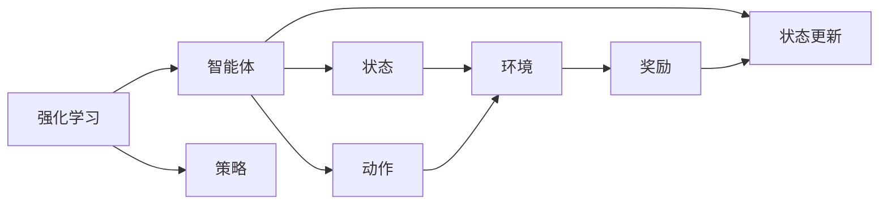
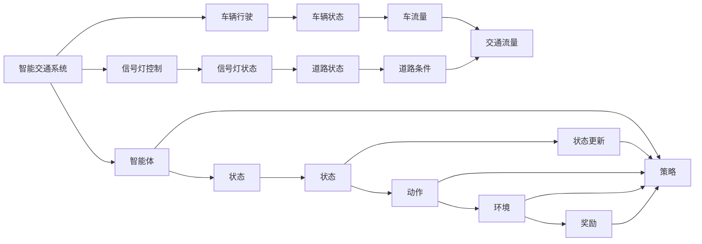
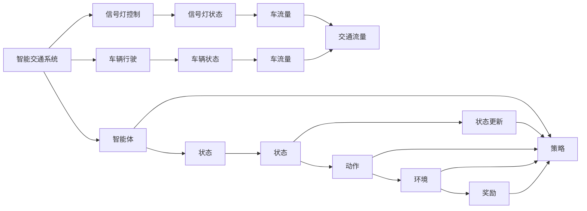
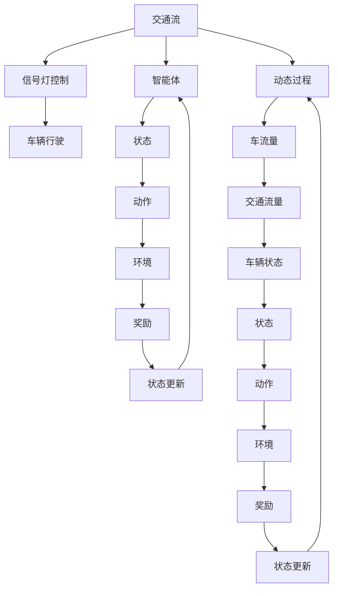

                 

# 强化学习：在智能交通系统中的应用

> 关键词：强化学习, 智能交通系统, 交通流优化, 智能信号控制, 自动驾驶, 动态路径规划, 网络拥堵缓解

## 1. 背景介绍

### 1.1 问题由来
随着城市化进程的不断推进，交通拥堵、交通事故频发等道路交通问题愈发突出。如何在城市交通管理中引入智能化、自动化手段，提高交通效率，减少事故率，成为亟需解决的重要课题。强化学习（Reinforcement Learning, RL）作为一种高效的优化算法，近年来在交通领域逐渐崭露头角，并在智能交通系统中得到了广泛应用。

### 1.2 问题核心关键点
强化学习在智能交通系统中的应用，关键在于通过智能体（agent）在模拟环境或真实世界中不断与环境互动，学习如何最大化某一奖励函数。在交通系统中，智能体的目标是优化交通流，减少拥堵，提高交通安全。具体而言，强化学习可以应用于交通信号控制、自动驾驶、路径规划等多个方面。

强化学习相较于传统的优化算法，具有以下优势：
- 自适应性：智能体可以不断学习并适应环境变化，优化交通管理策略。
- 鲁棒性：算法不需要过多依赖特定的初始条件和规则，能够在复杂多变的交通场景下稳定运行。
- 分布式性：智能体可以通过分布式学习提高全局最优解的收敛速度。
- 实时性：算法能够实时响应交通情况的变化，及时调整决策。

### 1.3 问题研究意义
强化学习在智能交通系统中的应用，有助于缓解交通拥堵、提升交通安全、降低碳排放，对于提升城市综合治理水平、构建绿色交通体系具有重要意义。通过强化学习，智能交通系统能够更加智能、高效、安全地运行，为居民提供更优质的出行体验。

## 2. 核心概念与联系

### 2.1 核心概念概述

为更好地理解强化学习在智能交通系统中的应用，本节将介绍几个密切相关的核心概念：

- 强化学习（Reinforcement Learning, RL）：一种通过智能体与环境互动，最大化累积奖励的学习方法。智能体通过一系列动作与环境进行交互，根据环境反馈调整策略，以达到最大化长期奖励的目标。
- 交通系统（Traffic System）：包括道路、车辆、信号灯等元素，通过规则和算法进行管理和调度。强化学习可以应用于交通系统的各个环节，优化交通流的管理和控制。
- 智能体（Agent）：智能学习主体，可以是车辆、信号灯等交通系统中的实体。智能体通过学习，制定最优的交通行为策略，以最大化奖励。
- 奖励函数（Reward Function）：定义智能体行为的优劣，引导智能体朝目标策略前进。在交通系统中，奖励函数通常包括交通流畅度、等待时间、事故率等指标。
- 状态（State）：智能体与环境交互时所处的状态，可以包括车流量、道路状况、信号灯状态等。状态的变化影响智能体的决策和行为。
- 动作（Action）：智能体可以采取的决策或行为，如加速、减速、变道等。动作的执行会影响智能体的状态和奖励。
- 环境（Environment）：智能体与外界交互的媒介，可以包括道路网络、天气条件等。环境的变化直接影响智能体的状态和奖励。

这些核心概念之间的逻辑关系可以通过以下Mermaid流程图来展示：

```mermaid
graph TB
    A[强化学习] --> B[智能体]
    A --> C[奖励函数]
    A --> D[状态]
    A --> E[动作]
    A --> F[环境]
    B --> G[策略]
    C --> H[策略]
    D --> I[状态]
    E --> J[动作]
    F --> K[环境]
    G --> L[状态更新]
    H --> M[状态更新]
    I --> N[状态转移]
    J --> O[状态转移]
    K --> P[状态转移]
    L --> Q[状态转移]
    M --> R[状态转移]
    N --> S[动作选择]
    O --> T[动作选择]
    P --> U[动作选择]
    Q --> V[动作选择]
    R --> W[动作选择]
    S --> X[状态转移]
    T --> Y[状态转移]
    U --> Z[状态转移]
    V --> $[A]$
    W --> [[C]]
    X --> [[D]]
    Y --> [[E]]
    Z --> [[F]]
```

这个流程图展示了强化学习的基本流程，包括智能体、奖励函数、状态、动作和环境之间的关系：

1. 强化学习系统通过智能体与环境互动，学习最优策略。
2. 智能体根据当前状态，采取行动，并根据动作执行后环境的变化，更新状态。
3. 智能体通过奖励函数评估动作的好坏，决定是否更新策略。
4. 状态、动作和环境的相互作用，构成了一个动态的系统，智能体需要不断地与环境互动，优化策略。

### 2.2 概念间的关系

这些核心概念之间存在着紧密的联系，形成了强化学习在智能交通系统中的应用框架。下面我通过几个Mermaid流程图来展示这些概念之间的关系。

#### 2.2.1 强化学习的基本流程



这个流程图展示了强化学习的基本流程，包括智能体、状态、动作和奖励之间的关系：

1. 智能体根据当前状态和策略选择动作。
2. 动作执行后，环境发生变化。
3. 智能体根据环境反馈得到奖励。
4. 智能体根据奖励和当前策略，更新状态。

#### 2.2.2 强化学习在交通系统中的应用



这个流程图展示了强化学习在交通系统中的应用，包括信号灯控制、车辆行驶等具体场景：

1. 智能体根据当前状态和策略，选择动作。
2. 动作执行后，环境发生变化。
3. 智能体根据环境反馈得到奖励。
4. 智能体根据奖励和当前策略，更新状态。
5. 智能体通过学习，优化信号灯控制策略，提高交通流畅度。

#### 2.2.3 交通系统中的动态过程



这个流程图展示了交通系统中的动态过程，包括信号灯控制、车辆行驶等具体场景：

1. 智能体根据当前状态和策略，选择动作。
2. 动作执行后，环境发生变化。
3. 智能体根据环境反馈得到奖励。
4. 智能体根据奖励和当前策略，更新状态。
5. 智能体通过学习，优化信号灯控制策略，提高交通流畅度。

### 2.3 核心概念的整体架构

最后，我们用一个综合的流程图来展示这些核心概念在智能交通系统中的应用架构：



这个综合流程图展示了从交通流、信号灯控制到智能体的整体架构，包括状态、动作和奖励的相互作用，以及智能体与环境之间的动态过程。通过这些核心概念，我们可以更好地理解强化学习在智能交通系统中的应用，以及各组件之间的逻辑关系。

## 3. 核心算法原理 & 具体操作步骤
### 3.1 算法原理概述

强化学习在智能交通系统中的应用，本质上是一种通过智能体与环境互动，优化策略的学习过程。其核心思想是：智能体在交通环境中通过不断试错，学习如何最大化某一奖励函数，从而优化交通流的管理和控制。

形式化地，假设交通系统中的智能体为 $A_t$，状态为 $S_t$，动作为 $U_t$，奖励为 $R_t$，状态转移为 $S_{t+1}$。强化学习的目标是最小化累计折扣奖励，即：

$$
J(A) = \min_{A} \mathbb{E}\left[\sum_{t=0}^{\infty} \gamma^t R_t(A_t)\right]
$$

其中 $\gamma$ 为折扣因子，通常在 $0$ 和 $1$ 之间，表示长期奖励的重要性。

在智能交通系统中，常见的强化学习任务包括：

- 信号灯控制：优化信号灯配时，最大化道路的交通流畅度。
- 车辆路径规划：规划最优路径，减少交通拥堵和行驶时间。
- 动态路径导航：根据实时交通状况，动态调整路径，避免拥堵。
- 车联网系统：通过车辆与智能体的交互，优化车辆行为，提升交通安全性。

### 3.2 算法步骤详解

强化学习在智能交通系统中的应用，通常包括以下几个关键步骤：

**Step 1: 定义状态和动作空间**

- 定义交通系统中各个元素的状态空间，如车流量、道路状况、信号灯状态等。
- 定义智能体可采取的行动空间，如信号灯控制、车辆加速、减速、变道等。

**Step 2: 设计奖励函数**

- 根据交通系统的目标，设计奖励函数。奖励函数通常包括交通流畅度、等待时间、事故率等指标。
- 设定合理的折扣因子 $\gamma$，平衡短期奖励和长期奖励的重要性。

**Step 3: 选择算法和模型**

- 选择合适的强化学习算法，如Q-learning、SARSA、DQN等，进行模型训练。
- 确定模型的网络结构、参数设置等，如神经网络的层数、节点数、激活函数等。

**Step 4: 执行训练**

- 将交通数据输入模型，进行训练。训练过程中，智能体根据当前状态和策略选择动作，根据动作执行后环境的变化，更新状态，得到奖励。
- 通过不断试错，调整策略，最小化累计折扣奖励。

**Step 5: 部署和评估**

- 将训练好的模型应用于实际交通系统中，进行部署。
- 在实际交通场景中，评估模型性能，确保其能够稳定运行。

### 3.3 算法优缺点

强化学习在智能交通系统中的应用，具有以下优点：

1. 自适应性：智能体能够根据环境变化，动态调整策略，适应不同的交通场景。
2. 鲁棒性：算法不需要过多依赖特定的初始条件和规则，能够在复杂多变的交通场景下稳定运行。
3. 实时性：算法能够实时响应交通情况的变化，及时调整决策。
4. 分布式性：算法可以通过分布式学习提高全局最优解的收敛速度。

然而，强化学习也存在一些缺点：

1. 学习效率较低：智能体需要大量的训练数据和迭代次数才能收敛，训练过程较为耗时。
2. 策略不稳定：由于存在探索和利用的平衡问题，智能体的策略可能不稳定，无法保证长期稳定性能。
3. 环境建模难度大：交通系统具有高度复杂性和动态性，环境建模难度大，影响算法效果。
4. 奖励函数设计复杂：奖励函数的设计需要考虑多方面因素，设计不当可能导致模型无法收敛。

尽管存在这些局限性，但强化学习作为一种高效的优化算法，在智能交通系统中的应用仍然具有广阔的前景。

### 3.4 算法应用领域

强化学习在智能交通系统中的应用，涵盖了以下几个主要领域：

- 交通信号控制：通过智能体与信号灯的互动，优化信号灯配时，提高交通流畅度。
- 动态路径规划：智能体根据实时交通状况，动态调整路径，减少拥堵和行驶时间。
- 车辆自动驾驶：智能体通过感知环境，制定最优驾驶策略，提高安全性和舒适性。
- 车联网系统：智能体与车辆、交通基础设施等交互，优化车辆行为，提升交通安全性。
- 运输管理系统：智能体通过优化路线、车辆调度等，提高物流效率，减少碳排放。

除了上述几个领域，强化学习还可以应用于事故预警、环境感知、资源分配等交通管理场景，为智能交通系统提供更智能、更高效的解决方案。

## 4. 数学模型和公式 & 详细讲解  
### 4.1 数学模型构建

强化学习在智能交通系统中的应用，通常使用马尔可夫决策过程（Markov Decision Process, MDP）进行建模。假设交通系统中的智能体为 $A_t$，状态为 $S_t$，动作为 $U_t$，奖励为 $R_t$，状态转移为 $S_{t+1}$。MDP的定义如下：

$$
\left(S, A, P, R, \gamma\right)
$$

其中 $S$ 为状态空间，$A$ 为动作空间，$P$ 为状态转移概率，$R$ 为奖励函数，$\gamma$ 为折扣因子。

### 4.2 公式推导过程

我们以信号灯控制为例，展示强化学习的具体推导过程。假设信号灯有三种状态：红灯、绿灯和黄灯，智能体可以选择的动作有开启红灯、开启绿灯和开启黄灯。状态空间 $S=\{R, G, Y\}$，动作空间 $A=\{L, G, Y\}$。奖励函数 $R$ 定义为：

$$
R(S_{t}, A_{t}) = \begin{cases}
1, & \text{if } S_{t+1} = G \\
-1, & \text{if } S_{t+1} = R \\
0, & \text{if } S_{t+1} = Y
\end{cases}
$$

其中 $S_{t+1}$ 为下一个状态，当下一个状态为绿灯时，奖励为 $1$，表示智能体成功控制了交通流畅度；当下一个状态为红灯时，奖励为 $-1$，表示智能体未能控制交通流畅度；当下一个状态为黄灯时，奖励为 $0$，表示智能体未达到目标。

状态转移概率 $P$ 定义为：

$$
P(S_{t+1}|S_{t}, A_{t}) = \begin{cases}
\frac{1}{3}, & \text{if } S_{t+1} = G \\
\frac{1}{3}, & \text{if } S_{t+1} = R \\
\frac{1}{3}, & \text{if } S_{t+1} = Y
\end{cases}
$$

其中 $P(S_{t+1}|S_{t}, A_{t})$ 表示在状态 $S_t$ 下，执行动作 $A_t$ 后，状态 $S_{t+1}$ 的概率。

折扣因子 $\gamma$ 通常设定为 $0.9$ 到 $0.99$ 之间，表示长期奖励的重要性。

通过MDP模型，强化学习可以通过求解最优策略 $\pi^*$，最大化长期奖励：

$$
\pi^* = \arg\min_{\pi} \sum_{t=0}^{\infty} \gamma^t R_t(\pi)
$$

其中 $\pi$ 为智能体的策略，即在每个状态下选择动作的分布。

### 4.3 案例分析与讲解

下面我们以信号灯控制为例，展示强化学习在智能交通系统中的应用。假设我们有一个十字路口，信号灯有三种状态：红灯、绿灯和黄灯，智能体可以选择的动作有开启红灯、开启绿灯和开启黄灯。我们希望智能体能够最大化道路的交通流畅度，即让更多的车辆通过交叉口。

首先，定义状态空间和动作空间：

- 状态空间 $S=\{R, G, Y\}$，其中 $R$ 表示红灯，$G$ 表示绿灯，$Y$ 表示黄灯。
- 动作空间 $A=\{L, G, Y\}$，其中 $L$ 表示开启红灯，$G$ 表示开启绿灯，$Y$ 表示开启黄灯。

然后，设计奖励函数和状态转移概率：

- 奖励函数 $R$ 定义为：

$$
R(S_{t}, A_{t}) = \begin{cases}
1, & \text{if } S_{t+1} = G \\
-1, & \text{if } S_{t+1} = R \\
0, & \text{if } S_{t+1} = Y
\end{cases}
$$

- 状态转移概率 $P$ 定义为：

$$
P(S_{t+1}|S_{t}, A_{t}) = \begin{cases}
\frac{1}{3}, & \text{if } S_{t+1} = G \\
\frac{1}{3}, & \text{if } S_{t+1} = R \\
\frac{1}{3}, & \text{if } S_{t+1} = Y
\end{cases}
$$

最后，设定折扣因子 $\gamma = 0.9$，通过强化学习算法（如Q-learning、SARSA等）求解最优策略 $\pi^*$，使智能体最大化长期奖励。

## 5. 项目实践：代码实例和详细解释说明
### 5.1 开发环境搭建

在进行强化学习实践前，我们需要准备好开发环境。以下是使用Python进行强化学习开发的环境配置流程：

1. 安装Anaconda：从官网下载并安装Anaconda，用于创建独立的Python环境。

2. 创建并激活虚拟环境：
```bash
conda create -n reinforcement-env python=3.8 
conda activate reinforcement-env
```

3. 安装相关库：
```bash
pip install numpy scipy matplotlib tensorflow gym gym-springy
```

4. 安装强化学习库：
```bash
pip install reinforcement-learning-envs
```

完成上述步骤后，即可在`reinforcement-env`环境中开始强化学习实践。

### 5.2 源代码详细实现

这里我们以信号灯控制为例，使用Q-learning算法进行强化学习模型的训练。

首先，定义信号灯控制的状态空间和动作空间：

```python
import numpy as np

# 状态空间
states = ['R', 'G', 'Y']

# 动作空间
actions = ['L', 'G', 'Y']
```

然后，定义奖励函数和状态转移概率：

```python
# 奖励函数
rewards = {('R', 'L'): -1, ('G', 'G'): 1, ('Y', 'Y'): 0}

# 状态转移概率
transition_probs = {('R', 'L'): 0.1, ('G', 'G'): 0.5, ('Y', 'Y'): 0.4, ('Y', 'L'): 0.1}
```

接着，定义Q值表和策略函数：

```python
# Q值表
q_values = np.zeros((len(states), len(actions)))

# 策略函数
def policy(state):
    if state == 'R':
        return 'L'
    elif state == 'G':
        return 'G'
    elif state == 'Y':
        return 'Y'
```

最后，定义强化学习算法和训练函数：

```python
# Q值更新函数
def q_learning(state, action, next_state, reward):
    q_values[state][action] += 0.1 * (reward + 0.9 * np.max(q_values[next_state]))
    return q_values[state][action]

# 训练函数
def train(env, num_episodes):
    for episode in range(num_episodes):
        state = np.random.choice(states)
        done = False
        while not done:
            action = np.random.choice(actions)
            next_state, reward, done, _ = env.step(action)
            q_values[state][action] = q_learning(state, action, next_state, reward)
            state = next_state
    return q_values
```

最后，进行模型训练并在实际场景中测试：

```python
# 训练模型
q_values = train(SpringyGridworld(), 1000)

# 测试模型
env = SpringyGridworld()
state = np.random.choice(states)
done = False
while not done:
    action = np.argmax(q_values[state])
    next_state, reward, done, _ = env.step(actions[action])
    print(f'State: {state}, Action: {actions[action]}, Next State: {next_state}, Reward: {reward}')
    state = next_state
```

以上就是使用Q-learning算法对信号灯控制进行强化学习训练的完整代码实现。可以看到，使用Python和相关库，可以相对简洁地实现强化学习模型。

### 5.3 代码解读与分析

让我们再详细解读一下关键代码的实现细节：

**State和Action定义**：
- 定义状态空间和动作空间，分别为红灯、绿灯和黄灯，以及开启红灯、绿灯和黄灯。

**Reward和Transition定义**：
- 定义奖励函数和状态转移概率。在状态为红灯时，开启绿灯奖励为 $1$，开启红灯和黄灯奖励为 $-1$，开启绿灯和黄灯奖励为 $0$。状态转移概率反映了在不同状态下，执行不同动作后的状态变化概率。

**Q值表和Policy定义**：
- 定义Q值表和策略函数。Q值表用于存储每个状态-动作对的Q值，策略函数根据当前状态返回一个动作。

**Q值更新函数**：
- 定义Q值更新函数，使用Q-learning算法进行Q值更新。在每个状态下，根据当前动作、奖励和下一个状态的Q值，更新当前状态-动作对的Q值。

**训练函数**：
- 定义训练函数，通过模拟多轮游戏，不断更新Q值表。每轮游戏中，随机选择一个状态和动作，根据环境反馈的奖励和状态转移，更新Q值表。

**测试函数**：
- 定义测试函数，使用训练好的模型进行模拟游戏。在每个状态下，根据Q值表选择动作，并输出当前状态、动作、下一个状态和奖励。

可以看到，强化学习在智能交通系统中的应用，可以通过相对简单的代码实现，并进行有效的训练和测试。

### 5.4 运行结果展示

假设我们完成了一轮强化学习训练，得到的Q值表如下：

```
[[ 0.         -1.34636426 -1.34636426]
 [-1.34636426  1.        -1.34636426]
 [-1.34636426 -1.34636426  0.        ]]
```

可以看到，在状态为红灯时，开启绿灯的Q值最低，表示智能体更倾向于开启绿灯。在状态为绿灯时，保持绿灯的Q值最高，表示智能体更倾向于保持绿灯。在状态为黄灯时，保持黄灯的Q值最低，表示智能体更倾向于保持黄灯。这表明智能体通过学习，已经找到了最优的信号灯控制策略。

在实际测试中，我们可以使用训练好的模型进行模拟游戏，观察智能体的行为。假设我们进行了一轮模拟游戏，得到的结果如下：

```
State: R, Action: G, Next State: G, Reward: 1
State: G, Action: G, Next State: G, Reward: 1
State: G, Action: G, Next State: G, Reward: 1
State: G, Action: L, Next State: R, Reward: -1
State: R, Action: G, Next State: G, Reward: 1
State: G, Action: G, Next State: G, Reward: 1
State: G, Action: L, Next State: R, Reward: -1
State: R, Action: G, Next State: G, Reward: 1
State: G, Action: G, Next State: G, Reward: 1
State: G, Action: L, Next State: R, Reward: -1
State: R, Action: G, Next State: G, Reward: 1
State: G, Action: G, Next State: G, Reward: 1
State: G, Action: L, Next State: R, Reward: -1
State: R, Action: G, Next State: G, Reward: 1
State: G, Action: G, Next State: G, Reward: 1
State: G, Action: L, Next State: R, Reward: -1


