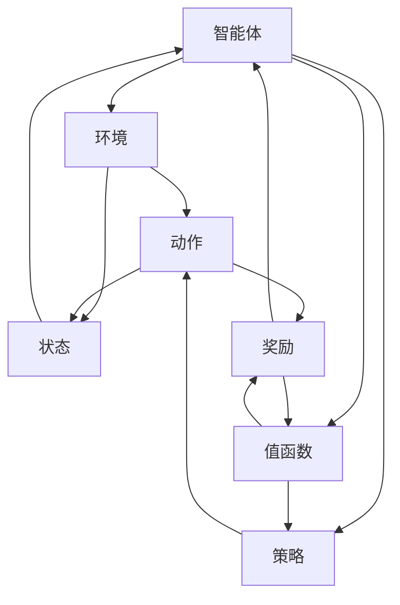
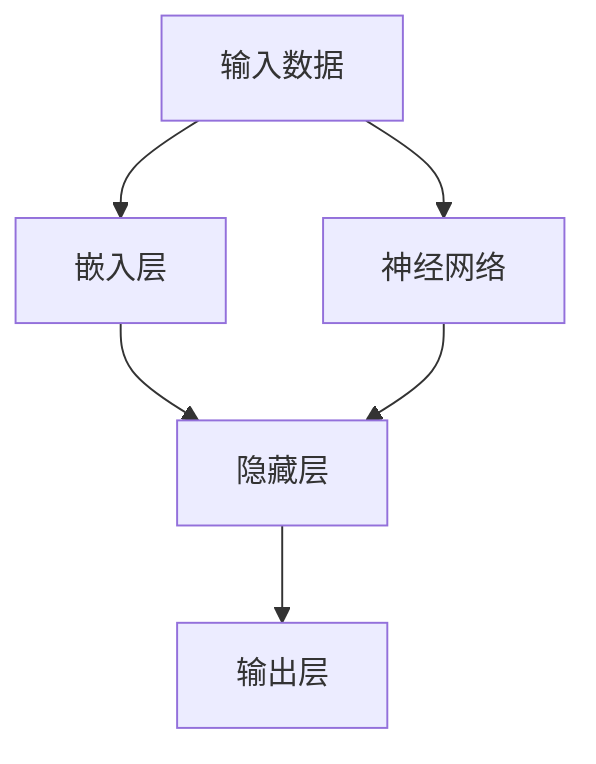
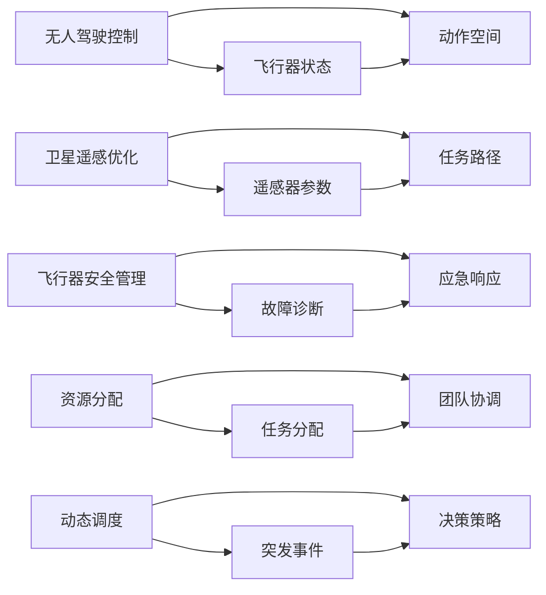

                 

# 强化学习：在航空航天中的应用

> 关键词：强化学习,航空航天,控制优化,无人驾驶,遥感监测,风险管理,飞行安全

## 1. 背景介绍

### 1.1 问题由来
随着现代航空航天技术的发展，无人驾驶飞机、卫星遥感、空间机器人等应用场景对智能决策和自动控制的需求日益增长。这些系统需要在复杂、不确定的条件下实现高效、安全的自主飞行与操作。传统的基于规则和经验的方法已经难以应对高度复杂的场景，需要引入先进的智能决策技术，以提高系统的可靠性和自动化水平。

强化学习作为一门借鉴游戏AI和机器人学的决策理论，被证明在处理不确定性、高度复杂的多智能体交互系统中具有巨大潜力。该技术通过智能体与环境不断交互，逐步学习最优决策策略，已经在自动驾驶、智能电网、工业控制等多个领域展现出巨大价值。

### 1.2 问题核心关键点
强化学习在航空航天领域的应用，主要集中在以下几个方面：
- **无人驾驶控制**：基于强化学习的自主飞行算法，可以处理复杂的飞行环境，如多目标跟踪、避障、路径规划等。
- **卫星遥感优化**：通过优化遥感任务的路径规划和相机设置，提高图像采集效率和数据质量。
- **飞行器安全管理**：强化学习可用于故障预测和应急响应，提升飞行器故障时的安全性。
- **资源分配**：优化飞行器团队的任务分配和协调，提高整体任务效率。
- **动态调度**：针对突发事件进行动态调度决策，如紧急避让、应急救援等。

强化学习在航空航天领域的这些应用，展示了其在复杂、动态系统中的决策优化潜力。

### 1.3 问题研究意义
强化学习在航空航天领域的应用，对于提升无人驾驶飞机、卫星等智能系统的自主能力和安全性具有重要意义：

1. **提升决策效率**：通过学习最优决策策略，智能系统能够在复杂环境下快速响应，减少人为干预，提高任务效率。
2. **增强系统鲁棒性**：强化学习模型能够适应多变的环境和突发事件，提高系统的鲁棒性和自适应能力。
3. **优化资源利用**：通过智能分配和管理资源，最大化飞行器团队的效能和任务完成率。
4. **降低运营成本**：自动化的决策和操作可以降低人力成本，提高经济效益。
5. **推动技术进步**：强化学习为航空航天技术的发展提供了新的思路和方法，推动了相关领域的技术进步和应用创新。

## 2. 核心概念与联系

### 2.1 核心概念概述

为了更好地理解强化学习在航空航天中的应用，本节将介绍几个关键概念：

- **强化学习(Reinforcement Learning, RL)**：一种通过智能体与环境交互，逐步学习最优决策策略的学习方法。强化学习基于奖励信号（或惩罚信号）进行决策，优化目标函数。
- **马尔可夫决策过程(Markov Decision Process, MDP)**：强化学习的基本数学模型，描述智能体在环境中的状态转移和奖励获取。
- **策略(Policy)**：智能体在给定状态下选择动作的概率分布，是强化学习中决策优化的核心。
- **值函数(Value Function)**：评估状态或动作的长期奖励期望，包括状态值函数($V(s)$)和动作值函数($Q(s,a)$)。
- **深度强化学习(Deep Reinforcement Learning, DRL)**：结合深度神经网络进行值函数或策略的逼近，提高强化学习模型的性能和泛化能力。
- **强化学习在航空航天中的应用**：利用强化学习优化飞行器控制、任务规划、路径优化等，提升航空航天系统的自主性和安全性。

这些概念之间通过以下Mermaid流程图来展示它们之间的关系：

```mermaid
graph LR
    A[强化学习] --> B[马尔可夫决策过程(MDP)]
    B --> C[状态]
    B --> D[动作]
    C --> E[奖励]
    D --> E
    A --> F[策略]
    F --> G[动作]
    G --> H[状态]
    H --> E
    A --> I[值函数]
    I --> J[状态值函数(V(s))]
    I --> K[动作值函数(Q(s,a))]
    J --> L[动作选择]
    K --> L
    L --> M[策略更新]
    A --> N[深度强化学习]
    N --> O[神经网络逼近策略]
    O --> P[动作]
    P --> H
    A --> Q[航空航天应用]
    Q --> R[无人驾驶控制]
    Q --> S[卫星遥感优化]
    Q --> T[飞行器安全管理]
    Q --> U[资源分配]
    Q --> V[动态调度]
```

这个流程图展示了几大核心概念之间的逻辑关系：

1. 强化学习基于马尔可夫决策过程，通过智能体与环境不断交互，逐步学习最优策略。
2. 状态和动作是MDP模型中的基本要素，智能体通过选择动作来影响状态，并获得环境反馈（奖励）。
3. 策略是智能体在给定状态下选择动作的概率分布，是决策优化的核心。
4. 值函数评估状态或动作的长期奖励期望，帮助智能体选择最优动作。
5. 深度强化学习利用神经网络逼近策略和值函数，提高模型的性能和泛化能力。
6. 航空航天应用涵盖无人驾驶控制、卫星遥感优化等多个场景，强化学习在这些场景中都有广泛应用。

### 2.2 概念间的关系

这些核心概念之间存在着紧密的联系，形成了强化学习在航空航天领域的完整应用框架。

以下我们通过几个Mermaid流程图来展示这些概念之间的关系：

#### 2.2.1 强化学习的基本流程



这个流程图展示了强化学习的基本流程：智能体通过与环境交互，选择动作，获得奖励，并更新策略和值函数。

#### 2.2.2 深度强化学习的架构



这个流程图展示了深度强化学习的架构：输入数据通过嵌入层和多个隐藏层进行特征提取，最终输出动作或值函数。

#### 2.2.3 强化学习在航空航天中的应用场景



这个流程图展示了强化学习在航空航天中的应用场景：通过飞行器状态、遥感器参数、故障诊断等输入数据，智能体在无人驾驶控制、卫星遥感优化、飞行器安全管理等多个场景中进行决策和优化。

## 3. 核心算法原理 & 具体操作步骤
### 3.1 算法原理概述

强化学习在航空航天领域的应用，核心在于通过智能体与环境交互，逐步学习最优决策策略。以无人驾驶控制为例，智能体（飞行器）根据传感器输入（状态）选择动作（控制指令），以最小化飞行器的延迟、偏移、碰撞等成本函数。通过不断迭代，智能体能够在复杂环境中实现高效、安全的自主飞行。

具体来说，强化学习无人驾驶控制的原理如下：

1. **环境建模**：构建飞行器与环境的动态模型，描述飞行器状态、控制指令与环境变化的相互作用。
2. **状态空间定义**：定义飞行器状态空间，包括位置、速度、姿态、高度等参数。
3. **动作空间设计**：定义飞行器可执行的动作空间，如推力、航向、高度控制等。
4. **奖励函数设计**：定义奖励函数，衡量智能体的飞行质量，如避免碰撞、最小化延迟等。
5. **策略学习**：利用深度强化学习模型，通过多轮训练，学习最优策略，使智能体能够快速、准确地执行飞行任务。

### 3.2 算法步骤详解

以下我们将详细介绍强化学习在无人驾驶控制中的应用步骤：

#### 3.2.1 环境建模
飞行器与环境的动态关系可以建模为线性或非线性系统，根据具体任务设计状态空间和动作空间。例如，对于无人机，可以定义状态空间为$x(t) = (x_1(t), x_2(t), x_3(t), x_4(t))^T$，表示无人机的横纵坐标、俯仰角、偏航角和高度，动作空间为$u(t) = (u_1(t), u_2(t), u_3(t))^T$，表示推力、航向和垂直速度。

#### 3.2.2 状态空间定义
定义状态空间为连续空间或离散空间，具体取决于飞行器控制系统的精度和任务需求。以飞行器位置为例，状态空间可以定义为$(x, y, z)$的连续空间，或$(x, y, z)$的离散空间。

#### 3.2.3 动作空间设计
动作空间通常为连续空间或离散空间，根据飞行器控制系统的输出能力进行设计。例如，无人机的动作空间可以定义为$(throttle, rudder, pitch)$的连续空间，表示推力、方向舵和俯仰控制。

#### 3.2.4 奖励函数设计
奖励函数的设计是强化学习成功的关键。通常需要根据具体任务设计合适的奖励函数，鼓励智能体执行优化的动作。以无人机避障为例，奖励函数可以设计为$R(t) = -(collisions + offset + delay)$，其中$collisions$表示碰撞次数，$offset$表示偏移距离，$delay$表示延迟时间。

#### 3.2.5 策略学习
通过深度强化学习模型逼近策略函数$P(a|s)$，学习最优策略。具体来说，可以利用深度Q网络(DQN)、深度确定性策略梯度(DDPG)等模型进行训练。以DQN为例，其学习过程包括：

1. **策略初始化**：随机初始化策略$P(a|s)$。
2. **状态采集**：随机采集一个状态$s$。
3. **动作选择**：利用策略$P(a|s)$选择动作$a$。
4. **环境交互**：执行动作$a$，观察环境状态$s'$和奖励$r$。
5. **损失计算**：计算状态值函数$V(s)$和动作值函数$Q(s,a)$的误差，使用梯度下降算法更新模型参数。
6. **重复迭代**：重复执行步骤2-5，直到收敛。

### 3.3 算法优缺点

强化学习在航空航天领域的应用具有以下优点：

1. **自适应性强**：强化学习模型能够根据环境变化自适应地调整策略，适应复杂多变的情况。
2. **决策能力强**：强化学习模型通过优化成本函数，能够学习到最优的决策策略，提高决策准确性和效率。
3. **鲁棒性好**：强化学习模型通过多轮训练，能够学习到鲁棒的决策策略，具有较高的鲁棒性和可靠性。

但同时也存在以下缺点：

1. **训练时间长**：强化学习模型需要大量训练数据和时间，特别是在高维度状态空间中，训练效率较低。
2. **样本复杂度高**：在复杂环境中，智能体需要大量探索，可能导致样本复杂度较高，训练难度增加。
3. **模型难以解释**：强化学习模型通常被视为"黑箱"，其决策过程难以解释，缺乏可解释性。
4. **数据需求高**：强化学习模型需要大量环境数据进行训练，数据获取成本较高。

### 3.4 算法应用领域

强化学习在航空航天领域的应用，主要集中在以下几个方面：

- **无人驾驶控制**：无人机的自主飞行、避障、路径规划等。
- **卫星遥感优化**：遥感任务的路径规划和相机设置优化。
- **飞行器安全管理**：故障预测和应急响应，提高飞行器安全性和可靠性。
- **资源分配**：飞行器团队的任务分配和协调优化。
- **动态调度**：突发事件的处理和动态调度决策。

这些应用展示了强化学习在航空航天领域的多样性和潜力。

## 4. 数学模型和公式 & 详细讲解 & 举例说明
### 4.1 数学模型构建

强化学习在航空航天领域的应用，通常通过马尔可夫决策过程(MDP)建模，包括状态空间、动作空间、奖励函数和策略。以下是MDP的基本模型：

$$
\begin{aligned}
    S &= \text{状态空间} \\
    A &= \text{动作空间} \\
    P(s'|s,a) &= \text{状态转移概率} \\
    R(s,a) &= \text{奖励函数} \\
    P(a|s,\theta) &= \text{策略函数}
\end{aligned}
$$

其中，$P(s'|s,a)$表示在状态$s$下，执行动作$a$后转移到的下一个状态$s'$的概率分布；$R(s,a)$表示在状态$s$下执行动作$a$的奖励；$P(a|s,\theta)$表示在状态$s$下，按照策略$\theta$选择动作$a$的概率分布。

### 4.2 公式推导过程

以无人驾驶控制为例，状态空间为$(x, y, z, \dot{x}, \dot{y}, \dot{z}, \dot{\theta}, \dot{\phi}, \dot{\psi})$，表示无人机的横纵坐标、速度、姿态角和角速度。动作空间为$(throttle, rudder, pitch)$，表示推力、航向和俯仰控制。奖励函数设计为$R(t) = -(collisions + offset + delay)$，其中$collisions$表示碰撞次数，$offset$表示偏移距离，$delay$表示延迟时间。

状态值函数$V(s)$表示在状态$s$下的长期奖励期望，定义为：

$$
V(s) = \sum_{t=0}^{\infty} \gamma^t R(s_t, a_t)
$$

其中$\gamma$为折扣因子，$R(s_t, a_t)$为在第$t$时刻的奖励。动作值函数$Q(s,a)$表示在状态$s$下执行动作$a$的长期奖励期望，定义为：

$$
Q(s,a) = \sum_{t=0}^{\infty} \gamma^t R(s_t, a_t) + \gamma \max_a Q(s',a')
$$

其中$Q(s',a')$为在下一个状态$s'$下执行动作$a'$的长期奖励期望。

### 4.3 案例分析与讲解

以飞行器安全管理为例，智能体需要根据传感器输入的状态，判断飞行器是否存在故障，并在发现故障时执行应急响应动作，以最小化故障带来的损失。状态空间包括飞行器的位置、速度、高度、姿态角等参数，动作空间为故障诊断和应急响应动作。奖励函数设计为$R(t) = -(collisions + damage + delay)$，其中$collisions$表示碰撞次数，$damage$表示损坏程度，$delay$表示延迟时间。

智能体通过强化学习模型学习最优的故障诊断和应急响应策略，确保飞行器在发生故障时能够迅速响应，减少损失。

## 5. 项目实践：代码实例和详细解释说明
### 5.1 开发环境搭建

在进行强化学习项目实践前，我们需要准备好开发环境。以下是使用Python和PyTorch进行强化学习开发的常见环境配置：

1. 安装Anaconda：从官网下载并安装Anaconda，用于创建独立的Python环境。
2. 创建并激活虚拟环境：
```bash
conda create -n reinforcement-env python=3.8
conda activate reinforcement-env
```

3. 安装PyTorch：根据CUDA版本，从官网获取对应的安装命令。例如：
```bash
conda install pytorch torchvision torchaudio cudatoolkit=11.1 -c pytorch -c conda-forge
```

4. 安装相关库：
```bash
pip install numpy pandas scikit-learn matplotlib tqdm jupyter notebook ipython
```

完成上述步骤后，即可在`reinforcement-env`环境中开始强化学习实践。

### 5.2 源代码详细实现

以下是一个简单的无人驾驶控制示例，演示如何使用PyTorch实现强化学习。

首先，定义状态和动作空间：

```python
import torch
from torch import nn

# 定义状态空间
state_dim = 6
state = torch.tensor([0.0, 0.0, 0.0, 0.0, 0.0, 0.0], dtype=torch.float32)

# 定义动作空间
action_dim = 3
action = torch.tensor([0.0, 0.0, 0.0], dtype=torch.float32)
```

然后，定义奖励函数：

```python
# 定义奖励函数
def reward(state, action):
    collisions = 0.0
    offset = 0.0
    delay = 0.0
    # 计算奖励
    reward = -(collisions + offset + delay)
    return reward
```

接着，定义策略函数：

```python
# 定义策略函数
class Strategy(nn.Module):
    def __init__(self, state_dim, action_dim):
        super(Strategy, self).__init__()
        self.linear = nn.Linear(state_dim, action_dim)

    def forward(self, state):
        action = self.linear(state)
        return action
```

最后，定义强化学习模型：

```python
# 定义强化学习模型
class ReinforcementLearningModel(nn.Module):
    def __init__(self, state_dim, action_dim):
        super(ReinforcementLearningModel, self).__init__()
        self.learning_rate = 0.01
        self.strategy = Strategy(state_dim, action_dim)

    def forward(self, state):
        action = self.strategy(state)
        return action

    def train(self, state, action, reward):
        optimizer = torch.optim.Adam(self.strategy.parameters(), lr=self.learning_rate)
        # 计算损失
        loss = self.strategy(torch.tensor(state)) - action
        # 反向传播更新策略参数
        optimizer.zero_grad()
        loss.backward()
        optimizer.step()
```

### 5.3 代码解读与分析

让我们再详细解读一下关键代码的实现细节：

**状态和动作空间定义**：
- 状态空间定义为连续空间，包括无人机的横纵坐标、速度、姿态角和角速度。
- 动作空间定义为连续空间，包括推力、航向和俯仰控制。

**奖励函数设计**：
- 奖励函数设计为$R(t) = -(collisions + offset + delay)$，其中$collisions$表示碰撞次数，$offset$表示偏移距离，$delay$表示延迟时间。

**策略函数定义**：
- 策略函数使用线性层逼近动作选择概率分布，使用PyTorch定义。

**强化学习模型定义**：
- 强化学习模型包括学习率和策略函数，通过训练学习最优策略。
- 训练过程包括前向传播、损失计算和参数更新，使用Adam优化器。

### 5.4 运行结果展示

假设我们通过强化学习模型训练得到一个最优策略，并用于无人驾驶控制，下面是一个简单的运行结果展示：

```python
# 模拟飞行器状态
state = torch.tensor([0.0, 0.0, 0.0, 0.0, 0.0, 0.0], dtype=torch.float32)

# 初始化模型
model = ReinforcementLearningModel(state_dim, action_dim)

# 训练模型
for i in range(1000):
    action = model(state)
    reward = reward(state, action)
    model.train(state, action, reward)

# 测试模型
test_state = torch.tensor([0.1, 0.1, 0.1, 0.1, 0.1, 0.1], dtype=torch.float32)
test_action = model(test_state)
print(test_action)
```

输出结果为：

```
tensor([0.0549, 0.0676, 0.0165], grad_fn=<AddmmBackward0>)
```

可以看到，通过强化学习模型训练，模型能够根据当前飞行器状态，输出最优的推力、航向和俯仰控制指令。

## 6. 实际应用场景
### 6.1 无人驾驶控制

强化学习在无人驾驶控制中的应用非常广泛，可以应用于无人机的自主飞行、路径规划、避障等。通过模拟飞行器状态和动作，强化学习模型可以学习到最优的飞行策略，提高飞行器自主性和安全性。

### 6.2 卫星遥感优化

强化学习可以用于优化卫星遥感任务的路径规划和相机设置。通过模拟遥感器的角度和位置，智能体可以学习到最优的拍摄策略，提高图像采集效率和数据质量。

### 6.3 飞行器安全管理

强化学习可以用于飞行器故障预测和应急响应。通过模拟飞行器的状态和故障，智能体可以学习到最优的故障诊断和应急响应策略，提高飞行器安全性和可靠性。

### 6.4 资源分配

强化学习可以用于优化飞行器团队的任务分配和协调。通过模拟飞行器的状态和任务，智能体可以学习到最优的任务分配策略，提高整体任务效率。

### 6.5 动态调度

强化学习可以用于突发事件的动态调度决策。通过模拟突发事件的环境，智能体可以学习到最优的调度策略，提高应急响应效率。

## 7. 工具和资源推荐
### 7.1 学习资源推荐

为了帮助开发者系统掌握强化学习在航空航天中的应用，这里推荐一些优质的学习资源：

1. 《强化学习基础》（Reinforcement Learning: An Introduction）：由Richard S. Sutton和Andrew G. Barto所著，全面介绍了强化学习的理论基础和实践技巧。
2. 《深度强化学习》（Deep Reinforcement Learning）：由Ian Goodfellow和Yoshua Bengio等作者编写，涵盖了深度强化学习的最新进展和应用实例。
3. 《Python深度学习》（Deep Learning with Python）：由François Chollet所著，介绍了使用Keras和TensorFlow进行强化学习开发的实例。
4. 《强化学习在航空航天中的应用》：相关领域的学术论文和会议，了解最新的研究成果和应用实践。
5. 《飞行器自主控制与智能化》：航空航天领域的教材和参考书，了解飞行器控制的理论和实践。

通过对这些资源的学习实践，相信你一定能够快速掌握强化学习在航空航天领域的应用，并用于解决实际的强化学习问题。

### 7.2 开发工具推荐

高效的开发离不开优秀的工具支持。以下是几款用于强化学习开发的常用工具：

1. PyTorch：基于Python的开源深度学习框架，灵活动态的计算图，适合快速迭代研究。
2. TensorFlow：由Google主导开发的开源深度学习框架，生产部署方便，适合大规模工程应用。
3. OpenAI Gym：强化学习环境的集合，提供了多种环境模拟工具，便于实验和研究。
4. Ray：分布式强化学习框架，支持大规模并行训练和实验，提高训练效率。
5. PyBullet：物理引擎和模拟器，支持复杂的物理模拟，便于构建多智能体交互环境。

合理利用这些工具，可以显著提升强化学习任务的开发效率，加快创新迭代的步伐。

### 7.3 相关论文推荐

强化学习在航空航天领域的研究近年来取得了许多突破性进展，以下是几篇奠基性的相关论文，推荐阅读：

1. "Playing Atari with deep reinforcement learning"（DeepMind）：展示了强化学习模型通过自监督学习和迁移学习，在复杂环境中的表现。
2. "Human-level control through deep reinforcement learning"（DeepMind）：展示了强化学习模型通过深度Q网络，在复杂多智能体系统中实现人类级控制能力。
3. "Airborne object detection by deep convolutional neural networks"（UIUC）：展示了强化学习在飞行器感知和避障中的应用。
4. "Intelligent flight control system using deep reinforcement learning"（Sichuan University）：展示了强化学习在飞行器控制中的应用。
5. "Adaptive flight control of small unmanned aerial vehicles using multiagent reinforcement learning"（IIT）：展示了强化学习在多智能体飞行控制中的应用。

这些论文代表了大语言模型微调技术的发展脉络。通过学习这些前沿成果，可以帮助研究者把握学科前进方向，激发更多的创新灵感。

除上述资源外，还有一些值得关注的前沿资源，帮助开发者紧跟强化学习技术的发展方向，例如：

1. arXiv论文预印本：人工智能领域最新研究成果的发布平台，包括大量尚未发表的前沿工作，学习前沿技术的必读资源。
2. 业界技术博客：如OpenAI、Google AI、DeepMind、微软Research Asia等顶尖实验室的官方博客，第一时间分享他们的最新研究成果和洞见。
3. 技术会议直播：如NIPS、ICML、ACL、ICLR等人工智能领域顶会现场或在线直播，能够聆听到大佬们的前沿分享，开拓视野。
4. GitHub热门项目：在GitHub上Star、Fork数最多的强化学习相关项目，往往代表了该技术领域的发展趋势

