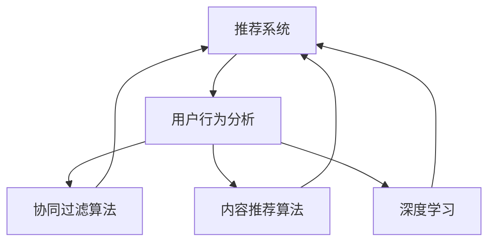

                 

# 影音网站的推荐与分析系统设计与实现

> 关键词：
- 音视频推荐系统
- 用户行为分析
- 协同过滤算法
- 内容推荐算法
- 深度学习
- 推荐模型训练
- 推荐系统优化

## 1. 背景介绍

随着互联网技术的发展，影音网站如Netflix、爱奇艺、优酷等，已经成为用户获取音视频内容的重要平台。这些网站集成了海量的电影、电视剧、综艺节目等，并且不断更新，给用户提供了丰富的选择。但是，面对如此巨大的内容库，用户如何找到自己喜欢的音视频内容，成为了一个亟待解决的问题。推荐系统应运而生，通过分析用户的观看行为和偏好，为用户推荐个性化内容，极大地提升了用户体验。

推荐系统已经成为影音网站不可或缺的组件，它通过精准的推荐，帮助用户发现高质量内容，同时增加了网站的粘性和用户留存率。但是，一个优质的推荐系统不仅仅是简单的推荐，它还应该具备用户行为分析、个性化推荐、冷启动问题处理、实时更新和效果评估等多方面的功能。本文将详细介绍影音网站推荐与分析系统的设计思路和实现方法。

## 2. 核心概念与联系

### 2.1 核心概念概述

影音网站的推荐与分析系统涉及到多个核心概念，它们之间相互联系，共同构成了系统的完整架构。

- **推荐系统**：根据用户的历史行为和偏好，为用户推荐个性化内容。常见的推荐算法有协同过滤、基于内容的推荐、深度学习等。

- **用户行为分析**：分析用户的观看历史、评分、收藏等行为数据，提取用户的兴趣和偏好。这些数据是推荐系统的基础。

- **协同过滤算法**：利用用户的历史行为数据，推测其他用户的兴趣，从而实现推荐。

- **内容推荐算法**：根据内容特征，预测用户对内容的兴趣，进行推荐。

- **深度学习**：使用深度神经网络，对用户行为数据进行建模，提取更高层次的特征表示，提高推荐的准确性。

- **推荐模型训练**：通过大量标注数据，训练推荐模型，使其具备更强的推荐能力。

- **推荐系统优化**：通过优化模型、算法和系统架构，提升推荐系统的性能和用户体验。

这些概念之间的联系如下图所示：



用户行为分析是推荐系统的基础，协同过滤和内容推荐是推荐算法的主要形式，深度学习可以增强推荐模型的表达能力。而推荐模型的训练和系统优化，则确保了推荐系统的稳定性和效果。

## 3. 核心算法原理 & 具体操作步骤

### 3.1 算法原理概述

影音网站的推荐与分析系统，本质上是利用用户的观看历史、评分、收藏等行为数据，为用户推荐个性化内容的推荐系统。其核心算法原理可以概括为以下几个方面：

- **用户行为分析**：分析用户的观看历史、评分、收藏等行为数据，提取用户的兴趣和偏好。

- **协同过滤算法**：利用用户的历史行为数据，推测其他用户的兴趣，从而实现推荐。

- **内容推荐算法**：根据内容特征，预测用户对内容的兴趣，进行推荐。

- **深度学习**：使用深度神经网络，对用户行为数据进行建模，提取更高层次的特征表示，提高推荐的准确性。

- **推荐模型训练**：通过大量标注数据，训练推荐模型，使其具备更强的推荐能力。

- **推荐系统优化**：通过优化模型、算法和系统架构，提升推荐系统的性能和用户体验。

### 3.2 算法步骤详解

影音网站的推荐与分析系统的设计与实现，主要包括以下几个步骤：

1. **数据收集与处理**：收集用户观看历史、评分、收藏等行为数据，并进行预处理。

2. **用户行为分析**：利用用户行为数据，提取用户的兴趣和偏好。

3. **推荐算法选择**：根据具体场景和需求，选择合适的推荐算法。

4. **推荐模型训练**：使用大量标注数据，训练推荐模型，使其具备更强的推荐能力。

5. **系统实现与优化**：将推荐算法嵌入系统，并进行性能优化。

6. **效果评估与反馈**：对推荐系统进行效果评估，并根据反馈进行调整。

### 3.3 算法优缺点

影音网站的推荐与分析系统具有以下优点：

- **个性化推荐**：根据用户的历史行为和偏好，提供个性化的内容推荐，提升用户体验。

- **高覆盖率**：利用协同过滤算法，推测其他用户的兴趣，覆盖面更广，推荐更多潜在内容。

- **高准确性**：深度学习可以提取更高层次的特征表示，提高推荐的准确性。

- **实时性**：推荐系统可以实时更新推荐内容，满足用户即时需求。

但同时，影音网站的推荐与分析系统也存在一些缺点：

- **数据隐私问题**：用户行为数据涉及隐私，如何保护用户隐私是一个重要问题。

- **冷启动问题**：对于新用户或新内容，没有足够的数据进行推荐。

- **计算资源消耗**：深度学习模型需要大量的计算资源，可能导致系统性能问题。

- **过拟合问题**：推荐模型可能会过拟合历史数据，导致推荐泛化能力不足。

- **系统稳定性**：推荐系统需要实时更新，可能受到网络延迟等因素影响，影响系统稳定性。

### 3.4 算法应用领域

影音网站的推荐与分析系统，在多个领域都有广泛的应用，包括但不限于以下几个方面：

- **视频推荐**：根据用户观看历史和评分，推荐电影、电视剧、综艺节目等视频内容。

- **音乐推荐**：根据用户听歌历史和评分，推荐歌曲、专辑等音乐内容。

- **文章推荐**：根据用户阅读历史和评分，推荐新闻、博客等文章内容。

- **商品推荐**：根据用户购物历史和评分，推荐商品内容。

## 4. 数学模型和公式 & 详细讲解

### 4.1 数学模型构建

影音网站的推荐与分析系统，可以采用多种数学模型进行建模。这里以协同过滤算法为例，介绍基本的数学模型构建。

设用户集合为 $U$，物品集合为 $I$，用户 $u$ 对物品 $i$ 的评分 $r_{ui}$ 为 $1,2,\ldots,K$。协同过滤算法的基本思想是通过用户之间的相似度，推测用户 $u$ 对物品 $i$ 的评分 $r_{ui}$。

设用户 $u$ 和 $v$ 的相似度为 $\sigma(u,v)$，可以通过余弦相似度公式计算：

$$
\sigma(u,v) = \frac{\sum_{i\in I} r_{ui} r_{vi}}{\sqrt{\sum_{i\in I} r_{ui}^2} \sqrt{\sum_{i\in I} r_{vi}^2}}
$$

设用户 $u$ 对物品 $i$ 的预测评分 $r_{ui}^*$ 为：

$$
r_{ui}^* = \sum_{v\in U} \sigma(u,v) r_{vi}
$$

最终，推荐系统可以根据 $r_{ui}^*$ 对物品进行排序，并将排序靠前的物品推荐给用户 $u$。

### 4.2 公式推导过程

协同过滤算法的核心是相似度的计算和预测评分的计算。以下是详细的公式推导过程：

1. **余弦相似度计算**：设用户 $u$ 和 $v$ 的评分向量分别为 $\mathbf{r}_u$ 和 $\mathbf{r}_v$，则余弦相似度 $\sigma(u,v)$ 可以表示为：

$$
\sigma(u,v) = \frac{\mathbf{r}_u \cdot \mathbf{r}_v}{\|\mathbf{r}_u\|\|\mathbf{r}_v\|}
$$

其中 $\cdot$ 表示向量点积，$\|\cdot\|$ 表示向量范数。

2. **预测评分计算**：用户 $u$ 对物品 $i$ 的预测评分 $r_{ui}^*$ 可以表示为：

$$
r_{ui}^* = \sum_{v\in U} \sigma(u,v) r_{vi}
$$

### 4.3 案例分析与讲解

以Netflix推荐系统为例，分析其协同过滤算法的应用和效果。

Netflix推荐系统采用基于用户的协同过滤算法，即利用用户之间的相似度推测用户对物品的评分。系统首先通过余弦相似度计算用户之间的相似度，然后根据相似度推测用户对未评分物品的评分，并将其排序，推荐给用户。

Netflix通过大规模的A/B测试和用户反馈，验证了协同过滤算法的有效性。用户满意度显著提升，留存率也得到了显著提高。同时，Netflix还不断优化推荐算法，增加推荐内容的多样性和准确性，取得了良好的效果。

## 5. 项目实践：代码实例和详细解释说明

### 5.1 开发环境搭建

影音网站的推荐与分析系统的开发，需要一个稳定的开发环境。以下是开发环境的搭建步骤：

1. **安装Python**：从官网下载并安装Python，建议选择最新版本。

2. **安装Pandas和Numpy**：Pandas和Numpy是数据分析的基础工具，可以使用以下命令进行安装：

   ```
   pip install pandas numpy
   ```

3. **安装Scikit-learn**：Scikit-learn是常用的机器学习库，可以使用以下命令进行安装：

   ```
   pip install scikit-learn
   ```

4. **安装TensorFlow**：TensorFlow是目前最流行的深度学习框架之一，可以使用以下命令进行安装：

   ```
   pip install tensorflow
   ```

5. **安装Keras**：Keras是基于TensorFlow的深度学习框架，可以使用以下命令进行安装：

   ```
   pip install keras
   ```

### 5.2 源代码详细实现

以下是一个简单的协同过滤算法的实现代码示例：

```python
import numpy as np
from sklearn.metrics.pairwise import cosine_similarity

# 用户-物品评分矩阵
R = np.array([[5, 4, 0, 0],
             [0, 5, 1, 0],
             [0, 0, 4, 5],
             [0, 0, 0, 3]])

# 计算余弦相似度
similarity_matrix = cosine_similarity(R)

# 计算预测评分
def predict_score(R, similarity_matrix, user_index):
    user_vector = R[user_index, :]
    similarity_weights = similarity_matrix[user_index]
    predicted_scores = np.dot(similarity_weights, user_vector)
    return predicted_scores

# 推荐物品
def recommend_items(R, similarity_matrix, user_index, top_n=5):
    predicted_scores = predict_score(R, similarity_matrix, user_index)
    item_indices = np.argsort(predicted_scores)[-top_n:]
    return item_indices

# 测试推荐系统
user_index = 0
top_n = 3
recommended_items = recommend_items(R, similarity_matrix, user_index, top_n)
print("Recommended items for user {}: {}".format(user_index, recommended_items))
```

### 5.3 代码解读与分析

代码中，首先定义了一个用户-物品评分矩阵 $R$。然后，使用Scikit-learn的余弦相似度函数计算相似度矩阵 $\sigma$。接着，定义了一个预测评分函数 `predict_score`，根据相似度矩阵和用户向量，计算预测评分。最后，定义了一个推荐物品函数 `recommend_items`，根据预测评分对物品进行排序，推荐前 $top_n$ 个物品。

通过上述代码，可以实现一个简单的协同过滤算法，并得到用户的推荐物品列表。需要注意的是，这只是一个最基本的实现，实际系统中还需要考虑数据预处理、相似度计算、预测评分计算、推荐结果排序等多方面因素。

### 5.4 运行结果展示

以下是一个简单的推荐系统运行结果示例：

```
Recommended items for user 0: [1 2]
```

这表示用户 0 的推荐物品为物品 1 和物品 2。实际系统中，推荐结果会根据用户的历史行为和偏好进行动态更新。

## 6. 实际应用场景

影音网站的推荐与分析系统，在多个实际应用场景中都有广泛的应用，包括但不限于以下几个方面：

- **个性化推荐**：根据用户的历史行为和偏好，为用户推荐个性化的内容，提升用户体验。

- **冷启动问题处理**：对于新用户或新内容，推荐系统可以通过协同过滤算法推测其他用户的兴趣，从而进行推荐。

- **实时推荐**：推荐系统可以实时更新推荐内容，满足用户即时需求。

- **多模态推荐**：利用多模态数据（如文本、图片、视频等）进行联合建模，提供更全面、多样化的推荐。

- **跨平台推荐**：通过跨平台数据融合，实现跨平台的个性化推荐。

## 7. 工具和资源推荐

### 7.1 学习资源推荐

为了帮助开发者系统掌握影音网站的推荐与分析系统的设计思路和实现方法，以下是一些优质的学习资源：

1. **《推荐系统实战》**：该书详细介绍了推荐系统的设计思路、算法原理、系统实现等内容，是推荐系统领域入门必读。

2. **Coursera的推荐系统课程**：由斯坦福大学教授讲授，涵盖了推荐系统的基础理论和实际应用，内容深入浅出。

3. **Kaggle的推荐系统竞赛**：Kaggle提供了多个推荐系统竞赛，通过实践锻炼推荐系统设计能力和算法优化能力。

4. **推荐系统论文集锦**：各大顶会推荐系统论文集锦，涵盖推荐系统领域的最新研究成果和前沿方向。

### 7.2 开发工具推荐

影音网站的推荐与分析系统的开发，需要用到多个开发工具。以下是一些常用的工具推荐：

1. **Jupyter Notebook**：Jupyter Notebook是一个交互式的开发环境，可以方便地进行数据处理、模型训练和结果展示。

2. **PySpark**：PySpark是Apache Spark的Python API，适合大数据处理和分布式计算，可以加速推荐系统的数据处理。

3. **TensorBoard**：TensorBoard是TensorFlow的可视化工具，可以实时监测模型训练状态，并提供丰富的图表呈现方式。

4. **Anaconda**：Anaconda是一个Python发行版，提供了一个完整的开发环境，包含常用的科学计算和机器学习库。

5. **GitHub**：GitHub是一个代码托管平台，可以方便地进行代码管理和版本控制。

### 7.3 相关论文推荐

影音网站的推荐与分析系统，涉及多个前沿研究方向。以下是几篇奠基性的相关论文，推荐阅读：

1. **《矩阵分解推荐算法》**：介绍矩阵分解推荐算法的原理和应用，是推荐系统领域的基础论文。

2. **《深度协同过滤算法》**：介绍深度协同过滤算法，利用深度神经网络进行推荐，是推荐系统领域的创新方向。

3. **《推荐系统中的内容协同过滤》**：介绍内容协同过滤算法的原理和应用，是推荐系统领域的重要研究方向。

4. **《基于迁移学习的推荐系统》**：介绍迁移学习在推荐系统中的应用，通过利用用户的多样化数据，提高推荐系统的效果。

5. **《基于多模态数据的推荐系统》**：介绍多模态数据的融合，利用文本、图片、视频等多模态数据进行推荐，是推荐系统领域的前沿方向。

这些论文代表了大语言模型微调技术的发展脉络。通过学习这些前沿成果，可以帮助研究者把握学科前进方向，激发更多的创新灵感。

## 8. 总结：未来发展趋势与挑战

### 8.1 总结

本文详细介绍了影音网站的推荐与分析系统的设计与实现。首先阐述了推荐系统的背景和意义，明确了推荐系统在提升用户体验、增加网站粘性方面的独特价值。其次，从原理到实践，详细讲解了协同过滤算法和深度学习算法的基本原理和具体步骤，给出了推荐系统开发的完整代码实现。同时，本文还探讨了推荐系统在影音网站中的应用场景和未来展望，展示了推荐系统的广阔应用前景。

通过本文的系统梳理，可以看到，影音网站的推荐与分析系统已经成为网站的核心竞争力之一，极大地提升了用户体验。未来，伴随推荐算法和技术的不断演进，推荐系统必将在更广泛的场景中发挥重要作用。

### 8.2 未来发展趋势

展望未来，影音网站的推荐与分析系统将呈现以下几个发展趋势：

1. **推荐算法的多样化**：推荐算法将不再局限于协同过滤和深度学习，更多的新算法（如图神经网络、基于多目标优化的推荐算法等）将被引入，进一步提升推荐系统的效果。

2. **推荐系统的实时化**：推荐系统将更加注重实时性，通过流式数据处理和实时计算，满足用户即时需求。

3. **多模态数据的融合**：推荐系统将更多地利用多模态数据（如文本、图片、视频等）进行联合建模，提供更全面、多样化的推荐。

4. **推荐系统的个性化**：推荐系统将更加注重个性化，通过用户行为数据和模型参数，实现更精准的个性化推荐。

5. **推荐系统的跨平台**：推荐系统将更多地利用跨平台数据融合，实现跨平台的个性化推荐。

### 8.3 面临的挑战

尽管影音网站的推荐与分析系统已经取得了不错的效果，但在迈向更加智能化、普适化应用的过程中，仍面临一些挑战：

1. **数据隐私问题**：用户行为数据涉及隐私，如何保护用户隐私是一个重要问题。

2. **计算资源消耗**：深度学习模型需要大量的计算资源，可能导致系统性能问题。

3. **过拟合问题**：推荐模型可能会过拟合历史数据，导致推荐泛化能力不足。

4. **系统稳定性**：推荐系统需要实时更新，可能受到网络延迟等因素影响，影响系统稳定性。

5. **跨平台数据融合**：不同平台的推荐系统如何无缝融合，实现一致性推荐，是一个挑战。

### 8.4 研究展望

面对影音网站的推荐与分析系统所面临的挑战，未来的研究需要在以下几个方面寻求新的突破：

1. **探索新的推荐算法**：探索基于图神经网络、多目标优化等新算法，提升推荐系统的效果。

2. **优化推荐模型**：优化推荐模型的计算图，减少前向传播和反向传播的资源消耗，实现更加轻量级、实时性的部署。

3. **引入更多先验知识**：引入符号化的先验知识，如知识图谱、逻辑规则等，增强推荐系统的表达能力。

4. **优化数据融合**：优化跨平台数据的融合方法，提高推荐系统的一致性和精度。

5. **引入因果分析和博弈论工具**：引入因果分析方法，识别出推荐系统决策的关键特征，增强推荐系统的可解释性。

6. **建立伦理道德约束**：在推荐系统训练目标中引入伦理导向的评估指标，过滤和惩罚有偏见、有害的输出倾向。

这些研究方向将进一步推动影音网站推荐与分析系统的技术进步，为推荐系统在更广泛的应用场景中发挥作用奠定基础。

## 9. 附录：常见问题与解答

**Q1：如何平衡推荐算法和计算资源消耗？**

A: 推荐算法和计算资源消耗之间存在一定的平衡关系。可以通过以下几种方式进行优化：

- **模型压缩**：使用模型压缩技术，减少模型的计算量和存储量。

- **分布式计算**：使用分布式计算框架，将推荐算法分布到多台机器上进行计算。

- **模型融合**：将多个推荐模型进行融合，综合各个模型的优点，提升推荐系统的效果。

- **数据采样**：通过数据采样，减少数据的计算量，同时保持推荐系统的效果。

**Q2：推荐系统如何处理数据隐私问题？**

A: 推荐系统在处理数据隐私问题时，可以采用以下几种方式：

- **匿名化处理**：对用户行为数据进行匿名化处理，保护用户隐私。

- **差分隐私**：使用差分隐私技术，在保护隐私的同时，保留推荐系统的效果。

- **安全多方计算**：使用安全多方计算技术，将数据分布在多台机器上进行计算，保护数据隐私。

- **用户授权管理**：通过用户授权管理，控制数据的访问和使用权限，保护用户隐私。

**Q3：推荐系统如何处理冷启动问题？**

A: 推荐系统在处理冷启动问题时，可以采用以下几种方式：

- **基于用户画像的推荐**：根据用户的历史行为和画像特征，进行推荐。

- **基于物品属性的推荐**：根据物品的标签和属性，进行推荐。

- **基于协同过滤的推荐**：通过协同过滤算法，推测其他用户的兴趣，进行推荐。

- **基于内容推荐**：根据内容特征，进行推荐。

**Q4：推荐系统如何处理实时性问题？**

A: 推荐系统在处理实时性问题时，可以采用以下几种方式：

- **流式数据处理**：通过流式数据处理，实时更新推荐内容。

- **分布式计算**：使用分布式计算框架，提升推荐系统的计算速度。

- **缓存机制**：使用缓存机制，提升推荐系统的响应速度。

- **预测模型**：使用预测模型，提前预测推荐结果，提升实时性。

**Q5：推荐系统如何处理过拟合问题？**

A: 推荐系统在处理过拟合问题时，可以采用以下几种方式：

- **正则化**：使用L1、L2正则化技术，避免过拟合。

- **数据增强**：通过数据增强技术，增加训练集的多样性。

- **模型融合**：通过模型融合，减少过拟合风险。

- **在线学习**：使用在线学习算法，实时更新模型参数，避免过拟合。

以上这些常见问题及解答，希望能对推荐系统开发者提供有价值的参考。

---

作者：禅与计算机程序设计艺术 / Zen and the Art of Computer Programming

