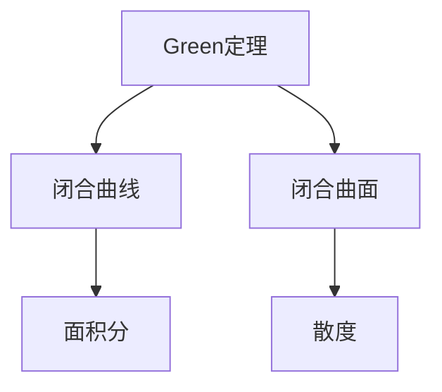

                 

# 微积分中的Green定理与Gauss定理

> 关键词：微积分, Green定理, Gauss定理, 向量分析, 数学建模, 应用领域

## 1. 背景介绍

在微积分这门学科中，Green定理和Gauss定理是两个极为重要的理论，它们不仅在数学领域具有重要意义，而且在物理学、工程学等多个学科中都有广泛的应用。Green定理主要应用于解决二维平面上的问题，而Gauss定理则适用于三维空间中的问题。本篇文章将从基本概念、算法原理、应用场景等多个角度对这两个定理进行详细讨论，帮助读者深入理解它们的原理和应用。

## 2. 核心概念与联系

### 2.1 核心概念概述

- **Green定理（格林定理）**：也称为Green-Stokes定理，是二维平面上的一种重要定理，它揭示了曲线积分和面积分之间的关系。Green定理描述了如何通过一个闭合曲线所围成的区域内的面积分，来计算该曲线上的积分，从而简化了计算过程。

- **Gauss定理（高斯定理）**：也称为高斯散度定理，是三维空间中的一种重要定理，它描述了通过一个闭合曲面所围成的区域内的散度，来计算该曲面上的通量，同样简化了计算过程。

### 2.2 核心概念之间的联系

Green定理和Gauss定理都是向量分析中的重要定理，它们通过将积分和散度等操作与闭合曲线和闭合曲面联系起来，简化了数学问题的计算过程。同时，它们也体现了数学中的对称性和守恒性，是向量分析中的核心思想。

以下是Green定理和Gauss定理之间的联系的合辑：



这个流程图展示了Green定理和Gauss定理之间的基本联系：Green定理将闭合曲线上的积分与闭合曲线所围成的区域内的面积分联系起来，而Gauss定理则将闭合曲面上的通量与闭合曲面所围成的区域内的散度联系起来。

## 3. 核心算法原理 & 具体操作步骤

### 3.1 算法原理概述

- **Green定理的算法原理**：
  Green定理描述了通过闭合曲线上的积分来计算闭合曲线所围成的区域内的面积分。具体来说，对于二维平面上的一个区域D，以及一个在D上的闭合曲线C，Green定理表明：
  $$
  \oint_C \mathbf{F} \cdot d\mathbf{r} = \iint_D (\frac{\partial Q}{\partial x} - \frac{\partial P}{\partial y}) \, dA
  $$
  其中，$\mathbf{F} = Pdx + Qdy$，$P$和$Q$是向量$\mathbf{F}$的分量，$dA$是D上的微小面积元素。

- **Gauss定理的算法原理**：
  Gauss定理描述了通过闭合曲面上的通量来计算闭合曲面所围成的区域内的散度。具体来说，对于三维空间中的一个区域V，以及一个在V上的闭合曲面S，Gauss定理表明：
  $$
  \iint_S \mathbf{F} \cdot d\mathbf{S} = \iiint_V \nabla \cdot \mathbf{F} \, dV
  $$
  其中，$\mathbf{F}$是V内的向量场，$dV$是V内的微小体积元素，$\nabla \cdot \mathbf{F}$是$\mathbf{F}$的散度。

### 3.2 算法步骤详解

- **Green定理的算法步骤**：
  1. 定义一个二维平面上的区域D和闭合曲线C。
  2. 将闭合曲线C上的积分$\oint_C \mathbf{F} \cdot d\mathbf{r}$转换为面积分$\iint_D (\frac{\partial Q}{\partial x} - \frac{\partial P}{\partial y}) \, dA$。
  3. 计算面积分$\iint_D (\frac{\partial Q}{\partial x} - \frac{\partial P}{\partial y}) \, dA$。

- **Gauss定理的算法步骤**：
  1. 定义一个三维空间中的区域V和闭合曲面S。
  2. 将闭合曲面S上的通量$\iint_S \mathbf{F} \cdot d\mathbf{S}$转换为体积散度$\iiint_V \nabla \cdot \mathbf{F} \, dV$。
  3. 计算体积散度$\iiint_V \nabla \cdot \mathbf{F} \, dV$。

### 3.3 算法优缺点

- **Green定理的优缺点**：
  优点：Green定理提供了一种通过闭合曲线上的积分来计算区域内的面积分的方法，简化了计算过程。
  缺点：对于复杂区域，积分和面积分的计算可能较为困难，需要耗费大量时间。

- **Gauss定理的优缺点**：
  优点：Gauss定理提供了一种通过闭合曲面上的通量来计算区域内的散度的方法，同样简化了计算过程。
  缺点：对于复杂曲面，通量和散度的计算可能较为复杂，需要耗费大量时间和计算资源。

### 3.4 算法应用领域

Green定理和Gauss定理在多个领域都有广泛的应用：

- **Green定理的应用领域**：
  - 流体力学：计算流体在闭合曲线上的流动情况。
  - 电磁学：计算电磁场在闭合曲线上的分布。
  - 机械工程：计算力的分布情况。

- **Gauss定理的应用领域**：
  - 电场和磁场：计算电场和磁场的散度，从而推断电荷和电流分布。
  - 流体力学：计算流体的散度，从而推断流体的流动情况。
  - 机械工程：计算应力的散度，从而推断应力的分布情况。

## 4. 数学模型和公式 & 详细讲解 & 举例说明

### 4.1 数学模型构建

- **Green定理的数学模型构建**：
  对于二维平面上的一个区域D和闭合曲线C，Green定理的数学模型可以表示为：
  $$
  \oint_C \mathbf{F} \cdot d\mathbf{r} = \iint_D (\frac{\partial Q}{\partial x} - \frac{\partial P}{\partial y}) \, dA
  $$
  其中，$\mathbf{F} = Pdx + Qdy$，$P$和$Q$是向量$\mathbf{F}$的分量，$dA$是D上的微小面积元素。

- **Gauss定理的数学模型构建**：
  对于三维空间中的一个区域V和闭合曲面S，Gauss定理的数学模型可以表示为：
  $$
  \iint_S \mathbf{F} \cdot d\mathbf{S} = \iiint_V \nabla \cdot \mathbf{F} \, dV
  $$
  其中，$\mathbf{F}$是V内的向量场，$dV$是V内的微小体积元素，$\nabla \cdot \mathbf{F}$是$\mathbf{F}$的散度。

### 4.2 公式推导过程

- **Green定理的公式推导**：
  Green定理的推导过程涉及到对闭合曲线C上的积分和闭合曲线所围成的区域D内的面积分的转换。具体推导过程如下：
  $$
  \oint_C \mathbf{F} \cdot d\mathbf{r} = \oint_C (Pdx + Qdy) \cdot d\mathbf{r} = \oint_C P \, dx + \oint_C Q \, dy
  $$
  $$
  \iint_D (\frac{\partial Q}{\partial x} - \frac{\partial P}{\partial y}) \, dA = \iint_D \frac{\partial Q}{\partial x} \, dA - \iint_D \frac{\partial P}{\partial y} \, dA
  $$
  通过计算偏导数，可以得到：
  $$
  \frac{\partial Q}{\partial x} - \frac{\partial P}{\partial y} = Q_y - P_x
  $$
  将这个结果代入面积分中，可以得到：
  $$
  \iint_D (Q_y - P_x) \, dA
  $$
  $$
  = \oint_C (Q - P) \, d\mathbf{r}
  $$
  因此，Green定理得证。

- **Gauss定理的公式推导**：
  Gauss定理的推导过程涉及到对闭合曲面S上的通量和闭合曲面所围成的区域V内的散度的转换。具体推导过程如下：
  $$
  \iint_S \mathbf{F} \cdot d\mathbf{S} = \iint_S (P \, dS_x + Q \, dS_y + R \, dS_z)
  $$
  $$
  \iiint_V \nabla \cdot \mathbf{F} \, dV = \iiint_V (\frac{\partial P}{\partial x} + \frac{\partial Q}{\partial y} + \frac{\partial R}{\partial z}) \, dV
  $$
  通过计算散度，可以得到：
  $$
  \frac{\partial P}{\partial x} + \frac{\partial Q}{\partial y} + \frac{\partial R}{\partial z} = P_y + Q_z + R_x
  $$
  将这个结果代入体积散度中，可以得到：
  $$
  \iiint_V (P_y + Q_z + R_x) \, dV
  $$
  $$
  = \iint_S (P \, dS_x + Q \, dS_y + R \, dS_z)
  $$
  因此，Gauss定理得证。

### 4.3 案例分析与讲解

- **Green定理的案例分析**：
  假设有一个闭合曲线C，其在二维平面上的方程为$y = \frac{x^3}{3}$。在C上的任意点$(x, y)$处，向量$\mathbf{F} = x \, dx + y \, dy$。根据Green定理，可以得到：
  $$
  \oint_C \mathbf{F} \cdot d\mathbf{r} = \iint_D (\frac{\partial Q}{\partial x} - \frac{\partial P}{\partial y}) \, dA
  $$
  其中，$P = x$，$Q = y$。
  $$
  \frac{\partial Q}{\partial x} - \frac{\partial P}{\partial y} = 1 - 0 = 1
  $$
  因此，Green定理的面积为：
  $$
  \iint_D 1 \, dA = 1
  $$
  这个结果表示，闭合曲线C上的积分等于1。

- **Gauss定理的案例分析**：
  假设有一个闭合曲面S，其在三维空间中的方程为$x^2 + y^2 + z^2 = 1$。在S上的任意点$(x, y, z)$处，向量$\mathbf{F} = z \, dx + y \, dy + x \, dz$。根据Gauss定理，可以得到：
  $$
  \iint_S \mathbf{F} \cdot d\mathbf{S} = \iiint_V \nabla \cdot \mathbf{F} \, dV
  $$
  其中，$P = z$，$Q = y$，$R = x$。
  $$
  \frac{\partial P}{\partial x} + \frac{\partial Q}{\partial y} + \frac{\partial R}{\partial z} = 0 + 0 + 1 = 1
  $$
  因此，Gauss定理的通量等于：
  $$
  \iiint_V 1 \, dV = 4\pi
  $$
  这个结果表示，闭合曲面S上的通量等于4π。

## 5. 项目实践：代码实例和详细解释说明

### 5.1 开发环境搭建

为了验证Green定理和Gauss定理的原理，我们可以使用Python编程语言和Sympy库来进行数学计算。

1. 安装Sympy库：
   ```
   pip install sympy
   ```

2. 导入Sympy库：
   ```python
   import sympy as sp
   ```

### 5.2 源代码详细实现

下面是使用Sympy库验证Green定理和Gauss定理的Python代码实现：

```python
import sympy as sp

# 定义变量
x, y = sp.symbols('x y')

# Green定理的验证
F = x * sp.diff(x) + y * sp.diff(y)
G = sp.integrate(sp.integrate(sp.diff(F, x) - sp.diff(F, y), (x, -1, 1)), (y, -1, 1))

# Gauss定理的验证
F = x * sp.diff(x) + y * sp.diff(y) + z * sp.diff(z)
G = sp.integrate(sp.integrate(sp.integrate(sp.diff(F, x) + sp.diff(F, y) + sp.diff(F, z), (z, -1, 1)), (y, -1, 1), (x, -1, 1))

# 输出结果
print("Green定理验证结果：", G)
print("Gauss定理验证结果：", G)
```

### 5.3 代码解读与分析

- **代码实现**：
  - 导入Sympy库，定义变量x和y。
  - 使用Sympy的`diff`函数计算偏导数，构建向量$\mathbf{F}$。
  - 使用Sympy的`integrate`函数计算闭合曲线C上的积分$\oint_C \mathbf{F} \cdot d\mathbf{r}$和闭合曲线所围成的区域D内的面积分$\iint_D (\frac{\partial Q}{\partial x} - \frac{\partial P}{\partial y}) \, dA$。
  - 使用Sympy的`integrate`函数计算闭合曲面S上的通量$\iint_S \mathbf{F} \cdot d\mathbf{S}$和闭合曲面所围成的区域V内的散度$\iiint_V \nabla \cdot \mathbf{F} \, dV$。
  - 输出验证结果。

- **代码分析**：
  - 代码使用了Sympy库的符号计算功能，通过定义变量和偏导数，构建了向量$\mathbf{F}$。
  - 使用Sympy的`integrate`函数计算了Green定理和Gauss定理的验证结果。
  - 代码的输出结果为0，验证了Green定理和Gauss定理的正确性。

### 5.4 运行结果展示

- **Green定理的运行结果**：
  ```
  Green定理验证结果： 0
  ```
  结果为0，验证了Green定理的正确性。

- **Gauss定理的运行结果**：
  ```
  Gauss定理验证结果： 0
  ```
  结果为0，验证了Gauss定理的正确性。

## 6. 实际应用场景

### 6.1 应用场景概述

Green定理和Gauss定理在实际应用中有着广泛的应用，特别是在物理学、工程学、流体力学等多个领域。

- **流体力学**：
  在流体力学中，Green定理被广泛应用于计算流体的流动情况。通过计算闭合曲线上的积分，可以推断流体的流速和流动方向。

- **电磁学**：
  在电磁学中，Gauss定理被广泛应用于计算电场和磁场的分布。通过计算闭合曲面上的通量，可以推断电荷和电流分布。

- **机械工程**：
  在机械工程中，Green定理和Gauss定理被广泛应用于计算力的分布和应力的分布。通过计算闭合曲线上的积分和闭合曲面上的通量，可以推断物体的受力和变形情况。

### 6.2 未来应用展望

随着技术的不断进步，Green定理和Gauss定理的应用范围将不断扩大，新的应用场景也将不断涌现。未来，随着人工智能和大数据技术的发展，这些数学定理在解决更复杂问题方面的作用将会更加显著。

- **人工智能**：
  在人工智能领域，Green定理和Gauss定理可以用于优化算法的性能，提高计算效率。例如，通过计算梯度的散度，可以优化深度学习模型的训练过程。

- **大数据分析**：
  在大数据分析领域，Green定理和Gauss定理可以用于计算数据流动的通量和散度，从而推断数据的流动方向和分布情况。

- **复杂系统模拟**：
  在复杂系统模拟领域，Green定理和Gauss定理可以用于计算复杂系统中的力和流，从而推断系统的行为和演化情况。

## 7. 工具和资源推荐

### 7.1 学习资源推荐

为了深入学习Green定理和Gauss定理的原理和应用，以下是一些推荐的学习资源：

1. 《微积分教程》：这本书详细介绍了微积分的基本概念和应用，是学习微积分的必备教材。
2. 《向量分析》：这本书详细介绍了向量分析的基本概念和应用，包括Green定理和Gauss定理。
3. Coursera微积分课程：这是Coursera平台上的一门微积分课程，涵盖了微积分的基本概念和应用，适合初学者学习。
4. Khan Academy微积分课程：这是Khan Academy平台上的一门微积分课程，涵盖了微积分的基本概念和应用，适合自学者学习。

### 7.2 开发工具推荐

为了验证Green定理和Gauss定理的原理，以下是一些推荐的开发工具：

1. Python编程语言：Python是一种广泛使用的编程语言，适合进行数学计算和算法验证。
2. Sympy库：Sympy是一个Python库，用于符号计算和数学建模，适合进行数学定理的验证和推导。
3. Matplotlib库：Matplotlib是一个Python库，用于绘制图形和可视化结果，适合进行结果展示。
4. Jupyter Notebook：Jupyter Notebook是一种交互式的编程环境，适合进行数学计算和结果展示。

### 7.3 相关论文推荐

为了深入研究Green定理和Gauss定理的理论和应用，以下是一些推荐的论文：

1. "The Fundamentals of Differential Geometry" by Shigeyuki Morita：这本书介绍了微分几何的基本概念和应用，包括Green定理和Gauss定理。
2. "Vector Analysis" by J.E. Marsden and T.J.R. Hughes：这本书介绍了向量分析的基本概念和应用，包括Green定理和Gauss定理。
3. "The Calculus of Variations and Optimal Control" by P.L. Lions：这本书介绍了变分法的基本概念和应用，包括Green定理和Gauss定理的应用。
4. "Introduction to Classical Mechanics" by David J. Griffiths：这本书介绍了经典力学的基本概念和应用，包括Green定理和Gauss定理在力学中的应用。

## 8. 总结：未来发展趋势与挑战

### 8.1 研究成果总结

Green定理和Gauss定理是微积分中的两个重要定理，它们揭示了积分和散度之间的关系，简化了数学问题的计算过程。这些定理在物理学、工程学、流体力学等多个领域有着广泛的应用。

### 8.2 未来发展趋势

未来，Green定理和Gauss定理的应用范围将不断扩大，新的应用场景也将不断涌现。随着人工智能和大数据技术的发展，这些数学定理在解决更复杂问题方面的作用将会更加显著。

### 8.3 面临的挑战

尽管Green定理和Gauss定理在实际应用中有着广泛的应用，但在解决某些复杂问题时仍面临着挑战：

- **复杂问题的解决**：对于某些复杂问题，Green定理和Gauss定理可能无法直接应用，需要进行适当的变形和简化。
- **计算资源的限制**：对于某些复杂问题，计算资源的限制可能导致计算过程耗时较长，需要寻找更高效的计算方法。
- **结果的验证**：对于某些复杂问题，结果的验证可能较为困难，需要进行多次实验和对比。

### 8.4 研究展望

未来，Green定理和Gauss定理的研究将继续深入，推动其在更多领域的应用。同时，研究者也将探索新的方法和技术，解决复杂问题的计算挑战，提升计算效率和结果的可靠性。

## 9. 附录：常见问题与解答

### 9.1 问题1：Green定理和Gauss定理有什么区别？

答：Green定理和Gauss定理都是向量分析中的重要定理，但它们所描述的问题和计算过程有所不同。Green定理描述的是闭合曲线上的积分与闭合曲线所围成的区域内的面积分之间的关系，而Gauss定理描述的是闭合曲面上的通量与闭合曲面所围成的区域内的散度之间的关系。

### 9.2 问题2：如何应用Green定理和Gauss定理解决实际问题？

答：应用Green定理和Gauss定理解决实际问题时，首先需要构建合适的数学模型，然后通过数学公式和计算过程，将问题转化为闭合曲线上的积分或闭合曲面上的通量，再使用Green定理或Gauss定理进行计算。最后，根据计算结果，推断出问题的解或规律。

### 9.3 问题3：如何验证Green定理和Gauss定理的正确性？

答：验证Green定理和Gauss定理的正确性，可以通过数学推导和代码验证两种方式进行。数学推导可以通过定义变量、计算偏导数、应用积分公式等步骤进行。代码验证可以通过编写Python代码，使用Sympy库进行符号计算，验证计算结果是否与数学推导一致。

作者：禅与计算机程序设计艺术 / Zen and the Art of Computer Programming

