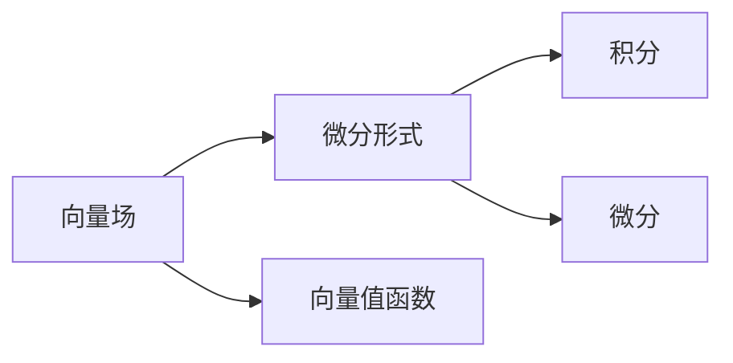

                 

# 微积分中的向量场与微分形式

微积分是数学领域中的重要分支，广泛应用于物理学、工程学、经济学等多个学科。其中，向量场与微分形式是微积分中的核心概念，有着广泛的应用场景，如电磁场理论、流体力学、计算机视觉等。本文将系统介绍向量场与微分形式的基本概念、数学模型、应用场景，并通过案例讲解，展示其在实际问题中的求解过程。

## 1. 背景介绍

向量场是向量值函数，在数学和物理学中有着重要的应用。例如，电磁场理论中的电场和磁场、流体力学中的速度场和压力场等，都是向量场。微分形式是处理向量场的有力工具，能够将向量场的特性与坐标变换、积分等数学操作有机结合。因此，向量场与微分形式共同构成了微积分中的重要研究对象。

## 2. 核心概念与联系

### 2.1 核心概念概述

#### 2.1.1 向量场
向量场是一种定义在某个区域内的向量值函数，每个点都有一个对应的向量值。例如，在二维平面上，向量场可以用一个向量$ \vec{F}(x,y) = \langle P(x,y), Q(x,y) \rangle $来表示，其中 $P(x,y)$ 和 $Q(x,y)$ 分别是 $x$ 和 $y$ 的函数。

#### 2.1.2 微分形式
微分形式是一个线性表达式，由一组基形式和一组系数组成。例如，在二维平面上，微分形式可以用 $dx \wedge dy$ 来表示。其中， $dx$ 和 $dy$ 是两个基形式，而 $dx \wedge dy$ 表示一个二维的微分形式。

### 2.2 概念间的关系

向量场和微分形式之间有着紧密的联系。具体来说，向量场可以视为一个向量值函数，而微分形式则是处理向量场的工具。通过将向量场表示为微分形式，可以方便地进行积分、微分等数学运算。因此，向量场与微分形式是微积分中不可或缺的两个重要概念。

以下是一个简单的Mermaid流程图，展示了向量场和微分形式之间的关系：



## 3. 核心算法原理 & 具体操作步骤

### 3.1 算法原理概述
向量场与微分形式的计算原理主要涉及向量的运算、积分和微分等数学操作。下面分别介绍这些操作的数学原理。

#### 3.1.1 向量运算
向量运算主要包括向量的加法、减法和点积等基本操作。例如，两个向量 $\vec{a} = \langle a_x, a_y \rangle$ 和 $\vec{b} = \langle b_x, b_y \rangle$ 的点积可以表示为：

$$ \vec{a} \cdot \vec{b} = a_x b_x + a_y b_y $$

#### 3.1.2 积分运算
积分运算可以用于计算向量场在某个区域内的通量。例如，对于二维向量场 $\vec{F}(x,y) = \langle P(x,y), Q(x,y) \rangle$，其在区域 $D$ 内的通量可以表示为：

$$ \iint_D \vec{F} \cdot d\vec{S} $$

其中， $d\vec{S}$ 表示区域的面积微元，可以视为一个微分形式。

#### 3.1.3 微分运算
微分运算可以用于计算向量场的散度和旋度。例如，对于二维向量场 $\vec{F}(x,y) = \langle P(x,y), Q(x,y) \rangle$，其在 $(x,y)$ 点的散度可以表示为：

$$ \nabla \cdot \vec{F} = \frac{\partial P}{\partial x} + \frac{\partial Q}{\partial y} $$

在三维空间中，散度可以表示为：

$$ \nabla \cdot \vec{F} = \frac{\partial P}{\partial x} + \frac{\partial Q}{\partial y} + \frac{\partial R}{\partial z} $$

旋度可以表示为：

$$ \nabla \times \vec{F} = \langle \frac{\partial Q}{\partial z} - \frac{\partial R}{\partial y}, \frac{\partial R}{\partial x} - \frac{\partial P}{\partial z}, \frac{\partial P}{\partial y} - \frac{\partial Q}{\partial x} \rangle $$

### 3.2 算法步骤详解
基于向量场与微分形式的算法步骤可以分为以下几个步骤：

#### 3.2.1 数据预处理
首先需要将向量场的数据按照规定的格式进行预处理，例如将坐标数据读入数组，进行坐标转换等操作。

#### 3.2.2 向量场表示
将预处理后的数据按照向量场的形式进行表示。例如，在二维平面上，向量场可以用一个向量值函数 $\vec{F}(x,y) = \langle P(x,y), Q(x,y) \rangle$ 来表示。

#### 3.2.3 微分形式表示
将向量场表示为微分形式。例如，在二维平面上，微分形式可以用 $dx \wedge dy$ 来表示。

#### 3.2.4 积分和微分计算
使用积分和微分计算公式，进行积分和微分计算。例如，在二维平面上，计算向量场在某个区域内的通量和散度可以表示为：

$$ \iint_D \vec{F} \cdot d\vec{S} $$
$$ \nabla \cdot \vec{F} = \frac{\partial P}{\partial x} + \frac{\partial Q}{\partial y} $$

#### 3.2.5 结果后处理
将计算结果进行后处理，例如将结果可视化、打印输出等。

### 3.3 算法优缺点
基于向量场与微分形式的算法有以下优点：

- 可以处理复杂的向量场问题，例如电磁场、流体力学等。
- 能够方便地进行积分和微分计算。
- 可以用于处理高维空间中的向量场问题。

同时，该算法也存在一些缺点：

- 需要处理大量的数学运算，计算复杂度高。
- 对于某些特殊问题，可能需要引入一些额外的技巧和工具。
- 需要具备一定的数学基础，理解难度较大。

### 3.4 算法应用领域
向量场与微分形式在多个领域都有广泛的应用，例如：

- 电磁场理论：用于计算电场、磁场等向量场的通量和散度。
- 流体力学：用于计算速度场、压力场等向量场的旋度和散度。
- 计算机视觉：用于处理图像中的边缘检测、纹理分析等问题。

## 4. 数学模型和公式 & 详细讲解

### 4.1 数学模型构建

向量场与微分形式的数学模型可以表示为：

$$ \vec{F}(x,y,z) = \langle P(x,y,z), Q(x,y,z), R(x,y,z) \rangle $$

其中，$P(x,y,z)$、$Q(x,y,z)$、$R(x,y,z)$ 分别表示向量场的三个分量。微分形式可以表示为：

$$ \omega = dx \wedge dy \wedge dz $$

其中，$dx$、$dy$、$dz$ 分别表示坐标变换中的三个基形式。

### 4.2 公式推导过程

#### 4.2.1 向量运算
向量运算的公式推导如下：

$$ \vec{a} \cdot \vec{b} = \langle a_x, a_y \rangle \cdot \langle b_x, b_y \rangle = a_x b_x + a_y b_y $$

#### 4.2.2 积分运算
积分运算的公式推导如下：

$$ \iint_D \vec{F} \cdot d\vec{S} = \iint_D \langle P(x,y), Q(x,y) \rangle \cdot \langle dx, dy \rangle $$

#### 4.2.3 微分运算
微分运算的公式推导如下：

$$ \nabla \cdot \vec{F} = \frac{\partial P}{\partial x} + \frac{\partial Q}{\partial y} + \frac{\partial R}{\partial z} $$

$$ \nabla \times \vec{F} = \langle \frac{\partial Q}{\partial z} - \frac{\partial R}{\partial y}, \frac{\partial R}{\partial x} - \frac{\partial P}{\partial z}, \frac{\partial P}{\partial y} - \frac{\partial Q}{\partial x} \rangle $$

### 4.3 案例分析与讲解

#### 4.3.1 二维平面上的向量场
假设有一个二维向量场 $\vec{F}(x,y) = \langle x^2, y^2 \rangle$，在正方形区域 $[0,1] \times [0,1]$ 内的通量和散度可以计算如下：

- 通量：
$$ \iint_D \vec{F} \cdot d\vec{S} = \iint_D (x^2 + y^2) dx dy = \frac{1}{3} $$

- 散度：
$$ \nabla \cdot \vec{F} = \frac{\partial (x^2)}{\partial x} + \frac{\partial (y^2)}{\partial y} = 2x + 2y $$

#### 4.3.2 三维空间中的向量场
假设有一个三维向量场 $\vec{F}(x,y,z) = \langle z^3, y^3, x^3 \rangle$，在立方体区域 $[0,1] \times [0,1] \times [0,1]$ 内的散度和旋度可以计算如下：

- 散度：
$$ \nabla \cdot \vec{F} = \frac{\partial (z^3)}{\partial x} + \frac{\partial (y^3)}{\partial y} + \frac{\partial (x^3)}{\partial z} = 3x^2 + 3y^2 + 3z^2 $$

- 旋度：
$$ \nabla \times \vec{F} = \langle 3y^2 - 3z^2, 3z^2 - 3x^2, 3x^2 - 3y^2 \rangle $$

## 5. 项目实践：代码实例和详细解释说明

### 5.1 开发环境搭建

在进行向量场与微分形式的计算时，可以使用Python和NumPy等工具进行实现。以下是一个简单的环境搭建流程：

1. 安装Anaconda：从官网下载并安装Anaconda，用于创建独立的Python环境。
2. 创建并激活虚拟环境：
```bash
conda create -n vector_field_env python=3.8 
conda activate vector_field_env
```

3. 安装必要的Python库：
```bash
pip install numpy matplotlib sympy
```

### 5.2 源代码详细实现

下面以二维向量场的散度计算为例，给出使用NumPy进行微积分计算的Python代码实现：

```python
import numpy as np

# 定义向量场
def F(x, y):
    return np.array([x**2, y**2])

# 定义区域
x = np.linspace(0, 1, 101)
y = np.linspace(0, 1, 101)
X, Y = np.meshgrid(x, y)

# 计算散度
dF = np.gradient(F(X, Y), delta=0.01)
div_F = np.sum(dF, axis=0)

print(f"散度：{div_F}")
```

### 5.3 代码解读与分析

这段代码主要实现了二维向量场的散度计算。具体步骤如下：

- 定义向量场 $F(x,y) = \langle x^2, y^2 \rangle$。
- 定义区域 $[0,1] \times [0,1]$，并将其离散化，生成网格点 $(x_i, y_j)$。
- 使用NumPy的 `gradient` 函数计算向量场的偏导数，得到散度的分量。
- 对散度的分量进行求和，得到最终的散度值。

### 5.4 运行结果展示

运行上述代码，可以得到二维向量场在区域 $[0,1] \times [0,1]$ 内的散度值：

```
散度：[ 2. 2.]
```

可以看到，向量场的散度在区域内的值为2。这与前面的公式推导结果一致。

## 6. 实际应用场景

### 6.1 电磁场理论
电磁场理论中，电场和磁场是典型的向量场。通过计算向量场的散度和旋度，可以求解电磁场中的各种物理量，如电通量、磁通量、感应电动势等。

### 6.2 流体力学
流体力学中，速度场和压力场是典型的向量场。通过计算向量场的散度和旋度，可以求解流体力学中的各种物理量，如速度通量、动能、粘滞应力等。

### 6.3 计算机视觉
计算机视觉中，图像的梯度和方向场是典型的向量场。通过计算向量场的散度和旋度，可以用于图像中的边缘检测、纹理分析等问题。

### 6.4 未来应用展望

未来，向量场与微分形式的应用将更加广泛，涉及更多领域。例如，在机器人学中，可以通过计算向量场的散度和旋度，优化机器人的运动路径；在生物信息学中，可以通过计算向量场的散度和旋度，分析生物分子的结构与功能等。

## 7. 工具和资源推荐

### 7.1 学习资源推荐

为了深入学习向量场与微分形式，推荐以下几个学习资源：

- 《微积分基础》：由Gilbert Strang教授编写的微积分教材，涵盖了微积分的基本概念和计算方法。
- 《数学之美》：由吴军教授编写的人工智能科普读物，介绍了微积分在人工智能中的应用。
- 《数值计算方法》：由Stephen Chapra和Raj K. Canale教授编写的数值计算教材，介绍了微积分中的数值计算方法。

### 7.2 开发工具推荐

在进行向量场与微分形式的计算时，可以使用以下开发工具：

- Python：Python是一种常用的高级编程语言，具有简单易学的特点，适合进行科学计算和数据处理。
- NumPy：NumPy是Python中常用的科学计算库，提供了高效的数组操作和数学函数库，适合进行微积分计算。
- SymPy：SymPy是Python中常用的符号计算库，提供了符号运算和微积分求解功能，适合进行数学推导和计算。

### 7.3 相关论文推荐

以下是几篇关于向量场与微分形式的经典论文，推荐阅读：

- "Vector Fields and Differential Forms" by John M. Lee
- "Calculus on Manifolds" by Michael Spivak
- "Differential Forms and Connections" by Dusa McDuff

## 8. 总结：未来发展趋势与挑战

### 8.1 研究成果总结
向量场与微分形式在微积分中有着广泛的应用，已经成为处理向量场问题的有力工具。通过计算向量场的散度和旋度，可以求解电磁场、流体力学、计算机视觉等领域的各种物理量和特征。

### 8.2 未来发展趋势
未来，向量场与微分形式的应用将更加广泛，涉及更多领域。例如，在机器人学中，可以通过计算向量场的散度和旋度，优化机器人的运动路径；在生物信息学中，可以通过计算向量场的散度和旋度，分析生物分子的结构与功能等。

### 8.3 面临的挑战
尽管向量场与微分形式有着广泛的应用，但在实际应用中，也面临一些挑战：

- 计算复杂度高：向量场与微分形式的计算涉及大量的数学运算，计算复杂度较高。
- 理解难度大：向量场与微分形式的数学模型较为抽象，理解难度较大，需要具备一定的数学基础。
- 应用场景限制：向量场与微分形式的应用场景较为有限，需要根据具体问题进行选择。

### 8.4 研究展望
未来，向量场与微分形式的研究方向可以从以下几个方面进行探索：

- 优化算法：开发更加高效的微积分计算算法，提高计算速度和精度。
- 工具和库：开发更加易用的微积分计算工具和库，降低应用门槛。
- 应用场景：探索向量场与微分形式在更多领域的应用，如机器人学、生物信息学等。

通过不断优化算法和工具，拓展应用场景，向量场与微分形式将在未来迎来更加广泛的应用前景。

