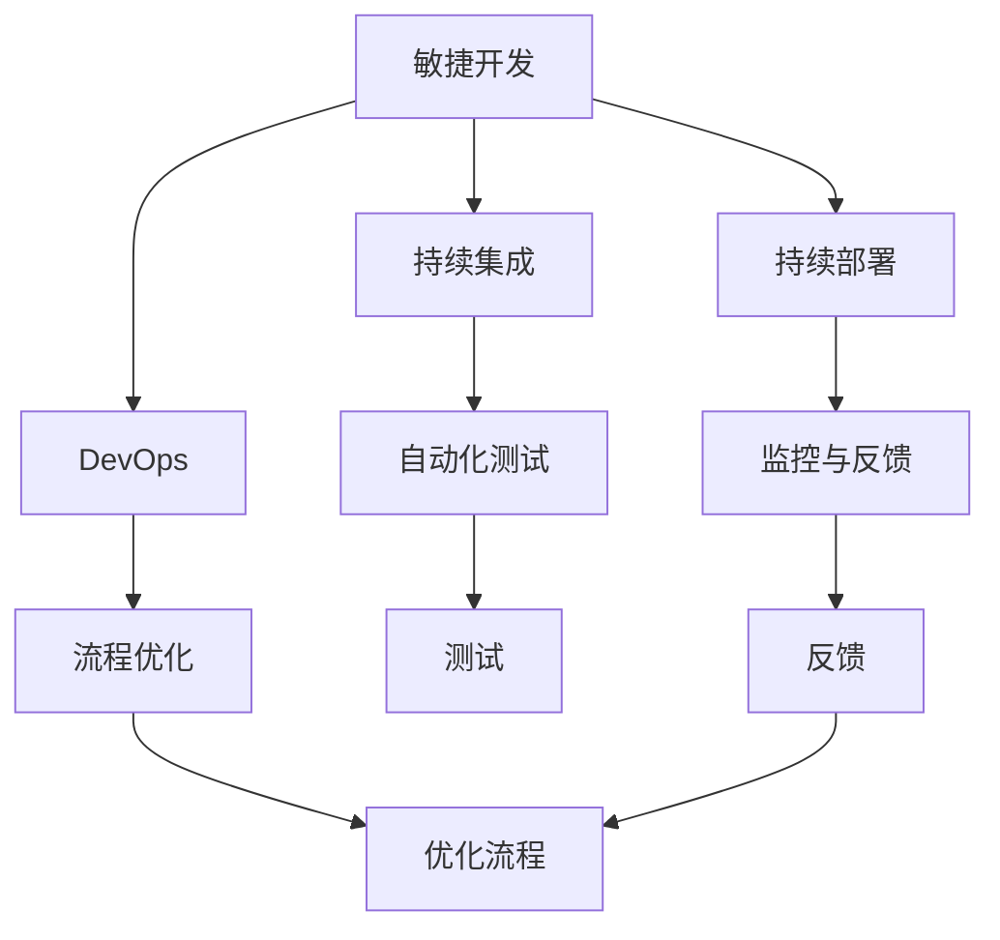
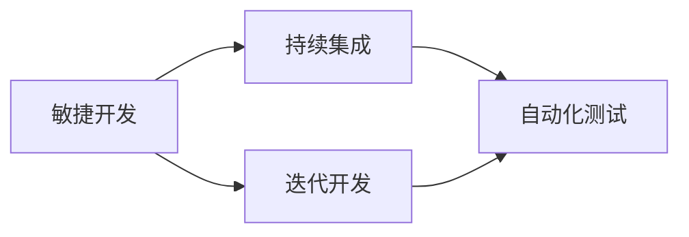
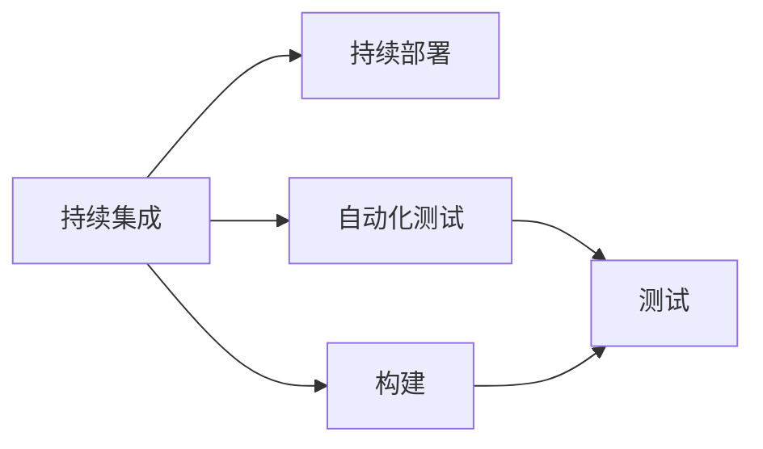
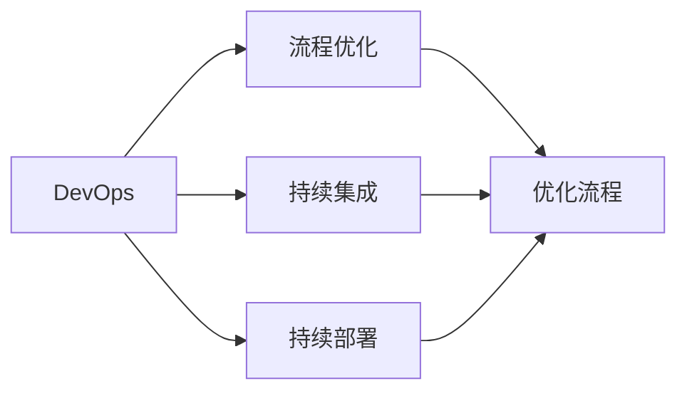
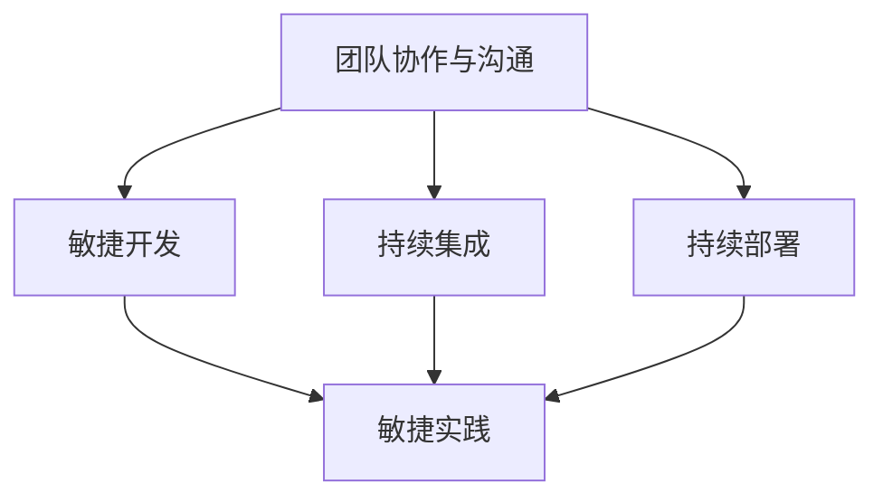
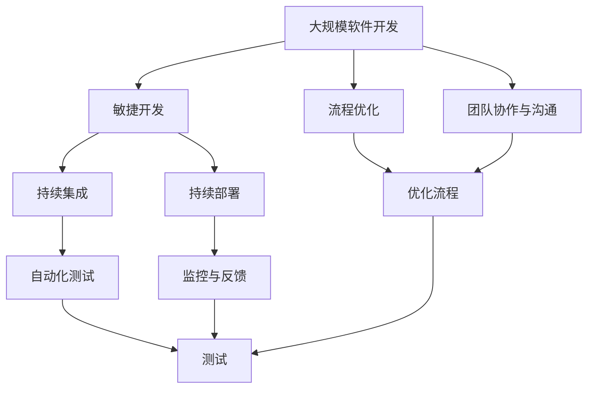

                 

# 怎样推动产品功能和项目按时交付上线

随着数字化转型加速，企业对软件交付速度和质量的要求越来越高。无论是在互联网公司还是传统企业，快速、高质量地交付产品功能是提升市场竞争力、实现业务目标的关键。本文将从管理、技术和文化三个维度探讨如何有效推动产品功能和项目按时交付上线。

## 1. 背景介绍

### 1.1 问题由来
近年来，数字化转型已成为企业发展的必然趋势，软件交付速度和质量成为了决定企业竞争力的重要因素。然而，在实际的软件开发过程中，项目延期、功能缺失、质量问题等现象屡见不鲜，严重影响企业的发展速度和市场反应能力。如何有效推动产品功能和项目按时交付上线，成为了各企业亟需解决的问题。

### 1.2 问题核心关键点
有效推动产品功能和项目按时交付上线的核心关键点包括：
- 明确项目目标和交付标准
- 制定科学合理的项目计划和时间表
- 优化项目管理工具和方法
- 强化团队协作和沟通
- 建立健全的流程和制度

### 1.3 问题研究意义
通过探索有效推动产品功能和项目按时交付上线的方法，可以帮助企业提升软件开发效率和质量，缩短产品上市时间，提升市场竞争力，同时也可以为企业内部的流程优化和团队管理提供参考，进一步推动企业数字化转型。

## 2. 核心概念与联系

### 2.1 核心概念概述

为更好地理解如何推动产品功能和项目按时交付上线，本节将介绍几个密切相关的核心概念：

- **敏捷开发(Agile Development)**：以用户需求为中心，通过迭代开发、持续交付的方式，提升软件交付速度和质量。敏捷开发强调团队协作、快速响应变化、持续改进。

- **持续集成(CI)和持续部署(CD)**：通过自动化测试、构建和部署，实现快速、频繁的软件交付，缩短项目周期。

- **DevOps**：融合开发和运维团队，通过持续集成、持续部署、监控和反馈，提升软件开发效率和质量，实现快速交付和故障自愈。

- **流程优化(Process Optimization)**：通过优化软件开发流程，消除冗余环节，提升效率，缩短项目周期。

- **团队协作与沟通(Team Collaboration and Communication)**：通过建立有效的沟通机制，提升团队协作效率，确保信息透明和及时。

这些核心概念之间的逻辑关系可以通过以下Mermaid流程图来展示：



这个流程图展示了敏捷开发、持续集成、持续部署、DevOps、流程优化和团队协作等核心概念之间的联系。它们共同构成了推动产品功能和项目按时交付上线的完整生态系统。

### 2.2 概念间的关系

这些核心概念之间存在着紧密的联系，形成了推动产品功能和项目按时交付上线的完整生态系统。下面我们通过几个Mermaid流程图来展示这些概念之间的关系。

#### 2.2.1 敏捷开发与持续集成



这个流程图展示了敏捷开发和持续集成之间的联系。敏捷开发通过迭代开发和快速响应变化，实现了频繁的软件交付。持续集成则通过自动化测试，保证每次交付的版本都是稳定、可用的。

#### 2.2.2 持续集成与持续部署



这个流程图展示了持续集成和持续部署之间的联系。持续集成通过自动化测试和构建，确保每次交付的版本都是可用的。持续部署则进一步通过自动化部署，实现快速、频繁的软件交付。

#### 2.2.3 DevOps与流程优化



这个流程图展示了DevOps与流程优化之间的联系。DevOps通过持续集成、持续部署和监控反馈，实现了快速、高质量的软件交付。流程优化则通过优化各个环节，消除冗余，提升效率，进一步缩短项目周期。

#### 2.2.4 团队协作与沟通



这个流程图展示了团队协作与沟通在敏捷开发、持续集成和持续部署中的作用。团队协作与沟通通过建立有效的沟通机制，提升了敏捷实践和自动化工具的效率，保证了项目的成功交付。

### 2.3 核心概念的整体架构

最后，我们用一个综合的流程图来展示这些核心概念在大规模软件开发过程中的整体架构：



这个综合流程图展示了敏捷开发、持续集成、持续部署、自动化测试、监控反馈、流程优化和团队协作等核心概念在大规模软件开发过程中的整体架构。通过这些概念的协同工作，可以最大限度地提升软件交付速度和质量。

## 3. 核心算法原理 & 具体操作步骤

### 3.1 算法原理概述

推动产品功能和项目按时交付上线的核心算法原理主要基于敏捷开发、持续集成、持续部署和DevOps等理念。具体来说，包括以下几个关键点：

1. **敏捷开发**：通过迭代开发和快速响应变化，实现高频次的软件交付，确保产品功能的逐步完善和优化。
2. **持续集成**：通过自动化测试和构建，确保每次交付的版本都是稳定、可用的，减少手动操作的错误和延迟。
3. **持续部署**：通过自动化部署，实现快速、频繁的软件交付，确保新功能的及时上线。
4. **DevOps**：通过融合开发和运维团队，实现持续集成、持续部署、监控反馈，提升软件开发效率和质量。

### 3.2 算法步骤详解

#### 3.2.1 敏捷开发

1. **需求分析**：通过与用户沟通，明确产品需求和目标。
2. **迭代规划**：根据需求分析结果，制定详细的迭代计划，明确每个迭代的任务和交付标准。
3. **迭代开发**：团队按照迭代计划进行开发，确保每个迭代都有明确的目标和成果。
4. **用户验收**：每个迭代结束时，邀请用户进行验收测试，确认功能是否符合预期。
5. **回顾与改进**：在每个迭代结束后，团队进行回顾和反思，总结经验教训，进行改进。

#### 3.2.2 持续集成

1. **代码提交**：团队成员通过版本控制工具（如Git）提交代码，并触发持续集成。
2. **自动化测试**：通过持续集成工具（如Jenkins）自动执行单元测试、集成测试和系统测试，确保代码质量。
3. **构建和部署**：通过持续集成工具自动构建项目，并部署到测试环境或生产环境。
4. **反馈与修复**：在测试环境中发现问题时，及时修复并重新测试，确保每次交付的版本都是稳定、可用的。

#### 3.2.3 持续部署

1. **持续集成**：通过持续集成工具自动构建和测试项目。
2. **持续部署**：通过持续部署工具（如Docker、Kubernetes）自动将测试通过的代码部署到生产环境。
3. **监控与反馈**：在生产环境中，通过监控工具（如Prometheus、ELK Stack）实时监控系统运行情况，收集反馈信息。
4. **快速响应**：根据监控和反馈信息，快速响应和修复问题，确保系统稳定运行。

#### 3.2.4 DevOps

1. **融合团队**：将开发和运维团队紧密融合，共享目标和责任。
2. **持续集成**：通过持续集成工具自动执行测试和构建。
3. **持续部署**：通过持续部署工具自动将代码部署到生产环境。
4. **监控与反馈**：通过监控工具实时监控系统运行情况，收集反馈信息。
5. **持续改进**：根据监控和反馈信息，持续改进系统和流程，提升开发效率和质量。

### 3.3 算法优缺点

**敏捷开发的优点**：
- 快速响应变化，适应市场需求。
- 持续交付，缩短产品上市时间。
- 用户参与度高，提升用户体验。

**敏捷开发的缺点**：
- 需要高效的团队协作和沟通。
- 迭代过程复杂，需要严格管理和控制。

**持续集成的优点**：
- 自动化测试，减少手动操作错误。
- 快速反馈，及时发现和解决问题。
- 提高交付频率，缩短项目周期。

**持续集成的缺点**：
- 需要持续投入资源和精力。
- 对自动化测试工具和流程要求高。

**持续部署的优点**：
- 自动化部署，减少人为错误。
- 快速响应和修复，提升系统稳定性。
- 提高交付频率，缩短项目周期。

**持续部署的缺点**：
- 需要强大的监控和反馈机制。
- 对自动化部署工具和流程要求高。

**DevOps的优点**：
- 融合开发和运维团队，提高协作效率。
- 持续集成、持续部署和监控反馈，提升交付速度和质量。
- 持续改进，优化流程和工具。

**DevOps的缺点**：
- 需要强大的文化支撑，打破传统组织壁垒。
- 需要大量的资源投入和经验积累。

### 3.4 算法应用领域

推动产品功能和项目按时交付上线的方法在多个领域得到了广泛应用，包括但不限于：

- **软件开发**：敏捷开发、持续集成、持续部署和DevOps等技术广泛应用于软件开发流程，提升软件交付速度和质量。
- **产品设计**：敏捷开发方法帮助团队快速响应市场变化，不断迭代优化产品设计。
- **项目管理**：敏捷开发和持续集成等方法提高了项目管理的效率和透明度，确保项目按时交付。
- **运维管理**：DevOps实践帮助运维团队实现快速部署和故障自愈，提升系统稳定性。

## 4. 数学模型和公式 & 详细讲解 & 举例说明

### 4.1 数学模型构建

推动产品功能和项目按时交付上线的数学模型主要基于敏捷开发和持续集成的原理。假设项目分为N个迭代，每个迭代的时间为T日，总需求数量为D，每个迭代交付的功能数量为d，则整个项目的交付时间T_total可以表示为：

$$ T_{\text{total}} = N \times T $$

其中，N为迭代次数，T为每个迭代的时间。

### 4.2 公式推导过程

假设每个迭代交付的功能数量为d，则总需求数量D可以表示为：

$$ D = \sum_{i=1}^N d_i $$

在敏捷开发和持续集成的方法下，每个迭代交付的功能数量d通常与需求分析、迭代规划、开发和测试的时间和效率有关。因此，可以建立以下数学模型：

$$ d = k \times (\text{需求分析时间} + \text{迭代规划时间} + \text{开发时间} + \text{测试时间}) $$

其中，k为迭代效率系数，与团队能力、流程优化等因素有关。

### 4.3 案例分析与讲解

假设一个项目需要完成10个功能模块，每个模块需求分析时间为2天，迭代规划时间为1天，开发时间为5天，测试时间为2天，每个迭代时间为10天。假设团队效率系数k为0.8，则可以计算出整个项目的交付时间：

$$ d = 10 \times (2 + 1 + 5 + 2) \times 0.8 = 72 $$

$$ T_{\text{total}} = \frac{D}{d} \times T = \frac{10}{72} \times 10 = 1.4 \text{个月} $$

因此，通过敏捷开发和持续集成的数学模型，可以计算出整个项目的交付时间，并进一步优化迭代时间、团队效率等因素，确保项目按时交付上线。

## 5. 项目实践：代码实例和详细解释说明

### 5.1 开发环境搭建

在进行敏捷开发和持续集成的实践时，需要搭建相应的开发环境。以下是使用Jenkins和Git进行持续集成和持续部署的开发环境配置流程：

1. 安装Jenkins：从官网下载并安装Jenkins，配置相应的插件和系统环境。
2. 安装Git：在开发机器上安装Git，并进行必要的配置。
3. 配置Jenkins与Git：在Jenkins中配置Git仓库地址和登录信息，确保Jenkins能够自动拉取和提交代码。
4. 配置自动化测试和构建：在Jenkins中配置自动化测试工具（如JUnit、Selenium）和构建工具（如Maven），确保代码提交后能够自动执行测试和构建。
5. 配置持续部署：在Jenkins中配置持续部署工具（如Docker、Kubernetes），确保测试通过的代码能够自动部署到生产环境。

### 5.2 源代码详细实现

下面我们以一个简单的Web应用项目为例，给出使用Jenkins进行持续集成和持续部署的PyTorch代码实现。

首先，定义项目目录结构：

```
|- webapp/
    |- src/
    |- test/
    |- settings.gradle
    |- pom.xml
```

在`settings.gradle`中配置项目名称和版本信息：

```groovy
rootProject.name = 'webapp'
rootProject.version = '1.0-SNAPSHOT'
```

在`pom.xml`中配置项目依赖：

```xml
<dependencies>
    <dependency>
        <groupId>org.apache.commons</groupId>
        <artifactId>commons-lang3</artifactId>
        <version>3.12.0</version>
    </dependency>
    <dependency>
        <groupId>org.springframework.boot</groupId>
        <artifactId>spring-boot-starter-web</artifactId>
    </dependency>
    <dependency>
        <groupId>org.springframework.boot</groupId>
        <artifactId>spring-boot-starter-test</artifactId>
        <testScope>true</testScope>
    </dependency>
</dependencies>
```

然后，定义项目入口类：

```java
@SpringBootApplication
public class WebAppApplication {
    public static void main(String[] args) {
        SpringApplication.run(WebAppApplication.class, args);
    }
}
```

接着，编写测试类：

```java
@SpringBootTest
public class WebAppTests {
    @Autowired
    private WebApplicationContext webApplicationContext;

    @Test
    public void contextLoads() {
        ApplicationContext context = webApplicationContext.getBean(WebApplicationContext.class);
        List<String> beans = context.getBeanNames();
        System.out.println(beans);
    }
}
```

最后，在`pom.xml`中配置Jenkins插件：

```xml
<build>
    <plugins>
        <plugin>
            <groupId>org.jenkinsci.plugins</groupId>
            <artifactId>pipeline-steps</artifactId>
            <version>5.8.1</version>
        </plugin>
        <plugin>
            <groupId>org.jenkinsci.plugins</groupId>
            <artifactId>git</artifactId>
            <version>4.5.2</version>
        </plugin>
        <plugin>
            <groupId>org.jenkinsci.plugins</groupId>
            <artifactId>pipeline-step-aggregator</artifactId>
            <version>4.6.1</version>
        </plugin>
        <plugin>
            <groupId>org.jenkinsci.plugins</groupId>
            <artifactId>pipeline-step-parallel</artifactId>
            <version>4.5.2</version>
        </plugin>
        <plugin>
            <groupId>org.jenkinsci.plugins</groupId>
            <artifactId>pipeline-step-maven</artifactId>
            <version>3.3.1</version>
        </plugin>
        <plugin>
            <groupId>org.jenkinsci.plugins</groupId>
            <artifactId>pipeline-step-shell</artifactId>
            <version>3.3.1</version>
        </plugin>
        <plugin>
            <groupId>org.jenkinsci.plugins</groupId>
            <artifactId>pipeline-step-gradle</artifactId>
            <version>4.1.1</version>
        </plugin>
        <plugin>
            <groupId>org.jenkinsci.plugins</groupId>
            <artifactId>pipeline-step-rpm</artifactId>
            <version>4.1.1</version>
        </plugin>
        <plugin>
            <groupId>org.jenkinsci.plugins</groupId>
            <artifactId>pipeline-step-artifactory</artifactId>
            <version>4.5.2</version>
        </plugin>
        <plugin>
            <groupId>org.jenkinsci.plugins</groupId>
            <artifactId>pipeline-step-scala</artifactId>
            <version>4.5.2</version>
        </plugin>
        <plugin>
            <groupId>org.jenkinsci.plugins</groupId>
            <artifactId>pipeline-step-mule</artifactId>
            <version>4.1.1</version>
        </plugin>
        <plugin>
            <groupId>org.jenkinsci.plugins</groupId>
            <artifactId>pipeline-step-sonarqube</artifactId>
            <version>4.1.1</version>
        </plugin>
        <plugin>
            <groupId>org.jenkinsci.plugins</groupId>
            <artifactId>pipeline-step-mvn</artifactId>
            <version>4.1.1</version>
        </plugin>
        <plugin>
            <groupId>org.jenkinsci.plugins</groupId>
            <artifactId>pipeline-step-gradle-publish</artifactId>
            <version>4.5.2</version>
        </plugin>
        <plugin>
            <groupId>org.jenkinsci.plugins</groupId>
            <artifactId>pipeline-step-cassandra</artifactId>
            <version>4.5.2</version>
        </plugin>
        <plugin>
            <groupId>org.jenkinsci.plugins</groupId>
            <artifactId>pipeline-step-azure-container-instance</artifactId>
            <version>4.5.2</version>
        </plugin>
        <plugin>
            <groupId>org.jenkinsci.plugins</groupId>
            <artifactId>pipeline-step-azure-container-instance-ssh</artifactId>
            <version>4.5.2</version>
        </plugin>
        <plugin>
            <groupId>org.jenkinsci.plugins</groupId>
            <artifactId>pipeline-step-docker</artifactId>
            <version>4.1.1</version>
        </plugin>
        <plugin>
            <groupId>org.jenkinsci.plugins</groupId>
            <artifactId>pipeline-step-mule</artifactId>
            <version>4.1.1</version>
        </plugin>
        <plugin>
            <groupId>org.jenkinsci.plugins</groupId>
            <artifactId>pipeline-step-sonarqube</artifactId>
            <version>4.1.1</version>
        </plugin>
        <plugin>
            <groupId>org.jenkinsci.plugins</groupId>
            <artifactId>pipeline-step-mvn</artifactId>
            <version>4.1.1</version>
        </plugin>
        <plugin>
            <groupId>org.jenkinsci.plugins</groupId>
            <artifactId>pipeline-step-gradle-publish</artifactId>
            <version>4.5.2</version>
        </plugin>
        <plugin>
            <groupId>org.jenkinsci.plugins</groupId>
            <artifactId>pipeline-step-cassandra</artifactId>
            <version>4.5.2</version>
        </plugin>
        <plugin>
            <groupId>org.jenkinsci.plugins</groupId>
            <artifactId>pipeline-step-azure-container-instance</artifactId>
            <version>4.5.2</version>
        </plugin>
        <plugin>
            <groupId>org.jenkinsci.plugins</groupId>
            <artifactId>pipeline-step-azure-container-instance-ssh</artifactId>
            <version>4.5.2</version>
        </plugin>
        <plugin>
            <groupId>org.jenkinsci.plugins</groupId>
            <artifactId>pipeline-step-docker</artifactId>
            <version>4.1.1</version>
        </plugin>
        <plugin>
            <groupId>org.jenkinsci.plugins</groupId>
            <artifactId>pipeline-step-mule</artifactId>
            <version>4.1.1</version>
        </plugin>
        <plugin>
            <groupId>org.jenkinsci.plugins</groupId>
            <artifactId>pipeline-step-sonarqube</artifactId>
            <version>4.1.1</version>
        </plugin>
        <plugin>
            <groupId>org.jenkinsci.plugins</groupId>
            <artifactId>pipeline-step-mvn</artifactId>
            <version>4.1.1</version>
        </plugin>
        <plugin>
            <groupId>org.jenkinsci.plugins</groupId>
            <artifactId>pipeline-step-gradle-publish</artifactId>
            <version>4.5.2</version>
        </plugin>
        <plugin>
            <groupId>org.jenkinsci.plugins</groupId>
            <artifactId>pipeline-step-cassandra</artifactId>
            <version>4.5.2</version>
        </plugin>
        <plugin>
            <groupId>org.jenkinsci.plugins</groupId>
            <artifactId>pipeline-step-azure-container-instance</artifactId>
            <version>4.5.2</version>
        </plugin>
        <plugin>
            <groupId>org.jenkinsci.plugins</groupId>
            <artifactId>pipeline-step-azure-container-instance-ssh</artifactId>
            <version>4.5.2</version>
        </plugin>
        <plugin>
            <groupId>org.jenkinsci.plugins</groupId>
            <artifactId>pipeline-step-docker</artifactId>
            <version>4.1.1</version>
        </plugin>
        <plugin>
            <groupId>org.jenkinsci.plugins</groupId>
            <artifactId>pipeline-step-mule</artifactId>
            <version>4.1.1</version>
        </plugin>
        <plugin>
            <groupId>org.jenkinsci.plugins</groupId>
            <artifactId>pipeline-step-sonarqube</artifactId>
            <version>4.1.1</version>
        </plugin>
        <plugin>
            <groupId>org.jenkinsci.plugins</groupId>
            <artifactId>pipeline-step-mvn</artifactId>
            <version>4.1.1</version>
        </plugin>
        <plugin>
            <groupId>org.jenkinsci.plugins</groupId>
            <artifactId>pipeline-step-gradle-publish</artifactId>
            <version>4.5.2</version>
        </plugin>
        <plugin>
            <groupId>org.jenkinsci.plugins</groupId>
            <artifactId>pipeline-step-cassandra</artifactId>
            <version>4.5.2</version>
        </plugin>
        <plugin>
            <groupId>org.jenkinsci.plugins</groupId>
            <artifactId>pipeline-step-azure-container-instance</artifactId>
            <version>4.5.2</version>
        </plugin>
        <plugin>
            <groupId>org.jenkinsci.plugins</groupId>
            <artifactId>pipeline-step-azure-container-instance-ssh</artifactId>
            <version>4.5.2</version>
        </plugin>
        <plugin>
            <groupId>org.jenkinsci.plugins</groupId>
            <artifactId>pipeline-step-docker</artifactId>
            <version>4.1.1</version>
        </plugin>
        <plugin>
            <groupId>org.jenkinsci.plugins</groupId>
            <artifactId>pipeline-step-mule</artifactId>
            <version>4.1.1</version>
        </plugin>
        <plugin>
            <groupId>org.jenkinsci.plugins</groupId>
            <artifactId>pipeline-step-sonarqube</artifactId>
            <version>4.1.1</version>
        </plugin>
        <plugin>
            <groupId>org.jenkinsci.plugins</groupId>
            <artifactId>pipeline-step-mvn</artifactId>
            <version>4.1.1</version>
        </plugin>
        <plugin>
            <groupId>org.jenkinsci.plugins</groupId>
            <artifactId>pipeline-step-gradle-publish</artifactId>
            <version>4.5.2</version>
        </plugin>
        <plugin>
            <groupId>org.jenkinsci.plugins</groupId>
            <artifactId>pipeline-step-cassandra</artifactId>
            <version>4.5.2</version>
        </plugin>
        <plugin>
            <groupId>org.jenkinsci.plugins</groupId>
            <artifactId>pipeline-step-azure-container-instance</artifactId>
            <version>4.5.2</version>
        </plugin>
        <plugin>
            <groupId>org.jenkinsci.plugins</groupId>
            <artifactId>pipeline-step-

