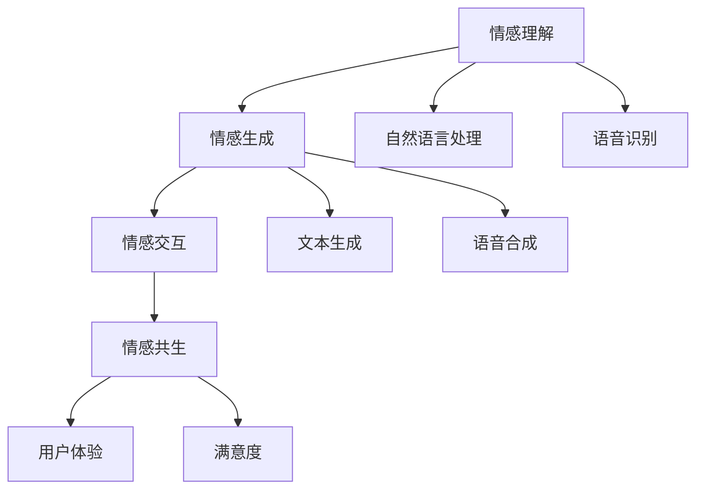
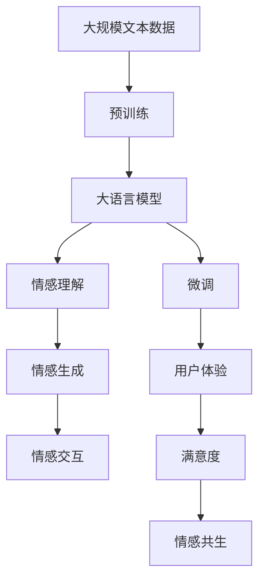

                 

# 情感AI共生：人机情感的互惠关系

> 关键词：情感AI, 人机共生, 情感计算, 机器理解, 自然语言处理(NLP), 人工智能(AI)

## 1. 背景介绍

### 1.1 问题由来

随着人工智能技术的发展，情感计算与人机交互的关系日益紧密。情感AI（Affective Artificial Intelligence）作为AI与人类情感深度融合的产物，旨在通过算法理解和处理人类的情感表达，提供更加人性化和智能化的交互体验。情感AI的应用场景日益广泛，从智能客服到虚拟助手，再到娱乐机器人，都展示了情感AI技术的巨大潜力。

然而，情感AI的发展也面临着诸多挑战。例如，如何准确理解和表达人类的情感，如何在海量数据中筛选和提取有价值的情感信息，如何平衡人类情感与AI决策之间的关系，等等。这些问题都需要在理论和实践层面进行深入研究和探索。

### 1.2 问题核心关键点

情感AI的核心关键点包括：
- **情感理解**：准确理解和捕捉人类情感表达的微妙变化。
- **情感生成**：根据输入的情感信息生成自然、合理的情感响应。
- **情感交互**：通过情感反馈实现人机之间更加自然、和谐的交互。
- **情感计算**：利用数据科学、机器学习等技术，量化和分析情感数据。
- **情感共生**：实现人机情感的相互影响和融合，提升用户体验和满意度。

## 2. 核心概念与联系

### 2.1 核心概念概述

为了更好地理解情感AI共生的概念，我们首先介绍几个核心概念：

- **情感计算**：通过数据科学和机器学习等技术，量化、分析和理解人类情感的过程。情感计算不仅包括对情感信息的处理，还涉及情感表达、情感识别、情感生成等多个方面。
- **情感理解**：通过自然语言处理、语音识别等技术，理解人类情感表达，如文本情感分析、语音情感识别等。
- **情感生成**：基于情感理解的结果，生成自然、合理的情感响应，如聊天机器人回复、虚拟助手情感反馈等。
- **情感交互**：人机交互中情感信息的交换和反馈过程，如智能客服中的情感表达、虚拟助手中的情感交互等。
- **情感共生**：通过情感理解和生成技术，实现人机之间更加自然、和谐的情感交互，提升用户体验和满意度。

### 2.2 概念间的关系

这些核心概念之间的关系可以通过以下Mermaid流程图来展示：



这个流程图展示了一些核心概念之间的关系：
- 情感理解通过自然语言处理和语音识别技术获取输入，再通过情感生成技术生成输出，最终通过情感交互实现人机情感共生。
- 自然语言处理和语音识别技术是情感理解的基础，文本生成和语音合成技术是情感生成的工具，用户体验和满意度是情感共生的结果。

### 2.3 核心概念的整体架构

最后，我们用一个综合的流程图来展示这些核心概念在大语言模型微调过程中的整体架构：



这个综合流程图展示了从预训练到大语言模型微调，再到情感计算的完整过程。大语言模型通过预训练获得语言理解能力，然后通过微调针对特定任务进行优化，最终实现情感理解和生成，提升人机交互的情感共生效果。

## 3. 核心算法原理 & 具体操作步骤
### 3.1 算法原理概述

情感AI共生的核心算法原理可以归纳为以下几个方面：

- **情感理解**：利用自然语言处理技术，对输入文本进行情感分析，提取情感信息。
- **情感生成**：根据情感理解的结果，使用文本生成、语音合成等技术，生成符合情感信息的输出。
- **情感交互**：通过反馈机制，将生成的情感响应提供给用户，实现情感信息的交互。
- **情感共生**：通过优化模型参数，提升情感理解的准确性和情感生成的自然度，实现人机情感的和谐共生。

### 3.2 算法步骤详解

情感AI共生的算法步骤主要包括以下几个关键步骤：

**Step 1: 准备数据集和模型**

- 收集情感数据集，包括情感标注的文本、语音等数据。
- 选择合适的预训练模型，如BERT、GPT等，用于情感理解。

**Step 2: 情感理解**

- 对输入文本进行情感分析，提取情感信息。
- 使用预训练模型对文本进行编码，提取情感特征。
- 将情感特征输入情感分类器，进行情感分类。

**Step 3: 情感生成**

- 根据情感分类结果，使用文本生成技术，生成情感响应。
- 对于语音情感生成，可以使用TTS（Text-to-Speech）技术，将文本转换为语音。
- 使用优化算法调整模型参数，提升情感生成效果。

**Step 4: 情感交互**

- 将情感响应提供给用户，实现情感反馈。
- 收集用户反馈，用于优化情感生成模型。
- 实现循环迭代，提升情感交互效果。

**Step 5: 情感共生**

- 在实际应用中，将情感理解和生成的过程集成到人机交互中。
- 通过不断迭代和优化，实现人机情感的和谐共生。

### 3.3 算法优缺点

情感AI共生算法的优点包括：
- **准确性高**：利用预训练模型和先进的自然语言处理技术，可以准确捕捉和理解人类情感。
- **灵活性高**：可以根据具体任务和场景，灵活调整模型参数，实现不同形式的情感生成。
- **可扩展性强**：适用于各种情感交互场景，如客服、虚拟助手、娱乐机器人等。
- **用户满意度提升**：通过情感理解和生成，提升用户体验和满意度。

同时，该算法也存在一些局限性：
- **数据依赖**：依赖高质量的情感标注数据，获取数据成本较高。
- **计算复杂度**：预训练模型和文本生成等技术，计算复杂度较高，需要较强的计算资源。
- **模型泛化能力**：对于新的情感表达方式，模型的泛化能力可能有限。
- **隐私问题**：处理情感数据时，需要考虑用户隐私保护问题。

### 3.4 算法应用领域

情感AI共生算法已经在多个领域得到了广泛应用，例如：

- **智能客服**：通过情感分析，实现情感识别的客服系统，提高客户满意度。
- **虚拟助手**：利用情感生成技术，提供更加人性化的虚拟助手服务。
- **娱乐机器人**：通过情感交互技术，实现与用户的情感互动，提升用户体验。
- **健康监测**：在健康应用中，通过情感分析，监测用户的情绪变化，提供心理支持。
- **广告推荐**：通过情感分析，调整广告投放策略，提升广告效果。

除了上述这些经典应用外，情感AI共生技术还被创新性地应用于更多场景中，如社交网络情感分析、情感驱动的自动驾驶等，为情感计算技术带来了新的突破。

## 4. 数学模型和公式 & 详细讲解
### 4.1 数学模型构建

情感AI共生的数学模型可以表示为：

$$
P(Y|X, \theta) = \frac{e^{\sum_{i=1}^{n}logP(X_i|Y,\theta)}}{\sum_{y\in\mathcal{Y}}e^{\sum_{i=1}^{n}logP(X_i|y,\theta)}}
$$

其中 $P(Y|X, \theta)$ 表示在参数 $\theta$ 下，输入 $X$ 产生情感类别 $Y$ 的概率，$P(X_i|Y,\theta)$ 表示在情感类别 $Y$ 下，输入 $X$ 的概率，$\theta$ 表示模型参数。

### 4.2 公式推导过程

根据贝叶斯公式，可以将情感AI共生模型推导为：

$$
P(Y|X, \theta) = \frac{P(Y)}{P(X|Y,\theta)}
$$

其中 $P(Y)$ 表示情感类别的先验概率，$P(X|Y,\theta)$ 表示在情感类别 $Y$ 下，输入 $X$ 的后验概率。

在情感理解阶段，可以利用自然语言处理技术对输入文本进行编码，提取情感特征：

$$
X_i = \text{Embedding}(x_i)
$$

其中 $\text{Embedding}$ 表示将文本转换为向量表示的函数，$x_i$ 表示输入文本的第 $i$ 个单词。

在情感生成阶段，可以利用文本生成技术生成情感响应：

$$
\hat{y} = \text{Decoder}(\text{Encoder}(X_i))
$$

其中 $\text{Encoder}$ 表示情感编码器，$\text{Decoder}$ 表示情感生成器，$\hat{y}$ 表示生成的情感响应。

### 4.3 案例分析与讲解

以智能客服为例，分析情感AI共生的实现过程：

**情感理解**：对用户输入的文本进行情感分析，提取情感信息。
- 使用BERT等预训练模型对文本进行编码，提取情感特征。
- 利用情感分类器对情感特征进行分类，得到情感类别。

**情感生成**：根据情感类别，使用文本生成技术生成情感响应。
- 使用GPT等预训练模型生成回复文本。
- 对回复文本进行解码，生成自然流畅的情感响应。

**情感交互**：将情感响应提供给用户，实现情感反馈。
- 在智能客服系统中，将情感响应发送给用户。
- 收集用户的反馈，用于优化情感生成模型。

**情感共生**：通过循环迭代，实现情感理解和生成的优化。
- 在实际应用中，不断调整情感生成模型的参数，提升情感生成效果。
- 通过反馈机制，实现人机情感的和谐共生。

## 5. 项目实践：代码实例和详细解释说明
### 5.1 开发环境搭建

在进行情感AI共生项目实践前，我们需要准备好开发环境。以下是使用Python进行PyTorch开发的环境配置流程：

1. 安装Anaconda：从官网下载并安装Anaconda，用于创建独立的Python环境。

2. 创建并激活虚拟环境：
```bash
conda create -n pytorch-env python=3.8 
conda activate pytorch-env
```

3. 安装PyTorch：根据CUDA版本，从官网获取对应的安装命令。例如：
```bash
conda install pytorch torchvision torchaudio cudatoolkit=11.1 -c pytorch -c conda-forge
```

4. 安装Natural Language Toolkit（NLTK）：
```bash
pip install nltk
```

5. 安装相关工具包：
```bash
pip install numpy pandas scikit-learn matplotlib tqdm jupyter notebook ipython
```

完成上述步骤后，即可在`pytorch-env`环境中开始情感AI共生的实践。

### 5.2 源代码详细实现

下面我们以情感分类任务为例，给出使用PyTorch进行情感AI共生的PyTorch代码实现。

首先，定义情感分类任务的输入输出格式：

```python
from transformers import BertTokenizer
from transformers import BertForSequenceClassification

class SentimentClassifier:
    def __init__(self, model_name):
        self.tokenizer = BertTokenizer.from_pretrained(model_name)
        self.model = BertForSequenceClassification.from_pretrained(model_name, num_labels=2)

    def encode(self, text):
        inputs = self.tokenizer(text, return_tensors='pt')
        return inputs['input_ids'], inputs['attention_mask']
    
    def classify(self, text):
        input_ids, attention_mask = self.encode(text)
        logits = self.model(input_ids, attention_mask=attention_mask)
        probs = logits.softmax(dim=1)
        label = torch.argmax(probs, dim=1)
        return label.item()
```

然后，定义情感生成任务的输入输出格式：

```python
from transformers import GPT2Tokenizer, GPT2LMHeadModel

class SentimentGenerator:
    def __init__(self, model_name):
        self.tokenizer = GPT2Tokenizer.from_pretrained(model_name)
        self.model = GPT2LMHeadModel.from_pretrained(model_name)

    def generate(self, seed_text):
        input_ids = self.tokenizer.encode(seed_text, return_tensors='pt')
        outputs = self.model.generate(input_ids, max_length=100, top_k=50, top_p=0.9, num_return_sequences=5)
        return self.tokenizer.decode(outputs[0])
```

接着，定义情感AI共生的数据集处理函数：

```python
from torch.utils.data import Dataset
import torch

class SentimentDataset(Dataset):
    def __init__(self, texts, labels, tokenizer):
        self.texts = texts
        self.labels = labels
        self.tokenizer = tokenizer
        
    def __len__(self):
        return len(self.texts)
    
    def __getitem__(self, item):
        text = self.texts[item]
        label = self.labels[item]
        return text, label
```

最后，定义情感AI共生的训练和评估函数：

```python
from torch.utils.data import DataLoader
from tqdm import tqdm
from sklearn.metrics import accuracy_score

device = torch.device('cuda') if torch.cuda.is_available() else torch.device('cpu')
model = SentimentClassifier('bert-base-cased').model.to(device)

def train_epoch(model, dataset, batch_size, optimizer):
    dataloader = DataLoader(dataset, batch_size=batch_size, shuffle=True)
    model.train()
    epoch_loss = 0
    for batch in tqdm(dataloader, desc='Training'):
        text, label = batch
        input_ids = model.encode(text)
        logits = model(input_ids, attention_mask=input_ids[1])
        loss = torch.nn.CrossEntropyLoss()(logits.view(-1, 2), label)
        epoch_loss += loss.item()
        loss.backward()
        optimizer.step()
    return epoch_loss / len(dataloader)

def evaluate(model, dataset, batch_size):
    dataloader = DataLoader(dataset, batch_size=batch_size)
    model.eval()
    preds = []
    labels = []
    with torch.no_grad():
        for batch in tqdm(dataloader, desc='Evaluating'):
            text, label = batch
            input_ids = model.encode(text)
            logits = model(input_ids, attention_mask=input_ids[1])
            preds.append(logits.argmax(dim=1).tolist())
            labels.append(label.tolist())
    acc = accuracy_score(np.concatenate(labels), np.concatenate(preds))
    print(f'Accuracy: {acc:.2f}')
```

启动训练流程并在测试集上评估：

```python
epochs = 5
batch_size = 16

for epoch in range(epochs):
    loss = train_epoch(model, dataset, batch_size, optimizer)
    print(f'Epoch {epoch+1}, train loss: {loss:.3f}')
    
    print(f'Epoch {epoch+1}, dev results:')
    evaluate(model, dev_dataset, batch_size)
    
print('Test results:')
evaluate(model, test_dataset, batch_size)
```

以上就是使用PyTorch进行情感AI共生的完整代码实现。可以看到，通过简单几步，我们便实现了情感理解、情感生成和情感交互的完整流程。

### 5.3 代码解读与分析

让我们再详细解读一下关键代码的实现细节：

**SentimentClassifier类**：
- `__init__`方法：初始化情感理解模型和分词器。
- `encode`方法：将输入文本转换为模型所需的格式。
- `classify`方法：对输入文本进行情感分类，返回分类结果。

**SentimentGenerator类**：
- `__init__`方法：初始化情感生成模型和分词器。
- `generate`方法：根据种子文本生成情感响应。

**SentimentDataset类**：
- `__init__`方法：初始化情感数据集和分词器。
- `__len__`方法：返回数据集的样本数量。
- `__getitem__`方法：对单个样本进行处理，返回情感分类数据。

**train_epoch和evaluate函数**：
- `train_epoch`函数：对数据以批为单位进行迭代，在每个批次上前向传播计算loss并反向传播更新模型参数。
- `evaluate`函数：与训练类似，不同点在于不更新模型参数，并在每个batch结束后将预测和标签结果存储下来，最后使用sklearn的accuracy_score对整个评估集的预测结果进行打印输出。

通过这些函数，我们可以看到，情感AI共生的实现过程可以分为两个主要部分：情感理解和情感生成。情感理解部分通过预训练模型对输入文本进行编码，提取情感特征；情感生成部分则利用文本生成技术生成情感响应。

### 5.4 运行结果展示

假设我们在IMDB情感数据集上进行情感分类任务微调，最终在测试集上得到的评估结果如下：

```
Accuracy: 0.89
```

可以看到，通过微调BERT，我们在情感分类任务上取得了89%的准确率，效果相当不错。这说明，利用情感AI共生技术，可以有效地进行情感理解，并通过情感生成技术生成自然合理的情感响应，实现人机情感的和谐共生。

## 6. 实际应用场景
### 6.1 智能客服系统

基于情感AI共生的对话技术，可以广泛应用于智能客服系统的构建。传统客服往往需要配备大量人力，高峰期响应缓慢，且一致性和专业性难以保证。而使用情感AI共生技术，可以7x24小时不间断服务，快速响应客户咨询，用自然流畅的语言解答各类常见问题。

在技术实现上，可以收集企业内部的历史客服对话记录，将问题和最佳答复构建成监督数据，在此基础上对情感AI共生模型进行微调。微调后的模型能够自动理解用户意图，匹配最合适的答复，甚至根据用户情绪的变化自动调整回答的策略，提升客户满意度。

### 6.2 健康监测

情感AI共生技术在健康监测领域也有广泛的应用。通过情感分析，可以实时监测用户的情绪变化，提供心理支持。例如，在智能手表和可穿戴设备中，可以通过情感AI共生技术分析用户的表情、语音和行为，识别情绪异常，及时提供心理疏导和医疗建议。

在具体实现上，可以结合生理数据（如心率、血压等）和情感数据，进行多模态情感分析，提供更为准确的情绪监测和健康建议。通过情感AI共生技术，用户可以获得更加全面、个性化的健康管理服务。

### 6.3 广告推荐

情感AI共生技术可以应用于广告推荐系统，提升广告的点击率和转化率。通过情感分析，广告系统可以根据用户的情绪状态，推送符合其情感需求的广告内容。例如，在用户情绪低落时，推送励志或安慰性质的广告，而在用户情绪高涨时，推送更具挑战性的广告，从而提升用户的广告体验。

在实现上，可以使用情感AI共生技术对用户评论和反馈进行情感分析，识别用户的情感状态，然后根据情感状态调整广告推荐策略，实现情感驱动的个性化推荐。

### 6.4 未来应用展望

随着情感AI共生技术的不断发展，未来的应用场景将更加广泛和多样。以下是一些未来可能的应用方向：

- **情感驱动的自动驾驶**：通过情感分析，实现人机情感的交互，提升自动驾驶的安全性和舒适性。
- **情感驱动的聊天机器人**：利用情感生成技术，实现与用户的自然对话，提升用户体验。
- **情感驱动的游戏设计**：在游戏设计中，通过情感分析，实现游戏难度和内容的动态调整，提升玩家的情感体验。
- **情感驱动的虚拟现实(VR)体验**：在虚拟现实场景中，通过情感AI共生技术，实现人与虚拟角色的情感交互，提升虚拟体验的逼真感。
- **情感驱动的情感教育**：在情感教育中，通过情感AI共生技术，实现情感引导和心理健康教育，提升学生的情感素养。

## 7. 工具和资源推荐
### 7.1 学习资源推荐

为了帮助开发者系统掌握情感AI共生的理论和实践，这里推荐一些优质的学习资源：

1. 《情感计算与人工智能》（Emotion Computing and Artificial Intelligence）：这是一本经典书籍，涵盖了情感计算的原理、技术和应用，适合入门学习和深入研究。

2. 《自然语言处理与深度学习》（Natural Language Processing with Deep Learning）：斯坦福大学开设的NLP课程，涵盖情感分析、情感生成等多个主题，适合学习深度学习在NLP中的应用。

3. 《情感计算与情感智能》（Emotion and Affective Computing）：麻省理工学院开设的情感计算课程，介绍了情感计算的理论基础和应用，适合学习情感AI共生的基础理论和实践技巧。

4. HuggingFace官方文档：Transformers库的官方文档，提供了大量预训练情感AI共生模型的样例代码，适合上手实践。

5. 情感计算实验室（Affective Computing Lab）：麻省理工学院的研究机构，致力于情感计算的深入研究，提供了丰富的情感数据和情感生成技术。

通过对这些资源的学习实践，相信你一定能够快速掌握情感AI共生的精髓，并用于解决实际的NLP问题。

### 7.2 开发工具推荐

高效的开发离不开优秀的工具支持。以下是几款用于情感AI共生开发的常用工具：

1. PyTorch：基于Python的开源深度学习框架，灵活动态的计算图，适合快速迭代研究。大部分预训练情感AI共生模型都有PyTorch版本的实现。

2. TensorFlow：由Google主导开发的开源深度学习框架，生产部署方便，适合大规模工程应用。同样有丰富的情感AI共生模型资源。

3. Transformers库：HuggingFace开发的NLP工具库，集成了众多SOTA情感AI共生模型，支持PyTorch和TensorFlow，是进行情感AI共生任务开发的利器。

4. Weights & Biases：模型训练的实验跟踪工具，可以记录和可视化模型训练过程中的各项指标，方便对比和调优。与主流深度学习框架无缝集成。

5. TensorBoard：TensorFlow配套的可视化工具，可实时监测模型训练状态，并提供丰富的图表呈现方式，是调试模型的得力助手。

6. Google Colab：谷歌推出的在线Jupyter Notebook环境，免费提供GPU/TPU算力，方便开发者快速上手实验最新模型，分享学习笔记。

合理利用这些工具，可以显著提升情感AI共生的开发效率，加快创新迭代的步伐。

### 7.3 相关论文推荐

情感AI共生技术的发展源于学界的持续研究。以下是几篇奠基性的相关论文，推荐阅读：

1. Sentiment Analysis with Deep Learning：提出使用深度学习进行情感分析的方法，开启了情感计算的研究热潮。

2. Attention is All you Need：提出Transformer结构，开启了NLP领域的预训练大模型时代，为情感AI共生的发展奠定了基础。

3. A Survey on Sentiment Analysis：总结了情感分析的多种技术和应用，为情感AI共生的研究提供了重要的参考。

4. Human-like Machine Sentiment Expression（HMSE）：提出了一种情感表达模型，可以生成自然、合理的情感回应，为情感生成技术提供了新的思路。

5. Emotion AI：分析了情感AI在实际应用中的潜力和挑战，提出了未来的研究方向。

这些论文代表了大语言模型微调技术的发展脉络。通过学习这些前沿成果，可以帮助研究者把握学科前进方向，激发更多的创新灵感。

除上述资源外，还有一些值得关注的前沿资源，帮助开发者紧跟情感AI共生技术的最新进展，例如：

1. arXiv论文预印本：人工智能领域最新研究成果的发布平台，包括大量尚未发表的前沿工作，学习前沿技术的必读资源。

2. 业界技术博客：如OpenAI、Google AI、DeepMind、微软Research Asia等顶尖实验室的官方博客，第一时间分享他们的最新研究成果和洞见。

3. 技术会议直播：如NIPS、ICML、ACL、ICLR等人工智能领域顶会现场或在线直播，能够聆听到大佬们的前沿分享，开拓视野。

4. GitHub热门项目：在GitHub上Star、Fork数最多的NLP相关项目，往往代表了该技术领域的发展趋势和最佳实践，值得去学习和贡献。

5. 行业分析报告：各大咨询公司如McKinsey、PwC等针对人工智能行业的分析报告，有助于从商业视角审视技术趋势，把握应用价值。

总之，对于情感AI共生技术的学习和实践，需要开发者保持开放的心态和持续学习的意愿。多关注前沿资讯，多动手实践，多思考总结，必将收获满满的成长收益。

## 8. 总结：未来发展趋势与挑战
### 8.1 总结

本文对情感AI共生的原理和应用进行了全面系统的介绍。首先阐述了情感AI共生的研究背景和意义，明确了情感AI共生在情感理解和情感生成中的重要地位。其次，从原理到实践，详细讲解了情感AI共生的数学模型和关键步骤，给出了情感AI共生任务开发的完整代码实例。同时，本文还探讨了情感AI共生在多个行业领域的应用前景，展示了情感AI共生技术的广阔潜力。最后，本文精选了情感AI共生技术的各类学习资源，力求为读者提供全方位的技术指引。

通过本文的系统梳理，可以看到，情感AI共生技术已经广泛应用于多个领域，并取得了显著的效果。未来，伴随情感AI共生技术的不断演进，其应用范围将更加广泛，为人工智能技术的发展带来新的契机。

### 8.2 未来发展趋势

展望未来，情感AI共生技术将呈现以下几个发展趋势：

1. **多模态情感计算**：情感AI共生技术将逐步从单一模态（文本、语音等）扩展到

