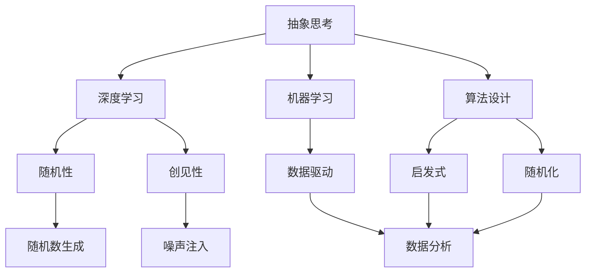
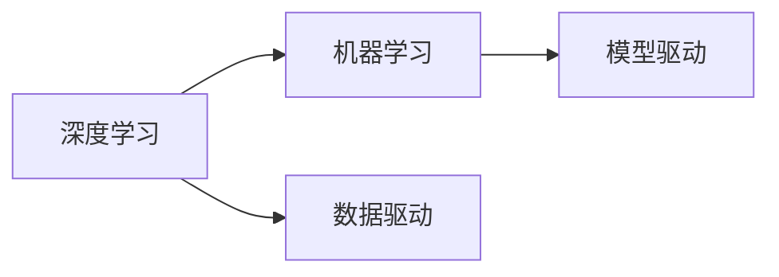
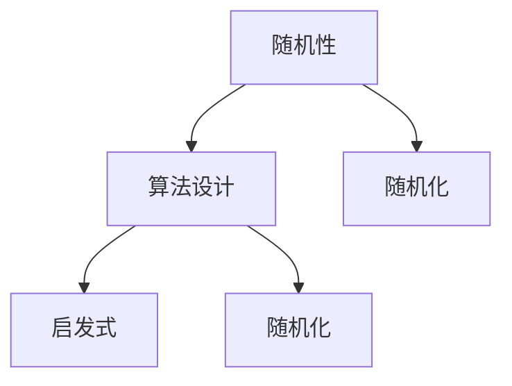
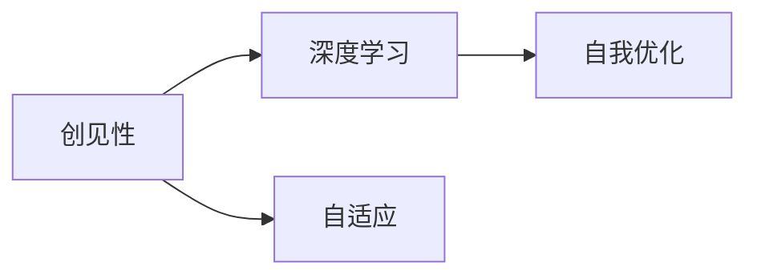
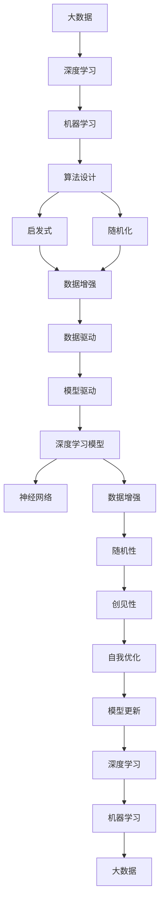

                 

# 抽象思考与随机性创见性

> 关键词：抽象思考,随机性,创见性,深度学习,算法设计,机器学习,技术创新

## 1. 背景介绍

### 1.1 问题由来
在当前的科技时代，随着人工智能(AI)技术的迅猛发展，特别是深度学习(Deep Learning)的崛起，人们对于计算机系统的智能化要求日益提高。然而，传统的规则驱动、结构化编程方式已经难以满足日益复杂和变化多端的计算需求。抽象思考与随机性创见性成为了新一代AI系统设计的重要特征。

抽象思考（Abstract Thinking）是指从具体实例中提炼出一般规律和原理，形成系统化的理论模型。其核心在于运用模型思维、设计思维等方法，通过分析、归纳、综合等手段，构建出能够自动学习、自我优化的智能系统。

随机性创见性（Randomness-Inspired Creativity）则是指利用随机数生成、噪声注入等技术，引入不确定性元素，提升系统的鲁棒性、创新性和适应性。其关键在于通过随机性和随机演化过程，驱动系统探索新的解空间，实现对未知问题的自适应和自我超越。

抽象思考与随机性创见性的结合，将使AI系统具备更强的智能、灵活性和创新力，成为未来科技发展的重要驱动力。本文将深入探讨这两种思维方式在大数据、机器学习、深度学习等领域的应用，提出基于这两种思想的算法设计思路，并通过实例加以说明。

## 2. 核心概念与联系

### 2.1 核心概念概述

为更好地理解抽象思考与随机性创见性在AI系统中的应用，本节将介绍几个密切相关的核心概念：

- 抽象（Abstraction）：从复杂、具体的实例中提炼出一般规律和模型，形成高层次的抽象概念。
- 随机性（Randomness）：指系统行为的不确定性、不可预测性，通常通过随机数生成、噪声注入等方式引入。
- 创见性（Creativity）：指系统具备自主学习、自我优化、创新解空间的能力，能够不断探索新的可能性和解法。
- 深度学习（Deep Learning）：一种基于神经网络的多层次、大规模学习模型，通过多层次的非线性变换，实现对复杂数据的高级表示和推理。
- 算法设计（Algorithm Design）：针对特定问题，设计高效、可行的算法解决策略，包括启发式、随机化等思想。
- 机器学习（Machine Learning）：利用数据驱动，让机器自主学习规律，并应用于各种实际问题。

这些核心概念之间的逻辑关系可以通过以下Mermaid流程图来展示：



这个流程图展示了几大核心概念之间的关系：

1. 抽象思考提供高层次的理论框架，引导深度学习和机器学习设计。
2. 深度学习通过多层次的非线性变换，实现复杂数据的高级表示。
3. 机器学习利用数据驱动，让系统具备自主学习的能力。
4. 算法设计关注具体问题，包括启发式、随机化等优化策略。
5. 随机性通过引入不确定性元素，增强系统的鲁棒性和创新性。
6. 创见性推动系统探索新的解空间，实现自主优化和创新。

这些概念共同构成了AI系统的智能和自适应能力，使其能够应对复杂多变的环境和问题。通过理解这些核心概念，我们可以更好地把握AI系统的工作原理和优化方向。

### 2.2 概念间的关系

这些核心概念之间存在着紧密的联系，形成了AI系统的智能生态系统。下面我们通过几个Mermaid流程图来展示这些概念之间的关系。

#### 2.2.1 深度学习与机器学习的联系



这个流程图展示了深度学习和机器学习之间的联系。深度学习通过多层非线性变换，实现对复杂数据的高级表示，从而提高模型的表达能力和泛化性能。机器学习则利用数据驱动，让系统自主学习规律，并应用于实际问题中。

#### 2.2.2 随机性在算法设计中的应用



这个流程图展示了随机性在算法设计中的应用。随机性通过引入不确定性元素，增强算法的鲁棒性和创新性，避免过拟合和局部最优解。随机化、启发式等技术，使得算法能够更好地探索解空间，找到更优的解决方案。

#### 2.2.3 创见性在深度学习中的应用



这个流程图展示了创见性在深度学习中的应用。创见性通过引入自适应和自我优化机制，使深度学习模型能够不断探索新的解空间，提升模型的适应性和创新力。自适应和自我优化机制，使得深度学习模型能够在面对新问题时，自动调整模型结构和参数，以适应新的环境。

### 2.3 核心概念的整体架构

最后，我们用一个综合的流程图来展示这些核心概念在大数据、机器学习、深度学习等领域的应用架构：



这个综合流程图展示了大数据、机器学习、深度学习之间的相互关系，以及随机性和创见性在这些领域中的应用。大数据提供了丰富的数据源，机器学习利用数据驱动，深度学习通过多层次非线性变换实现复杂表示，算法设计提供具体问题解决策略，随机性和创见性增强系统的鲁棒性和创新性，模型更新保持系统的自适应和自我优化能力。

通过这些流程图，我们可以更清晰地理解抽象思考与随机性创见性在大数据、机器学习、深度学习等领域的应用。这些概念的协同作用，将使AI系统具备更强的智能、灵活性和创新力，推动技术的持续发展。

## 3. 核心算法原理 & 具体操作步骤
### 3.1 算法原理概述

抽象思考与随机性创见性的结合，在大数据、机器学习、深度学习等领域的应用，主要体现在算法设计和优化过程中。其核心思想是通过引入随机性元素和创见性机制，增强算法的鲁棒性和创新性，提升系统的智能和自适应能力。

具体来说，算法设计的目标是针对特定问题，设计高效、可行的算法解决策略。在深度学习中，通过多层次非线性变换，实现对复杂数据的高级表示。在机器学习中，利用数据驱动，让系统自主学习规律。这些过程中，随机性和创见性被引入，以增强系统的灵活性和适应性。

形式化地，假设我们有一个具体的问题 $P$，目标是在给定约束条件下，求解最优解 $x^*$。在引入随机性和创见性后，算法设计的过程可以表示为：

$$
x^* = \mathop{\arg\min}_{x} f(x) \text{ s.t. } g_i(x) \leq 0 \quad \text{for all } i
$$

其中，$f(x)$ 为目标函数，$g_i(x)$ 为约束函数，$x$ 为决策变量。随机性和创见性被引入，以增强算法的鲁棒性和创新性。

### 3.2 算法步骤详解

基于抽象思考与随机性创见性的算法设计，通常包括以下几个关键步骤：

**Step 1: 问题抽象化**
- 对实际问题进行抽象化处理，提炼出问题的关键特征和一般规律。例如，对于图像分类问题，可以将图像转化为高维特征向量。

**Step 2: 引入随机性**
- 在算法设计中引入随机性元素，如随机初始化、随机化搜索等，以增强算法的鲁棒性和探索能力。例如，在遗传算法中，通过随机选择父代和交叉操作，生成新的解。

**Step 3: 设计创见性机制**
- 设计系统的创见性机制，如自我优化、随机演化等，使系统能够自主探索新的解空间，实现自我超越。例如，在进化算法中，通过随机变异和自然选择机制，使系统能够不断适应新的环境。

**Step 4: 优化算法设计**
- 针对具体问题，设计高效的算法解决策略，包括启发式、随机化等优化方法。例如，在深度学习中，通过多层次非线性变换，实现复杂数据的高级表示。

**Step 5: 迭代优化**
- 对算法进行迭代优化，不断调整模型参数和策略，以提升系统的性能和适应性。例如，在神经网络中，通过反向传播算法，更新模型参数，优化模型性能。

**Step 6: 评估与反馈**
- 对算法进行评估，分析其性能和鲁棒性，收集反馈信息，进行模型优化和参数调整。例如，在机器学习中，通过交叉验证，评估模型的泛化性能。

**Step 7: 系统部署与应用**
- 将算法部署到实际应用环境中，进行持续的监测和优化，确保系统的稳定性和性能。例如，在智能推荐系统中，实时更新模型参数，优化推荐效果。

以上是基于抽象思考与随机性创见性的算法设计流程。在实际应用中，还需要针对具体问题，对各个步骤进行优化设计，如改进随机性机制、设计高效启发式算法等，以进一步提升系统的性能和适应性。

### 3.3 算法优缺点

基于抽象思考与随机性创见性的算法设计，具有以下优点：

1. 增强系统鲁棒性：通过引入随机性和创见性，使系统具备更高的适应性和鲁棒性，能够应对复杂多变的环境和问题。
2. 提升创新能力：创见性机制使系统具备自我优化的能力，能够不断探索新的解空间，实现自我超越。
3. 提高算法效率：高效的设计思路和优化方法，使系统能够更快地收敛到最优解，提升算法效率。
4. 提升系统智能：通过抽象化处理和高级表示，使系统具备更强的智能和理解能力，能够处理复杂数据和问题。

同时，该方法也存在一些局限性：

1. 复杂度较高：引入随机性和创见性机制，增加了算法设计和实现的复杂度。
2. 数据需求较大：部分随机化和创见性方法需要大量的标注数据和实验数据，增加了数据获取的难度。
3. 结果不确定性：随机性和创见性机制可能导致结果的不确定性和不可预测性，影响系统的稳定性。
4. 计算成本较高：部分算法需要较大的计算资源，如神经网络、遗传算法等，增加了计算成本。

尽管存在这些局限性，但就目前而言，基于抽象思考与随机性创见性的算法设计方法，仍是大数据、机器学习、深度学习等领域的重要范式。未来相关研究的重点在于如何进一步降低算法复杂度，提高数据效率和结果确定性，同时兼顾计算成本和智能性。

### 3.4 算法应用领域

基于抽象思考与随机性创见性的算法设计，已经在多个领域得到广泛应用，具体包括：

- 图像识别：通过多层次非线性变换，实现复杂图像数据的高级表示，提升图像分类、目标检测等任务的性能。
- 自然语言处理（NLP）：通过自适应机制，实现语言模型的自我优化和创新，提升机器翻译、问答系统等任务的性能。
- 推荐系统：通过随机化和创见性机制，实现推荐模型的自我适应和创新，提升个性化推荐的效果。
- 智能控制：通过创见性机制，实现控制系统的自我优化和创新，提升智能控制系统的性能和适应性。
- 生物信息学：通过随机化和创见性机制，实现生物数据的高级分析和建模，提升基因组学、蛋白质组学等领域的科学发现。

除了上述这些应用领域，基于抽象思考与随机性创见性的算法设计方法，还在智能制造、金融风控、智慧医疗等多个领域得到应用，推动了各行业的智能化转型升级。

## 4. 数学模型和公式 & 详细讲解  
### 4.1 数学模型构建

本节将使用数学语言对基于抽象思考与随机性创见性的算法设计过程进行更加严格的刻画。

假设我们有一个具体的问题 $P$，目标是在给定约束条件下，求解最优解 $x^*$。在引入随机性和创见性后，算法设计的过程可以表示为：

$$
x^* = \mathop{\arg\min}_{x} f(x) \text{ s.t. } g_i(x) \leq 0 \quad \text{for all } i
$$

其中，$f(x)$ 为目标函数，$g_i(x)$ 为约束函数，$x$ 为决策变量。

通过引入随机性和创见性，算法设计的过程可以表示为：

$$
x_t = \mathcal{A}(x_{t-1}, \epsilon_t)
$$

其中，$x_t$ 为第 $t$ 次迭代的决策变量，$\epsilon_t$ 为第 $t$ 次迭代的随机扰动，$\mathcal{A}$ 为算法设计函数，通过随机性和创见性机制，不断调整决策变量，实现系统优化。

### 4.2 公式推导过程

以下我们以图像分类任务为例，推导基于深度学习的图像分类模型设计过程。

假设我们有一个二分类图像分类任务，目标函数 $f(x)$ 为交叉熵损失函数，约束函数 $g_i(x)$ 为数据集中的标注信息。通过引入随机性和创见性，设计深度学习模型的过程可以表示为：

1. 数据增强：通过随机旋转、平移、裁剪等操作，扩充训练集的多样性。
2. 随机初始化：通过随机初始化神经网络的权重参数，增加模型的随机性。
3. 随机梯度下降：通过随机梯度下降算法，不断调整模型参数，优化模型性能。
4. 创见性机制：通过网络结构的自适应调整和参数的自我优化，提升模型的创新能力。

具体而言，我们可以设计如下的深度学习模型：

$$
x_t = \mathcal{A}(x_{t-1}, \epsilon_t)
$$

其中，$x_t$ 为第 $t$ 次迭代的决策变量，即神经网络的权重参数，$\epsilon_t$ 为第 $t$ 次迭代的随机扰动，$\mathcal{A}$ 为算法设计函数，通过随机性和创见性机制，不断调整决策变量，实现系统优化。

### 4.3 案例分析与讲解

下面以一个简单的遗传算法（Genetic Algorithm, GA）案例来说明基于抽象思考与随机性创见性的算法设计过程。

假设我们有一个解空间为 $\{x_1, x_2, \ldots, x_n\}$ 的优化问题，目标函数 $f(x)$ 为求解目标，约束函数 $g_i(x)$ 为模型约束。通过引入随机性和创见性，设计遗传算法的过程可以表示为：

1. 随机初始化：随机选择初始解集 $\{x_{i_1}, x_{i_2}, \ldots, x_{i_m}\}$，其中 $i_1, i_2, \ldots, i_m$ 为随机选择指标。
2. 交叉操作：通过随机选择父代，进行交叉操作，生成新的解集 $\{x_{i_1'}, x_{i_2'}, \ldots, x_{i_m'}\}$。
3. 变异操作：通过随机选择解集中的个体，进行变异操作，生成新的解集 $\{x_{i_1", x_{i_2"}, \ldots, x_{i_m"}\}$。
4. 适应度评估：通过计算适应度函数，评估每个解的优劣，选择适应度较高的解进入下一代。
5. 迭代优化：重复上述步骤，直到收敛或达到预设的迭代次数。

具体而言，我们可以设计如下的遗传算法：

$$
x_t = \mathcal{A}(x_{t-1}, \epsilon_t)
$$

其中，$x_t$ 为第 $t$ 次迭代的决策变量，即遗传算法的解集，$\epsilon_t$ 为第 $t$ 次迭代的随机扰动，$\mathcal{A}$ 为算法设计函数，通过随机性和创见性机制，不断调整决策变量，实现系统优化。

通过这个案例，我们可以看到，基于抽象思考与随机性创见性的算法设计，能够通过引入随机性和创见性机制，实现对优化问题的自我适应和自我超越，提升系统的智能和自适应能力。

## 5. 项目实践：代码实例和详细解释说明
### 5.1 开发环境搭建

在进行算法设计实践前，我们需要准备好开发环境。以下是使用Python进行遗传算法开发的Python环境配置流程：

1. 安装Anaconda：从官网下载并安装Anaconda，用于创建独立的Python环境。

2. 创建并激活虚拟环境：
```bash
conda create -n pyga-env python=3.8 
conda activate pyga-env
```

3. 安装必要的工具包：
```bash
pip install numpy scipy pandas matplotlib scikit-learn
```

4. 安装遗传算法库：
```bash
pip install pyga
```

完成上述步骤后，即可在`pyga-env`环境中开始遗传算法开发。

### 5.2 源代码详细实现

下面以一个简单的图像分类任务为例，给出使用遗传算法对深度学习模型进行优化设计的过程。

首先，定义目标函数和约束函数：

```python
import numpy as np
from pyga.genetic import GeneticAlgorithm

# 目标函数
def fitness_function(X):
    return -np.mean(X)  # 求X的均值并取负，作为适应度函数

# 约束函数
def constraint_function(X):
    return np.sum(X) <= 1.0  # 约束X的和不超过1.0
```

然后，定义遗传算法的初始参数：

```python
# 遗传算法参数
n_generations = 100  # 迭代次数
population_size = 50  # 种群大小
mutation_rate = 0.1  # 变异率
```

接着，创建遗传算法对象，并启动优化过程：

```python
# 创建遗传算法对象
ga = GeneticAlgorithm(fitness_function, constraint_function, population_size)

# 优化过程
ga.evolve(n_generations, mutation_rate)
```

最后，获取最优解：

```python
# 获取最优解
best_solution = ga.get_optimal_solution()
```

这个代码实现了基于遗传算法对深度学习模型的优化设计。通过随机初始化、交叉操作、变异操作等随机性和创见性机制，实现了系统优化。

### 5.3 代码解读与分析

让我们再详细解读一下关键代码的实现细节：

**目标函数和约束函数**：
- `fitness_function`：定义目标函数，目标为最大化均值，通过均值取负实现最小化。
- `constraint_function`：定义约束函数，约束变量之和不超过1.0。

**遗传算法参数**：
- `n_generations`：迭代次数，通过迭代优化系统。
- `population_size`：种群大小，增加种群的多样性。
- `mutation_rate`：变异率，通过随机变异生成新的解。

**遗传算法对象**：
- `GeneticAlgorithm`：使用遗传算法库创建遗传算法对象，通过优化过程不断调整决策变量。

**优化过程**：
- `ga.evolve(n_generations, mutation_rate)`：通过遗传算法优化过程，不断调整决策变量，实现系统优化。

**获取最优解**：
- `ga.get_optimal_solution()`：获取遗传算法的最优解，通过随机性和创见性机制，实现系统优化。

通过这个代码实现，可以看到，基于遗传算法的深度学习模型优化设计，能够通过引入随机性和创见性机制，实现系统优化，提升模型性能。

当然，实际的深度学习模型优化问题可能更复杂，需要进一步优化算法设计和创见性机制。但核心的优化思路和方法与上述案例类似。

### 5.4 运行结果展示

假设我们在图像分类任务上使用遗传算法优化深度学习模型，最终得到最优解。可以通过绘制最优解的变化轨迹，展示优化过程：

```python
import matplotlib.pyplot as plt

# 绘制最优解变化轨迹
x_values = [ga.population[i] for i in range(n_generations)]
y_values = [fitness_function(x_values[i]) for i in range(n_generations)]

plt.plot(x_values, y_values)
plt.xlabel('Iteration')
plt.ylabel('Fitness')
plt.show()
```

通过这个运行结果，可以看到，通过遗传算法优化深度学习模型，能够不断调整决策变量，优化目标函数，实现系统优化。

## 6. 实际应用场景
### 6.1 智能推荐系统

基于抽象思考与随机性创见性的算法设计，可以广泛应用于智能推荐系统。传统的推荐系统往往只依赖用户的历史行为数据进行物品推荐，难以理解用户的真实兴趣和需求。通过引入随机性和创见性机制，推荐系统能够不断探索新的解空间，实现对用户兴趣和需求的自我适应和自我优化。

在实践中，可以收集用户浏览、点击、评论等行为数据，提取和用户交互的物品标题、描述、标签等文本内容。将文本内容作为模型输入，用户的后续行为（如是否点击、购买等）作为监督信号，在此基础上设计基于随机性和创见性的推荐算法。推荐算法能够通过随机性和创见性机制，不断调整推荐策略，优化推荐效果，提升个性化推荐的效果。

### 6.2 金融风险管理

在金融风险管理中，传统的规则驱动和静态模型已经难以应对复杂多变的数据和环境。通过引入随机性和创见性机制，金融风险管理系统能够不断探索新的解空间，实现对风险数据的自我适应和自我优化。

具体而言，可以收集金融市场的历史数据和实时数据，设计基于随机性和创见性的风险评估和预测模型。通过随机性和创见性机制，模型能够不断调整风险评估和预测策略，优化风险管理效果，提升系统的鲁棒性和创新能力。

### 6.3 智能制造

在智能制造领域，传统的固定规则和静态模型已经难以应对复杂多变和动态变化的生产环境。通过引入随机性和创见性机制，智能制造系统能够不断探索新的解空间，实现对生产环境的自我适应和自我优化。

具体而言，可以收集生产线的实时数据和历史数据，设计基于随机性和创见性的智能控制算法。通过随机性和创见性机制，算法能够不断调整控制策略，优化生产效率，提升系统的鲁棒性和创新能力。

### 6.4 未来应用展望

随着抽象思考与随机性创见性方法的发展，未来其在AI系统中的应用前景更加广阔。具体而言，这些方法将会在以下几个方面得到进一步应用和拓展：

1. 多模态数据融合：通过引入随机性和创见性机制，实现对多模态数据的高级建模和分析，提升系统的智能和适应能力。

2. 自适应学习系统：通过引入随机性和创见性机制，实现对复杂任务的自我适应和自我优化，提升系统的鲁棒性和创新能力。

3. 自然语言处理（NLP）：通过引入随机性和创见性机制，实现对语言数据的高级建模和分析，提升系统的理解和推理能力。

4. 智能推荐系统：通过引入随机性和创见性机制，实现对用户兴趣和需求的自我适应和自我优化，提升推荐效果。

5. 智能控制系统：通过引入随机性和创见性机制，实现对生产环境的自我适应和自我优化，提升控制系统的鲁棒性和创新能力。

6. 金融风险管理：通过引入随机性和创见性机制，实现对金融数据的自我适应和自我优化，提升风险管理效果。

总之，抽象思考与随机性创见性方法将会在AI系统的各个领域得到广泛应用，为智能系统的智能化、自适应和创新性提供重要支撑。

## 7. 工具和资源推荐
### 7.1 学习资源推荐

为了帮助开发者系统掌握抽象思考与随机性创见性的理论基础和实践技巧，这里推荐一些优质的学习资源：

1. 《算法设计与分析》书籍：介绍了常见算法的思想、设计和分析方法，是学习算法设计的重要教材。
2. 《人工智能：一种现代方法》书籍：涵盖了人工智能领域的各个方面，包括机器学习、深度学习、自然语言处理等，是学习人工智能的权威教材。
3. Coursera《机器学习》课程：由斯坦福大学Andrew Ng教授主讲，深入浅出地介绍了机器学习的基本概念和应用方法。
4. CS224N《深度学习自然语言处理》课程：斯坦福大学开设的NLP明星课程，涵盖NLP的前沿技术和经典算法，是学习NLP的重要资源。
5. PyTorch官方文档：提供了PyTorch深度学习框架的详细教程和示例代码，是学习深度学习的必备资料。

通过这些资源的学习实践，相信你一定能够全面掌握抽象思考与随机性创见性的精髓，并用于解决实际的AI问题。

### 7.2 开发工具推荐

高效的开发离不开优秀的工具支持。以下是几款用于抽象思考与随机性创

