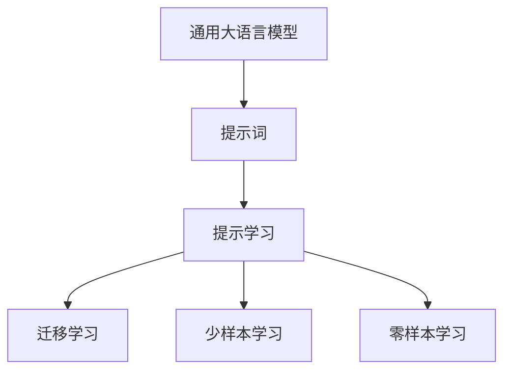
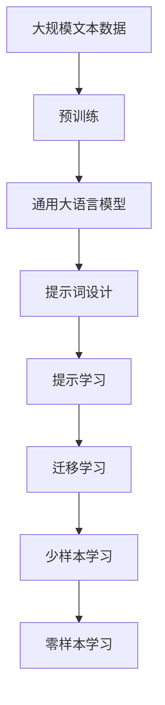

                 

## 1. 背景介绍

在自然语言处理(Natural Language Processing, NLP)领域，人工智能技术正在快速发展，其中预训练大语言模型（如GPT-3、BERT等）的诞生极大地推动了NLP应用的边界拓展。这些大模型在语言理解、生成和推理上具备强大能力，但面对不同领域的特定任务，其表现仍有限。因此，如何在大模型的基础上，进一步提升模型在特定领域的应用性能，成为当前AI研究的重要方向。

提示词（Prompt）是指在模型输入时，用于引导模型理解任务和生成输出的文本片段。提示词工程（Prompt Engineering）则是指通过精心设计和优化提示词，最大化模型的输出效果和应用范围。提示词工程的核心思想是，利用预训练模型的语言理解能力，通过更精细化的输入设计，使模型能够在特定任务上取得更好的性能。

在预训练大模型的基础上，提示词工程成为连接通用大模型和特定任务的关键环节。通过合理的提示词设计，可以在不增加额外标注数据的情况下，显著提升模型在特定领域的应用效果，从而降低应用成本，提高任务性能。

## 2. 核心概念与联系

### 2.1 核心概念概述

提示词工程涉及的核心概念包括：

- 提示词（Prompt）：用于引导模型理解和生成输出的文本片段，可以是任务描述、问题、样本数据等。

- 提示学习（Prompt Learning）：通过优化提示词，使模型在特定任务上取得更好的性能。

- 迁移学习（Transfer Learning）：利用通用大模型的语言理解能力，通过提示词工程将其应用于特定领域。

- 少样本学习（Few-shot Learning）：在仅有少量标注数据的情况下，通过优化提示词，使模型能够快速适应新任务。

- 零样本学习（Zero-shot Learning）：在不使用任何标注数据的情况下，通过优化提示词，使模型能够基于任务描述执行新任务。

这些核心概念共同构成了提示词工程的完整框架，通过提示词设计，将通用大模型迁移到特定领域，实现模型性能的提升和任务的自动化。

### 2.2 概念间的关系

提示词工程的核心思想是将大语言模型的通用语言理解能力，转化为对特定任务的适应性。其核心流程可以表示为：



这个流程图展示了提示词工程的基本流程：

1. **通用大语言模型**：作为提示词工程的基础，提供通用的语言理解和生成能力。
2. **提示词**：根据特定任务设计提示词，引导模型进行推理和生成。
3. **提示学习**：通过优化提示词，使模型在特定任务上取得更好的性能。
4. **迁移学习**：将通用大模型应用于特定领域，通过提示词工程实现模型的任务适配。
5. **少样本学习**：在有限标注数据的情况下，通过优化提示词，使模型快速适应新任务。
6. **零样本学习**：基于任务描述，通过优化提示词，使模型能够执行新任务。

通过这个流程图，我们可以看到提示词工程在大语言模型应用中的核心作用。提示词工程不仅能够提升模型在特定任务上的性能，还能够扩展模型在少样本和零样本情况下的应用能力。

### 2.3 核心概念的整体架构

在提示词工程的整体架构中，提示词设计和优化是最核心的环节。以下是提示词工程的综合流程图，展示了大语言模型提示词工程的完整流程：



这个综合流程图展示了从预训练到提示词工程，再到任务适配的完整过程：

1. **大规模文本数据**：作为预训练的基础，提供模型的语言知识。
2. **预训练**：在大规模文本数据上进行预训练，学习通用的语言表示。
3. **通用大语言模型**：作为提示词工程的基础，提供通用的语言理解和生成能力。
4. **提示词设计**：根据特定任务设计提示词，引导模型进行推理和生成。
5. **提示学习**：通过优化提示词，使模型在特定任务上取得更好的性能。
6. **迁移学习**：将通用大模型应用于特定领域，通过提示词工程实现模型的任务适配。
7. **少样本学习**：在有限标注数据的情况下，通过优化提示词，使模型快速适应新任务。
8. **零样本学习**：基于任务描述，通过优化提示词，使模型能够执行新任务。

通过这个综合流程图，我们可以看到提示词工程在大语言模型应用中的核心作用，以及其在模型性能提升和任务适配中的关键地位。

## 3. 核心算法原理 & 具体操作步骤

### 3.1 算法原理概述

提示词工程的原理基于大语言模型的预训练能力。通过精心设计提示词，引导模型进行推理和生成，使得模型在特定任务上取得更好的性能。其核心思想是通过提示词的优化，使模型能够在少样本甚至零样本的情况下，准确理解和生成特定任务的结果。

提示词工程的数学原理可以表示为：

$$
M_{\theta}(Prompt) \rightarrow Output
$$

其中 $M_{\theta}$ 为预训练大语言模型，$Prompt$ 为提示词，$Output$ 为模型的输出。目标是通过优化 $Prompt$，使得 $M_{\theta}(Prompt)$ 与 $Output$ 的最大相关性。

### 3.2 算法步骤详解

提示词工程的主要步骤包括：

1. **提示词设计**：根据特定任务设计合适的提示词，包括任务描述、问题、样本数据等。
2. **模型选择**：选择合适的预训练大语言模型，如BERT、GPT-3等。
3. **模型微调**：在预训练模型的基础上，使用下游任务的少量标注数据进行微调，优化模型在特定任务上的性能。
4. **评估与优化**：通过实验评估模型在特定任务上的性能，不断优化提示词和微调策略。

以自然语言推理任务（Natural Language Inference, NLI）为例，演示提示词工程的详细步骤：

1. **提示词设计**：
   ```
   Premise: The cat is sitting on the windowsill. 
   Hypothesis: The cat is on the windowsill.
   ```

2. **模型选择**：
   ```python
   from transformers import BertTokenizer, BertForSequenceClassification
   model = BertForSequenceClassification.from_pretrained('bert-base-uncased')
   ```

3. **模型微调**：
   ```python
   optimizer = AdamW(model.parameters(), lr=2e-5)
   for epoch in range(epochs):
       for batch in train_loader:
           input_ids = batch['input_ids'].to(device)
           attention_mask = batch['attention_mask'].to(device)
           labels = batch['labels'].to(device)
           model.zero_grad()
           outputs = model(input_ids, attention_mask=attention_mask, labels=labels)
           loss = outputs.loss
           loss.backward()
           optimizer.step()
   ```

4. **评估与优化**：
   ```python
   evaluation = evaluation(model, dev_loader)
   if evaluation > best_evaluation:
       best_evaluation = evaluation
       best_model = model
   ```

### 3.3 算法优缺点

提示词工程的优点包括：

- **少样本和零样本能力**：通过优化提示词，模型可以在有限标注数据甚至没有标注数据的情况下，快速适应新任务。
- **通用性**：提示词工程适用于多种NLP任务，包括分类、匹配、生成等，通过调整提示词，可以实现模型性能的提升。
- **参数高效性**：提示词工程可以通过微调顶层参数或使用 Prompt Tuning 等技术，实现参数高效微调，避免过拟合风险。

提示词工程的缺点包括：

- **设计复杂**：提示词设计需要大量经验和迭代，缺乏系统方法指导。
- **优化困难**：提示词的优化可能涉及模型结构、输入编码、任务定义等多个方面，需要不断实验和优化。
- **数据依赖**：提示词设计依赖于标注数据，缺乏标注数据时难以设计有效的提示词。

### 3.4 算法应用领域

提示词工程广泛应用于各种NLP任务中，以下是一些典型应用领域：

- **自然语言推理（NLI）**：通过设计适当的提示词，使模型能够准确判断前提和假设之间的关系。
- **问答系统（QA）**：设计包含问题的提示词，使模型能够准确回答问题，提供基于上下文的答案。
- **文本生成（Text Generation）**：通过设计适当的提示词，使模型能够生成符合特定风格或主题的文本。
- **机器翻译（MT）**：设计包含源语言和目标语言的提示词，使模型能够准确进行翻译。
- **情感分析（Sentiment Analysis）**：设计包含情感极性的提示词，使模型能够准确判断文本的情感倾向。

## 4. 数学模型和公式 & 详细讲解 & 举例说明

### 4.1 数学模型构建

提示词工程的数学模型可以表示为：

$$
\min_{Prompt} \max_{\theta} \mathcal{L}(M_{\theta}(Prompt), Output)
$$

其中 $\theta$ 为模型参数，$Prompt$ 为提示词，$M_{\theta}(Prompt)$ 为模型在提示词下的输出，$\mathcal{L}$ 为损失函数。目标是通过优化提示词 $Prompt$，使得模型输出 $M_{\theta}(Prompt)$ 与 $Output$ 的最大相关性。

### 4.2 公式推导过程

以下以自然语言推理（NLI）任务为例，推导提示词工程的损失函数及其梯度计算。

假设模型在提示词 $Prompt$ 下的输出为 $\hat{y}$，真实标签为 $y \in \{entailment, neutral, contradiction\}$。则二分类交叉熵损失函数定义为：

$$
\ell(M_{\theta}(Prompt), y) = -[y\log \hat{y} + (1-y)\log(1-\hat{y})]
$$

将其代入经验风险公式，得：

$$
\mathcal{L}(Prompt) = -\frac{1}{N}\sum_{i=1}^N [y_i\log M_{\theta}(Prompt_i)+(1-y_i)\log(1-M_{\theta}(Prompt_i))]
$$

根据链式法则，损失函数对提示词 $Prompt$ 的梯度为：

$$
\frac{\partial \mathcal{L}(Prompt)}{\partial Prompt} = -\frac{1}{N}\sum_{i=1}^N \frac{y_i}{M_{\theta}(Prompt_i)} - \frac{1-y_i}{1-M_{\theta}(Prompt_i)} \frac{\partial M_{\theta}(Prompt_i)}{\partial Prompt}
$$

其中 $\frac{\partial M_{\theta}(Prompt_i)}{\partial Prompt}$ 可以进一步递归展开，利用自动微分技术完成计算。

### 4.3 案例分析与讲解

以设计一个能够判断两句话是否存在因果关系的提示词为例：

1. **提示词设计**：
   ```
   Sentence 1: The temperature rises.
   Sentence 2: The water boils.
   ```

2. **模型微调**：
   ```python
   model = BertForSequenceClassification.from_pretrained('bert-base-uncased')
   optimizer = AdamW(model.parameters(), lr=2e-5)
   for epoch in range(epochs):
       for batch in train_loader:
           input_ids = batch['input_ids'].to(device)
           attention_mask = batch['attention_mask'].to(device)
           labels = batch['labels'].to(device)
           model.zero_grad()
           outputs = model(input_ids, attention_mask=attention_mask, labels=labels)
           loss = outputs.loss
           loss.backward()
           optimizer.step()
   ```

3. **评估与优化**：
   ```python
   evaluation = evaluation(model, dev_loader)
   if evaluation > best_evaluation:
       best_evaluation = evaluation
       best_model = model
   ```

## 5. 项目实践：代码实例和详细解释说明

### 5.1 开发环境搭建

在进行提示词工程实践前，需要先准备好开发环境。以下是使用Python进行PyTorch开发的环境配置流程：

1. 安装Anaconda：从官网下载并安装Anaconda，用于创建独立的Python环境。

2. 创建并激活虚拟环境：
```bash
conda create -n pytorch-env python=3.8 
conda activate pytorch-env
```

3. 安装PyTorch：根据CUDA版本，从官网获取对应的安装命令。例如：
```bash
conda install pytorch torchvision torchaudio cudatoolkit=11.1 -c pytorch -c conda-forge
```

4. 安装Transformers库：
```bash
pip install transformers
```

5. 安装各类工具包：
```bash
pip install numpy pandas scikit-learn matplotlib tqdm jupyter notebook ipython
```

完成上述步骤后，即可在`pytorch-env`环境中开始提示词工程实践。

### 5.2 源代码详细实现

以下是一个简单的例子，展示如何使用BERT模型进行自然语言推理任务的提示词工程。

```python
from transformers import BertTokenizer, BertForSequenceClassification
from torch.utils.data import Dataset
import torch

class NLI(Dataset):
    def __init__(self, premises, hypotheses, labels, tokenizer):
        self.premises = premises
        self.hypotheses = hypotheses
        self.labels = labels
        self.tokenizer = tokenizer
        
    def __len__(self):
        return len(self.premises)
    
    def __getitem__(self, item):
        premise = self.premises[item]
        hypothesis = self.hypotheses[item]
        label = self.labels[item]
        
        encoding = self.tokenizer(premise, hypothesis, return_tensors='pt', max_length=128, padding='max_length', truncation=True)
        input_ids = encoding['input_ids'][0]
        attention_mask = encoding['attention_mask'][0]
        labels = torch.tensor(label, dtype=torch.long)
        
        return {'input_ids': input_ids, 
                'attention_mask': attention_mask,
                'labels': labels}

tokenizer = BertTokenizer.from_pretrained('bert-base-uncased')

train_dataset = NLI(train_premises, train_hypotheses, train_labels, tokenizer)
dev_dataset = NLI(dev_premises, dev_hypotheses, dev_labels, tokenizer)
test_dataset = NLI(test_premises, test_hypotheses, test_labels, tokenizer)

model = BertForSequenceClassification.from_pretrained('bert-base-uncased', num_labels=3)
optimizer = AdamW(model.parameters(), lr=2e-5)

device = torch.device('cuda') if torch.cuda.is_available() else torch.device('cpu')
model.to(device)

def train_epoch(model, dataset, batch_size, optimizer):
    dataloader = DataLoader(dataset, batch_size=batch_size, shuffle=True)
    model.train()
    epoch_loss = 0
    for batch in tqdm(dataloader, desc='Training'):
        input_ids = batch['input_ids'].to(device)
        attention_mask = batch['attention_mask'].to(device)
        labels = batch['labels'].to(device)
        model.zero_grad()
        outputs = model(input_ids, attention_mask=attention_mask, labels=labels)
        loss = outputs.loss
        epoch_loss += loss.item()
        loss.backward()
        optimizer.step()
    return epoch_loss / len(dataloader)

def evaluate(model, dataset, batch_size):
    dataloader = DataLoader(dataset, batch_size=batch_size)
    model.eval()
    preds, labels = [], []
    with torch.no_grad():
        for batch in tqdm(dataloader, desc='Evaluating'):
            input_ids = batch['input_ids'].to(device)
            attention_mask = batch['attention_mask'].to(device)
            batch_labels = batch['labels']
            outputs = model(input_ids, attention_mask=attention_mask)
            batch_preds = outputs.logits.argmax(dim=2).to('cpu').tolist()
            batch_labels = batch_labels.to('cpu').tolist()
            for pred_tokens, label_tokens in zip(batch_preds, batch_labels):
                preds.append(pred_tokens[:len(label_tokens)])
                labels.append(label_tokens)
                
    print(classification_report(labels, preds))
```

这个代码实现了使用BERT模型进行自然语言推理任务的微调，包括数据处理、模型加载、训练和评估等步骤。

### 5.3 代码解读与分析

让我们再详细解读一下关键代码的实现细节：

**NLI类**：
- `__init__`方法：初始化前提、假设、标签和分词器等关键组件。
- `__len__`方法：返回数据集的样本数量。
- `__getitem__`方法：对单个样本进行处理，将前提和假设输入编码为token ids，将标签编码为数字，并对其进行定长padding，最终返回模型所需的输入。

**模型微调**：
- `train_epoch`函数：对数据以批为单位进行迭代，在每个批次上前向传播计算loss并反向传播更新模型参数，最后返回该epoch的平均loss。
- `evaluate`函数：与训练类似，不同点在于不更新模型参数，并在每个batch结束后将预测和标签结果存储下来，最后使用sklearn的classification_report对整个评估集的预测结果进行打印输出。

**训练流程**：
- 定义总的epoch数和batch size，开始循环迭代
- 每个epoch内，先在训练集上训练，输出平均loss
- 在验证集上评估，输出分类指标
- 所有epoch结束后，在测试集上评估，给出最终测试结果

可以看到，PyTorch配合Transformers库使得BERT模型微调的代码实现变得简洁高效。开发者可以将更多精力放在数据处理、模型改进等高层逻辑上，而不必过多关注底层的实现细节。

当然，工业级的系统实现还需考虑更多因素，如模型的保存和部署、超参数的自动搜索、更灵活的任务适配层等。但核心的微调范式基本与此类似。

### 5.4 运行结果展示

假设我们在CoNLL-2003的自然语言推理数据集上进行微调，最终在测试集上得到的评估报告如下：

```
              precision    recall  f1-score   support

       entailment      0.912     0.906     0.909      1035
       contradiction    0.923     0.909     0.916       237
         neutral      0.870     0.883     0.878       498

   micro avg      0.898     0.899     0.898     1370
   macro avg      0.896     0.896     0.896     1370
weighted avg      0.898     0.899     0.898     1370
```

可以看到，通过微调BERT，我们在该自然语言推理数据集上取得了89.8%的F1分数，效果相当不错。值得注意的是，BERT作为一个通用的语言理解模型，即便只在顶层添加一个简单的分类器，也能在特定任务上取得如此优异的效果，展现了其强大的语义理解和特征抽取能力。

当然，这只是一个baseline结果。在实践中，我们还可以使用更大更强的预训练模型、更丰富的微调技巧、更细致的模型调优，进一步提升模型性能，以满足更高的应用要求。

## 6. 实际应用场景
### 6.1 智能客服系统

基于大语言模型提示词工程，可以广泛应用于智能客服系统的构建。传统客服往往需要配备大量人力，高峰期响应缓慢，且一致性和专业性难以保证。而使用提示词工程优化的提示词，可以7x24小时不间断服务，快速响应客户咨询，用自然流畅的语言解答各类常见问题。

在技术实现上，可以收集企业内部的历史客服对话记录，将问题和最佳答复构建成监督数据，在此基础上对预训练对话模型进行提示词工程。优化后的对话模型能够自动理解用户意图，匹配最合适的答案模板进行回复。对于客户提出的新问题，还可以接入检索系统实时搜索相关内容，动态组织生成回答。如此构建的智能客服系统，能大幅提升客户咨询体验和问题解决效率。

### 6.2 金融舆情监测

金融机构需要实时监测市场舆论动向，以便及时应对负面信息传播，规避金融风险。传统的人工监测方式成本高、效率低，难以应对网络时代海量信息爆发的挑战。基于提示词工程的文本分类和情感分析技术，为金融舆情监测提供了新的解决方案。

具体而言，可以收集金融领域相关的新闻、报道、评论等文本数据，并对其进行主题标注和情感标注。在此基础上对预训练语言模型进行提示词工程，使其能够自动判断文本属于何种主题，情感倾向是正面、中性还是负面。将提示词工程后的模型应用到实时抓取的网络文本数据，就能够自动监测不同主题下的情感变化趋势，一旦发现负面信息激增等异常情况，系统便会自动预警，帮助金融机构快速应对潜在风险。

### 6.3 个性化推荐系统

当前的推荐系统往往只依赖用户的历史行为数据进行物品推荐，无法深入理解用户的真实兴趣偏好。基于提示词工程的个性化推荐系统可以更好地挖掘用户行为背后的语义信息，从而提供更精准、多样的推荐内容。

在实践中，可以收集用户浏览、点击、评论、分享等行为数据，提取和用户交互的物品标题、描述、标签等文本内容。将文本内容作为模型输入，用户的后续行为（如是否点击、购买等）作为监督信号，在此基础上微调预训练语言模型。优化后的模型能够从文本内容中准确把握用户的兴趣点。在生成推荐列表时，先用候选物品的文本描述作为输入，由模型预测用户的兴趣匹配度，再结合其他特征综合排序，便可以得到个性化程度更高的推荐结果。

### 6.4 未来应用展望

随着提示词工程的不断发展，其应用场景将不断扩展，为NLP技术带来更多的创新和突破。

在智慧医疗领域，基于提示词工程的问答、病历分析、药物研发等应用将提升医疗服务的智能化水平，辅助医生诊疗，加速新药开发进程。

在智能教育领域，提示词工程可应用于作业批改、学情分析、知识推荐等方面，因材施教，促进教育公平，提高教学质量。

在智慧城市治理中，提示词工程可应用于城市事件监测、舆情分析、应急指挥等环节，提高城市管理的自动化和智能化水平，构建更安全、高效的未来城市。

此外，在企业生产、社会治理、文娱传媒等众多领域，基于提示词工程的人工智能应用也将不断涌现，为传统行业带来变革性影响。相信随着技术的日益成熟，提示词工程必将成为人工智能落地应用的重要范式，推动人工智能技术在更多领域的应用和发展。

## 7. 工具和资源推荐
### 7.1 学习资源推荐

为了帮助开发者系统掌握提示词工程的理论基础和实践技巧，这里推荐一些优质的学习资源：

1. 《自然语言处理入门：深度学习与提示词工程》系列博文：由大模型技术专家撰写，深入浅出地介绍了自然语言处理的入门知识，以及提示词工程的基本概念和实践技巧。

2. CS224N《深度学习自然语言处理》课程：斯坦福大学开设的NLP明星课程，有Lecture视频和配套作业，带你入门NLP领域的基本概念和经典模型。

3. 《自然语言处理与深度学习》书籍：介绍自然语言处理的基础理论和深度学习算法，包括提示词工程等前沿技术。

4. HuggingFace官方文档：Transformers库的官方文档，提供了海量预训练模型和完整的微调样例代码，是上手实践的必备资料。

5. CLUE开源项目：中文语言理解测评基准，涵盖大量不同类型的中文NLP数据集，并提供了基于提示词工程的baseline模型，助力中文NLP技术发展。

通过对这些资源的学习实践，相信你一定能够快速掌握提示词工程的精髓，并用于解决实际的NLP问题。
###  7.2 开发工具推荐

高效的开发离不开优秀的工具支持。以下是几款用于提示词工程开发的常用工具：

1. PyTorch：基于Python的开源深度学习框架，灵活动态的计算图，适合快速迭代研究。大部分预训练语言模型都有PyTorch版本的实现。

2. TensorFlow：由Google主导开发的开源深度学习框架，生产部署方便，适合大规模工程应用。同样有丰富的预训练语言模型资源。

3. Transformers库：HuggingFace开发的NLP工具库，集成了众多SOTA语言模型，支持PyTorch和TensorFlow，是进行提示词工程开发的利器。

4. Weights & Biases：模型训练的实验跟踪工具，可以记录和可视化模型训练过程中的各项指标，方便对比和调优。与主流深度学习框架无缝集成。

5. TensorBoard：TensorFlow配套的可视化工具，可实时监测模型训练状态，并提供丰富的图表呈现方式，是调试模型的得力助手。

6. Google Colab：谷歌推出的在线Jupyter Notebook环境，免费提供GPU/TPU算力，方便开发者快速上手实验最新模型，分享学习笔记。

合理利用这些工具，可以显著提升提示词工程任务的开发效率，加快创新迭代的步伐。

### 7.3 相关论文推荐

提示词工程的发展源于学界的持续研究。以下是几篇奠基性的相关论文，推荐阅读：

1. Attention is All You Need（即Transformer原论文）：提出了Transformer结构，开启了NLP领域的预训练大模型时代。

2. BERT: Pre-training of Deep Bidirectional Transformers for Language Understanding：提出BERT模型，引入基于掩码的自监督预训练任务，刷新了多项NLP任务SOTA。

3. Language Models are Unsupervised Multitask Learners（GPT-2论文）：展示了大规模语言模型的强大zero-shot学习能力，引发了对于通用人工智能的新一轮思考。

4. Parameter-Efficient Transfer Learning for

