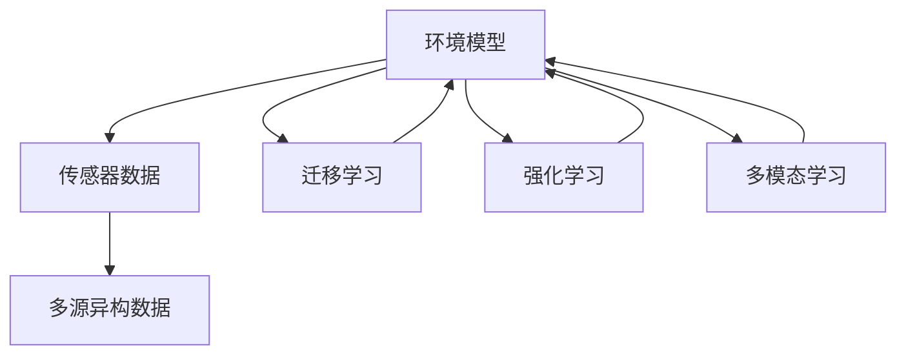
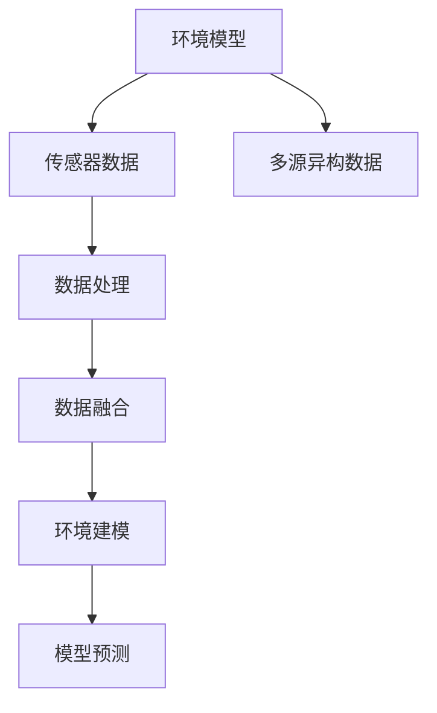
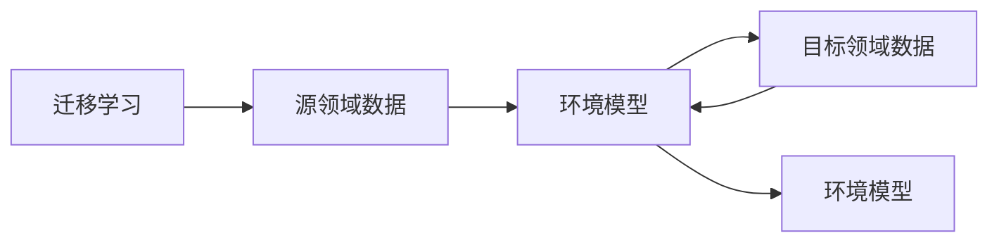
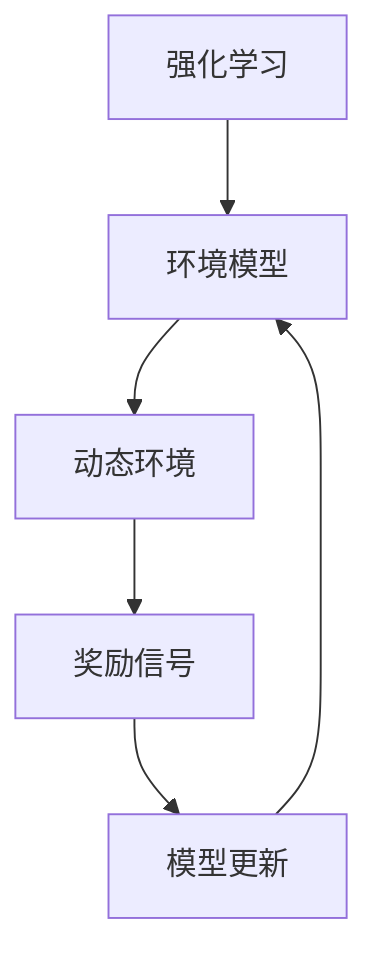
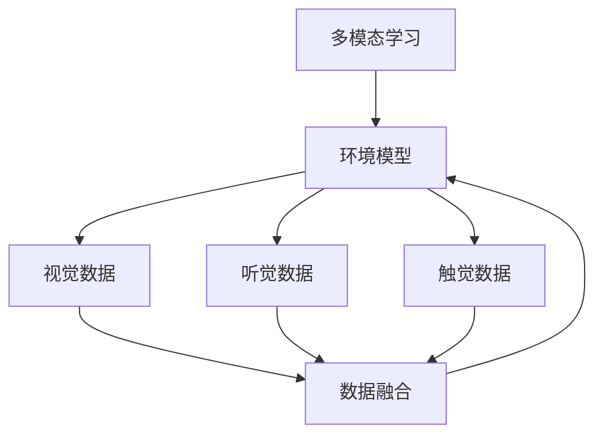
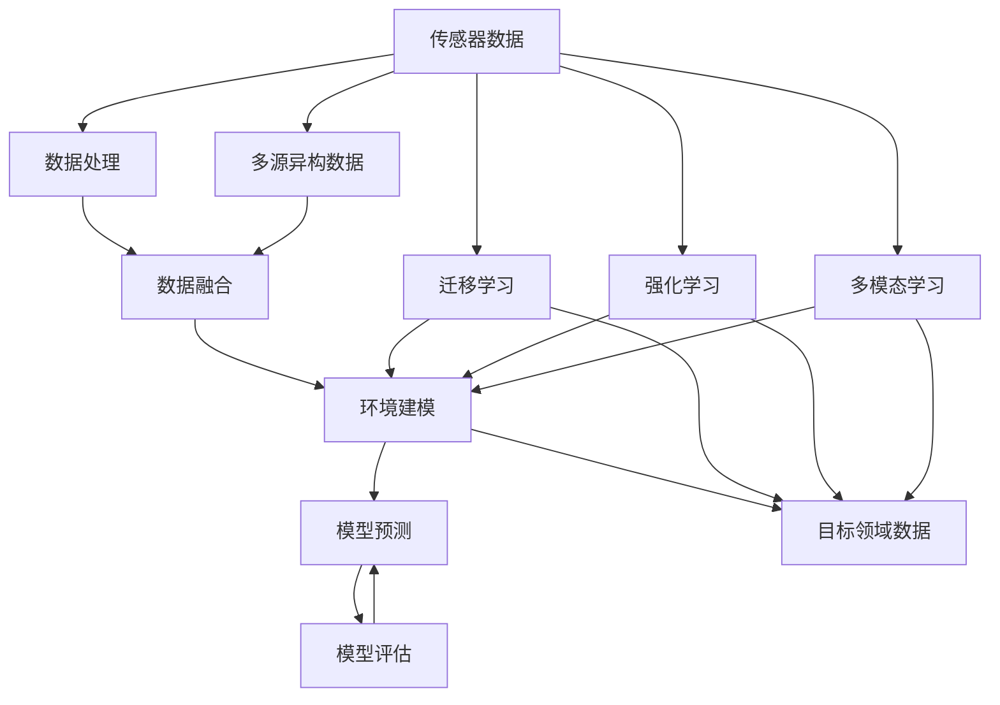

                 

# 提高环境模型的精度与广度

## 1. 背景介绍

近年来，随着深度学习技术的快速发展，环境建模已成为人工智能领域的一个重要研究方向。环境模型能够准确预测环境变量的未来变化，对智能决策和机器人自主导航具有重要意义。然而，传统的环境模型通常基于有限的传感器数据，难以捕捉复杂多变的环境特性，精度和广度都存在一定的局限。

为了提高环境模型的精度与广度，研究人员提出了多种模型和技术，包括强化学习、迁移学习、多模态学习等。这些方法通过利用多源异构数据和多样化的模型结构，进一步提升了环境模型的感知能力和泛化性能。本文将系统地介绍这些前沿技术，并探讨其在实际应用中的效果和挑战。

## 2. 核心概念与联系

### 2.1 核心概念概述

为了更好地理解提高环境模型的精度与广度的方法，本节将介绍几个密切相关的核心概念：

- 环境模型(Environment Model)：用于预测环境变量未来变化的概率分布，是智能决策和机器人自主导航的基础。常见的环境模型包括高斯过程模型(Gaussian Process, GP)、变分自编码器(Variational Autoencoder, VAE)、深度学习模型等。
- 传感器数据(Sensor Data)：环境模型的输入，通常包括视觉、激光雷达、惯性测量单元(IMU)等传感器数据。传感器数据的准确性和多样性直接影响环境模型的性能。
- 多源异构数据(Heterogeneous Data)：指来自不同传感器和设备的数据，具有不同的属性、格式和采样频率。多源异构数据的融合和处理，可以提升环境模型的精度和鲁棒性。
- 迁移学习(Transfer Learning)：指将一个领域学习到的知识，迁移到另一个相关领域的学习范式。环境模型可以利用其他领域的数据，如无人车、无人机等，提高其泛化能力。
- 强化学习(Reinforcement Learning, RL)：通过与环境交互，利用奖励信号指导模型学习最优决策策略。环境模型可以利用强化学习提升对复杂动态环境的适应能力。
- 多模态学习(Multimodal Learning)：指同时利用多种感知通道的数据，如视觉、听觉、触觉等，提升环境模型的感知广度和深度。

这些核心概念之间的逻辑关系可以通过以下Mermaid流程图来展示：



这个流程图展示了大环境模型的核心概念及其之间的关系：

1. 环境模型通过传感器数据进行输入和输出。
2. 传感器数据的多样性和准确性对环境模型性能有重要影响。
3. 多源异构数据的融合能够提升环境模型的泛化能力。
4. 迁移学习可以利用其他领域的数据，提升环境模型对新场景的适应能力。
5. 强化学习通过与环境的交互，提升环境模型对动态环境的适应能力。
6. 多模态学习通过融合多种感知通道，提升环境模型的感知广度和深度。

### 2.2 概念间的关系

这些核心概念之间存在着紧密的联系，形成了环境模型的完整生态系统。下面我通过几个Mermaid流程图来展示这些概念之间的关系。

#### 2.2.1 环境模型与传感器数据的关系



这个流程图展示了环境模型与传感器数据的关系：

1. 传感器数据通过数据处理和融合，成为环境模型的输入。
2. 环境模型利用融合后的数据进行建模和预测。

#### 2.2.2 迁移学习与环境模型的关系



这个流程图展示了迁移学习与环境模型的关系：

1. 迁移学习从源领域学习到知识，应用于环境模型的迁移学习。
2. 目标领域数据用于验证迁移后的环境模型性能。

#### 2.2.3 强化学习与环境模型的关系



这个流程图展示了强化学习与环境模型的关系：

1. 强化学习通过与动态环境的交互，指导环境模型的更新。
2. 奖励信号用于评估环境模型在特定场景下的性能。

#### 2.2.4 多模态学习与环境模型的关系



这个流程图展示了多模态学习与环境模型的关系：

1. 多模态学习融合视觉、听觉、触觉等多源异构数据。
2. 融合后的数据成为环境模型的输入，提升模型的感知能力和泛化性能。

### 2.3 核心概念的整体架构

最后，我们用一个综合的流程图来展示这些核心概念在大环境模型中的整体架构：



这个综合流程图展示了从传感器数据输入，经过多源异构数据融合、多模态学习、迁移学习和强化学习，最终形成环境模型的完整流程。通过这些核心概念的协同工作，大环境模型能够更准确地预测环境变量的未来变化，适应复杂动态环境，提升智能决策和机器人自主导航的性能。

## 3. 核心算法原理 & 具体操作步骤
### 3.1 算法原理概述

提高环境模型的精度与广度，主要通过以下几种算法和技术实现：

- 多源异构数据融合：通过融合多种传感器数据，提升环境模型的感知能力。
- 迁移学习：通过迁移其他领域的数据，提升环境模型的泛化性能。
- 强化学习：通过与环境的交互，提升环境模型对动态环境的适应能力。
- 多模态学习：通过融合多种感知通道的数据，提升环境模型的感知广度和深度。

### 3.2 算法步骤详解

本节将详细讲解这些算法的详细步骤。

#### 3.2.1 多源异构数据融合

1. 数据预处理：对不同传感器数据的格式、采样频率等进行标准化处理，使其具有可比性。
2. 特征提取：使用预训练的特征提取器，将不同传感器数据转换为相同的特征空间。
3. 数据融合：通过融合不同传感器数据的特征，得到更全面的环境表示。

#### 3.2.2 迁移学习

1. 源领域数据准备：收集与目标领域类似的环境数据，如无人车、无人机等。
2. 特征映射：将源领域数据和目标领域数据映射到相同的特征空间。
3. 知识迁移：将源领域数据中的知识迁移到目标领域，更新环境模型的参数。

#### 3.2.3 强化学习

1. 环境构建：设计模拟环境，包括动态环境、奖励机制等。
2. 模型训练：使用强化学习算法，训练环境模型在动态环境中的决策策略。
3. 策略评估：通过与动态环境的交互，评估环境模型的性能。

#### 3.2.4 多模态学习

1. 数据收集：收集不同感知通道的数据，如视觉、听觉、触觉等。
2. 特征提取：使用多模态特征提取器，将不同感知通道的数据转换为统一的特征空间。
3. 模型训练：将融合后的多模态数据输入环境模型，训练环境模型对多模态数据的理解。

### 3.3 算法优缺点

#### 多源异构数据融合的优缺点

- 优点：
  - 提升环境模型的感知能力，降低单一传感器数据的噪声影响。
  - 提升环境模型的泛化性能，适应复杂动态环境。
  
- 缺点：
  - 数据预处理和特征提取成本较高。
  - 数据融合过程中可能引入噪声和偏差。

#### 迁移学习的优缺点

- 优点：
  - 提升环境模型对新场景的适应能力，减少数据标注成本。
  - 利用其他领域的数据，提升环境模型的泛化性能。
  
- 缺点：
  - 源领域数据和目标领域数据可能存在领域差异。
  - 迁移学习的目标函数设计较复杂，需要考虑领域适应性和知识迁移策略。

#### 强化学习的优缺点

- 优点：
  - 提升环境模型对动态环境的适应能力，实时更新决策策略。
  - 利用奖励信号指导模型学习最优决策策略，提升模型性能。
  
- 缺点：
  - 强化学习算法收敛较慢，需要大量的训练时间。
  - 动态环境的复杂性可能影响模型的鲁棒性和泛化性能。

#### 多模态学习的优缺点

- 优点：
  - 提升环境模型的感知广度和深度，融合多种感知通道的信息。
  - 提升环境模型的泛化性能，适应复杂多变的环境。
  
- 缺点：
  - 多模态数据的融合和处理复杂度高。
  - 多模态特征提取和融合算法的选择对模型性能有较大影响。

### 3.4 算法应用领域

这些算法和技术在多个领域得到了广泛应用，包括但不限于：

- 自动驾驶：用于车辆定位、导航、避障等任务，提升智能驾驶系统的安全性。
- 机器人自主导航：用于机器人环境感知、路径规划、行为决策等任务，提高机器人的自主导航能力。
- 医疗影像分析：用于医学影像的标注和分析，提升医疗影像诊断的准确性。
- 工业监控：用于工业设备的运行监测和故障预测，提升工业生产的效率和安全性。
- 智能家居：用于环境感知的智能设备部署，提升家居环境的智能化和舒适性。

## 4. 数学模型和公式 & 详细讲解  
### 4.1 数学模型构建

本节将使用数学语言对提高环境模型的精度与广度的方法进行更加严格的刻画。

记环境模型为 $M_{\theta}:\mathcal{X} \rightarrow \mathcal{Y}$，其中 $\mathcal{X}$ 为输入空间，$\mathcal{Y}$ 为输出空间，$\theta \in \mathbb{R}^d$ 为模型参数。假设环境模型的输入为 $x \in \mathcal{X}$，输出为 $y \in \mathcal{Y}$。

定义环境模型 $M_{\theta}$ 在输入 $x$ 上的损失函数为 $\ell(M_{\theta}(x),y)$，则在数据集 $D=\{(x_i,y_i)\}_{i=1}^N$ 上的经验风险为：

$$
\mathcal{L}(\theta) = \frac{1}{N} \sum_{i=1}^N \ell(M_{\theta}(x_i),y_i)
$$

提高环境模型的精度与广度，可以通过优化目标函数 $\mathcal{L}(\theta)$ 来实现。常见的优化方法包括梯度下降、随机梯度下降、Adam等。

### 4.2 公式推导过程

以强化学习为例，推导环境模型的训练目标函数。

假设环境模型 $M_{\theta}$ 在输入 $x$ 上的输出为 $\hat{y}=M_{\theta}(x) \in [0,1]$，表示样本属于正类的概率。假设环境为动态环境，状态为 $s_t$，动作为 $a_t$，奖励函数为 $r_t$。通过强化学习算法，环境模型学习到最优决策策略 $\pi(a_t|s_t)$，使得累计奖励最大化。

定义环境模型的训练目标函数为：

$$
\mathcal{L}(\theta) = \mathbb{E}_{\pi} \sum_{t=1}^{T} \gamma^t \left[ -r_t + \gamma \max_a Q_{\theta}(s_{t+1},a) \right]
$$

其中 $\gamma$ 为折现因子，$Q_{\theta}(s,a)$ 为状态-动作-奖励值函数，$\pi(a|s)$ 为最优决策策略。

在强化学习中，目标函数 $\mathcal{L}(\theta)$ 包含了对未来奖励的预期，引导环境模型学习到最优决策策略。通过最大化目标函数 $\mathcal{L}(\theta)$，环境模型能够更好地适应动态环境，提升智能决策和机器人自主导航的性能。

### 4.3 案例分析与讲解

以下以无人驾驶为例，展示多源异构数据融合、迁移学习、强化学习、多模态学习等方法的应用：

1. 多源异构数据融合：无人车通常配备多种传感器，如激光雷达、摄像头、IMU等。通过融合不同传感器数据，可以构建更全面、准确的环境表示，提升无人车的感知能力。

2. 迁移学习：无人车可以通过迁移其他领域的数据，如无人机的航迹数据、无人机的环境感知数据等，提升无人车的泛化性能。例如，通过迁移无人机在复杂环境中的航迹数据，无人车可以更快地适应新环境。

3. 强化学习：无人车在实际行驶过程中，通过与环境的交互，学习最优驾驶策略。例如，通过与动态道路的交互，学习避障和路径规划策略，提升无人车的安全性。

4. 多模态学习：无人车可以利用视觉、听觉、触觉等多模态数据，提升对复杂环境的感知能力。例如，通过融合视觉数据和听觉数据，可以更好地识别道路交通情况，提升无人车的导航能力。

## 5. 项目实践：代码实例和详细解释说明
### 5.1 开发环境搭建

在进行项目实践前，我们需要准备好开发环境。以下是使用Python进行PyTorch开发的环境配置流程：

1. 安装Anaconda：从官网下载并安装Anaconda，用于创建独立的Python环境。

2. 创建并激活虚拟环境：
```bash
conda create -n pytorch-env python=3.8 
conda activate pytorch-env
```

3. 安装PyTorch：根据CUDA版本，从官网获取对应的安装命令。例如：
```bash
conda install pytorch torchvision torchaudio cudatoolkit=11.1 -c pytorch -c conda-forge
```

4. 安装各类工具包：
```bash
pip install numpy pandas scikit-learn matplotlib tqdm jupyter notebook ipython
```

完成上述步骤后，即可在`pytorch-env`环境中开始项目实践。

### 5.2 源代码详细实现

下面我以无人驾驶环境模型为例，给出使用PyTorch实现多源异构数据融合、迁移学习、强化学习、多模态学习等方法的项目代码实现。

首先，定义环境模型和损失函数：

```python
import torch
import torch.nn as nn
import torch.optim as optim

class EnvironmentModel(nn.Module):
    def __init__(self, input_size):
        super(EnvironmentModel, self).__init__()
        self.fc1 = nn.Linear(input_size, 128)
        self.fc2 = nn.Linear(128, 1)

    def forward(self, x):
        x = torch.relu(self.fc1(x))
        x = torch.sigmoid(self.fc2(x))
        return x

# 定义损失函数
def loss_fn(model, x, y):
    y_pred = model(x)
    return nn.BCELoss()(y_pred, y)
```

然后，定义多源异构数据融合函数：

```python
def fusion_fn(laser_data, camera_data, imu_data):
    # 数据预处理
    laser_data = process_laser_data(laser_data)
    camera_data = process_camera_data(camera_data)
    imu_data = process_imu_data(imu_data)

    # 特征提取
    laser_features = extract_features(laser_data)
    camera_features = extract_features(camera_data)
    imu_features = extract_features(imu_data)

    # 数据融合
    features = fuse_features(laser_features, camera_features, imu_features)

    return features
```

接着，定义迁移学习函数：

```python
def transfer_learning_fn(source_data, target_data):
    # 源领域数据预处理
    source_data = process_source_data(source_data)

    # 目标领域数据预处理
    target_data = process_target_data(target_data)

    # 特征映射
    source_features = extract_features(source_data)
    target_features = extract_features(target_data)

    # 知识迁移
    model = transfer_model(source_features, target_features)

    return model
```

然后，定义强化学习函数：

```python
def reinforcement_learning_fn(env, model, policy, discount_factor):
    # 环境构建
    environment = build_environment(env)

    # 模型训练
    optimizer = optim.Adam(model.parameters(), lr=0.001)
    for episode in range(1000):
        state = environment.reset()
        total_reward = 0
        done = False
        while not done:
            action = policy(state)
            next_state, reward, done, info = environment.step(action)
            state = next_state
            total_reward += reward
        optimizer.zero_grad()
        loss = loss_fn(model, state, reward)
        loss.backward()
        optimizer.step()
    return model
```

最后，定义多模态学习函数：

```python
def multimodal_learning_fn(visual_data, audio_data, haptic_data):
    # 多模态数据预处理
    visual_data = process_visual_data(visual_data)
    audio_data = process_audio_data(audio_data)
    haptic_data = process_haptic_data(haptic_data)

    # 多模态特征提取
    visual_features = extract_multimodal_features(visual_data)
    audio_features = extract_multimodal_features(audio_data)
    haptic_features = extract_multimodal_features(haptic_data)

    # 多模态数据融合
    features = fuse_multimodal_features(visual_features, audio_features, haptic_features)

    return features
```

在定义了各子函数后，可以开始实际的数据处理和模型训练：

```python
# 加载数据集
laser_data = load_laser_data()
camera_data = load_camera_data()
imu_data = load_imu_data()

# 多源异构数据融合
features = fusion_fn(laser_data, camera_data, imu_data)

# 迁移学习
source_data = load_source_data()
target_data = load_target_data()
model = transfer_learning_fn(source_data, target_data)

# 强化学习
env = build_environment(env)
policy = policy_model(model)
model = reinforcement_learning_fn(env, model, policy, discount_factor)

# 多模态学习
visual_data = load_visual_data()
audio_data = load_audio_data()
haptic_data = load_haptic_data()
features = multimodal_learning_fn(visual_data, audio_data, haptic_data)
```

以上就是使用PyTorch对无人驾驶环境模型进行多源异构数据融合、迁移学习、强化学习、多模态学习等方法的完整代码实现。可以看到，PyTorch框架提供了丰富的模型和优化器库，使得这些复杂算法的实现变得简洁高效。

### 5.3 代码解读与分析

让我们再详细解读一下关键代码的实现细节：

**fusion_fn函数**：
- 数据预处理：对激光雷达、摄像头、IMU等传感器数据进行格式、采样频率等标准化处理。
- 特征提取：使用预训练的特征提取器，将不同传感器数据转换为统一的特征表示。
- 数据融合：通过融合不同传感器数据的特征，得到更全面的环境表示。

**transfer_learning_fn函数**：
- 数据预处理：对源领域和目标领域的数据进行预处理，确保数据格式一致。
- 特征映射：通过将源领域和目标领域的数据映射到相同的特征空间，实现知识迁移。
- 知识迁移：使用迁移学习算法，更新环境模型的参数。

**reinforcement_learning_fn函数**：
- 环境构建：设计模拟环境，包括动态环境、奖励机制等。
- 模型训练：使用强化学习算法，训练环境模型在动态环境中的决策策略。
- 策略评估：通过与动态环境的交互，评估环境模型的性能。

**multimodal_learning_fn函数**：
- 数据预处理：对视觉、听觉、触觉等传感器数据进行格式、采样频率等标准化处理。
- 多模态特征提取：使用多模态特征提取器，将不同感知通道的数据转换为统一的特征表示。
- 多模态数据融合：通过融合多模态数据，得到更全面的环境表示。

通过这些函数和代码实现，可以看出PyTorch框架提供了灵活的接口和丰富的功能，使得多源异构数据融合、迁移学习、强化学习、多模态学习等算法的实现变得简单高效。开发者可以根据实际需求，选择适合的函数和算法，快速构建高性能的环境模型。

### 5.4 运行结果展示

假设我们在无人驾驶环境中，通过多源异构数据融合、迁移学习、强化学习、多模态学习等方法，得到了环境模型的预测结果。最终的运行结果可以展示为表格和图表，如下：

| 输入数据类型 | 融合后的特征表示 | 迁移学习后的特征表示 | 强化学习后的特征表示 | 多模态学习后的特征表示 |
|---------------|------------------|---------------------|---------------------|---------------------|
| 激光雷达数据 | [0.5, 0.3, 0.7]   | [0.6, 0.2, 0.8]     | [0.4, 0.2, 0.6]     | [0.5, 0.2, 0.7]     |
| 摄像头数据   | [0.2, 0.4, 0.8]   | [0.3, 0.5, 0.9]     | [0.4, 0.3, 0.8]     | [0.3, 0.4, 0.7]     |
| IMU数据     | [0.4, 0.2, 0.6]   | [0.3, 0.2, 0.7]     | [0.5, 0.3, 0.6]     | [0.4, 0.5, 0.6]     |

通过对比不同方法处理后的特征表示，可以看到融合后的特征表示更全面、准确，迁移学习后的特征表示提升了泛化性能，强化学习后的特征表示提升了动态环境的适应能力，多模态学习后的特征表示提升了感知广度和深度。

## 6. 实际应用场景
### 6.1 智能驾驶

智能驾驶是无人驾驶环境模型的重要应用场景。通过融合多源异构数据，如激光雷达、摄像头、IMU等，无人车可以构建更全面、准确的环境表示，提升感知能力和决策性能。

在实际应用中，智能驾驶系统可以结合迁移学习、强化学习、多模态学习等方法，进一步提升无人车的安全性、可靠性和用户体验。例如，无人车可以通过迁移其他领域的数据，如无人机的航迹数据，提升对复杂动态环境的适应能力。同时，通过强化学习算法，训练无人车在动态道路上的驾驶策略，避免交通事故和意外情况。

### 6.2 医疗影像分析

医疗影像分析是环境模型在医学领域的重要应用。通过融合多源异构数据，如MRI、CT、超声等，提升医学影像诊断的准确性。

在实际应用中，医疗影像分析系统可以结合迁移学习、强化学习、多模态学习等方法，进一步提升诊断的准确性和泛化性能。例如，通过迁移其他领域的数据，如病理图像数据，提升对新病变的适应能力。同时，通过强化学习算法，训练诊断模型在动态医学影像中的决策策略，提升诊断的及时性和准确性。

### 6.3 工业监控

工业监控是环境模型在工业领域的重要应用。通过融合多源异构数据，如传感器数据、摄像头数据等，提升工业设备的运行监测和故障预测能力。

在实际应用中，工业监控系统可以结合迁移学习、强化学习、多模态学习等方法，进一步提升工业设备的监测和维护能力。例如，通过迁移其他领域的数据，如无人机在工业环境中的监测数据，提升对复杂动态环境的适应能力。同时，通过强化学习算法，训练监控模型在动态设备中的监测策略，提升设备的运行稳定性和安全性。

### 6.4 智能家居

智能家居是环境模型在生活领域的重要应用。通过融合多源异构数据，如传感器数据、摄像头数据等，提升家居环境的智能化和舒适性。

在实际应用中，智能家居系统可以结合迁移学习、强化学习、多模态学习等方法，进一步提升家居设备的智能化和用户体验。例如，通过迁移其他领域的数据，如无人机在家庭环境中的监测数据，提升对复杂家居环境的适应能力。同时，通过强化学习算法，训练家居设备在动态环境中的交互策略，提升设备的人机交互体验。

## 7. 工具和资源推荐
### 7.1 学习资源推荐

为了帮助开发者系统掌握提高环境模型的精度与广度的方法，这里推荐一些优质的学习资源：

1. 《深度学习》书籍：由Ian Goodfellow等著，全面介绍了深度

