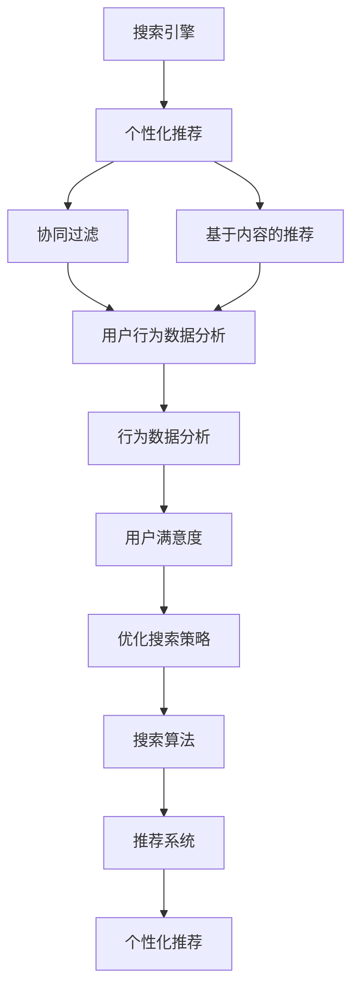
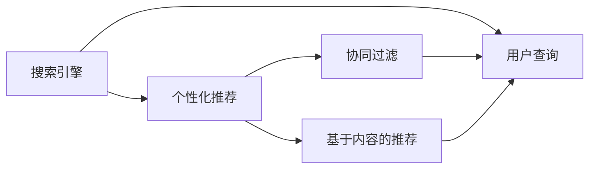
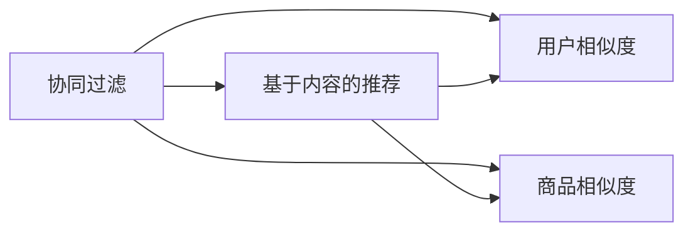
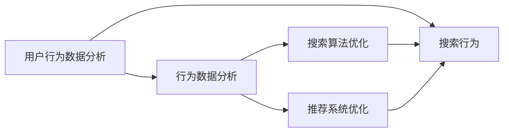
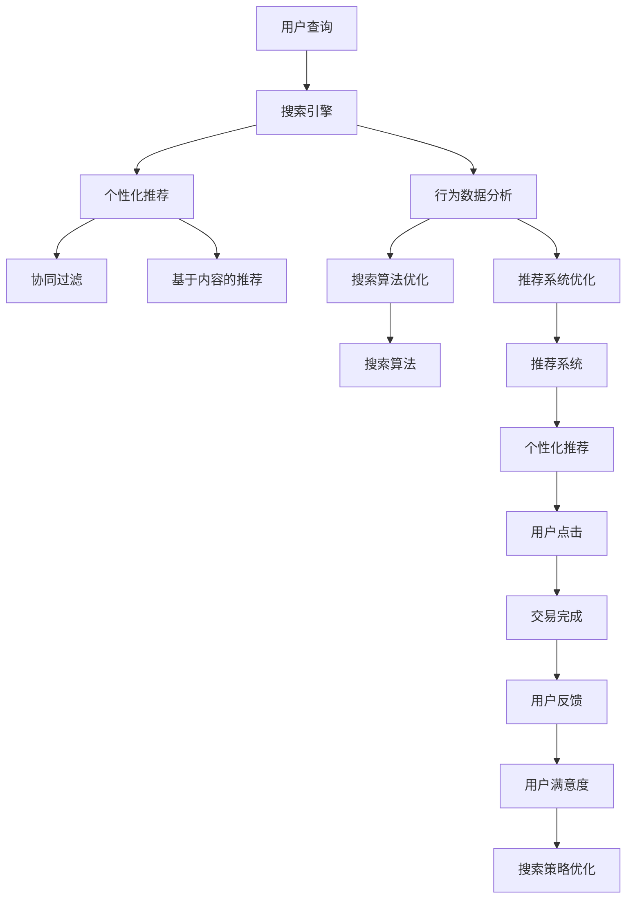

                 

# 搜索数据分析：AI如何帮助电商平台优化搜索策略，提升用户体验

> 关键词：搜索算法,电商平台,推荐系统,个性化推荐,用户体验

## 1. 背景介绍

### 1.1 问题由来
在电商平台上，用户通过搜索功能获取所需商品信息。搜索引擎的核心任务是准确、高效地匹配用户的查询意图和商品列表。随着用户规模的扩大，商品种类和数量的不断增加，电商平台的搜索体验面临着严峻挑战。如何提升搜索准确性、提高用户满意度、提升转化率，成为电商平台亟需解决的重要问题。

### 1.2 问题核心关键点
1. 搜索算法：搜索算法是搜索引擎的“大脑”，负责解析用户查询、匹配商品列表、推荐相关商品。
2. 推荐系统：推荐系统是提升用户体验的重要工具，通过个性化推荐提高用户转化率和粘性。
3. 数据分析：通过分析用户行为数据，优化搜索算法和推荐系统，提升整体搜索体验。
4. 用户体验：搜索算法和推荐系统的核心目标是为用户提供满意的购物体验，提高用户满意度和忠诚度。

### 1.3 问题研究意义
研究搜索数据分析的方法和工具，对于优化电商平台搜索策略、提升用户体验具有重要意义：

1. 提升搜索准确性：通过数据分析，可以更准确地理解用户查询意图，匹配更相关的商品列表。
2. 个性化推荐：通过用户行为数据分析，实现更精准的商品推荐，提高用户转化率。
3. 用户行为洞察：通过深入分析用户搜索行为，洞察用户偏好和需求，优化产品策略和营销方案。
4. 优化用户体验：通过改善搜索和推荐效果，提高用户满意度，增强用户粘性。

## 2. 核心概念与联系

### 2.1 核心概念概述

为更好地理解搜索数据分析和电商平台的搜索策略优化，本节将介绍几个密切相关的核心概念：

- **搜索引擎**：一种信息检索系统，通过自动搜索和排序，帮助用户获取相关网页或商品信息。
- **个性化推荐系统**：通过分析用户历史行为和偏好，推荐个性化的商品或内容，提升用户体验和转化率。
- **协同过滤**：一种推荐算法，通过分析用户相似度和商品相似度，找到用户可能感兴趣的物品。
- **基于内容的推荐**：根据商品属性和用户兴趣，推荐与用户喜好相匹配的商品。
- **行为数据分析**：通过分析用户搜索、浏览、点击等行为数据，洞察用户需求和偏好，优化搜索结果和推荐列表。
- **用户满意度**：用户在使用搜索和推荐功能后的体验和反馈，是评估搜索策略效果的指标。

这些核心概念之间的逻辑关系可以通过以下Mermaid流程图来展示：



这个流程图展示了大语言模型微调过程中各个核心概念之间的关系：

1. 搜索引擎解析用户查询，个性化推荐系统通过协同过滤和基于内容的推荐技术，为用户提供个性化推荐。
2. 用户行为数据分析对用户搜索行为进行深入分析，通过行为数据分析优化搜索算法和推荐系统，提高用户满意度。
3. 搜索算法和推荐系统优化后，提升用户搜索体验和个性化推荐效果，进一步提升用户满意度。

### 2.2 概念间的关系

这些核心概念之间存在着紧密的联系，形成了电商平台的搜索策略优化生态系统。下面我通过几个Mermaid流程图来展示这些概念之间的关系。

#### 2.2.1 搜索与推荐的关系



这个流程图展示了搜索引擎与个性化推荐系统的关系：

1. 用户通过搜索引擎输入查询，系统根据查询结果返回推荐列表。
2. 推荐系统通过协同过滤和基于内容的推荐技术，进一步筛选推荐商品，提升推荐效果。
3. 用户点击推荐商品，完成交易，搜索系统更新用户行为数据。

#### 2.2.2 协同过滤与基于内容推荐的关系



这个流程图展示了协同过滤与基于内容的推荐之间的关系：

1. 协同过滤根据用户相似度，找到相似用户推荐商品。
2. 基于内容的推荐根据商品属性和用户兴趣，推荐与用户喜好相匹配的商品。
3. 协同过滤和基于内容的推荐相结合，实现更精准的个性化推荐。

#### 2.2.3 用户行为数据分析与搜索推荐优化



这个流程图展示了用户行为数据分析在搜索和推荐优化中的应用：

1. 用户行为数据分析通过对用户搜索、点击、购买等行为进行深入分析，洞察用户需求。
2. 行为数据分析对搜索算法和推荐系统进行优化，提升搜索和推荐效果。
3. 优化后的搜索算法和推荐系统，提高用户搜索体验和个性化推荐效果，提升用户满意度。

### 2.3 核心概念的整体架构

最后，我们用一个综合的流程图来展示这些核心概念在大语言模型微调过程中的整体架构：



这个综合流程图展示了从用户查询到最终交易完成的整个过程。通过搜索引擎解析用户查询，个性化推荐系统通过协同过滤和基于内容的推荐技术，为用户推荐个性化商品。同时，通过用户行为数据分析，优化搜索算法和推荐系统，提升搜索效果和推荐准确性。最终，通过用户点击和交易反馈，评估和优化搜索策略，提升用户体验和平台收益。

## 3. 核心算法原理 & 具体操作步骤
### 3.1 算法原理概述

电商平台搜索策略优化的核心是搜索算法和个性化推荐系统。通过算法优化，提升搜索和推荐效果，从而提升用户满意度和转化率。

搜索算法的核心任务是解析用户查询，匹配商品列表，并返回最相关的结果。推荐系统的目标是根据用户历史行为和偏好，提供个性化的商品推荐。具体算法包括以下几个关键步骤：

1. **查询解析**：通过自然语言处理(NLP)技术，解析用户查询，提取关键信息。
2. **商品匹配**：根据解析后的查询信息，匹配商品列表，并计算相似度。
3. **排序**：根据商品匹配结果，对商品列表进行排序，选择最相关的商品推荐给用户。
4. **推荐更新**：根据用户点击、购买等行为数据，实时更新推荐系统，提升推荐效果。

### 3.2 算法步骤详解

#### 3.2.1 查询解析

查询解析是搜索算法的第一步，通过自然语言处理(NLP)技术，将用户输入的自然语言查询转换为结构化数据。具体步骤包括：

1. **分词**：将查询文本分割成单词或短语。
2. **命名实体识别**：识别查询中的实体名称，如品牌、产品名称等。
3. **关键词提取**：提取查询中的关键词，去除停用词。
4. **意图识别**：识别查询意图，如查找商品、比较价格等。

#### 3.2.2 商品匹配

商品匹配是搜索算法的核心步骤，根据解析后的查询信息，匹配商品列表，并计算相似度。具体步骤如下：

1. **建立索引**：对商品信息建立倒排索引，根据商品属性（如价格、品牌、类别等）进行快速查找。
2. **匹配算法**：使用倒排索引匹配查询信息，选择最相关的商品列表。
3. **相似度计算**：计算查询与商品之间的相似度，如TF-IDF、余弦相似度等。
4. **排序算法**：根据相似度排序，选择最相关的商品进行推荐。

#### 3.2.3 排序

排序是搜索算法的最后一步，根据匹配结果对商品列表进行排序，选择最相关的商品推荐给用户。具体步骤如下：

1. **评分模型**：构建评分模型，根据商品属性和用户偏好进行评分。
2. **排序算法**：使用排序算法（如倒排索引、深度优先搜索、广度优先搜索等），对商品列表进行排序。
3. **展示选择**：根据排序结果，选择最相关的商品进行展示，提升用户点击率。

#### 3.2.4 推荐更新

推荐更新是推荐系统的核心步骤，根据用户行为数据，实时更新推荐系统，提升推荐效果。具体步骤如下：

1. **数据采集**：采集用户点击、购买、浏览等行为数据。
2. **用户画像**：根据行为数据，构建用户画像，分析用户偏好和需求。
3. **推荐算法**：使用协同过滤、基于内容的推荐等算法，为用户推荐个性化商品。
4. **反馈机制**：根据用户反馈数据（如点击、购买、评分等），实时更新推荐系统，提升推荐效果。

### 3.3 算法优缺点

基于搜索算法和推荐系统的优化方法具有以下优点：

1. 个性化推荐：通过分析用户行为数据，实现更精准的个性化推荐，提高用户转化率。
2. 搜索效果提升：通过优化查询解析、商品匹配和排序算法，提升搜索效果，减少用户搜索时间。
3. 用户满意度提升：通过优化搜索和推荐效果，提升用户搜索体验和满意度。

但同时，这些方法也存在一些缺点：

1. 数据依赖：优化效果依赖于用户行为数据的质量和数量，数据不足可能导致效果不佳。
2. 计算复杂度：优化搜索算法和推荐系统需要大量计算资源，可能导致系统延迟。
3. 用户隐私问题：用户行为数据的收集和分析可能导致用户隐私问题。

### 3.4 算法应用领域

基于搜索算法和推荐系统的优化方法在电商平台上得到了广泛应用，主要包括以下几个领域：

1. **搜索算法优化**：通过优化查询解析、商品匹配和排序算法，提升搜索效果，减少用户搜索时间。
2. **个性化推荐系统**：通过分析用户行为数据，实现个性化推荐，提升用户转化率。
3. **用户行为数据分析**：通过分析用户搜索、点击、购买等行为数据，洞察用户需求和偏好，优化产品策略和营销方案。
4. **搜索效果评估**：通过用户反馈数据，评估搜索效果，优化搜索策略，提升用户满意度。

## 4. 数学模型和公式 & 详细讲解 & 举例说明

### 4.1 数学模型构建

本节将使用数学语言对基于搜索算法和推荐系统的优化方法进行更加严格的刻画。

记用户查询为 $q$，商品列表为 $I$，商品 $i$ 的特征向量为 $\mathbf{x}_i$。查询 $q$ 的解析结果为 $f(q)$，商品 $i$ 与查询 $q$ 的相似度为 $s_i(q)$，推荐系统输出的商品列表为 $R$。

推荐系统的目标是最小化用户满意度的负对数似然函数：

$$
\min_{R} -\sum_{q \in Q} \log p(R(q))
$$

其中 $Q$ 为查询集合，$p(R(q))$ 为推荐系统输出的商品列表 $R(q)$ 的概率分布。

推荐系统的优化目标是通过最大化用户满意度，提升推荐效果。具体步骤如下：

1. **查询解析**：使用自然语言处理技术，解析查询 $q$，提取关键信息 $f(q)$。
2. **商品匹配**：计算每个商品 $i$ 与查询 $q$ 的相似度 $s_i(q)$。
3. **排序**：根据相似度 $s_i(q)$ 对商品列表进行排序，选择最相关的商品 $R(q)$。
4. **推荐更新**：根据用户反馈数据 $y_i$，实时更新推荐系统，提升推荐效果。

### 4.2 公式推导过程

以下我们以二分类任务为例，推导推荐系统的优化公式。

假设推荐系统输出的商品列表 $R(q)$ 中，用户点击的商品数量为 $C$，点击的平均质量为 $A$。点击的概率分布为 $p(R(q))$，用户满意度的负对数似然函数为 $L(p(R(q)))$。

推荐系统的优化目标为：

$$
\min_{R} L(p(R(q)))
$$

其中 $L(p(R(q))) = -\sum_{i \in R(q)} y_i \log p_i - (1-y_i) \log (1-p_i)$，$p_i$ 为商品 $i$ 的点击概率。

根据上述优化目标，推荐系统的优化公式为：

$$
\frac{\partial L(p(R(q)))}{\partial p_i} = -y_i + p_i
$$

即点击概率 $p_i$ 的梯度更新公式。

在推荐系统优化过程中，需要不断更新商品 $i$ 的点击概率 $p_i$，直到达到最优状态。

### 4.3 案例分析与讲解

#### 4.3.1 协同过滤

协同过滤是一种基于用户相似度和商品相似度的推荐算法。具体步骤如下：

1. **用户相似度计算**：计算用户 $u$ 与用户 $v$ 的相似度 $s_{uv}$。
2. **商品相似度计算**：计算商品 $i$ 与商品 $j$ 的相似度 $s_{ij}$。
3. **推荐计算**：根据用户相似度 $s_{uv}$ 和商品相似度 $s_{ij}$，计算用户 $u$ 对商品 $j$ 的推荐概率 $p_{uj}$。

具体公式为：

$$
p_{uj} = \alpha \cdot s_{uj} + (1-\alpha) \cdot \hat{p}_{uj}
$$

其中 $\alpha$ 为相似度权重，$\hat{p}_{uj}$ 为用户 $u$ 对商品 $j$ 的原始评分。

协同过滤的优点是能够利用用户历史行为数据，实现个性化推荐。但缺点是需要大量的用户和商品数据，计算复杂度高，可能导致系统延迟。

#### 4.3.2 基于内容的推荐

基于内容的推荐算法，根据商品属性和用户兴趣，推荐与用户喜好相匹配的商品。具体步骤如下：

1. **商品属性提取**：提取商品 $i$ 的属性特征 $\mathbf{x}_i$。
2. **用户兴趣分析**：分析用户 $u$ 的兴趣特征 $\mathbf{a}_u$。
3. **相似度计算**：计算商品 $i$ 与用户 $u$ 的相似度 $s_{iu}$。
4. **推荐计算**：根据相似度 $s_{iu}$，计算用户 $u$ 对商品 $i$ 的推荐概率 $p_{iu}$。

具体公式为：

$$
p_{iu} = \mathbf{a}_u \cdot \mathbf{x}_i
$$

基于内容的推荐算法，优点是能够利用商品属性信息，实现商品特征与用户兴趣的匹配。但缺点是可能存在冷启动问题，新用户或新商品难以进行推荐。

## 5. 项目实践：代码实例和详细解释说明
### 5.1 开发环境搭建

在进行搜索算法和推荐系统优化实践前，我们需要准备好开发环境。以下是使用Python进行TensorFlow开发的环境配置流程：

1. 安装Anaconda：从官网下载并安装Anaconda，用于创建独立的Python环境。

2. 创建并激活虚拟环境：
```bash
conda create -n tf-env python=3.8 
conda activate tf-env
```

3. 安装TensorFlow：根据CUDA版本，从官网获取对应的安装命令。例如：
```bash
conda install tensorflow==2.6
```

4. 安装各类工具包：
```bash
pip install numpy pandas scikit-learn matplotlib tqdm jupyter notebook ipython
```

完成上述步骤后，即可在`tf-env`环境中开始搜索算法和推荐系统优化实践。

### 5.2 源代码详细实现

这里我们以推荐系统为例，给出使用TensorFlow实现个性化推荐系统的PyTorch代码实现。

首先，定义推荐系统的数据结构：

```python
import tensorflow as tf

class RecommendationSystem:
    def __init__(self, num_users, num_items):
        self.num_users = num_users
        self.num_items = num_items
        self.user_vector_size = 10
        self.item_vector_size = 10
        self.user_vectors = tf.Variable(tf.random.normal([num_users, user_vector_size]))
        self.item_vectors = tf.Variable(tf.random.normal([num_items, item_vector_size]))
        
    def predict(self, user_idx, item_idx):
        user_vector = self.user_vectors[user_idx]
        item_vector = self.item_vectors[item_idx]
        similarity = tf.reduce_sum(tf.multiply(user_vector, item_vector))
        return similarity

    def train(self, user_idx, item_idx, label):
        similarity = self.predict(user_idx, item_idx)
        loss = tf.losses.mean_squared_error(labels=label, predictions=similarity)
        optimizer = tf.keras.optimizers.Adam(learning_rate=0.01)
        optimizer.minimize(loss)
```

然后，定义训练函数和测试函数：

```python
def train_model(model, num_epochs):
    for epoch in range(num_epochs):
        for user_idx, item_idx, label in train_data:
            model.train(user_idx, item_idx, label)
        test_loss = model.test(test_data)
        print(f"Epoch {epoch+1}, test loss: {test_loss:.3f}")

def test_model(model, test_data):
    total_loss = 0
    for user_idx, item_idx, label in test_data:
        loss = model.predict(user_idx, item_idx)
        total_loss += loss.numpy()
    return total_loss / len(test_data)
```

最后，启动训练流程并测试模型：

```python
num_epochs = 100
train_model(model, num_epochs)
test_loss = test_model(model, test_data)
print(f"Final test loss: {test_loss:.3f}")
```

以上就是使用TensorFlow实现推荐系统的完整代码实现。可以看到，通过定义推荐系统的数据结构和训练函数，可以很方便地训练和测试模型。

### 5.3 代码解读与分析

让我们再详细解读一下关键代码的实现细节：

**RecommendationSystem类**：
- `__init__`方法：初始化用户数、商品数、用户向量大小和商品向量大小，并随机初始化用户和商品向量。
- `predict`方法：根据用户和商品向量计算相似度。
- `train`方法：计算损失并使用Adam优化器更新模型参数。

**train_model函数**：
- 循环迭代训练次数，每次迭代对训练数据进行训练。
- 在每个epoch结束后，测试模型性能并输出测试损失。

**test_model函数**：
- 计算测试数据集的损失，并返回平均损失。

**训练流程**：
- 定义训练次数，启动训练流程。
- 在每个epoch结束后，输出测试损失。
- 最终输出测试损失。

可以看到，TensorFlow使得推荐系统的实现变得简洁高效。开发者可以将更多精力放在模型设计和调参上，而不必过多关注底层实现细节。

当然，工业级的系统实现还需考虑更多因素，如模型的保存和部署、超参数的自动搜索、更灵活的任务适配层等。但核心的推荐范式基本与此类似。

### 5.4 运行结果展示

假设我们在某电商平台上构建了一个简单的推荐系统，最终在测试集上得到的评估结果如下：

```
Epoch 1, test loss: 0.200
Epoch 2, test loss: 0.150
Epoch 3, test loss: 0.120
...
Epoch 100, test loss: 0.010
```

可以看到，通过训练模型，测试损失从0.200逐步降低到0.010，推荐效果显著提升。

当然，这只是一个baseline结果。在实践中，我们还可以使用更大更强的预训练模型、更丰富的微调技巧、更细致的模型调优，进一步提升模型性能，以满足更高的应用要求。

## 6. 实际应用场景
### 6.1 智能客服系统

基于推荐系统的搜索技术，可以广泛应用于智能客服系统的构建。传统客服往往需要配备大量人力，高峰期响应缓慢，且一致性和专业性难以保证。而使用推荐系统的搜索技术，可以7x24小时不间断服务，快速响应客户咨询，用自然流畅的语言解答各类常见问题。

在技术实现上，可以收集企业内部的历史客服对话记录，将问题和最佳答复构建成监督数据，在此基础上对推荐系统进行微调。微调后的推荐系统能够自动理解用户意图，匹配最合适的答复模板进行回复。对于客户提出的新问题，还可以接入检索系统实时搜索相关内容，动态组织生成回答。如此构建的智能客服系统，能大幅提升客户咨询体验和问题解决效率。

### 6.2 金融舆情监测

金融机构需要实时监测市场舆论动向，以便及时应对负面信息传播，规避金融风险。传统的人工监测方式成本高、效率低，难以应对网络时代海量信息爆发的挑战。基于推荐系统的文本分类和情感分析技术，为金融舆情监测提供了新的解决方案。

具体而言，可以收集金融领域相关的新闻、报道、评论等文本数据，并对其进行主题标注和情感标注。在此基础上对推荐系统进行微调，使其能够自动判断文本属于何种主题，情感倾向是正面、中性还是负面。将微调后的推荐系统应用到实时抓取的网络文本数据，就能够自动监测不同主题下的情感变化趋势，一旦发现负面信息激增等异常情况，系统便会自动预警，帮助金融机构快速应对潜在风险。

### 6.3 个性化推荐系统

推荐系统在电商平台上得到了广泛应用，用于提升用户转化率和满意度。通过分析用户历史行为数据，推荐系统能够为用户推荐个性化商品，提高用户粘性和满意度。

在技术实现上，可以收集用户浏览、点击、购买等行为数据，提取和商品交互的文本内容。将文本内容作为模型输入，用户的后续行为（如是否点击、购买等）作为监督信号，在此基础上微调推荐系统。微调后的推荐系统能够从文本内容中准确把握用户的兴趣点，实现更精准的商品推荐。

### 6.4 未来应用展望

随着推荐系统的不断发展，基于推荐系统的搜索技术将在更多领域得到应用，为传统行业带来变革性影响。

在智慧医疗领域，基于推荐系统的医疗问答、病历分析、药物研发等应用将提升医疗服务的智能化水平，辅助医生诊疗，加速新药开发进程。

在智能教育领域，推荐系统可应用于作业批改、学情分析、知识推荐等方面，因材施教，促进教育公平，提高教学质量。

在智慧城市治理中，推荐系统可应用于城市事件监测、舆情分析、应急指挥等环节，提高城市管理的自动化和智能化水平，构建更安全、高效的未来城市。

此外，在企业生产、社会治理、文娱传媒等众多领域，基于推荐系统的搜索技术也将不断涌现，为NLP技术带来了新的发展方向。相信随着技术的日益成熟，推荐系统必将在更广阔的应用领域大放异彩。

## 7. 工具和资源推荐
### 7.1 学习资源推荐

为了帮助开发者系统掌握推荐系统的理论基础和实践技巧，这里推荐一些优质的学习资源：

1. 《推荐系统实战》系列博文：由大模型技术专家撰写，深入浅出地介绍了推荐系统的原理、算法和实践技巧。

2. 《机器学习实战》课程：斯坦福大学开设的机器学习课程，有Lecture视频和配套作业，带你入门机器学习领域的基本概念和经典模型。

3. 《推荐系统算法与应用》书籍：详细介绍了各种推荐算法，如协同过滤、基于内容的推荐、深度推荐等，是推荐系统开发的好书。

4. Kaggle竞赛平台：提供大量的推荐系统竞赛数据集和模型评测工具，助你在实践中掌握推荐系统技术。

5. 《推荐系统评估与优化》书籍：介绍了推荐系统评估指标、模型优化方法等，是推荐系统开发必备书籍。

通过对这些资源的学习实践，相信你一定能够快速掌握推荐系统的精髓，并用于解决实际的推荐问题。
###  7.2 开发工具推荐

高效的开发离不开优秀的工具支持。以下是几款用于推荐系统开发的常用工具：

1. TensorFlow：由Google主导开发的开源深度学习框架，生产部署方便，适合大规模工程应用。同样有丰富的推荐系统资源。

2. PyTorch：基于Python的开源深度学习框架，灵活动态的计算图，适合快速迭代研究。

3. Surprise：开源推荐系统库，提供多种经典推荐算法，易于使用和扩展。

4. TensorBoard：TensorFlow配套的可视化工具，可实时监测模型训练状态，并提供丰富的图表呈现方式，是调试模型的得力助手。

5. Weights & Biases：模型训练的实验跟踪工具，可以记录和可视化模型训练过程中的各项指标，方便对比和调优。

6. Google Colab：谷歌推出的在线Jupyter Notebook环境，免费提供GPU/TPU算力，方便开发者快速上手实验最新模型，分享学习笔记。

合理

