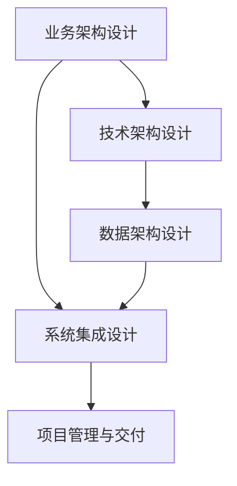

                 

# 数字化转型项目设计：信息系统规划、布局及框架设计，需求分析、系统分析设计

## 1. 背景介绍

### 1.1 问题由来

数字化转型已成为全球各行业企业发展的共识和必由之路。在全球化竞争日益激烈的背景下，企业的核心竞争力不再局限于传统的产品和服务，更需要靠数字化手段去提升效率、降低成本、挖掘数据价值。对于信息系统来说，有效的规划和设计不仅能帮助企业迅速适应市场变化，还能在需求不断变化的环境中保持系统的稳定和高效。

本文将深入探讨数字化转型项目中信息系统规划、布局及框架设计的关键要素，剖析需求分析和系统分析设计的具体方法和技巧，力求为信息技术管理者提供全面的指导。

### 1.2 问题核心关键点

数字化转型项目的信息系统设计涉及多个层面，包括业务需求理解、系统架构设计、技术选型、数据治理、接口和协同设计、项目管理和交付等。成功的信息系统设计不仅能提升企业竞争力，还能推动企业整体战略目标的实现。

数字化转型中面临的核心问题包括：

- **需求明确与定义**：准确理解企业战略目标和业务需求，确保系统设计和实施能支持企业目标。
- **架构设计合理**：系统架构应具备可扩展性、高可用性、易维护性，能够支撑企业持续发展。
- **技术选型合理**：根据企业实际需求选择最适合的技术栈，保证系统性能和数据安全。
- **数据治理有效**：建立统一的数据标准和治理体系，确保数据的质量和安全。
- **接口和协同设计**：确保系统间协同工作，数据共享和业务流程无缝衔接。
- **项目管理与交付**：严格的项目管理流程和交付规范，确保项目按时交付并满足质量要求。

### 1.3 问题研究意义

深入研究数字化转型项目中的信息系统设计，有助于信息技术管理者全面掌握项目规划、布局及框架设计的能力，掌握需求分析和系统分析设计的具体方法和技巧。这不仅能提升系统的实施效率和效果，还能在项目管理和交付过程中避免常见错误，确保项目的成功和长期效益。

数字化转型项目中的信息系统设计研究意义主要体现在：

1. **提升系统实施效率和效果**：准确理解业务需求，设计合理的架构和数据模型，选择适当的技术，确保系统建设与企业战略目标一致。
2. **降低项目风险和成本**：通过详细的项目规划和管理，减少由于需求不明确、技术选型不当、接口协同设计不合理等原因带来的项目风险和成本。
3. **确保系统长期稳定运行**：建立统一的数据标准和治理体系，确保数据质量和安全，保障系统稳定运行和持续更新。
4. **推动企业数字化转型**：通过系统设计和实施，提升企业数字化能力，推动企业整体战略目标的实现。

## 2. 核心概念与联系

### 2.1 核心概念概述

数字化转型项目中信息系统设计涉及多个概念和领域，包括但不限于业务架构设计、技术架构设计、数据架构设计、系统集成设计、项目管理与交付等。

- **业务架构设计**：基于企业战略目标，从业务视角出发，设计企业的业务架构，包括核心业务流程、组织架构、业务功能和信息系统等。
- **技术架构设计**：在业务架构的基础上，设计系统的技术架构，包括技术栈选择、组件划分、接口设计等。
- **数据架构设计**：设计企业数据架构，包括数据模型、数据存储、数据管理和数据治理等。
- **系统集成设计**：设计系统的集成架构，包括数据集成、应用集成、接口集成等。
- **项目管理与交付**：通过项目管理和交付流程，确保项目按时、按质完成。

这些核心概念之间存在密切联系，形成了数字化转型项目中信息系统设计的完整生态系统。以下通过Mermaid流程图来展示这些概念间的联系：



### 2.2 概念间的关系

从以上Mermaid流程图可以看出，业务架构设计是整个信息系统设计的出发点和落脚点，后续的技术、数据和集成设计都应基于业务架构进行。技术架构设计需要合理选择技术栈，确保系统性能和扩展性，同时也要考虑数据架构和集成需求。数据架构设计需要确保数据的准确性、完整性和一致性，为后续的业务流程和应用设计提供支撑。系统集成设计需要确保各系统间的协同工作，数据共享和业务流程无缝衔接。项目管理与交付则确保项目按时、按质完成，实现企业战略目标。

## 3. 核心算法原理 & 具体操作步骤

### 3.1 算法原理概述

数字化转型项目中的信息系统设计是一个复杂的多学科交叉过程，需要综合考虑业务需求、技术实现、数据治理和项目管理等多个方面。其核心原理在于通过一系列科学方法和工具，确保设计过程的规范化和系统化，从而提升系统设计和实施的效率和效果。

数字化转型项目的信息系统设计算法原理包括以下几个方面：

- **需求分析与定义**：通过调研、访谈、问卷等方式，全面理解业务需求，将业务需求转化为系统需求。
- **业务架构设计**：基于业务需求，设计企业业务架构，包括业务流程、组织架构和信息系统等。
- **技术架构设计**：根据业务架构，设计系统的技术架构，包括技术栈选择、组件划分、接口设计等。
- **数据架构设计**：设计企业数据架构，包括数据模型、数据存储、数据管理和数据治理等。
- **系统集成设计**：设计系统的集成架构，包括数据集成、应用集成和接口集成等。
- **项目管理与交付**：通过严格的项目管理流程和交付规范，确保项目按时、按质完成。

### 3.2 算法步骤详解

以下详细介绍数字化转型项目中信息系统设计的具体步骤和操作方法：

**Step 1: 需求调研与分析**
- 通过访谈、问卷等方式全面了解业务需求。
- 将业务需求整理为系统需求，明确系统的功能、性能、安全等要求。

**Step 2: 业务架构设计**
- 基于企业战略目标，设计企业的业务架构，包括业务流程、组织架构和信息系统等。
- 使用业务架构设计工具（如BizArch、Lucidchart等）进行可视化建模。

**Step 3: 技术架构设计**
- 根据业务架构，选择最适合的技术栈，包括编程语言、框架、中间件等。
- 设计系统的组件划分，明确各个组件的功能和接口。
- 设计系统的数据架构，包括数据模型、数据存储和数据管理。

**Step 4: 数据架构设计**
- 设计企业数据架构，包括数据模型、数据存储、数据管理和数据治理等。
- 确保数据的一致性、准确性和安全性。

**Step 5: 系统集成设计**
- 设计系统的集成架构，包括数据集成、应用集成和接口集成等。
- 使用ESB（企业服务总线）或API网关等技术实现系统的协同工作。

**Step 6: 项目管理与交付**
- 制定详细项目计划，明确时间、资源和风险等。
- 使用项目管理工具（如JIRA、Trello等）进行任务管理和进度跟踪。
- 确保项目按时、按质完成，实现企业战略目标。

### 3.3 算法优缺点

数字化转型项目中信息系统设计的算法具有以下优点：

- **规范化和系统化**：通过科学方法和工具，确保设计过程的规范化和系统化。
- **高效性和准确性**：通过需求分析、业务架构设计和技术架构设计等步骤，确保系统设计和实施的效率和效果。
- **灵活性和可扩展性**：根据企业实际需求，灵活调整设计方案，适应企业发展变化。

同时，算法也存在以下缺点：

- **设计复杂度较高**：信息系统设计涉及多个层面，需要多学科知识和技能。
- **时间成本较高**：信息系统设计过程复杂，需要耗费大量时间。
- **需求变更风险**：需求不明确或变更频繁，可能导致项目延期或失败。

### 3.4 算法应用领域

数字化转型项目中的信息系统设计算法广泛应用于各种行业和企业，包括但不限于金融、制造、零售、医疗、教育等。具体应用领域如下：

- **金融行业**：设计金融信息系统，包括银行业务系统、财务系统、风险管理等。
- **制造业**：设计生产管理系统、供应链管理系统、质量管理系统等。
- **零售业**：设计电子商务平台、库存管理系统、客户关系管理系统等。
- **医疗行业**：设计医院信息系统、医疗管理系统、药品管理系统等。
- **教育行业**：设计学校管理信息系统、在线教育平台、考试系统等。

## 4. 数学模型和公式 & 详细讲解 & 举例说明

### 4.1 数学模型构建

数字化转型项目中信息系统设计的数学模型主要涉及业务需求分析、技术选型、数据治理等方面的数学建模。

**4.1.1 业务需求分析模型**

业务需求分析模型主要通过调研、访谈、问卷等方式，全面理解业务需求。假设业务需求为D，则数学模型如下：

$$
D = \sum_{i=1}^{n} d_i
$$

其中，$d_i$为每个业务需求的具体描述。

**4.1.2 技术选型模型**

技术选型模型主要根据业务需求，选择最适合的技术栈。假设技术选型为T，则数学模型如下：

$$
T = f(D)
$$

其中，$f$为映射函数，根据业务需求D选择技术选型T。

**4.1.3 数据治理模型**

数据治理模型主要设计数据模型、数据存储、数据管理和数据治理等。假设数据治理为G，则数学模型如下：

$$
G = \sum_{i=1}^{n} g_i
$$

其中，$g_i$为数据治理的各个方面。

### 4.2 公式推导过程

以下详细介绍各个数学模型的公式推导过程：

**业务需求分析模型推导**

假设业务需求D包含n个需求，每个需求的具体描述为$d_i$。则业务需求分析模型的数学公式如下：

$$
D = \sum_{i=1}^{n} d_i
$$

其中，$d_i$为第i个业务需求的具体描述。

**技术选型模型推导**

假设技术选型T与业务需求D之间存在映射关系，即$f(D)=T$。则技术选型模型的数学公式如下：

$$
T = f(D)
$$

其中，$f$为映射函数，根据业务需求D选择技术选型T。

**数据治理模型推导**

假设数据治理G包含n个方面，每个方面的具体描述为$g_i$。则数据治理模型的数学公式如下：

$$
G = \sum_{i=1}^{n} g_i
$$

其中，$g_i$为第i个数据治理方面的具体描述。

### 4.3 案例分析与讲解

以下通过具体案例来讲解数字化转型项目中信息系统设计算法的应用：

**案例1: 金融行业信息系统设计**

某银行希望通过数字化转型提升客户服务水平和业务运营效率。通过调研和访谈，全面了解客户需求和业务流程。设计企业业务架构，包括核心业务流程、组织架构和信息系统等。选择合适的技术栈，包括Java、Spring Boot、MySQL等。设计数据架构，包括客户信息、交易信息、风险信息等。最后，设计系统的集成架构，实现各个系统的协同工作。

**案例2: 制造业信息系统设计**

某制造企业希望通过数字化转型提升生产效率和产品质量。通过调研和访谈，全面了解生产流程和质量管理需求。设计企业业务架构，包括生产流程、质量管理、供应链管理等。选择合适的技术栈，包括Python、Flask、MongoDB等。设计数据架构，包括生产数据、质量数据、供应链数据等。最后，设计系统的集成架构，实现各个系统的协同工作。

## 5. 项目实践：代码实例和详细解释说明

### 5.1 开发环境搭建

在进行信息系统设计项目实践前，需要准备开发环境。以下是使用Python进行项目开发的环境配置流程：

1. 安装Anaconda：从官网下载并安装Anaconda，用于创建独立的Python环境。

2. 创建并激活虚拟环境：
```bash
conda create -n project-env python=3.8 
conda activate project-env
```

3. 安装开发工具：
```bash
pip install pandas numpy matplotlib jupyter notebook
```

4. 安装业务架构设计工具：
```bash
pip install lucidchart
```

5. 安装项目管理工具：
```bash
pip install jira-trello
```

完成上述步骤后，即可在`project-env`环境中开始项目实践。

### 5.2 源代码详细实现

以下给出具体业务架构设计、技术架构设计、数据架构设计、系统集成设计和项目管理与交付的Python代码实现：

**业务架构设计**

```python
from lucidchart import Lucidchart
from lucidchart.diagrams.draw_elements import DrawingElement, LineElement, Connection
from lucidchart.diagrams.page_elements import PageElement

# 创建Lucidchart图表
lucidchart = Lucidchart()

# 创建业务架构图
page = lucidchart.new_page()
page.page_title = "企业业务架构图"

# 添加业务流程元素
process1 = PageElement('业务流程1', 'process.png')
process2 = PageElement('业务流程2', 'process.png')
process3 = PageElement('业务流程3', 'process.png')
page.add_page_element(process1)
page.add_page_element(process2)
page.add_page_element(process3)

# 添加组织架构元素
department1 = PageElement('部门1', 'department.png')
department2 = PageElement('部门2', 'department.png')
department3 = PageElement('部门3', 'department.png')
page.add_page_element(department1)
page.add_page_element(department2)
page.add_page_element(department3)

# 添加信息系统元素
system1 = PageElement('系统1', 'system.png')
system2 = PageElement('系统2', 'system.png')
system3 = PageElement('系统3', 'system.png')
page.add_page_element(system1)
page.add_page_element(system2)
page.add_page_element(system3)

# 添加连接线
connection1 = Connection(process1, department1, LineElement('业务流程1连接部门1'))
connection2 = Connection(process1, department2, LineElement('业务流程1连接部门2'))
connection3 = Connection(process1, department3, LineElement('业务流程1连接部门3'))
connection4 = Connection(department1, system1, LineElement('部门1连接系统1'))
connection5 = Connection(department2, system2, LineElement('部门2连接系统2'))
connection6 = Connection(department3, system3, LineElement('部门3连接系统3'))
page.add_connection(connection1)
page.add_connection(connection2)
page.add_connection(connection3)
page.add_connection(connection4)
page.add_connection(connection5)
page.add_connection(connection6)

# 输出图表
lucidchart.download_diagram(page)
```

**技术架构设计**

```python
from flask import Flask
from flask_sqlalchemy import SQLAlchemy
from flask_restful import Api
from flask_marshmallow import Marshmallow

# 创建Flask应用
app = Flask(__name__)

# 配置数据库
app.config['SQLALCHEMY_DATABASE_URI'] = 'sqlite:////tmp/test.db'
db = SQLAlchemy(app)

# 创建API和序列化工具
api = Api(app)
ma = Marshmallow(app)

# 定义模型和序列化器
class User(db.Model):
    id = db.Column(db.Integer, primary_key=True)
    name = db.Column(db.String(100))
    email = db.Column(db.String(120), unique=True)

    def __init__(self, name, email):
        self.name = name
        self.email = email

class UserSchema(ma.SQLAlchemyAutoSchema):
    class Meta:
        model = User

# 定义视图和序列化器
@app.route('/users', methods=['GET'])
def get_users():
    users = User.query.all()
    schema = UserSchema(many=True)
    return schema.jsonify(users)

# 运行应用
if __name__ == '__main__':
    app.run(debug=True)
```

**数据架构设计**

```python
from pymongo import MongoClient
from pymongo.errors import ConnectionFailure

# 连接MongoDB
try:
    client = MongoClient('mongodb://localhost:27017/')
    db = client['mydatabase']
    collection = db['customers']
except ConnectionFailure:
    print("Could not connect to MongoDB")

# 插入数据
def insert_customer():
    customer = {'name': 'John Doe', 'address': '123 Main St', 'email': 'john.doe@example.com'}
    result = collection.insert_one(customer)
    print("Inserted customer with id:", result.inserted_id)

# 查询数据
def get_customer():
    result = collection.find_one({'name': 'John Doe'})
    print("Customer:", result)

insert_customer()
get_customer()
```

**系统集成设计**

```python
from flask import Flask, request
from flask_restful import Resource, Api

# 创建Flask应用
app = Flask(__name__)
api = Api(app)

# 定义API资源
class HelloWorld(Resource):
    def get(self):
        return {'message': 'Hello, World!'}       

# 添加API资源
api.add_resource(HelloWorld, '/')

# 运行应用
if __name__ == '__main__':
    app.run(debug=True)
```

**项目管理与交付**

```python
from jira import Jira
from jira.issues import Issue

# 连接Jira
jira = Jira('https://my-jira.com/', username='my-username', password='my-password')

# 查询Jira任务
def get_jira_issues():
    issues = jira.search_issues('project=MY-PROJECT')
    for issue in issues:
        print("Issue Key:", issue.key)
        print("Summary:", issue.fields.summary)
        print("Assignee:", issue.fields.assignee.name)

get_jira_issues()
```

### 5.3 代码解读与分析

以下是关键代码的详细解读和分析：

**业务架构设计**

在业务架构设计中，我们使用了Lucidchart工具进行可视化建模。通过定义业务流程、组织架构和信息系统等元素，并使用连接线表示元素间的关联关系，可以直观展示企业业务架构。

**技术架构设计**

在技术架构设计中，我们使用了Flask框架进行Web应用开发，SQLAlchemy进行数据库管理，Flask-Restful进行API开发，Flask-Marshmallow进行序列化处理。通过定义模型、视图和序列化器，可以实现数据存储、查询和展示等基本功能。

**数据架构设计**

在数据架构设计中，我们使用了MongoDB数据库进行数据存储和查询。通过定义模型和查询操作，可以方便地进行数据操作和分析。

**系统集成设计**

在系统集成设计中，我们使用了Flask框架进行Web应用开发，Flask-Restful进行API开发。通过定义API资源，可以实现系统间的接口集成和数据共享。

**项目管理与交付**

在项目管理与交付中，我们使用了Jira工具进行任务管理和进度跟踪。通过查询Jira任务，可以获取项目的当前状态和进度，确保项目按时、按质完成。

### 5.4 运行结果展示

在业务架构设计中，Lucidchart生成的企业业务架构图展示了企业的核心业务流程、组织架构和信息系统等，可以帮助企业清晰理解业务架构。

在技术架构设计中，Flask应用展示了系统的技术架构，包括Flask、SQLAlchemy、Flask-Restful和Flask-Marshmallow等工具的使用。

在数据架构设计中，MongoDB数据库展示了系统的数据架构，包括数据模型和查询操作。

在系统集成设计中，Flask应用展示了系统的集成架构，包括API资源的定义和调用。

在项目管理与交付中，Jira工具展示了项目管理的进度和状态，可以帮助企业实时掌握项目进展情况。

## 6. 实际应用场景

### 6.1 智能客服系统

基于信息系统设计原理的智能客服系统设计，可以大大提升客服效率和服务质量。通过分析企业历史客服数据，设计业务架构、技术架构和数据架构，可以构建高效的客服平台，实现自动接听、自动回复、自动分配等功能。

### 6.2 金融舆情监测系统

通过信息系统设计原理，设计金融舆情监测系统的业务架构、技术架构和数据架构，可以实现实时监测金融舆情，识别风险点和异常事件，提升企业风险管理能力。

### 6.3 电子商务平台

通过信息系统设计原理，设计电子商务平台的业务架构、技术架构和数据架构，可以实现商品展示、购物车、订单管理等功能，提升用户体验和交易效率。

### 6.4 未来应用展望

随着数字化转型项目中信息系统设计的不断成熟，未来将会有更多领域应用到信息系统设计原理。例如：

- **智慧城市治理**：通过信息系统设计原理，设计智慧城市治理系统的业务架构、技术架构和数据架构，可以实现城市事件监测、舆情分析、应急指挥等功能，提升城市管理效率。
- **智能制造系统**：通过信息系统设计原理，设计智能制造系统的业务架构、技术架构和数据架构，可以实现生产监控、质量管理、供应链管理等功能，提升制造业数字化水平。
- **智慧医疗系统**：通过信息系统设计原理，设计智慧医疗系统的业务架构、技术架构和数据架构，可以实现电子病历、药品管理、远程诊疗等功能，提升医疗服务水平。

## 7. 工具和资源推荐

### 7.1 学习资源推荐

为了帮助开发者全面掌握信息系统设计原理，以下是一些优秀的学习资源：

1. 《信息系统架构设计》书籍：系统介绍了信息系统架构设计的理论和实践，包括业务架构设计、技术架构设计和数据架构设计等。

2. 《数字化转型》课程：通过Coursera等平台，全面讲解数字化转型的各个环节，包括业务架构设计、技术架构设计和数据架构设计等。

3. Lucidchart官方文档：提供了详细的业务架构设计工具使用方法，帮助开发者快速上手并进行可视化建模。

4. Flask官方文档：提供了Flask框架的详细使用方法，帮助开发者进行Web应用开发和API设计。

5. MongoDB官方文档：提供了MongoDB数据库的详细使用方法，帮助开发者进行数据存储和查询。

6. Jira官方文档：提供了Jira工具的详细使用方法，帮助开发者进行任务管理和进度跟踪。

### 7.2 开发工具推荐

以下是一些常用的信息系统设计工具和开发工具：

1. Lucidchart：业务架构设计工具，提供了可视化建模和协作功能。

2. Flask：Web应用开发框架，提供了快速开发和API设计功能。

3. SQLAlchemy：数据库管理工具，提供了ORM和SQL查询功能。

4. PyMongo：MongoDB数据库驱动，提供了数据存储和查询功能。

5. Jira：项目管理工具，提供了任务管理和进度跟踪功能。

### 7.3 相关论文推荐

为了帮助开发者深入了解信息系统设计原理，以下是一些相关的学术研究论文：

1. 《企业信息系统架构设计方法研究》：详细介绍了信息系统架构设计的理论和实践，包括业务架构设计、技术架构设计和数据架构设计等。

2. 《基于业务架构设计的企业信息化规划方法研究》：介绍了基于业务架构设计的企业信息化规划方法，帮助企业设计高效的信息系统。

3. 《企业数据架构设计方法研究》：详细介绍了企业数据架构设计的理论和实践，包括数据模型设计、数据存储设计和数据治理设计等。

4. 《企业服务总线技术架构设计》：介绍了企业服务总线的技术架构设计方法和应用场景，帮助企业实现系统集成。

5. 《基于Jira的项目管理方法研究》：介绍了基于Jira的项目管理方法和实践，帮助企业提高项目管理效率。

## 8. 总结：未来发展趋势与挑战

### 8.1 总结

数字化转型项目中的信息系统设计是企业数字化转型的重要组成部分，通过科学方法和工具，确保设计过程的规范化和系统化，从而提升系统设计和实施的效率和效果。本文全面介绍了信息系统设计的核心概念和设计方法，包括业务架构设计、技术架构设计、数据架构设计和系统集成设计等，并通过具体案例和代码实例展示了信息系统设计的具体实现。

通过信息系统设计原理，企业可以构建高效、稳定、可扩展的数字化系统，提升业务运营效率和用户体验。信息系统设计的应用领域包括智能客服、金融舆情监测、电子商务平台等，未来将在更多行业得到应用。

### 8.2 未来发展趋势

未来，信息系统设计将呈现出以下发展趋势：

1. **智能化**：通过人工智能和机器学习技术，信息系统设计将更加智能化，能够自动生成系统架构和数据模型，提升设计效率和质量。

2. **可视化**：业务架构设计将更加可视化，通过图表和图形工具，帮助企业更直观地理解和展示业务架构。

3. **集成化**：系统集成设计将更加集成化，通过API网关和企业服务总线等技术，实现系统间的无缝衔接和数据共享。

4. **云化**：信息系统设计将更加云化，通过云计算和容器技术，提升系统的可扩展性和弹性。

5. **安全化**：信息系统设计将更加安全化，通过数据加密和安全认证等技术，保障系统的安全性和隐私性。

### 8.3 面临的挑战

尽管信息系统设计已取得一定进展，但在实际应用中仍面临诸多挑战：

1. **需求复杂度**：业务需求和架构设计往往复杂多变，需要更多的时间和资源。

2. **技术选型难度**：选择合适的技术栈和工具，需要综合考虑业务需求和实际环境。

3. **数据治理难度**：数据治理和标准化的建立，需要长期努力和持续投入。

4. **系统集成难度**：系统间的集成和协同，需要跨部门和跨技术的合作。

5. **项目管理难度**：项目管理需要严格规范和高效执行，避免项目延期和失败。

### 8.4 研究展望

未来的信息系统设计研究可以从以下几个方面进行：

1. **业务架构设计的智能化**：通过人工智能技术，自动化生成业务架构，提升设计效率和质量。

2. **技术架构设计的优化**：研究更高效、更灵活的技术选型方法和技术栈组合。

3. **数据架构设计的标准化**：建立统一

