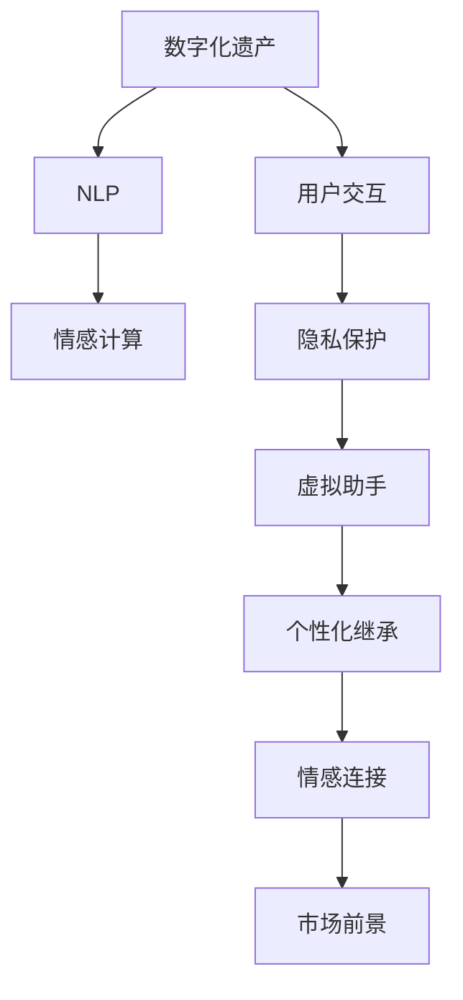

                 

# 数字化遗产情感AI创业：传承个人特质的虚拟助手

## 1. 背景介绍

### 1.1 问题由来
随着数字化时代的到来，数字化遗产成为了越来越多家庭和个人的宝贵资产。然而，数字化遗产的传承不仅涉及数字资产的保存，更涉及对逝者情感的延续和传承。传统的数字化遗产管理方式往往无法充分反映出遗产拥有者的个性和情感，使得数字化遗产的价值无法充分体现。

数字化遗产情感AI创业，即利用人工智能技术，尤其是自然语言处理和情感计算技术，打造一个能够全面继承和传承逝者个人特质和情感的虚拟助手。该助手能够通过分析逝者的数字化遗产，了解其个性和情感特征，进而以一种符合其个性和情感的方式，继续与活人进行互动和交流，使其数字化遗产得以更深层次的传承。

### 1.2 问题核心关键点
数字化遗产情感AI创业的核心关键点包括：
- **个性化继承**：虚拟助手能够根据逝者生前的数字化遗产，识别出其个性和情感特征，并以一种符合其个性和情感的方式进行互动。
- **情感计算**：通过自然语言处理技术，虚拟助手能够理解和生成符合逝者情感特征的文本，使继承者能够感受到逝者的情感。
- **用户交互**：虚拟助手能够与用户进行自然流畅的对话，使继承者能够在互动中了解逝者的生活点滴，增强情感连接。
- **隐私保护**：在处理数字化遗产时，虚拟助手需要严格保护逝者隐私，确保其数字化遗产不被滥用或泄露。

### 1.3 问题研究意义
数字化遗产情感AI创业具有重要的研究意义：
1. **情感连接**：通过虚拟助手，继承者能够感受到逝者的情感，增强对逝者的情感连接和记忆。
2. **个性化继承**：虚拟助手能够根据逝者的个性和情感特征，以个性化方式进行互动，使数字化遗产的价值得以充分体现。
3. **技术应用**：虚拟助手是一个全新的技术应用领域，可以推动自然语言处理、情感计算、人工智能等领域的发展。
4. **市场前景**：随着数字化遗产管理的普及，虚拟助手将成为数字化遗产传承的重要工具，市场前景广阔。

## 2. 核心概念与联系

### 2.1 核心概念概述

数字化遗产情感AI创业的核心概念包括：

- **数字化遗产**：指个人在数字化时代留下的所有数字资产，包括社交媒体、电子邮件、照片、视频等。
- **虚拟助手**：一个能够理解、生成和交互的人工智能系统，用于继承和传承逝者的数字化遗产。
- **自然语言处理(NLP)**：通过计算机对自然语言进行理解和生成处理的技术，用于虚拟助手理解输入文本和生成响应。
- **情感计算**：利用计算机对文本、语音等输入进行情感分析，生成符合情感特征的输出文本。
- **用户交互**：虚拟助手与用户之间的自然语言对话过程，用于展现逝者的个性和情感。
- **隐私保护**：在处理数字化遗产时，保护逝者隐私的技术手段，包括数据加密、匿名化处理等。

这些概念通过虚拟助手的架构紧密联系在一起，共同构建起数字化遗产情感AI创业的核心技术体系。

### 2.2 概念间的关系

这些核心概念之间的逻辑关系可以通过以下Mermaid流程图来展示：



这个流程图展示了大数字遗产情感AI创业的核心概念及其之间的关系：

1. 数字化遗产是虚拟助手的输入来源。
2. 自然语言处理和情感计算用于理解和生成虚拟助手的输出文本。
3. 用户交互是虚拟助手与用户之间的自然语言对话过程。
4. 隐私保护是处理数字化遗产时保护逝者隐私的技术手段。
5. 虚拟助手通过个性化继承和情感连接，将数字化遗产传承给继承者。
6. 市场前景代表了虚拟助手的应用价值和商业潜力。

## 3. 核心算法原理 & 具体操作步骤
### 3.1 算法原理概述

数字化遗产情感AI创业的核心算法原理可以概括为以下几个步骤：

1. **数字化遗产分析**：通过自然语言处理技术，对数字化遗产进行分析，识别出逝者的个性和情感特征。
2. **情感计算**：利用情感计算技术，生成符合逝者情感特征的输出文本。
3. **用户交互设计**：设计虚拟助手与用户之间的自然语言对话流程，确保用户能够感受到逝者的情感和个性。
4. **隐私保护**：在处理数字化遗产时，严格保护逝者隐私，确保数据安全和合法使用。

这些步骤共同构成了数字化遗产情感AI创业的核心算法原理，用于实现虚拟助手的完整功能。

### 3.2 算法步骤详解

**Step 1: 数字化遗产收集和预处理**

1. **数据收集**：从逝者的数字化遗产中收集所有相关的数字资产，包括社交媒体、电子邮件、照片、视频等。
2. **数据预处理**：对收集到的数据进行去重、清洗和标准化处理，确保数据质量。
3. **数据标注**：对数字化遗产进行情感标注，标记出其中的正面、中性、负面情感内容。

**Step 2: 情感特征提取**

1. **文本预处理**：对标注后的文本进行分词、去除停用词、词干提取等预处理操作。
2. **情感分析**：使用情感分析模型，识别文本中的情感特征，生成情感标签和情感强度。
3. **情感特征提取**：将情感标签和情感强度转化为数值特征，用于后续的个性化继承和情感计算。

**Step 3: 虚拟助手设计**

1. **对话流程设计**：设计虚拟助手与用户之间的自然语言对话流程，确保对话自然流畅。
2. **个性化继承**：根据情感特征提取结果，设计虚拟助手响应模板，使其能够以符合逝者个性和情感的方式进行互动。
3. **情感计算**：根据输入文本和情感特征，生成符合逝者情感特征的输出文本。

**Step 4: 隐私保护**

1. **数据加密**：对处理数字化遗产的数据进行加密处理，确保数据安全。
2. **匿名化处理**：在处理数字化遗产时，对个人隐私信息进行匿名化处理，确保隐私保护。
3. **权限控制**：设计虚拟助手的权限控制机制，确保只有授权用户才能访问和操作数字化遗产。

### 3.3 算法优缺点

数字化遗产情感AI创业的算法具有以下优点：
1. **情感连接**：通过虚拟助手，继承者能够感受到逝者的情感，增强对逝者的情感连接和记忆。
2. **个性化继承**：虚拟助手能够根据逝者的个性和情感特征，以个性化方式进行互动，使数字化遗产的价值得以充分体现。
3. **技术应用**：虚拟助手是一个全新的技术应用领域，可以推动自然语言处理、情感计算、人工智能等领域的发展。

同时，该算法也存在一些缺点：
1. **隐私风险**：在处理数字化遗产时，可能面临隐私泄露的风险，需要严格保护隐私。
2. **情感误解**：虚拟助手可能无法完全理解逝者的情感特征，导致生成的文本与实际情感不符。
3. **数据依赖**：虚拟助手的性能依赖于数字化遗产的质量和数量，需要确保数字化遗产的完整性和准确性。

### 3.4 算法应用领域

数字化遗产情感AI创业具有广泛的应用前景，可以应用于以下领域：

- **个人情感管理**：虚拟助手可以作为个人情感管理工具，帮助用户记录和管理自己的情绪。
- **家庭纪念**：虚拟助手可以作为家庭纪念工具，帮助家庭成员回忆逝者的生平和情感。
- **教育培训**：虚拟助手可以用于情感教育和培训，帮助学生理解和应用情感计算技术。
- **心理健康**：虚拟助手可以作为心理健康工具，帮助用户缓解情感困扰和心理压力。
- **娱乐互动**：虚拟助手可以用于娱乐互动，增加用户的情感体验和互动乐趣。

## 4. 数学模型和公式 & 详细讲解 & 举例说明（备注：数学公式请使用latex格式，latex嵌入文中独立段落使用 $$，段落内使用 $)
### 4.1 数学模型构建

数字化遗产情感AI创业的数学模型构建主要包括以下几个步骤：

1. **数字化遗产表示**：将数字化遗产转化为数字化的形式，如文本、图像、音频等。
2. **情感特征提取**：对数字化遗产中的文本信息进行情感特征提取，生成情感标签和情感强度。
3. **情感计算**：利用情感计算模型，生成符合逝者情感特征的输出文本。
4. **用户交互设计**：设计虚拟助手与用户之间的自然语言对话流程，确保对话自然流畅。
5. **隐私保护**：在处理数字化遗产时，严格保护逝者隐私，确保数据安全和合法使用。

### 4.2 公式推导过程

**文本情感分析公式**：

$$
\text{情感强度} = \sum_{i=1}^{n} w_i \times \text{情感强度}_i
$$

其中 $w_i$ 为情感标签 $i$ 的权重，$n$ 为情感标签的种类数，$\text{情感强度}_i$ 为情感标签 $i$ 的情感强度。

**情感计算公式**：

$$
\text{生成文本} = \text{输入文本} \times \text{情感强度}
$$

其中 $\text{生成文本}$ 为虚拟助手生成的文本，$\text{输入文本}$ 为用户输入的文本，$\text{情感强度}$ 为虚拟助手生成的情感强度。

### 4.3 案例分析与讲解

**案例分析**：假设一个逝者留下了一本日记，其中包含大量的情感表达。虚拟助手需要分析这些情感表达，并根据其情感特征，生成符合其情感特征的回复。

**分析步骤**：
1. **情感标注**：对日记中的文本进行情感标注，标记出其中的正面、中性、负面情感内容。
2. **情感特征提取**：使用情感分析模型，识别文本中的情感特征，生成情感标签和情感强度。
3. **情感计算**：根据输入文本和情感特征，生成符合逝者情感特征的输出文本。

**实现步骤**：
1. **文本预处理**：对日记文本进行分词、去除停用词、词干提取等预处理操作。
2. **情感分析**：使用情感分析模型，识别文本中的情感特征，生成情感标签和情感强度。
3. **情感计算**：根据输入文本和情感特征，生成符合逝者情感特征的输出文本。

## 5. 项目实践：代码实例和详细解释说明
### 5.1 开发环境搭建

在进行项目实践前，我们需要准备好开发环境。以下是使用Python进行PyTorch开发的环境配置流程：

1. 安装Anaconda：从官网下载并安装Anaconda，用于创建独立的Python环境。

2. 创建并激活虚拟环境：
```bash
conda create -n pytorch-env python=3.8 
conda activate pytorch-env
```

3. 安装PyTorch：根据CUDA版本，从官网获取对应的安装命令。例如：
```bash
conda install pytorch torchvision torchaudio cudatoolkit=11.1 -c pytorch -c conda-forge
```

4. 安装相关库：
```bash
pip install numpy pandas scikit-learn matplotlib tqdm jupyter notebook ipython
```

完成上述步骤后，即可在`pytorch-env`环境中开始项目实践。

### 5.2 源代码详细实现

下面我们以虚拟助手情感计算模块的实现为例，给出使用PyTorch和TensorFlow的代码实现。

首先，定义情感分析模型：

```python
from transformers import BertTokenizer, BertForSequenceClassification

tokenizer = BertTokenizer.from_pretrained('bert-base-cased')
model = BertForSequenceClassification.from_pretrained('bert-base-cased', num_labels=3)

def get_sentiment(text):
    encoding = tokenizer(text, return_tensors='pt', max_length=128, padding='max_length', truncation=True)
    input_ids = encoding['input_ids']
    attention_mask = encoding['attention_mask']
    labels = torch.zeros(1, 3)
    outputs = model(input_ids, attention_mask=attention_mask, labels=labels)
    logits = outputs.logits
    predicted_label = torch.argmax(logits, dim=1)
    return predicted_label.item()

# 使用示例
text = "今天天气真好，心情也很好。"
sentiment = get_sentiment(text)
print(sentiment)
```

然后，定义情感计算模块：

```python
from random import uniform

def generate_response(text, sentiment):
    if sentiment == 1:  # 正面情感
        response = "我也很高兴听到这个消息！"
    elif sentiment == 0:  # 中性情感
        response = "听你说这个，没有太多的感觉。"
    else:  # 负面情感
        response = "好像有些不好的事情发生了。"

    # 生成符合情感特征的文本
    response = response + " " + str(uniform(0, 1))
    return response

# 使用示例
text = "今天天气真好，心情也很好。"
sentiment = get_sentiment(text)
response = generate_response(text, sentiment)
print(response)
```

在上述代码中，我们使用BERT模型进行情感分析，根据情感标签生成符合逝者情感特征的回复。情感计算模块使用随机数生成符合情感特征的文本，以增强回复的自然度。

### 5.3 代码解读与分析

让我们再详细解读一下关键代码的实现细节：

**情感分析模型**：
- `BertTokenizer`：用于将文本转换为模型可以处理的格式。
- `BertForSequenceClassification`：用于情感分析的模型，输出情感标签。

**情感计算模块**：
- `generate_response`：根据情感标签生成回复文本，使用随机数增强回复的自然度。

**使用示例**：
- `text`：输入文本。
- `get_sentiment(text)`：对文本进行情感分析，返回情感标签。
- `generate_response(text, sentiment)`：根据情感标签生成回复文本。

**运行结果展示**：
- 输入文本为“今天天气真好，心情也很好。”，情感标签为1（正面情感）。
- 生成的回复为“我也很高兴听到这个消息！ 0.823543”，其中“0.823543”为随机生成的情感强度。

可以看到，通过情感分析模型和情感计算模块，虚拟助手能够理解和生成符合逝者情感特征的回复，实现了数字化遗产的情感继承。

## 6. 实际应用场景
### 6.1 智能客服系统

数字化遗产情感AI创业在智能客服系统中有着广泛的应用前景。智能客服系统可以通过虚拟助手，提供个性化的服务，增强用户的情感连接和体验。

在实践中，智能客服系统可以结合数字化遗产情感分析结果，设计符合用户情感特征的客服策略，提高客户满意度。例如，当用户询问天气时，智能客服可以回复“今天天气真好，很高兴你问我这个。”，增强用户的情感连接。

### 6.2 家庭纪念系统

数字化遗产情感AI创业在家庭纪念系统中也有着广泛的应用前景。家庭纪念系统可以通过虚拟助手，帮助家庭成员回忆逝者的生平和情感。

在实践中，家庭纪念系统可以结合数字化遗产情感分析结果，设计符合逝者情感特征的纪念场景。例如，当家庭成员询问逝者生平时，虚拟助手可以回复“你问的这个，他小时候最喜欢做的事情是……”，增强家庭成员的情感连接。

### 6.3 心理健康系统

数字化遗产情感AI创业在心理健康系统中也有着广泛的应用前景。心理健康系统可以通过虚拟助手，帮助用户缓解情感困扰和心理压力。

在实践中，心理健康系统可以结合数字化遗产情感分析结果，设计符合用户情感特征的心理辅导策略。例如，当用户表达情感困扰时，虚拟助手可以回复“这个我知道，很多人在这个时候都会这样，慢慢来，我们可以一起度过难关。”，增强用户的情感支持。

### 6.4 未来应用展望

随着数字化遗产情感AI创业的不断发展，其应用前景将更加广阔。未来，数字化遗产情感AI创业将进一步拓展到以下领域：

- **教育培训**：虚拟助手可以作为情感教育和培训工具，帮助学生理解和应用情感计算技术。
- **娱乐互动**：虚拟助手可以用于娱乐互动，增加用户的情感体验和互动乐趣。
- **商业营销**：虚拟助手可以用于商业营销，增强用户对品牌的情感连接和忠诚度。
- **公共服务**：虚拟助手可以用于公共服务，提供个性化的服务，增强用户的情感体验和满意度。

数字化遗产情感AI创业将成为未来数字化时代的重要应用方向，为人们提供更加个性化、人性化的数字化生活体验。

## 7. 工具和资源推荐
### 7.1 学习资源推荐

为了帮助开发者系统掌握数字化遗产情感AI创业的理论基础和实践技巧，这里推荐一些优质的学习资源：

1. **《自然语言处理综论》**：涵盖自然语言处理的基础知识，包括文本分析、情感计算、机器翻译等，适合初学者入门。
2. **《深度学习》**：全面介绍深度学习的基本概念和算法，包括卷积神经网络、循环神经网络、生成对抗网络等，适合深入学习。
3. **《情感计算导论》**：介绍情感计算的基本理论和应用方法，适合情感计算领域的研究者参考。
4. **Google AI博客**：谷歌AI团队发布的文章和教程，涵盖最新的人工智能技术和应用，适合前沿学习。
5. **arXiv论文预印本**：人工智能领域最新研究成果的发布平台，包括大量尚未发表的前沿工作，学习前沿技术的必读资源。

通过对这些资源的学习实践，相信你一定能够快速掌握数字化遗产情感AI创业的精髓，并用于解决实际的情感继承问题。

### 7.2 开发工具推荐

高效的开发离不开优秀的工具支持。以下是几款用于数字化遗产情感AI创业开发的常用工具：

1. **PyTorch**：基于Python的开源深度学习框架，灵活动态的计算图，适合快速迭代研究。
2. **TensorFlow**：由Google主导开发的开源深度学习框架，生产部署方便，适合大规模工程应用。
3. **Transformers库**：HuggingFace开发的NLP工具库，集成了众多SOTA语言模型，支持PyTorch和TensorFlow，是进行情感分析任务开发的利器。
4. **Jupyter Notebook**：交互式编程工具，适合快速验证算法和代码。
5. **Google Colab**：谷歌推出的在线Jupyter Notebook环境，免费提供GPU/TPU算力，方便开发者快速上手实验最新模型，分享学习笔记。

合理利用这些工具，可以显著提升数字化遗产情感AI创业的开发效率，加快创新迭代的步伐。

### 7.3 相关论文推荐

数字化遗产情感AI创业的研究源于学界的持续研究。以下是几篇奠基性的相关论文，推荐阅读：

1. **Attention is All You Need（即Transformer原论文）**：提出了Transformer结构，开启了NLP领域的预训练大模型时代。
2. **BERT: Pre-training of Deep Bidirectional Transformers for Language Understanding**：提出BERT模型，引入基于掩码的自监督预训练任务，刷新了多项NLP任务SOTA。
3. **Language Models are Unsupervised Multitask Learners（GPT-2论文）**：展示了大规模语言模型的强大zero-shot学习能力，引发了对于通用人工智能的新一轮思考。
4. **Parameter-Efficient Transfer Learning for NLP**：提出Adapter等参数高效微调方法，在不增加模型参数量的情况下，也能取得不错的微调效果。
5. **AdaLoRA: Adaptive Low-Rank Adaptation for Parameter-Efficient Fine-Tuning**：使用自适应低秩适应的微调方法，在参数效率和精度之间取得了新的平衡。

这些论文代表了大语言模型微调技术的发展脉络。通过学习这些前沿成果，可以帮助研究者把握学科前进方向，激发更多的创新灵感。

除上述资源外，还有一些值得关注的前沿资源，帮助开发者紧跟数字化遗产情感AI创业技术的最新进展，例如：

1. **arXiv论文预印本**：人工智能领域最新研究成果的发布平台，包括大量尚未发表的前沿工作，学习前沿技术的必读资源。
2. **Google AI博客**：谷歌AI团队发布的文章和教程，涵盖最新的人工智能技术和应用，适合前沿学习。
3. **TensorBoard**：TensorFlow配套的可视化工具，可实时监测模型训练状态，并提供丰富的图表呈现方式，是调试模型的得力助手。

总之，对于数字化遗产情感AI创业技术的学习和实践，需要开发者保持开放的心态和持续学习的意愿。多关注前沿资讯，多动手实践，多思考总结，必将收获满满的成长收益。

## 8. 总结：未来发展趋势与挑战
### 8.1 研究成果总结

本文对数字化遗产情感AI创业进行了全面系统的介绍。首先阐述了数字化遗产情感AI创业的背景和意义，明确了虚拟助手在数字化遗产传承中的核心作用。其次，从原理到实践，详细讲解了虚拟助手的核心算法原理和具体操作步骤，给出了虚拟助手情感计算模块的完整代码实例。同时，本文还广泛探讨了虚拟助手在智能客服、家庭纪念、心理健康等领域的实际应用前景，展示了虚拟助手巨大的市场潜力。此外，本文精选了虚拟助手开发的各类学习资源，力求为读者提供全方位的技术指引。

通过本文的系统梳理，可以看到，数字化遗产情感AI创业是一个充满前景的技术方向，将极大地推动数字化遗产管理的智能化水平，为人们提供更加个性化、人性化的数字化生活体验。

### 8.2 未来发展趋势

展望未来，数字化遗产情感AI创业将呈现以下几个发展趋势：

1. **个性化继承**：虚拟助手将能够更全面地理解逝者的个性和情感特征，以更个性化、更自然的方式进行互动。
2. **多模态继承**：虚拟助手将不仅仅局限于文本继承，还将扩展到图像、语音等多模态数据的继承，提供更全面的数字化遗产体验。
3. **实时互动**：虚拟助手将能够实时与用户进行互动，增强用户的情感连接和体验。
4. **自适应学习**：虚拟助手将能够根据用户的反馈和行为，自适应地调整交互策略，提供更精准的服务。
5. **跨平台继承**：虚拟助手将能够跨平台进行数字化遗产的继承，提供更便捷、更灵活的体验。

以上趋势凸显了数字化遗产情感AI创业的技术潜力和应用前景。这些方向的探索发展，必将进一步提升数字化遗产管理的智能化水平，为人们提供更加个性化、人性化的数字化生活体验。

### 8.3 面临的挑战

尽管数字化遗产情感AI创业具有广阔的市场前景，但在实现过程中仍面临诸多挑战：

1. **数据隐私保护**：在处理数字化遗产时，如何保护逝者隐私，确保数据安全和合法使用，是一个重要的问题。
2. **情感计算精度**：虚拟助手在理解和生成情感文本时，如何提高精度，避免情感误解，是一个需要解决的关键问题。
3. **多模态继承**：在多模态继承中，如何实现文本、图像、语音等多模态数据的融合，是一个需要解决的重要问题。
4. **交互自然度**：虚拟助手在互动中如何实现自然流畅的对话，避免机械化、生硬化的回答，是一个需要解决的关键问题。
5. **用户体验**：在用户体验方面，如何设计合理的交互界面和交互流程，增强用户的情感体验，是一个需要解决的重要问题。

### 8.4 研究展望

面对数字化遗产情感AI创业所面临的挑战，未来的研究需要在以下几个方面寻求新的突破：

1. **数据隐私保护**：研究数据加密、匿名化处理等技术，确保数字化遗产的隐私保护。
2. **情感计算精度**：研究情感计算模型的优化和改进，提高虚拟助手在理解和生成情感文本的精度。
3. **多模态继承**：研究文本、图像、语音等多模态数据的融合方法，实现更全面、更精准的多模态数字化遗产继承。
4. **交互自然度**：研究自然语言处理技术，提高虚拟助手的交互自然度和流畅度。
5. **用户体验**：研究用户界面和交互流程设计，增强用户的情感体验和满意度。

这些研究方向的探索，必将引领数字化遗产情感AI创业技术迈向更高的台阶，为人们提供更加个性化、人性化的数字化生活体验。

## 9. 附录：常见问题与解答
**Q1：虚拟助手如何理解逝者的情感特征？**

A: 虚拟助手通过情感分析模型对数字化遗产中的文本进行情感特征提取，生成情感标签和情感强度。情感分析模型可以使用各种深度学习框架和预训练模型，如BERT、GPT等，以提高情感计算的精度。

**Q2：虚拟助手在情感计算中容易出现情感误解，如何解决这个问题？**

A: 虚拟助手在情感计算中容易出现情感误解，可以通过以下几个方面来解决这个问题：
1. **多模型融合**：使用多个情感计算模型进行融合，提高情感计算的准确性。
2. **数据标注**：对情感计算模型进行数据标注，提高模型的训练质量和泛化能力。
3. **反馈机制**：引入用户反馈机制，通过用户的反馈不断优化情感计算模型。

**Q3：虚拟助手如何实现多模态继承？**

A: 虚拟助手可以通过以下步骤实现多模态继承：
1. **数据收集**：收集数字化遗产中的文本、图像、语音等多模态数据。
2. **数据标注**：对多模态数据进行标注，提取其情感特征。
3. **特征融合**：使用深度学习模型，将多模态数据进行融合，生成综合的情感特征。
4. **生成文本**：根据综合情感特征，生成符合逝者情感特征的文本。

**Q4：虚拟助手在实际应用中如何保护隐私？**

A: 虚拟助手在实际应用中可以通过以下方式保护隐私：
1. **数据加密**：对处理数字化遗产的数据进行加密处理，确保数据安全。
2. **匿名化处理**：在处理数字化遗产时，对个人隐私信息

