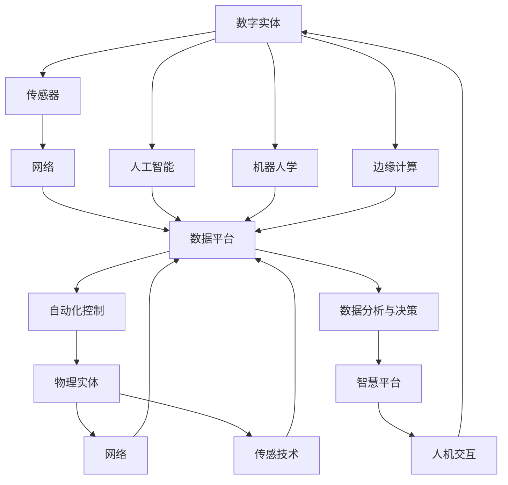

                 

# 数字实体与物理实体的自动化进展

## 1. 背景介绍

在当今数字化时代，数字实体（Digital Entities）与物理实体（Physical Entities）之间的自动化联系日益紧密。这种联系不仅改变着传统行业，也重塑着我们的工作和生活方式。从智能家居到智能制造，从自动驾驶到智慧城市，实体自动化的浪潮正席卷全球。本系列文章旨在探讨数字实体与物理实体自动化的进展，分析其核心概念、关键技术和应用场景，并展望未来的发展趋势与挑战。

## 2. 核心概念与联系

### 2.1 核心概念概述

- **数字实体**：通过传感器、网络、软件等技术，能够在数字世界中存在和交互的数据和信息。例如，物联网设备、虚拟助手、数字化文档等。

- **物理实体**：现实世界中具有物理形态的物品和系统。例如，家用电器、工业机器、物理环境等。

- **实体自动化**：利用人工智能和自动化技术，实现数字实体与物理实体的无缝融合和智能互动。例如，智能家居系统通过数字平台控制家电设备，工业自动化系统通过机器学习优化生产流程。

- **物联网（IoT）**：连接物理实体的网络技术，使物理设备能够互相通信和互动。例如，智能家居设备通过WiFi和互联网实现远程控制。

- **人工智能（AI）**：使机器能够模拟人类智能行为的技术，包括机器学习、自然语言处理、计算机视觉等。

- **机器人学**：涉及机器人设计、制造和操作的学科，是实体自动化中不可或缺的一环。

- **边缘计算**：将数据处理和决策能力移至物理设备本地，提高响应速度和数据隐私。

### 2.2 核心概念的联系

数字实体与物理实体之间的自动化联系，通过一系列关键技术实现。以下是一些核心的联系：

- **传感技术**：数字实体通过传感器收集物理实体的数据，实现物理世界的数字化。例如，智能家居通过传感器监测室内环境，将数据上传至中央控制平台。

- **网络技术**：物理实体通过网络连接数字平台，实现远程控制和数据交互。例如，工业设备通过工业互联网连接云端系统，接收控制指令和数据反馈。

- **自动化控制**：数字平台利用AI和机器人技术，自动控制物理实体执行特定任务。例如，智能仓储系统通过机器学习优化库存管理，机器人自动执行货物分拣和搬运。

- **数据分析与决策**：数字实体通过数据处理和分析，提供决策支持。例如，智慧城市通过大数据分析优化交通流量，提高城市运行效率。

- **人机交互**：通过语音识别、自然语言处理等技术，实现人与数字实体和物理实体的自然交互。例如，智能助手通过语音命令控制智能家居设备，用户无需动手即可实现操作。

这些关键技术相互作用，形成了数字实体与物理实体的自动化体系，使实体之间的互动更加智能和高效。

### 2.3 核心概念的整体架构

数字实体与物理实体自动化的整体架构如下：



从架构图中可以看出，数字实体通过传感技术和网络技术获取物理实体的数据，并在数据平台上进行人工智能和边缘计算处理。处理后的信息通过自动化控制技术作用于物理实体，最终实现数字实体与物理实体的智能互动。数据分析与决策提供决策支持，人机交互实现自然交互。

## 3. 核心算法原理 & 具体操作步骤

### 3.1 算法原理概述

数字实体与物理实体的自动化，通常涉及以下算法和步骤：

1. **数据采集与处理**：通过传感器和网络技术，收集物理实体的数据，并在数据平台上进行预处理和清洗。

2. **特征提取与建模**：利用机器学习和自然语言处理技术，提取数据特征，建立实体模型。例如，通过图像识别技术提取物理设备的特征，利用时间序列分析建立预测模型。

3. **决策与控制**：利用优化算法和控制理论，进行实体决策和控制。例如，使用强化学习优化机器人路径规划，通过PID控制算法调整系统参数。

4. **实时反馈与调整**：利用实时数据和监控系统，实现实体的动态调整和优化。例如，通过实时监控城市交通流量，动态调整信号灯时长。

### 3.2 算法步骤详解

以下是一个典型的数字实体与物理实体自动化场景的具体操作步骤：

**Step 1: 数据采集与处理**

- 配置传感器网络，例如温度传感器、湿度传感器、压力传感器等，采集物理实体的实时数据。
- 使用边缘计算技术，对数据进行预处理和清洗，例如去除噪声、归一化数据等。
- 将处理后的数据上传到云端数据平台，供后续分析和决策使用。

**Step 2: 特征提取与建模**

- 利用机器学习算法（如随机森林、SVM、神经网络等），提取数据中的关键特征。例如，通过图像识别技术提取设备外观和状态特征。
- 构建实体模型，例如利用深度学习模型（如CNN、RNN等）建立预测模型，预测物理实体的未来行为。
- 进行模型训练和验证，确保模型的准确性和泛化能力。

**Step 3: 决策与控制**

- 利用优化算法（如遗传算法、粒子群算法等），进行实体决策。例如，通过优化算法优化机器人路径规划。
- 使用控制理论（如PID控制、模型预测控制等），控制物理实体的行为。例如，通过PID控制算法调整机器人速度和方向。
- 实时监控实体状态，根据反馈进行动态调整。例如，根据环境变化动态调整机器人行为。

**Step 4: 实时反馈与调整**

- 利用实时数据监控系统，收集实体运行状态和环境数据。例如，通过传感器实时监测设备状态。
- 分析实时数据，及时发现异常情况并进行调整。例如，发现设备异常时，及时发出警报并进行维护。
- 根据用户需求和环境变化，动态调整实体行为。例如，根据用户指令动态调整智能家居设备。

### 3.3 算法优缺点

数字实体与物理实体自动化具有以下优点：

- **效率提升**：通过自动化控制和优化算法，实现物理实体的高效运行，减少人力成本和时间消耗。
- **精确控制**：利用数据分析和决策技术，实现实体行为的高度精确控制。
- **实时响应**：通过实时数据监控和反馈系统，实现实体的动态调整和优化。

然而，也存在一些缺点：

- **技术复杂性**：需要集成多种技术和算法，技术实现较为复杂。
- **数据依赖性**：数据采集和处理是关键步骤，需要高质量的数据支持。
- **安全性和隐私问题**：数据平台和网络通信可能存在安全漏洞和隐私风险。

### 3.4 算法应用领域

数字实体与物理实体自动化的应用领域非常广泛，涵盖了各个行业：

- **智能家居**：通过物联网技术，实现家庭设备的智能化控制和管理。
- **智能制造**：利用工业互联网和自动化控制技术，实现生产流程的智能化优化。
- **智慧城市**：通过大数据分析和实时监控，优化城市交通、环境、安防等系统。
- **智能物流**：利用物联网和机器人技术，实现物流系统的自动化和高效化。
- **智能医疗**：通过医疗设备和数据分析，实现疾病的早期诊断和治疗。

## 4. 数学模型和公式 & 详细讲解

### 4.1 数学模型构建

以智能家居系统的数据采集和处理为例，构建数学模型：

- 假设智能家居系统中有多个设备，例如温度传感器、湿度传感器、照明设备等。
- 每个设备都有一个唯一的ID，用于标识。
- 每个设备的传感器数据和状态信息以向量形式表示，例如温度传感器数据为 \(x_t = (T_1, T_2, ..., T_n)\)，其中 \(T_i\) 表示第 \(i\) 个时间点的温度值。
- 定义数据平台上的数据集 \(D = \{(x_i, y_i)\}_{i=1}^N\)，其中 \(x_i\) 表示传感器数据，\(y_i\) 表示设备状态。

### 4.2 公式推导过程

假设有一个智能家居设备 \(i\)，其传感器数据 \(x_i\) 和状态信息 \(y_i\) 的关系可以表示为：

$$
y_i = f(x_i) + \epsilon_i
$$

其中 \(f(x_i)\) 为传感器数据的线性函数，\(\epsilon_i\) 为随机误差项。

通过最小二乘法，可以估计函数 \(f(x_i)\) 的系数 \(\theta\)：

$$
\theta = \mathop{\arg\min}_{\theta} \frac{1}{N}\sum_{i=1}^N (y_i - f(x_i))^2
$$

求解上述优化问题，得到 \(\theta\)，即可构建设备状态与传感器数据的数学模型。

### 4.3 案例分析与讲解

假设智能家居系统中有多个温度传感器，采集到的温度数据如下：

| 时间 | 设备ID | 温度值 |
| --- | --- | --- |
| 8:00 | A | 22°C |
| 9:00 | A | 24°C |
| 10:00 | A | 25°C |
| 11:00 | B | 26°C |
| 12:00 | B | 27°C |

可以通过上述公式推导过程，对每个设备建立温度预测模型。例如，设备A的温度预测模型为：

$$
y = \theta^T x + \epsilon
$$

其中 \(x = (T_1, T_2)\)，\(\theta = (a, b)\)。通过最小二乘法求解 \(\theta\)，即可得到设备A的温度预测模型。

## 5. 项目实践：代码实例和详细解释说明

### 5.1 开发环境搭建

为了进行数字实体与物理实体自动化的项目实践，需要以下开发环境：

- **Python**：作为主要编程语言，Python具有丰富的库和工具支持。
- **PyTorch**：用于机器学习和深度学习任务。
- **TensorFlow**：用于构建和训练深度学习模型。
- **OpenCV**：用于图像处理和计算机视觉任务。
- **Raspberry Pi**：用于边缘计算和数据采集。
- **Arduino**：用于硬件控制和数据采集。

### 5.2 源代码详细实现

以下是一个简单的智能家居系统代码实现：

```python
import torch
import torch.nn as nn
import torch.optim as optim
import numpy as np
import cv2

# 定义传感器数据和设备状态
class Device:
    def __init__(self, id):
        self.id = id
        self.sensors = []
    
    def add_sensor(self, sensor):
        self.sensors.append(sensor)
    
    def get_state(self):
        state = []
        for sensor in self.sensors:
            state.append(sensor.get_value())
        return state

# 定义传感器
class Sensor:
    def __init__(self, type, threshold):
        self.type = type
        self.threshold = threshold
        self.value = 0
    
    def get_value(self):
        return self.value
    
    def set_value(self, value):
        self.value = value

# 定义温度传感器
class TemperatureSensor(Sensor):
    def __init__(self, type, threshold):
        super().__init__(type, threshold)
    
    def set_value(self, value):
        self.value = value
    
    def get_value(self):
        return self.value

# 定义湿度传感器
class HumiditySensor(Sensor):
    def __init__(self, type, threshold):
        super().__init__(type, threshold)
    
    def set_value(self, value):
        self.value = value
    
    def get_value(self):
        return self.value

# 定义设备
class SmartDevice:
    def __init__(self, id):
        self.id = id
        self.sensors = []
    
    def add_sensor(self, sensor):
        self.sensors.append(sensor)
    
    def get_state(self):
        state = []
        for sensor in self.sensors:
            state.append(sensor.get_value())
        return state

# 定义数据平台
class DataPlatform:
    def __init__(self):
        self.devices = []
    
    def add_device(self, device):
        self.devices.append(device)
    
    def get_state(self):
        states = []
        for device in self.devices:
            states.append(device.get_state())
        return states

# 定义模型
class DeviceModel(nn.Module):
    def __init__(self, input_dim, output_dim):
        super(DeviceModel, self).__init__()
        self.fc1 = nn.Linear(input_dim, 64)
        self.fc2 = nn.Linear(64, output_dim)
    
    def forward(self, x):
        x = self.fc1(x)
        x = torch.relu(x)
        x = self.fc2(x)
        return x

# 定义优化器和损失函数
model = DeviceModel(2, 1)
optimizer = optim.SGD(model.parameters(), lr=0.01)
criterion = nn.MSELoss()

# 定义训练和评估函数
def train_step(device, x, y):
    optimizer.zero_grad()
    y_pred = model(x)
    loss = criterion(y_pred, y)
    loss.backward()
    optimizer.step()
    return loss.item()

def evaluate(device, x, y):
    y_pred = model(x)
    loss = criterion(y_pred, y)
    return loss.item()

# 训练模型
device = SmartDevice(1)
device.add_sensor(TemperatureSensor('T', 25))
device.add_sensor(HumiditySensor('H', 50))

platform = DataPlatform()
platform.add_device(device)

for epoch in range(100):
    x = torch.tensor([[22, 24], [23, 25], [24, 26], [25, 27], [26, 28]])
    y = torch.tensor([[22], [24], [25], [26], [27]])
    loss = train_step(device, x, y)
    print('Epoch {}, Loss: {}'.format(epoch+1, loss))
    
# 评估模型
x = torch.tensor([[23], [24], [25]])
y = torch.tensor([[22], [24], [26]])
loss = evaluate(device, x, y)
print('Loss: {}'.format(loss))
```

### 5.3 代码解读与分析

上述代码实现了一个简单的智能家居系统，通过传感器采集设备数据，使用PyTorch搭建线性模型进行预测。具体分析如下：

- **设备模型**：定义了一个设备类`Device`，包含多个传感器。每个传感器继承自`Sensor`类，可以获取和设置传感器值。
- **数据平台**：定义了一个数据平台类`DataPlatform`，包含多个设备。可以通过添加设备、获取设备状态等方法进行数据管理。
- **模型定义**：使用PyTorch定义了一个线性模型`DeviceModel`，用于预测设备状态。
- **训练和评估**：通过`train_step`和`evaluate`函数，进行模型训练和评估。
- **输出结果**：通过训练和评估函数，输出模型的预测结果。

## 6. 实际应用场景

### 6.1 智能家居系统

智能家居系统通过物联网技术，实现对家庭设备的智能化控制和管理。例如，智能灯泡、智能门锁、智能音箱等设备，可以通过网络连接中央控制平台，实现远程控制和自动化管理。

### 6.2 智能制造

智能制造系统通过工业互联网和自动化控制技术，实现生产流程的智能化优化。例如，通过传感器采集设备运行数据，利用机器学习算法进行预测和优化，提高生产效率和产品质量。

### 6.3 智慧城市

智慧城市通过大数据分析和实时监控，优化城市交通、环境、安防等系统。例如，通过传感器监测交通流量和环境质量，利用优化算法进行动态调整，提高城市运行效率。

### 6.4 智能物流

智能物流系统利用物联网和机器人技术，实现物流系统的自动化和高效化。例如，通过传感器监测物流设备状态，利用机器学习算法进行路径规划和优化，提高物流效率和准确性。

## 7. 工具和资源推荐

### 7.1 学习资源推荐

为了学习数字实体与物理实体自动化的相关知识，推荐以下学习资源：

- **《Python机器学习》**：介绍机器学习的基本概念和算法，适合初学者入门。
- **《深度学习》**：介绍深度学习的基本概念和算法，适合中级开发者。
- **《计算机视觉：模型、学习和推理》**：介绍计算机视觉的基本概念和算法，适合深度学习爱好者。
- **《物联网入门》**：介绍物联网的基本概念和应用，适合物联网领域入门者。
- **《机器人学》**：介绍机器人技术的基本概念和算法，适合机器人领域入门者。

### 7.2 开发工具推荐

为了进行数字实体与物理实体自动化的开发，推荐以下开发工具：

- **PyTorch**：用于机器学习和深度学习任务，具有强大的GPU支持。
- **TensorFlow**：用于构建和训练深度学习模型，支持分布式计算。
- **OpenCV**：用于图像处理和计算机视觉任务，具有丰富的图像处理功能。
- **Arduino**：用于硬件控制和数据采集，支持多种传感器和模块。
- **Raspberry Pi**：用于边缘计算和数据采集，支持Python和多种开发环境。

### 7.3 相关论文推荐

为了深入理解数字实体与物理实体自动化的核心算法和应用，推荐以下相关论文：

- **《机器人学导论》**：介绍了机器人技术的基本概念和算法，适合初学者入门。
- **《深度学习》**：介绍了深度学习的基本概念和算法，适合中级开发者。
- **《计算机视觉：模型、学习和推理》**：介绍了计算机视觉的基本概念和算法，适合深度学习爱好者。
- **《物联网导论》**：介绍了物联网的基本概念和应用，适合物联网领域入门者。
- **《智能家居系统设计》**：介绍了智能家居系统的设计思路和实现方法，适合智能家居领域开发者。

## 8. 总结：未来发展趋势与挑战

### 8.1 总结

本文对数字实体与物理实体自动化的进展进行了全面系统的介绍。首先阐述了数字实体与物理实体的核心概念，分析了两者之间的联系和相互作用。其次，从原理到实践，详细讲解了实体自动化的关键算法和操作步骤，提供了完整的代码实例。最后，探讨了实体自动化的实际应用场景和未来发展趋势。

通过本文的系统梳理，可以看到，数字实体与物理实体自动化在各个行业领域的应用前景广阔，能够实现高效、智能的实体互动，提升生产力和用户体验。未来，随着技术进步和应用普及，数字实体与物理实体自动化必将在更多领域发挥重要作用，引领新的产业变革。

### 8.2 未来发展趋势

展望未来，数字实体与物理实体自动化将呈现以下几个发展趋势：

- **深度集成**：实体自动化将与AI、物联网、机器人技术等深度集成，形成更加智能的生态系统。
- **边缘计算**：利用边缘计算技术，将数据处理和决策能力移至本地设备，提高响应速度和数据隐私。
- **跨领域融合**：实体自动化将与其他技术领域（如区块链、区块链、生物识别等）融合，实现更全面的智能应用。
- **多模态融合**：通过多模态信息融合，提升实体自动化的感知和决策能力。例如，结合图像、声音、文本等多种信息，进行综合分析。
- **人机协同**：通过人机协同技术，提升实体自动化的智能水平，实现更好的用户体验。例如，通过自然语言交互，进行智能指令控制。

### 8.3 面临的挑战

尽管数字实体与物理实体自动化具有广阔的应用前景，但仍面临以下挑战：

- **技术复杂性**：集成多种技术和算法，实现难度较大。
- **数据依赖性**：需要高质量的数据支持，数据采集和处理成本较高。
- **安全性和隐私问题**：数据平台和网络通信可能存在安全漏洞和隐私风险。
- **伦理和法律问题**：实体自动化的应用可能涉及伦理和法律问题，需制定相关规范和标准。
- **用户体验**：在提高效率的同时，需要考虑用户体验，避免过度自动化带来的不便。

### 8.4 研究展望

未来的研究需要在以下几个方面进行突破：

- **技术融合**：探索AI、物联网、机器人学等技术深度融合，实现更加智能化的实体自动化。
- **数据创新**：开发更高效的数据采集和处理技术，降低数据依赖性，提高数据质量。
- **隐私保护**：研究隐私保护技术，确保数据和通信安全。
- **伦理规范**：制定实体自动化的伦理规范和法律标准，确保技术应用符合伦理道德。
- **用户体验**：提升用户体验，避免过度自动化带来的不便，提高用户满意度。

总之，数字实体与物理实体自动化正处于快速发展阶段，未来将有更多创新突破和应用落地。通过不断探索和优化，数字实体与物理实体自动化必将在更多领域发挥重要作用，引领新的产业变革。

## 9. 附录：常见问题与解答

**Q1: 什么是数字实体？**

A: 数字实体是通过传感器、网络、软件等技术，能够在数字世界中存在和交互的数据和信息。例如，物联网设备、虚拟助手、数字化文档等。

**Q2: 什么是实体自动化？**

A: 实体自动化是利用人工智能和自动化技术，实现数字实体与物理实体的无缝融合和智能互动。例如，智能家居系统通过数字平台控制家电设备，工业自动化系统通过机器学习优化生产流程。

**Q3: 实体自动化有哪些应用场景？**

A: 实体自动化的应用场景非常广泛，涵盖了各个行业。例如，智能家居、智能制造、智慧城市、智能物流等。

**Q4: 实体自动化的关键技术有哪些？**

A: 实体自动化的关键技术包括传感技术、网络技术、自动化控制、数据分析与决策等。这些技术相互作用，形成了实体自动化的完整体系。

**Q5: 实体自动化面临哪些挑战？**

A: 实体自动化面临的技术复杂性、数据依赖性、安全性和隐私问题、伦理和法律问题、用户体验等方面的挑战。

---

作者：禅与计算机程序设计艺术 / Zen and the Art of Computer Programming

