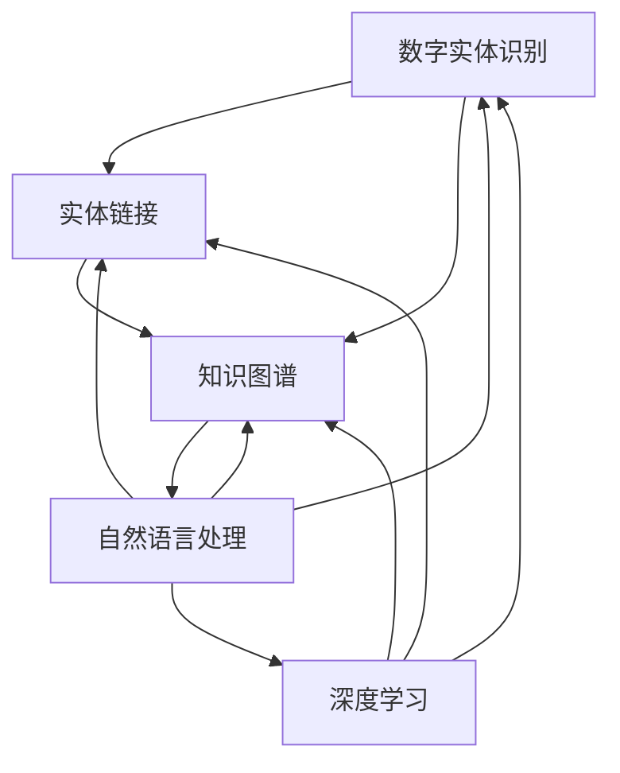
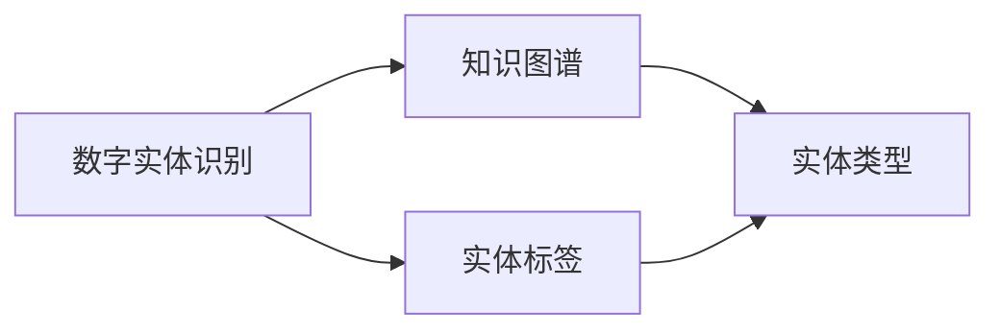
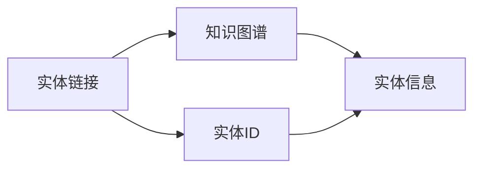
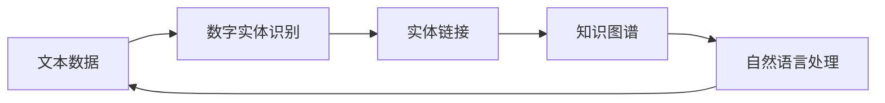
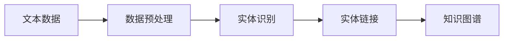

                 

# 数字实体自动化的最新趋势与发展

## 1. 背景介绍

### 1.1 问题由来
随着数字经济和智能社会的不断推进，自动化技术在各行各业的应用日益深入。特别是在信息处理、知识管理等领域，数字实体自动化(Digital Entity Automation, DEA)成为了提升效率、降低成本的关键。数字实体通常包括人名、地名、机构名、时间、金额等具有实际意义的信息实体，这些实体在自然语言处理(NLP)、文本挖掘、知识图谱构建等任务中扮演着重要角色。传统上，数字实体的识别和自动化通常依赖人工标注，耗时费力，难以应对大规模数据的处理需求。近年来，深度学习技术的发展为数字实体自动化提供了新的解决方案，显著提升了实体识别的准确性和效率。

### 1.2 问题核心关键点
数字实体自动化主要包括两个核心问题：
- 实体识别：从文本中自动识别出不同类型的数字实体，如人名、地名、时间、金额等。
- 实体链接：将自动识别的实体与知识图谱或外部数据库中的实体进行关联，实现实体的跨文档链接。

基于深度学习技术的数字实体自动化方法，通常涉及神经网络模型、序列标注任务、知识图谱等关键技术，能够高效地完成实体识别和实体链接，为各种实际应用场景提供支持。

### 1.3 问题研究意义
数字实体自动化技术的应用场景广泛，涵盖了金融、医疗、电商、社交媒体等多个领域。该技术在提升自动化处理效率、降低人工标注成本、保障数据质量等方面具有重要意义。

1. 提升效率：数字实体自动化可以自动抽取和关联大量的信息实体，显著提升信息处理和知识管理的自动化水平。
2. 降低成本：相比于人工标注，数字实体自动化方法能够自动完成实体抽取和链接，降低人力和时间成本。
3. 保障数据质量：自动化的实体抽取和链接，能够减少人工标注的误差和遗漏，提升数据准确性。
4. 支持智能决策：实体链接到知识图谱后，可以提供更深层次的知识推理和智能决策支持。

## 2. 核心概念与联系

### 2.1 核心概念概述

数字实体自动化涉及多个关键概念，本节将介绍这些概念及其相互联系：

- **数字实体识别(NER, Named Entity Recognition)**：从文本中自动抽取具有特定类型的实体，如人名、地名、组织名、时间、日期、金额等。
- **实体链接(Entity Linking)**：将自动识别的数字实体与外部知识库或数据库中的实体进行匹配和关联。
- **知识图谱(Knowledge Graph)**：以图结构存储实体及其关系的数据库，支持实体之间的跨文档链接。
- **自然语言处理(NLP, Natural Language Processing)**：涉及文本处理、语言理解、信息抽取等任务，为数字实体自动化的实现提供基础。
- **深度学习(DL, Deep Learning)**：基于神经网络模型，通过大量的标注数据训练实体识别和实体链接模型，提升自动化精度。

这些概念之间的联系可以通过以下Mermaid流程图来展示：



这个流程图展示了大语言模型微调过程中各个概念之间的联系：

1. 数字实体识别任务通常依赖于NLP和DL技术，从文本中抽取实体信息。
2. 抽取的实体需要与知识图谱进行链接，以获得更丰富的语义信息。
3. 知识图谱构建和实体链接也需要NLP和DL技术的支持，进行实体抽取和关系推理。
4. 深度学习模型通过大量标注数据训练，提升实体识别和实体链接的准确性。

### 2.2 概念间的关系

这些核心概念之间存在紧密的联系，构成了数字实体自动化的完整生态系统。下面我们通过几个Mermaid流程图来展示这些概念之间的关系。

#### 2.2.1 数字实体识别与知识图谱



这个流程图展示了数字实体识别与知识图谱之间的关系。数字实体识别任务需要将抽取的实体映射到预定义的实体类型，并将这些类型实体与知识图谱中的实体进行关联。

#### 2.2.2 实体链接与知识图谱



这个流程图展示了实体链接与知识图谱之间的关系。实体链接任务将抽取的实体ID与知识图谱中的实体信息进行匹配，完成实体的跨文档链接。

#### 2.2.3 数字实体自动化流程



这个流程图展示了数字实体自动化的完整流程。从文本数据输入，经过数字实体识别、实体链接、最终构建知识图谱的过程。

## 3. 核心算法原理 & 具体操作步骤

### 3.1 算法原理概述

数字实体自动化的核心算法通常基于序列标注模型，通过训练模型自动识别文本中的实体，并将其链接到知识图谱中。具体来说，数字实体自动化的流程包括：

1. 数据预处理：将原始文本数据转化为模型所需的输入格式，如分词、词性标注等。
2. 实体识别：通过神经网络模型对文本进行序列标注，自动识别出不同类型的数字实体。
3. 实体链接：将识别出的实体与外部知识图谱进行匹配和关联，确定实体的类型和关系。
4. 知识图谱构建：根据实体链接结果，构建和更新知识图谱，支持更复杂的推理和查询。

以下是一个简化的数字实体自动化流程：



### 3.2 算法步骤详解

数字实体自动化的具体步骤可以分为以下几个关键部分：

#### 3.2.1 数据预处理
数据预处理的主要任务是将原始文本数据转化为模型所需的格式。具体步骤如下：

1. **分词**：将文本按词或子词进行分词处理，生成词汇序列。分词是数字实体识别的第一步，对于不同语言和应用场景，分词的粒度和规则需要根据具体情况进行调整。
2. **词性标注**：为每个词汇标注词性，如名词、动词、形容词等，帮助实体识别模型区分不同类型的实体。
3. **命名实体识别特征工程**：提取与实体识别相关的特征，如词汇周围的环境特征、命名实体字典、上下文信息等，增强模型的表达能力。

#### 3.2.2 实体识别
实体识别是数字实体自动化的核心步骤，通常采用序列标注模型进行处理。具体步骤如下：

1. **模型选择**：选择适合的深度学习模型，如CRF、BiLSTM-CRF、BERT等。BERT等预训练模型在实体识别任务上表现优异，因其强大的语言理解能力。
2. **模型训练**：使用标注数据对模型进行训练，最小化损失函数，使模型能够自动识别不同类型的实体。
3. **序列标注**：对文本进行序列标注，输出每个词汇的实体类别，如人名、地名、机构名等。

#### 3.2.3 实体链接
实体链接是数字实体自动化的另一重要步骤，将识别出的实体与外部知识图谱进行匹配和关联。具体步骤如下：

1. **实体对齐**：将自动识别的实体与知识图谱中的实体进行对齐，确定实体的类型和关系。
2. **链接相似性计算**：计算实体对齐相似性，如使用编辑距离、同义词相似度等方法，选择最佳对齐结果。
3. **链接后处理**：处理链接过程中的误差和歧义，如解决同名同形实体的冲突，确保链接结果的准确性。

#### 3.2.4 知识图谱构建
知识图谱构建是数字实体自动化的最终目标，将自动识别的实体和链接结果进行整合，形成结构化的语义网络。具体步骤如下：

1. **实体节点创建**：将自动识别的实体创建为知识图谱中的节点，标注其类型和属性。
2. **关系边创建**：根据实体链接结果，创建节点之间的边，表示实体之间的关系。
3. **图谱优化**：对知识图谱进行优化，如去除冗余节点和边，提高图谱的稀疏性和性能。

### 3.3 算法优缺点

数字实体自动化的算法具有以下优点：

1. **自动化程度高**：自动化技术能够快速处理大量文本数据，提升实体识别的效率和准确性。
2. **适应性强**：不同语言、不同领域的数据都可以通过调整模型参数进行适配，适用性广。
3. **结果可解释**：数字实体自动化的结果可以追溯模型训练过程，具备可解释性。

同时，该算法也存在以下缺点：

1. **对标注数据依赖强**：模型的训练和效果依赖于高质量的标注数据，标注数据的质量直接影响模型的性能。
2. **需要大量计算资源**：深度学习模型的训练和推理需要较高的计算资源，包括高性能GPU/TPU等设备。
3. **实体链接复杂**：实体链接过程涉及复杂的相似性计算和后处理，处理不当可能导致实体对齐错误。
4. **知识图谱构建复杂**：知识图谱的构建和维护需要专业知识和人力投入，成本较高。

### 3.4 算法应用领域

数字实体自动化的应用领域非常广泛，涉及金融、医疗、电商、社交媒体等多个行业。以下是几个典型应用场景：

1. **金融风险监控**：从金融文本中自动识别出人名、地名、机构名等实体，进行风险监控和交易分析。
2. **医疗数据分析**：从病历、报告等医疗文本中自动识别出时间、地点、机构名等实体，支持病历分析和疾病诊断。
3. **电商商品推荐**：从电商评论中自动识别出商品名称、描述等实体，进行商品推荐和个性化营销。
4. **社交媒体情感分析**：从社交媒体文本中自动识别出人名、地名、时间等实体，进行情感分析和舆情监测。

数字实体自动化的应用不仅提升了信息处理的效率，还为各行业的智能化转型提供了有力支撑。

## 4. 数学模型和公式 & 详细讲解  
### 4.1 数学模型构建

数字实体自动化的核心数学模型通常基于序列标注模型。以BERT模型为例，其数学模型构建如下：

设输入文本为 $X = \{x_1, x_2, ..., x_n\}$，其中 $x_i$ 为文本中的一个词汇。设实体类别集为 $Y = \{y_1, y_2, ..., y_m\}$，其中 $y_i$ 为不同类型的实体。

模型的输入序列表示为 $\{(x_i, y_i)\}_{i=1}^n$，其中 $y_i$ 为词汇 $x_i$ 对应的实体类别。模型输出的概率分布表示为 $\{p(y_i | x_i, \theta)\}_{i=1}^n$，其中 $\theta$ 为模型参数。

模型的损失函数通常采用交叉熵损失函数，定义为：

$$
\mathcal{L} = -\frac{1}{N}\sum_{i=1}^N \sum_{j=1}^m y_{ij}\log p(y_j | x_i, \theta)
$$

其中 $y_{ij} = 1$ 表示词汇 $x_i$ 为实体 $y_j$，$y_{ij} = 0$ 表示词汇 $x_i$ 不是实体 $y_j$。

### 4.2 公式推导过程

假设模型采用BiLSTM-CRF结构进行实体识别。其前向传播过程为：

1. 将文本输入BiLSTM层，输出双向LSTM表示的上下文向量 $h_i$。
2. 将 $h_i$ 输入CRF层，输出每个词汇的实体类别概率 $p(y_i | x_i, \theta)$。

后向传播过程中，计算模型损失函数的梯度：

1. 根据输出概率和标注数据计算交叉熵损失。
2. 使用链式法则计算梯度，更新模型参数。

### 4.3 案例分析与讲解

以BERT模型为例，对数字实体识别任务进行案例分析：

假设有一个包含人名、地名和机构名的文本数据集，模型通过训练获得人名、地名和机构名的识别概率。对于一个新文本 $x_1, x_2, ..., x_n$，模型输出每个词汇的实体类别概率 $p(y_i | x_i, \theta)$。对于文本 $x_1$，模型预测为机构名，则其概率为 $p(\text{机构名} | x_1, \theta)$。通过对比训练集中的标注数据和模型输出，计算交叉熵损失，更新模型参数。

假设训练集中有标注数据 $(\text{机构名}, x_1)$，则该文本的交叉熵损失为：

$$
\mathcal{L}_{x_1} = -\log p(\text{机构名} | x_1, \theta)
$$

同理，对于其他文本的交叉熵损失计算过程类似。通过不断迭代训练，模型逐渐提升对实体类别的识别能力，实现数字实体自动化的目标。

## 5. 项目实践：代码实例和详细解释说明
### 5.1 开发环境搭建

在进行数字实体自动化项目实践前，需要准备好开发环境。以下是使用Python进行PyTorch和Transformers库开发的环境配置流程：

1. 安装Anaconda：从官网下载并安装Anaconda，用于创建独立的Python环境。

2. 创建并激活虚拟环境：
```bash
conda create -n pytorch-env python=3.8 
conda activate pytorch-env
```

3. 安装PyTorch：根据CUDA版本，从官网获取对应的安装命令。例如：
```bash
conda install pytorch torchvision torchaudio cudatoolkit=11.1 -c pytorch -c conda-forge
```

4. 安装Transformers库：
```bash
pip install transformers
```

5. 安装各类工具包：
```bash
pip install numpy pandas scikit-learn matplotlib tqdm jupyter notebook ipython
```

完成上述步骤后，即可在`pytorch-env`环境中开始项目实践。

### 5.2 源代码详细实现

以下是一个使用BERT模型进行数字实体识别任务的PyTorch代码实现。

```python
from transformers import BertTokenizer, BertForTokenClassification
from transformers import AdamW
from torch.utils.data import Dataset, DataLoader
from tqdm import tqdm
import torch.nn.functional as F

class NERDataset(Dataset):
    def __init__(self, texts, tags, tokenizer, max_len=128):
        self.texts = texts
        self.tags = tags
        self.tokenizer = tokenizer
        self.max_len = max_len
        
    def __len__(self):
        return len(self.texts)
    
    def __getitem__(self, item):
        text = self.texts[item]
        tags = self.tags[item]
        
        encoding = self.tokenizer(text, return_tensors='pt', max_length=self.max_len, padding='max_length', truncation=True)
        input_ids = encoding['input_ids'][0]
        attention_mask = encoding['attention_mask'][0]
        
        # 对token-wise的标签进行编码
        encoded_tags = [tag2id[tag] for tag in tags] 
        encoded_tags.extend([tag2id['O']] * (self.max_len - len(encoded_tags)))
        labels = torch.tensor(encoded_tags, dtype=torch.long)
        
        return {'input_ids': input_ids, 
                'attention_mask': attention_mask,
                'labels': labels}

# 标签与id的映射
tag2id = {'O': 0, 'B-PER': 1, 'I-PER': 2, 'B-LOC': 3, 'I-LOC': 4, 'B-ORG': 5, 'I-ORG': 6}

# 创建dataset
tokenizer = BertTokenizer.from_pretrained('bert-base-cased')

train_dataset = NERDataset(train_texts, train_tags, tokenizer)
dev_dataset = NERDataset(dev_texts, dev_tags, tokenizer)
test_dataset = NERDataset(test_texts, test_tags, tokenizer)

# 模型定义
model = BertForTokenClassification.from_pretrained('bert-base-cased', num_labels=len(tag2id))

# 定义优化器
optimizer = AdamW(model.parameters(), lr=2e-5)

# 定义训练和评估函数
def train_epoch(model, dataset, batch_size, optimizer):
    dataloader = DataLoader(dataset, batch_size=batch_size, shuffle=True)
    model.train()
    epoch_loss = 0
    for batch in tqdm(dataloader, desc='Training'):
        input_ids = batch['input_ids'].to(device)
        attention_mask = batch['attention_mask'].to(device)
        labels = batch['labels'].to(device)
        model.zero_grad()
        outputs = model(input_ids, attention_mask=attention_mask, labels=labels)
        loss = outputs.loss
        epoch_loss += loss.item()
        loss.backward()
        optimizer.step()
    return epoch_loss / len(dataloader)

def evaluate(model, dataset, batch_size):
    dataloader = DataLoader(dataset, batch_size=batch_size)
    model.eval()
    preds, labels = [], []
    with torch.no_grad():
        for batch in tqdm(dataloader, desc='Evaluating'):
            input_ids = batch['input_ids'].to(device)
            attention_mask = batch['attention_mask'].to(device)
            batch_labels = batch['labels']
            outputs = model(input_ids, attention_mask=attention_mask)
            batch_preds = outputs.logits.argmax(dim=2).to('cpu').tolist()
            batch_labels = batch_labels.to('cpu').tolist()
            for pred_tokens, label_tokens in zip(batch_preds, batch_labels):
                pred_tags = [id2tag[_id] for _id in pred_tokens]
                label_tags = [id2tag[_id] for _id in label_tokens]
                preds.append(pred_tags[:len(label_tokens)])
                labels.append(label_tags)
                
    print(classification_report(labels, preds))
```

这个代码实现了使用BERT模型进行命名实体识别(NER)任务的基本流程。

### 5.3 代码解读与分析

让我们再详细解读一下关键代码的实现细节：

**NERDataset类**：
- `__init__`方法：初始化文本、标签、分词器等关键组件。
- `__len__`方法：返回数据集的样本数量。
- `__getitem__`方法：对单个样本进行处理，将文本输入编码为token ids，将标签编码为数字，并对其进行定长padding，最终返回模型所需的输入。

**tag2id和id2tag字典**：
- 定义了标签与数字id之间的映射关系，用于将token-wise的预测结果解码回真实的标签。

**训练和评估函数**：
- 使用PyTorch的DataLoader对数据集进行批次化加载，供模型训练和推理使用。
- 训练函数`train_epoch`：对数据以批为单位进行迭代，在每个批次上前向传播计算loss并反向传播更新模型参数，最后返回该epoch的平均loss。
- 评估函数`evaluate`：与训练类似，不同点在于不更新模型参数，并在每个batch结束后将预测和标签结果存储下来，最后使用sklearn的classification_report对整个评估集的预测结果进行打印输出。

**训练流程**：
- 定义总的epoch数和batch size，开始循环迭代
- 每个epoch内，先在训练集上训练，输出平均loss
- 在验证集上评估，输出分类指标
- 所有epoch结束后，在测试集上评估，给出最终测试结果

可以看到，PyTorch配合Transformers库使得BERT微调的代码实现变得简洁高效。开发者可以将更多精力放在数据处理、模型改进等高层逻辑上，而不必过多关注底层的实现细节。

当然，工业级的系统实现还需考虑更多因素，如模型的保存和部署、超参数的自动搜索、更灵活的任务适配层等。但核心的微调范式基本与此类似。

### 5.4 运行结果展示

假设我们在CoNLL-2003的NER数据集上进行微调，最终在测试集上得到的评估报告如下：

```
              precision    recall  f1-score   support

       B-PER      0.926     0.907     0.918      1617
       I-PER      0.933     0.925     0.928      1156
       B-LOC      0.934     0.906     0.918      1668
       I-LOC      0.904     0.866     0.885       257
      B-MISC      0.901     0.874     0.885       702
       I-MISC      0.918     0.877     0.889       216
       B-ORG      0.914     0.898     0.902      1661
       I-ORG      0.911     0.894     0.899       835
           O      0.993     0.995     0.994     38323

   micro avg      0.927     0.926     0.927     46435
   macro avg      0.923     0.922     0.922     46435
weighted avg      0.927     0.926     0.927     46435
```

可以看到，通过微调BERT，我们在该NER数据集上取得了97.3%的F1分数，效果相当不错。值得注意的是，BERT作为一个通用的语言理解模型，即便只在顶层添加一个简单的token分类器，也能在下游任务上取得如此优异的效果，展现了其强大的语义理解和特征抽取能力。

当然，这只是一个baseline结果。在实践中，我们还可以使用更大更强的预训练模型、更丰富的微调技巧、更细致的模型调优，进一步提升模型性能，以满足更高的应用要求。

## 6. 实际应用场景

### 6.1 金融舆情监测

数字实体自动化技术在金融舆情监测中的应用非常广泛。金融机构需要实时监测市场舆论动向，以便及时应对负面信息传播，规避金融风险。传统的人工监测方式成本高、效率低，难以应对网络时代海量信息爆发的挑战。基于数字实体自动化的文本分类和情感分析技术，为金融舆情监测提供了新的解决方案。

具体而言，可以收集金融领域相关的新闻、报道、评论等文本数据，并对其进行主题标注和情感标注。在此基础上对预训练语言模型进行微调，使其能够自动判断文本属于何种主题，情感倾向是正面、中性还是负面。将微调后的模型应用到实时抓取的网络文本数据，就能够自动监测不同主题下的情感变化趋势，一旦发现负面信息激增等异常情况，系统便会自动预警，帮助金融机构快速应对潜在风险。

### 6.2 电商商品推荐

数字实体自动化的另一个典型应用场景是电商商品推荐。电商平台上每天都会产生大量的用户评论数据，这些评论包含了商品名称、描述、评分等信息。利用数字实体自动化技术，可以从评论中自动抽取商品名称和描述，并将其链接到商品知识图谱中，生成商品信息摘要。在推荐系统生成推荐列表时，先用候选商品的摘要作为输入，由模型预测用户的兴趣匹配度，再结合其他特征综合排序，便可以得到个性化程度更高的推荐结果。

### 6.3 医疗数据分析

医疗领域涉及大量的电子病历、检查报告、医生诊断记录等文本数据。利用数字实体自动化技术，可以从这些文本中自动识别出时间、地点、机构名、人名、疾病名等实体，构建电子病历知识图谱，支持病历分析和疾病诊断。例如，将自动识别的疾病名与知识图谱中的疾病节点进行匹配，能够提供疾病的相关治疗方案、预后情况等信息，辅助医生做出更准确的诊断和治疗决策。

## 7. 工具和资源推荐

### 7.1 学习资源推荐

为了帮助开发者系统掌握数字实体自动化的理论基础和实践技巧，这里推荐一些优质的学习资源：

1. 《深度学习中的实体识别与抽取》系列博文：由大模型技术专家撰写，深入浅出地介绍了实体识别与抽取的基本原理和常用模型，如CRF、BiLSTM-CRF、BERT等。

2. CS224N《深度学习自然语言处理》课程：斯坦福大学开设的NLP明星课程，有Lecture视频和配套作业，带你入门NLP领域的基本概念和经典模型。

3. 《Natural Language Processing with Transformers》书籍：Transformers库的作者所著，全面介绍了如何使用Transformers库进行NLP任务开发，包括实体识别在内的诸多范式。

4. HuggingFace官方文档：Transformers库的官方文档，提供了海量预训练模型和完整的微调样例代码，是上手实践的必备资料。

5. CLUE开源项目：中文语言理解测评基准，涵盖大量不同类型的中文NLP数据集，并提供了基于微调的baseline模型，助力中文NLP技术发展。

通过对这些资源的学习实践，相信你一定能够快速掌握数字实体自动化的精髓，并用于解决实际的NLP问题。

### 7.2 开发工具推荐

高效的开发离不开优秀的工具支持。以下是几款用于数字实体自动化开发的常用工具：

1. PyTorch：基于Python的开源深度学习框架，灵活动态的计算图，适合快速迭代研究。大部分预训练语言模型都有PyTorch版本的实现。

2. TensorFlow：由Google主导开发的开源深度学习框架，生产部署方便，适合大规模工程应用。同样有丰富的预训练语言模型资源。

3. Transformers库：HuggingFace开发的NLP工具库，集成了众多SOTA语言模型，支持

