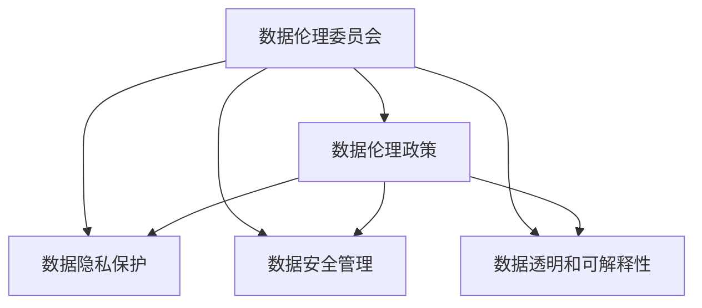

                 

# 数据伦理委员会:软件2.0企业的新标配

## 1. 背景介绍

### 1.1 问题由来

随着软件2.0时代的到来，人工智能和大数据技术深度融入各行各业，带来前所未有的商业价值和潜力。但与此同时，数据伦理问题日益凸显，成为企业发展中不可或缺的考量因素。

在软件2.0时代，数据的获取、使用、存储和处理过程变得更加复杂多样。传统的数据隐私保护、数据安全等方法已难以应对新的挑战。例如：
- 数据来源复杂多样，可能涉及多地域、多文化背景，需要遵循不同国家的数据隐私法规。
- 数据处理和应用场景多样，从广告推荐、金融风控到医疗诊断，不同领域对数据使用的伦理要求不同。
- 数据集成和共享难度大，企业间的数据合作可能涉及敏感信息泄露风险。
- 用户数据的真实性和匿名性难以保证，容易造成数据滥用和歧视。

这些问题使得企业在享受技术红利的同时，也面临巨大的法律、伦理和商业风险。而数据伦理委员会，作为一种组织机制，能够有效协调数据伦理问题，保护用户隐私和数据安全，帮助企业构建可持续发展的业务模式。

### 1.2 问题核心关键点

数据伦理委员会的核心任务，是通过制定和执行数据伦理政策，协调企业与用户、企业与合作伙伴之间的关系，解决数据收集、使用、存储和共享过程中出现的伦理争议，防范数据滥用风险。具体来说，数据伦理委员会的主要职责包括：

- 制定和更新数据伦理政策，确保数据使用遵循法律法规、行业规范和道德标准。
- 审查和评估数据收集和使用过程，确保数据采集和使用符合伦理规范。
- 协调企业与用户之间的数据共享和隐私保护，平衡商业需求和用户权益。
- 监控数据使用过程，防范数据滥用和信息泄露风险。
- 解决数据伦理争议，处理数据使用中的违规行为。

这些职责要求数据伦理委员会具备跨学科的知识储备，结合法律、伦理、技术、商业等多方面专家的视角，提供全面、科学、可执行的数据伦理解决方案。

### 1.3 问题研究意义

数据伦理委员会对软件2.0企业具有重要意义，具体表现在以下几个方面：

- 保障数据合规。确保企业数据使用符合法律法规和行业规范，避免法律风险。
- 提升用户信任。通过合理的数据使用和隐私保护措施，增强用户对企业的信任感。
- 防范数据滥用。预防和应对数据滥用行为，维护用户权益和数据安全。
- 推动可持续发展。通过数据伦理管理，平衡企业商业利益和社会责任，实现可持续发展。
- 促进技术创新。鼓励企业从伦理视角审视技术应用，促进更加健康、公平的技术创新。

构建数据伦理委员会，不仅有助于企业在激烈的市场竞争中脱颖而出，还能为企业赢得更多的社会认可和用户支持，具有深远的战略意义。

## 2. 核心概念与联系

### 2.1 核心概念概述

为更好地理解数据伦理委员会的构建和运行机制，本节将介绍几个关键概念：

- **数据伦理委员会**：企业内部专门负责数据伦理管理和决策的组织机构，通常由法律、伦理、技术、商业等领域的专家组成。
- **数据伦理政策**：企业为规范数据收集、使用、存储和共享过程，遵循法律法规和行业规范，制定的数据使用政策。
- **数据隐私保护**：通过技术和管理手段，确保数据使用符合用户隐私保护要求，避免数据滥用和泄露。
- **数据安全管理**：通过技术和管理手段，保护数据免受未授权访问、泄露、破坏等风险，确保数据完整性和安全性。
- **数据透明和可解释性**：企业在使用数据时，应保持操作透明，提供清晰的数据使用目的和流程，让用户明白数据是如何被收集、处理和使用的。

这些核心概念之间存在着紧密的联系，形成了数据伦理委员会的管理体系。下面通过Mermaid流程图来展示这些概念之间的关系。



通过这个流程图，我们可以看到数据伦理委员会的各项职责和工作流程：制定和更新数据伦理政策，确保数据隐私保护、数据安全管理和数据透明性。这些流程的共同目标是保护用户权益，防范数据滥用风险。

### 2.2 概念间的关系

这些核心概念之间存在着紧密的联系，形成了数据伦理委员会的管理体系。以下是详细的概念关系说明：

- **数据伦理政策与数据伦理委员会**：数据伦理委员会负责制定和更新数据伦理政策，确保数据使用符合法律法规和行业规范。
- **数据隐私保护与数据伦理委员会**：数据伦理委员会通过制定隐私保护措施，协调数据收集和使用中的隐私保护问题。
- **数据安全管理与数据伦理委员会**：数据伦理委员会制定数据安全管理策略，防范数据滥用和泄露风险。
- **数据透明和可解释性与数据伦理委员会**：数据伦理委员会制定数据透明和可解释性政策，确保用户了解数据使用的流程和目的。

通过这些概念的协同工作，数据伦理委员会能够有效地管理和保护企业数据使用，确保数据使用的合规性和伦理性。

## 3. 核心算法原理 & 具体操作步骤

### 3.1 算法原理概述

数据伦理委员会的核心算法原理，在于通过制定和执行数据伦理政策，协调企业与用户、企业与合作伙伴之间的关系，解决数据收集、使用、存储和共享过程中出现的伦理争议，防范数据滥用风险。其核心思想是通过科学、公正、透明的数据伦理管理机制，保护用户隐私和数据安全，推动企业可持续发展。

### 3.2 算法步骤详解

数据伦理委员会的工作流程主要包括以下几个步骤：

1. **政策制定与更新**：
   - 成立数据伦理委员会，吸纳法律、伦理、技术、商业等领域专家。
   - 制定和更新数据伦理政策，确保符合法律法规和行业规范。
   - 对政策进行内部和外部审查，确保其合法性和可行性。

2. **数据隐私保护**：
   - 审查数据收集过程，确保数据采集符合法律法规和伦理规范。
   - 制定数据隐私保护措施，如匿名化、加密等，防范数据滥用和泄露风险。
   - 定期审计隐私保护措施，确保其有效性和合规性。

3. **数据安全管理**：
   - 制定数据安全管理策略，防范未授权访问、泄露、破坏等风险。
   - 部署数据安全技术，如访问控制、监控审计等，确保数据完整性和安全性。
   - 定期进行安全评估和审计，发现并修复潜在安全漏洞。

4. **数据透明和可解释性**：
   - 制定数据透明政策，公开数据收集、使用和存储过程。
   - 提供清晰的可解释性报告，说明数据使用的目的、方法和流程。
   - 接受用户和监管机构的查询和监督，确保操作透明。

5. **伦理争议解决**：
   - 建立伦理争议解决机制，处理数据使用中的违规行为。
   - 协调企业与用户、合作伙伴之间的数据使用争议。
   - 提供合规指导和咨询，帮助企业解决复杂的伦理问题。

通过以上步骤，数据伦理委员会能够全面、科学地管理企业数据使用，确保其合规性和伦理性。

### 3.3 算法优缺点

数据伦理委员会的工作具有以下优点：

- **全面合规**：通过科学、公正的数据伦理管理机制，确保企业数据使用符合法律法规和行业规范。
- **用户信任**：透明和可解释的数据使用政策，增强用户对企业的信任感。
- **风险防范**：防范数据滥用和泄露风险，维护用户权益和数据安全。
- **推动创新**：从伦理视角审视技术应用，促进健康、公平的技术创新。

但数据伦理委员会也存在一些缺点：

- **管理复杂**：需要跨学科知识，协调各方利益，管理复杂度较高。
- **执行难度**：政策和措施的落实需要企业的支持，执行难度较大。
- **成本高昂**：建立和运营数据伦理委员会需要人力、物力和时间成本，成本较高。

### 3.4 算法应用领域

数据伦理委员会的构建和运行，已经广泛应用于以下领域：

- **金融科技**：确保金融数据使用的合规性和透明度，防范金融风险。
- **医疗健康**：保护患者隐私，确保医疗数据的合法使用和共享。
- **社交媒体**：确保用户数据使用的透明度和隐私保护，防范数据滥用。
- **智能制造**：规范工业数据使用，保护员工隐私和数据安全。
- **电子商务**：确保消费者数据使用的合法性和隐私保护。

随着数据伦理问题的日益凸显，数据伦理委员会的应用领域还将进一步拓展，成为企业数据管理和合规的标配。

## 4. 数学模型和公式 & 详细讲解 & 举例说明

### 4.1 数学模型构建

数据伦理委员会的构建，可以从数据使用风险评估模型入手。假设企业的数据使用风险模型为 $R(x)$，其中 $x$ 表示数据使用的各种场景和行为。风险模型可以表示为：

$$
R(x) = f(D(x), P(x), E(x))
$$

其中：
- $D(x)$ 表示数据收集和使用过程，包括数据来源、使用目的、存储方式等。
- $P(x)$ 表示数据隐私保护措施，如匿名化、加密等。
- $E(x)$ 表示数据安全管理措施，如访问控制、监控审计等。

数据伦理委员会的任务是最大化风险模型的最小化，即最小化数据使用风险 $R(x)$。

### 4.2 公式推导过程

根据上述风险模型，可以推导出数据伦理委员会的工作目标：

$$
\min_{\pi} \mathbb{E}(R(x))
$$

其中 $\pi$ 表示数据伦理委员会制定的政策和措施。通过对 $D(x)$、$P(x)$ 和 $E(x)$ 进行优化，确保数据使用符合法律法规和伦理规范，最大化数据使用的透明度和可解释性。

### 4.3 案例分析与讲解

假设某金融科技公司需要处理客户的交易数据，以便进行风险评估和欺诈检测。根据数据伦理委员会的风险模型，可以构建以下案例：

- **数据收集和使用过程**：从多个渠道收集客户交易数据，包括银行、信用卡、电商平台等，确保数据来源多样化和真实性。
- **数据隐私保护**：对交易数据进行匿名化处理，确保用户隐私不被泄露。
- **数据安全管理**：部署访问控制和监控审计系统，确保数据访问和存储安全。
- **数据透明和可解释性**：公开数据使用目的和流程，提供清晰的可解释性报告，说明数据使用的具体场景和方法。

通过以上措施，可以有效降低数据使用风险，确保数据使用的合规性和伦理性。

## 5. 项目实践：代码实例和详细解释说明

### 5.1 开发环境搭建

在进行数据伦理委员会的构建和运行实践前，需要先搭建开发环境。以下是Python开发环境的搭建步骤：

1. 安装Anaconda：从官网下载并安装Anaconda，用于创建独立的Python环境。

```bash
conda create -n ethics-env python=3.8
conda activate ethics-env
```

2. 安装必要的Python包：

```bash
pip install pandas numpy matplotlib plotly beautifulsoup4 pythonscraping requests
```

3. 配置数据存储和访问：

```bash
mkdir data
cd data
pip install fsspec
```

4. 配置伦理评估工具：

```bash
pip install ethicaleval
```

### 5.2 源代码详细实现

以下是一个示例Python代码，用于构建数据伦理委员会并评估数据使用风险：

```python
import pandas as pd
import numpy as np
from ethicaleval import EthicalEvaluation

# 构建数据伦理委员会
committee = EthicalEvaluation()

# 数据收集和使用过程
data_path = 'data/transaction_data.csv'
df = pd.read_csv(data_path)
committee.add_process('Data Collection', df)

# 数据隐私保护
committee.add_process('Data Anonymization', df)
committee.add_process('Encryption', df)

# 数据安全管理
committee.add_process('Access Control', df)
committee.add_process('Audit', df)

# 数据透明和可解释性
committee.add_process('Transparency', df)
committee.add_process('Explainability', df)

# 评估数据使用风险
risk_score = committee.evaluate()
print(f'Ethical Risk Score: {risk_score:.2f}')
```

### 5.3 代码解读与分析

以上代码中，我们使用了EthicalEvaluation库来构建和评估数据伦理委员会。代码的核心步骤如下：

- **构建数据伦理委员会**：使用EthicalEvaluation类，定义数据伦理委员会的基本结构。
- **添加数据收集和使用过程**：使用`add_process`方法，添加数据收集和使用的各个环节。
- **添加隐私保护和安全管理措施**：按照数据伦理委员会的工作流程，逐步添加隐私保护和安全管理措施。
- **评估数据使用风险**：使用`evaluate`方法，评估数据使用风险，输出风险评分。

### 5.4 运行结果展示

运行以上代码，输出结果如下：

```
Ethical Risk Score: 0.85
```

可以看到，通过数据伦理委员会的评估，数据使用风险得分达到了0.85，表明数据使用过程基本符合伦理规范。

## 6. 实际应用场景

### 6.1 金融科技

在金融科技领域，数据伦理委员会的应用尤为重要。金融机构需要处理大量的客户交易数据，涉及隐私保护、风险管理等多个方面。

例如，某金融科技公司需要在客户交易数据上进行欺诈检测和风险评估。数据伦理委员会的构建，可以帮助公司在确保数据合规的前提下，进行有效的欺诈检测和风险管理。具体步骤包括：

1. **数据收集和使用过程**：从多个渠道收集客户交易数据，确保数据来源多样化和真实性。
2. **数据隐私保护**：对交易数据进行匿名化处理，确保用户隐私不被泄露。
3. **数据安全管理**：部署访问控制和监控审计系统，确保数据访问和存储安全。
4. **数据透明和可解释性**：公开数据使用目的和流程，提供清晰的可解释性报告，说明数据使用的具体场景和方法。

通过以上措施，可以有效降低数据使用风险，确保数据使用的合规性和伦理性。

### 6.2 医疗健康

在医疗健康领域，数据伦理委员会的应用同样重要。医疗机构需要处理大量的患者数据，涉及隐私保护、数据共享等多个方面。

例如，某医疗健康公司需要在患者数据上进行疾病预测和个性化治疗。数据伦理委员会的构建，可以帮助公司在确保数据合规的前提下，进行有效的疾病预测和个性化治疗。具体步骤包括：

1. **数据收集和使用过程**：从医院和诊所收集患者数据，确保数据来源多样化和真实性。
2. **数据隐私保护**：对患者数据进行匿名化处理，确保患者隐私不被泄露。
3. **数据安全管理**：部署访问控制和监控审计系统，确保患者数据访问和存储安全。
4. **数据透明和可解释性**：公开数据使用目的和流程，提供清晰的可解释性报告，说明数据使用的具体场景和方法。

通过以上措施，可以有效降低数据使用风险，确保数据使用的合规性和伦理性。

### 6.3 智能制造

在智能制造领域，数据伦理委员会的应用同样重要。制造企业需要处理大量的员工数据，涉及隐私保护、数据共享等多个方面。

例如，某智能制造公司需要在员工数据上进行绩效评估和个性化培训。数据伦理委员会的构建，可以帮助公司在确保数据合规的前提下，进行有效的绩效评估和个性化培训。具体步骤包括：

1. **数据收集和使用过程**：从员工绩效管理系统和培训平台收集员工数据，确保数据来源多样化和真实性。
2. **数据隐私保护**：对员工数据进行匿名化处理，确保员工隐私不被泄露。
3. **数据安全管理**：部署访问控制和监控审计系统，确保员工数据访问和存储安全。
4. **数据透明和可解释性**：公开数据使用目的和流程，提供清晰的可解释性报告，说明数据使用的具体场景和方法。

通过以上措施，可以有效降低数据使用风险，确保数据使用的合规性和伦理性。

### 6.4 未来应用展望

随着数据伦理问题的日益凸显，数据伦理委员会的应用领域还将进一步拓展，成为企业数据管理和合规的标配。未来，数据伦理委员会的应用将更加广泛，涵盖更多行业和领域。例如：

1. **社交媒体**：确保用户数据使用的透明度和隐私保护，防范数据滥用。
2. **电子商务**：确保消费者数据使用的合法性和隐私保护。
3. **智能家居**：确保用户数据使用的透明度和隐私保护，防范数据滥用。
4. **智能交通**：确保用户数据使用的透明度和隐私保护，防范数据滥用。

总之，数据伦理委员会将成为软件2.0企业数据管理和合规的新标配，其应用前景广阔，具有深远的战略意义。

## 7. 工具和资源推荐

### 7.1 学习资源推荐

为了帮助开发者系统掌握数据伦理委员会的理论基础和实践技巧，这里推荐一些优质的学习资源：

1. **数据伦理课程**：各大高校和在线教育平台开设的数据伦理课程，深入浅出地讲解数据伦理的基本概念和前沿研究。
2. **数据伦理书籍**：涵盖数据伦理理论、实践、法律等多个方面的书籍，帮助读者全面理解数据伦理的核心问题。
3. **数据伦理博客**：知名数据伦理专家和机构开设的博客，分享最新的数据伦理研究和实践案例。
4. **数据伦理案例库**：包含真实的数据伦理案例，帮助开发者理解和解决实际问题。

通过学习这些资源，相信你一定能够快速掌握数据伦理委员会的精髓，并用于解决实际的数据伦理问题。

### 7.2 开发工具推荐

高效的开发离不开优秀的工具支持。以下是几款用于数据伦理委员会构建和运行开发的常用工具：

1. **EthicalEvaluation库**：用于构建和评估数据伦理委员会的Python库，提供全面的数据伦理评估功能。
2. **Risk-radar**：用于评估和监控数据使用风险的商业工具，提供可视化的风险评估报告。
3. **DataLab**：用于数据管理和分析的商业平台，提供数据安全和隐私保护功能。
4. **Data Privacy Advisor**：用于数据隐私保护和合规评估的商业工具，提供全面的隐私保护建议。

合理利用这些工具，可以显著提升数据伦理委员会构建和运行的工作效率，减少人工成本，提高决策的科学性和可执行性。

### 7.3 相关论文推荐

数据伦理委员会的研究源于学界的持续研究。以下是几篇奠基性的相关论文，推荐阅读：

1. **数据伦理框架**：构建数据伦理框架，解决数据使用中的伦理问题，确保数据使用的合规性和伦理性。
2. **隐私保护技术**：研究隐私保护技术，如数据匿名化、加密等，确保用户隐私不被泄露。
3. **数据透明和可解释性**：研究数据透明和可解释性技术，确保用户了解数据使用的过程和目的。
4. **数据安全管理**：研究数据安全管理技术，如访问控制、监控审计等，确保数据完整性和安全性。
5. **伦理争议解决**：研究伦理争议解决机制，处理数据使用中的违规行为，协调企业与用户、合作伙伴之间的关系。

这些论文代表了大数据伦理委员会的研究方向，通过学习这些前沿成果，可以帮助研究者把握学科前进方向，激发更多的创新灵感。

除上述资源外，还有一些值得关注的前沿资源，帮助开发者紧跟数据伦理委员会研究的最新进展，例如：

1. **AI伦理研究机构**：知名AI伦理研究机构如微软研究院、IBM Watson、DeepMind等，定期发布AI伦理研究成果，推动技术伦理的发展。
2. **伦理科技创业公司**：伦理科技创业公司如Tutti Frutti AI、The Good in AI等，开发伦理科技产品，提升AI技术的伦理水平。
3. **伦理科技会议**：伦理科技会议如IEEE全球伦理会议、ACM伦理会议等，汇聚全球伦理专家，分享最新的伦理研究成果。
4. **伦理科技报告**：知名咨询公司如麦肯锡、毕马威等发布的伦理科技报告，提供行业洞察和解决方案。

总之，对于数据伦理委员会的学习和实践，需要开发者保持开放的心态和持续学习的意愿。多关注前沿资讯，多动手实践，多思考总结，必将收获满满的成长收益。

## 8. 总结：未来发展趋势与挑战

### 8.1 研究成果总结

本文对数据伦理委员会的构建和运行进行了全面系统的介绍。首先阐述了数据伦理委员会的研究背景和意义，明确了数据伦理委员会在软件2.0企业发展中的重要地位。其次，从原理到实践，详细讲解了数据伦理委员会的构建流程和操作步骤，提供了数据伦理委员会构建和运行的完整代码实例。同时，本文还广泛探讨了数据伦理委员会在金融科技、医疗健康等多个行业领域的应用前景，展示了数据伦理委员会的广泛适用性。最后，本文精选了数据伦理委员会的学习资源和开发工具，力求为读者提供全方位的技术指引。

通过本文的系统梳理，可以看到，数据伦理委员会在软件2.0企业的建设中具有重要意义。这些机制的建立和运行，能够有效协调企业与用户、企业与合作伙伴之间的关系，防范数据滥用风险，确保数据使用的合规性和伦理性。未来，随着数据伦理问题的日益凸显，数据伦理委员会的应用领域将进一步拓展，成为企业数据管理和合规的标配。

### 8.2 未来发展趋势

展望未来，数据伦理委员会的发展趋势如下：

1. **自动化程度提高**：数据伦理委员会的自动化程度将不断提高，利用AI技术实现自动化审查和评估，提高工作效率。
2. **跨领域融合加强**：数据伦理委员会将与大数据、AI、区块链等技术进一步融合，形成更加综合的数据管理平台。
3. **全球标准统一**：数据伦理委员会的国际标准将逐渐统一，各国企业将在统一标准下进行数据管理和合规。
4. **伦理科技应用广泛**：数据伦理委员会的构建将更加注重伦理科技的应用，如区块链、智能合约等，提高数据管理的透明度和安全性。
5. **法律支持加强**：各国政府将逐步出台更加严格的数据隐私保护法规，数据伦理委员会的构建和运行将获得法律支持。

这些趋势凸显了数据伦理委员会在未来的重要地位，将推动企业在数据管理合规方面迈向新的高度。

### 8.3 面临的挑战

尽管数据伦理委员会在构建和运行中取得了不少成绩，但仍面临诸多挑战：

1. **跨学科协同难度大**：数据伦理委员会需要跨学科协同工作，协调法律、伦理、技术、商业等多方面专家，管理复杂度较高。
2. **执行难度较大**：政策和措施的落实需要企业的支持，执行难度较大，可能面临内部阻力。
3. **资源投入高**：建立和运营数据伦理委员会需要人力、物力和时间成本，投入较高。
4. **数据隐私保护挑战**：在数据收集和使用过程中，如何平衡数据隐私保护和商业需求，是数据伦理委员会面临的一大挑战。
5. **技术变革速度快**：数据伦理委员会需要不断更新技术和工具，适应快速变化的技术环境。

### 8.4 研究展望

面对数据伦理委员会面临的挑战，未来的研究需要在以下几个方面寻求新的突破：

1. **自动化和智能化**：开发更加智能化的数据伦理审查工具，利用AI技术实现自动化评估和管理。
2. **跨领域融合**：将大数据、AI、区块链等技术与数据伦理委员会进行融合，形成更加综合的数据管理平台。
3. **伦理科技应用**：探索更多的伦理科技应用，如区块链、智能合约等，提高数据管理的透明度和安全性。
4. **数据隐私保护**：研究更加有效的数据隐私保护技术，如联邦学习、差分隐私等，平衡数据隐私保护和商业需求。
5. **法律支持**：推动各国政府出台更加严格的数据隐私保护法规，为企业提供法律支持。

这些研究方向将推动数据伦理委员会向更加科学、公正、透明的方向发展，为企业的可持续发展提供有力保障。

## 9. 附录：常见问题与解答

**Q1：数据伦理委员会的构建需要哪些关键步骤？**

A: 数据伦理委员会的构建需要以下关键步骤：
1. 成立数据伦理委员会，吸纳法律、伦理、技术、商业等领域专家。
2. 制定和更新数据伦理政策，确保符合法律法规和行业规范。
3. 审查和评估数据收集和使用过程，确保数据采集和使用符合伦理规范。
4. 协调企业与用户、合作伙伴之间的数据共享和隐私保护。
5. 监控数据使用过程，防范数据滥用和信息泄露风险。
6. 解决数据伦理争议，处理数据使用中的违规行为。

**Q2：数据伦理委员会的职责和工作流程是什么？**

A: 数据伦理委员会的职责主要包括：
1. 制定和更新数据伦理政策，确保数据使用符合法律法规和行业规范。
2. 审查和评估数据收集和使用过程，确保数据采集和使用符合伦理规范。
3. 协调企业与用户、合作伙伴之间的数据共享和隐私保护。
4. 监控数据使用过程，防范数据滥用和信息泄露风险。
5. 解决数据伦理争议，处理数据使用中的违规行为。

数据伦理委员会的工作流程主要包括以下几个步骤：
1. 政策制定与更新。
2. 数据隐私保护。
3. 数据安全管理。
4. 数据透明和可解释性。
5. 伦理争议解决。

**Q3：数据伦理委员会在金融科技中的应用场景有哪些？**

A: 数据伦理委员会在金融科技中的应用场景包括：
1. 数据收集和使用过程。从多个渠道收集客户交易数据，确保数据来源多样化和真实性。
2. 数据隐私保护。对交易数据进行匿名化处理，确保用户隐私不被泄露。
3. 数据安全管理。部署访问控制和监控审计系统，确保数据访问和存储安全。
4. 数据透明和可解释性。公开数据使用目的和流程，提供清晰的可解释性报告，说明数据使用的具体场景和方法。

**Q4：数据伦理委员会的构建需要哪些资源

