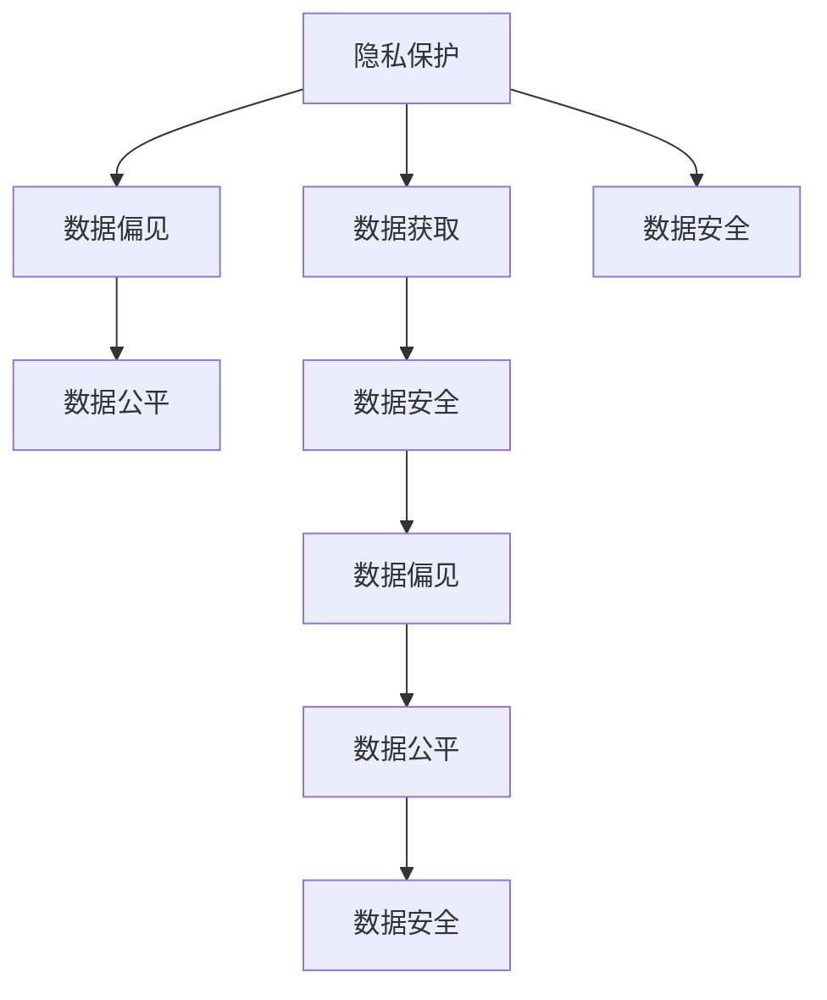
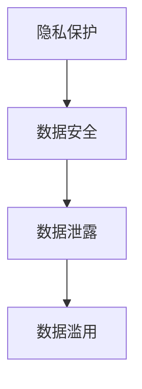
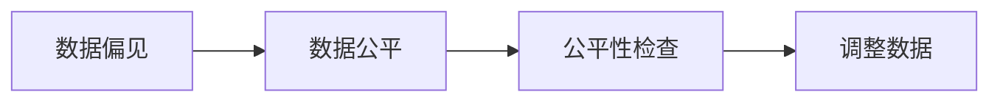
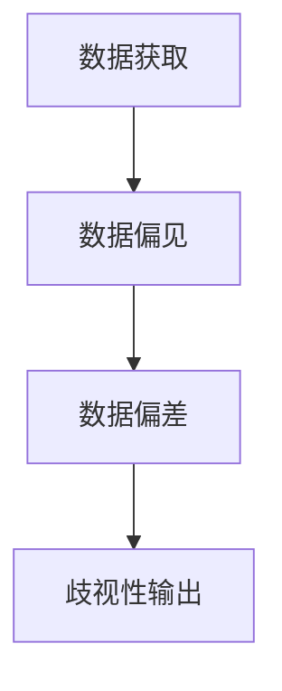
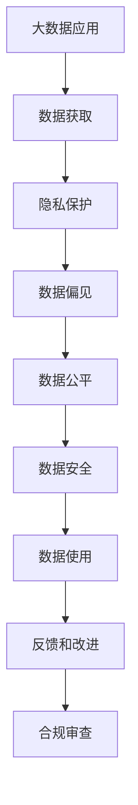

                 

# 数据伦理的挑战：如何应对数据伦理困境？

## 1. 背景介绍

### 1.1 问题由来

随着人工智能和大数据技术的发展，数据伦理问题日益成为学术界、企业界和政府关注的焦点。数据作为AI系统训练的基础，其伦理问题涉及到隐私保护、数据偏见、数据公平、数据安全等多个方面。这些伦理问题不仅影响数据使用的合规性和合法性，更关系到公众对AI系统的信任和接受程度。

例如，深度学习模型需要大量标注数据进行训练，这些数据往往包含用户的个人信息和行为记录。如果处理不当，可能导致隐私泄露和数据滥用。此外，由于训练数据中存在偏见，模型输出也可能会出现歧视性或错误引导，带来社会负面影响。这些问题如果不能有效解决，将严重制约AI技术的广泛应用，甚至引发公众对AI技术的抵制。

### 1.2 问题核心关键点

在数据伦理困境中，核心关键点主要包括以下几点：

1. **隐私保护**：如何保护用户隐私，防止数据被滥用。
2. **数据偏见**：如何检测和纠正数据中的偏见，避免模型输出带有歧视性。
3. **数据公平**：如何确保不同群体间的公平对待，防止数据偏见带来的不公。
4. **数据安全**：如何防止数据泄露和攻击，保障数据的安全性。
5. **数据获取**：如何合法合规地获取和使用数据，避免数据滥用。

这些问题紧密相关，亟需得到系统性的解决。本文将从隐私保护、数据偏见、数据公平、数据安全、数据获取五个方面，探讨如何应对数据伦理困境。

## 2. 核心概念与联系

### 2.1 核心概念概述

为更好地理解数据伦理困境，本节将介绍几个密切相关的核心概念：

- **隐私保护**：指在数据收集、存储、使用等环节中，采取技术和管理措施，防止个人信息泄露或被非法获取。
- **数据偏见**：指数据集中存在不平衡、歧视性等，导致模型训练结果偏差，出现歧视性或错误引导的情况。
- **数据公平**：指确保不同群体在数据处理和模型输出中得到公平对待，避免数据偏见带来的不公。
- **数据安全**：指防止数据泄露、篡改、攻击等，保障数据的完整性和安全性。
- **数据获取**：指如何合法合规地获取和使用数据，避免数据滥用和侵犯隐私。

这些核心概念之间的逻辑关系可以通过以下Mermaid流程图来展示：



这个流程图展示了大数据伦理问题中的各个关键概念及其相互关系：

1. 隐私保护是数据获取的前提，确保数据获取的合法合规。
2. 数据偏见和数据公平是数据处理和模型输出的结果，需要确保模型训练和输出的公平性。
3. 数据安全是数据存储和使用的保障，确保数据不被泄露或篡改。

这些概念共同构成了数据伦理的完整生态系统，需要全面系统地进行管理和优化。

### 2.2 概念间的关系

这些核心概念之间存在着紧密的联系，形成了数据伦理问题的整体框架。下面我们通过几个Mermaid流程图来展示这些概念之间的关系。

#### 2.2.1 隐私保护与数据安全的关系



这个流程图展示了隐私保护与数据安全之间的密切联系。隐私保护是为了防止数据泄露，数据安全则是为了防止数据被恶意篡改或滥用。

#### 2.2.2 数据偏见与数据公平的关系



这个流程图展示了数据偏见和数据公平之间的关系。数据偏见可能带来不公平的输出，需要通过公平性检查和调整数据来纠正。

#### 2.2.3 数据获取与数据偏见的关系



这个流程图展示了数据获取与数据偏见之间的关系。如果数据获取不当，可能导致数据偏差，进而影响模型的公平性输出。

### 2.3 核心概念的整体架构

最后，我们用一个综合的流程图来展示这些核心概念在大数据伦理问题中的整体架构：



这个综合流程图展示了大数据应用的完整流程，从数据获取到隐私保护、数据偏见、数据公平、数据安全，再到数据使用和反馈改进，最后进行合规审查，形成一个闭环系统。通过这个系统，可以全面管理大数据伦理问题，确保数据使用的合规性和合法性。

## 3. 核心算法原理 & 具体操作步骤

### 3.1 算法原理概述

数据伦理困境的解决，依赖于一系列复杂的算法和策略。这些算法和策略可以分为以下几个关键部分：

- **隐私保护算法**：如差分隐私、同态加密等，用于保护用户隐私。
- **数据偏见检测算法**：如公平性指标、基于统计的检测方法等，用于检测和纠正数据中的偏见。
- **数据公平算法**：如公平性调整、对抗学习等，用于确保模型输出的公平性。
- **数据安全算法**：如加密技术、区块链等，用于保障数据的安全性。
- **数据获取算法**：如数据标注、数据合成等，用于合法合规地获取数据。

这些算法和策略共同构成了数据伦理困境的解决框架，需要根据具体场景进行综合应用。

### 3.2 算法步骤详解

以下是针对各个核心概念的具体算法步骤：

#### 3.2.1 隐私保护

1. **数据匿名化**：对数据进行匿名化处理，去除或模糊化个人标识信息。
2. **差分隐私**：在数据分析和模型训练过程中，加入噪声扰动，防止数据泄露。
3. **同态加密**：对数据进行加密处理，使得模型训练和推理可以在加密状态下进行，保护数据隐私。
4. **访问控制**：对数据进行严格的身份验证和访问控制，确保数据仅在授权人员之间共享。

#### 3.2.2 数据偏见

1. **数据统计分析**：对数据集进行统计分析，检测是否存在不平衡或歧视性。
2. **公平性指标**：使用公平性指标（如均方误差、分类准确率等），评估模型输出是否公平。
3. **对抗学习**：通过对抗样本训练，调整模型输出，消除数据偏差。
4. **数据重采样**：对数据集进行重采样，平衡数据分布，消除偏见。

#### 3.2.3 数据公平

1. **公平性调整**：对模型输出进行调整，确保不同群体之间的公平性。
2. **对抗学习**：使用对抗样本训练，调整模型输出，消除数据偏见。
3. **多模型集成**：集成多个模型，确保不同模型之间的输出公平性。
4. **公平性约束**：在模型训练过程中，引入公平性约束，确保输出公平。

#### 3.2.4 数据安全

1. **数据加密**：对数据进行加密处理，防止数据泄露和篡改。
2. **访问控制**：对数据进行严格的身份验证和访问控制，确保数据仅在授权人员之间共享。
3. **区块链技术**：利用区块链技术，记录数据访问和使用的历史，保障数据安全。
4. **安全审计**：定期进行安全审计，检测和修复潜在的安全漏洞。

#### 3.2.5 数据获取

1. **数据标注**：通过标注工具，对数据进行标注，确保数据质量。
2. **数据合成**：使用数据合成技术，生成模拟数据，保障数据多样性和平衡性。
3. **隐私保护技术**：在数据获取过程中，应用隐私保护技术，防止数据滥用。
4. **合规审查**：对数据获取过程进行合规审查，确保数据合法合规。

### 3.3 算法优缺点

#### 3.3.1 隐私保护算法

**优点**：
1. 保护用户隐私，防止数据泄露和滥用。
2. 能够在数据共享和分析中保护隐私。

**缺点**：
1. 隐私保护算法可能影响数据质量和分析效果。
2. 复杂度较高，需要专门的技术和资源支持。

#### 3.3.2 数据偏见检测算法

**优点**：
1. 能够检测数据中的偏见，确保模型输出公平。
2. 能够进行模型优化，减少数据偏见带来的影响。

**缺点**：
1. 检测和纠正数据偏见需要大量的时间和资源。
2. 数据偏见检测算法可能存在误判或漏判情况。

#### 3.3.3 数据公平算法

**优点**：
1. 确保模型输出公平，避免歧视性输出。
2. 能够通过调整模型参数，消除数据偏见。

**缺点**：
1. 公平算法可能影响模型性能和准确性。
2. 需要引入外部干预，增加模型复杂度。

#### 3.3.4 数据安全算法

**优点**：
1. 保障数据安全，防止数据泄露和篡改。
2. 能够在数据传输和存储过程中保障数据完整性。

**缺点**：
1. 数据安全算法可能增加系统复杂度和计算成本。
2. 某些算法可能需要专门的硬件支持。

#### 3.3.5 数据获取算法

**优点**：
1. 能够合法合规地获取数据，保障数据质量。
2. 能够通过数据合成技术，丰富数据多样性。

**缺点**：
1. 数据获取和标注需要大量时间和资源。
2. 数据合成技术可能存在数据失真情况。

### 3.4 算法应用领域

数据伦理困境的解决，广泛应用于各个领域：

- **医疗领域**：保护患者隐私，确保数据公平使用，保障数据安全。
- **金融领域**：防止数据滥用，确保模型公平，保护客户隐私。
- **社交媒体**：保护用户隐私，防止数据泄露，确保数据公平。
- **政府机构**：确保数据公平使用，保障数据安全，保护公民隐私。
- **企业应用**：保障数据安全，确保模型公平，防止数据滥用。

这些领域的数据伦理困境，需要通过综合应用隐私保护、数据偏见、数据公平、数据安全、数据获取等算法，系统性地解决。

## 4. 数学模型和公式 & 详细讲解  
### 4.1 数学模型构建

在数据伦理困境中，我们可以用数学模型来表示和分析问题。

#### 4.1.1 隐私保护模型

设数据集 $D=\{(x_i,y_i)\}_{i=1}^N$，其中 $x_i$ 为数据，$y_i$ 为标签。设隐私保护算法为 $P$，处理后的数据集为 $D'$。隐私保护的目标是最小化隐私损失，即：

$$
\min_{P} \frac{1}{N} \sum_{i=1}^N \mathcal{L}(P(x_i))
$$

其中 $\mathcal{L}$ 为隐私损失函数，可以是差分隐私损失、同态加密损失等。

#### 4.1.2 数据偏见模型

设数据集 $D=\{(x_i,y_i)\}_{i=1}^N$，其中 $x_i$ 为数据，$y_i$ 为标签。设数据偏见检测算法为 $B$，处理后的数据集为 $D'$。数据偏见检测的目标是最小化数据偏差，即：

$$
\min_{B} \frac{1}{N} \sum_{i=1}^N |y_i - \hat{y}_i|
$$

其中 $\hat{y}_i$ 为算法 $B$ 对 $x_i$ 的预测结果。

#### 4.1.3 数据公平模型

设数据集 $D=\{(x_i,y_i)\}_{i=1}^N$，其中 $x_i$ 为数据，$y_i$ 为标签。设数据公平算法为 $F$，处理后的数据集为 $D'$。数据公平的目标是最小化模型输出偏差，即：

$$
\min_{F} \frac{1}{N} \sum_{i=1}^N \mathcal{L}(F(x_i),y_i)
$$

其中 $\mathcal{L}$ 为公平性损失函数，可以是均方误差损失、分类准确率损失等。

#### 4.1.4 数据安全模型

设数据集 $D=\{(x_i,y_i)\}_{i=1}^N$，其中 $x_i$ 为数据，$y_i$ 为标签。设数据安全算法为 $S$，处理后的数据集为 $D'$。数据安全的目标是最小化数据泄露风险，即：

$$
\min_{S} \frac{1}{N} \sum_{i=1}^N \mathcal{L}(S(x_i))
$$

其中 $\mathcal{L}$ 为数据泄露损失函数，可以是差分隐私损失、同态加密损失等。

#### 4.1.5 数据获取模型

设数据集 $D=\{(x_i,y_i)\}_{i=1}^N$，其中 $x_i$ 为数据，$y_i$ 为标签。设数据获取算法为 $G$，获取的数据集为 $D'$。数据获取的目标是最小化数据偏差，即：

$$
\min_{G} \frac{1}{N} \sum_{i=1}^N |y_i - \hat{y}_i|
$$

其中 $\hat{y}_i$ 为算法 $G$ 对 $x_i$ 的预测结果。

### 4.2 公式推导过程

#### 4.2.1 隐私保护公式推导

以差分隐私为例，假设隐私保护算法为 $P$，数据集 $D$ 的隐私损失函数为 $\mathcal{L}(P(x_i))$。差分隐私的隐私损失函数可以表示为：

$$
\mathcal{L}_{\epsilon}(P(x_i)) = \frac{1}{N} \sum_{i=1}^N \left(\mathcal{L}(P(x_i)) - \mathcal{L}(P(x'_i))\right)
$$

其中 $x'_i$ 为 $x_i$ 的差分样本。差分隐私的目标是最小化隐私损失，即：

$$
\min_{P} \frac{1}{N} \sum_{i=1}^N \mathcal{L}_{\epsilon}(P(x_i))
$$

#### 4.2.2 数据偏见公式推导

以均方误差为例，假设数据集 $D=\{(x_i,y_i)\}_{i=1}^N$，其中 $x_i$ 为数据，$y_i$ 为标签。数据偏见检测的目标是最小化数据偏差，即：

$$
\min_{B} \frac{1}{N} \sum_{i=1}^N (y_i - \hat{y}_i)^2
$$

其中 $\hat{y}_i$ 为算法 $B$ 对 $x_i$ 的预测结果。

#### 4.2.3 数据公平公式推导

以均方误差为例，假设数据集 $D=\{(x_i,y_i)\}_{i=1}^N$，其中 $x_i$ 为数据，$y_i$ 为标签。数据公平的目标是最小化模型输出偏差，即：

$$
\min_{F} \frac{1}{N} \sum_{i=1}^N (y_i - \hat{y}_i)^2
$$

其中 $\hat{y}_i$ 为算法 $F$ 对 $x_i$ 的预测结果。

#### 4.2.4 数据安全公式推导

以差分隐私为例，假设数据集 $D=\{(x_i,y_i)\}_{i=1}^N$，其中 $x_i$ 为数据，$y_i$ 为标签。数据安全的目标是最小化数据泄露风险，即：

$$
\min_{S} \frac{1}{N} \sum_{i=1}^N \left(\mathcal{L}(S(x_i)) - \mathcal{L}(S(x'_i))\right)
$$

其中 $x'_i$ 为 $x_i$ 的差分样本。差分隐私的目标是最小化隐私损失，即：

$$
\min_{S} \frac{1}{N} \sum_{i=1}^N \mathcal{L}_{\epsilon}(S(x_i))
$$

#### 4.2.5 数据获取公式推导

以均方误差为例，假设数据集 $D=\{(x_i,y_i)\}_{i=1}^N$，其中 $x_i$ 为数据，$y_i$ 为标签。数据获取的目标是最小化数据偏差，即：

$$
\min_{G} \frac{1}{N} \sum_{i=1}^N (y_i - \hat{y}_i)^2
$$

其中 $\hat{y}_i$ 为算法 $G$ 对 $x_i$ 的预测结果。

### 4.3 案例分析与讲解

#### 4.3.1 隐私保护案例

在医疗领域，医生需要对患者的电子健康记录（EHR）进行隐私保护，防止数据泄露。可以使用差分隐私算法，在数据分析过程中加入噪声扰动，确保数据隐私。

**案例分析**：假设有一个包含10000名患者的EHR数据集，其中包含患者的姓名、年龄、疾病等信息。医生需要对这些数据进行分析，以预测疾病的流行趋势。在分析过程中，可以采用差分隐私算法，加入噪声扰动，使得每个患者的信息都不会被单独识别。

**算法实现**：使用差分隐私算法，在每个样本上加入噪声扰动，并计算隐私损失。通过最小化隐私损失，确保数据分析过程中的隐私保护。

#### 4.3.2 数据偏见案例

在金融领域，金融机构需要对贷款申请数据进行分析，以评估贷款风险。如果数据集中存在性别、种族等偏见，会导致模型输出不公平，进而影响贷款审批。可以使用数据偏见检测算法，检测和纠正数据中的偏见。

**案例分析**：假设有一个包含1000个贷款申请的数据集，其中包含申请人的年龄、性别、收入等信息。金融机构需要对这些数据进行分析，以预测贷款风险。在分析过程中，可以检测数据中的性别偏见，确保模型输出公平。

**算法实现**：使用数据偏见检测算法，检测数据集中是否存在性别偏见。如果检测到偏见，可以通过数据重采样等方法，平衡数据分布，消除偏见。

#### 4.3.3 数据公平案例

在教育领域，评估学生的成绩需要考虑其社会经济背景，以确保公平性。可以使用数据公平算法，调整模型输出，确保不同背景的学生得到公平对待。

**案例分析**：假设有一个包含1000名学生的数据集，其中包含学生的成绩、家庭背景等信息。学校需要对这些数据进行分析，以评估学生的成绩。在分析过程中，需要确保不同背景的学生得到公平对待。

**算法实现**：使用数据公平算法，调整模型输出，确保不同背景的学生得到公平对待。可以通过对抗学习等方法，调整模型参数，消除数据偏见。

#### 4.3.4 数据安全案例

在政府机构，需要保护公民的个人隐私，防止数据泄露。可以使用数据加密算法，对数据进行加密处理，保障数据安全。

**案例分析**：假设有一个包含1000个公民的数据集，其中包含公民的个人信息，如姓名、身份证号等。政府需要对这些数据进行保护，防止数据泄露。

**算法实现**：使用数据加密算法，对数据进行加密处理，确保数据在传输和存储过程中不被泄露。可以采用AES等对称加密算法，对数据进行加密处理。

#### 4.3.5 数据获取案例

在社交媒体，需要保护用户的隐私，防止数据滥用。可以使用数据合成技术，生成模拟数据，保障数据隐私。

**案例分析**：假设有一个包含1000个用户的社交媒体数据集，其中包含用户的兴趣、行为等信息。社交媒体需要对这些数据进行保护，防止数据滥用。

**算法实现**：使用数据合成技术，生成模拟数据，确保数据在分析过程中不被滥用。可以使用GAN等生成对抗网络，生成模拟数据，保障数据隐私。

## 5. 项目实践：代码实例和详细解释说明

### 5.1 开发环境搭建

在进行数据伦理困境的解决实践前，我们需要准备好开发环境。以下是使用Python进行PyTorch开发的环境配置流程：

1. 安装Anaconda：从官网下载并安装Anaconda，用于创建独立的Python环境。

2. 创建并激活虚拟环境：
```bash
conda create -n pytorch-env python=3.8 
conda activate pytorch-env
```

3. 安装PyTorch：根据CUDA版本，从官网获取对应的安装命令。例如：
```bash
conda install pytorch torchvision torchaudio cudatoolkit=11.1 -c pytorch -c conda-forge
```

4. 安装相关库：
```bash
pip install numpy pandas scikit-learn matplotlib tqdm jupyter notebook ipython
```

完成上述步骤后，即可在`pytorch-env`环境中开始数据伦理困境的解决实践。

### 5.2 源代码详细实现

下面我们以隐私保护为例，给出使用差分隐私对数据进行隐私保护的PyTorch代码实现。

首先，定义差分隐私函数：

```python
import torch
import torch.nn as nn
import torch.optim as optim
from torch.utils.data import Dataset, DataLoader

def laplace_mechanism(epsilon, delta):
    scale = 1 / epsilon
    return nn.Laplace(scale)

class LaplaceNoise(nn.Module):
    def __init__(self, epsilon, delta):
        super(LaplaceNoise, self).__init__()
        self.epsilon = epsilon
        self.delta = delta
        self.noise = nn.ModuleList([laplace_mechanism(epsilon, delta) for i in range(d)])

    def forward(self, x):
        for i in range(d):
            x = self.noise[i](x)
        return x

class LDBP(nn.Module):
    def __init__(self, d_in, d_out):
        super(LDBP, self).__init__()
        self.fc1 = nn.Linear(d_in, 128)
        self.fc2 = nn.Linear(128, 64)
        self.fc3 = nn.Linear(64, d_out)

    def forward(self, x):
        x = self.fc1(x)
        x = torch.relu(x)
        x = self.fc2(x)
        x = torch.relu(x)
        x = self.fc3(x)
        return x

class PrivacyDataset(Dataset):
    def __init__(self, data, epsilon, delta):
        self.data = data
        self.epsilon = epsilon
        self.delta = delta
        self.noise = LaplaceNoise(epsilon, delta)

    def __len__(self):
        return len(self.data)

    def __getitem__(self, idx):
        x, y = self.data[idx]
        x = self.noise(x)
        return (x, y)
```

然后，定义训练和评估函数：

```python
def train(epoch, model, train_loader, optimizer):
    model.train()
    loss = 0
    for batch_idx, (data, target) in enumerate(train_loader):
        optimizer.zero_grad()
        data = data.to(device)
        target = target.to(device)
        output = model(data)
        loss += nn.CrossEntropyLoss()(output, target).item()
        loss.backward()
        optimizer.step()
    train_loss = loss / len(train_loader)

def test(model, test_loader):
    model.eval()
    loss = 0
    with torch.no_grad():
        for batch_idx, (data, target) in enumerate(test_loader):
            data = data.to(device)
            target = target.to(device)
            output = model(data)
            loss += nn.CrossEntropyLoss()(output, target).item()
    test_loss = loss / len(test_loader)
    print('Test set: Average loss: {:.4f}'.format(test_loss))
```

最后，启动训练流程：

```python
device = torch.device('cuda' if torch.cuda.is_available() else 'cpu')
d = 10
n_classes = 2

# 创建数据集
train_data = []
for i in range(100):
    x = torch.randn(d).to(device)
    y = torch.randint(0, n_classes, (1,)).to(device)
    train_data.append((x, y))

# 定义模型
model = LDBP(d, n_classes)
model = model.to(device)

# 定义优化器
optimizer = optim.SGD(model.parameters(), lr=0.1)

# 定义差分隐私参数
epsilon = 0.1
delta = 1e-5

# 创建数据集
train_dataset = PrivacyDataset(train_data, epsilon, delta)

# 定义训练集和测试集
train_loader = DataLoader(train_dataset, batch_size=4, shuffle=True)
test_loader = DataLoader(train_dataset, batch_size=4, shuffle=False)

# 训练模型
for epoch in range(10):
    train(epoch, model, train_loader, optimizer)
    test(model, test_loader)
```

以上就是使用PyTorch对数据

