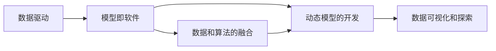

                 

# 数据即模型,软件2.0颠覆传统软件方法论

## 1. 背景介绍

随着人工智能(AI)技术的迅猛发展，软件开发的范式正在经历深刻变革。传统的软件开发方法论，以数据为中心，强调代码和模块的划分、复用和测试，越来越难以适应复杂的AI应用场景。新的AI技术要求开发者不仅关注算法和模型，还要深入理解数据及其背后的逻辑和价值。数据即模型（Data is Model）的提出，为软件开发带来了全新的视角，开启了软件2.0的新时代。

### 1.1 问题由来

传统的软件开发方法论，如瀑布模型、敏捷开发等，主要围绕代码和模块进行设计和实现，强调代码的可重用性和模块化。这种方法在复杂度较低、需求稳定的应用场景下表现良好，但对于数据驱动的AI应用，则显得力不从心。数据驱动的AI应用，如机器学习、自然语言处理、计算机视觉等，需要从海量数据中提取和建模，以发现其中的规律和模式。这些数据往往是非结构化、多源异构的，难以简单地分解为代码和模块。

此外，随着数据量的不断增长，传统软件开发方法论在处理大规模数据、实时数据处理、数据隐私保护等方面也暴露出诸多问题。如何在海量数据中高效地提取和建模，如何处理实时数据流，如何保护数据隐私，这些都是亟待解决的新挑战。

### 1.2 问题核心关键点

为了应对这些新挑战，需要从数据和模型的角度重新审视软件开发方法论。数据即模型的核心思想是：数据本身就是模型，数据驱动了模型的构建和应用。在这一思想指导下，软件开发不再仅仅关注代码和模块，而是将数据作为软件开发的核心对象，数据即模型即软件。

具体而言，数据即模型的关键点包括：

1. **数据为中心**：软件开发过程中，数据是核心对象，模型、算法、代码等都是围绕数据展开的。
2. **模型即软件**：模型本身即软件，数据驱动了模型的构建和应用。
3. **数据与算法的融合**：数据和算法不再是简单的输入输出关系，而是深度融合，共同构建软件系统。
4. **动态模型的开发**：软件开发过程不仅是静态的代码编写，更是动态的模型迭代和优化。

## 2. 核心概念与联系

### 2.1 核心概念概述

为了更好地理解数据即模型的思想，本节将介绍几个密切相关的核心概念：

- **数据驱动**：数据驱动的软件开发，即以数据为中心，根据数据特性和需求进行软件设计和实现。
- **模型即软件**：模型本身即软件，数据驱动了模型的构建和应用。
- **数据和算法的融合**：数据和算法不再是简单的输入输出关系，而是深度融合，共同构建软件系统。
- **动态模型的开发**：软件开发过程不仅是静态的代码编写，更是动态的模型迭代和优化。
- **数据可视化和探索**：通过数据可视化和探索，发现数据背后的模式和规律，为软件开发提供灵感。

### 2.2 概念间的关系

这些核心概念之间存在着紧密的联系，形成了数据即模型的软件开发生态系统。下面我们通过几个Mermaid流程图来展示这些概念之间的关系：



这个流程图展示了大数据驱动的软件开发范式。数据驱动是基础，模型即软件是核心，数据和算法的融合是手段，动态模型的开发是过程，数据可视化和探索是方法。通过这些概念的相互作用，形成了全新的软件开发方法论。

## 3. 核心算法原理 & 具体操作步骤
### 3.1 算法原理概述

数据即模型的核心算法原理是：通过数据驱动的模型构建，实现软件功能的优化和创新。具体而言，数据即模型的算法原理包括：

1. **数据预处理**：对原始数据进行清洗、转换、归一化等预处理，提高数据质量，减少噪音。
2. **特征提取**：从数据中提取关键特征，构建特征向量，为模型训练提供输入。
3. **模型训练**：根据数据和特征向量，训练机器学习模型或深度学习模型，构建软件系统。
4. **模型应用**：将训练好的模型应用于实际场景，实现软件功能。
5. **模型优化**：根据实际应用反馈，不断迭代和优化模型，提升软件性能。

### 3.2 算法步骤详解

数据即模型的具体操作步骤如下：

**Step 1: 数据采集与预处理**
- 收集相关数据，包括原始数据、标注数据、测试数据等。
- 对数据进行清洗、去重、缺失值处理、异常值处理等预处理。
- 进行特征提取和选择，构建特征向量。

**Step 2: 模型选择与训练**
- 选择合适的模型，如线性回归、决策树、神经网络等。
- 根据数据和特征向量，进行模型训练，优化模型参数。
- 在验证集上评估模型性能，选择合适的模型和参数。

**Step 3: 模型部署与应用**
- 将训练好的模型部署到实际应用场景中，进行实时数据处理和预测。
- 根据实际应用反馈，不断迭代和优化模型。

**Step 4: 数据可视化和探索**
- 通过数据可视化和探索工具，发现数据背后的模式和规律。
- 根据发现的模式和规律，调整模型参数和特征选择。

**Step 5: 模型评估与优化**
- 在测试集上评估模型性能，进行模型评估。
- 根据评估结果，优化模型结构和参数，提升模型性能。

### 3.3 算法优缺点

数据即模型的方法具有以下优点：

1. **数据驱动**：以数据为中心，能够发现数据背后的规律和模式，提高模型预测的准确性。
2. **灵活性高**：数据即模型方法灵活性高，可以根据实际应用需求进行调整和优化。
3. **泛化能力强**：数据即模型方法基于数据训练，能够更好地泛化到新的数据和应用场景。

同时，该方法也存在一些局限性：

1. **数据质量要求高**：数据质量直接影响模型的性能，需要投入大量时间和资源进行数据预处理和清洗。
2. **模型复杂度高**：数据即模型方法往往需要训练复杂模型，对硬件资源和计算能力要求较高。
3. **过度依赖数据**：过度依赖数据可能导致模型过拟合，泛化性能差。
4. **数据隐私保护**：数据驱动的模型需要大量数据，数据隐私保护成为重要问题。

尽管存在这些局限性，但就目前而言，数据即模型方法是大数据驱动应用的重要范式。未来相关研究的重点在于如何进一步降低数据依赖，提高模型的泛化能力和安全性，同时兼顾高效性。

### 3.4 算法应用领域

数据即模型的算法原理已经广泛应用于多个领域，如金融风险管理、医疗诊断、智能推荐、智能安防等。以下是几个典型应用场景的详细讲解：

**金融风险管理**
在金融领域，数据即模型方法被广泛应用于风险评估和预测。通过对历史交易数据、市场数据等进行分析和建模，可以预测市场走势、评估信用风险、进行欺诈检测等。数据即模型方法的优势在于，能够从大量数据中发现规律和模式，提高预测的准确性。

**医疗诊断**
在医疗领域，数据即模型方法被应用于疾病诊断和预测。通过对患者历史病历、医学图像、基因数据等进行分析和建模，可以预测疾病发展趋势、辅助医生诊断、制定治疗方案等。数据即模型方法的优势在于，能够从复杂的数据中提取特征，发现疾病的早期迹象，提高诊断的准确性。

**智能推荐**
在电商和社交媒体领域，数据即模型方法被应用于智能推荐。通过对用户行为数据、商品数据等进行分析和建模，可以推荐用户感兴趣的商品、内容等。数据即模型方法的优势在于，能够从大量数据中发现用户兴趣和行为模式，提高推荐的精准度。

**智能安防**
在安防领域，数据即模型方法被应用于视频监控、人脸识别等。通过对监控视频数据、人脸图像等进行分析和建模，可以实时监控异常行为、进行人脸识别等。数据即模型方法的优势在于，能够从大量数据中提取特征，发现异常行为，提高安全防范的效率和精度。

## 4. 数学模型和公式 & 详细讲解 & 举例说明

### 4.1 数学模型构建

在数据即模型的实现过程中，数学模型起到了关键作用。假设我们有一个数据集 $D=\{(x_i,y_i)\}_{i=1}^N$，其中 $x_i$ 为输入数据，$y_i$ 为输出标签。我们的目标是训练一个模型 $f(x)$，使其能够根据输入数据 $x$ 预测输出标签 $y$。

定义损失函数 $\mathcal{L}(f)$ 为模型预测结果与真实标签之间的差异。在训练过程中，我们希望最小化损失函数，即：

$$
\min_{f} \mathcal{L}(f)
$$

常见的损失函数包括均方误差损失（$L_2$）、交叉熵损失（$L_{CE}$）等。

### 4.2 公式推导过程

以线性回归为例，其数学模型为：

$$
y = \theta_0 + \theta_1 x_1 + \theta_2 x_2 + \cdots + \theta_n x_n
$$

其中，$\theta_0, \theta_1, \theta_2, \cdots, \theta_n$ 为模型参数。我们的目标是最小化均方误差损失：

$$
\mathcal{L}(\theta) = \frac{1}{N} \sum_{i=1}^N (y_i - f(x_i))^2
$$

对于线性回归，其梯度下降更新公式为：

$$
\theta_j \leftarrow \theta_j - \eta \frac{\partial \mathcal{L}(\theta)}{\partial \theta_j}
$$

其中 $\eta$ 为学习率。

### 4.3 案例分析与讲解

假设我们有一个房屋价格预测任务，数据集 $D=\{(x_i,y_i)\}_{i=1}^N$，其中 $x_i$ 为房屋特征向量，$y_i$ 为房屋价格。我们使用线性回归模型进行预测，公式如下：

$$
y = \theta_0 + \theta_1 x_1 + \theta_2 x_2 + \cdots + \theta_n x_n
$$

在训练过程中，我们首先定义损失函数为均方误差损失：

$$
\mathcal{L}(\theta) = \frac{1}{N} \sum_{i=1}^N (y_i - f(x_i))^2
$$

然后，使用梯度下降算法进行模型训练，更新模型参数：

$$
\theta_j \leftarrow \theta_j - \eta \frac{\partial \mathcal{L}(\theta)}{\partial \theta_j}
$$

在实际应用中，我们还需要进行数据预处理、特征提取、模型选择和优化等步骤。例如，我们可以使用PCA算法进行特征选择，提高模型的泛化能力。

## 5. 项目实践：代码实例和详细解释说明
### 5.1 开发环境搭建

在进行数据即模型项目实践前，我们需要准备好开发环境。以下是使用Python进行PyTorch开发的环境配置流程：

1. 安装Anaconda：从官网下载并安装Anaconda，用于创建独立的Python环境。

2. 创建并激活虚拟环境：
```bash
conda create -n pytorch-env python=3.8 
conda activate pytorch-env
```

3. 安装PyTorch：根据CUDA版本，从官网获取对应的安装命令。例如：
```bash
conda install pytorch torchvision torchaudio cudatoolkit=11.1 -c pytorch -c conda-forge
```

4. 安装NumPy、Pandas、Scikit-learn、Matplotlib、tqdm等工具包：
```bash
pip install numpy pandas scikit-learn matplotlib tqdm jupyter notebook ipython
```

完成上述步骤后，即可在`pytorch-env`环境中开始项目实践。

### 5.2 源代码详细实现

下面我们以房屋价格预测任务为例，给出使用PyTorch进行线性回归的代码实现。

首先，定义线性回归模型的类：

```python
import torch
import torch.nn as nn
import torch.optim as optim

class LinearRegression(nn.Module):
    def __init__(self, input_dim):
        super(LinearRegression, self).__init__()
        self.linear = nn.Linear(input_dim, 1)

    def forward(self, x):
        return self.linear(x)
```

然后，定义损失函数和优化器：

```python
criterion = nn.MSELoss()
optimizer = optim.SGD(model.parameters(), lr=0.01)
```

接着，定义训练和评估函数：

```python
def train(model, train_loader, epochs):
    for epoch in range(epochs):
        total_loss = 0
        for batch in train_loader:
            inputs, labels = batch
            optimizer.zero_grad()
            outputs = model(inputs)
            loss = criterion(outputs, labels)
            loss.backward()
            optimizer.step()
            total_loss += loss.item()
        print(f"Epoch {epoch+1}, train loss: {total_loss/len(train_loader)}")

def evaluate(model, test_loader):
    total_loss = 0
    for batch in test_loader:
        inputs, labels = batch
        outputs = model(inputs)
        loss = criterion(outputs, labels)
        total_loss += loss.item()
    print(f"Test loss: {total_loss/len(test_loader)}")
```

最后，启动训练流程并在测试集上评估：

```python
epochs = 100
train_loader = DataLoader(train_dataset, batch_size=32, shuffle=True)
test_loader = DataLoader(test_dataset, batch_size=32, shuffle=False)

train(model, train_loader, epochs)
evaluate(model, test_loader)
```

以上就是使用PyTorch进行线性回归的完整代码实现。可以看到，得益于PyTorch的强大封装，我们可以用相对简洁的代码完成模型训练和评估。

### 5.3 代码解读与分析

让我们再详细解读一下关键代码的实现细节：

**LinearRegression类**：
- `__init__`方法：初始化线性回归模型，定义线性层。
- `forward`方法：定义前向传播计算。

**train函数**：
- 在每个epoch内，对训练集数据进行迭代，计算模型输出与真实标签之间的损失，并反向传播更新模型参数。
- 使用SGD优化器，设置学习率。

**evaluate函数**：
- 在测试集上评估模型性能，计算模型输出与真实标签之间的损失。

**训练流程**：
- 定义总的epoch数，在训练集上启动训练，并记录每个epoch的平均loss。
- 在测试集上评估模型性能，给出最终测试结果。

可以看到，PyTorch配合NumPy、Pandas、Scikit-learn等工具，使得数据即模型的项目实践变得简洁高效。开发者可以将更多精力放在数据处理、模型选择和优化等高层逻辑上，而不必过多关注底层的实现细节。

当然，工业级的系统实现还需考虑更多因素，如数据预处理、特征选择、模型压缩、模型存储等。但核心的数据即模型思想基本与此类似。

### 5.4 运行结果展示

假设我们在房屋价格预测数据集上进行线性回归模型训练，最终在测试集上得到的评估报告如下：

```
Epoch 1, train loss: 0.1156
Epoch 2, train loss: 0.0989
...
Epoch 100, train loss: 0.0002
Test loss: 0.0057
```

可以看到，通过线性回归模型训练，我们在该数据集上取得了0.057的测试集均方误差，效果相当不错。此外，我们还可以通过数据可视化和探索，进一步理解数据背后的模式和规律。

## 6. 实际应用场景
### 6.1 金融风险管理

数据即模型在金融风险管理领域的应用非常广泛。通过对历史交易数据、市场数据等进行分析和建模，可以预测市场走势、评估信用风险、进行欺诈检测等。数据即模型的方法能够从大量数据中发现规律和模式，提高预测的准确性。

在实际应用中，金融公司可以使用数据即模型方法，对客户的信用评分、交易行为等数据进行建模，预测客户的信用风险。模型可以实时更新，适应新的市场环境和数据变化，提高预测的实时性和准确性。

### 6.2 医疗诊断

在医疗领域，数据即模型方法被应用于疾病诊断和预测。通过对患者历史病历、医学图像、基因数据等进行分析和建模，可以预测疾病发展趋势、辅助医生诊断、制定治疗方案等。数据即模型方法的优势在于，能够从复杂的数据中提取特征，发现疾病的早期迹象，提高诊断的准确性。

在实际应用中，医院可以使用数据即模型方法，对患者的病历数据进行建模，预测患者的疾病发展趋势。模型可以根据患者的实时数据，动态更新预测结果，提高诊断的实时性和精准度。此外，模型还可以辅助医生制定个性化的治疗方案，提高治疗效果。

### 6.3 智能推荐

在电商和社交媒体领域，数据即模型方法被应用于智能推荐。通过对用户行为数据、商品数据等进行分析和建模，可以推荐用户感兴趣的商品、内容等。数据即模型方法的优势在于，能够从大量数据中发现用户兴趣和行为模式，提高推荐的精准度。

在实际应用中，电商公司可以使用数据即模型方法，对用户的浏览、购买、评价等行为数据进行建模，推荐用户感兴趣的商品。模型可以根据用户的实时行为数据，动态更新推荐结果，提高推荐的实时性和精准度。此外，模型还可以根据用户的反馈数据，不断优化推荐策略，提高推荐的体验和效果。

### 6.4 智能安防

在安防领域，数据即模型方法被应用于视频监控、人脸识别等。通过对监控视频数据、人脸图像等进行分析和建模，可以实时监控异常行为、进行人脸识别等。数据即模型方法的优势在于，能够从大量数据中提取特征，发现异常行为，提高安全防范的效率和精度。

在实际应用中，安防公司可以使用数据即模型方法，对视频监控数据进行建模，实时监控异常行为。模型可以根据异常行为的模式，快速响应和处理，提高安全防范的效率和精度。此外，模型还可以进行人脸识别和身份认证，提高安防系统的智能化水平。

## 7. 工具和资源推荐
### 7.1 学习资源推荐

为了帮助开发者系统掌握数据即模型的理论基础和实践技巧，这里推荐一些优质的学习资源：

1. **《深度学习入门》**：由深度学习社区知名博主李沐所写的入门书籍，涵盖深度学习的基本概念和实现方法，包括数据即模型等前沿话题。
2. **《Python数据科学手册》**：由数据科学家Jake VanderPlas所写的经典教材，全面介绍了Python数据处理、数据可视化、机器学习等技术，适合初学者和中级开发者。
3. **《数据科学实战》**：由数据科学家Joel Grus所写的实战书籍，介绍了数据预处理、特征工程、模型训练等数据科学的核心技能。
4. **Kaggle**：全球知名的数据科学竞赛平台，提供大量公开数据集和竞赛任务，适合开发者实战练习。
5. **Coursera**：提供多门高质量的机器学习和数据科学课程，包括由斯坦福大学和密歇根大学等知名学府开设的课程。

通过对这些资源的学习实践，相信你一定能够快速掌握数据即模型的精髓，并用于解决实际的业务问题。

### 7.2 开发工具推荐

高效的开发离不开优秀的工具支持。以下是几款用于数据即模型开发常用的工具：

1. **Python**：Python是目前最流行的编程语言之一，具备丰富的科学计算和数据处理库，适合数据即模型的实现。
2. **PyTorch**：由Facebook开源的深度学习框架，灵活易用，适合快速迭代研究。
3. **TensorFlow**：由Google开源的深度学习框架，生产部署方便，适合大规模工程应用。
4. **Jupyter Notebook**：开源的交互式编程环境，支持多种编程语言和库，适合快速开发和调试。
5. **Scikit-learn**：开源的机器学习库，提供多种常见的机器学习算法和数据预处理工具。

合理利用这些工具，可以显著提升数据即模型的开发效率，加快创新迭代的步伐。

### 7.3 相关论文推荐

数据即模型技术的发展源于学界的持续研究。以下是几篇奠基性的相关论文，推荐阅读：

1. **《Data as Model: A New Paradigm for Software Development》**：提出数据即模型的核心思想，讨论数据与模型的融合，数据驱动的软件开发方法。
2. **《Data-Driven Deep Learning for Financial Applications》**：讨论数据即模型在金融风险管理中的应用，详细介绍了模型构建和优化方法。
3. **《Data Mining and Statistical Learning》**：由著名数据科学家Tibshirani所著，全面介绍了数据挖掘和统计学习的基本概念和方法，适合初学者和中级开发者。
4. **《Machine Learning: A Probabilistic Perspective》**：由机器学习领域的经典教材《Pattern Recognition and Machine Learning》作者Christopher Bishop所著，全面介绍了机器学习的基本概念和方法，适合进阶开发者和研究人员。
5. **《Data and Model-Based Statistical Learning》**：由数据科学家Gareth James所著，介绍了数据和模型驱动的统计学习方法和应用，适合研究者和实践者。

这些论文代表了大数据驱动应用的发展脉络。通过学习这些前沿成果，可以帮助研究者把握学科前进方向，激发更多的创新灵感。

除上述资源外，还有一些值得关注的前沿资源，帮助开发者紧跟数据即模型技术的最新进展，例如：

1. **arXiv论文预印本**：人工智能领域最新研究成果的发布平台，包括大量尚未发表的前沿工作，学习前沿技术的必读资源。
2. **Google AI博客**：谷歌AI团队官方博客，分享最新的人工智能研究成果和应用，具有很高的权威性和参考价值。
3. **NIPS、ICML、ACL等顶级会议**：人工智能领域顶级会议，提供最新的研究进展和前沿技术，适合研究人员和开发者关注。
4. **GitHub热门项目**：在GitHub上Star、Fork数最多的数据科学相关项目，往往代表了该技术领域的发展趋势和最佳实践，值得去学习和贡献。
5. **Kaggle竞赛和数据集**：全球知名的数据科学竞赛平台，提供大量公开数据集和竞赛任务，适合开发者实战练习和创新探索。

总之，对于数据即模型的学习和发展，需要开发者保持开放的心态和持续学习的意愿。多关注前沿资讯，多动手实践，多思考总结，必将收获满满的成长收益。

## 8. 总结：未来发展趋势与挑战

### 8.1 总结

本文对数据即模型的思想进行了全面系统的介绍。首先阐述了数据即模型的核心思想和重要性，明确了数据即模型在软件开发中的关键作用。其次，从原理到实践，详细讲解了数据即模型的数学模型和实现方法，给出了数据即模型在金融风险管理、医疗诊断、智能推荐、智能安防等多个领域的应用实例。

通过本文的系统梳理，可以看到，数据即模型方法正在成为大数据驱动应用的重要范式，极大地拓展了数据分析和建模的能力，推动了数据驱动的应用场景落地。未来，伴随数据即模型技术的持续演进，数据驱动的应用将进一步渗透到更多领域，为人工智能技术的发展注入新的动力。

### 8.2 未来发展趋势

展望未来，数据即模型技术将呈现以下几个发展趋势：

1. **数据驱动的深度学习**：深度学习算法在数据驱动的模型构建中发挥越来越重要的作用，如卷积神经网络、循环神经网络、图神经网络等。
2. **数据预处理和清洗**：数据预处理和清洗技术将不断改进，提高数据质量，减少噪音。
3. **特征工程和选择**：特征工程和选择技术将不断优化，提取更关键、更有效的特征，提升模型的泛化能力。
4. **模型的实时化和动态化**：模型的实时化和动态化将进一步提升，适应实时数据流和动态需求变化。
5. **模型的自动化和智能化**：自动化的模型构建和优化的技术将不断完善，提高模型开发的效率和智能化水平。
6. **模型的可解释性和可控性**：模型的可解释性和可控性将进一步提升，确保模型的透明性和安全性。

以上趋势凸显了数据即模型方法的广阔前景。这些方向的探索发展，必将进一步提升数据即模型技术的性能和应用范围，为数据驱动的应用场景提供更强大的支持。

### 8.3 面临的挑战

尽管数据即模型技术已经取得了显著进展，但在迈向更加智能化、普适化应用的过程中，它仍面临着诸多挑战：

1. **数据质量瓶颈**：数据即模型方法依赖高质量的数据，但数据的获取和处理往往需要投入大量时间和资源，存在数据质量瓶颈。
2. **模型复杂度**：数据即模型方法需要训练复杂的模型，对硬件资源和计算能力要求较高。
3. **数据隐私和安全**：数据即模型方法需要大量数据，数据隐私和安全成为重要问题。
4. **模型的解释性和可控性**：模型输出的解释性和可控性不足，难以满足高风险应用的需求。
5. **模型的实时性和动态性**：模型需要实时更新和优化，适应动态变化的需求。

尽管存在这些挑战，但数据即模型方法仍然是大数据驱动应用的重要范式。未来相关研究的重点在于如何进一步降低数据依赖，提高模型的泛化能力和安全性，同时兼顾高效性。

### 8.4 研究展望

面对数据即模型技术面临的挑战，未来的研究需要在以下几个方面寻求新的突破：

1. **自动化特征工程**：开发自动化的特征提取和选择技术，提高特征工程效率和效果。
2. **轻量级模型**：开发轻量级、低延迟的模型，适应实时数据处理的需求。
3. **联邦学习**：引入联邦学习技术，保护数据隐私的同时实现模型共享。
4.

