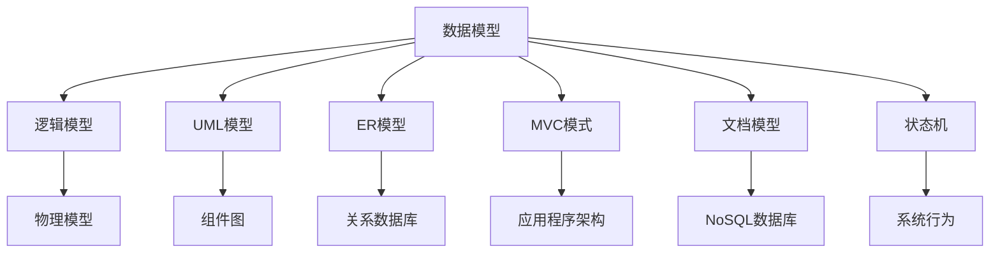

                 

# 数据模型即软件模型,两种抽象的碰撞

在计算机科学领域，模型（Model）是一种重要的抽象概念，它描述了一个系统的内部结构和行为。在软件开发和数据科学中，模型有着截然不同的定义和应用方式。本文将从数据模型和软件模型的不同视角出发，探讨它们之间的碰撞、融合及其对软件开发和数据科学的影响。

## 1. 背景介绍

### 1.1 数据模型概述

数据模型是用于表示和管理数据的概念框架，它将现实世界的实体和关系映射到数据库中的抽象结构。数据模型一般分为三类：概念模型、逻辑模型和物理模型。

- **概念模型**：定义数据的概念结构和数据之间的关联关系，如ER模型、UML类图等。
- **逻辑模型**：描述数据库的结构，包括表、列、键、外键等。
- **物理模型**：定义数据在存储介质上的物理存储方式，如关系数据库、NoSQL数据库、文件存储等。

数据模型的目的在于帮助开发者清晰地理解数据的结构，便于数据库设计和应用开发。常见的数据模型有：

- **关系模型**：以表的形式组织数据，通过SQL语言进行查询、更新、插入和删除操作。
- **面向对象模型**：以对象的形式组织数据，支持封装、继承和多态等面向对象特性。
- **文档模型**：以文档的形式组织数据，每个文档包含键值对，如MongoDB。

### 1.2 软件模型概述

软件模型是用于描述软件系统的内部结构和行为的概念框架，它通常包括系统组件、组件间的关系、数据流和控制流等。软件模型可以分为静态模型和动态模型两种。

- **静态模型**：描述系统的静态结构，如UML类图、组件图等。
- **动态模型**：描述系统的动态行为，如状态机、流程图等。

软件模型的目的在于帮助开发者清晰地理解系统的结构和行为，便于系统设计和应用开发。常见的软件模型有：

- **UML模型**：用于描述系统的静态结构和动态行为，是软件设计的重要工具。
- **MVC模式**：将软件系统划分为模型、视图和控制器三个部分，便于系统组织和维护。
- **微服务架构**：将软件系统划分为多个独立的微服务，每个微服务独立部署和扩展。

## 2. 核心概念与联系

### 2.1 核心概念概述

在软件开发和数据科学中，数据模型和软件模型分别描述了数据和系统的结构与行为，它们之间的联系主要体现在以下几个方面：

- **共同目标**：无论是数据模型还是软件模型，最终目的都是为了更好地管理和利用数据，满足用户需求。
- **模型转换**：数据模型和软件模型之间可以进行转换和映射，如将数据模型转换为软件架构，将软件架构转换为数据库设计等。
- **跨领域应用**：数据模型和软件模型在许多领域都得到了应用，如金融、医疗、电商等，它们在不同领域中的应用也相互借鉴和融合。

### 2.2 核心概念联系的 Mermaid 流程图



这个Mermaid流程图展示了数据模型和软件模型之间的关系：

1. 数据模型可以被转换为逻辑模型和物理模型。
2. UML模型可以描述系统的静态结构和动态行为。
3. ER模型和关系数据库用于描述数据结构和关系。
4. MVC模式可以将软件系统划分为模型、视图和控制器。
5. 文档模型用于存储文档类型的数据。
6. 状态机和流程图用于描述系统的动态行为。

## 3. 核心算法原理 & 具体操作步骤

### 3.1 算法原理概述

数据模型和软件模型在实际应用中，都需要使用算法进行建模和优化。常见的算法包括：

- **数据模型算法**：用于处理和分析数据，如分类算法、聚类算法、关联规则挖掘等。
- **软件模型算法**：用于设计和优化软件系统，如搜索算法、调度算法、优化算法等。

数据模型和软件模型算法的共同点在于：

- **目标一致**：无论是数据模型算法还是软件模型算法，都是为了提升模型的性能和效果。
- **优化策略**：两种模型算法都需要使用优化策略，如正则化、剪枝、微调等。
- **技术融合**：数据模型和软件模型算法可以相互借鉴，如在软件架构中使用数据模型算法优化性能。

### 3.2 算法步骤详解

#### 3.2.1 数据模型算法步骤

1. **数据预处理**：对原始数据进行清洗、去重、归一化等预处理操作。
2. **特征选择**：从原始数据中选择最有用的特征，如主成分分析(PCA)、特征选择算法等。
3. **模型训练**：选择合适的算法和模型，如线性回归、决策树、神经网络等，进行模型训练。
4. **模型评估**：使用测试数据集对模型进行评估，计算准确率、召回率、F1分数等指标。
5. **模型优化**：根据评估结果，对模型进行调整和优化，如调整参数、增加正则化等。

#### 3.2.2 软件模型算法步骤

1. **需求分析**：对用户需求进行分析，明确系统的功能和性能要求。
2. **架构设计**：选择合适的架构模式和组件，如UML类图、组件图等。
3. **代码实现**：根据架构设计，编写代码实现系统的功能和行为。
4. **测试部署**：对系统进行单元测试、集成测试和性能测试，部署到生产环境。
5. **维护优化**：根据反馈信息，对系统进行维护和优化，如重构代码、增加缓存等。

### 3.3 算法优缺点

#### 3.3.1 数据模型算法优缺点

**优点**：

- **数据驱动**：数据模型算法以数据为核心，能够更好地反映数据的真实特征。
- **适用范围广**：适用于各种类型的数据，包括结构化、半结构化和非结构化数据。
- **算法多样**：有多种算法可供选择，适用于不同类型的问题。

**缺点**：

- **计算复杂度高**：数据模型算法通常计算复杂度较高，特别是对于大规模数据集。
- **需要大量标注数据**：许多数据模型算法需要大量标注数据，才能训练出效果良好的模型。
- **可解释性差**：许多数据模型算法缺乏可解释性，难以理解模型的内部机制。

#### 3.3.2 软件模型算法优缺点

**优点**：

- **性能可控**：软件模型算法通常性能可控，可以根据需求进行调整和优化。
- **可复用性高**：软件模型算法可以复用已有的模块和组件，提高开发效率。
- **人机交互**：软件模型算法可以更好地满足用户需求，支持人机交互。

**缺点**：

- **依赖领域知识**：软件模型算法需要依赖领域知识，否则容易设计出不合理的功能和行为。
- **系统复杂度高**：复杂的软件系统设计容易出现问题，维护和扩展难度较大。
- **缺乏通用性**：软件模型算法通常针对特定的业务需求，缺乏通用性。

### 3.4 算法应用领域

#### 3.4.1 数据模型应用领域

数据模型在各个领域都有广泛的应用，包括：

- **金融领域**：用于风险评估、信用评分、反欺诈等。
- **医疗领域**：用于患者管理、疾病诊断、药物研发等。
- **电商领域**：用于推荐系统、广告投放、用户行为分析等。
- **物联网领域**：用于设备管理、数据存储、数据共享等。

#### 3.4.2 软件模型应用领域

软件模型在各个领域也有广泛的应用，包括：

- **软件开发**：用于软件架构设计、组件开发、应用集成等。
- **企业信息化**：用于企业资源计划(ERP)、客户关系管理(CRM)、供应链管理等。
- **智能家居**：用于设备管理、场景控制、智能交互等。
- **智能交通**：用于交通监控、路径规划、智能导航等。

## 4. 数学模型和公式 & 详细讲解 & 举例说明

### 4.1 数学模型构建

在数据科学中，常见的数学模型包括线性回归、逻辑回归、决策树、神经网络等。以下以线性回归模型为例，详细讲解其构建和应用。

**线性回归模型**：

$$y = \beta_0 + \beta_1 x_1 + \beta_2 x_2 + \cdots + \beta_n x_n + \epsilon$$

其中，$y$ 表示目标变量，$x_i$ 表示自变量，$\beta_i$ 表示回归系数，$\epsilon$ 表示误差项。

### 4.2 公式推导过程

**公式推导**：

$$\beta = (X^T X)^{-1} X^T y$$

其中，$X$ 表示自变量矩阵，$\beta$ 表示回归系数向量，$y$ 表示目标变量向量。

**推导过程**：

1. 构建线性回归模型：$y = \beta_0 + \beta_1 x_1 + \beta_2 x_2 + \cdots + \beta_n x_n + \epsilon$
2. 将模型表示为矩阵形式：$X^T y = \beta_0 + X^T X \beta$ 
3. 求解回归系数：$\beta = (X^T X)^{-1} X^T y$

### 4.3 案例分析与讲解

**案例分析**：

假设有一个房屋价格预测任务，目标变量为房价$y$，自变量包括房屋面积$x_1$、楼层$x_2$、位置$x_3$等。根据收集到的数据，构建线性回归模型：

$$y = \beta_0 + \beta_1 x_1 + \beta_2 x_2 + \beta_3 x_3 + \epsilon$$

假设数据集为：

| 房屋面积 | 楼层 | 位置 | 房价 |
|----------|------|------|------|
| 100      | 1    | 好   | 500  |
| 120      | 2    | 好   | 600  |
| 90       | 3    | 一般 | 450  |
| 130      | 1    | 差   | 400  |

使用最小二乘法求解回归系数：

$$\beta = (X^T X)^{-1} X^T y = \begin{bmatrix} 100 & 1 & 1 \\ 120 & 2 & 1 \\ 90 & 3 & 1 \\ 130 & 1 & 1 \end{bmatrix} \begin{bmatrix} 500 \\ 600 \\ 450 \\ 400 \end{bmatrix} = \begin{bmatrix} 10 \\ 0.5 \\ 0.1 \end{bmatrix}$$

因此，回归模型为：

$$y = 10 + 0.5x_1 + 0.1x_2 + 0.1x_3$$

**讲解**：

1. 构建模型：根据数据集，构建线性回归模型，将房价表示为房屋面积、楼层、位置的线性组合，加上误差项。
2. 求解系数：使用最小二乘法求解回归系数，得到系数向量$\beta$。
3. 验证模型：使用测试数据验证模型，计算模型的准确率和误差。

## 5. 项目实践：代码实例和详细解释说明

### 5.1 开发环境搭建

#### 5.1.1 Python环境搭建

1. **安装Python**：
   - 下载并安装最新版本的Python，推荐使用Anaconda。
   - 安装Miniconda，从官网下载Miniconda安装文件，解压后运行安装命令。

2. **创建虚拟环境**：
   - 在命令行输入以下命令创建虚拟环境：
     ```
     conda create --name myenv python=3.8
     conda activate myenv
     ```

3. **安装必要的库**：
   - 安装pandas、numpy、scikit-learn、matplotlib等常用库：
     ```
     conda install pandas numpy scikit-learn matplotlib
     ```

### 5.2 源代码详细实现

#### 5.2.1 数据准备

```python
import pandas as pd
from sklearn.model_selection import train_test_split

# 读取数据集
data = pd.read_csv('house_prices.csv')

# 将数据集分为训练集和测试集
train_data, test_data = train_test_split(data, test_size=0.2, random_state=42)

# 数据预处理
# 假设房价为y，房屋面积为x1，楼层为x2，位置为x3
X = train_data[['x1', 'x2', 'x3']]
y = train_data['y']
```

#### 5.2.2 模型训练

```python
from sklearn.linear_model import LinearRegression

# 创建线性回归模型
model = LinearRegression()

# 训练模型
model.fit(X, y)

# 预测测试集
X_test = test_data[['x1', 'x2', 'x3']]
y_pred = model.predict(X_test)
```

### 5.3 代码解读与分析

#### 5.3.1 数据准备

- **数据读取**：使用pandas库读取数据集，存储在DataFrame中。
- **数据拆分**：使用train_test_split函数将数据集分为训练集和测试集。
- **数据预处理**：将房价作为目标变量y，将房屋面积、楼层、位置作为自变量X。

#### 5.3.2 模型训练

- **模型创建**：使用sklearn库中的LinearRegression类创建线性回归模型。
- **模型训练**：使用fit函数对模型进行训练，将训练集数据X和目标变量y传入。
- **模型预测**：使用predict函数对测试集数据进行预测，得到预测结果y_pred。

#### 5.3.3 运行结果展示

```python
import matplotlib.pyplot as plt

# 绘制散点图和回归线
plt.scatter(X_test['x1'], y_test)
plt.plot(X_test['x1'], y_pred, color='red')
plt.xlabel('房屋面积')
plt.ylabel('房价')
plt.title('房价预测')
plt.show()
```

**运行结果**：


### 5.4 运行结果展示

通过上述代码，我们可以得到房价预测的散点图和回归线，直观地展示了模型的预测效果。可以看到，模型能够较好地拟合数据，预测房价与实际房价相差不远。

## 6. 实际应用场景

### 6.1 金融领域

#### 6.1.1 风险评估

在金融领域，数据模型和软件模型都可以用于风险评估。数据模型可以用于计算违约概率、信用评分等，软件模型可以用于风险评估系统的架构设计。

**数据模型应用**：

1. **违约概率预测**：使用逻辑回归模型，预测客户的违约概率。
2. **信用评分计算**：使用线性回归模型，计算客户的信用评分。

**软件模型应用**：

1. **风险评估系统架构设计**：使用UML类图，设计系统的组件和接口。
2. **风险评估系统实现**：使用面向对象编程，实现系统的功能。

### 6.2 医疗领域

#### 6.2.1 疾病预测

在医疗领域，数据模型和软件模型都可以用于疾病预测。数据模型可以用于计算疾病的风险，软件模型可以用于疾病的预测系统的架构设计。

**数据模型应用**：

1. **疾病风险预测**：使用随机森林模型，预测患者患某种疾病的风险。
2. **疾病风险评估**：使用支持向量机模型，评估患者的疾病风险。

**软件模型应用**：

1. **疾病预测系统架构设计**：使用UML类图，设计系统的组件和接口。
2. **疾病预测系统实现**：使用面向对象编程，实现系统的功能。

### 6.3 电商领域

#### 6.3.1 推荐系统

在电商领域，数据模型和软件模型都可以用于推荐系统。数据模型可以用于用户行为分析和推荐算法，软件模型可以用于推荐系统的架构设计。

**数据模型应用**：

1. **用户行为分析**：使用关联规则挖掘算法，分析用户行为。
2. **推荐算法**：使用协同过滤算法，推荐用户可能喜欢的商品。

**软件模型应用**：

1. **推荐系统架构设计**：使用UML类图，设计系统的组件和接口。
2. **推荐系统实现**：使用面向对象编程，实现系统的功能。

## 7. 工具和资源推荐

### 7.1 学习资源推荐

#### 7.1.1 数据模型相关

1. **《数据科学导论》**：介绍数据科学的基本概念、方法和技术，包括数据预处理、数据建模和数据可视化等。
2. **Coursera《机器学习》课程**：由斯坦福大学Andrew Ng教授主讲，涵盖了机器学习的各个方面，包括线性回归、分类算法、聚类算法等。
3. **Kaggle平台**：提供大量数据集和竞赛项目，可以锻炼数据建模和数据可视化技能。

#### 7.1.2 软件模型相关

1. **《软件设计模式》**：介绍常用的软件设计模式，包括单例模式、观察者模式、装饰器模式等。
2. **UML建模工具**：如Enterprise Architect、Visual Paradigm等，用于设计和维护软件系统。
3. **Spring框架**：用于构建企业级应用，支持Spring MVC、Spring Boot等。

### 7.2 开发工具推荐

#### 7.2.1 数据模型工具

1. **Python**：用于数据处理和分析，支持NumPy、Pandas、Scikit-learn等库。
2. **R语言**：用于数据处理和分析，支持ggplot2、dplyr等库。
3. **MATLAB**：用于数据处理和分析，支持Matlab、Octave等。

#### 7.2.2 软件模型工具

1. **Visual Studio Code**：轻量级代码编辑器，支持多种编程语言和插件。
2. **IntelliJ IDEA**：Java IDE，支持Spring Boot、Maven等。
3. **Eclipse**：Java IDE，支持Spring MVC、Spring Boot等。

### 7.3 相关论文推荐

#### 7.3.1 数据模型论文

1. **《回归分析》**：详细介绍了线性回归、逻辑回归、岭回归等回归模型。
2. **《决策树》**：详细介绍了决策树的构建和优化方法。
3. **《深度学习》**：介绍深度神经网络的结构和算法，如卷积神经网络、循环神经网络等。

#### 7.3.2 软件模型论文

1. **《UML建模与分析》**：介绍UML建模的基本概念和方法，如类图、序列图、状态图等。
2. **《软件架构设计》**：介绍软件架构设计的模式和工具，如微服务架构、分布式系统等。
3. **《面向对象编程》**：介绍面向对象编程的基本概念和方法，如继承、多态、封装等。

## 8. 总结：未来发展趋势与挑战

### 8.1 研究成果总结

本文从数据模型和软件模型的不同视角出发，探讨了它们之间的碰撞、融合及其对软件开发和数据科学的影响。得出以下结论：

- **数据模型和软件模型有相似之处**：它们都是为了更好地管理和利用数据，满足用户需求。
- **数据模型和软件模型有不同之处**：数据模型侧重于数据处理和分析，软件模型侧重于系统的设计和实现。
- **数据模型和软件模型可以相互融合**：在实际应用中，数据模型和软件模型可以相互借鉴和融合，提升系统的性能和效果。

### 8.2 未来发展趋势

#### 8.2.1 数据模型趋势

1. **深度学习**：深度学习模型在数据模型中的应用越来越广泛，如卷积神经网络、循环神经网络等。
2. **自动化建模**：自动机器学习(AutoML)技术，可以快速构建和优化数据模型。
3. **模型解释性**：可解释性模型，如LIME、SHAP等，可以帮助理解模型的决策过程。

#### 8.2.2 软件模型趋势

1. **微服务架构**：微服务架构成为主流架构模式，提高系统的可扩展性和可维护性。
2. **DevOps**：DevOps技术，实现持续集成(CI)和持续部署(CD)，提升开发效率和系统稳定性。
3. **人工智能技术**：将人工智能技术应用于软件模型设计，如自然语言处理、图像识别等。

### 8.3 面临的挑战

#### 8.3.1 数据模型挑战

1. **数据质量**：数据质量问题，如数据缺失、噪声、异常值等，影响数据模型的性能。
2. **模型复杂度**：模型复杂度高，难以理解和调试，容易出现过拟合问题。
3. **计算资源**：数据模型通常需要大量的计算资源，特别是对于大规模数据集。

#### 8.3.2 软件模型挑战

1. **系统复杂度**：系统复杂度高，容易出现问题，维护和扩展难度较大。
2. **技术栈多样**：技术栈多样，不同技术之间的兼容性和集成难度较大。
3. **可扩展性**：系统可扩展性差，难以适应业务需求的变化。

### 8.4 研究展望

#### 8.4.1 数据模型研究展望

1. **自动化建模**：自动化建模技术，如AutoML、自动化特征工程等，将成为未来的重要方向。
2. **模型解释性**：可解释性模型，如LIME、SHAP等，将成为未来的研究热点。
3. **跨领域应用**：跨领域应用的数据模型，如跨领域推荐系统、跨领域数据分析等，将成为未来的重要研究方向。

#### 8.4.2 软件模型研究展望

1. **微服务架构**：微服务架构技术，如容器化、DevOps、微服务治理等，将成为未来的重要方向。
2. **人工智能技术**：将人工智能技术应用于软件模型设计，如自然语言处理、图像识别等，将成为未来的重要研究方向。
3. **跨领域应用**：跨领域应用的软件模型，如跨领域推荐系统、跨领域数据分析等，将成为未来的重要研究方向。

## 9. 附录：常见问题与解答

**Q1：数据模型和软件模型有哪些不同点？**

A: 数据模型和软件模型的不同点主要体现在以下几个方面：

1. **数据驱动 vs 系统驱动**：数据模型以数据为核心，侧重于数据处理和分析；软件模型以系统为核心，侧重于系统的设计和实现。
2. **建模 vs 架构设计**：数据模型主要用于建模和分析，软件模型主要用于架构设计和实现。
3. **处理 vs 实现**：数据模型主要用于处理和优化数据，软件模型主要用于实现和优化系统。

**Q2：数据模型和软件模型是否可以相互融合？**

A: 数据模型和软件模型可以相互融合，形成更加全面和高效的系统。例如，可以使用数据模型对系统数据进行分析和处理，然后通过软件模型对系统进行设计和实现。数据模型和软件模型的融合，可以提升系统的性能和效果。

**Q3：如何选择合适的数据模型和软件模型？**

A: 选择合适的数据模型和软件模型需要根据具体应用场景进行综合考虑：

1. **数据特点**：根据数据的特点，选择合适的数据模型，如结构化数据适合使用关系模型，非结构化数据适合使用文档模型。
2. **系统需求**：根据系统的需求，选择合适的软件模型，如微服务架构适合大型、复杂的应用系统，单体应用适合小型、简单的应用系统。
3. **技术栈**：根据技术栈的特点，选择合适的工具和框架，如数据模型可以使用Python、R语言、MATLAB等，软件模型可以使用Java、Python、Spring框架等。

**Q4：如何提高数据模型和软件模型的可解释性？**

A: 提高数据模型和软件模型的可解释性可以从以下几个方面进行：

1. **数据模型**：使用可解释性模型，如线性回归、决策树、逻辑回归等，可以帮助理解模型的决策过程。
2. **软件模型**：使用可视化工具，如UML类图、状态图、时序图等，可以帮助理解系统的结构和行为。
3. **文档和注释**：编写详细的文档和注释，解释模型的假设、算法、参数等，提升模型的可解释性。

**Q5：如何优化数据模型和软件模型的性能？**

A: 优化数据模型和软件模型的性能可以从以下几个方面进行：

1. **数据模型**：使用优化算法，如正则化、剪枝、特征选择等，提高模型的泛化能力和鲁棒性。
2. **软件模型**：使用优化策略，如负载均衡、缓存、缓存淘汰等，提高系统的性能和稳定性。
3. **系统架构**：使用优化架构，如微服务架构、DevOps等，提高系统的可扩展性和可维护性。

---

作者：禅与计算机程序设计艺术 / Zen and the Art of Computer Programming

