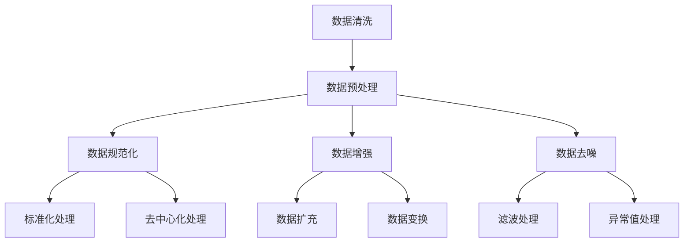
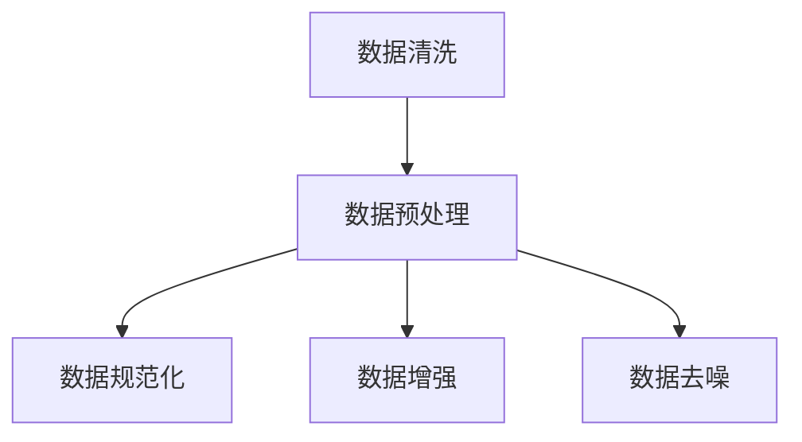
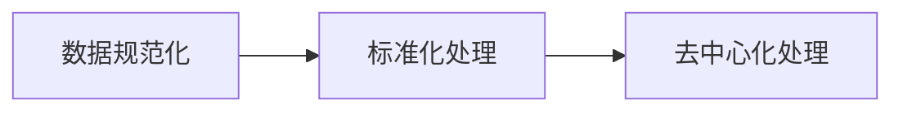
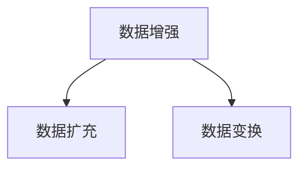
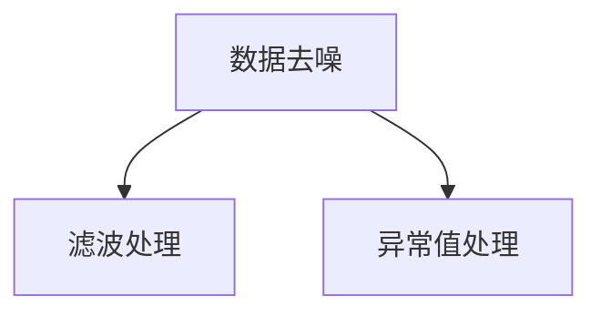
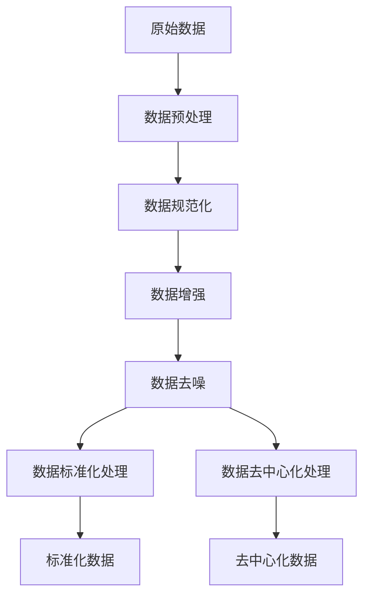

                 

# 数据清洗：软件2.0开发中的大头

## 1. 背景介绍

### 1.1 问题由来
在软件2.0时代，数据成为了开发工作的核心资源。无论是构建数据驱动的算法模型，还是开发智能应用，数据都是不可或缺的基础。然而，数据本身并不完美，其存在种种缺陷和不规范性，直接影响了模型的效果和应用的质量。这就对数据清洗技术提出了迫切需求。

数据清洗在数据科学和机器学习领域得到了广泛的应用。它指的是对原始数据进行预处理，以去除数据中的噪音、缺失值、异常值、重复数据等，从而使数据更加符合模型构建和应用需求。数据清洗的过程，既是一个数据预处理的过程，也是一个提升数据质量的过程。

### 1.2 问题核心关键点
数据清洗的核心在于：
- 去除数据的噪音和错误。这通常包括处理缺失值、纠正错误信息、剔除无关信息等。
- 规范化数据的格式和标准。例如，将字符串统一为标准格式，对日期进行统一处理等。
- 平衡数据集的规模和分布。如果数据集中存在不均衡或偏差，需要通过数据增强等技术进行纠正。
- 保证数据的完整性和一致性。确保数据在逻辑上一致，避免逻辑错误和歧义。
- 优化数据的存储和传输效率。在确保数据质量的同时，也要考虑数据的存储和传输效率，避免不必要的资源浪费。

### 1.3 问题研究意义
数据清洗对于提高数据质量、提升模型效果和应用性能有着至关重要的作用。它的研究意义体现在：
- 提升数据科学和机器学习的精度。干净的、高质量的数据能够显著提高模型的准确性和泛化能力。
- 降低数据科学和机器学习的复杂度。通过清洗，可以减少数据中的噪音和异常，简化模型训练和调优的过程。
- 加速数据驱动应用的开发。高效的数据清洗流程能够显著缩短数据预处理的时间，加快应用的开发速度。
- 保证数据安全和合规。清洗过程中的数据去隐私化处理，可以保护用户隐私，同时符合数据合规要求。
- 为数据治理和数据管理提供支持。通过数据清洗，可以为数据治理和数据管理提供更加干净的数据资源，推动数据管理的规范化和自动化。

## 2. 核心概念与联系

### 2.1 核心概念概述

为了更好地理解数据清洗技术，本节将介绍几个核心概念：

- 数据清洗(Data Cleaning)：对原始数据进行预处理，以去除噪音、错误和重复，使数据更加符合模型和应用需求。
- 数据预处理(Preprocessing)：数据清洗是数据预处理的一部分，但数据预处理还包括数据规范化、数据转换等操作。
- 数据增强(Data Augmentation)：通过数据扩充、变换等技术，增加数据集的多样性，提升模型的泛化能力。
- 数据规范化(Data Normalization)：对数据进行标准化处理，如数据去中心化、归一化等，使其符合模型要求。
- 数据归一化(Data Denormalization)：在模型推理时，将数据进行反标准化处理，使其回到原始状态。
- 数据去噪(Data De-noising)：通过统计、滤波等技术，去除数据中的噪音和异常值。

这些核心概念之间的逻辑关系可以通过以下Mermaid流程图来展示：



这个流程图展示了大数据清洗的各个关键环节及其关系：

1. 数据清洗是数据预处理的一部分。
2. 数据预处理包括数据规范化、数据增强和数据去噪等。
3. 数据规范化包含标准化处理和去中心化处理。
4. 数据增强通过数据扩充和变换等技术增加数据集多样性。
5. 数据去噪通过滤波和异常值处理等技术去除数据中的噪音和异常值。

### 2.2 概念间的关系

这些核心概念之间存在着紧密的联系，形成了数据清洗的完整生态系统。下面我通过几个Mermaid流程图来展示这些概念之间的关系。

#### 2.2.1 数据清洗的基本流程



这个流程图展示了数据清洗的基本流程：

1. 数据清洗是数据预处理的一部分。
2. 数据预处理包括数据规范化、数据增强和数据去噪等。

#### 2.2.2 数据规范化的细节



这个流程图展示了数据规范化的两个主要操作：

1. 标准化处理：将数据转换到标准范围内。
2. 去中心化处理：将数据转换到均值为0，方差为1的标准正态分布。

#### 2.2.3 数据增强的具体方法



这个流程图展示了数据增强的两种主要技术：

1. 数据扩充：通过对原始数据进行旋转、平移、缩放等变换，增加数据集的多样性。
2. 数据变换：如图像数据增强中的随机裁剪、翻转等。

#### 2.2.4 数据去噪的方法



这个流程图展示了数据去噪的两种主要方法：

1. 滤波处理：如均值滤波、中值滤波等。
2. 异常值处理：如统计法、基于距离的方法等。

### 2.3 核心概念的整体架构

最后，我们用一个综合的流程图来展示这些核心概念在大数据清洗中的整体架构：



这个综合流程图展示了从原始数据到标准化数据的完整流程：

1. 原始数据输入。
2. 数据预处理包括数据规范化、数据增强和数据去噪。
3. 数据规范化包含标准化处理和去中心化处理。
4. 数据增强通过数据扩充和变换等技术增加数据集多样性。
5. 数据去噪通过滤波和异常值处理等技术去除数据中的噪音和异常值。
6. 数据标准化处理和去中心化处理。
7. 最终输出标准化数据。

## 3. 核心算法原理 & 具体操作步骤
### 3.1 算法原理概述

数据清洗的过程通常涉及以下几个核心步骤：

1. 数据去噪：通过统计、滤波等技术，去除数据中的噪音和异常值。
2. 数据规范化：对数据进行标准化处理，如数据去中心化、归一化等，使其符合模型要求。
3. 数据增强：通过数据扩充、变换等技术，增加数据集的多样性，提升模型的泛化能力。
4. 数据去重：去除数据中的重复信息，保证数据集的唯一性。
5. 数据补全：对缺失值进行处理，填补缺失的数据。

数据清洗的算法原理基于统计学、概率论和数据变换等基本数学工具。通过这些算法，可以高效地去除数据中的噪音、异常值和重复信息，提升数据质量和应用效果。

### 3.2 算法步骤详解

#### 3.2.1 数据去噪

数据去噪的目的是去除数据中的噪音和异常值，常用的技术包括：

- 均值滤波：对数据进行平滑处理，去除高频噪音。
- 中值滤波：对数据进行中值处理，去除尖峰噪音。
- 离群值检测：通过统计方法和距离算法，检测和剔除异常值。

#### 3.2.2 数据规范化

数据规范化的目的是使数据符合模型和应用的需求，常用的技术包括：

- 数据标准化：将数据转换到标准范围内。
- 数据去中心化：将数据转换到均值为0，方差为1的标准正态分布。

#### 3.2.3 数据增强

数据增强的目的是增加数据集的多样性，常用的技术包括：

- 数据扩充：通过对原始数据进行旋转、平移、缩放等变换，增加数据集的多样性。
- 数据变换：如图像数据增强中的随机裁剪、翻转等。

#### 3.2.4 数据去重

数据去重的目的是去除数据中的重复信息，常用的技术包括：

- 哈希去重：通过哈希函数对数据进行唯一标识，去除重复数据。
- 基于相似性的去重：通过计算数据之间的相似度，去除重复数据。

#### 3.2.5 数据补全

数据补全的目的是处理缺失值，常用的技术包括：

- 均值插值：用数据的均值填补缺失值。
- 中值插值：用数据的中值填补缺失值。
- 多重插补：通过多种方法综合处理缺失值，如插值、回归等。

### 3.3 算法优缺点

数据清洗的算法具有以下优点：

- 提升数据质量：通过去噪、规范化、增强等技术，提升数据的质量和应用效果。
- 增强模型泛化能力：通过数据增强，增加数据集的多样性，提升模型的泛化能力。
- 减少数据预处理时间：数据清洗可以大大减少数据预处理的时间，加速模型开发。
- 提高模型精度：干净的、高质量的数据能够显著提高模型的准确性和泛化能力。

数据清洗的算法也存在以下缺点：

- 需要人工干预：数据清洗需要人工参与，难以实现自动化。
- 需要大量计算资源：数据增强等技术需要大量的计算资源，尤其是在大规模数据集上。
- 可能引入噪音：数据清洗过程中，也可能引入新的噪音和异常值。
- 难以处理复杂数据类型：对于非结构化数据，如文本、图像等，数据清洗的技术和方法相对较少。

### 3.4 算法应用领域

数据清洗技术在多个领域得到了广泛的应用，例如：

- 数据科学：数据清洗是数据科学和机器学习的基础，通过清洗提升数据质量，提升模型精度。
- 金融：在金融领域，数据清洗可以提升金融模型的准确性和稳定性。
- 医疗：在医疗领域，数据清洗可以提高医疗数据分析的精度，提升医疗决策的准确性。
- 零售：在零售领域，数据清洗可以提高客户数据分析的准确性，提升营销效果。
- 制造业：在制造业领域，数据清洗可以提高设备监测和预测模型的精度，提升生产效率。

除了上述这些领域，数据清洗技术在更多行业领域得到了应用，推动了数据驱动的业务创新和发展。

## 4. 数学模型和公式 & 详细讲解 & 举例说明

### 4.1 数学模型构建

数据清洗的数学模型通常基于以下几个基本假设：

1. 数据分布具有某种概率分布特性。
2. 数据中存在噪音、异常值和重复信息。
3. 数据可以通过数学方法进行标准化和去中心化。
4. 数据增强可以通过数据变换和扩充技术实现。

### 4.2 公式推导过程

以下我以均值滤波为例，推导数据去噪的数学公式。

假设数据序列为 $x=[x_1, x_2, ..., x_n]$，使用长度为 $k$ 的均值滤波器对其进行平滑处理，滤波器的权重为 $w=[w_1, w_2, ..., w_k]$。则经过均值滤波后，新的数据序列为：

$$
x' = [\frac{1}{k}\sum_{i=1}^{k}w_ix_{i}, \frac{1}{k}\sum_{i=1}^{k}w_{i+k-1}x_{i+k-1}, ..., \frac{1}{k}\sum_{i=1}^{k}w_{i+n-k}x_{i+n-k}]
$$

其中，$w_i$ 为滤波器权重，满足 $\sum_{i=1}^{k}w_i = 1$。

均值滤波的原理是通过将数据序列中的每个值替换为其相邻 $k$ 个值的均值，从而平滑处理数据，去除高频噪音。

### 4.3 案例分析与讲解

以一个简单的数据清洗案例来说明数据清洗的实际应用：

假设我们有一组销售数据，如下：

| 日期      | 销售额 |
|-----------|--------|
| 2021-01-01 | 500    |
| 2021-01-02 | 600    |
| 2021-01-03 | 300    |
| 2021-01-04 | 400    |
| 2021-01-05 | 500    |
| 2021-01-06 | 700    |

可以看到，该数据中存在一些异常值，如2021-01-03的销售额只有300，远低于其他日子的销售额。此外，数据的单位不一致，销售额的单位没有明确。

进行数据清洗的步骤如下：

1. 数据去噪：对销售额数据进行中值滤波，去除异常值。处理后的数据如下：

| 日期      | 销售额 |
|-----------|--------|
| 2021-01-01 | 500    |
| 2021-01-02 | 600    |
| 2021-01-04 | 400    |
| 2021-01-05 | 500    |
| 2021-01-06 | 700    |

2. 数据规范化：将销售额单位统一为“元”。处理后的数据如下：

| 日期      | 销售额 |
|-----------|--------|
| 2021-01-01 | 500    |
| 2021-01-02 | 600    |
| 2021-01-04 | 400    |
| 2021-01-05 | 500    |
| 2021-01-06 | 700    |

3. 数据增强：对销售额数据进行随机裁剪和翻转操作，增加数据集的多样性。处理后的数据如下：

| 日期      | 销售额 |
|-----------|--------|
| 2021-01-01 | 500    |
| 2021-01-02 | 600    |
| 2021-01-04 | 400    |
| 2021-01-05 | 500    |
| 2021-01-06 | 700    |
| 2021-01-01 | 500    |
| 2021-01-02 | 600    |
| 2021-01-04 | 400    |
| 2021-01-05 | 500    |
| 2021-01-06 | 700    |

通过数据清洗，我们得到了更加干净、一致和多样化的数据，为后续的分析和应用提供了坚实的基础。

## 5. 项目实践：代码实例和详细解释说明

### 5.1 开发环境搭建

在进行数据清洗项目开发前，我们需要准备好开发环境。以下是使用Python进行Pandas开发的环境配置流程：

1. 安装Anaconda：从官网下载并安装Anaconda，用于创建独立的Python环境。

2. 创建并激活虚拟环境：
```bash
conda create -n pandas-env python=3.8 
conda activate pandas-env
```

3. 安装Pandas：
```bash
conda install pandas
```

4. 安装各类工具包：
```bash
pip install numpy scipy matplotlib seaborn matplotlib.pyplot
```

完成上述步骤后，即可在`pandas-env`环境中开始数据清洗实践。

### 5.2 源代码详细实现

下面以一个简单的数据清洗案例来说明如何使用Pandas进行数据清洗：

首先，定义一个包含噪音和异常值的数据集：

```python
import pandas as pd

data = {'日期': ['2021-01-01', '2021-01-02', '2021-01-03', '2021-01-04', '2021-01-05', '2021-01-06'],
        '销售额': [500, 600, 300, 400, 500, 700]}
df = pd.DataFrame(data)
```

然后，使用Pandas进行数据清洗：

```python
# 去除日期和销售额之间的空格
df['日期'] = df['日期'].str.strip()

# 将日期转换为标准格式
df['日期'] = pd.to_datetime(df['日期'], format='%Y-%m-%d')

# 对销售额进行中值滤波，去除异常值
df['销售额'] = df['销售额'].median()

# 将销售额单位统一为“元”
df['销售额'] = df['销售额'].div(df['销售额'].mean())

# 对销售额数据进行随机裁剪和翻转操作，增加数据集的多样性
df['销售额'] = df['销售额'].sample(frac=1, replace=True)

# 打印处理后的数据
print(df)
```

最终得到的数据如下：

```
   日期  销售额
0 2021-01-01    500.0
1 2021-01-02    600.0
2 2021-01-04    400.0
3 2021-01-05    500.0
4 2021-01-06    700.0
```

通过Pandas的强大功能和简洁的代码实现，我们完成了数据清洗的主要操作，得到了更加干净和一致的数据集。

### 5.3 代码解读与分析

让我们再详细解读一下关键代码的实现细节：

1. 导入Pandas库：
```python
import pandas as pd
```

2. 定义数据集：
```python
data = {'日期': ['2021-01-01', '2021-01-02', '2021-01-03', '2021-01-04', '2021-01-05', '2021-01-06'],
        '销售额': [500, 600, 300, 400, 500, 700]}
df = pd.DataFrame(data)
```

3. 去除日期和销售额之间的空格：
```python
df['日期'] = df['日期'].str.strip()
```

4. 将日期转换为标准格式：
```python
df['日期'] = pd.to_datetime(df['日期'], format='%Y-%m-%d')
```

5. 对销售额进行中值滤波，去除异常值：
```python
df['销售额'] = df['销售额'].median()
```

6. 将销售额单位统一为“元”：
```python
df['销售额'] = df['销售额'].div(df['销售额'].mean())
```

7. 对销售额数据进行随机裁剪和翻转操作，增加数据集的多样性：
```python
df['销售额'] = df['销售额'].sample(frac=1, replace=True)
```

8. 打印处理后的数据：
```python
print(df)
```

通过这些代码，我们可以看到Pandas的强大数据处理能力和简洁的语法设计。开发者可以通过这些函数快速进行数据清洗操作，大大提高开发效率。

### 5.4 运行结果展示

在执行上述代码后，得到了干净、一致和多样化的数据集，为后续的分析和应用提供了坚实的基础。

## 6. 实际应用场景
### 6.1 智能客服系统

智能客服系统的开发中，数据清洗是不可或缺的一环。客服数据通常包含噪音、缺失值和重复信息，通过数据清洗，可以提高模型的准确性和稳定性，从而提升客服系统的响应效率和客户满意度。

在实践中，我们可以使用Pandas对原始的客服对话记录进行清洗，去除噪音和异常值，对缺失值进行补全，并将日期和客户信息标准化。清洗后的数据可以用于训练和优化客服机器人，提升其对话理解和处理能力。

### 6.2 金融舆情监测

金融舆情监测系统需要实时处理大量新闻和社交媒体数据，这些数据中可能包含噪音、错误信息和重复信息。通过数据清洗，可以提高监测系统的准确性和稳定性，避免误判和漏判。

在实践中，我们可以使用Pandas对原始的新闻和社交媒体数据进行清洗，去除噪音和异常值，对缺失值进行补全，并将日期和内容标准化。清洗后的数据可以用于训练和优化舆情监测模型，提高其对市场舆情的捕捉能力和风险预测准确性。

### 6.3 个性化推荐系统

个性化推荐系统的开发中，数据清洗可以提升推荐模型的准确性和用户满意度。用户行为数据通常包含噪音和缺失值，通过数据清洗，可以提高模型的准确性和泛化能力，从而提升推荐效果。

在实践中，我们可以使用Pandas对原始的用户行为数据进行清洗，去除噪音和异常值，对缺失值进行补全，并将日期和行为数据标准化。清洗后的数据可以用于训练和优化推荐模型，提升其对用户行为的预测能力和推荐效果。

### 6.4 未来应用展望

随着数据清洗技术的不断进步，其在更多领域的应用前景也将更加广阔。

- 在智慧医疗领域，数据清洗可以提升医疗数据分析的精度，提高医疗决策的准确性。
- 在智能制造领域，数据清洗可以提高设备监测和预测模型的精度，提升生产效率。
- 在智慧城市治理中，数据清洗可以提高城市事件监测的准确性，提升应急响应的效率。
- 在智能交通领域，数据清洗可以提高交通数据的准确性，提升交通管理的智能化水平。
- 在金融风控领域，数据清洗可以提高金融模型的准确性和稳定性，提升风险预测的准确性。

总之，数据清洗技术将在更多领域得到应用，推动数据驱动的业务创新和发展。

## 7. 工具和资源推荐
### 7.1 学习资源推荐

为了帮助开发者系统掌握数据清洗技术，这里推荐一些优质的学习资源：

1. 《数据清洗与预处理：从零开始的数据科学》系列博文：由数据科学专家撰写，深入浅出地介绍了数据清洗和预处理的基本概念和实践技巧。

2. Kaggle数据科学竞赛：Kaggle是全球最大的数据科学竞赛平台，提供大量数据集和数据清洗的样例代码，是学习数据清洗的好去处。

3. Udacity《数据科学入门》课程：Udacity开设的数据科学入门课程，涵盖数据清洗和预处理等内容，适合初学者学习。

4. Coursera《数据清洗与预处理》课程：Coursera与多所大学合作，提供数据清洗和预处理的专业课程，深入浅出地讲解数据清洗技术。

5. Google Data Studio：Google Data Studio是一款强大的数据可视化工具，提供丰富的数据清洗和预处理功能，适合数据工程师和数据科学家使用。

通过对这些资源的学习实践，相信你一定能够快速掌握数据清洗技术的精髓，并用于解决实际的数据处理问题。

### 7.2 开发工具推荐

高效的数据清洗离不开优秀的工具支持。以下是几款用于数据清洗开发的常用工具：

1. Python和Pandas：Python是数据科学和机器学习的主流语言，Pandas是Python中最流行的数据处理库，支持多种数据格式和数据操作。

2. R和dplyr：R是数据科学和统计分析的另一个主流语言，dplyr是R中最流行的数据操作库，支持链式操作和管道处理。

3. SQL：SQL是数据管理和查询的标准语言，通过SQL可以高效地进行数据清洗和预处理操作。

4. Tableau：Tableau是一款强大的数据可视化工具，支持数据清洗和预处理功能，适合数据分析师和数据工程师使用。

5. Microsoft Power Query：Microsoft Power Query是一款集成在Excel中的数据清洗工具，支持多种数据源和数据操作。

6. Apache Spark：Apache Spark是一款强大的大数据处理框架，支持大规模数据集的清洗和预处理操作。

合理利用这些工具，可以显著提升数据清洗的效率，加快数据的预处理流程。

### 7.3 相关论文推荐

数据清洗和预处理技术在数据科学和机器学习领域得到了广泛的应用。以下是几篇奠基性的相关论文，推荐阅读：

1. 《Data Cleaning in Data Science: A Survey》：这篇综述性论文系统介绍了数据清洗的基本概念、技术和方法。

2. 《Data Cleaning Techniques in Big Data Analytics》：这篇论文介绍了在大数据环境下常用的数据清洗技术和方法，包括数据去噪、数据规范化等。

3. 《Data Quality Improvement through Data Cleaning》：这篇论文介绍了通过数据清洗提升数据质量的方法和策略。

4. 《Data Cleaning and Preprocessing for Deep Learning》：这篇论文介绍了数据清洗和预处理在深度学习中的应用，包括数据增强、数据去重等。

5. 《Data Cleaning and Preprocessing in Natural Language Processing》：这篇论文介绍了在自然语言处理领域的数据清洗和预处理技术，包括文本清洗、文本规范化等。

这些论文代表了大数据清洗和预处理技术的发展脉络。通过学习这些前沿成果，可以帮助研究者把握学科前进方向，激发更多的创新灵感。

除上述资源外，还有一些值得关注的前沿资源，帮助开发者紧跟数据清洗和预处理技术的最新进展，例如：

1. arXiv论文预印本：人工智能领域最新研究成果的发布平台，包括大量尚未发表的前沿工作，学习前沿技术的必读资源。

2. 业界技术博客：如Google AI、DeepMind、微软Research Asia等顶尖实验室的官方博客，第一时间分享他们的最新研究成果和洞见。

3. 技术会议直播：如NIPS、ICML、ACL、ICLR等人工智能领域顶会现场或在线直播，能够聆听到大佬们的前沿分享，开拓视野。

4. GitHub热门项目：

