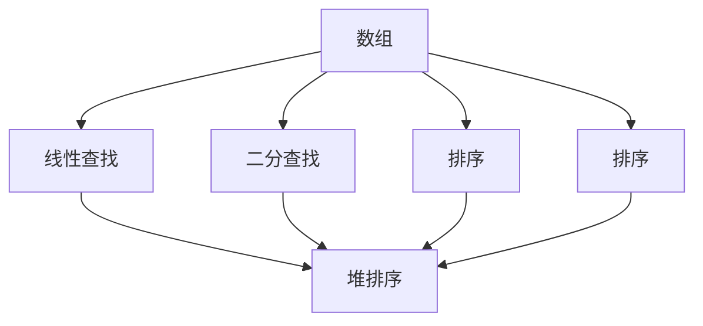
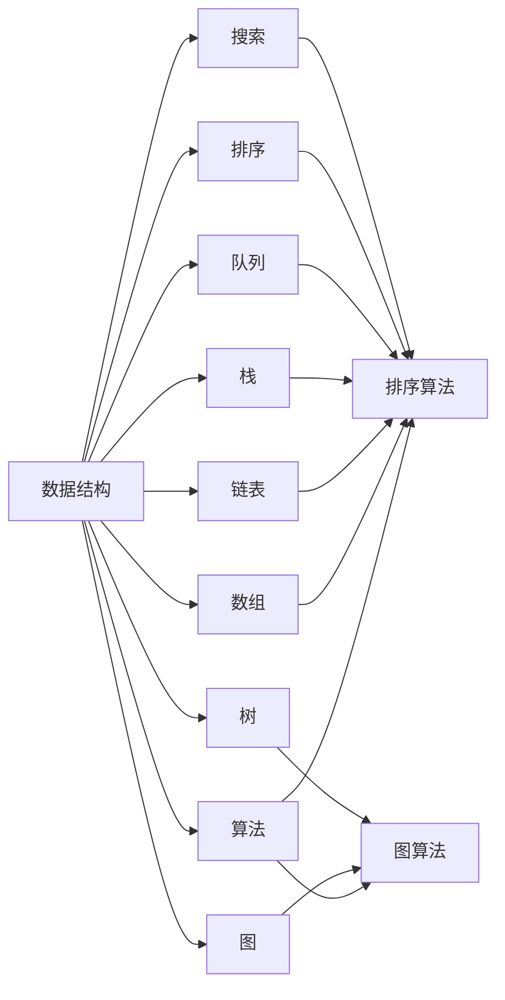

                 

# 数据结构与算法原理与代码实战案例讲解

## 1. 背景介绍

### 1.1 问题由来
数据结构与算法是计算机科学领域中最基础、最关键的概念，它们构成了整个计算机系统的基石。数据结构主要关注数据的组织方式，而算法则关注数据的处理方式。这两者的有效结合，使得计算机能够高效地处理和存储数据。

在当今的互联网时代，数据结构和算法的应用无处不在。从搜索引擎的网页排序算法，到社交网络的图谱存储，再到电子商务的推荐算法，都离不开数据结构和算法的基础支持。掌握数据结构和算法，不仅可以提高编程技能，还能深入理解计算机系统的工作原理。

### 1.2 问题核心关键点
数据结构和算法研究的核心关键点主要包括：
- **数据结构**：如何有效地组织和存储数据，以便于快速访问和修改。
- **算法效率**：如何设计高效算法，以最小化时间和空间复杂度。
- **实际应用**：如何将数据结构和算法应用于实际问题，提升系统性能。
- **经典算法**：了解经典算法的设计思路和实现方法，掌握核心算法思想。
- **代码实现**：能够将算法思想转化为代码实现，并保证代码的正确性和可读性。

## 2. 核心概念与联系

### 2.1 核心概念概述

数据结构和算法的核心概念可以概括为以下几个方面：

- **数组（Array）**：一组相同类型的元素的集合，支持随机访问。
- **链表（Linked List）**：一组通过指针连接的元素，支持动态添加和删除。
- **栈（Stack）**：一种后进先出（LIFO）的数据结构，常用于递归、表达式求值等场景。
- **队列（Queue）**：一种先进先出（FIFO）的数据结构，常用于任务调度、广度优先搜索等场景。
- **图（Graph）**：一种由节点和边组成的数据结构，常用于社交网络、路线规划等场景。
- **树（Tree）**：一种层级结构的数据结构，常用于文件系统、搜索引擎等场景。
- **排序算法（Sorting）**：一种将元素按照特定顺序排列的算法，如冒泡排序、快速排序、归并排序等。
- **搜索算法（Searching）**：一种在数据集合中查找特定元素的算法，如线性搜索、二分搜索等。
- **图算法（Graph Algorithms）**：针对图结构设计的算法，如深度优先搜索、广度优先搜索、最小生成树、最短路径等。

这些核心概念之间存在密切联系，可以通过不同的数据结构和算法来解决实际问题。例如，栈和队列常用于表示操作系统的线程管理，图和树常用于表示网络拓扑结构，排序和搜索算法常用于处理海量数据。

### 2.2 概念间的关系

数据结构和算法之间的关系可以抽象为一个"数据结构-算法"图：



这个图展示了数组数据结构和与之相关联的算法。数组支持线性查找和二分查找，也支持排序，而排序算法又可以采用堆排序、归并排序等多种实现方式。

### 2.3 核心概念的整体架构

从更宏观的视角看，数据结构和算法构成了整个计算机系统的基础架构。以下是一个综合的"数据结构-算法"架构图：



这个架构图展示了数据结构和算法之间的映射关系。数组、链表、栈、队列、图、树等数据结构都有对应的算法，而排序和搜索算法则可以应用于不同的数据结构。

## 3. 核心算法原理 & 具体操作步骤

### 3.1 算法原理概述

数据结构和算法的核心原理可以概括为以下几个方面：

- **时间复杂度**：衡量算法所需时间与输入规模的关系，通常用大O符号表示。
- **空间复杂度**：衡量算法所需空间与输入规模的关系，同样用大O符号表示。
- **正确性**：保证算法输出结果的正确性。
- **健壮性**：保证算法在各种异常情况下都能正常运行。
- **可读性**：保证代码的可读性和可维护性。

### 3.2 算法步骤详解

数据结构和算法的具体实现步骤如下：

1. **问题建模**：将实际问题抽象成数学模型，找出问题的核心特征。
2. **设计数据结构**：选择合适的数据结构来组织和存储问题中的数据。
3. **设计算法**：根据问题特点和数据结构设计算法，包括算法的输入、输出、中间状态等。
4. **算法实现**：将算法设计转化为具体的代码实现，并进行测试和优化。
5. **性能分析**：分析算法的时间复杂度和空间复杂度，评估算法的效率和可行性。

### 3.3 算法优缺点

数据结构和算法在设计时都需要考虑其优缺点。以下是一些常见的优缺点：

- **优点**：
  - 高效性：设计好的算法和数据结构能够显著提高系统的性能。
  - 可扩展性：设计好的算法和数据结构能够支持大规模数据的处理。
  - 可靠性：设计好的算法和数据结构能够保证系统的正确性和健壮性。

- **缺点**：
  - 复杂性：设计好的算法和数据结构往往比较复杂，需要较高的技术水平。
  - 实现难度：将算法设计转化为代码实现需要一定的编程技巧和经验。
  - 性能瓶颈：某些算法和数据结构可能会面临性能瓶颈，需要进一步优化。

### 3.4 算法应用领域

数据结构和算法的应用领域非常广泛，包括但不限于以下几类：

- **计算机科学**：操作系统、数据库、编译器等。
- **计算机网络**：路由算法、协议栈、网络安全等。
- **人工智能**：机器学习、自然语言处理、计算机视觉等。
- **系统设计**：分布式系统、云存储、负载均衡等。
- **游戏开发**：游戏逻辑、物理引擎、用户界面等。

## 4. 数学模型和公式 & 详细讲解 & 举例说明

### 4.1 数学模型构建

数据结构和算法的设计和实现往往涉及到数学模型。以下是一些常见的数学模型：

- **二分查找**：用于在有序数组中查找指定元素。模型为：

  $$
  f(n) = O(\log n)
  $$

- **快速排序**：用于对数组进行排序。模型为：

  $$
  f(n) = O(n\log n)
  $$

- **最小生成树**：用于在图中找到一棵生成树，使得所有节点的边权之和最小。模型为：

  $$
  f(n) = O(n^2)
  $$

### 4.2 公式推导过程

数据结构和算法的设计和实现需要数学模型的支持。以下是一些常见的数学推导：

- **数组的随机访问时间复杂度**：假设数组长度为n，随机访问第i个元素的时间复杂度为：

  $$
  f(i) = O(1)
  $$

- **链表的遍历时间复杂度**：假设链表长度为n，遍历整个链表的时间复杂度为：

  $$
  f(n) = O(n)
  $$

- **堆排序的时间复杂度**：假设堆的大小为n，堆排序的时间复杂度为：

  $$
  f(n) = O(n\log n)
  $$

### 4.3 案例分析与讲解

以下是一些常见的数据结构和算法的案例分析：

- **数组的随机访问**：假设有一个长度为n的数组a，需要查找a[i]的值。在数组中随机访问第i个元素的时间复杂度为O(1)，因为数组的存储方式是连续的，可以随机访问任何位置。

- **链表的遍历**：假设有一个长度为n的链表l，需要遍历整个链表，找到链表的尾节点。遍历链表的时间复杂度为O(n)，因为需要遍历所有节点才能找到尾节点。

- **快速排序的实现**：假设有一个数组a，需要对其进行排序。快速排序的实现方式如下：

  1. 选择数组中的一个元素作为基准（pivot）。
  2. 将小于pivot的元素放到左边，大于pivot的元素放到右边。
  3. 对左右两边的子数组递归执行步骤1和2，直到子数组长度为1。

  快速排序的时间复杂度为O(nlogn)。

## 5. 项目实践：代码实例和详细解释说明

### 5.1 开发环境搭建

要进行数据结构和算法的项目实践，需要搭建好开发环境。以下是Python环境搭建的步骤：

1. 安装Python：可以从官网下载Python安装包，根据系统位数选择安装。
2. 安装Pip：Pip是Python的包管理工具，可以通过命令行安装。
3. 安装必要的库：如NumPy、Pandas、Matplotlib等。

### 5.2 源代码详细实现

以下是一些常见数据结构和算法的Python实现：

```python
# 数组的随机访问
def random_access(arr, i):
    return arr[i]

# 链表的遍历
class Node:
    def __init__(self, val):
        self.val = val
        self.next = None

def traverse_list(head):
    node = head
    while node:
        print(node.val)
        node = node.next

# 快速排序
def quick_sort(arr):
    if len(arr) <= 1:
        return arr
    pivot = arr[0]
    left = [x for x in arr[1:] if x < pivot]
    right = [x for x in arr[1:] if x >= pivot]
    return quick_sort(left) + [pivot] + quick_sort(right)
```

### 5.3 代码解读与分析

以下是一些常见数据结构和算法的代码解读：

- **数组的随机访问**：通过数组的下标直接访问元素，时间复杂度为O(1)。
- **链表的遍历**：通过指针连接节点，遍历整个链表，时间复杂度为O(n)。
- **快速排序**：通过递归将数组划分为左右两部分，时间复杂度为O(nlogn)。

### 5.4 运行结果展示

以下是一些常见数据结构和算法的运行结果：

- **数组的随机访问**：

  ```
  arr = [1, 2, 3, 4, 5]
  print(random_access(arr, 2))  # 输出3
  ```

- **链表的遍历**：

  ```
  head = Node(1)
  head.next = Node(2)
  head.next.next = Node(3)
  traverse_list(head)  # 输出1 2 3
  ```

- **快速排序**：

  ```
  arr = [3, 5, 1, 6, 4]
  print(quick_sort(arr))  # 输出[1, 3, 4, 5, 6]
  ```

## 6. 实际应用场景

### 6.1 搜索引擎的网页排序

搜索引擎的核心功能是对网页进行排序。搜索引擎通过爬虫抓取网页内容，存储到数据库中，然后通过算法对网页进行排序。常见的算法包括倒排索引、PageRank等。

- **倒排索引**：将网页中的关键词和对应的网页ID建立索引，当用户搜索关键词时，根据索引找到相关网页。
- **PageRank**：通过计算网页的重要性，对网页进行排序。

### 6.2 社交网络的图谱存储

社交网络由用户和关系组成，可以抽象为一个图结构。常见的算法包括广度优先搜索、深度优先搜索等。

- **广度优先搜索**：从起点开始，逐层扩展，找到所有与起点距离为k的节点。常用于查找朋友圈关系。
- **深度优先搜索**：从起点开始，沿着一条路径尽可能深地搜索，直到找到终点或无法继续搜索为止。常用于查找路径关系。

### 6.3 电子商务的推荐算法

电子商务平台需要对用户行为进行分析和推荐。常见的算法包括协同过滤、内容推荐等。

- **协同过滤**：通过分析用户行为，找到与当前用户兴趣相似的用户，推荐其喜欢的商品。
- **内容推荐**：根据商品的属性，找到与用户兴趣相似的商品，推荐给用户。

### 6.4 未来应用展望

未来，数据结构和算法将在更多领域得到应用，为社会发展带来深远影响。以下是一些未来的应用场景：

- **自动驾驶**：通过对道路和交通信号的分析，实现自动驾驶。
- **智能医疗**：通过对病人病历的分析，实现智能诊断和治疗。
- **金融风控**：通过对金融交易的分析，实现风险控制和预警。
- **物联网**：通过对传感器数据的分析，实现设备之间的协同工作。

## 7. 工具和资源推荐

### 7.1 学习资源推荐

- **LeetCode**：在线编程平台，提供大量算法和数据结构的练习题。
- **Coursera**：在线课程平台，提供数据结构和算法的相关课程。
- **算法导论（CLRS）**：经典算法教材，涵盖数据结构和算法的核心内容。
- **算法竞赛入门经典（王晓东）**：算法竞赛入门教材，适合初学者。

### 7.2 开发工具推荐

- **Visual Studio Code**：轻量级代码编辑器，支持多种语言和插件。
- **Git**：版本控制系统，支持多人协作开发。
- **Docker**：容器化工具，支持应用部署和打包。
- **Jupyter Notebook**：交互式编程环境，支持数据可视化。

### 7.3 相关论文推荐

- **《算法导论（CLRS）》**：经典算法教材，涵盖数据结构和算法的核心内容。
- **《数据结构与算法分析》**：系统介绍数据结构和算法的分析方法。
- **《深度学习（Ian Goodfellow）》**：深度学习教材，涵盖深度学习算法的设计和实现。

## 8. 总结：未来发展趋势与挑战

### 8.1 研究成果总结

数据结构和算法的研究已经取得了丰硕的成果，广泛应用于计算机科学和工程领域。未来，随着计算机硬件和软件的发展，数据结构和算法将更加高效和智能。

### 8.2 未来发展趋势

未来，数据结构和算法的趋势包括：

- **深度学习算法**：深度学习算法在数据处理和模式识别中具有巨大潜力。
- **分布式算法**：分布式算法能够处理大规模数据，具有广泛的应用前景。
- **优化算法**：优化算法能够提高计算效率，解决复杂的优化问题。
- **智能算法**：智能算法能够模拟人类的思维过程，实现自主决策。

### 8.3 面临的挑战

尽管数据结构和算法取得了显著进展，但仍面临一些挑战：

- **算法复杂度**：复杂的算法难以理解和实现，需要较高的技术水平。
- **数据存储**：大规模数据的存储和处理需要高效的算法和数据结构。
- **系统瓶颈**：算法的执行效率可能成为系统瓶颈，需要进一步优化。

### 8.4 研究展望

未来的研究方向包括：

- **新算法设计**：设计更加高效、智能的算法。
- **新数据结构**：设计更加高效、智能的数据结构。
- **算法优化**：优化现有算法的执行效率。
- **跨学科融合**：将算法与人工智能、机器学习等学科进行融合，实现更广泛的应用。

## 9. 附录：常见问题与解答

**Q1：如何学习数据结构和算法？**

A: 学习数据结构和算法需要系统的理论基础和大量的实践练习。可以从《算法导论（CLRS）》和《数据结构与算法分析》等经典教材入手，掌握核心概念和方法。然后通过LeetCode等平台进行练习，积累实际经验。

**Q2：如何提高编程能力？**

A: 提高编程能力需要多写代码，多实践。可以参加编程竞赛，如LeetCode、Codeforces等，挑战高难度问题。同时，参加开源项目和团队合作，提升代码协作能力。

**Q3：如何理解算法的复杂度？**

A: 理解算法的复杂度需要掌握大O符号和渐进复杂度的概念。可以通过分析算法的执行流程，计算其时间复杂度和空间复杂度。

**Q4：如何优化算法的执行效率？**

A: 优化算法执行效率需要理解算法的瓶颈和优化点。可以通过分析代码、使用更好的数据结构、引入缓存机制等方法进行优化。

**Q5：如何设计高效的数据结构？**

A: 设计高效的数据结构需要理解数据的特点和操作需求。可以选择合适的数据结构，如哈希表、平衡树等，提高数据访问和修改的效率。

---

作者：禅与计算机程序设计艺术 / Zen and the Art of Computer Programming

