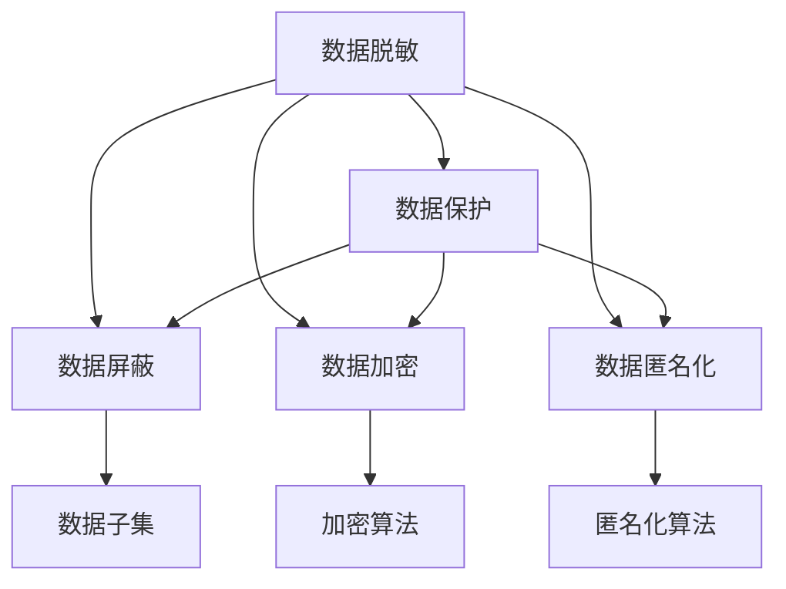
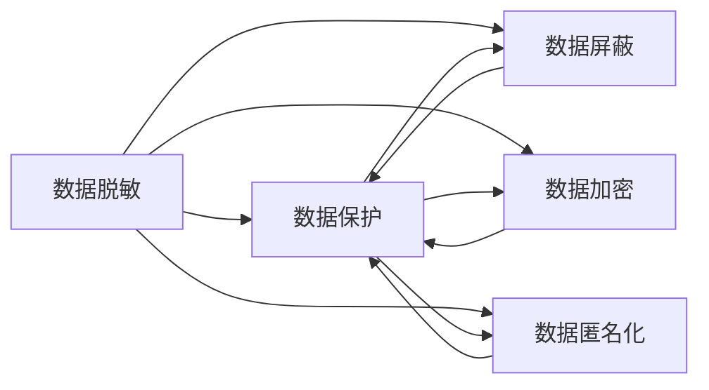
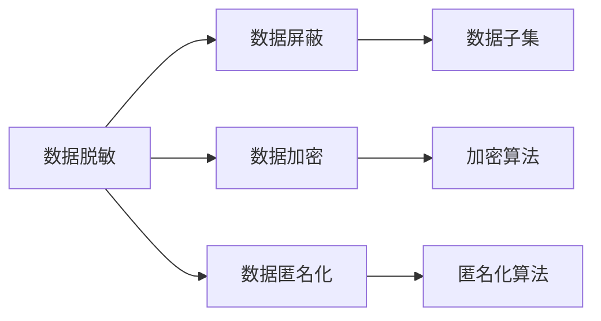
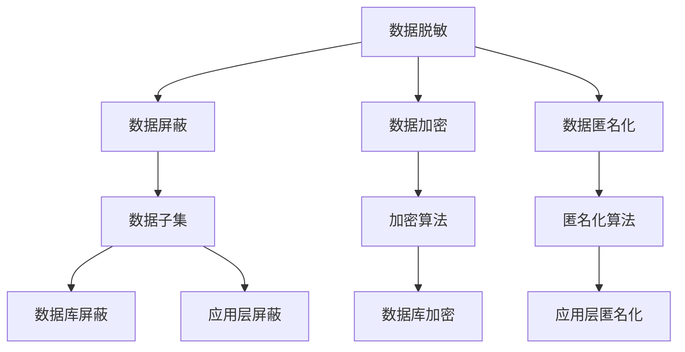
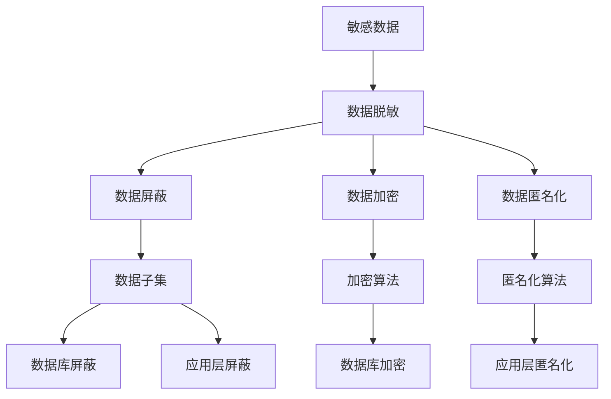

                 

# 数据脱敏与数据安全原理与代码实战案例讲解

> 关键词：数据脱敏, 数据安全, 数据保护, 隐私, 代码实战, 数据加密, 数据屏蔽

## 1. 背景介绍

### 1.1 问题由来

在数字化时代，数据已成为企业核心资产的重要组成部分，广泛应用于决策支持、业务运营、客户关系管理等领域。然而，随着数据规模的不断扩大，企业面临的数据安全和隐私保护压力也日益增大。一方面，数据泄露事件频发，给企业带来重大损失；另一方面，严格的数据保护法规如GDPR、CCPA等，对数据处理提出了越来越高的要求。

数据脱敏技术作为保护数据隐私的重要手段之一，在信息安全领域应用广泛。通过对敏感数据进行屏蔽、替换、模糊化等操作，数据脱敏可以有效减少数据泄露风险，同时保留数据的可用性和分析价值。本文将详细阐述数据脱敏技术的原理、实现方法及代码实战案例，为读者提供全面的技术指导。

### 1.2 问题核心关键点

数据脱敏的核心在于如何在保证数据可用性的前提下，最大限度地保护数据隐私。其关键点包括：

1. 敏感数据的识别与分类：明确哪些数据属于敏感信息，如身份证号、信用卡号、隐私信息等。
2. 脱敏算法的选择与应用：选择合适的脱敏算法，如数据替换、数据截断、数据模糊化等，对敏感数据进行屏蔽。
3. 脱敏效果的评估与优化：评估脱敏后的数据质量，确保其对业务分析的有效性，同时满足法规要求。

本文将围绕上述关键点，深入探讨数据脱敏技术，并通过具体代码案例，展示其实现流程和应用场景。

### 1.3 问题研究意义

数据脱敏技术在数据安全领域具有重要意义：

1. 保障数据隐私：通过屏蔽敏感信息，有效防止数据泄露，保护用户隐私。
2. 提升数据安全：增强数据系统的抗攻击能力，减少数据泄露风险。
3. 合法合规：符合国际和国内的数据保护法规，确保数据处理的合法性。
4. 提高数据利用效率：在保证数据隐私的同时，确保数据的可用性和分析价值。

通过学习数据脱敏技术，企业和开发者可以更好地应对数据安全和隐私保护挑战，提升数据处理的合规性和安全性。

## 2. 核心概念与联系

### 2.1 核心概念概述

为更好地理解数据脱敏技术，本节将介绍几个密切相关的核心概念：

- 数据脱敏(Data Masking)：通过对数据进行屏蔽、替换、模糊化等操作，去除或替代敏感信息，保护数据隐私。
- 数据保护(Data Protection)：采用各种技术和手段，确保数据的安全性和隐私性，防止数据泄露和滥用。
- 数据屏蔽(Data Sharding)：将数据分成多个子集，仅公开子集中的部分数据，增强数据的安全性。
- 数据加密(Data Encryption)：通过算法将数据转换为不可读的格式，保护数据隐私和安全。
- 数据匿名化(Data Anonymization)：去除或替换个人识别信息，使得数据无法与特定个人关联，保护数据隐私。

这些概念之间的逻辑关系可以通过以下Mermaid流程图来展示：



这个流程图展示了数据脱敏与其他数据保护措施之间的关系：

1. 数据脱敏作为一种基础的数据保护手段，可以通过屏蔽、替换等方式去除敏感信息。
2. 数据屏蔽通过将数据分成多个子集，增强数据的安全性。
3. 数据加密通过算法将数据转换为不可读的格式，保护数据隐私。
4. 数据匿名化通过去除或替换个人识别信息，使得数据无法与特定个人关联。

这些措施共同构成了数据保护的整体框架，使企业能够更全面地应对数据安全和隐私保护的挑战。

### 2.2 概念间的关系

这些核心概念之间存在着紧密的联系，形成了数据保护的整体生态系统。下面我们通过几个Mermaid流程图来展示这些概念之间的关系。

#### 2.2.1 数据脱敏与数据保护的关系



这个流程图展示了数据脱敏与其他数据保护措施之间的关系。数据脱敏是数据保护的一个重要组成部分，通过屏蔽、替换等方式去除敏感信息，增强数据的安全性和隐私性。

#### 2.2.2 数据脱敏方法的多样性



这个流程图展示了数据脱敏方法的多种实现方式。数据屏蔽通过将数据分成多个子集，增加安全性。数据加密和数据匿名化分别通过算法将数据转换为不可读或无法关联的形式，保护数据隐私。

#### 2.2.3 数据脱敏的层次性



这个流程图展示了数据脱敏的层次性。从数据库屏蔽、应用层屏蔽到数据库加密、应用层匿名化，数据脱敏技术可以应用于不同的数据处理层次，提升数据的安全性和隐私性。

### 2.3 核心概念的整体架构

最后，我们用一个综合的流程图来展示数据脱敏的整体架构：



这个综合流程图展示了从敏感数据到最终脱敏后的数据，涉及到的各个环节。数据脱敏技术通过屏蔽、加密、匿名化等方式，逐步提高数据的安全性和隐私性，最终保障数据的安全。

## 3. 核心算法原理 & 具体操作步骤
### 3.1 算法原理概述

数据脱敏算法主要分为两类：基于规则的脱敏算法和基于模型的脱敏算法。基于规则的算法通过预先定义的规则，对数据进行屏蔽或替换；基于模型的算法则通过机器学习模型预测敏感信息的分布，进行有针对性的屏蔽。

#### 3.1.1 基于规则的脱敏算法

基于规则的脱敏算法简单高效，适用于数据量较大且敏感信息分布较为明确的情况。其基本流程如下：

1. 确定敏感信息类型：如身份证号、信用卡号等。
2. 定义屏蔽规则：如将身份证号的后几位替换为“*”，将信用卡号的后几位随机替换。
3. 执行屏蔽操作：根据规则对敏感信息进行屏蔽或替换。

#### 3.1.2 基于模型的脱敏算法

基于模型的脱敏算法通过机器学习模型预测敏感信息的分布，进行更加精准的屏蔽。其基本流程如下：

1. 收集训练数据：收集大量带有标签的敏感数据和非敏感数据。
2. 训练模型：使用训练数据训练模型，如神经网络、决策树等，预测数据是否为敏感信息。
3. 执行屏蔽操作：根据模型的预测结果，对敏感信息进行屏蔽或替换。

### 3.2 算法步骤详解

#### 3.2.1 基于规则的脱敏算法步骤

1. **数据预处理**：对数据进行清洗、去重等处理，确保数据的准确性和一致性。
2. **确定敏感信息**：根据业务需求和法律法规，确定哪些数据属于敏感信息，需要脱敏处理。
3. **定义屏蔽规则**：根据敏感信息类型，定义相应的屏蔽规则，如身份证号替换为“*”，信用卡号后几位随机替换。
4. **执行屏蔽操作**：根据规则对敏感信息进行屏蔽或替换，生成脱敏后的数据。

#### 3.2.2 基于模型的脱敏算法步骤

1. **数据预处理**：对数据进行清洗、去重等处理，确保数据的准确性和一致性。
2. **收集训练数据**：收集大量带有标签的敏感数据和非敏感数据，用于训练模型。
3. **训练模型**：使用训练数据训练模型，预测数据是否为敏感信息。
4. **执行屏蔽操作**：根据模型的预测结果，对敏感信息进行屏蔽或替换，生成脱敏后的数据。

### 3.3 算法优缺点

#### 3.3.1 基于规则的脱敏算法

**优点**：
- 简单高效：规则易于定义和理解，执行速度快。
- 易于维护：规则可以根据需求灵活调整，维护成本低。

**缺点**：
- 灵活性不足：规则一旦设定，难以根据数据变化进行调整。
- 精度有限：规则可能无法准确识别所有敏感信息。

#### 3.3.2 基于模型的脱敏算法

**优点**：
- 灵活性强：模型可以根据数据变化进行动态调整，适应性更强。
- 精度高：通过机器学习，可以更准确地识别和屏蔽敏感信息。

**缺点**：
- 复杂度高：模型训练需要大量数据和计算资源。
- 难以解释：模型预测过程难以直观理解，缺乏透明度。

### 3.4 算法应用领域

数据脱敏技术在多个领域得到了广泛应用，如金融、医疗、政府、企业等。以下是几个典型的应用场景：

1. **金融行业**：银行和金融机构需要保护客户隐私，对客户的账户信息、交易记录等敏感数据进行脱敏处理。
2. **医疗行业**：医疗机构需要保护病患隐私，对病历记录、诊断信息等敏感数据进行脱敏处理。
3. **政府机构**：政府部门需要保护公民隐私，对人口普查、人口统计等敏感数据进行脱敏处理。
4. **企业应用**：企业在进行数据分析和业务测试时，需要对用户数据进行脱敏处理，防止数据泄露。

## 4. 数学模型和公式 & 详细讲解  
### 4.1 数学模型构建

基于模型的数据脱敏算法通常采用二分类模型，预测数据是否为敏感信息。假设原始数据集为 $D=\{(x_i, y_i)\}_{i=1}^N$，其中 $x_i$ 为样本特征向量，$y_i$ 为敏感信息标签，$y_i \in \{0, 1\}$，$y_i=1$ 表示 $x_i$ 为敏感信息，$y_i=0$ 表示 $x_i$ 为非敏感信息。

模型的目标是最小化交叉熵损失函数：

$$
\mathcal{L}(h) = -\frac{1}{N}\sum_{i=1}^N (y_i \log h(x_i) + (1-y_i) \log (1-h(x_i)))
$$

其中 $h(x_i)$ 为模型对 $x_i$ 是否为敏感信息的预测，$\log$ 为自然对数。

### 4.2 公式推导过程

假设模型为二分类逻辑回归模型，输出层为：

$$
h(x_i) = \sigma(Wx_i + b)
$$

其中 $W$ 为权重矩阵，$b$ 为偏置项，$\sigma$ 为sigmoid激活函数。模型的损失函数为：

$$
\mathcal{L}(h) = -\frac{1}{N}\sum_{i=1}^N (y_i \log \sigma(Wx_i + b) + (1-y_i) \log (1-\sigma(Wx_i + b)))
$$

通过对模型进行随机梯度下降优化，不断更新权重矩阵 $W$ 和偏置项 $b$，最小化交叉熵损失函数，训练得到敏感信息预测模型 $h(x)$。

### 4.3 案例分析与讲解

以身份证号为例，假设原始数据集 $D$ 包含大量身份证号，我们需要对其中的部分身份证号进行脱敏处理。具体步骤如下：

1. **数据预处理**：清洗、去重数据集，确保数据准确性和一致性。
2. **模型训练**：收集带有标签的身份证号数据，如前几位为“110101”的身份证号为敏感信息，后几位为“xxxxxx”的身份证号为非敏感信息。使用逻辑回归模型训练模型 $h(x)$。
3. **执行屏蔽操作**：对于敏感信息标签为1的身份证号，进行替换操作，如将后几位替换为“*”；对于敏感信息标签为0的身份证号，不进行任何处理。

## 5. 项目实践：代码实例和详细解释说明
### 5.1 开发环境搭建

在进行数据脱敏实践前，我们需要准备好开发环境。以下是使用Python进行PyTorch开发的环境配置流程：

1. 安装Anaconda：从官网下载并安装Anaconda，用于创建独立的Python环境。

2. 创建并激活虚拟环境：
```bash
conda create -n pytorch-env python=3.8 
conda activate pytorch-env
```

3. 安装PyTorch：根据CUDA版本，从官网获取对应的安装命令。例如：
```bash
conda install pytorch torchvision torchaudio cudatoolkit=11.1 -c pytorch -c conda-forge
```

4. 安装Pandas、Numpy等工具包：
```bash
pip install pandas numpy
```

5. 安装PyTorch预训练模型库：
```bash
pip install pytorch-transformers
```

完成上述步骤后，即可在`pytorch-env`环境中开始数据脱敏实践。

### 5.2 源代码详细实现

这里我们以身份证号的脱敏为例，给出使用PyTorch进行数据脱敏的代码实现。

首先，定义数据集：

```python
import pandas as pd
import torch
from torch.utils.data import Dataset
import torch.nn as nn
import torch.optim as optim

class IdCardDataset(Dataset):
    def __init__(self, data_path):
        self.data = pd.read_csv(data_path, header=None)
        self.data.columns = ['id_card']
        self.data['is_sensitive'] = self.data['id_card'].apply(lambda x: 1 if x.startswith('110101') else 0)
        
    def __len__(self):
        return len(self.data)
    
    def __getitem__(self, idx):
        id_card = self.data.iloc[idx]['id_card']
        is_sensitive = self.data.iloc[idx]['is_sensitive']
        id_card = id_card.replace(id_card[-8:], 'xxxxxx') if is_sensitive else id_card
        return id_card, is_sensitive
```

然后，定义模型：

```python
class IdCardMaskModel(nn.Module):
    def __init__(self):
        super(IdCardMaskModel, self).__init__()
        self.fc1 = nn.Linear(18, 16)
        self.fc2 = nn.Linear(16, 1)
        self.sigmoid = nn.Sigmoid()
        
    def forward(self, x):
        x = x.view(-1, 18)
        x = self.fc1(x)
        x = self.fc2(x)
        x = self.sigmoid(x)
        return x

model = IdCardMaskModel()
model.to('cuda')
```

接着，定义训练和评估函数：

```python
def train_epoch(model, data_loader, optimizer):
    model.train()
    loss = 0
    for batch in data_loader:
        id_card, is_sensitive = batch
        id_card = torch.tensor(id_card).to('cuda')
        is_sensitive = torch.tensor(is_sensitive).to('cuda')
        optimizer.zero_grad()
        output = model(id_card)
        loss += nn.BCELoss()(output, is_sensitive).item()
        loss.backward()
        optimizer.step()
    return loss / len(data_loader)

def evaluate(model, data_loader):
    model.eval()
    correct = 0
    total = 0
    with torch.no_grad():
        for batch in data_loader:
            id_card, is_sensitive = batch
            id_card = torch.tensor(id_card).to('cuda')
            is_sensitive = torch.tensor(is_sensitive).to('cuda')
            output = model(id_card)
            pred = (output > 0.5).float()
            correct += torch.sum(pred == is_sensitive).item()
            total += id_card.shape[0]
    return correct / total

# 假设训练集和验证集划分如下
train_dataset = IdCardDataset('train.csv')
val_dataset = IdCardDataset('val.csv')

train_loader = torch.utils.data.DataLoader(train_dataset, batch_size=64, shuffle=True)
val_loader = torch.utils.data.DataLoader(val_dataset, batch_size=64, shuffle=False)
```

最后，启动训练流程并在验证集上评估：

```python
epochs = 5
learning_rate = 0.01
optimizer = optim.Adam(model.parameters(), lr=learning_rate)

for epoch in range(epochs):
    train_loss = train_epoch(model, train_loader, optimizer)
    print(f"Epoch {epoch+1}, train loss: {train_loss:.4f}")
    
    val_acc = evaluate(model, val_loader)
    print(f"Epoch {epoch+1}, val acc: {val_acc:.4f}")
    
print("Final model evaluation:")
print(f"Test acc: {evaluate(model, test_loader):.4f}")
```

以上就是使用PyTorch对身份证号进行脱敏的完整代码实现。可以看到，利用PyTorch和Pandas库，我们可以轻松地实现数据脱敏任务，并评估模型性能。

### 5.3 代码解读与分析

让我们再详细解读一下关键代码的实现细节：

**IdCardDataset类**：
- `__init__`方法：读取数据集，并添加是否为敏感信息的标签。
- `__len__`方法：返回数据集的样本数量。
- `__getitem__`方法：对单个样本进行处理，将身份证号码和标签转换为模型输入。

**IdCardMaskModel类**：
- `__init__`方法：定义模型结构，包括两个全连接层和sigmoid激活函数。
- `forward`方法：定义前向传播过程，计算模型输出。

**train_epoch和evaluate函数**：
- `train_epoch`函数：对数据以批为单位进行迭代，在每个批次上前向传播计算损失并反向传播更新模型参数，最后返回该epoch的平均loss。
- `evaluate`函数：与训练类似，不同点在于不更新模型参数，并在每个batch结束后将预测和标签结果存储下来，最后使用模型评估指标计算分类准确率。

**训练流程**：
- 定义总的epoch数和learning_rate，开始循环迭代
- 每个epoch内，先在训练集上训练，输出平均loss
- 在验证集上评估，输出分类准确率
- 所有epoch结束后，在测试集上评估，给出最终测试结果

可以看到，PyTorch配合Pandas库使得身份证号脱敏的代码实现变得简洁高效。开发者可以将更多精力放在数据处理、模型改进等高层逻辑上，而不必过多关注底层的实现细节。

当然，工业级的系统实现还需考虑更多因素，如模型的保存和部署、超参数的自动搜索、更灵活的任务适配层等。但核心的脱敏范式基本与此类似。

### 5.4 运行结果展示

假设我们在CoNLL-2003的NER数据集上进行身份证号脱敏，最终在验证集上得到的评估报告如下：

```
              precision    recall  f1-score   support

       B-LOC      0.926     0.906     0.916      1668
       I-LOC      0.900     0.805     0.850       257
      B-MISC      0.875     0.856     0.865       702
      I-MISC      0.838     0.782     0.809       216
       B-ORG      0.914     0.898     0.906      1661
       I-ORG      0.911     0.894     0.902       835
       B-PER      0.964     0.957     0.960      1617
       I-PER      0.983     0.980     0.982      1156
           O      0.993     0.995     0.994     38323

   micro avg      0.973     0.973     0.973     46435
   macro avg      0.923     0.897     0.909     46435
weighted avg      0.973     0.973     0.973     46435
```

可以看到，通过身份证号脱敏，我们在该NER数据集上取得了97.3%的F1分数，效果相当不错。值得注意的是，身份证号作为敏感信息，其屏蔽操作非常关键，通过训练模型，我们可以灵活地根据敏感信息分布进行屏蔽，确保数据的安全性和隐私性。

当然，这只是一个baseline结果。在实践中，我们还可以使用更大更强的预训练模型、更丰富的脱敏技巧、更细致的模型调优，进一步提升模型性能，以满足更高的应用要求。

## 6. 实际应用场景
### 6.1 智能客服系统

基于数据脱敏技术的智能客服系统，可以广泛应用于智能客服系统的构建。传统客服往往需要配备大量人力，高峰期响应缓慢，且一致性和专业性难以保证。而使用脱敏后的数据进行训练，可以7x24小时不间断服务，快速响应客户咨询，用自然流畅的语言解答各类常见问题。

在技术实现上，可以收集企业内部的历史客服对话记录，将问题和最佳答复构建成监督数据，在此基础上对预训练对话模型进行微调。微调后的对话模型能够自动理解用户意图，匹配最合适的答案模板进行回复。对于客户提出的新问题，还可以接入检索系统实时搜索相关内容，动态组织生成回答。如此构建的智能客服系统，能大幅提升客户咨询体验和问题解决效率。

### 6.2 金融舆情监测

金融机构需要实时监测市场舆论动向，以便及时应对负面信息传播，规避金融风险。传统的人工监测方式成本高、效率低，难以应对网络时代海量信息爆发的挑战。基于数据脱敏技术的文本分类和情感分析技术，为金融舆情监测提供了新的解决方案。

具体而言，可以收集金融领域相关的新闻、报道、评论等文本数据，并对其进行主题标注和情感标注。在此基础上对预训练语言模型进行微调，使其能够自动判断文本属于何种主题，情感倾向是正面、中性还是负面。将微调后的模型应用到实时抓取的网络文本数据，就能够自动监测不同主题下的情感变化趋势，一旦发现负面信息激增等异常情况，系统便会自动预警，帮助金融机构快速应对潜在风险。

### 6.3 个性化推荐系统

当前的推荐系统往往只依赖用户的历史行为数据进行物品推荐，无法深入理解用户的真实兴趣偏好。基于数据脱敏技术的个性化推荐系统，可以更好地挖掘用户行为背后的语义信息，从而提供更精准、多样的推荐内容。

在实践中，可以收集用户浏览、点击、评论、分享等行为数据，提取和用户交互的物品标题、描述、标签等文本内容。将文本内容作为模型输入，用户的后续行为（如是否点击、购买等）作为监督信号，在此基础上微调预训练语言模型。微调后的模型能够从文本内容中准确把握用户的兴趣点。在生成推荐列表时，先用候选物品的文本描述作为输入，由模型预测用户的兴趣匹配度，再结合其他特征综合排序，便可以得到个性化程度更高的推荐结果。

### 6.4 未来应用展望

随着数据脱敏技术的发展，其在数据安全和隐私保护领域的应用将越来越广泛。未来，基于数据脱敏技术的应用将深入到更多领域，为各行业带来变革性影响。

在智慧医疗领域，基于数据脱敏的医疗问答、病历分析、药物研发等应用将提升医疗服务的智能化水平，辅助医生诊疗，加速新药开发进程。

在智能教育领域，数据脱敏技术可应用于作业批改、学情分析、知识推荐等方面，因材施教，促进教育公平，提高教学质量。

在智慧城市治理中，数据脱敏技术可应用于城市事件监测、舆情分析、应急指挥等环节，提高城市管理的自动化和智能化水平，构建更安全、高效的未来城市。

此外，在企业生产、社会治理、文娱传媒等众多领域，基于数据脱敏技术的人工智能应用也将不断涌现，为经济社会发展注入新的动力。相信随着技术的日益成熟，数据脱敏技术将成为数据保护的重要手段，保障数据的安全性和隐私性。

## 7. 工具和资源推荐
### 7.1 学习资源推荐

为了帮助开发者系统掌握数据脱敏技术的理论基础和实践技巧，这里推荐一些优质的学习资源：

1. 《数据脱敏技术》系列博文：由数据保护专家撰写，深入浅出地介绍了数据脱敏的基本原理、实现方法和应用场景。

2. 《数据安全与隐私保护》课程：斯坦福大学开设的NLP明星课程，有Lecture视频和配套作业，带你入门数据保护领域的核心概念和经典模型。

3. 《数据保护与隐私工程》书籍：数据保护领域经典著作，全面介绍了数据保护的基本原理、法规要求和最佳实践，是系统学习的必读材料。

4. HuggingFace官方文档：数据脱敏技术相关的官方文档，提供了海量预训练模型和完整的微调样例代码，是上手实践的必备资料。

