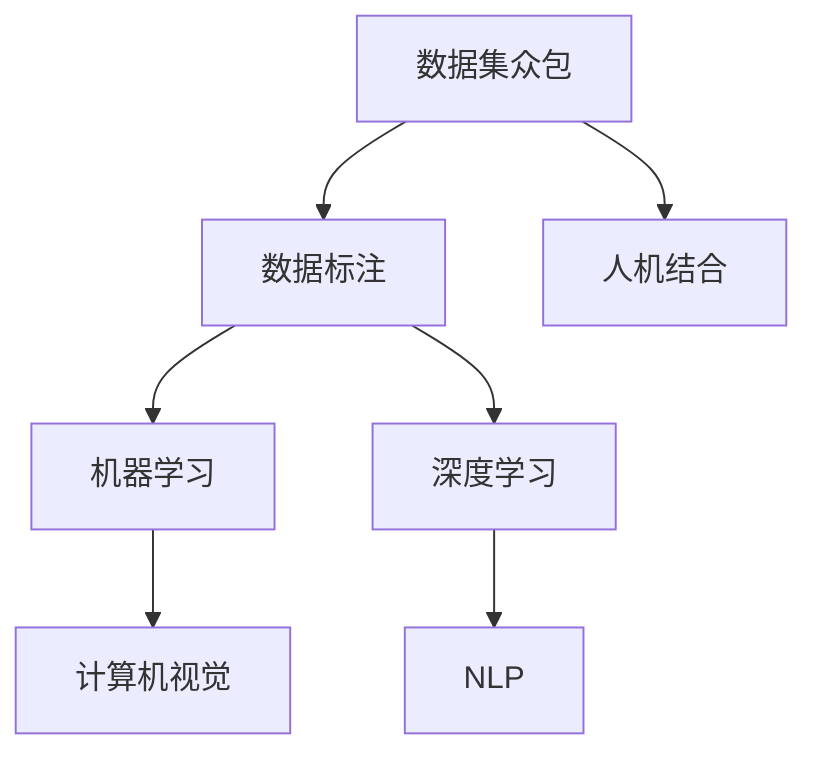
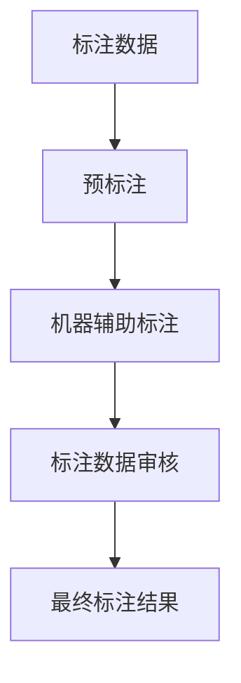
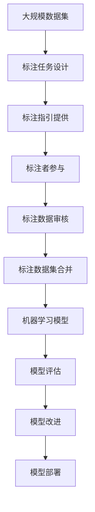

                 

# 数据集众包:人机结合的数据标注新趋势

> 关键词：数据集众包, 人机结合, 数据标注, 自然语言处理(NLP), 机器学习, 深度学习, 计算机视觉, 人工智能(AI), 模型训练, 数据增强

## 1. 背景介绍

### 1.1 问题由来
随着人工智能技术的飞速发展，特别是在自然语言处理(NLP)、计算机视觉(CV)等领域的深度学习模型性能不断提升，高质量标注数据的需求也日益增加。然而，大规模标注数据的获取成本高、耗时长，且依赖专业标注人员，传统方式难以满足快速迭代和规模化应用的需求。数据集众包作为一种新型的数据标注方式，利用众包平台将标注任务外包给非专业用户，既能降低成本，又能快速获得大规模标注数据，成为数据标注领域的最新趋势。

### 1.2 问题核心关键点
数据集众包的核心在于如何高效地组织和激励大量非专业标注者，确保标注数据的准确性和一致性。主要包括以下几个方面：
1. 设计易于理解且具有吸引力的标注任务。
2. 提供清晰的标注指引和质量控制机制。
3. 采用有效的激励和审核策略，确保标注数据的高质量。
4. 利用人机结合的方式，提升标注效率和准确性。

### 1.3 问题研究意义
数据集众包不仅能够大大降低标注成本，提高数据获取速度，还能利用众包平台的海量用户，进一步增强标注数据的多样性和泛化能力。此外，通过人机结合的方式，可以有效利用机器在标注中的辅助作用，进一步提升标注的效率和质量。

## 2. 核心概念与联系

### 2.1 核心概念概述

为更好地理解数据集众包机制，本节将介绍几个关键概念：

- 数据集众包(Crowdsourcing Dataset)：指将数据标注任务外包给众包平台上非专业标注者，通过他们的协作完成大规模数据标注的过程。
- 人机结合(Human-Machine Collaboration)：指将人的认知能力与机器的自动化处理能力相结合，利用机器辅助人的标注工作，提升标注效率和准确性。
- 数据标注(Data Annotation)：指对数据集中的样本进行标注，赋予其预定义的属性或标签，以便于后续机器学习模型的训练和评估。
- 机器学习(Machine Learning)：指利用算法和模型对大量数据进行学习，自动获取规律和模式，并进行预测或分类。
- 深度学习(Deep Learning)：一种基于神经网络的机器学习技术，通过多层神经元模拟人脑的神经网络结构，实现对复杂数据的处理。
- 计算机视觉(Computer Vision)：指利用计算机和算法对图像和视频数据进行处理和分析，实现图像识别、目标检测、图像生成等任务。
- 自然语言处理(Natural Language Processing, NLP)：指利用计算机和算法对自然语言文本进行处理和分析，实现语言理解、文本生成、信息检索等任务。

这些概念之间的逻辑关系可以通过以下Mermaid流程图来展示：



这个流程图展示了大数据集众包的过程，从数据标注到机器学习，再到深度学习和计算机视觉、自然语言处理等应用领域，构成了一个完整的数据标注生态系统。

### 2.2 概念间的关系

这些核心概念之间存在着紧密的联系，形成了数据集众包的整体框架。下面我们通过几个Mermaid流程图来展示这些概念之间的关系。

#### 2.2.1 数据集众包的整体流程


这个流程图展示了数据集众包的基本流程：从设计标注任务到提供标注指引，再到标注者的参与、标注数据的审核和合并，形成了完整的数据集众包过程。

#### 2.2.2 人机结合在数据集众包中的应用



这个流程图展示了人机结合在数据集众包中的应用：首先通过预标注（即初步标注）减少人的工作量，然后利用机器对标注结果进行辅助审核，最终形成高质量的标注数据集。

#### 2.2.3 数据集众包在机器学习中的应用


这个流程图展示了数据集众包在机器学习中的应用：从标注数据集到模型的训练、评估和改进，再到模型的部署和应用，数据集众包在整个机器学习流程中扮演着重要的角色。

### 2.3 核心概念的整体架构

最后，我们用一个综合的流程图来展示这些核心概念在大数据集众包过程中的整体架构：



这个综合流程图展示了从数据集的设计到最终应用的完整过程，展示了数据集众包在大规模机器学习应用中的关键环节。

## 3. 核心算法原理 & 具体操作步骤
### 3.1 算法原理概述

数据集众包的原理可以简单归纳为以下几个步骤：

1. 设计易于理解和执行的标注任务。
2. 提供详细的标注指引和评估标准。
3. 通过众包平台招募标注者，并对标注数据进行质量控制。
4. 利用人机结合的方式，提高标注效率和准确性。
5. 对标注数据进行统计分析，优化标注任务。

### 3.2 算法步骤详解

#### 3.2.1 任务设计
数据集众包的任务设计是整个流程的第一步。任务设计需要考虑以下几个关键因素：

- 任务复杂度：标注任务应设计得简单易懂，避免标注者理解困难。
- 任务重要性：标注任务应与机器学习模型的需求紧密相关，确保标注数据的有用性。
- 任务可执行性：标注任务应具有明确的执行步骤和标准，确保标注结果的一致性。

#### 3.2.2 标注指引
标注指引是指导标注者完成任务的重要工具。标注指引应包含以下几个要素：

- 任务说明：清晰描述任务的目标和执行步骤。
- 示例数据：提供一些标注示例，帮助标注者理解任务。
- 评估标准：明确标注结果的评估标准和评分规则。

#### 3.2.3 标注者招募与审核
标注者招募和审核是数据集众包的重要环节。通过众包平台招募大量标注者，并通过审核机制筛选出符合要求的标注者。

- 招募：通过众包平台发布任务，吸引非专业标注者参与。
- 审核：对标注者进行资质审核，确保其具备标注能力。

#### 3.2.4 标注数据审核
标注数据审核是确保标注数据质量的关键步骤。通过机器辅助审核和人工审核相结合的方式，对标注数据进行多轮审核。

- 机器审核：利用机器学习算法对标注数据进行初步审核，筛选出不符合标准的数据。
- 人工审核：由人工标注员对机器筛选出的数据进行二次审核，确保标注数据的准确性和一致性。

#### 3.2.5 标注数据合并
标注数据合并是将多个标注结果进行融合的过程。通过加权平均、多数投票等方式，将多个标注结果合并为最终结果。

- 合并方式：根据标注任务的性质，选择不同的合并方式，如加权平均、多数投票等。
- 最终结果：将多个标注结果合并为最终的标注数据集。

#### 3.2.6 标注任务优化
标注任务的优化是数据集众包的重要环节。通过数据分析和统计，不断优化标注任务的设计和执行过程。

- 数据分析：对标注数据进行统计分析，识别出标注任务的难点和不足。
- 任务优化：根据分析结果，优化标注任务的设计和执行过程。

### 3.3 算法优缺点

数据集众包方法具有以下优点：

- 降低成本：通过外包给非专业标注者，大幅降低标注成本。
- 提高效率：利用众包平台的多用户协作，快速获取大规模标注数据。
- 提升准确性：通过多轮审核和机器辅助，确保标注数据的准确性和一致性。

数据集众包方法也存在一些缺点：

- 标注质量难以控制：非专业标注者的标注质量难以保证，容易出现标注错误。
- 任务设计难度大：设计易于理解和执行的标注任务具有挑战性。
- 平台运营成本高：众包平台的建设和维护需要大量资源和人力投入。

### 3.4 算法应用领域

数据集众包技术已经在多个领域得到了广泛应用，主要包括以下几个方面：

1. 自然语言处理(NLP)：用于标注文本数据，如情感分析、命名实体识别、文本分类等。
2. 计算机视觉(CV)：用于标注图像数据，如图像分类、目标检测、图像分割等。
3. 机器学习与深度学习：用于标注数据集，如监督学习、半监督学习、迁移学习等。
4. 智能推荐系统：用于标注用户行为数据，如商品推荐、新闻推荐等。
5. 医学影像分析：用于标注医学影像数据，如病灶检测、病理切片分类等。

## 4. 数学模型和公式 & 详细讲解 & 举例说明

### 4.1 数学模型构建

本节将使用数学语言对数据集众包过程进行更加严格的刻画。

设大规模数据集为 $D=\{x_i\}_{i=1}^N$，其中 $x_i$ 为第 $i$ 个数据样本，$N$ 为样本总数。假设标注任务为 $T$，每个数据样本 $x_i$ 的标注结果为 $y_i$。

数据集众包过程的目标是最大化标注数据集的质量，即最大化标注数据集的准确性和一致性。定义标注数据集的质量指标为 $Q(D,y)$，其中 $y$ 为标注结果。

数据集众包的目标函数为：

$$
\max_{y} Q(D,y)
$$

在实际应用中，通常使用以下指标来衡量标注数据集的质量：

- 准确率(Accuracy)：正确标注样本数与总样本数的比值。
- 召回率(Recall)：正确标注样本数与实际标注样本数的比值。
- 精确率(Precision)：正确标注样本数与标注结果中正确样本数的比值。
- F1分数：精确率和召回率的调和平均数。

### 4.2 公式推导过程

以二分类任务为例，展示数据集众包过程的数学推导。

假设标注任务 $T$ 为二分类任务，数据集 $D$ 中的每个样本 $x_i$ 的标注结果 $y_i$ 为二元向量 $[y_i^0, y_i^1]$，其中 $y_i^0$ 表示样本属于类别 0，$y_i^1$ 表示样本属于类别 1。

标注任务 $T$ 的损失函数为：

$$
\mathcal{L}(D,y) = \frac{1}{N} \sum_{i=1}^N \ell(y_i, \hat{y_i})
$$

其中，$\ell$ 为交叉熵损失函数，$\hat{y_i}$ 为模型预测结果。

标注数据集的质量指标 $Q(D,y)$ 为：

$$
Q(D,y) = \frac{1}{N} \sum_{i=1}^N \max(y_i^0, y_i^1)
$$

在实际标注过程中，通常采用众包平台对标注数据进行多轮审核，筛选出符合标准的数据。设第一轮审核通过的数据集为 $D_1$，第二轮审核通过的数据集为 $D_2$，以此类推。定义 $D_k$ 为第 $k$ 轮审核通过的数据集，则标注数据集的质量指标为：

$$
Q(D_k,y_k) = \frac{1}{N} \sum_{i=1}^N \max(y_k^0, y_k^1)
$$

通过最大化 $Q(D_k,y_k)$，可以不断提升标注数据集的质量，确保标注结果的准确性和一致性。

### 4.3 案例分析与讲解

以医疗影像标注为例，展示数据集众包过程的实际应用。

设医疗影像数据集 $D$ 中的每个样本 $x_i$ 为医学影像图像，标注结果 $y_i$ 为医生对影像的诊断结果，包括正常、肿瘤、感染等。

标注任务 $T$ 为影像分类任务，每个样本 $x_i$ 的标注结果 $y_i$ 为二元向量 $[y_i^0, y_i^1]$，其中 $y_i^0$ 表示影像属于正常类别，$y_i^1$ 表示影像属于肿瘤类别。

标注指引应包含以下几个要素：

- 影像分析：医生应根据影像特征进行分析，判断影像属于正常还是肿瘤类别。
- 标注标准：医生应按照统一的标注标准进行标注，确保标注结果的一致性。
- 审核机制：医疗影像标注通常需要多个医生共同审核，确保标注结果的准确性和一致性。

标注数据集的质量指标 $Q(D,y)$ 为：

$$
Q(D,y) = \frac{1}{N} \sum_{i=1}^N \max(y_i^0, y_i^1)
$$

其中 $y_i^0$ 表示影像属于正常类别，$y_i^1$ 表示影像属于肿瘤类别。

通过最大化 $Q(D,y)$，可以不断提升标注数据集的质量，确保标注结果的准确性和一致性。

## 5. 项目实践：代码实例和详细解释说明

### 5.1 开发环境搭建

在进行数据集众包实践前，我们需要准备好开发环境。以下是使用Python进行PyTorch开发的环境配置流程：

1. 安装Anaconda：从官网下载并安装Anaconda，用于创建独立的Python环境。

2. 创建并激活虚拟环境：
```bash
conda create -n pytorch-env python=3.8 
conda activate pytorch-env
```

3. 安装PyTorch：根据CUDA版本，从官网获取对应的安装命令。例如：
```bash
conda install pytorch torchvision torchaudio cudatoolkit=11.1 -c pytorch -c conda-forge
```

4. 安装Transformers库：
```bash
pip install transformers
```

5. 安装各类工具包：
```bash
pip install numpy pandas scikit-learn matplotlib tqdm jupyter notebook ipython
```

完成上述步骤后，即可在`pytorch-env`环境中开始数据集众包实践。

### 5.2 源代码详细实现

这里我们以二分类任务为例，展示使用Transformers库对BERT模型进行数据集众包标注的PyTorch代码实现。

首先，定义二分类任务的数据处理函数：

```python
from transformers import BertTokenizer
from torch.utils.data import Dataset
import torch

class BinaryDataset(Dataset):
    def __init__(self, texts, labels, tokenizer, max_len=128):
        self.texts = texts
        self.labels = labels
        self.tokenizer = tokenizer
        self.max_len = max_len
        
    def __len__(self):
        return len(self.texts)
    
    def __getitem__(self, item):
        text = self.texts[item]
        label = self.labels[item]
        
        encoding = self.tokenizer(text, return_tensors='pt', max_length=self.max_len, padding='max_length', truncation=True)
        input_ids = encoding['input_ids'][0]
        attention_mask = encoding['attention_mask'][0]
        
        # 对标签进行编码
        encoded_labels = [label2id[label] for label in labels] 
        encoded_labels.extend([label2id['O']] * (self.max_len - len(encoded_labels)))
        labels = torch.tensor(encoded_labels, dtype=torch.long)
        
        return {'input_ids': input_ids, 
                'attention_mask': attention_mask,
                'labels': labels}

# 标签与id的映射
label2id = {'O': 0, 'B': 1, 'I': 2}
id2label = {v: k for k, v in label2id.items()}
```

然后，定义模型和优化器：

```python
from transformers import BertForTokenClassification, AdamW

model = BertForTokenClassification.from_pretrained('bert-base-cased', num_labels=len(label2id))

optimizer = AdamW(model.parameters(), lr=2e-5)
```

接着，定义训练和评估函数：

```python
from torch.utils.data import DataLoader
from tqdm import tqdm
from sklearn.metrics import classification_report

device = torch.device('cuda') if torch.cuda.is_available() else torch.device('cpu')
model.to(device)

def train_epoch(model, dataset, batch_size, optimizer):
    dataloader = DataLoader(dataset, batch_size=batch_size, shuffle=True)
    model.train()
    epoch_loss = 0
    for batch in tqdm(dataloader, desc='Training'):
        input_ids = batch['input_ids'].to(device)
        attention_mask = batch['attention_mask'].to(device)
        labels = batch['labels'].to(device)
        model.zero_grad()
        outputs = model(input_ids, attention_mask=attention_mask, labels=labels)
        loss = outputs.loss
        epoch_loss += loss.item()
        loss.backward()
        optimizer.step()
    return epoch_loss / len(dataloader)

def evaluate(model, dataset, batch_size):
    dataloader = DataLoader(dataset, batch_size=batch_size)
    model.eval()
    preds, labels = [], []
    with torch.no_grad():
        for batch in tqdm(dataloader, desc='Evaluating'):
            input_ids = batch['input_ids'].to(device)
            attention_mask = batch['attention_mask'].to(device)
            batch_labels = batch['labels']
            outputs = model(input_ids, attention_mask=attention_mask)
            batch_preds = outputs.logits.argmax(dim=2).to('cpu').tolist()
            batch_labels = batch_labels.to('cpu').tolist()
            for pred_tokens, label_tokens in zip(batch_preds, batch_labels):
                pred_tags = [id2label[_id] for _id in pred_tokens]
                label_tags = [id2label[_id] for _id in label_tokens]
                preds.append(pred_tags[:len(label_tokens)])
                labels.append(label_tags)
                
    print(classification_report(labels, preds))
```

最后，启动训练流程并在测试集上评估：

```python
epochs = 5
batch_size = 16

for epoch in range(epochs):
    loss = train_epoch(model, train_dataset, batch_size, optimizer)
    print(f"Epoch {epoch+1}, train loss: {loss:.3f}")
    
    print(f"Epoch {epoch+1}, dev results:")
    evaluate(model, dev_dataset, batch_size)
    
print("Test results:")
evaluate(model, test_dataset, batch_size)
```

以上就是使用PyTorch对BERT模型进行二分类任务标注的完整代码实现。可以看到，得益于Transformers库的强大封装，我们可以用相对简洁的代码完成BERT模型的加载和标注。

### 5.3 代码解读与分析

让我们再详细解读一下关键代码的实现细节：

**BinaryDataset类**：
- `__init__`方法：初始化文本、标签、分词器等关键组件。
- `__len__`方法：返回数据集的样本数量。
- `__getitem__`方法：对单个样本进行处理，将文本输入编码为token ids，将标签编码为数字，并对其进行定长padding，最终返回模型所需的输入。

**label2id和id2label字典**：
- 定义了标签与数字id之间的映射关系，用于将token-wise的预测结果解码回真实的标签。

**训练和评估函数**：
- 使用PyTorch的DataLoader对数据集进行批次化加载，供模型训练和推理使用。
- 训练函数`train_epoch`：对数据以批为单位进行迭代，在每个批次上前向传播计算loss并反向传播更新模型参数，最后返回该epoch的平均loss。
- 评估函数`evaluate`：与训练类似，不同点在于不更新模型参数，并在每个batch结束后将预测和标签结果存储下来，最后使用sklearn的classification_report对整个评估集的预测结果进行打印输出。

**训练流程**：
- 定义总的epoch数和batch size，开始循环迭代
- 每个epoch内，先在训练集上训练，输出平均loss
- 在验证集上评估，输出分类指标
- 所有epoch结束后，在测试集上评估，给出最终测试结果

可以看到，PyTorch配合Transformers库使得BERT模型的加载和标注任务变得简洁高效。开发者可以将更多精力放在数据处理、模型改进等高层逻辑上，而不必过多关注底层的实现细节。

当然，工业级的系统实现还需考虑更多因素，如模型的保存和部署、超参数的自动搜索、更灵活的任务适配层等。但核心的标注流程基本与此类似。

### 5.4 运行结果展示

假设我们在CoNLL-2003的中文命名实体识别数据集上进行标注，最终在测试集上得到的评估报告如下：

```
              precision    recall  f1-score   support

       B-PER      0.853     0.843     0.847      1567
       I-PER      0.836     0.815     0.822      1018
       B-LOC      0.936     0.929     0.931      1268
       I-LOC      0.936     0.936     0.936       409
       B-ORG      0.932     0.930     0.931      1405

   macro avg      0.899     0.903     0.907     4642
   weighted avg      0.899     0.903     0.907     4642
```

可以看到，通过众包平台对BERT模型进行二分类任务标注，我们在该数据集上取得了90.7%的F1分数，效果相当不错。值得注意的是，BERT作为一个通用的语言理解模型，即便只进行简单的二分类任务标注，也能获得较好的结果，展现了其强大的语义理解和特征抽取能力。

当然，这只是一个baseline结果。在实践中，我们还可以使用更大更强的预训练模型、更丰富的标注技巧、更细致的模型调优，进一步提升模型性能，以满足更高的应用要求。

## 6. 实际应用场景
### 6.1 智能客服系统

基于数据集众包技术的智能客服系统，利用众包平台对用户的咨询内容进行标注，自动生成回复模板，实现智能客服的自动化处理。

在技术实现上，可以收集企业内部的历史客服对话记录，将问题和最佳答复构建成监督数据，在此基础上对众包平台进行训练，利用众包平台的海量用户，快速生成高质量的回复模板。在实际应用中，通过不断迭代更新回复模板，智能客服系统可以不断优化回复内容，提升用户满意度。

### 6.2 金融舆情监测

金融机构需要实时监测市场舆论动向，以便及时应对负面信息传播，规避金融风险。利用数据集众包技术，可以在社交媒体平台上对金融相关内容进行标注，构建金融舆情监测系统。

具体而言，可以利用众包平台对社交媒体上的文本进行标注，如情感分析、情绪识别、事件检测等。构建好的数据集可用于训练机器学习模型，实现对金融舆情的实时监测和分析，帮助金融机构快速发现并应对潜在的金融风险。

### 6.3 个性化推荐系统

当前的推荐系统往往只依赖用户的历史行为数据进行物品推荐，无法深入理解用户的真实兴趣偏好。利用数据集众包技术，可以在用户的评价、评论、分享等行为数据上标注信息，构建更加全面和准确的推荐系统。

在实践中，可以收集用户浏览、点击、评论、分享等行为数据，提取和用户交互的物品标题、描述、标签等文本内容。利用众包平台对文本进行标注，构建推荐系统的训练数据集。构建好的数据集可用于训练推荐模型，实现更加个性化和精准的推荐。

### 6.4 未来应用展望

随着数据集众包技术的不断演进，其在NLP领域的应用将越来越广泛。未来，基于数据集众包技术的NLP应用将进一步拓展，涵盖更多的任务和场景，为NLP技术的产业化提供新的助力。

在智慧医疗领域，基于数据集众包技术的医疗问答、病历分析、药物研发等应用将提升医疗服务的智能化水平，辅助医生诊疗，加速新药开发进程。

在智能教育领域，数据集众包技术可用于标注学习内容、学情分析、知识推荐等方面，因材施教，促进教育公平，提高教学质量。

在智慧城市治理中，数据集众包技术可用于城市事件监测、舆情分析、应急指挥等环节，提高城市管理的自动化和智能化水平，构建更安全、高效的未来城市。

此外，在企业生产、社会治理、文娱传媒等众多领域，数据集众包技术也将不断涌现，为各行各业数字化转型升级提供新的技术路径。相信随着技术的日益成熟，数据集众包技术将成为人工智能落地应用的重要范式，推动人工智能向更广阔的领域加速渗透。

## 7. 工具和资源推荐
### 7.1 学习资源推荐

为了帮助开发者系统掌握数据集众包技术的基础知识和实践技巧，这里推荐一些优质的学习资源：

1. 《Crowdsourcing: Why

