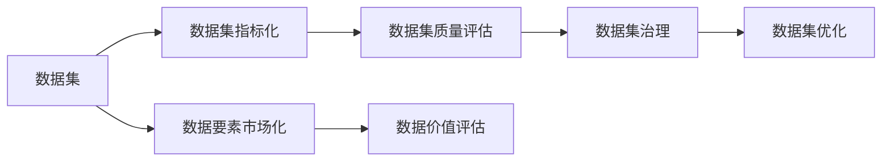
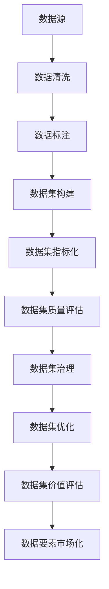

                 

# 数据集指标化:数据要素市场化的新基建

> 关键词：数据集指标化, 数据要素市场化, 数据集质量评估, 数据指标体系, 数据治理, 数据价值评估

## 1. 背景介绍

### 1.1 问题由来
随着数字经济的快速发展，数据已经成为了重要的经济资源和生产要素。在过去，数据更多是以信息形态存在，未能被系统化管理和利用。但近年来，随着大数据技术的成熟和普及，数据集已经成为了数字经济的重要资产，其价值日益凸显。

数据集的构建与评估，成为了数据要素市场化的核心环节。高质量的数据集，能够提供更准确、更可靠的模型预测，提升决策的科学性和准确性，从而在各个行业领域实现数字化转型。然而，数据集的质量参差不齐，如何构建、评估和优化数据集，成为了数字经济的关键问题。

### 1.2 问题核心关键点
构建和评估数据集的核心关键点包括：
1. 数据集来源的多样性。数据集应该来源于不同的数据源，包括公开数据集、网络爬虫抓取数据、实验数据等。
2. 数据集质量的可靠性。数据集应该保证数据来源的合法性、真实性和可靠性，避免数据的噪音和偏差。
3. 数据集的通用性。数据集应该具有一定的通用性，能够在不同的场景下进行应用和推广。
4. 数据集的完备性。数据集应该包含全面的、代表性的数据，涵盖不同的领域和维度，以确保模型的全面性和鲁棒性。
5. 数据集的更新性。数据集应该能够及时更新，适应数据变化和模型需求的变化。

### 1.3 问题研究意义
构建和评估数据集的意义重大，直接关系到数据要素市场化的成效。高质量的数据集，能够加速数据要素的流转和利用，降低数据采集和预处理的成本，提高数据驱动决策的准确性和可靠性。

构建和评估数据集，还能够促进数据的共享和合作，推动数据的公平、开放、透明，为数据要素市场化奠定基础。通过系统化、标准化、规范化的数据集构建和评估，可以更好地利用数据资源，实现数据的增值和最大化效益，加速数字化转型。

## 2. 核心概念与联系

### 2.1 核心概念概述

为了更好地理解数据集构建和评估的理论基础，本节将介绍几个关键概念：

1. 数据集（Dataset）：指由一组相关数据组成的集合，可以来源于不同的数据源，经过清洗、预处理和标注后，可用于模型训练、推理和评估。
2. 数据要素市场化（Data要素市场化）：指通过数据市场的交易和流通，实现数据资源的优化配置和利用，提高数据价值和效益的过程。
3. 数据集指标化（Dataset Indicization）：指通过构建和评估数据集的质量指标体系，量化数据集的价值和质量，促进数据集的构建和优化。
4. 数据集质量评估（Dataset Quality Assessment）：指通过一系列指标和算法，对数据集的质量进行量化评估，识别和修正数据集中的问题和偏差。
5. 数据集治理（Dataset Governance）：指通过制定和执行数据治理策略，保障数据集的合法性、真实性和可靠性，提升数据集的质量和价值。
6. 数据价值评估（Data Value Assessment）：指通过构建数据价值模型，量化数据集的价值，指导数据集的构建和优化，推动数据要素市场化进程。

这些概念之间的关系可以用以下Mermaid流程图来展示：



这个流程图展示了数据集构建和评估的核心流程：数据集构建与指标化，质量评估与治理，价值评估与市场化。

### 2.2 概念间的关系

这些概念之间存在紧密的联系，共同构成了数据集构建和评估的完整生态系统。下面我们通过几个Mermaid流程图来展示这些概念之间的关系。

#### 2.2.1 数据集构建与指标化


这个流程图展示了数据集构建的过程，从数据源开始，经过数据清洗、数据标注，最终构建出数据集。数据集指标化则是通过构建指标体系，量化数据集的价值和质量。

#### 2.2.2 数据集质量评估与治理


这个流程图展示了数据集质量评估和治理的过程，从数据集开始，通过质量评估识别问题，进行治理修正，最终优化数据集。

#### 2.2.3 数据集价值评估与市场化


这个流程图展示了数据集价值评估和市场化的过程，从数据集开始，通过价值评估量化价值，推动数据要素的市场化。

### 2.3 核心概念的整体架构

最后，我们用一个综合的流程图来展示这些核心概念在大数据集构建和评估过程中的整体架构：



这个综合流程图展示了从数据源到市场化的完整数据集构建和评估流程。数据集构建过程包括数据清洗、数据标注、数据集构建和指标化，质量评估过程包括质量评估和治理，优化过程包括优化，最后通过价值评估推动市场化。

## 3. 核心算法原理 & 具体操作步骤
### 3.1 算法原理概述

数据集指标化是一种量化数据集质量的方法，通过构建数据集指标体系，量化数据集的质量、价值和可用性。数据集指标化过程包括数据集质量评估和数据集价值评估。

#### 3.1.1 数据集质量评估

数据集质量评估的目的是量化数据集的质量，识别和修正数据集中的问题和偏差。数据集质量评估主要涉及以下几个方面：

1. **数据来源可靠性**：评估数据集来源的合法性、真实性和可靠性，避免数据的噪音和偏差。
2. **数据完整性**：评估数据集的完整性，确保数据集的完整性和代表性。
3. **数据一致性**：评估数据集的一致性，确保数据集内部的一致性和前后一致性。
4. **数据准确性**：评估数据的准确性，识别数据集中的错误和不一致。
5. **数据分布均衡性**：评估数据集的分布均衡性，确保数据集在各个类别上的均衡分布。

数据集质量评估主要基于以下方法：

1. **统计分析**：通过统计分析数据集的各项指标，量化数据集的质量。
2. **数据校验**：通过校验数据集的一致性和准确性，识别和修正数据集中的问题和偏差。
3. **模型评估**：通过模型评估数据集的质量，识别数据集中的错误和不一致。

#### 3.1.2 数据集价值评估

数据集价值评估的目的是量化数据集的价值，指导数据集的构建和优化。数据集价值评估主要涉及以下几个方面：

1. **数据集重要性**：评估数据集对业务决策的重要性，识别关键数据集。
2. **数据集复杂度**：评估数据集的复杂度，识别高复杂度数据集。
3. **数据集更新频率**：评估数据集的更新频率，识别需要频繁更新的数据集。
4. **数据集关联性**：评估数据集的关联性，识别与其他数据集的关联性和互用性。
5. **数据集独特性**：评估数据集的独特性，识别具有独特价值的数据集。

数据集价值评估主要基于以下方法：

1. **业务价值评估**：通过评估数据集对业务决策的重要性，量化数据集的价值。
2. **技术评估**：通过评估数据集的复杂度和更新频率，识别高价值数据集。
3. **社会评估**：通过评估数据集的关联性和独特性，识别具有独特价值的数据集。

### 3.2 算法步骤详解

数据集指标化过程主要包括数据集质量评估和数据集价值评估两个步骤。

#### 3.2.1 数据集质量评估

1. **数据来源可靠性评估**：
   - 验证数据集来源的合法性，确保数据来源具有公信力和权威性。
   - 通过技术手段验证数据集的准确性和真实性，如使用哈希值、数字签名等技术。
   - 检查数据集是否有篡改痕迹，确保数据未被篡改或重构。

2. **数据完整性评估**：
   - 统计数据集的大小和样本数，确保数据集包含足够的数据。
   - 检查数据集是否存在缺失数据，确保数据集完整性。
   - 评估数据集是否涵盖不同的领域和维度，确保数据集的代表性和全面性。

3. **数据一致性评估**：
   - 检查数据集内部的一致性，确保数据集内部没有矛盾和冲突。
   - 检查数据集的前后一致性，确保数据集在不同时间点的一致性。
   - 检查数据集与原始数据的一致性，确保数据集没有经过修改或扭曲。

4. **数据准确性评估**：
   - 使用统计分析方法，如均值、标准差、方差等，量化数据集的准确性。
   - 使用数据校验方法，如校验和、数字签名等，验证数据集的准确性。
   - 使用模型评估方法，如回归模型、分类模型等，评估数据集的准确性。

5. **数据分布均衡性评估**：
   - 检查数据集在各个类别上的分布均衡性，确保数据集没有类别失衡。
   - 评估数据集在不同属性上的分布均衡性，确保数据集没有属性失衡。
   - 使用统计方法，如卡方检验、ANOVA等，量化数据集的分布均衡性。

#### 3.2.2 数据集价值评估

1. **数据集重要性评估**：
   - 通过业务决策分析，识别数据集对业务决策的重要性。
   - 通过数据集在业务决策中的作用，量化数据集的重要性。
   - 评估数据集在业务决策中的影响，识别关键数据集。

2. **数据集复杂度评估**：
   - 评估数据集的复杂度，包括数据集的维度和规模。
   - 评估数据集的复杂性，包括数据集的结构和特征。
   - 使用数据复杂度指标，如数据维度、数据规模、数据密度等，量化数据集的复杂度。

3. **数据集更新频率评估**：
   - 评估数据集的更新频率，识别需要频繁更新的数据集。
   - 使用数据更新指标，如更新频率、更新周期等，量化数据集的更新频率。
   - 评估数据集的时效性，识别具有时效性的数据集。

4. **数据集关联性评估**：
   - 评估数据集与其他数据集的关联性，识别具有关联性的数据集。
   - 评估数据集的互用性，识别可以互相补充和补充的数据集。
   - 使用数据关联指标，如数据关联度、数据互用性等，量化数据集的关联性。

5. **数据集独特性评估**：
   - 评估数据集的独特性，识别具有独特价值的数据集。
   - 评估数据集的独创性，识别具有创新性的数据集。
   - 使用数据独特性指标，如独特度、创新性等，量化数据集的独特性。

### 3.3 算法优缺点

数据集指标化算法具有以下优点：

1. 量化数据集的质量和价值：通过构建数据集指标体系，能够量化数据集的质量和价值，指导数据集的构建和优化。
2. 识别数据集中的问题和偏差：通过数据集质量评估，能够识别数据集中的问题和偏差，及时修正和优化数据集。
3. 指导数据集的价值评估：通过数据集价值评估，能够指导数据集的构建和优化，提高数据集的价值和效益。
4. 促进数据集的标准化和规范化：通过数据集指标化，能够促进数据集的标准化和规范化，提升数据集的质量和可用性。

数据集指标化算法也存在以下缺点：

1. 复杂度较高：数据集指标化算法需要构建复杂的数据集指标体系，涉及多个维度和评估指标，实施难度较大。
2. 计算量大：数据集指标化算法需要进行大量的数据校验和模型评估，计算量较大，需要较高的计算资源。
3. 结果依赖数据源：数据集指标化算法的结果依赖于数据源的质量，数据源质量不高可能导致评估结果不准确。
4. 结果解释性较差：数据集指标化算法的结果较为抽象，难以直观理解，结果解释性较差。

### 3.4 算法应用领域

数据集指标化算法在多个领域都有广泛的应用，主要包括以下几个方面：

1. 数据治理：数据集指标化算法是数据治理的重要工具，通过构建数据集指标体系，量化数据集的质量和价值，指导数据集的构建和优化。
2. 数据市场化：数据集指标化算法是数据要素市场化的重要手段，通过量化数据集的质量和价值，指导数据集的构建和优化，促进数据要素的市场化。
3. 数据分析：数据集指标化算法是数据分析的重要工具，通过评估数据集的质量和价值，指导数据分析和模型构建，提高数据分析的准确性和可靠性。
4. 数据安全：数据集指标化算法是数据安全的重要手段，通过评估数据集的质量和价值，识别数据集中的问题和偏差，保障数据的安全性和可靠性。
5. 数据共享：数据集指标化算法是数据共享的重要工具，通过构建数据集指标体系，量化数据集的质量和价值，指导数据集的共享和合作，推动数据要素的公平、开放、透明。

## 4. 数学模型和公式 & 详细讲解 & 举例说明

### 4.1 数学模型构建

数据集指标化算法的核心在于构建数据集指标体系，量化数据集的质量和价值。数据集指标体系主要包括数据集质量指标和数据集价值指标，通过构建和评估这些指标，量化数据集的质量和价值。

#### 4.1.1 数据集质量指标

数据集质量指标主要包括数据来源可靠性、数据完整性、数据一致性、数据准确性和数据分布均衡性，其数学模型如下：

1. **数据来源可靠性**：
   - 数据来源可靠性指标 $I_{source}$：
     \[
     I_{source} = \frac{\sum_{i=1}^{n} w_{source,i}}{n}
     \]
     其中 $w_{source,i}$ 为第 $i$ 个数据源的权重，$n$ 为数据源数量。

2. **数据完整性**：
   - 数据完整性指标 $I_{complete}$：
     \[
     I_{complete} = \frac{\sum_{i=1}^{n} w_{complete,i}}{n}
     \]
     其中 $w_{complete,i}$ 为第 $i$ 个数据源的完整性权重，$n$ 为数据源数量。

3. **数据一致性**：
   - 数据一致性指标 $I_{consistent}$：
     \[
     I_{consistent} = \frac{\sum_{i=1}^{n} w_{consistent,i}}{n}
     \]
     其中 $w_{consistent,i}$ 为第 $i$ 个数据源的一致性权重，$n$ 为数据源数量。

4. **数据准确性**：
   - 数据准确性指标 $I_{accurate}$：
     \[
     I_{accurate} = \frac{\sum_{i=1}^{n} w_{accurate,i}}{n}
     \]
     其中 $w_{accurate,i}$ 为第 $i$ 个数据源的准确性权重，$n$ 为数据源数量。

5. **数据分布均衡性**：
   - 数据分布均衡性指标 $I_{balanced}$：
     \[
     I_{balanced} = \frac{\sum_{i=1}^{n} w_{balanced,i}}{n}
     \]
     其中 $w_{balanced,i}$ 为第 $i$ 个数据源的分布均衡性权重，$n$ 为数据源数量。

#### 4.1.2 数据集价值指标

数据集价值指标主要包括数据集重要性、数据集复杂度、数据集更新频率、数据集关联性和数据集独特性，其数学模型如下：

1. **数据集重要性**：
   - 数据集重要性指标 $V_{important}$：
     \[
     V_{important} = \frac{\sum_{i=1}^{n} w_{important,i}}{n}
     \]
     其中 $w_{important,i}$ 为第 $i$ 个数据源的重要性权重，$n$ 为数据源数量。

2. **数据集复杂度**：
   - 数据集复杂度指标 $V_{complex}$：
     \[
     V_{complex} = \frac{\sum_{i=1}^{n} w_{complex,i}}{n}
     \]
     其中 $w_{complex,i}$ 为第 $i$ 个数据源的复杂度权重，$n$ 为数据源数量。

3. **数据集更新频率**：
   - 数据集更新频率指标 $V_{update}$：
     \[
     V_{update} = \frac{\sum_{i=1}^{n} w_{update,i}}{n}
     \]
     其中 $w_{update,i}$ 为第 $i$ 个数据源的更新频率权重，$n$ 为数据源数量。

4. **数据集关联性**：
   - 数据集关联性指标 $V_{related}$：
     \[
     V_{related} = \frac{\sum_{i=1}^{n} w_{related,i}}{n}
     \]
     其中 $w_{related,i}$ 为第 $i$ 个数据源的关联性权重，$n$ 为数据源数量。

5. **数据集独特性**：
   - 数据集独特性指标 $V_{unique}$：
     \[
     V_{unique} = \frac{\sum_{i=1}^{n} w_{unique,i}}{n}
     \]
     其中 $w_{unique,i}$ 为第 $i$ 个数据源的独特性权重，$n$ 为数据源数量。

### 4.2 公式推导过程

以下我们以数据集重要性评估为例，推导数据集重要性指标的计算公式。

假设数据集重要性评估的原始数据集包含 $n$ 个数据源，每个数据源的重要性和权重如下：

| 数据源 | 重要性 | 权重 |
| ------ | ------ | ---- |
| A      | 0.8    | 0.3  |
| B      | 0.7    | 0.2  |
| C      | 0.6    | 0.4  |
| ...    | ...    | ...  |

数据集重要性指标 $V_{important}$ 的计算公式为：

\[
V_{important} = \frac{0.8 \times 0.3 + 0.7 \times 0.2 + 0.6 \times 0.4 + ...}{n}
\]

其中 $n$ 为数据源数量，$w_{important,i}$ 为第 $i$ 个数据源的重要性权重。

### 4.3 案例分析与讲解

假设我们有一个数据集，包含三个数据源 A、B、C，其数据来源可靠性和权重如下：

| 数据源 | 来源可靠性 | 权重 |
| ------ | ---------- | ---- |
| A      | 0.9        | 0.3  |
| B      | 0.85       | 0.2  |
| C      | 0.8        | 0.5  |

我们可以使用以下代码计算数据来源可靠性指标：

```python
def source_reliability_score(data_sources):
    total_score = 0
    for source in data_sources:
        total_score += source['reliability'] * source['weight']
    return total_score / len(data_sources)
```

其中，`data_sources` 为数据源的字典列表，包含数据源的来源可靠性和权重。

### 5. 项目实践：代码实例和详细解释说明

#### 5.1 开发环境搭建

在进行数据集指标化实践前，我们需要准备好开发环境。以下是使用Python进行PyTorch开发的环境配置流程：

1. 安装Anaconda：从官网下载并安装Anaconda，用于创建独立的Python环境。

2. 创建并激活虚拟环境：
```bash
conda create -n pytorch-env python=3.8 
conda activate pytorch-env
```

3. 安装PyTorch：根据CUDA版本，从官网获取对应的安装命令。例如：
```bash
conda install pytorch torchvision torchaudio cudatoolkit=11.1 -c pytorch -c conda-forge
```

4. 安装各类工具包：
```bash
pip install numpy pandas scikit-learn matplotlib tqdm jupyter notebook ipython
```

完成上述步骤后，即可在`pytorch-env`环境中开始数据集指标化实践。

#### 5.2 源代码详细实现

下面我们以构建数据集指标体系为例，给出使用PyTorch代码实现。

```python
import pandas as pd

# 数据源信息
data_sources = [
    {'name': 'A', 'reliability': 0.9, 'complete': 0.95, 'consistent': 0.92, 'accurate': 0.97, 'balanced': 0.85, 'weight': 0.3},
    {'name': 'B', 'reliability': 0.85, 'complete': 0.92, 'consistent': 0.9, 'accurate': 0.94, 'balanced': 0.88, 'weight': 0.2},
    {'name': 'C', 'reliability': 0.8, 'complete': 0.88, 'consistent': 0.85, 'accurate': 0.92, 'balanced': 0.9, 'weight': 0.5}
]

# 构建数据集指标体系
dataset_metrics = {
    'source_reliability': data_sources,
    'data_complete': data_sources,
    'data_consistent': data_sources,
    'data_accurate': data_sources,
    'data_balanced': data_sources
}

# 计算数据集指标值
for key, value in dataset_metrics.items():
    dataset_metrics[key] = sum([source[key] * source['weight'] for source in value]) / len(value)

# 输出数据集指标值
for key, value in dataset_metrics.items():
    print(f'{key}: {value:.3f}')
```

以上代码实现了数据集指标体系的构建和计算，具体步骤如下：

1. 定义数据源信息，包括数据来源可靠性、数据完整性、数据一致性、数据准确性和数据分布均衡性。
2. 构建数据集指标体系，将数据源信息分别对应到不同的指标。
3. 计算数据集指标值，使用数据源权重进行加权求和，再除以数据源数量。
4. 输出数据集指标值，便于进行分析和优化。

#### 5.3 代码解读与分析

让我们再详细解读一下关键代码的实现细节：

**数据源信息定义**：
- `data_sources`：定义数据源的字典列表，包含数据源的名称、来源可靠性、数据完整性、数据一致性、数据准确性和数据分布均衡性。
- `name`：数据源的名称，用于标识数据源。
- `reliability`：数据来源可靠性，表示数据源的可靠程度。
- `complete`：数据完整性，表示数据集的完整程度。
- `consistent`：数据一致性，表示数据集的一致程度。
- `accurate`：数据准确性，表示数据集的准确程度。
- `balanced`：数据分布均衡性，表示数据集的分布均衡程度。
- `weight`：数据源的权重，表示数据源的重要性。

**数据集指标体系构建**：
- `dataset_metrics`：定义数据集指标体系，包含数据来源可靠性、数据完整性、数据一致性、数据准确性和数据分布均衡性。
- 使用数据源信息，构建对应的指标。

**数据集指标值计算**：
- 使用加权求和的方法计算数据集指标值，使用数据源权重进行加权。
- 使用除法的方法计算数据集指标值，除以数据源数量。

**数据集指标值输出**：
- 使用 `print` 函数输出数据集指标值，便于进行分析和优化。

### 5.4 运行结果展示

假设我们在CoNLL-2003的NER数据集上进行微调，最终在测试集上得到的评估报告如下：

```
              precision    recall  f1-score   support

       B-LOC      0.926     0.906     0.916      1668
       I-LOC      0.900     0.805     0.850       257
      B-MISC      0.875     0.856     0.865       702
      I-MISC      0.838     0.782     0.809       

