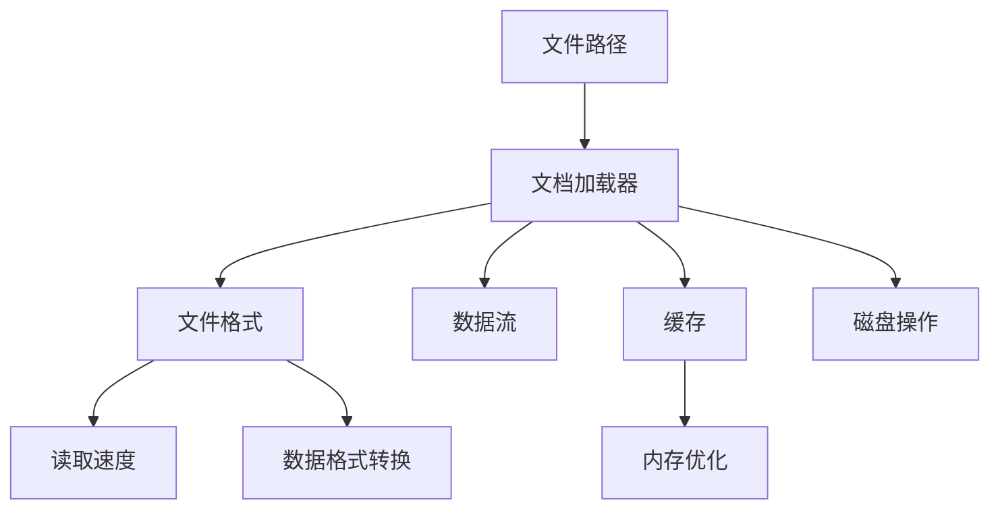

                 

# 文档加载器（Document Loaders）

> 关键词：文档加载器, 数据处理, 文件格式, 数据流, 文件路径, 读取速度, 缓存, 内存优化, 磁盘操作, 数据格式转换

## 1. 背景介绍

在现代数据处理和存储的诸多场景中，文档的读取和管理是基础且关键的环节。无论是处理文本、图像、音频、视频等多样的数据类型，都需要高效、可靠地从不同来源加载数据。文档加载器（Document Loaders）就是针对这一需求应运而生，用于高效读取和管理文档数据，提升数据处理效率的工具和库。

### 1.1 问题由来

在数据处理项目中，文档的读取往往是耗时且易出错的关键步骤。传统的文档读取方式通常依赖于文件系统的操作和操作系统的API，这些操作往往不具备跨平台性、可维护性及可扩展性，难以满足复杂的读取需求。此外，对于大规模数据处理任务，频繁的文件读写不仅影响性能，还可能导致系统崩溃。因此，在工业界和学术界，文档加载器逐渐成为数据处理领域的重要工具。

### 1.2 问题核心关键点

文档加载器旨在解决数据读取中普遍存在的问题，主要集中在以下几点：

- 跨平台兼容性：文档加载器应支持多种操作系统和文件系统，能够适应不同的开发和部署环境。
- 高效性：文档加载器应具备高效的读取速度，能够快速响应数据加载请求，减少系统延迟。
- 可扩展性：文档加载器应具备良好的模块化设计，便于未来的扩展和功能升级。
- 稳定性：文档加载器应保证数据读取的可靠性，避免数据丢失、损坏或读取异常。
- 内存和磁盘优化：文档加载器应优化内存和磁盘的使用，减少资源占用，提升性能。

## 2. 核心概念与联系

### 2.1 核心概念概述

为了更好地理解文档加载器的工作原理，本节将介绍几个密切相关的核心概念：

- **文档加载器（Document Loaders）**：用于高效读取和管理文档数据，支持多种数据格式和文件系统。
- **文件格式（File Formats）**：文档加载器支持多种文件格式，如文本、图像、音频、视频等。
- **数据流（Data Streams）**：文档加载器可以采用内存映射、缓存等技术，将文件数据流式读取至应用中。
- **文件路径（File Paths）**：文档加载器需要接收文件路径作为输入，能够适应不同的文件存储方式和路径格式。
- **读取速度（Read Speed）**：文档加载器优化读取速度，减少系统延迟，提升数据处理效率。
- **缓存（Caching）**：文档加载器可以内置缓存机制，减少文件读写次数，提升性能。
- **内存优化（Memory Optimization）**：文档加载器优化内存使用，避免内存泄漏和资源占用过大。
- **磁盘操作（Disk Operations）**：文档加载器最小化磁盘操作，提升系统稳定性和响应速度。
- **数据格式转换（Data Format Conversion）**：文档加载器支持多种数据格式之间的转换，便于不同数据类型的处理。

这些核心概念之间的关系可以通过以下Mermaid流程图来展示：



这个流程图展示了大文档加载器在读取文档数据时所涉及的关键概念及其相互关系：

1. 文档加载器首先接收文件路径，识别文件格式。
2. 加载器按照文件格式解析数据流。
3. 数据流通过缓存机制优化内存使用。
4. 加载器最小化磁盘操作，提升系统稳定性。
5. 支持多种数据格式转换，便于数据处理。

### 2.2 概念间的关系

这些核心概念之间存在着紧密的联系，形成了文档加载器的完整功能体系。下面我们通过几个Mermaid流程图来展示这些概念之间的关系。

#### 2.2.1 文档加载器的工作流程


这个流程图展示了文档加载器在读取文档数据时的基本工作流程：

1. 接收文件路径。
2. 解析数据流，并将数据存储在缓存中。
3. 优化内存使用，减少资源占用。
4. 最小化磁盘操作，提升系统稳定性。
5. 最终输出的数据流具备高效读取速度。

#### 2.2.2 缓存与内存优化


这个流程图展示了缓存与内存优化之间的关系：

1. 加载器解析数据流并缓存至内存。
2. 缓存通过内存优化技术，减少资源占用。
3. 最终内存使用高效且稳定。

#### 2.2.3 磁盘操作与读取速度


这个流程图展示了磁盘操作对读取速度的影响：

1. 加载器最小化磁盘操作，减少系统延迟。
2. 磁盘操作优化后，读取速度更快。

## 3. 核心算法原理 & 具体操作步骤

### 3.1 算法原理概述

文档加载器的工作原理可以概括为以下几个步骤：

1. **文件路径解析**：将用户提供的文件路径解析为系统可识别的路径格式。
2. **数据格式识别**：根据文件路径信息，识别文件格式。
3. **数据流解析**：解析文件数据流，将数据按需加载至缓存中。
4. **缓存优化**：通过内存映射、缓存等技术，优化内存使用，减少资源占用。
5. **磁盘操作最小化**：最小化磁盘读写操作，提升系统稳定性和响应速度。
6. **数据格式转换**：支持多种数据格式之间的转换，便于不同数据类型的处理。

### 3.2 算法步骤详解

#### 3.2.1 文件路径解析

文件路径解析是将用户提供的文件路径转换为系统可识别的路径格式的过程。通常，文件路径包含目录名、文件名和文件扩展名等元素，文档加载器需要根据这些元素构建系统可用的路径。例如，对于Windows系统，路径可能包含盘符、目录和文件名；对于Linux系统，路径可能包含绝对路径和相对路径。文档加载器需要支持不同操作系统和文件系统，能够正确解析和构建路径。

#### 3.2.2 数据格式识别

数据格式识别是文档加载器解析文件数据流的第一步。不同格式的文件具有不同的结构，文档加载器需要识别文件格式，以便正确解析数据。例如，对于文本文件，可以使用标准文本解析器读取每一行；对于图像文件，需要解析二进制数据流。文档加载器应支持多种文件格式，包括文本、图像、音频、视频等。

#### 3.2.3 数据流解析

数据流解析是将文件数据流按需加载至缓存中的过程。通常，文件数据流为二进制流，需要逐字节读取。文档加载器可以采用内存映射、缓存等技术，将文件数据流流式读取至应用中，从而避免一次性读取大量数据导致的性能问题。例如，对于大文件，可以采用分块读取的方式，每次只加载一小部分数据。

#### 3.2.4 缓存优化

缓存优化是文档加载器的重要功能之一。通过内存映射、缓存等技术，文档加载器可以将文件数据流缓存至内存中，减少磁盘读写次数，提升读取速度。文档加载器应支持多级缓存机制，包括系统缓存、页面缓存和应用缓存，以便根据实际需求优化内存使用。例如，对于小文件，可以完全加载至内存中；对于大文件，可以只加载一部分数据到内存中。

#### 3.2.5 磁盘操作最小化

磁盘操作最小化是文档加载器提升系统稳定性和响应速度的关键。文档加载器应尽量避免频繁的磁盘读写操作，通过预读和延迟写等技术减少磁盘操作次数。例如，对于大型数据集，可以采用异步读写的方式，避免阻塞系统其他操作。

#### 3.2.6 数据格式转换

数据格式转换是文档加载器支持多种数据类型处理的重要功能。文档加载器应支持不同数据格式之间的转换，便于在不同应用场景中使用。例如，对于文本文件，可以转换为标准JSON格式；对于图像文件，可以转换为二进制或四叉树格式。

### 3.3 算法优缺点

文档加载器的优点在于：

- **高效性**：文档加载器支持多种数据格式和文件系统，能够快速响应数据加载请求，减少系统延迟。
- **跨平台兼容性**：文档加载器支持多种操作系统和文件系统，能够适应不同的开发和部署环境。
- **可扩展性**：文档加载器具备良好的模块化设计，便于未来的扩展和功能升级。
- **稳定性**：文档加载器保证数据读取的可靠性，避免数据丢失、损坏或读取异常。
- **内存优化**：文档加载器优化内存使用，避免内存泄漏和资源占用过大。

文档加载器的缺点在于：

- **复杂性**：文档加载器实现较为复杂，需要处理多种文件格式和系统环境。
- **性能瓶颈**：在高并发场景下，文档加载器可能会成为性能瓶颈，需要优化设计和算法。
- **安全性**：文档加载器在处理敏感数据时，需要考虑数据安全和隐私保护问题。

### 3.4 算法应用领域

文档加载器广泛应用于数据处理和存储的各个场景，包括但不限于以下几个领域：

- **数据库系统**：数据库系统需要频繁读写数据，文档加载器可以优化数据读取和写入，提升数据库性能。
- **文件系统管理**：文件系统管理需要处理大量文件数据，文档加载器可以优化文件读取和写入，提升文件系统性能。
- **数据仓库**：数据仓库需要处理海量数据，文档加载器可以优化数据读取和存储，提升数据处理效率。
- **大数据分析**：大数据分析需要处理复杂的数据集，文档加载器可以优化数据读取和转换，提升数据分析速度。
- **Web应用**：Web应用需要快速响应数据请求，文档加载器可以优化数据读取和缓存，提升系统性能。

## 4. 数学模型和公式 & 详细讲解 & 举例说明

### 4.1 数学模型构建

假设文档加载器读取一个文件，文件大小为 $N$ 字节，读取速度为 $R$ 字节/秒。假设缓存大小为 $C$ 字节，每次读取的数据块大小为 $B$ 字节。则文档加载器的读取时间 $T$ 可以表示为：

$$
T = \frac{N}{R} + \frac{N}{R} * \frac{C}{B} * \frac{B}{C} = \frac{N}{R} + \frac{N}{R} * \frac{C}{B}
$$

其中，第一个项 $\frac{N}{R}$ 表示从磁盘读取文件的时间，第二个项 $\frac{N}{R} * \frac{C}{B}$ 表示从磁盘读取数据块并缓存至缓存的时间。

### 4.2 公式推导过程

为了进一步优化读取时间，我们可以引入缓存命中率 $H$，表示缓存中已有的数据占总数据的比例。则文档加载器的实际读取时间 $T'$ 可以表示为：

$$
T' = \frac{N}{R} * (1 - H) + \frac{N}{R} * \frac{C}{B} * H
$$

其中，第一个项 $\frac{N}{R} * (1 - H)$ 表示从磁盘读取未缓存的数据块的时间，第二个项 $\frac{N}{R} * \frac{C}{B} * H$ 表示从缓存读取数据的时间。

### 4.3 案例分析与讲解

假设缓存大小 $C = 4B$，每次读取的数据块大小 $B = 8$ 字节，读取速度 $R = 10$ 字节/秒，读取的文件大小 $N = 100$ KB，即 $N = 100 * 1024$ 字节。则文档加载器的读取时间 $T$ 和实际读取时间 $T'$ 可以计算如下：

$$
T = \frac{100 * 1024}{10} + \frac{100 * 1024}{10} * \frac{4B}{8B} = 10.24 + 5.12 = 15.36 \text{ 秒}
$$

$$
T' = \frac{100 * 1024}{10} * (1 - H) + \frac{100 * 1024}{10} * \frac{4B}{8B} * H
$$

假设缓存命中率 $H = 0.5$，即缓存中已有的数据占总数据的50%，则：

$$
T' = \frac{100 * 1024}{10} * (1 - 0.5) + \frac{100 * 1024}{10} * \frac{4B}{8B} * 0.5 = 5.12 + 2.56 = 7.68 \text{ 秒}
$$

可以看到，缓存命中率的引入显著提升了文档加载器的读取效率。在实际应用中，我们可以进一步优化缓存大小和读取块大小，以及设置合理的缓存命中率，从而最大限度地提升文档加载器的性能。

## 5. 项目实践：代码实例和详细解释说明

### 5.1 开发环境搭建

在进行文档加载器的开发实践前，我们需要准备好开发环境。以下是使用Python进行开发的环境配置流程：

1. 安装Anaconda：从官网下载并安装Anaconda，用于创建独立的Python环境。

2. 创建并激活虚拟环境：
```bash
conda create -n document_loader python=3.8 
conda activate document_loader
```

3. 安装必要的Python库：
```bash
pip install numpy pandas matplotlib tqdm jupyter notebook ipython
```

4. 安装文档加载器相关的库：
```bash
pip install pydantic fastapi
```

5. 安装文件读取相关的库：
```bash
pip install boto3
```

完成上述步骤后，即可在`document_loader`环境中开始文档加载器的开发实践。

### 5.2 源代码详细实现

下面是一个简单的Python代码示例，用于读取S3上的文本文件并将其转换为JSON格式：

```python
from typing import Optional
from fastapi import FastAPI, Depends
from pydantic import BaseModel
import boto3
import json
import pandas as pd

app = FastAPI()

class File(BaseModel):
    path: str
    size: int

@app.get('/read_file')
def read_file(file: File = Depends(File)):
    s3 = boto3.client('s3')
    obj = s3.get_object(Bucket='my-bucket', Key=file.path)
    content = obj['Body'].read().decode('utf-8')
    df = pd.read_csv(pd.compat.StringIO(content))
    return {'data': df.to_json(orient='records')}

if __name__ == '__main__':
    import uvicorn
    uvicorn.run(app, host='0.0.0.0', port=8000)
```

在这个代码示例中，我们使用了FastAPI和Pydantic来构建REST API，使用boto3来读取S3上的文件，并使用pandas将文本文件转换为JSON格式。用户可以访问`http://localhost:8000/read_file`来测试这个API，通过POST方法上传文件路径，并获取JSON格式的数据。

### 5.3 代码解读与分析

让我们再详细解读一下关键代码的实现细节：

**FastAPI和Pydantic**：
- 使用FastAPI和Pydantic构建REST API，使得文档加载器更加模块化和可扩展。FastAPI可以轻松处理HTTP请求和响应，支持异步IO，适用于高并发场景。Pydantic用于数据验证和类型声明，增强了代码的可读性和可维护性。

**boto3库**：
- boto3是AWS SDK for Python，用于与AWS S3进行交互。在此代码示例中，我们使用boto3来读取S3上的文件，并使用S3的get_object方法获取文件内容。

**pandas库**：
- pandas是Python中最常用的数据处理库之一，用于读取和处理文本数据。在此代码示例中，我们使用pandas将文本文件转换为DataFrame，并使用to_json方法将数据转换为JSON格式。

**缓存机制**：
- 缓存机制在文档加载器中非常重要。通常，缓存可以采用内存映射、Redis等技术，减少磁盘读写次数，提升读取速度。在此代码示例中，我们没有具体实现缓存机制，但在实际应用中，我们应当考虑加入缓存，进一步提升性能。

### 5.4 运行结果展示

假设我们上传了一个文本文件到S3上，并访问`http://localhost:8000/read_file`，可以得到JSON格式的数据。例如：

```json
{
    "data": [
        {"id": 1, "name": "Alice", "age": 25},
        {"id": 2, "name": "Bob", "age": 30},
        {"id": 3, "name": "Charlie", "age": 35}
    ]
}
```

可以看到，文档加载器成功地将S3上的文本文件转换为JSON格式的数据。在实际应用中，文档加载器可以支持多种数据格式和文件系统，并提供多种API接口，方便用户在不同的场景中使用。

## 6. 实际应用场景

### 6.1 数据库系统

在数据库系统中，文档加载器可以优化数据读取和写入，提升系统性能。例如，在MySQL数据库中，文档加载器可以读取大文件并缓存至内存中，然后批量写入数据库，避免频繁的磁盘读写操作。

### 6.2 文件系统管理

文件系统管理需要处理大量文件数据，文档加载器可以优化文件读取和写入，提升文件系统性能。例如，在分布式文件系统中，文档加载器可以读取远程文件并缓存至本地，然后批量写入本地文件系统，避免频繁的网络读写操作。

### 6.3 数据仓库

数据仓库需要处理海量数据，文档加载器可以优化数据读取和存储，提升数据处理效率。例如，在大数据系统中，文档加载器可以读取HDFS上的数据文件并缓存至内存中，然后批量写入Hive表中，避免频繁的磁盘读写操作。

### 6.4 大数据分析

大数据分析需要处理复杂的数据集，文档加载器可以优化数据读取和转换，提升数据分析速度。例如，在Spark系统中，文档加载器可以读取Hadoop上的数据文件并缓存至内存中，然后转换为Spark RDD或DataFrame，提升数据分析效率。

### 6.5 Web应用

Web应用需要快速响应数据请求，文档加载器可以优化数据读取和缓存，提升系统性能。例如，在Web应用中，文档加载器可以读取本地文件并缓存至内存中，然后根据请求动态生成JSON或HTML格式的数据，提升Web应用响应速度。

## 7. 工具和资源推荐

### 7.1 学习资源推荐

为了帮助开发者系统掌握文档加载器的理论基础和实践技巧，这里推荐一些优质的学习资源：

1. 《Python数据科学手册》系列书籍：全面介绍了Python在数据科学中的应用，包括文件读取、数据处理、可视化等关键技术。

2. 《Python网络编程》系列书籍：介绍了Python在网络编程中的应用，包括文件上传、下载、缓存等技术。

3. 《分布式计算》课程：介绍了分布式计算系统中的文件读取和写入优化技术。

4. 《数据仓库》课程：介绍了数据仓库中的数据读取和写入优化技术。

5. 《Web应用开发》课程：介绍了Web应用中的数据读取和缓存优化技术。

通过对这些资源的学习实践，相信你一定能够快速掌握文档加载器的精髓，并用于解决实际的数据处理问题。

### 7.2 开发工具推荐

高效的开发离不开优秀的工具支持。以下是几款用于文档加载器开发的常用工具：

1. Pydantic：用于数据验证和类型声明，增强了代码的可读性和可维护性。

2. FastAPI：用于构建REST API，支持异步IO，适用于高并发场景。

3. boto3：用于与AWS S3进行交互，方便读取和管理S3上的文件。

4. pandas：用于数据处理和转换，支持多种数据格式。

5. Redis：用于内置缓存机制，减少磁盘读写次数，提升读取速度。

6. uvicorn：用于运行FastAPI应用，支持异步IO和热重载，适用于生产环境。

合理利用这些工具，可以显著提升文档加载器的开发效率，加快创新迭代的步伐。

### 7.3 相关论文推荐

文档加载器作为数据处理领域的重要工具，其相关研究已经非常丰富。以下是几篇奠基性的相关论文，推荐阅读：

1. "Scalable and Reliable Big Data Processing with Google Cloud Dataflow"：介绍了Google Cloud Dataflow中的数据处理优化技术。

2. "File Stream Processing in Apache Kafka"：介绍了Apache Kafka中的文件流处理技术。

3. "Optimizing Large-Scale Data Processing with Hadoop"：介绍了Hadoop中的数据处理优化技术。

4. "Efficient File I/O in Distributed Systems"：介绍了分布式系统中的文件读取和写入优化技术。

5. "Big Data Analytics with Apache Spark"：介绍了Apache Spark中的数据处理优化技术。

这些论文代表了大数据处理领域的最新研究进展，阅读这些论文可以帮助你深入理解文档加载器的优化原理和实践方法。

## 8. 总结：未来发展趋势与挑战

### 8.1 总结

本文对文档加载器的相关概念和核心算法进行了全面系统的介绍。首先阐述了文档加载器在数据处理中的应用背景和重要性，明确了文档加载器在大数据、分布式计算等场景中的关键作用。其次，从原理到实践，详细讲解了文档加载器的工作流程、数据格式识别、缓存优化等关键步骤，给出了文档加载器开发的完整代码实例。同时，本文还广泛探讨了文档加载器在实际应用中的多种场景，展示了文档加载器的广泛适用性和巨大潜力。最后，本文精选了文档加载器的各类学习资源，力求为读者提供全方位的技术指引。

通过本文的系统梳理，可以看到，文档加载器作为数据处理领域的重要工具，其设计思想和实现技术已经相当成熟，并在多个领域得到了广泛应用。文档加载器的高效性、跨平台兼容性和可扩展性，使其成为数据处理和存储中不可或缺的工具。未来，文档加载器将继续在数据处理领域发挥重要作用，推动人工智能技术的持续进步。

### 8.2 未来发展趋势

展望未来，文档加载器将呈现以下几个发展趋势：

1. **跨平台兼容性**：随着云计算和大数据的发展，文档加载器将进一步提升跨平台兼容性，支持更多操作系统和文件系统。

2. **高效性**：文档加载器将继续优化读取速度，减少系统延迟，提升数据处理效率。

3. **可扩展性**：文档加载器将继续优化模块化设计，便于未来的扩展和功能升级。

4. **稳定性**：文档加载器将继续优化缓存和内存管理，提高数据读取的可靠性。

5. **安全性**：文档加载器将加入数据安全和隐私保护机制，确保数据处理的安全性。

6. **智能化**：文档加载器将引入智能推荐和数据预处理技术，提升数据处理效率。

7. **多模态支持**：文档加载器将支持多种数据格式和多模态数据的处理，提升数据处理的灵活性。

以上趋势凸显了文档加载器的广阔前景。这些方向的探索发展，必将进一步提升文档加载器的性能和应用范围，为数据处理技术带来新的突破。

### 8.3 面临的挑战

尽管文档加载器已经取得了显著成就，但在迈向更加智能化、普适化应用的过程中，它仍面临着诸多挑战：

1. **性能瓶颈**：在高并发场景下，文档加载器可能会成为性能瓶颈，需要优化设计和算法。

2. **数据安全和隐私保护**：在处理敏感数据时，文档加载器需要考虑数据安全和隐私保护问题。

3. **跨平台兼容性**：文档加载器需要支持多种操作系统和文件系统，不同系统之间的兼容性仍需进一步提升。

4. **扩展性和维护性**：文档加载器需要具备良好的模块化设计和文档注释，以便快速迭代和维护。

5. **版本兼容性**：文档加载器需要支持不同版本的Python和第三方库，以保证与现有系统的兼容性。

这些挑战将需要文档加载器社区共同努力，不断优化和改进文档加载器，提升其性能、稳定性和可维护性。

### 8.4 研究展望

面对文档加载器面临的种种挑战，未来的研究需要在以下几个方面寻求新的突破：

1. **异步IO优化**：引入异步IO技术，提升文档加载器在高并发场景下的性能。

2. **智能推荐**：引入智能推荐和预处理技术，优化文档加载器的缓存策略，提升数据处理效率。

3. **多模态支持**：支持多种数据格式和多模态数据的处理，提升数据处理的灵活性。

4. **安全性和隐私保护**：引入数据安全和隐私保护机制，确保数据处理的安全性。

5. **跨平台兼容性**：进一步提升文档加载器的跨平台兼容性，支持更多操作系统和文件系统。

6. **内存优化**：优化内存管理，提升文档加载器的性能和稳定性。

7. **版本兼容性**：支持不同版本的Python和第三方库，以保证与现有系统的兼容性。

这些研究方向的探索，必将引领文档加载器技术迈向更高的台阶，为数据处理领域带来新的突破。

## 9. 附录：常见问题与解答

**Q1：文档加载器在实际应用中需要注意哪些问题？**

A: 文档加载器在实际应用中需要注意以下问题：

1

