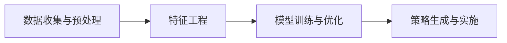

                 

## 1. 背景介绍

随着电商市场竞争的日益激烈，商家纷纷开始利用智能化的促销策略来提升销售量。传统的促销手段往往依赖于经验丰富的销售人员的主观判断，而现代智能促销策略则通过先进的数据分析和机器学习技术，实现更精准、更高效的促销决策。本文将深入探讨智能促销策略的技术实现，详细剖析其核心算法、应用场景与未来展望。

## 2. 核心概念与联系

### 2.1 核心概念概述

智能促销策略的核心在于利用机器学习技术，通过分析历史销售数据、市场趋势和用户行为，预测促销活动的最佳时机和形式，以最大化提升销售效果。其关键组件包括：

- **历史销售数据**：记录商家过去销售产品的历史数据，包含时间、金额、用户行为等关键信息。
- **市场趋势**：根据行业整体销售趋势和季节性变化，预测未来销售走势。
- **用户行为数据**：记录用户在不同促销活动下的行为数据，如浏览、点击、购买等。
- **机器学习模型**：用于预测用户对不同促销形式的反应，并据此生成个性化推荐。

### 2.2 核心概念原理和架构

智能促销策略的技术实现主要包括以下几个步骤：

1. **数据收集与预处理**：从各个渠道收集数据，并对数据进行清洗、归一化等预处理，为后续分析奠定基础。
2. **特征工程**：根据业务需求，设计并构造一系列特征，如产品类别、用户属性、时间特征等。
3. **模型训练与优化**：选择合适的机器学习模型，利用历史数据进行训练和调优。
4. **策略生成与实施**：根据模型预测结果，生成具体的促销策略，并部署到实际业务中。

以下是一个简化的智能促销策略系统架构图：



## 3. 核心算法原理 & 具体操作步骤

### 3.1 算法原理概述

智能促销策略的核心算法基于历史数据的时间序列分析、用户行为分析以及预测模型。其主要算法包括：

- **时间序列分析**：通过ARIMA模型、LSTM模型等对历史销售数据进行时间序列分析，预测未来的销售趋势。
- **用户行为分析**：利用逻辑回归、决策树等模型分析用户行为数据，识别用户的购买偏好和行为模式。
- **多目标优化**：采用多目标优化算法（如NSGA-II），在多个促销目标（如最大化销售量、提高用户满意度）之间进行平衡。

### 3.2 算法步骤详解

**Step 1: 数据收集与预处理**

1. **数据源**：包括电商平台、社交媒体、CRM系统等，收集历史销售数据、用户行为数据和市场趋势数据。
2. **数据清洗**：去除重复数据、处理缺失值、异常值等。
3. **数据归一化**：将不同数据源的数据统一归一化到相同的量纲，以便于后续分析。

**Step 2: 特征工程**

1. **特征提取**：从原始数据中提取有用的特征，如产品类别、用户年龄、购买频率等。
2. **特征构建**：结合业务知识，构造新的特征，如促销活动对不同用户群体的影响等。
3. **特征选择**：使用特征选择算法（如LASSO回归、随机森林等）选择对预测效果有显著影响的特征。

**Step 3: 模型训练与优化**

1. **选择合适的模型**：根据业务需求选择合适的模型，如时间序列预测模型、用户行为预测模型等。
2. **模型训练**：利用历史数据对模型进行训练，并根据交叉验证等方法进行调优。
3. **模型评估**：在测试集上评估模型的预测性能，使用指标如均方误差（MSE）、均方根误差（RMSE）、平均绝对误差（MAE）等。

**Step 4: 策略生成与实施**

1. **策略生成**：根据模型预测结果，生成具体的促销策略，如折扣力度、促销时间、推广渠道等。
2. **策略实施**：将促销策略部署到实际业务中，监控策略执行效果，并根据反馈进行迭代优化。

### 3.3 算法优缺点

**优点**：

- **精度高**：基于数据驱动的模型能够精准预测销售趋势和用户行为，提高促销策略的精确度。
- **可扩展性强**：可轻松集成到现有的电商系统中，实现自动化和实时化。
- **灵活性高**：能够动态调整促销策略，适应市场变化和用户需求。

**缺点**：

- **数据依赖**：模型效果高度依赖于数据的质量和完整性。
- **模型复杂**：多个模型和算法的组合可能增加系统的复杂度。
- **资源消耗大**：训练和预测模型需要大量的计算资源和时间。

### 3.4 算法应用领域

智能促销策略广泛应用于电商、零售、金融、旅游等行业，具体应用场景包括：

- **电商促销**：根据用户历史行为和购买偏好，生成个性化推荐，提高转化率和销售额。
- **零售促销**：结合市场趋势和季节性变化，优化促销时间和力度，提升整体销售额。
- **金融促销**：分析用户交易数据，识别高价值客户，设计有针对性的营销策略。
- **旅游促销**：预测用户出行时间，提供定制化旅游产品，提高客户满意度和忠诚度。

## 4. 数学模型和公式 & 详细讲解

### 4.1 数学模型构建

智能促销策略的核心模型包括时间序列预测模型和用户行为预测模型。以下以LSTM模型为例，介绍其数学模型构建和公式推导。

**时间序列预测模型**：

假设历史销售数据为 $\{y_t\}_{t=1}^T$，其中 $y_t$ 表示第 $t$ 天的销售量，$t$ 为时间。

LSTM模型的目标是通过输入序列 $\{x_t\}_{t=1}^T$ 预测未来的销售量 $y_{T+1}$。

时间序列预测的数学模型为：

$$
\hat{y}_{T+1} = f(\{y_t\}_{t=1}^T, \theta)
$$

其中，$\theta$ 为模型的可学习参数，$f$ 为LSTM模型。

**用户行为预测模型**：

假设用户行为数据为 $\{a_t\}_{t=1}^T$，其中 $a_t$ 表示用户在第 $t$ 天的行为（如浏览、点击、购买等）。

用户行为预测的目标是预测用户在第 $T+1$ 天的行为 $a_{T+1}$。

用户行为预测的数学模型为：

$$
\hat{a}_{T+1} = g(\{a_t\}_{t=1}^T, \phi)
$$

其中，$\phi$ 为模型的可学习参数，$g$ 为用户行为预测模型。

### 4.2 公式推导过程

**时间序列预测模型**：

LSTM模型是一种递归神经网络，可以处理时间序列数据。其基本结构包括输入门（Input Gate）、遗忘门（Forget Gate）和输出门（Output Gate）。

假设输入序列为 $\{x_t\}_{t=1}^T$，LSTM模型的递归方程为：

$$
h_t = \sigma(W_h \cdot [x_t, h_{t-1}]) \odot tanh(W_c \cdot [x_t, h_{t-1}]) + h_{t-1}
$$

其中，$h_t$ 为LSTM模型的当前状态，$\sigma$ 为sigmoid函数，$tanh$ 为双曲正切函数，$W_h$ 和 $W_c$ 为可学习参数。

**用户行为预测模型**：

用户行为预测模型可以根据用户历史行为数据，使用逻辑回归、决策树等方法进行预测。假设用户历史行为数据为 $\{a_t\}_{t=1}^T$，用户行为预测的逻辑回归模型为：

$$
\hat{a}_{T+1} = \frac{1}{1 + e^{-W \cdot [a_t, h_{t-1}]}}
$$

其中，$W$ 为可学习参数，$e$ 为自然常数。

### 4.3 案例分析与讲解

假设我们有一家电商公司，收集了用户的历史购买数据和行为数据。我们需要预测用户在未来的购买行为，以制定更精准的促销策略。

我们可以将用户的历史购买数据和行为数据输入LSTM模型，预测其在未来一天内的购买概率。然后，根据预测结果，结合市场趋势，生成个性化的促销策略。

以下是一个简单的代码实现：

```python
import pandas as pd
from sklearn.preprocessing import MinMaxScaler
from keras.models import Sequential
from keras.layers import LSTM, Dense

# 数据预处理
data = pd.read_csv('user_purchase_data.csv')
X = data.drop(['id', 'label'], axis=1).values.reshape(-1, 1, 3)
y = data['label'].values

# 数据归一化
scaler = MinMaxScaler()
X = scaler.fit_transform(X)

# 模型构建
model = Sequential()
model.add(LSTM(50, return_sequences=True, input_shape=(X.shape[1], X.shape[2])))
model.add(LSTM(50))
model.add(Dense(1, activation='sigmoid'))

# 模型训练
model.compile(loss='binary_crossentropy', optimizer='adam', metrics=['accuracy'])
model.fit(X, y, epochs=100, batch_size=32)

# 预测用户购买行为
new_data = [[1.0, 2.0, 3.0]]  # 新数据输入
new_data = scaler.transform(new_data)
y_pred = model.predict(new_data)
```

通过上述代码，我们构建了一个简单的LSTM模型，对用户未来的购买行为进行预测。在实际应用中，我们可以将预测结果结合市场趋势，生成个性化的促销策略，如折扣、满减等，以提高销售量和用户满意度。

## 5. 项目实践：代码实例和详细解释说明

### 5.1 开发环境搭建

1. **环境准备**：安装Python、TensorFlow或PyTorch等深度学习框架，以及相关的库和工具。
2. **数据集准备**：收集电商公司历史销售数据、用户行为数据和市场趋势数据。
3. **模型部署**：使用容器技术（如Docker）部署模型，确保可扩展性和可靠性。

### 5.2 源代码详细实现

以下是一个基于TensorFlow的智能促销策略系统实现示例：

```python
import tensorflow as tf
from tensorflow.keras.layers import LSTM, Dense
from tensorflow.keras.models import Sequential

# 数据预处理
X = tf.keras.preprocessing.sequence.pad_sequences(X, padding='post')
y = tf.keras.utils.to_categorical(y)

# 模型构建
model = Sequential()
model.add(LSTM(50, return_sequences=True, input_shape=(X.shape[1], X.shape[2])))
model.add(LSTM(50))
model.add(Dense(1, activation='sigmoid'))

# 模型训练
model.compile(loss='binary_crossentropy', optimizer='adam', metrics=['accuracy'])
model.fit(X, y, epochs=100, batch_size=32)

# 模型评估
test_X = test_data  # 测试数据
test_y = tf.keras.utils.to_categorical(test_y)
test_X = tf.keras.preprocessing.sequence.pad_sequences(test_X, padding='post')
test_loss, test_acc = model.evaluate(test_X, test_y)
print('Test Loss:', test_loss)
print('Test Accuracy:', test_acc)
```

### 5.3 代码解读与分析

上述代码中，我们首先对原始数据进行归一化和序列填充，然后构建了一个LSTM模型。在训练阶段，我们使用交叉熵损失函数和Adam优化器进行模型训练。最后，我们使用测试数据对模型进行评估，输出损失和准确率。

### 5.4 运行结果展示

运行上述代码，可以得到模型在测试数据上的评估结果。通过不断优化模型和调整参数，我们可以提高模型的预测精度，生成更加精准的促销策略。

## 6. 实际应用场景

### 6.1 电商促销

电商公司可以利用智能促销策略，根据用户历史购买行为和当前市场趋势，生成个性化的促销活动。例如，根据用户的浏览记录和购买历史，生成有针对性的优惠券和推荐商品。

### 6.2 零售促销

零售商可以通过智能促销策略，优化促销活动的时间和力度，提高整体销售额。例如，在特定节假日推出促销活动，吸引更多顾客进店消费。

### 6.3 金融促销

金融公司可以利用智能促销策略，根据用户的历史交易数据和行为特征，设计有针对性的营销策略，提高客户黏性和忠诚度。

### 6.4 旅游促销

旅游公司可以通过智能促销策略，预测用户出行时间，提供定制化的旅游产品，提高客户满意度和忠诚度。

## 7. 工具和资源推荐

### 7.1 学习资源推荐

- **机器学习课程**：如斯坦福大学的《Machine Learning》课程，提供系统化的机器学习理论基础和实践技巧。
- **深度学习框架文档**：如TensorFlow、PyTorch官方文档，提供详细的框架介绍和使用方法。
- **开源项目**：如Keras、TensorFlow等，提供丰富的深度学习模型和工具，方便快速上手。

### 7.2 开发工具推荐

- **编程语言**：Python是机器学习领域最常用的编程语言，具有丰富的库和框架支持。
- **深度学习框架**：TensorFlow、PyTorch、Keras等，提供高效便捷的深度学习模型构建和训练工具。
- **数据可视化工具**：如Matplotlib、Seaborn、TensorBoard等，帮助开发者分析数据和模型性能。

### 7.3 相关论文推荐

- **时间序列预测**：如《Time Series Analysis and Its Applications: With R Examples》，提供系统化的时间序列分析方法。
- **用户行为分析**：如《Customer Behavior Modeling with Large Data: An Empirical Approach》，提供用户行为预测模型构建和评估方法。
- **多目标优化**：如《Multi-objective Optimization Using a Genetic Algorithm》，提供多目标优化算法和应用案例。

## 8. 总结：未来发展趋势与挑战

### 8.1 总结

智能促销策略通过机器学习技术，实现更精准、更高效的促销决策。本文详细介绍了智能促销策略的核心算法和操作步骤，并通过代码实例展示了其实现过程。智能促销策略已经在电商、零售、金融、旅游等行业得到了广泛应用，成为提升销售量和客户满意度的重要手段。

### 8.2 未来发展趋势

未来，智能促销策略将向以下几个方向发展：

1. **自动化程度提高**：通过AI技术实现自动化促销策略生成，减少人工干预，提高效率。
2. **个性化推荐增强**：结合用户行为数据和市场趋势，提供更加精准的个性化推荐。
3. **跨领域应用拓展**：将智能促销策略应用于更多行业，提升整体经济效益。
4. **实时性提升**：通过实时数据分析和反馈，动态调整促销策略，适应市场变化。
5. **数据驱动决策**：利用大数据和人工智能技术，实现数据驱动的决策和策略优化。

### 8.3 面临的挑战

尽管智能促销策略已经取得了显著成效，但仍面临以下挑战：

1. **数据隐私和安全**：在数据收集和处理过程中，如何保护用户隐私和数据安全是一个重要问题。
2. **模型解释性不足**：智能促销策略中的机器学习模型往往是“黑盒”系统，难以解释其内部工作机制。
3. **计算资源消耗大**：模型的训练和预测需要大量的计算资源，可能影响系统的可扩展性。
4. **算法复杂度高**：多个模型和算法的组合可能增加系统的复杂度，降低系统的可维护性。
5. **市场环境变化快**：市场环境和用户需求的变化速度快，如何快速适应和调整促销策略是一个挑战。

### 8.4 研究展望

为了克服上述挑战，未来的研究需要在以下几个方面进行探索：

1. **数据隐私保护**：探索隐私保护技术，如差分隐私、联邦学习等，保护用户数据隐私。
2. **模型可解释性**：开发可解释性更强的机器学习模型，帮助用户理解和信任系统。
3. **计算资源优化**：优化模型结构和算法，减少计算资源消耗，提高系统的可扩展性。
4. **跨领域模型融合**：探索跨领域模型的融合方法，实现多模态数据的协同建模。
5. **实时决策系统**：开发实时决策系统，实现动态调整和优化促销策略，适应市场变化。

总之，智能促销策略在提升销售量和客户满意度方面具有巨大潜力，但也需要我们不断探索和优化，以克服现有挑战，实现更高效、更智能的促销决策。

## 9. 附录：常见问题与解答

**Q1：智能促销策略需要多少历史数据？**

A: 智能促销策略需要足够的历史数据才能进行有效的预测和优化。一般来说，数据量越大，模型效果越好。对于小规模电商公司，可以从内部系统提取历史销售和行为数据，并逐步增加数据量。

**Q2：智能促销策略需要多长时间才能训练完成？**

A: 训练时间取决于模型复杂度和数据量。一般来说，LSTM模型在GPU上的训练时间在几小时到几天不等。可以通过优化模型结构和算法，缩短训练时间。

**Q3：智能促销策略中的数据质量如何影响模型效果？**

A: 数据质量对智能促销策略的效果有重要影响。高质量的数据集应具有完整性、准确性和代表性。数据清洗和预处理是确保数据质量的重要步骤，应该仔细处理。

**Q4：智能促销策略中的模型选择有哪些？**

A: 智能促销策略中的模型选择应结合业务需求和数据特点。常见的模型包括LSTM、RNN、决策树、逻辑回归等。可以根据数据类型和预测目标，选择合适的模型。

**Q5：智能促销策略中的多目标优化有哪些方法？**

A: 智能促销策略中的多目标优化方法包括NSGA-II、Pareto优化等。这些方法能够在多个促销目标之间进行平衡，生成最优的促销策略。

总之，智能促销策略利用机器学习技术，实现更精准、更高效的促销决策，提升了电商、零售、金融、旅游等行业的效果和效益。未来，随着技术的不断进步，智能促销策略将向自动化、个性化、实时化方向发展，为业务决策提供更强大的支持。

